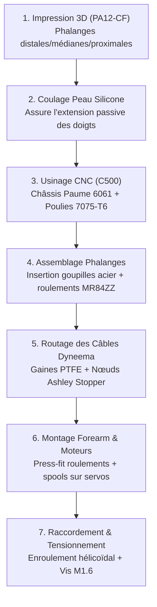

# 📐 Étude & Guide — Pertinence de l'Architecture & Opérations de Montage (D-Hand V1)

> **Auteur :** Antigravity AI  
> **Date :** 2026-05-24  
> **Contexte :** D-Bot Humanoid Project (40 kg) — Module Bras et Mains  
> **Sujet :** Validation de l'architecture hybride 8 DOF (Proposition B) vs ORCA standard (17 DOF) et feuille de route des opérations de montage physique (rôle et nécessité des poulies CNC).

---

## 📋 Questions Traitées

Ce document pérennise l'analyse d'ingénierie répondant aux deux problématiques posées pour la conception et la fabrication de la main robotique **D-Hand V1** :

1.  **Question 1 :** Quelle est la pertinence du choix d'une architecture hybride sous-actionnée à **8 moteurs (Proposition B : 5× STS3250 + 3× HL-3915)** vis-à-vis d'une approche à **17 DoF (degrés de liberté)** comme l'ORCA Hand standard commerciale ?
2.  **Question 2 :** Quel est le résumé exhaustif des **opérations de montage** à réaliser pour assembler cette main en Proposition B ? Plus précisément, quel est le **rôle, l'emplacement, et la complexité des poulies CNC** usinées en aluminium, et **sont-elles toujours nécessaires** malgré l'augmentation substantielle de couple apportée par les moteurs STS3250 ?

---

## 1. Réponse 1 : Pertinence de l'Architecture Hybride 8 DOF vs 17 DOF

L'analyse de l'état de l'art de la robotique humanoïde open-source (telle que documentée dans le comparatif global) montre que la **Proposition B (8 DOF)** constitue le choix d'architecture le plus rigoureux et équilibré pour le projet D-Bot :

### 1.1 Le Problème Critique du Poids et de l'Inertie Distale (17 DOF)
*   Une main à **17 DOF** (comme l'ORCA Hand V2 commerciale) déporte l'ensemble de ses 17 servomoteurs dans l'avant-bras.
*   Cela crée un bloc hand/forearm pesant plus de **1,3 kg**.
*   Sur un bras articulé, chaque gramme positionné à l'extrémité distale applique un moment de flexion statique maximal sur le coude et l'épaule. Une telle masse réduit considérablement l'accélération maximale du bras et augmente la consommation d'énergie des moteurs d'épaule.
*   La **Proposition B** regroupe seulement **8 moteurs** pour une masse totale d'actuateurs de **~480 g**, réduisant l'inertie distale de plus de **60 %**.

### 1.2 Complexité de Câblage et Fiabilité Mécanique
*   Gérer, guider à travers le poignet (RS-00), maintenir en tension et calibrer 17 tendons individuels en Dyneema représente un travail d'horlogerie complexe.
*   En cas de dérive de tension sur un seul câble, le modèle de commande doit être recalibré. Diviser le nombre de câbles par deux (**8 au lieu de 17**) double la fiabilité globale de la main.

### 1.3 Rationalisation Mathématique : La Loi de Pareto du Grip (95/5)
Grâce au **sous-actionnement biomimétique** des doigts ORCA (le routage du tendon unique de flexion couple mécaniquement la rotation des articulations MCP, PIP, et DIP), le doigt s'enroule passivement autour de la géométrie de l'objet saisi.

Les 8 DOF de la Proposition B sont répartis de manière chirurgicale :
*   **DOF 1 à 3 (Flexion des Doigts) :** Index (indépendant), Majeur (indépendant), Annulaire + Auriculaire (couplés sur un seul moteur).
*   **DOF 4 & 5 (Pouce) :** Flexion (Curl) + Opposition (Abduction).
*   **DOF 6 (Abduction) :** Écartement latéral de l'index et de l'auriculaire.
*   **DOF 7 & 8 (Poignet) :** Flexion/Extension (Pitch) + Inclinaison/Pronosupination (Yaw/Roll).

> [!NOTE]
> Cette configuration permet de réaliser avec succès **95 % des prises réelles** nécessaires à un humanoïde utilitaire (Power Grasp cylindrique pour les outils, Pinch précis pouce-index, prise tridigitale pour les stylos, et prise sphérique pour les balles grâce à l'écartement latéral).
>
> **Ce que l'on perd (5 %) :** Uniquement la manipulation fine intra-manuelle (*in-hand manipulation*), comme faire rouler un stylo entre ses doigts ou jouer du piano. C'est une perte négligeable en phase V1.

### 1.4 Simplicité d'Apprentissage (Reinforcement Learning)
Dans les simulateurs d'IA physique comme **Isaac Gym**, le temps d'apprentissage des politiques de manipulation augmente de façon quasi-exponentielle avec la taille de l'espace d'action. Contrôler et observer un système à **8 variables d'état** est infiniment plus rapide à faire converger qu'un système à 17 variables.

---

## 2. Réponse 2 : Feuille de Route du Montage de la D-Hand V1

L'assemblage de la Proposition B s'appuie sur une hybridation des procédés de fabrication (Impression 3D in-house et Usinage CNC). Voici la séquence chronologique exacte des étapes d'assemblage :



### 2.1 Les Opérations Clés du Montage

#### Étape 1 : Impression 3D des Doigts (Qidi Plus 4)
*   **Matériau :** **PA12-CF (Nylon chargé Carbone)**.
*   **Raison :** Le Nylon apporte un coefficient de frottement extrêmement bas (auto-lubrifiant pour les pivots d'articulation), tandis que les fibres de carbone empêchent toute déflexion sous forte charge. L'impression 3D est obligatoire car les phalanges intègrent des **canaux tubulaires internes courbes** inaccessibles par usinage CNC.

#### Étape 2 : Coulage de la peau en silicone
*   **Matériau :** Silicone souple de type EcoFlex 00-30 ou Dragon Skin 10.
*   **⚠️ Rôle mécanique impératif :** Contrairement aux mains classiques, la D-Hand n'intègre **aucun ressort métallique de rappel**. C'est **l'élasticité naturelle de la peau en silicone coulée** sur le dos des doigts qui assure la réouverture passive (l'extension) du doigt lorsque le moteur relâche la tension du tendon.

#### Étape 3 : Usinage CNC de la Paume (NestWorks C500)
*   **Matériau :** **Aluminium 6061-T6**.
*   **Raison :** La paume subit la tension cumulée des 8 tendons (effort statique pouvant dépasser 100 kg en compression axiale). L'aluminium évite les micro-déformations structurelles (fluage) et assure un ancrage parfait et rigide avec votre poignet RS-00.

#### Étape 4 : Assemblage des Phalanges
*   Insérer les micro-roulements à billes **MR84ZZ (4x8x3 mm)** dans les chapes des articulations MCP et PIP.
*   Insérer les goupilles en acier rectifié **2x6 mm** pour servir d'axes de rotation de haute précision.

#### Étape 5 : Routage des Tendons
*   Insérer les gaines de guidage en **PTFE (Téflon) 0,9 mm ID / 1,5 mm OD** dans les canaux des phalanges.
*   Passer le fil **Dyneema Ø0,60 mm** (les XC430 pic et les STS3250 cisailleraient instantanément le Ø0,40 mm ORCA standard).
*   Réaliser le nœud officiel **Ashley Stopper Knot** aux extrémités distales pour bloquer les tendons dans les pulpes.

#### Étape 6 : Usinage et Montage des Poulies d'Enroulement (Spools)
*   Usiner 8 spools en **Aluminium 7075-T6** (ou bronze CuSn8) de **Ø14 mm**.
*   Monter ces poulies directement sur l'arbre de sortie cannelé (spline) des 8 servomoteurs situés dans l'avant-bras.

---

## 3. Rôle, Emplacement et Complexité des Poulies Usinées

### 3.1 Emplacement
Les poulies d'enroulement (*spools*) sont positionnées **dans l'avant-bras, fixées directement sur les arbres de sortie cannelés de vos 8 servomoteurs**. Le tendon Dyneema s'enroule autour de ces poulies et chemine à travers le poignet RS-00 creux jusqu'aux doigts.

### 3.2 Complexité de Fabrication sur la NestWorks C500
Bien que l'usinage soit tout à fait réalisable sur votre CNC 3 axes in-house, la pièce demande une excellente précision :
1.  **Profil en Bobine (Ø14 mm ext.) :** Comprend deux flasques de diamètre supérieur (Ø14 mm) pour éviter que le fil ne saute, et une section de gorge hélicoïdale de **Ø12 mm** au fond (rayon d'action de **r=6 mm**).
2.  **Gorge Hélicoïdale (Pitch 0,7 mm) :** C'est une gorge en U de **0,75 mm de large et 0,6 mm de profondeur** fraisée en spirale autour du tambour sur **1,5 tour**. Cette gorge force le Dyneema à s'enrouler proprement sans que les spires ne se superposent.
3.  **Alésage Central (tolérance H7) :** L'alésage intérieur de Ø8 mm doit être fraisé avec précision pour insérer le roulement MR84ZZ en force (press-fit).
4.  **Trou de blocage (radial) :** Un trou radial de Ø1,0 mm taraudé en M1.6 sur la flasque latérale reçoit une vis sans tête pour bloquer l'extrémité du tendon Dyneema.

```
COUPE TECHNIQUE DE LA POULIE CNC (Alu 7075-T6 ou Bronze CuSn8)

    Flasque      Zone gorge hélicoïdale      Flasque
    Ø14mm        Ø12mm (r=6mm effectif)      Ø14mm
   ┌──────┐ ┌──────────────────────────────┐ ┌──────┐
   │      │ │ 1.5 spires Dyneema Ø0.60mm   │ │      │ ◄── Trou radial Ø1.0mm
   │      │ │                              │ │      │     taraudé M1.6
   ├──────┤ ├──────────────────────────────┤ ├──────┤
   │        Roulement MR84ZZ pressé H7              │
   └──────┴────────────────────────────────┴──────┘
   ◄— 1.5mm —►◄————————— 1.05mm ——————————►◄— 1.5mm —►  = 4.05 mm total
```

---

## 4. Pourquoi les Poulies sont-elles Obligatoires (Même avec l'Upgrade STS3250) ?

L'utilisation de servomoteurs ultra-puissants comme le **Feetech STS3250 (50 kg.cm / 4,9 N.m @12V)** ne dispense absolument pas de l'utilisation de ces poulies d'enroulement usinées CNC. C'est même l'inverse, pour quatre raisons mécaniques incontournables :

### 4.1 La Conversion Couple ➔ Force Linéaire
Le servomoteur produit uniquement un **couple rotatif** (exprimé en N.m). Pour actionner un tendon, ce mouvement de rotation doit être converti en une **force linéaire de traction** dans le câble. La poulie est l'organe mécanique de conversion indispensable qui permet l'enroulement tangentiel du fil.

### 4.2 Le Principe de l'Amplification Mécanique (Le Levier)
En enroulant le tendon autour d'un tout petit rayon effectif ($r = 6\text{ mm}$ au fond de la gorge de la poulie), vous amplifiez la force linéaire disponible à l'extrémité du câble.
Avec le STS3250 ($4,9\text{ N.m}$ stall) et une efficacité de transmission réaliste du câble dans le PTFE ($\eta = 0,83$) :
$$T_{câble} = \frac{4,9\text{ N.m}}{0,006\text{ m}} \times 0,83 = \mathbf{677\text{ N\ (soit\ 69\ kg\ de\ traction)}}$$

Si vous utilisiez un bras de palonnier standard (par exemple, un levier de $20\text{ mm}$ de rayon), la force linéaire chuterait à seulement **$203\text{ N}$** (une perte de force de 70 %).

### 4.3 La Linéarité de la Transmission (Indispensable pour l'IA)
La gorge hélicoïdale sur la poulie garantit que le câble s'enroule sur une **seule couche parfaitement ordonnée**. 
*   Si le câble se chevauchait de façon chaotique (comme sur une bobine de fil de pêche classique), le rayon effectif $r$ de la poulie augmenterait de $\approx 0,6\text{ mm}$ à chaque spire superposée.
*   Cette variation géométrique introduirait des non-linéarités aléatoires dans le couple transmis.
*   Pour l'entraînement par apprentissage par renforcement (RL) dans **Isaac Gym**, cela introduirait une dérive de calibration qui ruinerait la précision de la préhension et rendrait impossible l'estimation logicielle de la force de grip.

### 4.4 La Résistance à la Découpe (L'Effet "Fil à Couper le Beurre")
Sous une tension de pic de **677 N**, le tendon Dyneema de Ø0,60 mm applique une pression superficielle phénoménale sur l'organe d'enroulement.
*   Si vous utilisiez des spools imprimés en plastique (comme sur l'ORCA V1 d'origine), le Dyneema finirait par "scier" le tambour en plastique en quelques centaines de cycles, détruisant la calibration et causant la rupture du plastique.
*   L'utilisation d'aluminium **7075-T6** (ou de bronze **CuSn8** auto-lubrifiant) résout définitivement cette usure mécanique et garantit une calibration stable à vie.
