# Guide de Montage Complet : Doigts & Tendons ORCA (Traduit & Adapté D-Hand)

> **Source officielle :** [orcahand.com/legacy/files#assembly](https://www.orcahand.com/legacy/files#assembly)
> **Vidéo de montage officielle :** [YouTube — Assemblage ORCA (t=3s)](https://youtu.be/va7ZUgVrn84?t=3)
> **Vidéo de présentation :** [YouTube — Release ORCA Hand](https://www.youtube.com/watch?v=WNtlUViSrPg)
>
> ⚠️ *Ce guide est localement traduit et adapté pour la D-Hand Hybrid (8 DOF). Les étapes concernant la motorisation ORCA (17 servos Feetech dans la tour imprimée, étapes 08 à 25) sont mentionnées mais non détaillées, car remplacées par notre architecture **Feetech Hybrid Premium** (5× STS3250 + 3× HL-3915) avec spools CNC usinés.*

---

## Étape 00 — Introduction : Tendons et Nœuds

### Principes Fondamentaux

Le **Nœud Ashley Stopper** (aussi appelé "Oysterman's Stopper") est utilisé massivement à travers tout le montage. Il constitue la méthode de fixation officielle de tout tendon dans la main ORCA.

🔗 **[Tutoriel animé : Comment réaliser un nœud Ashley Stopper](https://www.animatedknots.com/ashley-stopper-knot)**
▶️ **[Vidéo de montage complète sur YouTube](https://youtu.be/va7ZUgVrn84?t=3)** *(à regarder en premier pour se familiariser avec les gestes)*

### Règles impératives avant de commencer :

1. **Serrez toujours les nœuds fermement** en tirant des deux côtés. Utilisez des pinces à bec plat pour appliquer une tension supplémentaire. Un nœud lâche se défait à l'usage répété.
2. **Laissez toujours une courte queue (~0.5 cm)** après la coupe du tendon excédentaire. Cette queue empêche le nœud de se défaire dans le temps.
3. **Lame de rasoir ou scalpel obligatoire** pour couper le Dyneema. Appliquer une tension sur le fil et couper en un seul mouvement net (sans va-et-vient). Ne jamais utiliser de ciseaux ni de lames émoussées : les brins se séparent, rendant l'insertion dans les canaux impossible.
4. **Si l'insertion du tendon dans un canal échoue plusieurs fois**, couper à nouveau l'extrémité du fil pour avoir une coupe nette, et recommencer. Les tolerances sont serrées, mais un bout propre passera.
5. **Utilisez des brucelles (tweezers)** pour appliquer une pression uniforme et guider le tendon. Elles ne sont pas représentées dans les photos des étapes pour la lisibilité, mais elles sont **vivement recommandées**.

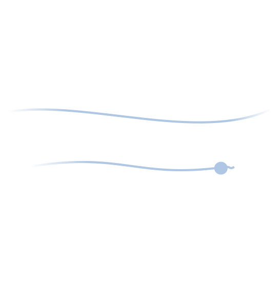
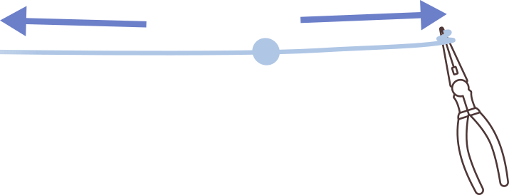
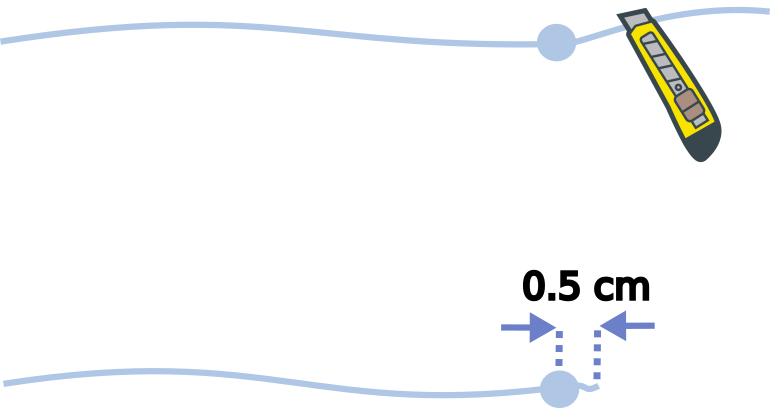
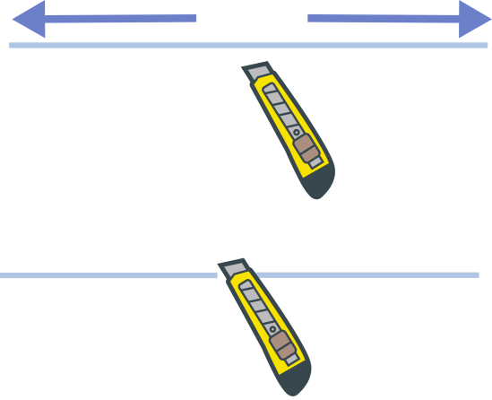
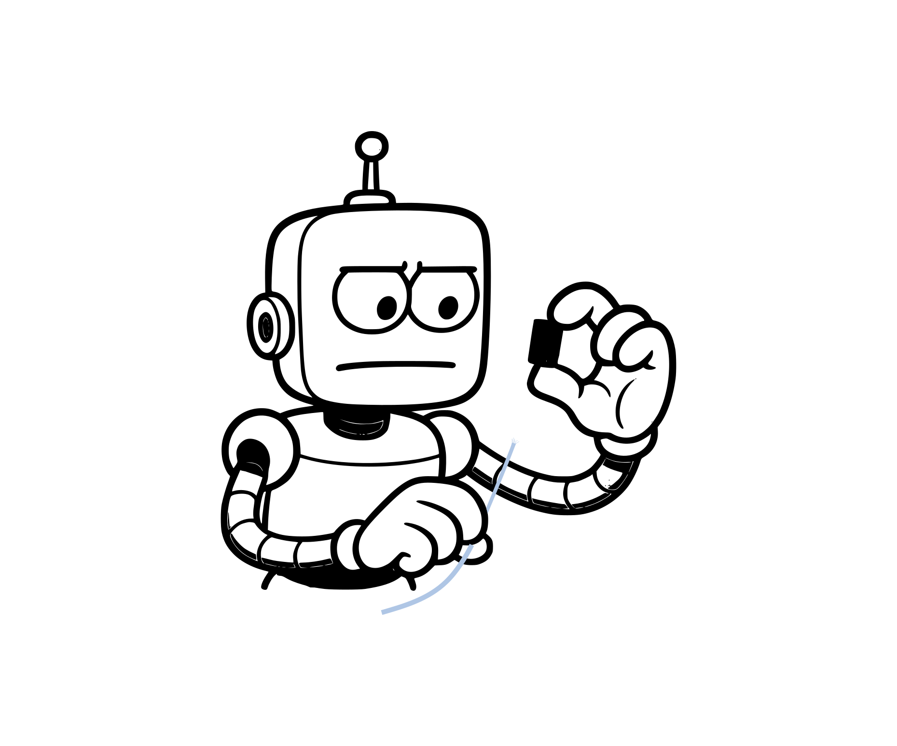
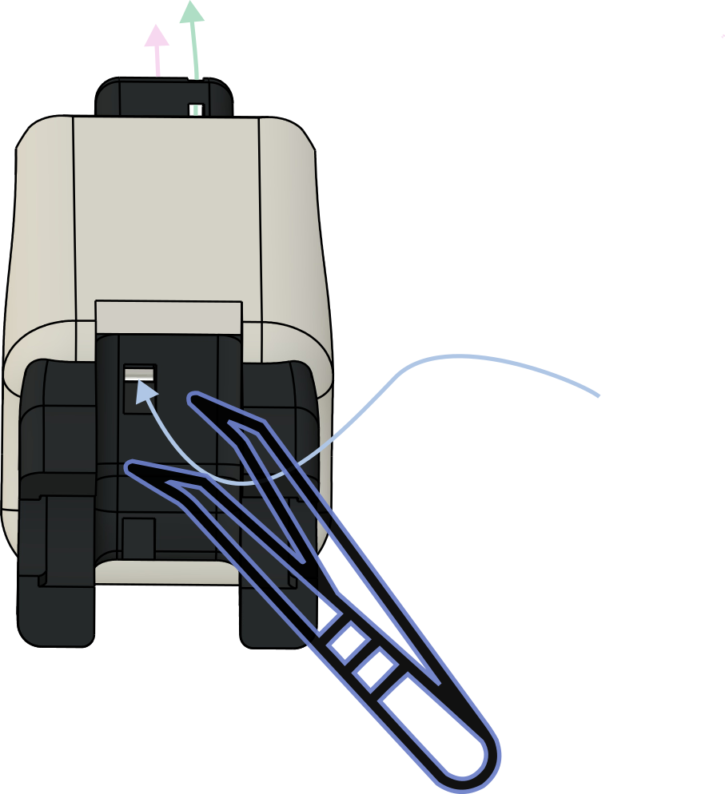
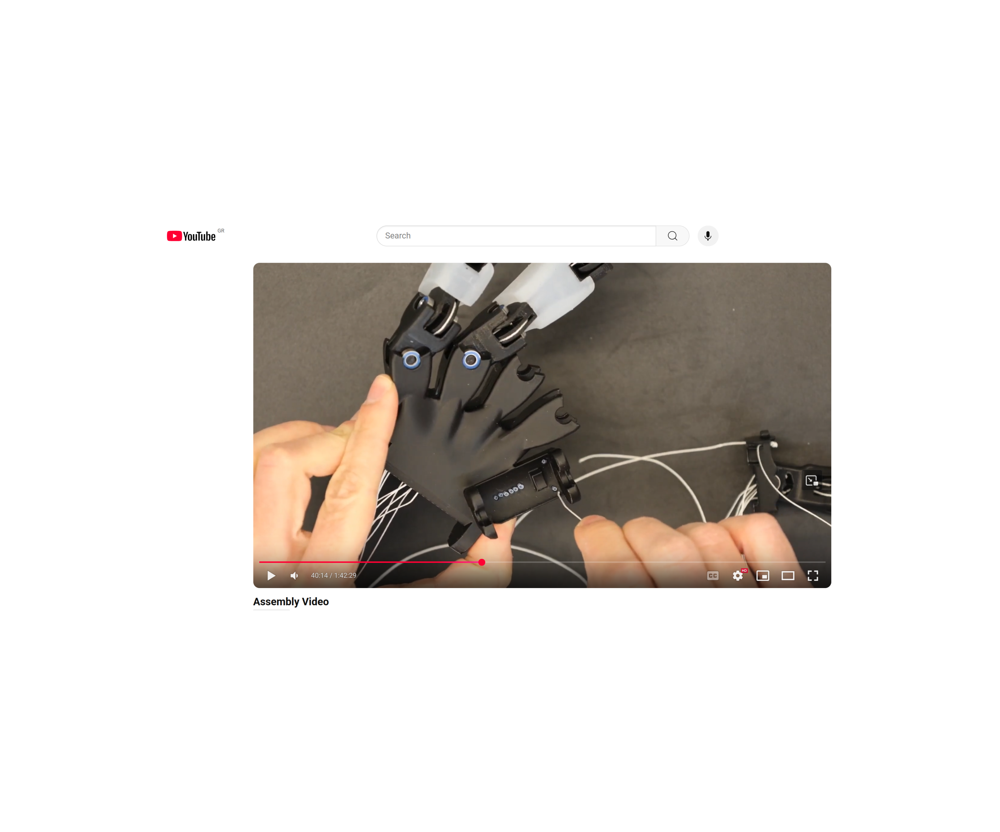

> [!NOTE]
> *Adaptation D-Hand :* Le matériau officiel ORCA est du Dyneema Ø0.40–0.41 mm. **La D-Hand Hybrid Premium utilise du Vectran LCP Ø0.80 mm** (fluage quasi nul, résistance à la rupture ~950 N) pour supporter le couple 2× supérieur des STS3250 (50 kg·cm stall) et éliminer le recalibrage périodique.

---

## Étape 01 — Routage des Tendons de la Pulpe Distale (Fingertip)

> ⚠️ **Divergence de Câblage D-Hand vs ORCA :**
> *   **ORCA d'origine (BOM du PDF) :** Utilise un câble unique de Dyneema 0.40 mm replié en boucle de 1.5 m avec 2 nœuds Ashley au bout du doigt. Le même câble fait l'aller-retour : un brin sert de fléchisseur (bas) et l'autre d'extenseur (haut).
> *   **D-Hand V1 (Notre Choix) :** Nous n'utilisons **PAS** de boucle continue du même fil. La flexion (active, 50 kg·cm) et l'extension (passive) ont des contraintes opposées. Nous utilisons **deux lignes indépendantes de matériaux différents** :
>     1.  **Tendon Fléchisseur (Bas) :** Un brin unique de **Dyneema DM20 Ø1.0 mm**, ancré à la pointe par un manchon (sleeve) en aluminium ou cuivre Ø1.5 mm noyé dans un lamage de Ø2.8 x 5.5 mm. Il descend par le canal inférieur vers l'avant-bras.
>     2.  **Tendon Extenseur / Retour Passif (Haut) :** Un brin unique de **fil élastique TPU Ø0.8 mm**, ancré au bout du doigt par un nœud simple ou un manchon et descendant par le canal supérieur.

Pour le fléchisseur, passez le brin de Dyneema DM20 Ø1.0 mm (avec son manchon alu préalablement serti à l'extrémité) à travers le canal inférieur de la phalange. Tirez fermement pour loger le manchon dans son évidement. Pour l'extenseur, enfilez le fil élastique TPU Ø0.8 mm dans le canal supérieur et sécurisez-le par un nœud d'arrêt au bout du doigt.

*Répétez pour tous les doigts, y compris le pouce.*

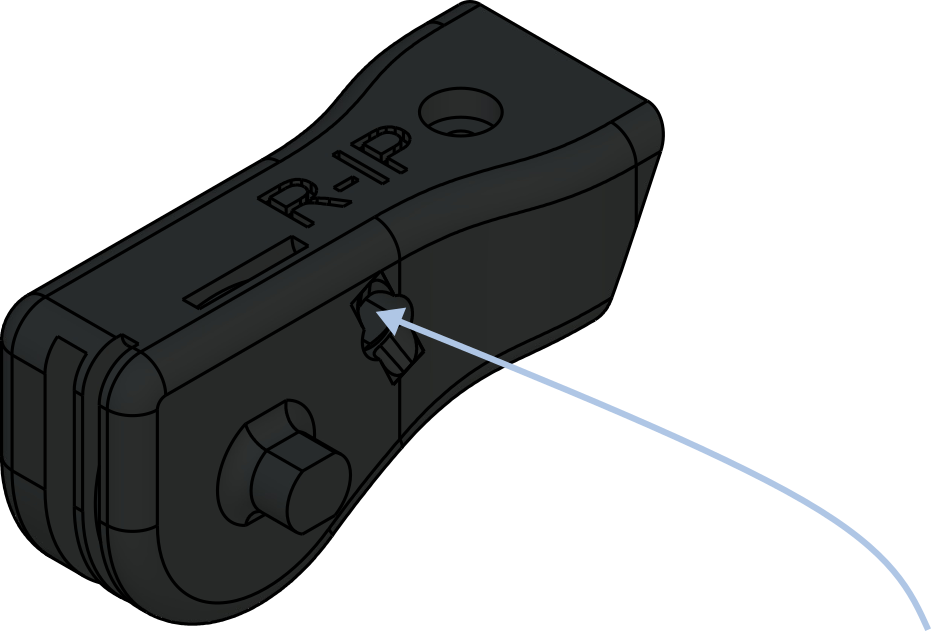
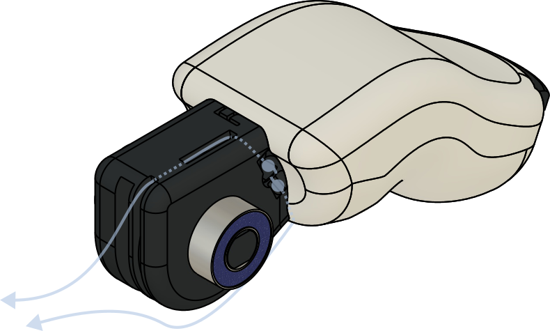

---

## Étape 02 — Routage du Tendon de la Phalange Proximale (PP)

Insérez d'abord les **goupilles cylindriques (2×6 mm acier)** qui serviront d'axes des articulations. Aidez-vous d'une autre goupille ou d'un tournevis fin pour les guider en tapotant doucement depuis le côté opposé avec un maillet.

⚠️ **Attention critique :** La goupille doit rentrer parfaitement droite. Une insertion en angle la rend inamovible et peut forcer la casse de la phalange imprimée.

Une fois la goupille en place, insérez le tendon depuis le trou lateral et réalisez le même nœud Ashley que pour l'étape 01.

*Répétez pour tous les doigts, y compris le pouce.*

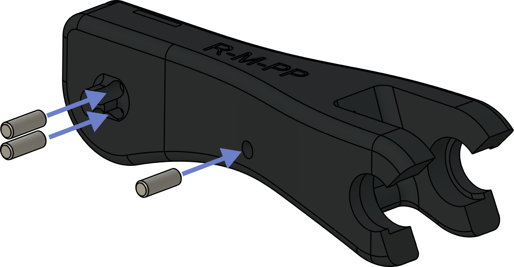
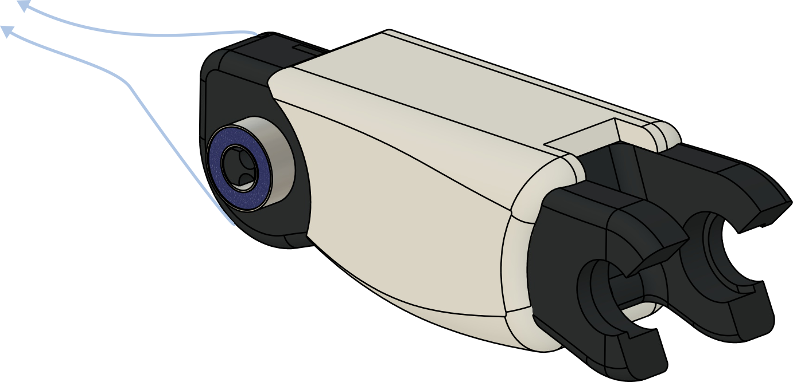

---

## Étape 03 — Routage des Tendons d'Abduction (Écartement des Doigts)

Prenez **2 tendons de 50 cm** (sans nœuds initiaux) et insérez-les sur le coté de la pièce articulation de'abduction (base du doigt, pièce en "T"). Une fois passés à travers les trous traversants, réalisez un nœud Ashley à l'extrémité de **chacun** des deux tendons sortants. Tirez les deux tendons vers l'arrière pour verrouiller les nœuds dans leurs logements.

*Répétez pour tous les doigts, sauf le pouce (qui a son propre système — voir Étape 06).*

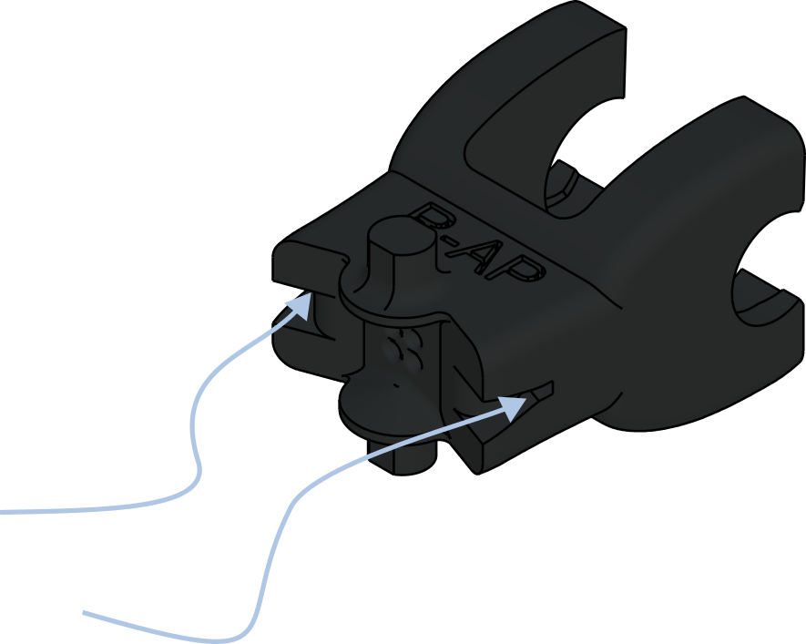
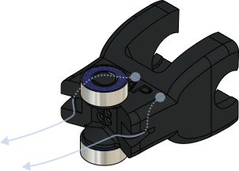

---

## Étape 04 — Coulée de la Peau en Silicone (Skin Casting)

> [!IMPORTANT]
> **Divergence cinématique majeure ORCA vs D-Hand :**
> L'ORCA V1 d'origine est une main active antagoniste à 17 moteurs : chaque articulation dispose de deux tendons actifs (un fléchisseur et un extenseur) enroulés en sens inverse sur le même spool moteur. L'extension y est donc **active** et traverse le poignet.
>
> La D-Hand V1 étant sous-actionnée (8 moteurs actifs de flexion uniquement), elle requiert un **mécanisme de retour passif**. Celui-ci est assuré par un **tendon élastique dorsal en polyuréthane/silicone (Beadalon Ø0.8 mm)** logé dans le canal supérieur d'origine, complété par l'élasticité de la gaine externe en TPU.
>
> **Règle d'Ancrage et Découplage du Poignet :**
> L'élastique dorsal ne doit **pas** traverser le poignet vers l'avant-bras pour éviter tout couplage parasite lors des mouvements du poignet. Il est **ancré statiquement à la base de la paume (dans la pièce Carpals)** à l'aide d'une vis sans tête M3 latérale faisant office de pince-câble.
>
> **Méthode simple pour mesurer la pré-tension de 2 N (200 g) :**
> Pour calibrer précisément et facilement la tension de rappel de chaque doigt sans appareil de mesure complexe :
> 1. Suspendez la main verticalement (doigts vers le haut, poignet vers le bas, paume horizontale).
> 2. Laissez pendre le fil élastique TPU de 0.8 mm à la sortie de son canal sous la paume (Carpals).
> 3. Attachez une **masse de 200 grammes** (par exemple, une petite bouteille contenant exactement 200 ml d'eau, ou un poids de 200 g) à l'extrémité libre de l'élastique à l'aide d'une pince ou d'un nœud.
> 4. Laissez la gravité appliquer la tension (la masse de 200g exerce exactement une force de traction verticale de **1.96 N**, soit environ 2 N).
> 5. Pendant que la masse est suspendue et applique la tension idéale, serrez fermement la **vis sans tête M3** latérale dans la pièce Carpals pour bloquer l'élastique. Coupez le surplus de fil à ras.
>
> **Cette étape de gainage TPU et de mise sous tension des élastiques (2 N) est obligatoire** pour assurer une ouverture de doigt franche et dynamique.

Imprimez les moules négatifs (ORCA_Molds.zip dans `Ressources 3D/ORCA_Hand`). Coulez-y un silicone de type EcoFlex 00-30 ou Dragon Skin 10 (si option silicone retenue) ou utilisez la gaine TPU Qidi (option standard D-Hand). Laissez polymériser selon les instructions du fabricant (généralement 4h à température ambiante). Démoulez avec précaution.

---

## Étape 05 — Assemblage Final du Doigt

Vous pouvez code-couleur vos tendons au marqueur pour vous repérer.
- Le tendon **extenseur passif** (fil élastique TPU Ø0.8 mm qui ouvre le doigt) passe par le **trou supérieur** de l'assemblage PP et s'ancrera statiquement dans la paume (Carpals) à l'aide de la vis M3 sous tension de 2 N (méthode de la masse suspendue de 200g).
- Le tendon **fléchisseur actif** (câble Dyneema DM20 Ø1.0 mm qui ferme le doigt) passe par le **trou inférieur** de l'assemblage PP, traverse le poignet et rejoint les spools des moteurs de l'avant-bras.

Emboîtez l'assemblage de la phalange distale sur l'assemblage PP en l'enfonçant jusqu'au déclic d'emboîtement. Les roulements **MR84ZZ** (4×8×3 mm) s'emboîtent à ce stade dans les logements de la phalange pour y éliminer toute friction axiale.

*Répétez pour tous les doigts sauf le pouce.*

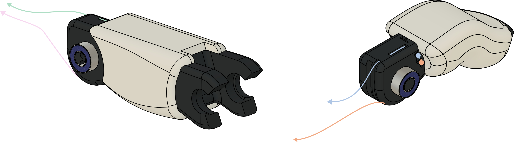
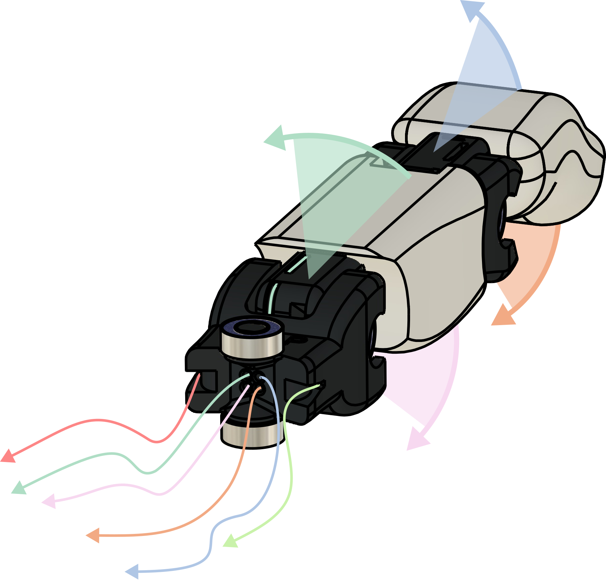

---

## Étape 06 — Routage du Tendon d'Abduction du Pouce

Même procédure que l'Étape 03, mais appliquée à la pièce spécifique d'abduction du pouce (géométrie différente car le pouce pivote sur un plan différent). Deux tendons de 50 cm, nœud Ashley à chaque extrémité sortante, tirez pour verrouiller.

Vérifiez le routage : tirez manuellement sur chaque tendon et observez que l'articulation tourne de façon fluide dans les deux sens avant de clore l'assemblage.

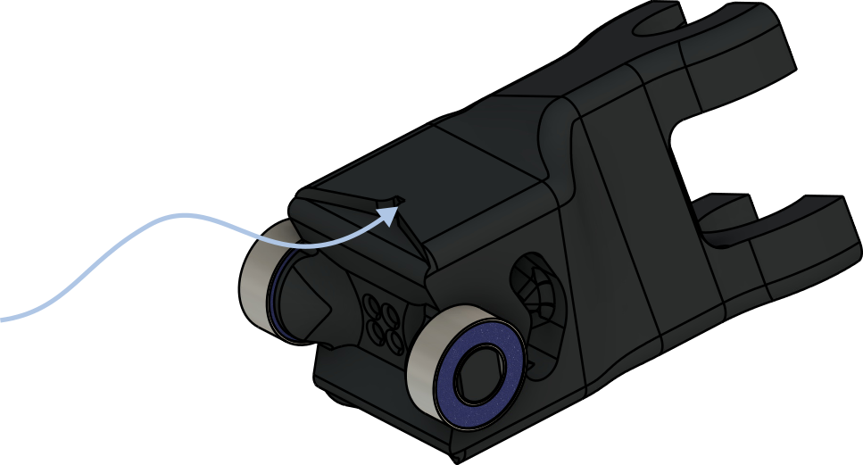

---

## Étape 07 — Assemblage du Pouce Complet

Faites passer tous les tendons du pouce à travers le grand canal d'accès prévu. Emboîtez ensuite les composants du pouce en les enfonçant jusqu'à l'enclenchement. Le pouce a une cinématique avec opposition (DOF 5) et flexion (DOF 4), ses tendons rejoindront deux sorties dédiées sur la paume CNC.

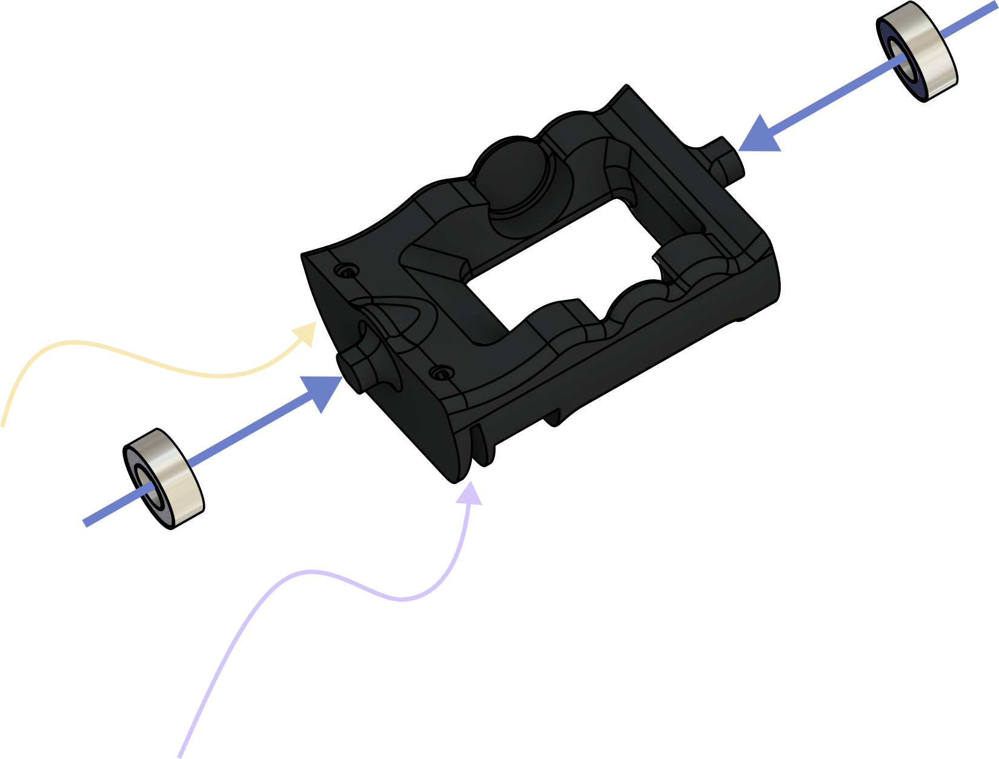

---

## Étape 26 — Enroulement des Tendons sur les Spools (Poulies CNC)

> [!NOTE]
> *Adaptation D-Hand :* L'ORCA enroule les tendons sur les spools plastiques fixés sur les servos Feetech. **Sur la D-Hand Hybrid Premium,** les tendons Vectran LCP Ø0.80mm s'enroulent sur nos **poulies CNC usinées en aluminium 7075-T6 (Ø14mm, gorge hélicoïdale 0.75mm, 1.5 tour, roulement MR84ZZ intégré)** montées sur les axes des moteurs STS3250/HL-3915. Le tendon est bridé par vis sans tête M1.6 radiale (aucun nœud).

Procédure générique :
- Saisir le tendon libre qui sort de la paume (côté avant-bras).
- L'introduire dans la gorge hélicoïdale de la poulie CNC.
- Faire 1.5 tour d'enroulement dans la gorge.
- Tirer fermement pour établir une pré-tension de 10–15 N, puis serrer la vis sans tête M1.6 pour brider le câble (voir §Étape 7 du GUIDE_COMPLET).

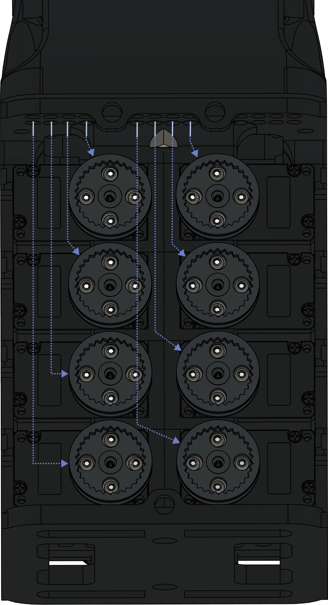
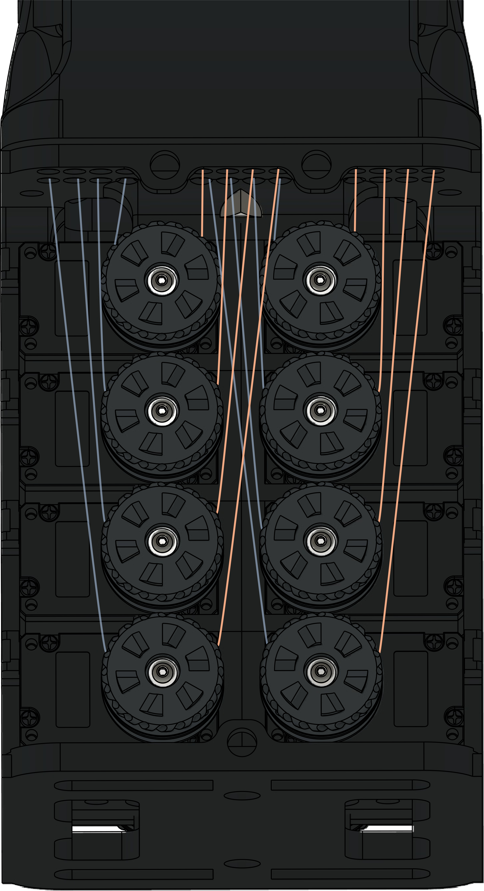

---

## Étape 31 — Assemblage Final et Calibration

Félicitations, l'assemblage physique est complet !

La dernière étape consiste à **calibrer les tensions des tendons** en utilisant le script officiel, adapté pour nos 8 servos :

```bash
# ORCA officiel (à adapter pour D-Hand 8 DOF)
uv run python scripts/tension.py orca_core/models/orcahand_v1_right
uv run python scripts/calibrate.py orca_core/models/orcahand_v1_right
```

Vérifiez que :
- Chaque doigt peut se fermer et s'ouvrir complètement sans accroc.
- Le tendon élastique dorsal (couplé à la gaine TPU ou peau silicone) ramène correctement les doigts en position ouverte complète quand la tension du tendon de flexion est relâchée.
- L'eFlesh est correctement sécurisé sous l'enveloppe à la pulpe de chaque doigt.

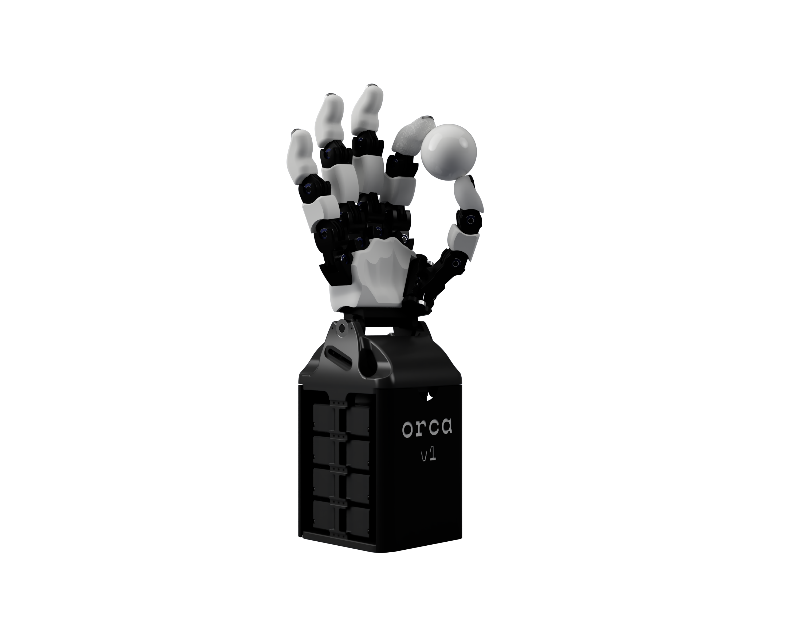

---

*Source : Guide officiel ORCA Hand (ETH Zurich / SRL) — orcahand.com — Traduction et adaptation D-Hand Hybrid, Mars 2026.*
