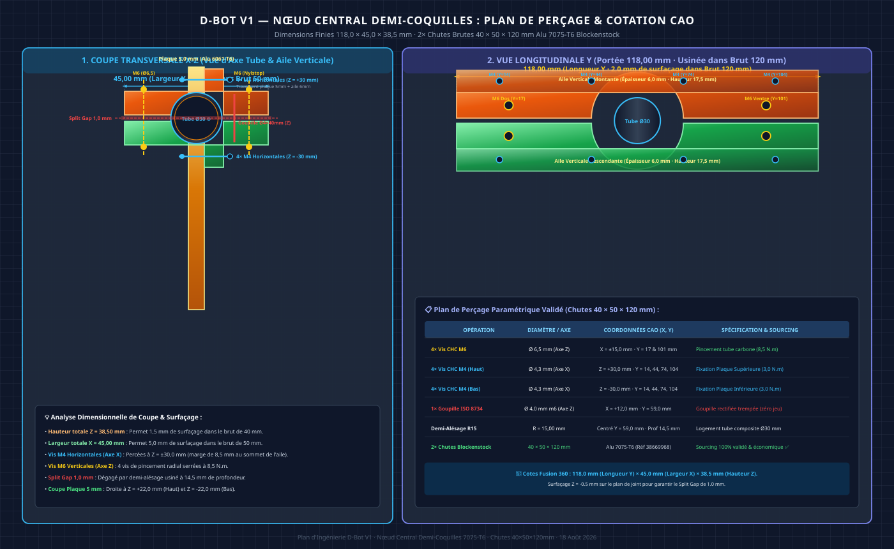
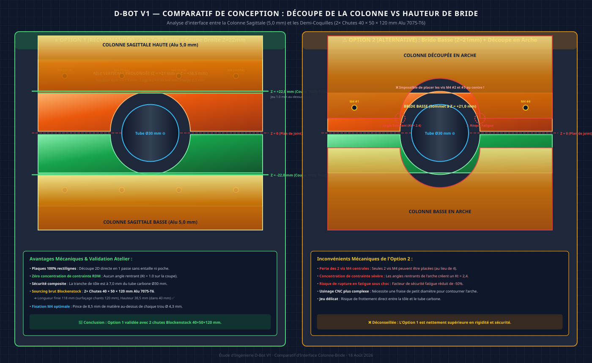
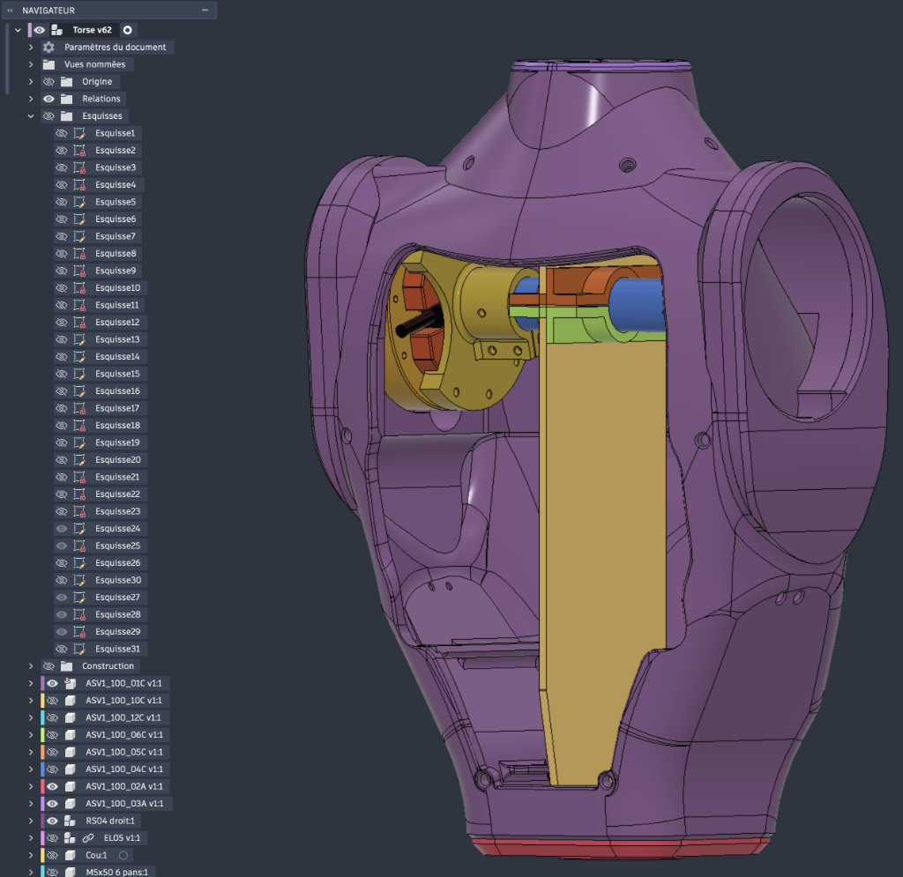

# 🛠️ Guide de Fabrication Hybride : Torse D-Bot V1
### Architecture Cruciforme Squelettique (Alu CNC + Tube Carbone) & Coque Secondaire PA12-CF

*Ce document constitue le guide officiel et complet de fabrication, d'usinage CNC, d'impression 3D FDM et d'assemblage du torse pour le robot humanoïde D-Bot V1 (40,4 kg).*

> [!NOTE]
> **Évolution architecturale majeure** : Le torse s'appuie sur une **architecture cruciforme métallique et composite** (plaque sagittale 2D + traverse carbone Ø30 mm + cages H-bracket d'épaules en Alu 7075-T6) reprenant l'intégralité des efforts dynamiques. La coque en PA12-CF est une **coque secondaire allégée** dédiée à la protection, au guidage des batteries et à l'esthétique bionique.
>
> 📄 **Documents associés** : [ETUDE_Dimensionnement_Colonne_Vertebrale.md](./ETUDE_Dimensionnement_Colonne_Vertebrale.md) · [JOURNAL_DE_BORD.md](../../../05_Gestion_Projet/JOURNAL_DE_BORD.md)

---

## 1. Principe Architectural : Le Squelette Cruciforme Interne

### A. Philosophie de Conception

Le torse du D-Bot est adapté des formes extérieures d'Asimov v1 (mise à l'échelle de +18%), avec une refonte totale de l'infrastructure porteuse interne :

| Élément | Ancien design (Asimov pur) | Nouveau design (D-Bot V1 Cruciforme) |
|:---|:---|:---|
| **Structure porteuse** | Coque PA12-CF seule (6 périmètres, 35% infill) | **Squelette cruciforme Alu 6061/7075 + Tube Carbone 3K** |
| **Rôle de la coque** | Primaire (porte tous les efforts) | **Secondaire** (protection, habillage, transmission locale) |
| **Colonne vertébrale** | 2 lattes alu latérales (irréalisable) | **1 plaque sagittale à lumières 2D** (dos ➔ ventre, 5.0 mm Alu 6061-T6) |
| **Traverse épaules** | Aucune | **Tube carbone 3K Ø30 mm** reliant les 2 épaules |
| **Liaison d'épaules** | Disques plats alu 5 mm | **2 Cages H-Bracket Alu 7075-T6 (2 plaques 5mm évidées Ø95mm + bride 48.2mm + tirants M5 à 23.4°)** |
| **Batterie** | 1 panier coulissant central | **2 paniers latéraux symétriques (G + D) avec Hot-Swap** |
| **Orientation impression** | Dos au plateau (horizontal) | **Verticale** (debout sur le plan de coupe) |

---

### B. Schéma de la Structure Cruciforme

*Schéma d'architecture 2D de la structure cruciforme du torse D-Bot : Vue de Face (Plan Frontal avec la traverse carbone Ø30mm, la plaque sagittale à lumières 2D 5mm et les moteurs RS-04/RS-06) et Vue de Dessus (Plan Transversal avec l'orientation sagittale dos->ventre et les 2 paniers batteries latéraux).*

---

### C. Rigidité Comparée

| Sollicitation | Ancien (lattes) | Nouveau (cruciforme V1) | Gain | Note |
|:---|:---:|:---:|:---:|:---|
| **Flexion Pitch** (avant/arrière) | I ≈ 773 000 mm4 | I ≈ 506 667 mm4 (plaque nette + brides) | **~×0.8** | Facteur de sécurité Sf = 7.36 (nominal) / 5.26 (extrême) |
| **Flexion Roll** (latérale) | Bon | **Excellent avec Cages H-Bracket (tirants M5 R=72mm / 23.4°)** | **×19.4** | Flèche au cou < 0.10 mm (0.088 mm), libère les batteries |
| **Torsion Yaw** | Très faible | Bon (traverse Ø30 mm + nœud demi-coquilles) | **×5-8** | Verrouillage positif par goupille Ø4 mm |
| **Compression axiale** | Bon | Excellent | **×2** | Repris directement par la plaque sagittale |

---

## 2. Colonne Sagittale 2D (Option B — Plaques 5,0 mm Alu 6061-T6)

### A. Spécifications Générales

| Paramètre | Valeur |
|:---|:---|
| **Matériau** | Aluminium 6061-T6, tôle de 5,0 mm d'épaisseur |
| **Orientation** | Plan sagittal (dos ➔ ventre), verticale sur toute la hauteur du torse |
| **Conception retenue** | **Option B (Lumières 2D Traversantes ⭐)** : Évidements 100% débouchants en 1 seule passe |
| **Dimensions brutes** | ~432 mm (hauteur totale) × **120,0 mm (profondeur max d'usinage C500)** → biseau à **94,0 mm au cou (CAO v62)** |
| **Découpage** | En **2 parties** (Haute 142,67 mm + Basse 290,0 mm) jointes au Nœud Central d'épaule (h = 290 mm) |
| **Jonction des 2 parties** | **Nœud Demi-Coquilles CNC Alu** + Tube Carbone Ø30 mm + Goupille Verticale Z (60 mm) |
| **Fixation haute & basse** | **Équerres CNC Alu en Sandwich (L-Brackets)** fixées par vis M4 traversantes |
| **Masse totale 2 plaques** | **~355 g** (vs 668 g pleine — **économie de 313 g / -47%**) |

#### Solution de Fixation Haute et Basse (Équerres CNC L-Brackets en Sandwich)

*Principe d'assemblage en sandwich : 2 équerres en L en aluminium 6061-T6 (à gauche et à droite) enserrent la tôle de 5 mm avec 3 à 4 vis traversantes M4. Le rebord horizontal des équerres est vissé sur les plaques circulaires de cou (5 mm) et de taille (6 mm). Les équerres supérieures intègrent des **lumières oblongues verticales de ±1.0 mm (4.3 × 6.5 mm)** sur leur face verticale pour assurer le **découplage isostatique en Z**, interdisant toute traction parasite sur le pincement du tube carbone au nœud central.*

---

### B. Justification & Comparatif des Formes d'Évidements

> [!IMPORTANT]
> **Pourquoi l'Option B (Lumières 2D) est le Choix Idéal :**
> 1. **Solidité supérieure** : Propose un facteur de sécurité **Sf = 9.21** sous choc dynamique de 220 N.m à la base (Sigma_max = 26.05 MPa), très supérieur à l'Isogrid (Sf = 5.70).
> 2. **Gain de poids massif (-47%)** : Économise 313 g sur la colonne (355 g contre 668 g en plaque pleine).
> 3. **Fiabilité d'Usinage C500** : Découpe en **une seule passe 2D débouchante** en 15 minutes total. Risque de voilement nul et aucun retournement de pièce requis (pas de Flip Z).

---

### C. Fabrication CNC sur NestWorks C500

| Étape | Détail |
|:---|:---|
| **1. Bridage** | Fixer la tôle brute 6061-T6 de 5,0 mm à plat sur la table C500 (sur martyr MDF) |
| **2. Outil** | Fraise carbure Ø6 mm DLC (O-Type 1 dent) |
| **3. Paramètres de coupe** | Vitesse 10 000 tr/min, avance 800 mm/min, passes de Z = -1,25 mm (4 passes) |
| **4. Lumières 2D** | Découpe 100% débouchante à Z = -5,2 mm en une passe continue |
| **5. Contour & Perçages** | Découpe du profil sagittal + trous M4 de fixation |
| **Temps estimé** | **~15 minutes au total pour les 2 plaques** |

---

## 3. Traverse Horizontale Ø30 mm & Nœud Central Demi-Coquilles

### A. Spécifications du Tube Carbone

> [!IMPORTANT]
> **Orientation du tube** : Le tube carbone est transversal (axe X, gauche ↔ droite). Il passe perpendiculairement au plan sagittal des plaques de colonne. Le tube **ne traverse pas** la tôle pleine : il s'insère dans le joint naturel entre la Colonne Supérieure et la Colonne Inférieure, au niveau de l'axe des épaules (h = 290 mm), enserré par les deux demi-coquilles alu.

| Paramètre | Valeur |
|:---|:---|
| **Matériau** | Tube carbone 3K, époxy, Ø30 mm extérieur / Ø26 mm intérieur (paroi 2.0 mm) |
| **Longueur** | ~260 mm (entraxe des brides d'épaule) |
| **Axe** | **Transversal (X)**, perpendiculaire au plan sagittal des plaques |
| **Masse** | ~70 g |
| **Rigidité torsionnelle** | J ≈ 52 000 mm4 (×15 par rapport à une plaque de 5 mm de même largeur) |
| **Fixation aux épaules** | Emmanché sur 35.0 mm dans la bride monobloc Alu 7075-T651, fente de pincement 2×M4 + goupille Ø4×40 mm sur bouchon alu interne |
| **Fixation centrale (nœud)** | **2 demi-coquilles CNC Alu 7075-T6** (118×45×38.5 mm usinées dans 2 chutes 40×50×120 mm) serrant le tube sur 45 mm + **1 insert alu central anti-écrasement Ø 26/18×45 mm (35 g)** + 1 goupille Ø 4×40 mm |

---

### B. Nœud d'Intersection Plaque/Traverse — Système Demi-Coquilles

*Vue en coupe frontale (plan sagittal Y-Z) et vue de dessus (plan transversal X-Y) du nœud d'intersection. Le tube carbone Ø30 mm est transversal (axe X). La Bride Supérieure s'appuie sur la face latérale de la Colonne Supérieure via son aile verticale montante (17.5 mm) ; la Bride Inférieure s'appuie sur la Colonne Inférieure via son aile verticale descendante. Les deux brides sont serrées l'une contre l'autre par 4× vis M6 traversantes + écrous Nylstop, créant le pincement du tube carbone sur 45 mm de portée.*

#### Bénéfices Mécaniques & Optimisation Géométrique :
1. **Plaques de colonne découpées 100% droites** : Coupe nette à Z = +22.0 mm (Haut) et Z = -22.0 mm (Bas), zéro entaille ni angle rentrant (Kt = 1.0) au point de moment maximal (M = 131 N.m dynamique).
2. **Distribution d'effort sur 118 mm** : Les ailes verticales portent sur toute la longueur sagittale de 118 mm.
3. **Pincement fiable sans taraudage fragile** : Vis M6 traversantes avec écrous frein Nylstop (pression de contact 6.3 MPa sur le composite).
4. **Sourcing optimisé en chutes unitaires (2× 40×50×120 mm Alu 7075-T6 Blockenstock)** : Chaque demi-bride est usinée à une cote finie de **118.0 × 45.0 × 38.5 mm**, permettant de blanchir les 2 chants sciés du brut de 120 mm et de surfacer le plan de joint et le sommet dans les 40 mm d'épaisseur.
5. **Verrouillage positif par goupille Ø4 mm (axe Z vertical décalée à X = 12.0 mm)** : La goupille est **décalée latéralement en X** pour contourner la tranche de la plaque sagittale centrale (5.0 mm). Traversante sur 42.0 mm de hauteur (Bride Sup 6.0 mm + tube 30.0 mm + Bride Inf 6.0 mm), elle utilise la même **goupille élastique standardisée Ø 4.0 mm × 40 mm (ISO 8752 Inox)** que les épaules.
6. **Dépouille de serrage du plan de joint (Split Gap = 1.0 mm net / 0.8 à 1.0 mm)** : Chaque demi-alésage cylindrique est usiné à une profondeur de **14.5 mm** (au lieu de 15.0 mm théorique, soit un surfaçage à Z = -0.5 mm sur le plan de joint). Cette cote garantit un **espace libre de 1.0 mm net** entre la Bride Supérieure et la Bride Inférieure à l'assemblage, interdisant toute butée prématurée aluminium contre aluminium et convertissant 100% de la précharge des 4 vis M6 en pression radiale directe (6.3 MPa, friction > 12 000 N) sur le composite carbone.
7. **Insert Central Anti-Écrasement (Manchon Alu 7075-T651 Ø 26/18 × 45 mm, 35 g)** : Pour éliminer tout risque d'écrasement ou d'ovalisation du tube composite sous la précharge de 30 000 N des 4 vis M6, un manchon cylindrique en Aluminium 7075-T651 (paroi 4.0 mm) est inséré et collé au centre du tube. La goupille centrale traverse ainsi un sandwich métallique continu, garantissant zéro flexion et zéro matage sur le composite.

---

#### Plan de Perçage & Coordonnées CAO des Demi-Brides (Fusion 360 v62)

*Origine du repère CAO : Centre du torse au plan de joint (`X = 0 mm` = face d'appui de la plaque sagittale 5 mm, `Y = 59.0 mm` = axe longitudinal du tube transversal Ø30 mm, `Z = 0 mm` = plan de joint central).*

| Fonction du Perçage | Qté | Diamètre d'Usinage | Position & Axe | Position Y (Sagittale Dos ➔ Ventre) | Type de Perçage & Visserie |
|:---|:---:|:---:|:---:|:---:|:---|
| **Pincement Tube (Dos)** | 2 | **Ø 6.5 mm** (ISO 273) | `X = -15.0 mm` et `X = +15.0 mm` · **Axe Z (Vertical)** | `Y = 17.0 mm` (Dos) | Traversant 21 mm · Vis CHC M6 × 50 mm + Nylstop (8.5 N.m) |
| **Pincement Tube (Ventre)** | 2 | **Ø 6.5 mm** (ISO 273) | `X = -15.0 mm` et `X = +15.0 mm` · **Axe Z (Vertical)** | `Y = 101.0 mm` (Ventre) | Traversant 21 mm · Vis CHC M6 × 50 mm + Nylstop (8.5 N.m) |
| **Fixation Colonne Haute (Aile Sup)** | 4 | **Ø 4.3 mm** (ISO 273) | Aile verticale montante (`Z = +30.0 mm`) · **Axe X (Horizontal)** | `Y1 = 14.0 mm` `Y2 = 44.0 mm` `Y3 = 74.0 mm` `Y4 = 104.0 mm` | Traversant plaque 5mm + aile 6mm · 4× Vis CHC M4 × 16 mm + Nylstop (3.0 N.m) |
| **Fixation Colonne Basse (Aile Inf)** | 4 | **Ø 4.3 mm** (ISO 273) | Aile verticale descendante (`Z = -30.0 mm`) · **Axe X (Horizontal)** | `Y1 = 14.0 mm` `Y2 = 44.0 mm` `Y3 = 74.0 mm` `Y4 = 104.0 mm` | Traversant plaque 5mm + aile 6mm · 4× Vis CHC M4 × 16 mm + Nylstop (3.0 N.m) |
| **Goupille Sécurité Z** | 1 | **Ø 4.0 mm H7** | **`X = +12.0 mm`** (Décalée hors plaque) · **Axe Z (Vertical)** | **`Y = 59.0 mm`** (Axe tube carbone) | Alésage traversant 42 mm · **Goupille rectifiée trempée ISO 8734 Ø 4.0 mm m6 × 40 mm** |

*Schéma technique vectoriel d'usinage et d'implantation CAO Fusion 360 (v62) des demi-coquilles (Alu 7075-T6). Panel 1 : Vue en coupe transversale X-Z (45.00 mm de largeur axiale) montrant la plaque sagittale en appui latéral contre les ailes verticales montante et descendante, les 4 vis M4 horizontales (axe X), les vis M6 de pincement verticales (axe Z) et le Split Gap de 1.0 mm. Panel 2 : Vue longitudinale sagittale (118.00 mm de longueur) avec cotation des entraxes des vis M6 (Y = 17 et 101 mm) et des vis M4 (Y = 14, 44, 74, 104 mm).*

#### Comparatif de Conception : Découpe de la Colonne vs Rehausse de l'Aile de Bride

*Comparatif d'interface RDM et usinage entre l'Option 1 (Recommandée : Aile verticale de bride prolongée à Z = +38.5 mm permettant une coupe 100% droite de la tôle de 5 mm à Z = +22 mm) et l'Option 2 (Déconseillée : Bride basse à Z = +21 mm obligeant à créer une échancrure en arche avec concentration de contraintes dans la plaque).*

---

### C. Stratégie de Perçage Vertical Z sur NestWorks C500 (Protocole « Match-Drilling » en Place)

Pour garantir un alignement coaxial parfait à `+/- 0.005 mm` à travers le sandwich multi-matériaux (Bride Alu ➔ Tube Carbone ➔ Bouchon Alu ➔ Tube Carbone ➔ Bride Alu), les perçages de goupilles sont **impérativement réalisés en place (« match-drilling ») après collage et durcissement complet de l'époxy** :

| Goupille | Position | Direction | Diamètre | Profondeur | Outillage C500 & Séquence Match-Drilling |
|:---|:---|:---:|:---:|:---:|:---|
| **Nœud central** | Brides demi-coquilles (décalée à X = 12.0 mm) | **Axe Z (Vertical)** | Ø4 mm H7 | **40 mm à 42 mm** | **Perçage en place** : Foret Ø 3.9 mm + Alésoir machine Ø 4.00 mm H7 traversant nœud serré + tube + manchon collé |
| **Ancrage épaule gauche** | Bride alu 7075 + tube extrémité gauche | Axe Z (Vertical) | Ø4 mm H7 | **40 mm** | **Perçage en place** : Foret Ø 3.9 mm + Alésoir machine Ø 4.00 mm H7 traversant bride serrée + tube + bouchon collé |
| **Ancrage épaule droit** | Bride alu 7075 + tube extrémité droit | Axe Z (Vertical) | Ø4 mm H7 | **40 mm** | **Perçage en place** : Foret Ø 3.9 mm + Alésoir machine Ø 4.00 mm H7 traversant bride serrée + tube + bouchon collé |

> [!TIP]
> **Séquence Chronologique Atelier Inviolable** :
> 1. **Collage & Polymérisation** : Encoller le manchon central et les bouchons d'épaule dans le tube carbone Ø30 mm ➔ Laisser polymériser l'époxy 24h.
> 2. **Serrage Nominal des Brides** : Poser le ruban Kapton sur le tube, monter et serrer les demi-coquilles (8.5 N.m) et brides d'épaule (3.0 N.m).
> 3. **Perçage en Place sur C500** : Percer et aléser les 3 trous Ø 4.0 mm H7 d'un seul trait par la broche Z.
> 4. **Insertion Goupilles Inox** : Déposer 1 goutte de Loctite 243 et emmancher les goupilles rectifiées trempées ISO 8734 Ø 4.0 mm m6 × 40 mm au maillet plastique.
> 5. **Montage des Moteurs RS-04 À LA FIN** : Les moteurs ne sont fixés qu'après le goupillage complet du squelette métallique. Cela protège l'entrefer des aimants et les roulements contre toute limaille ou poussière de carbone.

*Modèle CAO Fusion 360 (Torse v62) avec écorché du thorax. La bride d'épaule monobloc (jaune) présente une zone de manchon intérieure (portée 35 mm) totalement dégagée sur sa face supérieure : la broche Z de la NestWorks C500 dispose d'un accès direct sans obstacle pour réaliser le perçage en place de la goupille Ø 4.0 mm H7 à travers le tube carbone et son bouchon alu. Le moteur RS-04 et les plaques de cage H-bracket se montent en toute dernière étape sur le flasque de Ø 120 mm.*

### D. Fiche Pratique Atelier : Protocole Anti-Corrosion Galvanique DIY (Zéro Chimie)

Pour supprimer définitivement tout risque de micro-couple galvanique entre les fibres de carbone et l'Aluminium 7075-T6, le protocole d'assemblage applique une barrière diélectrique physique en 3 gestes simples sur établi :

1. **Isolation Extérieure Tube Carbone Ø30 mm (Ruban Polyimide Kapton 50 µm)** :
   * Nettoyer la surface extérieure du tube carbone à l'alcool isopropylique.
   * Enrouler **1 seul tour franc de ruban Kapton (largeur 25 ou 50 mm)** sur les zones recevant les demi-coquilles centrales et les brides d'épaule.
   * Le Kapton (isolant > 5 000 V, épaisseur 0.05 mm) assure la rupture totale de continuité électrique sans altérer le couple de pincement.

2. **Isolation Intérieure Tube Carbone (Colle Époxy Structurelle Loctite EA 9466)** :
   * Encoller généreusement les bouchons d'épaule alu Ø26 mm et le manchon central alu Ø26 mm.
   * La résine époxy liquide (résistivité > 10^14 Ohm.cm) forme un film diélectrique continu étanche de 0.05 à 0.1 mm lors du durcissement.

3. **Goupilles de Sécurité Ø 4.0 mm (Spécification Inox & Scellement Loctite)** :
   * **Choix du matériau** : Utiliser impérativement des **Goupilles cylindriques rectifiées trempées en Acier Inoxydable (ISO 8734 Inox A1/A2 Ø 4.0 mm m6 × 40 mm)**. L'Inox passivé et les fibres de carbone ont des potentiels redox quasi-identiques (~ -0.10 V), éliminant tout couple galvanique destructeur (Delta_V < 0.05 V).
   * **Scellement à l'insertion** : Déposer **1 goutte de frein-filet Loctite 243** (ou graisse silicone neutre) sur la goupille avant son emmanchement au maillet plastique. Le produit chasse l'air et l'humidité des micro-interstices, interdisant toute présence d'électrolyte liquide.

---

## 4. Architecture Finale des Épaules : Cages H-Bracket Alu 7075-T6 & Brides Monoblocs

### A. Architecture : Cage H-Bracket & Bride Monobloc d'Épaule (×2 épaules)

*Blueprint d'ingénierie 2D de l'assemblage d'épaule quasi-final (Fusion 360). Vue de Face (Plan Y-Z) : stator RS-04 Ø120 mm + 2 plaques H-bracket 5 mm 7075-T6 identiques évidées à Ø95 mm (10× vis M4 sur PCD Ø106 mm) + 2 tirants M5 aux oreilles diagonales à 23.4° (Z=±66.1 mm, Y=±28.6 mm, R=72 mm). Vue Latérale / Coupe (Plan X-Z) : sandwich axial 49 mm (Plaque avant orange 5 mm -> Stator RS-04 39 mm -> Plaque arrière orange 5 mm + Bride jaune 48.2 mm), tirants axiaux CHC M5×60 mm, tube carbone Ø30 mm avec bouchon interne alu Ø26/18×34.5 mm, pincement radial 2×M4 et goupille Ø4×40 mm Mecanindus.*

*Évolution d'ingénierie : Demi-Traverse Monobloc usinée en Alu 7075-T6 connectée directement entre la plaque sagittale 5 mm et le stator RS-04, éliminant le tube carbone, les inserts et les demi-coquilles.*

*Comparatif des stratégies de fabrication CNC sur NestWorks C500 : Usinage dans la masse (Option A) vs Assemblage 2D emboîté à tenons-mortaises (Option B) vs Profilé rectangulaire standard (Option C).*

> [!IMPORTANT]
> **Évidement Central Ø95 mm (epaule9.png)** : Les plaques 5 mm 7075-T6 sont évidées au centre sous forme de couronne annulaire (Ø ext 120 mm / Ø int 95 mm, largeur radiale 12.5 mm). Cet évidement procure un **gain de masse massif de -100 g par plaque (soit -400 g sur le torse pour les 4 plaques !)** tout en dégageant le passage des câbles XT30/CAN-FD et la ventilation directe du stator RS-04.

---

### B. Nomenclature & Spécifications de la Cage H-Bracket (Par Épaule)

| Paramètre | Valeur |
|:---|:---|
| **Plaques H-bracket (orange, ×2 par épaule)** | **Alu 7075-T6, 5.0 mm** (2 plaques IDENTIQUES : Avant + Arrière, **Évidement central Ø95mm** -> gain -400g total sur torse) → couronne annulaire Ø120/Ø95mm + 2 oreilles cylindriques pour tirants M5 → **10× vis M4 sur PCD Ø106mm** sur stator RS-04 (pince radiale = 3.35 mm, Sf_bearing = 61) |
| **Perçage oreilles M5 (CNC C500)** | **Ø 5.5 mm (ISO 273 — Moyen)** → jeu radial 0.25 mm pour empilement sans contrainte + **chanfreins 0.5 mm × 45°** sur les 2 faces |
| **Bride fixation tube (jaune/bleue, 1 par épaule)** | **Bride monobloc Alu 7075-T651, 48.20 mm total** → flasque 13.20 mm + socket tube 35.0 mm (L/D=1.17) + fente pincement 2×M4 + goupille Ø4×40 mm. Se monte **par-dessus la plaque arrière orange** et se fixe au stator par 6 vis M4 traversantes. Sourcing: disque brut Ø120×50 mm Blockenstock |
| **Bouchon interne anti-écrasement (×1 par bride)** | **Alu 7075-T651, Ø 26.0 ext / Ø 18.0 int × 34.5 mm de long** → collé à l'époxy dans le tube carbone Ø 30×26 mm (jeu axial 0.5 mm). Absorbe la pression de pincement et sert d'appui direct pour la goupille Ø 4.0 mm |
| **Fixation Stator AVANT (×10 vis M4 par épaule)** | **Vis CHC M4 × 10 mm (ISO 4762 / DIN 912 classe 8.8 ou Inox A2)** — Vissage direct à travers la plaque avant 5.0 mm dans les 10 trous borgnes M4 sur PCD Ø106 mm du stator RS-04 (engagement 4.2 mm) |
| **Fixation Stator ARRIÈRE — Hors Bride (×4 vis M4 par épaule)** | **Vis CHC M4 × 10 mm (ISO 4762 / DIN 912 classe 8.8 ou Inox A2)** — Vissage direct à travers la plaque arrière 5.0 mm seule sur les 4 trous exposés du PCD Ø106 mm (engagement 4.2 mm) |
| **Fixation Bride Épaule + Stator ARRIÈRE (×6 vis M4 par épaule)** | **Vis CHC M4 × 25 mm (ISO 4762 / DIN 912 classe 8.8 ou 10.9 ou Inox A2)** — Traversant la flasque de bride (13.20 mm) + plaque arrière (5.00 mm) + rondelle (0.8 mm) dans les 6 trous borgnes du stator RS-04 (engagement 5.2 à 6.0 mm) |
| **Perçage stator plaques 5mm (CNC C500)** | **Ø 4.3 mm (ISO 273 — Moyen)** sur PCD Ø 106.0 mm (10 trous par plaque) + **chanfreins 0.5 mm × 45°** |
| **Perçage flasque bride 13.2mm (CNC C500)** | **Ø 4.3 mm (ISO 273 — Moyen)** sur PCD Ø 106.0 mm (6 trous traversants) + **chanfreins 0.5 mm × 45°** |
| **Rondelles stator & bride (×20 par épaule)** | **ISO 7089 / DIN 125A (M4)** → Ø int. 4.3 mm / Ø ext. 9.0 mm, épaisseur 0.8 mm (10 sur face avant, 4 sur plaque arrière hors bride, 6 sur flasque de bride) |
| **Pincement radial tube (×2 vis M4 par bride)** | **Vis CHC M4 × 18 mm ou M4 × 20 mm (ISO 4762 / DIN 912 classe 8.8 ou 10.9 zingué)** — Traversantes sur bloc de pincement de 11.0 mm de largeur (vis #1 à 8.0 mm du bord, vis #2 à 25.0 mm du bord, entraxe 17.0 mm) |
| **Perçage pincement M4 (CNC C500)** | **Ø 4.3 mm (ISO 273 — Moyen)** → perçage traversant sur méplats + **chanfreins 0.5 mm × 45°** |
| **Rondelles pincement (×4 par bride)** | **ISO 7089 / DIN 125A (M4)** → Ø int. 4.3 mm / Ø ext. 9.0 mm, épaisseur 0.8 mm (2 sous tête vis CHC, 2 sous écrou Nylstop M4) |
| **Écrous frein pincement (×2 par bride)** | **ISO 7040 / DIN 985 — M4 (Nylstop)** → écrou hexagonal autofreiné avec bague nylon, hauteur 4.0 mm |
| **Goupille sécurité bride (×1 par bride)** | **Goupille élastique Mécanindus Ø 4.0 mm × 40 mm (ISO 8752 / DIN 1481 Inox)** → perçage Ø 4.0 mm H7 traversant toute la douille alu (40.0 mm) et le bouchon alu interne (s'aligne à fleur Ø 40 mm) |
| **Tirants M5 axiaux (×2 par épaule)** | **Vis CHC M5 × 60 mm (ISO 4762 / DIN 912 classe 8.8 ou 10.9 zingué)** — Longueur optimale validée pour empilement 49.0 mm à 51.0 mm (saillie bague nylon = +2.4 mm) |
| **Rondelles tirants (×4 par épaule)** | **ISO 7089 / DIN 125A (M5)** → Ø int. 5.3 mm / Ø ext. 10.0 mm, épaisseur 1.0 mm (2 sous tête vis CHC, 2 sous écrou Nylstop) |
*Blueprint d'ingénierie 2D de l'assemblage d'épaule quasi-final (Fusion 360). Vue de Face (Plan Y-Z) : stator RS-04 Ø120 mm + 2 plaques H-bracket 5 mm 7075-T6 identiques évidées à Ø95 mm (10× vis M4 sur PCD Ø106 mm) + 2 tirants M5 aux oreilles diagonales à 23.4°. Vue Latérale / Coupe (Plan X-Z) : sandwich axial 49 mm (Plaque avant orange 5 mm -> Stator RS-04 39 mm -> Plaque arrière orange 5 mm + Bride jaune 48.2 mm), tirants axiaux CHC M5×60 mm, tube carbone Ø30 mm avec bouchon interne alu Ø26/18×34.5 mm, pincement radial 2×M4 et goupille Ø4×40 mm Mecanindus.*

> [!IMPORTANT]
> **Évidement Central Ø95 mm (epaule9.png)** : Les plaques 5 mm 7075-T6 sont évidées au centre sous forme de couronne annulaire (Ø ext 120 mm / Ø int 95 mm, largeur radiale 12.5 mm). Cet évidement procure un **gain de masse massif de -100 g par plaque (-400 g sur le torse !)** tout en dégageant le passage des câbles XT30/CAN-FD et la ventilation directe du stator RS-04.

---

## 5. Nomenclature & Spécifications de la Cage H-Bracket (Par Épaule)

| Paramètre | Valeur |
|:---|:---|
| **Plaques H-bracket (orange, ×2)** | **Alu 7075-T6, 5.0 mm** (2 plaques IDENTIQUES : Avant + Arrière, **Évidement central Ø95mm**) |
| **Bride fixation tube (jaune, 1 par épaule)** | **Bride monobloc Alu 7075-T651, 48.20 mm total** → flasque 13.20 mm + socket tube 35.0 mm |
| **Bouchon interne anti-écrasement** | **Alu 7075-T651, Ø 26.0 ext / Ø 18.0 int × 34.5 mm de long** |
| **Fixation Stator AVANT (×10 vis M4)** | **Vis CHC M4 × 10 mm** — Vissage direct dans les 10 trous borgnes du stator (engagement 4.2 mm) |
| **Fixation Bride Épaule + Stator ARRIÈRE (×6 vis M4)** | **Vis CHC M4 × 25 mm** — Traversant la flasque de bride (13.20 mm) + plaque arrière (5.00 mm) |
| **Pincement radial tube (×2 vis M4)** | **Vis CHC M4 × 18 mm ou M4 × 20 mm** — Traversantes sur bloc de pincement |
| **Goupille sécurité bride (×1)** | **Goupille cylindrique rectifiée trempée Ø 4.0 mm m6 × 40 mm (ISO 8734 / DIN 6325)** |
| **Tirants M5 axiaux (×2)** | **Vis CHC M5 × 60 mm** |
| **Position tirant HAUT** | Z = +66.1 mm, Y = +28.6 mm (R = 72 mm, angle 23.4° de la verticale) |
| **Position tirant BAS** | Z = -66.1 mm, Y = -28.6 mm (diamétralement opposé) |
| **Traitement de surface Alu 7075** | **Anodisation sulfurique ou dure 20 µm** (barrière diélectrique anti-corrosion galvanique) |
| **Sourcing plaques 5mm 7075-T6** | Blockenstock — chute 5×160×160 mm 7075-T6 @ 9.60 EUR/pièce |
| **Sourcing bride 48.2mm** | Blockenstock — disque Ø 120×50 mm alu 7075-T651 @ ~25.00 EUR/pièce |
| **Sourcing bouchons & insert alu** | Blockenstock — barre ronde Ø 30×500 mm Alu 7075-T651 @ 16.20 EUR TTC |
| **Sourcing demi-coquilles nœud central** | Blockenstock — [**2× chutes 40×50×120 mm Alu 7075-T6**](https://www.blockenstock.fr/40x-50x120mm-alu-7075-t6-c2x38669968) @ ~36.00 EUR TTC (pour pièces 118×45×38.5 mm) |

---

## 6. Calcul d'Empilement & Validation Constructeur RobStride RS-04

> [!NOTE]
> **Vérification Constructeur RobStride RS-04 (Manuel Constructeur Page 10)** :
> 1. **Fixation Stator Directe sur Plaque 5 mm (CHC M4 × 10 mm — 10 vis AV + 4 vis AR)** :
> - Plaque H-bracket 7075-T6 : 5.00 mm + Rondelle DIN 125A M4 : 0.80 mm = **5.80 mm sous tête**.
> - Pénétration dans le stator : 10.00 - 5.80 = **4.20 mm**.
> - Conforme à la règle constructeur : engagement net > 4.0 mm et **garde de sécurité de 1.80 mm au fond du trou borgne**.
>
> 2. **Fixation Bride d'Épaule + Plaque 5 mm sur Stator (CHC M4 × 25 mm — 6 vis AR)** :
> - Flasque de bride d'épaule : 13.20 mm + Plaque arrière : 5.00 mm + Rondelle : 0.80 mm = **19.00 mm sous tête**.
>
> **3. Vis de Pincement Radial (CHC M4 × 18 mm ou M4 × 20 mm)** :
> - Bloc de pincement (11.0 mm) + 2 rondelles DIN 125A (1.6 mm) + Écrou Nylstop M4 (4.0 mm) + Saillie 2 filets (1.4 mm) = **18.0 mm**.
>
> **4. Vis Tirant M5 (CHC M5 × 60 mm)** :
> - Plaque AV (5.0 mm) + Corps RS-04 (39.0 mm) + Plaque AR (5.0 mm) = 49.0 mm. Accessoires (2× rondelles 1.0 mm + écrou Nylstop 5.0 mm + saillie 1.6 mm) = 7.6 mm. Total = **56.6 mm** (vis **ISO 4762 CHC M5 × 60 mm** exacte).

> [!CAUTION]
> **RÈGLE CRITIQUE CAO : FENTE DE PINCEMENT DU TUBE (Split Gap = 1.0 mm)** :
> Ne **JAMAIS** dessiner une fente de pincement de 0.1 mm dans Fusion 360 ! 
> Lors du serrage des vis M4 à 3.0 N.m, une fente de 0.1 mm provoque une **butée franche prématurée alu contre alu**, ce qui absorbe 100% de la force de serrage et **annule toute pression radiale sur le tube carbone**.
> La fente de pincement doit impérativement avoir une ouverture de **1.0 mm net (±0.1 mm)** sur toute la portée de 35.0 mm.

---

### D. Tutoriel : Importation McMaster-Carr dans Fusion 360

> [!TIP]
> **Procédure d'importation pas-à-pas :**
> 1. Dans Fusion 360, aller dans **Insert** ➔ **Insert McMaster-Carr Component**.
> 2. Rechercher et sélectionner les références exactes :
>    - **Vis CHC M4 × 10 mm Stator Direct (ISO 4762)** : `M4 x 10 Socket Head Screw` ➔ *Metric* ➔ *M4* ➔ *10 mm* (Réf McMaster **`91290A150`** Acier 12.9 ou **`92290A140`** Inox 18-8).
>    - **Vis CHC M4 × 25 mm Bride Épaule (ISO 4762)** : `M4 x 25 Socket Head Screw` ➔ *Metric* ➔ *M4* ➔ *25 mm* (Réf McMaster **`91290A170`** Acier 12.9 ou **`92290A148`** Inox 18-8).
>    - **Vis CHC M4 × 18 mm Pincement (ISO 4762)** : `M4 x 18 Socket Head Screw` (ou `M4 x 20`) ➔ *Metric* ➔ *M4* ➔ *18 mm* (ou *20 mm*).
>    - **Vis CHC M5 × 60 mm Tirants (ISO 4762)** : `M5 x 60 Socket Head Screw` ➔ *Metric* ➔ *M5* ➔ *60 mm* (Réf McMaster **`91290A268`**).
>    - **Rondelles M4 (DIN 125A / ISO 7089)** : `M4 Flat Washer` ➔ *Metric* ➔ *For M4 Screw Size* (Réf McMaster **`93475A230`** Inox 18-8, Ø int 4.3 mm, Ø ext 9.0 mm, ép. 0.8 mm).
>    - **Rondelles M5 (DIN 125A / ISO 7089)** : `M5 Flat Washer` ➔ *Metric* ➔ *For M5 Screw Size* (Réf McMaster **`93475A240`** Inox 18-8, Ø int 5.3 mm, Ø ext 10.0 mm, ép. 1.0 mm).
>    - **Écrous Nylstop M4 (DIN 985 / ISO 7040)** : `M4 Nylon-Insert Locknut` ➔ *Metric* ➔ *M4 Thread*.
>    - **Écrous Nylstop M5 (DIN 985 / ISO 7040)** : `M5 Nylon-Insert Locknut` ➔ *Metric* ➔ *M5 Thread* (Réf McMaster **`90631A113`**).
>    - **Goupille Élastique Mécanindus Ø 4.0 mm × 40 mm (ISO 8752)** : `4mm Slotted Spring Pin 40mm` ➔ *Pins* ➔ *Spring Pins* ➔ *Slotted Pins* ➔ *Metric* ➔ *4 mm Diameter* ➔ *40 mm Length* (Réf McMaster **`98380A425`** Inox ou **`92383A211`** Acier Ressort).
> 3. Dérouler la section *Product Detail*, sélectionner **3D STEP** et cliquer sur **Download**.
> 4. Appliquer une contrainte **Joint** (`J`) coaxial sur les perçages.

---

### E. Validation CAO Fusion 360 (Vérification epaule1 à epaule9)

*Figure 4.1 (epaule1) : Vue d'ensemble 3D de l'assemblage complet d'épaule : les 2 plaques H-bracket identiques (orange) en Aluminium 7075-T6 (5.0 mm), la bride d'ancrage d'épaule monobloc (jaune) en Aluminium 7075-T651 (48.20 mm total), le tube carbone Ø30 mm (bleu) et le moteur RS-04.*

*Figure 4.2 (epaule2) : Vue de profil montrant le sandwich axial : Plaque avant orange (5.0 mm) -> Moteur RS-04 (39 mm) -> Plaque arrière orange (5.0 mm) + Bride d'ancrage jaune (48.20 mm).*

*Figure 4.3 (epaule3) : Cotation CAO de la longueur de portée de l'alésage tube carbone : **35.00 mm net** (ratio L/D = 1.17, supérieur au standard ISO 1.0×D = 30.0 mm).*

*Figure 4.4 (epaule4) : Cotation CAO de l'épaisseur de la flasque d'embase de la bride jaune : **13.20 mm net**.*

*Figure 4.5 (epaule5) : Cotation CAO de l'épaisseur de la plaque H-bracket orange : **5.00 mm net en Aluminium 7075-T6**.*

*Figure 4.6 (epaule6) : Vue de face avant (côté bras) du moteur RS-04.*

*Figure 4.7 (epaule7) : Vue face arrière (côté torse) montrant l'intégration de la bride d'ancrage jaune et de la colonne vertébrale (5.0 mm).*

*Figure 4.8 (epaule8) : Mesure de la hauteur hors-tout axiale de la bride d'épaule monobloc : **48.20 mm net** (valide le brut disque Blockenstock Ø 120 × 50 mm).*

*Figure 4.9 (epaule9) : Vue axiale de la plaque H-bracket orange montrant l'évidement central **Ø 95.0 mm** (gain -400 g sur le torse et aération RS-04).*

---

### F. Performance Roll Validée

| Solution | I_roll (mm4) | Flèche au cou | Espace batterie |
|:---|:---:|:---:|:---:|
| Sans renfort | 18 580 | ~1.7 mm | ✅ Libre |
| Tirants verticaux ±60 mm (abandonnée) | 164 802 | ~0.21 mm | ❌ Occupé |
| **Cage H-bracket 23.4°, R=72mm (retenue V1)** | **361 160** | **~0.088 mm** | ✅ **Libre à 100%** |

---

## 5. Coque Secondaire PA12-CF & Impression Verticale

### A. Justification de l'Impression Verticale (Debout)

Avec le squelette cruciforme reprenant tous les efforts structurels, la coque PA12-CF n'est plus la structure porteuse primaire. Cela autorise l'impression **verticale** (torse debout), réduisant de 75% le volume de supports.

---

### B. Stratégie de Découpe CAO : 2 Anneaux 360° Monoblocs

Pour imprimer dans le volume de la **Qidi Plus 4** (305 × 305 × 280 mm) :
1. **Thorax Haut** (hauteur ~216 mm) : Imprimé collet du cou vers le haut, plan de coupe abdominal sur le plateau.
2. **Abdomen Bas** (hauteur ~190 mm) : Imprimé taille vers le bas, plan de coupe abdominal vers le haut.
3. **Plan de Joint Abdominal (Lap Joint 3.0 mm)** : Profilé rainure-languette (1.5 mm × 2.0 mm) avec jeu de 0.2 mm, verrouillé par 6 à 8 vis CHC M4 prenant prise dans des inserts laiton Ruthex M4 chauffés.

---

## 6. Paramètres de Tranchage (OrcaSlicer / Qidi Plus 4)

### A. Paramètres Globaux (Zone Courante)

| Paramètre (FR) | Slicer Setting Name (EN) | Recommended Value | Note |
|:---|:---|:---:|:---|
| Diamètre de buse | **Nozzle Diameter** | `0.4 mm` | Type : **Tungsten Carbide** (Carbure de Tungstène) |
| Hauteur de couche | **Layer Height** | `0.20 mm` | Précision et vitesse équilibrées |
| Nombre de parois | **Wall Loops** | **`4`** | Épaisseur de paroi 1.92 mm |
| Couches sup. / inf. | **Top / Bottom Shell Layers** | **`4` / `4`** | Fermeture propre |
| Motif de remplissage | **Infill Pattern** | `Gyroid` | Isotrope |
| Taux de remplissage | **Infill Density** | **`20%`** | Coque secondaire allégée |
| Température de buse | **Nozzle Temperature** | `290°C - 295°C` | PA12-CF |
| Température plateau | **Bed Temperature** | `85°C - 90°C` | Magigoo PA |
| Chambre chauffée | **Chamber Temperature** | `60°C` | Indispensable pour PA12-CF |
| Type de supports | **Enable Support** | `Tree (Organic)` | **Support on Build Plate Only** |

---

### B. Zone d'Épaule : Modifier Volume Cylindrique

Pour renforcer localement le collet d'épaule dans le slicer :
1. Clic droit sur le modèle Thorax ➔ **Add Modifier** ➔ **Cylinder**.
2. Dimensionner : `Size X = 120 mm`, `Size Y = 120 mm`, `Size Z = 80 mm`.
3. Positionner le cylindre centré sur le collet d'épaule.
4. Surcharger les paramètres locaux : **Wall loops = 6**, **Infill density = 35%**, **Top/Bottom layers = 6**.

---

### C. Prototype de Validation en PLA

| Paramètre PLA | Valeur | Note |
|:---|:---:|:---|
| **Layer Height** | `0.28 mm` | Mode draft rapide |
| **Wall Loops** | `3` | Suffisant pour test d'ajustement |
| **Infill Density** | `10% - 15% (Grid)` | Gain de temps |
| **Chamber Temperature** | **`0°C (OFF / Capot ouvert)`** | Évite le bouchage (heat creep) |
| **Part Cooling Fan** | `100%` | Refroidissement maximal PLA |

---

## 7. Système de Batteries : 2 Paniers Latéraux Hot-Swap

### A. Architecture des Paniers Symétriques

Les tirants d'épaule à 23.4° libérant l'espace latéral sous les épaules, le torse intègre **2 paniers latéraux symétriques** coulissant depuis l'arrière :

*Vue de dessus des 2 paniers batteries latéraux guidés entre la coque extérieure et la plaque sagittale centrale.*

| Paramètre | 2 Batteries Latérales (V1) |
|:---|:---:|
| **Configuration** | **2× Packs 12S NMC 48V (5Ah à 6Ah)** |
| **Énergie totale** | **480 Wh à 576 Wh** (+20% vs batterie unique) |
| **Tension nominale** | 44.4 V (parallèle via diodes ORing) |
| **Dimensions unitaires** | ~220 × 50 × 65 mm chacune |
| **Guidage & Coulissement** | Rails PA12-CF + cornières alu 10×10 mm sur la plaque sagittale + bandes PTFE 0.2 mm |
| **Verrouillage** | Loquet quart-de-tour (Dzus) accessible depuis l'arrière |

---

### B. Circuit Électrique Hot-Swap ORing

Le circuit permet de remplacer un pack batterie à chaud sans interruption de tension pour les calculateurs et contrôleurs :

| Composant | Référence | Spécifications | Rôle |
|:---|:---|:---|:---|
| **2× Diodes Schottky** | **MBR4060PT** (TO-247) | 40A, 60V, V_forward = 0.45V | Diodes ORing montées sur radiateurs alu fixés à la plaque sagittale |
| **2× BMS 12S** | BMS 12S 20A-30A | Protection intégrée pack | Protection surcharge / décharge |
| **4× Connecteurs** | **XT60** mâle/femelle | 60A max, câble 10 AWG silicone | Connexion automatique en fin de course de panier |
| **1× Fusible PTC** | Resettable 40A | Protection bus principal | Sécurité PDB |

---

## 8. Liaisons d'Extrémités (Cou & Waist Yaw RS-06)

### A. Plaque Supérieure de Cou (Alu 6061-T6, 5.0 mm) & Découplage Isostatique en Z
* **Fonction** : Fermeture haute du torse, fixation du collet de cou pour le RS-05 Yaw/Pitch, ancrage de la plaque sagittale haute via équerres L-Brackets sandwich.
* **Liaison Sandwich Double Cornière L (20×20×3 mm, longueur 80 mm)** : Deux cornières en aluminium 6061-T6 (ou 7075-T6) prennent en sandwich la plaque sagittale de 5.0 mm.
* **Découplage Isostatique en Z (Lumières Oblongues 4.3 × 6.5 mm)** : Les perçages de la face verticale des cornières sont des **fentes oblongues verticales (±1.0 mm en Z)**. Cela transmet 100% des moments de flexion Pitch et Roll tout en absorbant les dispersions axiales pour **ne jamais tirer la Bride Supérieure vers le haut**, préservant intacts le Split Gap de 1.0 mm et la pression radiale de 6.3 MPa sur le tube carbone.
* **Visserie** : 2× à 3× Vis CHC M4 × 16 mm (ISO 4762 classe 8.8) + Rondelles larges ISO 7093 M4 + Écrous autofreinés ISO 7040 Nylstop M4 (serrage à 3.0 N.m au tournevis dynamométrique).

### B. Plaque Inférieure / Waist Plate (Alu 6061-T6, 6.0 mm)
* **Fonction** : Fermeture basse du torse, interface rigide avec le module Waist Yaw actif.
* **Moteur Waist** : **RobStride RS-06** (36 N.m pic / 11 N.m nominal, Ø88 mm, 621 g, CAN-FD ID 21).
* **Bague d'adaptation CNC** : Alu 6061-T6 (Ø int. 88 mm / Ø ext. 115.6 mm, épaisseur radiale 13.8 mm) adaptant le carter Asimov v1 au moteur RS-06.
* **Roulement** : Section fine Ø110 mm à 4 points de contact.

---

## 9. Workflow de Fabrication Révisé (Plan d'Action Pas-à-Pas)

### Phase 1 — Conception CAO (Fusion 360)
1. ☐ Mettre à l'échelle (+18%) les fichiers originaux Asimov v1.
2. ☐ Modéliser la **plaque de colonne sagittale à lumières 2D** (Option B, R = 18 mm) en 2 parties.
3. ☐ Modéliser les **2 cages H-bracket d'épaule** : Plaques 5 mm Alu 7075-T6 évidées à Ø95 mm + Brides monoblocs 48.2 mm Alu 7075-T651 reliées par les 2 tirants M5 à 23.4° (R = 72 mm).
4. ☐ Modéliser le **nœud d'intersection** à demi-coquilles (Bride Sup. + Bride Inf. Alu 7075-T6, hauteur 42.0 mm, Split Gap 1.0 mm).
5. ☐ Dessiner les **2 paniers batterie latéraux** et les coulisses centrales sur la plaque sagittale.
6. ☐ Réaliser le **split abdominal rigide** (Lap Joint 3 mm, inserts laiton M4).
7. ☐ Modéliser la **bague d'adaptation CNC pour RS-06** et les **équerres de cou à lumières oblongues verticales (±1.0 mm)**.

### Phase 2 — Usinage CNC (NestWorks C500)
1. ☐ Usiner les 2 demi-plaques de colonne sagittale (Alu 6061-T6, 5 mm — lumières 2D traversantes).
2. ☐ Usiner les **4 plaques H-bracket (5 mm)** (2 avant + 2 arrière identiques) dans la tôle **Alu 7075-T6 5×160×160 mm Blockenstock** — Évidement central Ø 95 mm, 10 trous lisses **Ø 4.3 mm (ISO 273 Moyen)** sur PCD Ø 106 mm + 2 perçages tirants M5 à **Ø 5.5 mm** avec chanfreins 0.5 mm × 45°.
3. ☐ Usiner les **2 brides d'épaule monoblocs (H = 48.20 mm)** dans les disques bruts **Ø 120 × 50 mm Alu 7075-T651 Blockenstock** — alésage Ø 30.05 mm H7 sur 35.0 mm, flasque 13.2 mm, fente 1.0 mm et trou goupille Ø 4.0 mm H7.
4. ☐ Usiner les **2 bouchons d'épaule (Ø 26.0 h6 / Ø 18.0 × 34.5 mm)** et le **manchon central anti-écrasement (Ø 26.0 h6 / Ø 18.0 × 45.0 mm)** dans la **barre ronde Alu 7075-T651 Ø 30 mm Blockenstock**.
5. ☐ Usiner les **2 demi-coquilles du nœud central (118×45×38.5 mm)** dans les [**2× chutes 40×50×120 mm Alu 7075-T6 Blockenstock**](https://www.blockenstock.fr/40x-50x120mm-alu-7075-t6-c2x38669968) — demi-alésage usiné à 14.5 mm de profondeur (surfaçage Z = -0.5 mm) pour créer le **Split Gap de 1.0 mm**, perçages lisses Ø 6.5 mm pour les vis M6 et Ø 4.3 mm sur l'aile verticale pour les vis M4.
6. ☐ Réaliser l'**anodisation sulfurique ou dure 20 µm** sur toutes les pièces Alu 7075-T6 usinées (brides et demi-coquilles) pour éliminer tout risque de corrosion galvanique avec le composite carbone.
7. ☐ Usiner la plaque de cou (Alu 5 mm), la Waist Plate (Alu 6 mm) et les **équerres L-Brackets à lumières oblongues (4.3 × 6.5 mm)**.
8. ☐ Usiner la bague d'adaptation RS-06 (Alu 6061-T6).
9. ☐ Couper le tube carbone Ø30 mm à ~260 mm, chanfreiner et percer la goupille centrale Ø 4.0 mm H7 (décalée à X = 12.0 mm) à travers le nœud assemblé.

### Phase 3 — Impression 3D (Qidi Plus 4)
1. ☐ **Séchage filament** : Séchage préalable obligatoire du filament PA12-CF à **70°C pendant 6 heures** en sécheur pour garantir 100% de cohésion inter-couches sur les pièces hautes.
2. ☐ **Prototype PLA** : Imprimer les 2 demi-coques verticalement en PLA (couche 0.28 mm) pour valider les ajustements.
3. ☐ **Version finale PA12-CF** : Imprimer verticalement (Thorax haut + Abdomen bas) avec Modifier Volume cylindrique aux épaules (6 parois, 35% infill).
4. ☐ Supports arborescents (`Tree`) uniquement sous les collerettes d'épaule (`Build Plate Only`).

### Phase 4 — Assemblage Mécanique de Précision & Serrage Séquentiel Isostatique
1. ☐ Poser les inserts filetés M4 en laiton dans les coques PA12-CF (260°C).
2. ☐ **Étape 1 (Serrage Nœud Central)** : Poser le film isolant (Kapton ou ruban PTFE), insérer et coller à l'époxy le manchon central alu 7075 (45.0 mm) au milieu du tube carbone Ø 30 mm. Serrer les 4× vis M6 du nœud central à **8.5 N.m** (valider le Split Gap de 1.0 mm et la pression de 6.3 MPa) ➔ Fige l'origine axiale Z = 0 absolue.
3. ☐ **Étape 2 (Goupille Centrale)** : Emmancher la **goupille cylindrique rectifiée trempée ISO 8734 Ø 4.0 mm m6 × 40 mm** au maillet plastique (décalée à X = +12.0 mm, sans jeu angulaire).
4. ☐ **Étape 3 (Embase Plaque Sagittale)** : Boulonner l'embase de la plaque sagittale supérieure de 5 mm sur les ailes verticales de la Bride Supérieure (4× Vis CHC M4 + écrous Nylstop serrées à 3.0 N.m).
5. ☐ Monter les cages H-bracket d'épaule :
   - Insérer les bouchons alu 7075 (34.5 mm) dans le tube carbone Ø30 mm.
   - Poser la bride 48.2 mm sur le tube et **insérer la goupille rectifiée trempée ISO 8734 Ø 4.0 mm m6 × 40 mm** au maillet plastique.
   - Monter les tirants axiaux M5 (**Vis CHC M5 × 60 mm ISO 4762** + rondelles DIN 125A + écrous Nylstop M5).
6. ☐ Appliquer le **Protocole de Serrage Dynamométrique à 3.0 N.m** sur les 2× vis M4 de pincement de chaque bride d'épaule (avec écrous Nylstop M4 + rondelles Nord-Lock, sans Loctite).
7. ☐ Monter les moteurs RS-04 dans les cages d'épaule :
   - Face Avant : **10× Vis CHC M4 × 10 mm (ISO 4762)** + rondelles DIN 125A M4 (engagement 4.20 mm).
   - Face Arrière : **4× Vis CHC M4 × 10 mm** (hors bride) + **6× Vis CHC M4 × 25 mm** (traversant bride 13.2 mm + plaque 5.0 mm, engagement 5.2 à 6.0 mm).
   - Router les câbles XT30/CAN par l'évidement central Ø95 mm.
8. ☐ **Étape 4 (Pose Coques & Plaque de Cou)** : Positionner le thorax PA12-CF et visser la Plaque Supérieure de Cou au sommet (vis horizontales dans les inserts).
9. ☐ **Étape 5 (Serrage Final Équerres Cou EN DERNIER)** : Visser les 2 cornières L sandwich sur la plaque sagittale haute à travers les **lumières oblongues verticales** (Vis CHC M4 × 16 mm + rondelles larges ISO 7093 + écrous Nylstop à 3.0 N.m). Les équerres épousent la hauteur naturelle sans créer la moindre traction sur le nœud central.
10. ☐ Assembler la Waist Plate via ses équerres basses et assembler le Thorax et l'Abdomen via le Lap Joint et les vis M4 des bossages.

### Phase 5 — Intégration Électrique & Batteries Hot-Swap
1. ☐ Monter les diodes Schottky MBR4060PT sur leurs radiateurs alu vissés sur la plaque sagittale.
2. ☐ Câbler les connecteurs XT60 à l'arrière des paniers et le bus 48V vers la PDB Matek.
3. ☐ Insérer les 2 packs batterie et tester le basculement hot-swap sans coupure.

### Phase 6 — Liaison Waist Yaw
1. ☐ Monter la bague d'adaptation CNC sur le moteur RS-06.
2. ☐ Poser le roulement à section fine Ø110 mm sous la Waist Plate et accoupler le rotor RS-06 au centre de la Waist Plate.
3. ☐ Raccorder le bus CAN-FD (ID 21) et la puissance 48V.

---

## 10. Questions Ouvertes Résolues & Points d'Attention

* ✅ **Fixation Stator RS-04** : Validée sur le manuel officiel RobStride (profondeur borgne 5 à 6 mm, PCD Ø106 mm × 10 vis M4).
* ✅ **Liaison Tube-Bride** : 100% mécanique sans collage (pincement 2×M4 à 3.0 N.m sur fente 1.0 mm + bouchon alu 7075 + goupille rectifiée Ø4×40 mm affleurante).
* ✅ **Rigidité Roll & Yaw** : Validée par la cage H-Bracket (tirants M5 à 23.4°, R = 72 mm, flèche < 0.1 mm) et le tube carbone Ø30 mm (déformation Yaw < 2.0° sous 60 N.m).
* ⚠️ **Attention Atelier** : Toujours engager la goupille rectifiée ISO 8734 Ø 4.0 mm **AVANT** de réaliser le serrage dynamométrique final des vis M4 de pincement de la bride.
