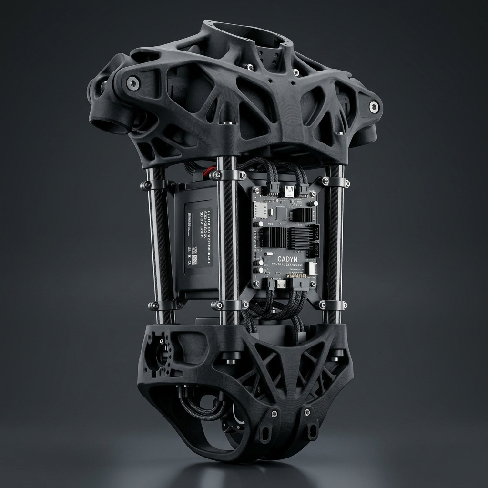
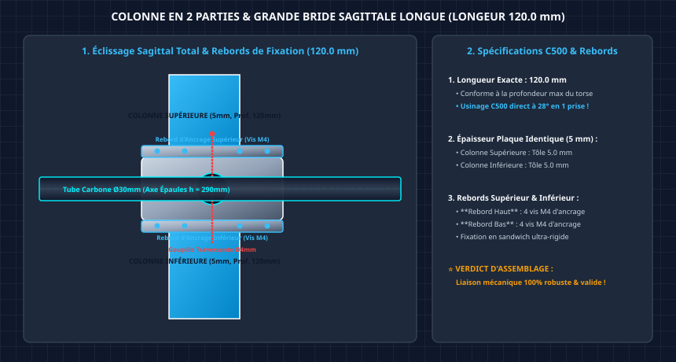
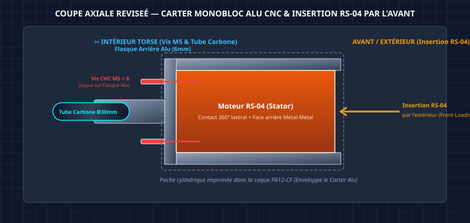

# 🔬 Analyse Stratégique du Torse D-Bot : Bilan & Recommandations

> [!IMPORTANT]
> **DÉCISION RETENUE (Août 2026) — Architecture Cruciforme**
>
> Après évaluation des 3 approches ci-dessous, l'**architecture cruciforme** a été retenue comme design final du torse D-Bot. Elle combine :
> - **1 plaque sagittale à lumières 2D** en aluminium 6061-T6 (5 mm, lumières 2D traversantes — Option B)
> - **1 traverse horizontale** en tube carbone Ø30 mm reliant les 2 épaules
> - **2 Cages H-Bracket d'épaule en Alu 7075-T6** (2 plaques 5mm évidées Ø95mm + bride monobloc 48.2mm + 2 tirants M5 axiaux à 23.4° R=72mm)
> - **2 paniers batterie latéraux** avec hot-swap (espace intérieur 100% libéré)
> - **Coque secondaire PA12-CF** (impression verticale Qidi Plus 4)
>
> Les 3 approches ci-dessous (Cage Alu, Spine Carbone, Split-Monocoque) sont **obsolètes** et archivées dans `./00_Archives_Recherche/`. Ce document est conservé comme justification historique de la décision.
>
> 📄 **Documents actifs** : [GUIDE_Fabrication_Torse_D-Bot_Hybride.md](./GUIDE_Fabrication_Torse_D-Bot_Hybride.md) · [ETUDE_Dimensionnement_Colonne_Vertebrale.md](./ETUDE_Dimensionnement_Colonne_Vertebrale.md)

Ce document fait le bilan complet de tout le travail de conception réalisé à date sur le torse du D-Bot, analyse objectivement les succès et les impasses, et propose des **voies pragmatiques** pour obtenir un design haut de gamme **sans passer des heures sur Fusion 360**.

---

## 1. Synthèse des 3 Approches Explorées

### 📊 Tableau Comparatif

| Critère | V1 : Cage Alu Boulonnée | Option A : Spine Carbone | Option C : Split-Monocoque |
|:---|:---:|:---:|:---:|
| **Masse estimée** | 2.36 kg | ~1.20 kg | ~1.50 kg |
| **Rigidité torsion** | 🟡 Moyenne (boulons) | 🟢 Excellente (tube central) | 🟢 Excellente (tubes + boîtiers) |
| **Risque vibratoire** | 🔴 48 vis M6 = desserrage | 🟡 Clampage = fluage | 🟡 Goupillage requis |
| **Compatible Qidi Plus 4** | ❌ Non (CNC alu requis) | ✅ Oui (blocs < 180 mm) | ✅ Oui (blocs < 140 mm) |
| **Complexité fabrication** | 🔴 CNC 5 axes pour nœuds | 🟢 Simple | 🟡 Moyenne |
| **Esthétique** | 🔴 Industriel/brut | 🟡 Squelettique | 🟢 Bionique premium |
| **Maturité doc.** | ★★★☆☆ | ★★☆☆☆ | ★★★☆☆ |

---

### A. V1 : Cage Tubulaire Boulonnée en Aluminium

**Documents** : [STUDY_Squelette_Torse.md](file:///Users/Shared/Mon%20Google%20Drive%20Physique/Documentation/01_Mecanique_et_Chassis/Torse/00_Archives_Recherche/STUDY_Squelette_Torse.md) · [FINAL_CONSOLIDE_Torse.md](file:///Users/Shared/Mon%20Google%20Drive%20Physique/Documentation/01_Mecanique_et_Chassis/Torse/00_Archives_Recherche/FINAL_CONSOLIDE_Torse.md) · [AUDIT_ETUDE_Torse.md](file:///Users/Shared/Mon%20Google%20Drive%20Physique/Documentation/01_Mecanique_et_Chassis/Torse/00_Archives_Recherche/AUDIT_ETUDE_Torse.md)

- **Principe** : 12 profilés carrés alu (40x40, 60x60, 35x35 mm), 8 nœuds CNC tri-axiaux en 6061-T6, 48 vis M6.
- **Bilan** : Calculs statiques très solides (FS de 8 à 155), mais **784 g de poids mort** (33% du squelette) uniquement en connexions. Le facteur dynamique x3 n'a jamais été validé par simulation. L'usinage des nœuds 3 axes sur la Carvera est très complexe.

> [!WARNING]
> Cette approche a été **déclarée obsolète** dans notre analyse comparative au profit de solutions PA12-CF + carbone, mieux adaptées à la Qidi Plus 4.

---

### B. Option A : Spine Carbone Centrale + Clamps

**Document** : [GUIDE_Modelisation_et_Securisation_Torse.md](file:///Users/Shared/Mon%20Google%20Drive%20Physique/Documentation/01_Mecanique_et_Chassis/Torse/00_Archives_Recherche/GUIDE_Modelisation_et_Securisation_Torse.md)

- **Principe** : Un tube carbone central de Ø50 mm, deux plaques d'extrémités alu CNC, des cages modulaires clampées autour du tube.
- **Bilan** : L'option la plus légère (~1.2 kg), simple à fabriquer. Mais nécessite 2 plaques alu usinées CNC, et le clampage sur carbone lisse présente un risque de glissement documenté.

---

### C. Option C : Split-Monocoque Hybride PA12-CF (Retenue)

**Documents** : [GUIDE_Modelisation_et_Securisation_Torse.md](file:///Users/Shared/Mon%20Google%20Drive%20Physique/Documentation/01_Mecanique_et_Chassis/Torse/00_Archives_Recherche/GUIDE_Modelisation_et_Securisation_Torse.md) · [generate_option_c_torso.py](file:///Users/Shared/Mon%20Google%20Drive%20Physique/Documentation/Code/scripts/fusion360/generate_option_c_torso.py)

- **Principe** : 2 boîtiers structurels fermés en PA12-CF (Pelvis 140 mm + Thorax 140 mm), reliés par 4 tubes carbone Ø25 mm, avec platine centrale porte-batterie/Jetson.
- **Bilan** : Le design le plus moderne et le plus adapté à votre setup. Un script Fusion 360 a été créé pour automatiser la génération de la base géométrique.

---

## 2. Bilan Honnête du Script Fusion 360

Le script [generate_option_c_torso.py](file:///Users/Shared/Mon%20Google%20Drive%20Physique/Documentation/Code/scripts/fusion360/generate_option_c_torso.py) génère avec succès :
- ✅ Le bloc solide du **Pelvis** (300x220x140 mm)
- ✅ Les **découpes bioniques frontales/dorsales** (plan XZ) sur le Pelvis
- ✅ Le bloc solide du **Thorax** (300x220x140 mm)
- ✅ Les **4 trous** pour tubes carbone (Pelvis et Thorax)
- ✅ Les **tubes carbone** (4x Ø25 mm, hauteur totale 420 mm)
- ✅ Le composant **Central_Equip_Mount** (colliers + platine)

Le script **échoue de manière récurrente** sur :
- ❌ Les **découpes bioniques latérales** (plan YZ) du Pelvis et du Thorax
- ❌ Les **supports d'épaules** et le **collet du cou** (qui dépendent de plans parallèles au plan YZ)

> [!IMPORTANT]
> **Cause racine** : L'API Python de Fusion 360 implémente un mappage d'axes non documenté pour les esquisses sur des plans parallèles au plan YZ. L'axe horizontal de l'esquisse (Sketch X) correspond à l'axe 3D Z (hauteur) et l'axe vertical (Sketch Y) à l'axe 3D Y (profondeur), mais avec une inversion de signe qui varie selon le contexte du composant et de ses opérations précédentes. Après 8 tentatives de correction (commits `6f062f7` à `5173e4b`), le mappage exact reste instable.

**Conclusion pragmatique** : Le scripting Python de l'API Fusion 360 pour des géométries complexes multi-plans est **extrêmement fragile et chronophage**. Ce n'est pas la bonne approche pour obtenir un design bionique premium.

---

## 3. Votre Design Cible (Rappel)

L'esthétique recherchée est celle de cette image de référence :



Les caractéristiques clés de ce design sont :
- Des **formes organiques** avec des évidements de type "topologie optimisée" (trous organiques dans les parois)
- Une **structure ouverte** qui laisse voir les composants internes (batterie, PCB)
- Des **tubes carbone** comme liaison structurelle verticale
- Des **supports de moteurs intégrés** (épaules, hanches, cou)
- Un look **bionique/squelettique ultra-premium**

---

## 4. 🎯 Recommandations Pragmatiques (Du Plus Simple au Plus Complexe)

### Recommandation 1 : Importer et Adapter un Modèle Open-Source Existant
⏱️ **Temps estimé : 2 à 4 heures** · 🏆 **Rapport qualité/effort : EXCELLENT**

Plusieurs projets humanoïdes open-source publient leurs fichiers CAO complets et éditables :

| Projet | Taille Robot | Format CAO | Lien |
|:---|:---:|:---:|:---|
| **Berkeley Humanoid Lite** | ~0.8-1.0 m, 16 kg | Onshape (export STEP) | [Documentation](https://berkeley-humanoid-lite.gitbook.io/docs/releases) |
| **Asimov v1** | 1.2 m | GitHub (STEP/STL) | [GitHub](https://github.com/asimovinc/asimov-1) |
| **Axon** | Variable | Onshape (remixable) | [Printables](https://www.printables.com) |
| **pib** | Variable | Onshape | [Onshape](https://www.onshape.com) |

**Workflow recommandé** :
1. Ouvrir le modèle **Onshape** de Berkeley Humanoid Lite (gratuit, dans le navigateur).
2. Exporter le composant torse en **STEP** (format universel éditable).
3. Importer le STEP dans Fusion 360.
4. **Adapter les dimensions** (mise à l'échelle) à vos cotes D-Bot (300x220x420 mm).
5. Modifier les points de fixation pour vos moteurs RS-04.

> [!TIP]
> Le Berkeley Humanoid Lite utilise des profilés alu + pièces 3D, une philosophie très proche de votre Option C. Son torse peut servir d'explorateur ou de base de départ.

---

### Recommandation 2 : Modéliser Directement dans OnShape (Gratuit, Cloud)
⏱️ **Temps estimé : 4 à 8 heures** · 🏆 **Rapport qualité/effort : TRÈS BON**

OnShape présente des avantages décisifs par rapport à Fusion 360 pour votre cas :
- **100% cloud** : pas de plantages de scripts locaux.
- **Version gratuite complète** (contrairement à Fusion 360 qui limite la simulation).
- **Export STEP natif** vers Fusion 360 si besoin.
- **Outils de Shell et Pattern** plus intuitifs pour créer des formes organiques.

**Workflow recommandé** :
1. Créer un compte OnShape gratuit.
2. Modéliser les 2 boîtiers (Pelvis + Thorax) comme des blocs avec des **coins arrondis** (Fillet).
3. Utiliser l'outil **Shell** (évidement automatique) pour creuser l'intérieur avec une épaisseur de paroi de 3 mm.
4. Dessiner les **évidements organiques** en créant des esquisses de formes libres (ellipses, arcs) sur les faces latérales, puis en extrudant en mode "Cut".
5. Ajouter les **trous de tubes carbone** et les **supports moteurs**.
6. Exporter tout en STEP → Importer dans Fusion 360 pour les finitions.

---

### Recommandation 3 : Simplifier le Design Fusion 360 (Sans Formes Organiques)
⏱️ **Temps estimé : 2 à 3 heures** · 🏆 **Rapport qualité/effort : BON**

Si vous souhaitez absolument rester dans Fusion 360, la voie la plus rapide est d'abandonner les découpes bioniques triangulaires (les truss du script) et d'utiliser des outils natifs de Fusion 360 :

**Workflow recommandé** :
1. **Exécuter le script actuel** : il génère les blocs solides, les trous de tubes et la platine centrale sans erreur.
2. **Manuellement dans Fusion 360** :
   - Appliquer des **congés (Fillets)** de 10-15 mm sur toutes les arêtes pour un look organique.
   - Utiliser l'outil **Shell** (Menu Modifier > Coque) : sélectionner les faces de dessus/dessous et créer une coque de 3 mm d'épaisseur en un clic.
   - Dessiner des **ellipses** ou **rectangles arrondis** sur les faces latérales, puis les extruder en mode "Cut" pour créer des fenêtres d'allègement esthétiques.
   - Ajouter les supports d'épaules comme des **cylindres extrudés** directement depuis les faces latérales.

> [!TIP]
> Les congés + la coque + quelques fenêtres elliptiques transforment un bloc brut en un design premium en **moins de 30 minutes** par pièce, sans aucun script Python.

---

### Recommandation 4 : Rechercher des Modèles Premium sur GrabCAD/Printables
⏱️ **Temps estimé : 1 à 2 heures** · 🏆 **Rapport qualité/effort : VARIABLE**

**Où chercher** :
- [GrabCAD](https://grabcad.com/library) → Rechercher "humanoid torso", "bionic robot chassis", filtrer par STEP.
- [Printables](https://www.printables.com) → Rechercher "humanoid robot", "robot torso frame".
- [Thingiverse](https://www.thingiverse.com) → Rechercher "humanoid robot torso".
- [Youbionic](https://www.youbionic.com) → Modèles de torses bioniques (certains payants mais très premium).

**Avantage** : Vous pouvez trouver des designs magnifiques prêts à l'emploi, les télécharger en STEP, et les adapter à vos dimensions dans Fusion 360.

---

## 5. Ma Préconisation Finale

Pour votre contexte spécifique (temps limité, Qidi Plus 4, PA12-CF, design premium visé), je recommande cette combinaison :

```
┌─────────────────────────────────────────────────────────┐
│  STRATÉGIE OPTIMALE : Recommandation 1 + 3 combinées   │
│                                                         │
│  1. Télécharger le torse du Berkeley Humanoid Lite      │
│     depuis Onshape → Export STEP                        │
│                                                         │
│  2. Importer dans Fusion 360 et adapter à vos cotes     │
│     (300x220x420 mm, tubes Ø25 mm)                      │
│                                                         │
│  3. Appliquer le workflow simplifié Fusion 360 :        │
│     → Congés organiques sur toutes les arêtes           │
│     → Shell automatique 3 mm                            │
│     → Fenêtres elliptiques d'allègement                 │
│     → Supports moteurs RS-04 cylindriques               │
│                                                         │
│  ⏱️ Temps total estimé : 3 à 5 heures                  │
│  🎯 Résultat : Design premium, imprimable, fonctionnel │
└─────────────────────────────────────────────────────────┘
```

> [!CAUTION]
> **Abandonner le script Python Fusion 360** pour les formes organiques. L'API d'esquisse multi-plans de Fusion 360 est trop instable pour du design complexe automatisé. Le temps investi en débogage dépasse largement le temps d'une modélisation manuelle guidée.

---

- [ ] Explorer le CAD OnShape du Berkeley Humanoid Lite et évaluer la compatibilité du torse avec vos dimensions
- [ ] Chercher 2-3 modèles de torses bioniques sur GrabCAD en format STEP
- [ ] Tester le workflow simplifié Fusion 360 (Congés + Shell + Fenêtres) sur le Pelvis généré par le script actuel
- [ ] Décider de la stratégie finale et lancer la modélisation

---

### 7. Schémas de Référence des Concepts Explorés



*Schéma du concept exploré : colonne vertébrale en 2 parties avec bride longue.*



*Schéma du concept d'emboîtement historique avec manchon alu et insertion interne.*

