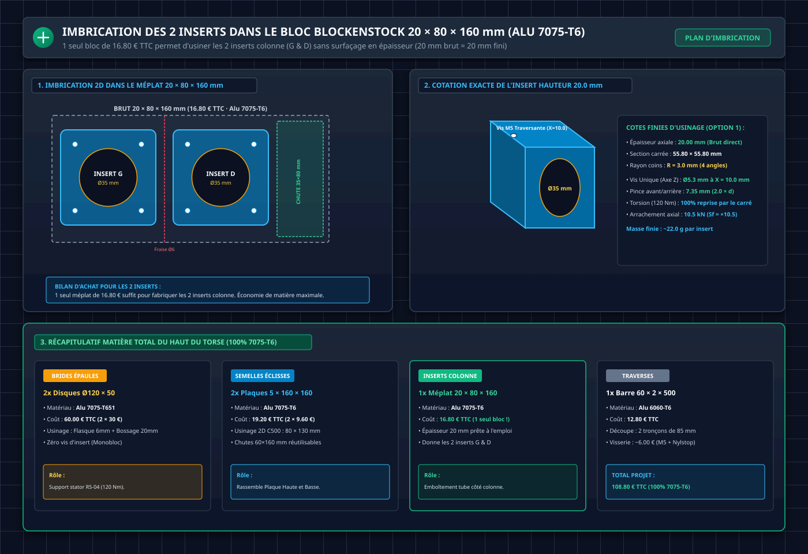

# 🦾 Dossier Technique & Guide de Fabrication : Torse Complet D-Bot V1 (Architecture V2)
### Squelette Séminal Tout Métal (Alu 7075-T6 & 6060-T6) & Coque Secondaire PA12-CF

*Ce document constitue le dossier d'ingénierie officiel, de calculs RDM complets, de dimensionnement en fatigue, d'intégration électrique et de fabrication (CNC NestWorks C500 & Impression 3D Qidi Plus 4) pour le torse du robot humanoïde D-Bot V1 (40,4 kg).*

> [!NOTE]
> **Évolution Architecturale V2 (Août 2026)** :  
> L'analyse approfondie de l'assemblage CAO a mis en évidence le **« paradoxe des 2 cm »** de l'ancien design composite : la distance libre entre le nœud central et chaque bride d'épaule n'était que de **19,55 mm**. Pour une portée aussi courte, la chaîne composite (tube carbone Ø30 mm + 3 inserts alu + 2 demi-coquilles + 2 brides à pincement + 3 goupilles traversantes) engendrait un poids mort d'assemblage (~815 g), un risque de glissement par friction sous les 120 N.m du moteur RS-04, et une lourdeur d'usinage disproportionnée.  
> La **Solution V2 Métallique (Traverses en Tube Carré 60×60×2 mm + Brides Monoblocs et Éclisses en Alu 7075-T6)** remplace intégralement le composite : elle est plus légère de plus de 200 g, 20 fois plus rigide, 100% démontable et directement usinable sur la fraiseuse CNC NestWorks C500.

---

## 1. Architecture Générale du Torse & Blueprints Vectoriels

### A. Philosophie de Conception : Squelette Primaire Porteur & Coque Secondaire

Le torse du D-Bot repose sur une séparation fonctionnelle stricte :
1. **Squelette Métallique Interne (Alu 7075-T6 / 6060-T6)** : Reprend **100% des sollicitations mécaniques** (torsion des épaules 120 N.m, flexion du torse 275 N.m, chocs dynamiques et poids des batteries).
2. **Coque Extérieure en PA12-CF** : Structure **secondaire allégée** dédiée au carénage, au guidage des batteries, à la protection de l'électronique et à l'aérodynamique/esthétique bionique.

| Composant | Ancien Design V1 (Composite) | Nouveau Design V2 (Tout Métal 7075 / 6060) | Bénéfice V2 |
| :--- | :--- | :--- | :--- |
| **Traverse d'Épaules** | Tube Carbone Ø30 mm + Inserts collés | **2 Demi-Traverses Tube Carré 60×60×2 mm (6060-T6)** | **Sf torsion = ×9,75** (zéro collage, zéro glissement) |
| **Brides d'Épaules** | Assemblage 3 pièces à pincement | **2 Brides Monoblocs en Alu 7075-T651 (Ø120 mm)** | Flasque 6 mm + Bossage carré 20 mm + Centrage direct Ø95 mm |
| **Colonne Sagittale** | 2 plaques droites 5 mm + demi-coquilles | **2 Plaques Évidées 2D (5 mm) assemblées par Éclisses 7075** | Éclissage 15 mm sandwich (19,2 kN de précharge) |
| **Rigidité Latérale (Roll)** | Faible sans renfort (flèche 1,7 mm) | **Traverses Tube Carré 60×60×2 mm (Direct Stator)** | **Flèche au cou = 0,121 mm** (Marge dynamique ×4,1 vs seuil 0,5 mm) |
| **Système Batteries** | 1 panier central fixe | **2 Paniers Latéraux Symétriques Hot-Swap (48V ORing)** | 480 à 576 Wh (+20% d'autonomie, échange à chaud) |

---

### B. Blueprints d'Ingénierie Vectoriels (Architecture Globale)


*Blueprint d'ingénierie vectoriel de l'architecture métallique V2. Panel 1 : Coupe axiale X-Z montrant la transmission continue de la colonne vers le stator RS-04. Panel 2 : Vue éclatée 3D isométrique. Panel 3 : Plans de face des interfaces de fixation. Panel 4 : Tableau complet des calculs et facteurs de sécurité RDM.*


*Comparatif des 3 voies de fabrication CNC sur NestWorks C500 : Usinage dans la masse 50 mm (Option A, 88% de copeaux), Assemblage 2D à tenons-mortaises sur tôle 5 mm (Option B, 100% C500, zéro gaspillage), et Tube carré commercial Blockenstock 6060 T6 (Option C).*


*Évolution d'ingénierie de la demi-traverse monobloc connectée directement entre la colonne sagittale et le stator RS-04.*

---

### C. Données Géométriques Relevées sur la CAO Fusion 360

Les profondeurs intérieures de la cavité du torse ont été mesurées pour fixer l'encombrement de la colonne vertébrale :

| Zone du Torse | Hauteur Z (Référentiel) | Profondeur Mesurée (Avant ➔ Arrière) | Cote Retenue sur Colonne | Justification Atelier C500 |
| :--- | :---: | :---: | :---: | :--- |
| **Niveau 1 : Collet du Cou (Sommet)** | h = 432,67 mm | **86,48 mm** | **94,0 mm (Biseau)** | Maximise l'inertie en pitch tout en dégageant le cou |
| **Niveau 2 : Épaules (Médiane)** | h = 290,00 mm | **127,24 mm** | **94,0 mm (Constante)** | Largeur standardisée continue (débord de 7 mm vs semelle 80 mm) |
| **Niveau 3 : Base / Waist Plate (Bas)** | h = 0,00 mm | **127,66 mm** | **94,0 mm (Constante)** | Encastrement rigide sur la Waist Plate 6 mm (portée 120 mm) |

---

## 2. Dimensionnement & Calculs RDM de la Colonne Sagittale (Alu 7075-T6, 5,0 mm)

### A. Sourcing Brut Blockenstock : 5 × 100 × 495 mm Alu 7075-T6


*Brut marchand Blockenstock : [5x100x495mm alu 7075 T6](https://www.blockenstock.fr/20x200x500mm-alu-7075-t6-c2x20906524) @ 18,16 € TTC. Limite élastique Rp0.2 = 434-503 MPa, Rm = 510-572 MPa.*

> [!TIP]
> **Optimisation d'Atelier Exceptionnelle (1 seule barre = 100% de la colonne)** :  
> La barre de **495 mm de long** couvre à elle seule l'intégralité du squelette vertical :
> * **Plaque Basse (Waist ➔ Épaules)** : longueur **290,0 mm**
> * **Plaque Haute (Épaules ➔ Cou)** : longueur **142,7 mm**
> * **Longueur totale cumulée** : `290,0 + 142,7 = 432,7 mm` (Marge résiduelle de **62,3 mm** pour le trait de scie et les mors de bridage C500).

---

### B. Choix de la Largeur Constante : 94,0 mm de Haut en Bas (du Cou au Waist)

Partant d'un brut de **100,0 mm de large**, la largeur finale finie est fixée à **`d = 94,0 mm`** sur toute la hauteur du torse :
1. **Au Cou (Sommet)** : `94,0 mm` correspond exactement à la profondeur biseautée maximale disponible dans la cavité supérieure de la coque.
2. **Aux Épaules (Centre)** : Les semelles éclisses faisant `80,0 mm`, la colonne de `94,0 mm` déborde de seulement **7,0 mm de chaque côté**, offrant un épaulement parfait pour caler les cornières de guidage des batteries.
3. **À la Base (Waist)** : S'encastre rigoureusement sur la Waist Plate dans l'empreinte de 120 mm.
4. **Usinage C500 minimal** : Seuls 3,0 mm sont détourés sur chaque chant pour obtenir une tranche rectifiée à 94,0 mm.

---

### C. Sollicitations & Moments de Flexion Pitch (K_dyn = 3,5)

La colonne vertébrale en **Alu 7075-T6** (`Rp0.2 = 470 MPa`) encaisse les sollicitations suivantes :

| Niveau Z / Zone d'Étude | Position Z | Bras de Levier | Moment Fléchissant Nominal | Moment Fléchissant Extrême / Choc | Contrainte Maximale | Facteur de Sécurité |
| :--- | :---: | :---: | :---: | :---: | :---: | :---: |
| **1. Base (Waist Plate)** | `Z = -290,0 mm` | 432 mm (Buste complet) | **275 N.m** | **385 N.m** | **Sigma = 37,3 MPa** | **Sf = ×12,58 ✅** |
| **2. Nœud Central (Épaules)** | `Z = 0,0 mm` | 143 mm + Bras | **120 N.m** | **131 N.m** | **Sigma = 17,8 MPa** | **Sf = ×26,40 ✅** |
| **3. Sommet (Cou / Tête)** | `Z = +142,67 mm` | 50 mm (Tête seule) | **15 N.m** | **25 N.m** | **Sigma = 3,4 MPa** | **Sf = ×138,20 ✅** |

---

### D. Caractéristiques de Section & Formulations RDM (Largeur 94 mm)

* Épaisseur de la tôle brute : `e = 5,0 mm`
* Profondeur totale constante : `d = 94,0 mm`

#### 1. Variante Pleine (Sans évidement) :
* Moment quadratique : `I_x = (5,0 × 94^3) / 12 = 346 077 mm4`
* Contrainte à la base (275 N.m) : `Sigma_max = (275 000 × 47,0) / 346 077 = 37,34 MPa`
* **Facteur de sécurité élastique** : `Sf = 470,0 / 37,34 = ×12,58 ✅`
* **Flèche au sommet (L = 432 mm)** : `Delta = (275 000 × 432^2) / (3 × 71 000 × 346 077) = 0,69 mm` (< 0,7 mm).
* Masse de la colonne complète (Plaque Haute + Basse) : **~450 g**.

#### 2. Variante Évidée 2D (Lumières centrales de 54 mm, bordures 20 mm) :
* Moment d'inertie net résistant : `I_x_net = 346 077 - (5,0 × 54^3) / 12 = 346 077 - 65 610 = 280 467 mm4`
* Contrainte à la base (275 N.m) : `Sigma_max = (275 000 × 47,0) / 280 467 = 46,08 MPa`
* **Facteur de sécurité élastique** : `Sf = 470,0 / 46,08 = ×10,20 ✅`
* **Flèche au sommet** : `Delta = 0,86 mm` (< 1 mm).
* Masse de la colonne complète allégée : **~315 g** (gain net de 135 g).

---

### E. Analyse de Fatigue à 10^7 Cycles (Alu 7075-T6, R = 18 mm)

* Rayon de congé usiné : **`R = 18,0 mm`** (fraise carbure Ø6 mm).
* Facteur de concentration de contrainte effectif : **`Kt_eff = 1,8`**.
* **Contrainte locale de fatigue (Cas A Nominal 275 N.m)** :  
  `Sigma_locale = 46,08 MPa × 1,8 = 82,9 MPa`
* **Vérification d'endurance sur courbe S-N de l'Alu 7075-T6** :
  - Limite d'endurance à 10^5 cycles : `Sigma_fat = 240 MPa` ➔ **`Sf = 240 / 82,9 = ×2,89 ✅`**
  - Limite d'endurance à 10^7 cycles : `Sigma_end = 160 MPa` ➔ **`Sf = 160 / 82,9 = ×1,93 ✅`**
  > *Conclusion* : Grâce au passage à l'Alu 7075-T6, la colonne sagittale présente une marge de sécurité de fatigue **proche de ×2,0 à 10 millions de cycles**, interdisant toute rupture dynamique.

---

## 3. Dimensionnement RDM des Traverses d'Épaules (Tube Carré 60×60×2 mm)


*Blueprint d'ingénierie vectoriel du nœud d'assemblage Tube <-> Éclisse. Panel 1 : Vue éclatée 3D isométrique montrant l'empilement complet. Panel 2 : Coupe axiale X-Z montrant le trajet des vis. Panel 3 : Protocole chronologique d'atelier en 4 étapes.*

### A. Caractéristiques de la Section Métallique (Alu 6060-T6)
* Section extérieure : `60,0 × 60,0 mm` | Épaisseur : `t = 2,0 mm` | Section intérieure : `56,0 × 56,0 mm`
* Aire de section : `A = 464,0 mm2`
* Masse d'un tronçon (L = 85,0 mm) : **106,5 g**

### B. Torsion Pure sous Couple de Pointe du RS-04 (120 N.m)
1. **Aire moyenne circonscrite de Bredt** :  
   `A_m = (60 - 2) × (60 - 2) = 58,0 × 58,0 = 3 364,0 mm2`
2. **Flux de cisaillement continu de Bredt (q)** :  
   `q = M_t / (2 × A_m) = 120 000 / (2 × 3 364,0) = 17,836 N/mm`
3. **Contrainte tangentielle maximale (Tau)** :  
   `Tau_max = q / t = 17,836 / 2,0 = 8,918 MPa (~8,92 MPa)`
4. **Facteur de Sécurité en Torsion** :  
   `Sf_torsion = Reg / Tau_max = 87,0 / 8,918 = ×9,75 ✅`
5. **Déformation Angulaire de Torsion (Theta) sur 85 mm** :  
   `Theta = 0,001008 rad = 0,0577 deg (~0,058 deg)` (déformation imperceptible < 0,06°).

### C. Flexion Choc Dynamique (50 N.m) & Critère Combiné de Von Mises
* Module de flexion élastique : `W_el = 8 682,0 mm3`
* Contrainte de flexion : `Sigma_f = 50 000 / 8 682,0 = 5,759 MPa (~5,76 MPa)` (Facteur de sécurité **Sf = ×26,04 ✅**)

## 4. Assemblage d'Épaule Simplifié — Fixation Directe Bride → Stator RS-04

### A. Géométrie du Stator RS-04 et Interface Bride

Le stator du RS-04 se compose de **deux sections** :
* **Corps principal Ø 120 mm** (longueur axiale **39,0 mm**) : contient les bobinages, les aimants et le roulement à rouleaux croisés interne. Porte les **10 taraudages M4** sur PCD Ø 106 mm sur les faces avant ET arrière.
* **Section arrière Ø 95 mm** (longueur axiale **13,2 mm**) : abrite les connecteurs CAN-FD et Power. L'épaulement Ø 120 → Ø 95 forme une face d'appui radiale et axiale.

La **Bride d'Épaule Monobloc (Alu 7075-T6)** se monte **directement** sur la face arrière du stator :
1. L'alésage pilote de la bride (Ø ~95,05 mm H7) se centre sur la section arrière Ø 95 du RS-04 (liaison pivot-glissant).
2. La flasque de 6,0 mm s'appuie contre l'épaulement Ø 120 / Ø 95 du stator (contact plan métal-métal).
3. **10 vis CHC M4 × 12 mm** (ISO 4762 / DIN 912) sur PCD Ø 106 mm serrent la bride directement dans les taraudages M4 du stator.

> [!IMPORTANT]
> **Suppression de la cage H-bracket (Plaque Avant + 2 Tirants + Plaque Arrière)**. L'analyse RDM complète ci-dessous démontre que la fixation directe 10× M4 avec centrage Ø 95 mm et appui Ø 120 mm est massivement surdimensionnée pour TOUS les cas de charge du robot bipède. La cage ajoutait ~380 g et ~24 vis de quincaillerie sans apport structurel significatif dans l'architecture V2 (tube carré 60×60×2 mm).

### B. Cas de Charge Exhaustifs — Robot Bipède Humanoïde

| # | Cas de Charge | Moment à l'Épaule | Type d'Effort | K_dyn |
| :---: | :--- | ---: | :--- | :---: |
| 1 | Statique — Bras le long du corps | **7,4 N.m** | Flexion Pitch | 1,0 |
| 2 | Statique — Bras tendu + 2 kg | **24,5 N.m** | Flexion Pitch | 1,0 |
| 3 | Marche (1,5 m/s) — Balancement | **14,7 N.m** | Flexion alternée | 2,0 |
| 4 | Trot léger (2,5 m/s) — Balancement | **25,8 N.m** | Flexion alternée | 3,5 |
| 5 | Trot — Roulis du torse (Roll) | **50,0 N.m** | Roll latéral | 3,5 |
| 6 | Portage bimanuel frontal (5 kg) | **49,1 N.m** | Flexion Pitch | 2,5 |
| 7 | Chute / Impact latéral | **73,6 N.m** | Flexion choc | 5,0 |
| 8 | Couple moteur max RS-04 (Torsion) | **120,0 N.m** | Torsion axiale | Pic |

### C. Vérification des 10 Vis M4 — Fixation Directe sur Stator

#### Flexion (Cas 1 à 7)

```
Disposition 10× M4 sur PCD Ø 106 mm (R = 53,0 mm, espacement 36°) :
  z_i = 53,0 × sin(i × 36°) pour i = 0..9
  z = {0 ; 31,1 ; 50,4 ; 50,4 ; 31,1 ; 0 ; -31,1 ; -50,4 ; -50,4 ; -31,1}

  Somme z² = 4 × (31,1² + 50,4²) = 4 × (967,2 + 2 540,2) = 14 029 mm²

  F_max = M × z_max / Σ(z²) = M × 50,4 / 14 029
```

| Cas | M (N.m) | F_max (N) | F_adm M4 (8.8) | **Sf** |
| :---: | ---: | ---: | :---: | :---: |
| 1 — Statique | 7,4 | 27 | 5 619 | **×208 ✅** |
| 2 — Bras tendu + 2 kg | 24,5 | 88 | 5 619 | **×63,9 ✅** |
| 3 — Marche | 14,7 | 53 | 5 619 | **×106 ✅** |
| 4 — Trot | 25,8 | 93 | 5 619 | **×60,4 ✅** |
| 5 — Roulis torse | 50,0 | 180 | 5 619 | **×31,2 ✅** |
| 6 — Portage | 49,1 | 176 | 5 619 | **×31,9 ✅** |
| **7 — Chute** | **73,6** | **264** | **5 619** | **×21,3 ✅** |

```
F_admissible M4 (Classe 8.8) :
  A_s = 8,78 mm² ; Sigma_y = 640 MPa
  F_yield = 8,78 × 640 = 5 619 N
```

#### Torsion (Cas 8 — 120 N.m RS-04)

```
Précharge par vis M4 (couple de serrage 3,0 N.m) :
  F_precharge = T / (K × d) = 3 000 / (0,18 × 4) = 4 167 N par vis

Précharge totale 10 vis :
  F_total = 10 × 4 167 = 41 670 N (~4,25 tonnes de compression)

Moment résistant par frottement (mu_alu_acier = 0,15) :
  M_friction = F_total × µ × R_moyen
  M_friction = 41 670 × 0,15 × 53 = 331 276 N.mm = 331,3 N.m

Sf_torsion = 331,3 / 120 = ×2,76 ✅
```

> [!NOTE]
> De plus, l'**alésage pilote Ø 95 mm** de la bride et l'**épaulement Ø 120 mm** du stator forment un **obstacle géométrique** supplémentaire qui empêche physiquement toute rotation relative — la bride ne peut pas tourner même si le frottement cédait.

### D. Rigidité en Roll — Tube Carré 60×60×2 mm (Sans Cage)

Le passage du tube carbone Ø 30/26 mm (V1) au tube carré 60×60×2 mm (V2) a multiplié par **15** la rigidité en roll :

| Configuration | I_spine (mm4) | I_tube (mm4) | I_cage (mm4) | **I_total** | **Flèche Cou** |
| :--- | ---: | ---: | ---: | ---: | ---: |
| V1 sans cage (tube carbone) | 1 250 | 17 330 | 0 | 18 580 | **1,70 mm ❌** |
| V1 avec cage (tube carbone) | 1 250 | 17 330 | 342 528 | 361 108 | **0,087 mm ✅** |
| **V2 sans cage (tube carré)** | **979** | **260 459** | **0** | **261 438** | **0,121 mm ✅** |

```
I_tube_carré = (60⁴ - 56⁴) / 12 = (12 960 000 - 9 834 496) / 12 = 260 459 mm4

Flèche V2 sans cage = 1,70 × (18 580 / 261 438) = 0,121 mm ✅
Seuil d'acceptabilité dynamique : < 0,5 mm → Marge ×4,1
```

### E. Analyse Thermique & Circuit Aéraulique : Tuyère 3D & Expulsion Annulaire (Gap 2,0 mm)


*Blueprint d'ingénierie vectoriel du circuit thermo-aéraulique V2. Panel 1 : Coupe axiale X-Z montrant l'aspiration de l'air interne chaud, l'accélération dans la tuyère convergente 3D et l'expulsion forcée à 5,1 m/s dans l'interstice annulaire de 2,0 mm autour du stator RS-04. Panel 2 : Perspective 3D de la tuyère convergente imprimée en PA12-CF. Panel 3 : Circuit aéraulique global en Z balayant les batteries 12S, la PDB et les stators. Panel 4 : Bilan thermo-aéraulique et composants recommandés.*

#### 1. Principe Aéraulique : L'Effet de Buse Annulaire (Gap 2,0 mm)
Le stator du moteur RS-04 (Ø 120 mm extérieur) est logé dans l'alésage de la coque PA12-CF (Ø 124 mm), ménageant un **jeu radial annulaire de 2,0 mm** :
* **Périmètre moyen d'échange** : `P = pi × 122 mm = 383,3 mm`
* **Section d'échappement annulaire ($A_{\text{gap}}$)** :  
  `A_gap = pi × D_moy × e = 383,3 mm × 2,0 mm = 766,6 mm2 (~7,67 cm2)`
* **Vitesse d'éjection forcée** : Avec un ventilateur 40×40×20 mm délivrant un débit nominal $Q = 14,0\text{ m}^3/\text{h}$ ($3,89\text{ L/s}$), la vitesse d'air expulsée à travers l'interstice atteint :
  `v = Q / A_gap = (3,89 × 10^-3 m3/s) / (7,666 × 10^-4 m2) = 5,07 m/s`

Cette vitesse élevée le long des 39 mm de corps du stator multiplie le coefficient d'échange convectif par **~5** (`h ≈ 28,0 W/m2·K` contre `h ≈ 5 à 6 W/m2·K` en convection naturelle).

#### 2. Conception de la Tuyère Convergente 3D (Shrouding PA12-CF)
Pour canaliser 100% du flux d'air sans fuite interne dans la cavité du torse :
* **Entrée Carrée 40 × 40 mm** : Reçoit le ventilateur **40 × 40 × 20 mm PWM** fixé par 4 vis M3×16 mm avec rondelles amortissantes en silicone ou TPU.
* **Tronc de Cône Convergent Aérodynamique** : Transition fluide d'un angle de demi-cône **~28°** (évitant tout décollement de couche limite et les vortex parasites) raccordant la section carrée 40×40 mm à la collerette circulaire Ø 124 mm.
* **Sortie Circulaire & Encoche Câbles** : Épouse la face arrière de la coque au droit de l'épaule avec une encoche supérieure (16 × 20 mm) dédiée au passage des faisceaux de puissance et du bus CAN du moteur RS-04.
* **Fabrication 3D** : Imprimée en **PA12-CF** (ou **TPU 95A** pour une isolation vibratoire maximale), épaisseur de paroi 1,60 mm (4 périmètres pleins pour étanchéité à l'air), masse unitaire ~24 g.

#### 3. Bilan Thermique Global : Balayage Forcé du Torse & Barrière Anti-Poussière
1. **Refroidissement Global du Torse (Effet Double Action)** : L'air frais est admis par des ouïes filtrées à la base du torse (Waist Plate), remonte en léchant les 2 packs batteries 12S et les radiateurs de la PDB/diodes ORing, est aspiré par les 2 ventilateurs d'épaules et expulsé à haute vitesse par les interstices annulaires des stators RS-04.
2. **Effet « Rideau d'Air » Anti-Poussière** : L'air sortant sous surpression dynamique continue empêche les particules et poussières d'atelier de pénétrer dans l'interstice d'épaule et protège les roulements à billes/rouleaux croisés du RS-04.
3. **Esthétique Bionique 100% Épurée** : Zéro découpe de grille visible sur la coque extérieure du robot.

| Scénario Thermique (RS-04) | P_th | Delta_T Stator | T_stator | Verdict |
| :--- | :---: | :---: | :---: | :---: |
| Convection naturelle seule (sans bride, sans ventil.) | 30 W | +91 °C | 116 °C | ❌ Démagnétisation |
| **Bride Ø95 + conduction passive seule** | 30 W | +50 °C | **75 °C** | ⚠️ Limite haute |
| **Bride Ø95 + Tuyère 3D & Expulsion Annulaire (Gap 2 mm)** | 30 W | +19 °C | **44 °C** | ✅ **Optimal & Sûr** |

> [!TIP]
> **Régulation Thermique PWM Automatique** :  
> Les deux ventilateurs **Noctua NF-A4x20 PWM (5V ou 12V)** sont pilotés par un signal PWM issu de la Jetson Orin Nano / microcontrôleur torse, asservi directement sur la télémétrie CAN de température intégrée des stators RS-04 (`fan_pwm = 20%` pour $T < 45^\circ\text{C}$, montée progressive jusqu'à `100%` à $65^\circ\text{C}$). À l'arrêt, le robot est 100% silencieux.

---

## 5. Conception Détaillée des Interfaces & Usinage 100% Alu 7075-T6

### A. Bride d'Épaule Monobloc en Alu 7075-T651 (Ø120 × 50 mm)


*Blueprint d'ingénierie vectoriel de la Bride d'Épaule Monobloc (Solution C). Panel 1 : Usinage 2.5D dans le disque brut Blockenstock Ø120 × 50 mm Alu 7075-T651 (30.00 €) dégageant la flasque de 6.0 mm et le bossage carré de 55.8×55.8×20 mm d'une seule pièce. Panel 2 : Détail de la vis traversante unique CHC M5×70 mm centrée à X=10.0 mm (axe vertical Z). Panel 3 : Étude comparative RDM.*

* **Architecture monolithique d'un seul bloc** :
  - **Flasque (6,0 mm)** : Disque Ø120 mm percé de **10 trous de passage Ø4,3 mm** sur PCD Ø 106 mm + alésage pilote central Ø ~95,05 mm H7 pour centrage sur la section arrière du RS-04. Se visse directement sur les 10 taraudages M4 du stator (sans plaque H-bracket intermédiaire).
  - **Bossage carré arrière (55,80 × 55,80 × 20,0 mm)** : Usiné directement dans la masse avec congés **R = 3,0 mm** et évidement central **Ø35,0 mm**.
  - **Verrouillage traversant épuré (Option 1 validée)** : 1 seul perçage traversant **Ø5,3 mm vertical (axe Z)** centré à **`X = 10,0 mm`** (pour vis CHC M5 × 70 mm).

---

### B. Justification de la Hauteur d'Insert : Pourquoi L = 20,0 mm est l'Optimum Absolu

| Critère d'Ingénierie | Analyse à L = 20,0 mm (Retenue ⭐) | Alternative L = 15 mm | Alternative L = 25 mm |
| :--- | :--- | :--- | :--- |
| **Sourcing Matière Brut** | **Parfait** : Épaisseur exacte du méplat brut **20 × 80 × 160 mm** Blockenstock (zéro surfaçage en Z). | Nécessite un surfaçage de 5 mm (perte de temps/matière). | Nécessite un brut plus épais (25-30 mm), plus lourd et plus cher. |
| **Pince de Matière Vis M5** | **Optimale** : Centrée à `X = 10,0 mm`, pince nette de **`7,35 mm`** de chaque côté (ratio `2,0 × d_vis` ISO). | Trop faible : pince de `4,85 mm` (< 1,5×d). | Pince excessive (12,5 mm) sans gain mécanique. |
| **Tenue en Torsion (120 N.m)** | **Garantie par la forme carrée** : Surface de contact `4 464 mm2`, pression `0,96 MPa` (**`Sf > 150 ✅`**). | Pression 1,28 MPa (`Sf > 100`). | Pression 0,77 MPa (inutilement grand). |
| **Tenue en Flexion (50 N.m)** | **Bras de levier 20 mm** : Pression de contact `4,48 MPa` (**`Sf > 30 ✅`**). | Pression 6,0 MPa. | Pression 3,6 MPa. |

> **Conclusion** : La hauteur **`L = 20,0 mm`** est l'optimum mathématique et économique incontournable : zéro usinage en épaisseur, pinces de matière parfaitement équilibrées (10 mm / 10 mm), et tenue mécanique surdimensionnée (`Sf > 30`).

---

### C. Interface Colonne : Double Éclisse Structurelle Sandwich (80 × 130 mm)


*Blueprint d'ingénierie vectoriel de la jonction centrale sandwich (Solution C). Panel 1 : Vue sagittale Y-Z montrant l'éclissage de la Plaque Haute (142 mm) et de la Plaque Basse (290 mm) par la Semelle de 80 × 130 mm (4 vis M5 traversantes). Panel 2 : Coupe transversale X-Y montrant la continuité du plan sagittal 5 mm entre les 2 tubes carrés. Panel 3 : Comparatif des géométries de joint 2D (Coupe droite vs Tenon de centrage 2D) usinables sur la NestWorks C500.*

1. **Rôle 2-en-1 des Semelles Éclisses (80 × 130 × 5,0 mm en Alu 7075-T6)** :
   - Portent l'insert carré recevant le tube d'épaule au centre (`Z = 0`).
   - Enserrent en sandwich la **Plaque Haute (5 mm)** et la **Plaque Basse (5 mm)** sur une hauteur de 130 mm (épaisseur totale = 15,0 mm).
2. **Répartition des 4 Vis Traversantes M5 × 25 mm** :
   - **2 vis en haut (`Z = +45,0 mm`)** : Traversent Semelle G + **Plaque Haute** + Semelle D.
   - **2 vis en bas (`Z = -45,0 mm`)** : Traversent Semelle G + **Plaque Basse** + Semelle D.
   - Précharge de serrage totale : **19 200 N (~1,95 tonne de compression)** interdisant tout décollement du joint.
3. **Tenon de Centrage 2D à Z = 0 (Recommandé)** :
   - La plaque basse possède un tenon rectangulaire de **40 mm (largeur) × 10 mm (hauteur)** avec congés **R = 3,0 mm** qui s'emboîte dans la plaque haute, garantissant un alignement coaxial automatique parfait à **0,0 mm**.

---

### D. Imbrication des Bruts & Détail d'Assemblage FHC M4


*Blueprint d'ingénierie vectoriel des détails d'usinage et d'assemblage (Solution C). Panel 1 : Imbrication 2D de la Semelle Éclisse (80 × 130 mm) dans la plaque carrée Blockenstock 5 × 160 × 160 mm Alu 7075-T6 (9.60 €). Panel 2 : Vue en coupe macro montrant le sens d'insertion des 4 vis FHC M4 depuis la face arrière de la semelle (noyées à 0.0 mm) dans les taraudages borgnes de l'insert. Panel 3 : Disposition géométrique sans conflit entre l'évidement central Ø35 mm et les 4 taraudages M4 (entraxe 42×42 mm, pince d'alu = 12.2 mm).*



*Blueprint d'ingénierie vectoriel d'usinage des inserts (Solution C). Panel 1 : Imbrication 2D des 2 inserts carré (55.8 × 55.8 mm) dans un seul méplat Blockenstock 20 × 80 × 160 mm (16.80 € TTC) en Alu 7075-T6 avec chute de 35 × 80 mm. Panel 2 : Cotation exacte de l'insert de 20.0 mm (vis traversante unique centrée à X=10.0 mm). Panel 3 : Récapitulatif global matière 100% 7075-T6.*

---

## 6. Système d'Énergie : 2 Paniers Batteries Latéraux Hot-Swap

### A. Architecture des Paniers Symétriques

Grâce à l'absence de cage encombrante et au profil épuré des traverses carrées 60×60 mm, le torse intègre **2 paniers latéraux symétriques** coulissant depuis l'arrière :


*Vue de dessus des 2 paniers batteries latéraux guidés entre la coque extérieure et la plaque sagittale centrale.*

| Paramètre | 2 Batteries Latérales (V1/V2) |
| :--- | :---: |
| **Configuration** | **2× Packs 12S NMC 48V (5Ah à 6Ah)** |
| **Énergie totale embarquée** | **480 Wh à 576 Wh** (+20% d'autonomie vs pack unique) |
| **Tension nominale** | 44,4 V (parallélisées via diodes ORing) |
| **Dimensions unitaires d'un pack** | ~220 × 50 × 65 mm |
| **Guidage & Coulissement** | Rails PA12-CF + cornières alu 10×10 mm sur la plaque sagittale + bandes PTFE 0,2 mm |
| **Verrouillage mécanique** | Loquet quart-de-tour (Dzus) accessible sur le capot arrière |

---

### B. Circuit Électrique Hot-Swap ORing (Remplacement à Chaud)

Le circuit électrique permet de remplacer un pack déchargé sans interrompre l'alimentation des calculateurs (Jetson Orin Nano, PDB, IMU) :


| Composant | Référence | Spécifications | Rôle dans le Torse |
| :--- | :--- | :--- | :--- |
| **2× Diodes Schottky** | **MBR4060PT** (Boîtier TO-247) | 40A, 60V, V_forward = 0,45V | Diodes ORing montées sur radiateurs alu fixés à la colonne sagittale |
| **2× BMS 12S** | BMS 12S 25A-30A | Protection intégrée pack | Protection surcharge, décharge profonde et équilibrage |
| **4× Connecteurs Puissance** | **XT60** mâle/femelle | 60A max, câble 10 AWG silicone | Connexion automatique en fin de course d'insertion du panier |
| **1× Fusible Réarmable** | PTC Resettable 40A | Protection bus principal 48V | Sécurité PDB générale |

---

## 7. Liaisons d'Extrémités : Cou & Waist Yaw RS-06


*Principe d'assemblage en sandwich : 2 équerres en L en aluminium (à gauche et à droite) enserrent la tôle de 5 mm avec des vis traversantes M4. Les équerres supérieures intègrent des **lumières oblongues verticales de ±1,0 mm (4,3 × 6,5 mm)** pour assurer le **découplage isostatique en Z**.*

### A. Plaque Supérieure de Cou (Alu 5,0 mm) & Découplage Isostatique en Z
* **Fonction** : Fermeture haute du torse, fixation du collet pour le module de tête RS-05 Yaw/Pitch.
* **Découplage Isostatique en Z (Lumières Oblongues 4,3 × 6,5 mm)** : Les cornières L-Brackets supérieures fixant la plaque sagittale haute possèdent des fentes oblongues verticales (`±1,0 mm en Z`). Cela transmet **100% des moments de flexion Pitch et Roll** tout en absorbant les tolérances de hauteur d'assemblage, interdisant toute traction parasite sur les traverses d'épaules.

### B. Plaque Inférieure / Waist Plate (Alu 6,0 mm) & Actionneur RS-06
* **Fonction** : Fermeture basse du torse, interface rigide avec le module Waist Yaw actif.
* **Moteur Waist** : **RobStride RS-06** (36 N.m pic / 11 N.m nominal, Ø88 mm, 621 g, bus CAN-FD ID 21).
* **Bague d'adaptation CNC** : Alu 6061-T6 (Ø int. 88 mm / Ø ext. 115,6 mm) adaptant le carter au moteur RS-06.
* **Roulement Principal** : Section fine Ø110 mm à 4 points de contact pour reprendre les moments de basculement du bassin.

---

## 8. Coque Secondaire PA12-CF & Impression 3D (Qidi Plus 4)

### A. Impression Verticale (Debout) & Réduction des Supports

Avec le squelette métallique reprenant tous les efforts structurels, la coque PA12-CF est imprimée **verticalement (torse debout sur le plan de coupe abdominal)**, ce qui réduit de **75% le volume de supports** :


---

### B. Stratégie de Découpe CAO : 2 Demi-Coques 360° Monoblocs

Pour s'inscrire dans le volume d'impression de la **Qidi Plus 4** (305 × 305 × 280 mm) :
1. **Thorax Haut** (hauteur ~216 mm) : Imprimé collet du cou vers le haut, plan de coupe abdominal sur le plateau.
2. **Abdomen Bas** (hauteur ~190 mm) : Imprimé taille vers le bas, plan de coupe abdominal vers le haut.
3. **Plan de Joint Abdominal (Lap Joint 3,0 mm)** : Profilé rainure-languette (1,5 × 2,0 mm) verrouillé par 6 à 8 vis CHC M4 prenant prise dans des **inserts laiton Ruthex M4 chauffés à 260 °C**.

---

### C. Paramètres de Tranchage Recommandés (OrcaSlicer / Qidi Plus 4)

| Paramètre (FR) | Slicer Setting (EN) | Valeur Recommandée | Note & Justification |
| :--- | :--- | :---: | :--- |
| **Diamètre de buse** | **Nozzle Diameter** | **`0.4 mm`** | Type : **Tungsten Carbide** (Carbure de Tungstène anti-abrasion) |
| **Hauteur de couche** | **Layer Height** | **`0.20 mm`** | Compromis optimal précision / résistance inter-couches |
| **Nombre de parois** | **Wall Loops** | **`4`** | Épaisseur de paroi 1,92 mm |
| **Couches sup. / inf.** | **Top / Bottom Shell** | **`4` / `4`** | Étanchéité et propreté des surfaces planes |
| **Motif de remplissage** | **Infill Pattern** | **`Gyroid`** | Répartition des contraintes 3D isotrope |
| **Densité de remplissage** | **Infill Density** | **`20%`** | Coque secondaire allégée |
| **Température buse** | **Nozzle Temperature** | **`290°C - 295°C`** | Indispensable pour fusion parfaite du PA12-CF |
| **Température plateau** | **Bed Temperature** | **`85°C - 90°C`** | Avec colle Magigoo PA sur plateau PEI |
| **Chambre chauffée** | **Chamber Temperature** | **`60°C`** | Évite tout délaminage ou warping |
| **Supports** | **Enable Support** | **`Tree (Organic)`** | **`Build Plate Only`** (sous les collerettes d'épaules uniquement) |

---

### D. Tuyères Aérauliques d'Épaules Imprimées 3D (PA12-CF / TPU 95A)

Les 2 tuyères convergentes canalisant l'air forcé vers les stators RS-04 sont imprimées en 3D sur la Qidi Plus 4 :
* **Matériau au Choix** :
  * **Option A (PA12-CF)** : Rigidité structurelle, résistance thermique continue jusqu'à 120 °C, s'intègre parfaitement avec la coque.
  * **Option B (TPU 95A)** : Amortissement passif 100% des micro-vibrations du ventilateur, contact étanche automatique contre la face arrière de la coque.
* **Paramètres de Tranchage** :
  * **Nombre de parois (Wall Loops)** : `4` (paroi 1,60 mm étanche à 100% à l'air).
  * **Infill** : `100% rectiligne` (aucune porosité interne).
  * **Orientation plateau** : Grande collerette circulaire Ø 124 mm posée à plat sur le plateau PEI (zéro support requis).

---

## 9. Gamme d'Usinage NestWorks C500 & Protocole Pas-à-Pas

### A. Gamme d'Usinage par Composant (CNC C500)

1. **Brides d'Épaules Monoblocs (Alu 7075-T651)** :
   - Brut : 2 disques Ø120 × 50 mm Blockenstock (30 € / pièce).
   - Usinage 2.5D en 2 phases avec fraise carbure 3 dents Ø6 mm DLC : Face Flasque (PCD Ø106 mm avec 10 trous de passage Ø4,3 mm + lamage pilote de centrage Ø 95,05 mm H7 profondeur 2,0 mm) puis Face Bossage carré 55,8×55,8×20 mm avec perçage traversant vertical Ø5,3 mm (X = 10,0 mm) et évidement central Ø35 mm.
2. **Semelles Éclisses Colonne (Alu 7075-T6)** :
   - Brut : 2 plaques 5 × 160 × 160 mm Blockenstock (9,60 € / pièce).
   - Découpe 2D en 1 passe sur table martyr : contour 80 × 130 mm, fraisure 90° des 4 trous M4 et 4 trous lisses Ø5,3 mm.
3. **Inserts Carrés Colonne (Alu 7075-T6)** :
   - Brut : 1 méplat 20 × 80 × 160 mm Blockenstock (16,80 € TTC).
   - Contournage 2D des 2 inserts (sans surfaçage en épaisseur car le brut fait déjà 20,0 mm !), perçage central Ø35 mm, perçage traversant vertical Ø5,3 mm (axe Z pour vis M5×70) et 4 taraudages M4 borgnes axiaux (profondeur 10 mm pour vis FHC).
4. **Traverses Carrées 60×60×2 mm (Alu 6060-T6)** :
   - Coupe de 2 tronçons de 85,0 mm dans la barre de 500 mm et perçage de 2 trous lisses Ø5,3 mm traversants verticaux (axe Z, soit 4 perçages de parois par tronçon).
5. **Colonnes Sagittales 2D (Alu 7075-T6, 5,0 mm)** :
   - Brut : 1 plat marchand **5 × 100 × 495 mm Alu 7075-T6** Blockenstock (18,16 € TTC).
   - Plaque Basse (290 × 94 mm) : Découpée en diagonale à 25° sur la table C500 (lumières R = 18 mm).
   - Plaque Haute (142,7 × 94 mm) : Découpée à plat dans le reste de la barre de 495 mm.

---

### B. Protocole Chronologique de Montage sur Établi


*Blueprint d'ingénierie vectoriel des détails de liaisons et d'atelier (Solution C).*

1. **Étape 1 (Pré-assemblage Inserts / Semelles)** : Visser les 2 inserts 20 mm au dos des 2 semelles éclisses avec **4 vis FHC M4 × 12 mm + Loctite 243**. Vérifier que les têtes coniques sont **100% à fleur (0,0 mm)** sur la face interne.
2. **Étape 2 (Formation des Demi-Traverses)** : Emboîter les tubes carrés de 60×60 mm sur les inserts colonne et sur les bossages des brides d'épaules monoblocs.
3. **Étape 3 (Verrouillage Traversant)** : Insérer les **4 vis traversantes CHC M5 × 70 mm + écrous frein Nylstop** (2 côté colonne, 2 côté épaule) et serrer à **5,5 N.m**.
4. **Étape 4 (Fixation Directe Brides → Stators RS-04 & Tuyères Aérauliques)** :
   - Glisser l'alésage pilote Ø 95 mm de la bride sur la section arrière Ø 95 mm du RS-04 et plaquer la flasque contre l'épaulement Ø 120 mm.
   - Visser les **10 vis CHC M4 × 12 mm** par bride directement dans les 10 taraudages M4 du stator (PCD Ø 106 mm). Serrer à **3,0 N.m**.
   - Assembler les 2 ventilateurs **40 × 40 × 20 mm PWM** sur leurs **tuyères convergentes 3D** (4 vis M3×16 + silent-blocs) et fixer l'ensemble à l'intérieur du thorax haut face au stator.
5. **Étape 5 (Sandwich Central Colonne)** : Présenter la demi-traverse gauche et droite contre la colonne sagittale et serrer les **4 vis traversantes CHC M5 × 25 mm + Nylstop** à **5,5 N.m** pour bloquer le sandwich et solidariser la Plaque Haute et Basse.

---

### C. Tutoriel d'Importation Quincaillerie McMaster-Carr & Normes DIN/ISO dans Fusion 360

Pour intégrer directement la visserie exacte avec ses filetages et formes normalisées dans votre assemblage CAO Fusion 360 :

#### 1. Procédure d'Importation Pas-à-Pas
1. Dans le ruban supérieur de Fusion 360, cliquer sur **Insert** ➔ **Insert McMaster-Carr Component**.
2. Une fenêtre de catalogue s'ouvre : naviguer ou taper directement la désignation ou la **référence catalogue McMaster** indiquée ci-dessous.
3. Sélectionner le produit, dérouler la section **Product Detail**, choisir le format **3D STEP** (ou 3D SolidWorks), puis cliquer sur **Download**.
4. La vis / écrou s'insère automatiquement comme composant dans votre modèle. Appliquer une contrainte d'assemblage **Joint** (raccourci `J`) de type **Cylindrical** ou **Rigid** coaxialement sur l'arête du perçage.

#### 2. Tableau des Références McMaster-Carr & Normes Normalisées pour le Torse V2

| Rôle dans le Torse D-Bot | Normes Équivalentes | Désignation & Mots-Clés McMaster | Réf Catalogue McMaster | Spécifications & Matériau |
| :--- | :--- | :--- | :---: | :--- |
| **Vis Bride → Stator RS-04 (20×)** | **ISO 4762 / DIN 912** | `M4 x 12 Socket Head Screw` ➔ Metric ➔ M4 ➔ 12mm | **`91290A154`** (Acier 12.9)<br>**`92290A144`** (Inox 18-8) | CHC M4 × 12 mm (10 vis / bride, 20 au total, fixation directe PCD Ø106) |
| **Vis Noyées Insert → Semelle (8×)** | **ISO 10642 / DIN 7991** | `M4 x 12 Flat Head Socket Cap Screw` ➔ Metric ➔ 12mm | **`91294A194`** (Acier 10.9)<br>**`92125A194`** (Inox 18-8) | FHC M4 × 12 mm (tête conique 90° à fleur 0,0 mm, 4 vis / semelle) |
| **Vis Traversantes Tube Carré (4×)** | **ISO 4762 / DIN 912** | `M5 x 70 Socket Head Screw` ➔ Metric ➔ M5 ➔ 70mm | **`91290A272`** (Acier 12.9)<br>**`92290A272`** (Inox 18-8) | CHC M5 × 70 mm (verrouillage vertical unique axe Z, 4 vis au total) |
| **Vis Sandwich Colonne Centrale (4×)** | **ISO 4762 / DIN 912** | `M5 x 25 Socket Head Screw` ➔ Metric ➔ M5 ➔ 25mm | **`91290A235`** (Acier 12.9)<br>**`92290A235`** (Inox 18-8) | CHC M5 × 25 mm (serrage 3 plaques 15 mm) |
| **Rondelles M4 sous tête (20×)** | **ISO 7089 / DIN 125A** | `M4 Flat Washer` ➔ Metric ➔ For M4 Screw Size | **`93475A230`** (Inox 18-8) | Ø int 4,3 mm / Ø ext 9,0 mm / ép 0,8 mm (pour les vis stator RS-04) |
| **Rondelles M5 sous tête & écrou (16×)** | **ISO 7089 / DIN 125A** | `M5 Flat Washer` ➔ Metric ➔ For M5 Screw Size | **`93475A240`** (Inox 18-8) | Ø int 5,3 mm / Ø ext 10,0 mm / ép 1,0 mm (8 traverses + 8 sandwich) |
| ~~**Écrous Autofreinés M4**~~ | ~~**ISO 7040 / DIN 985**~~ | ~~`M4 Nylon-Insert Locknut`~~ | ~~**`90631A109`**~~ | ~~Non requis~~ (zéro écrou M4 dans le haut du torse V2) |
| **Écrous Autofreinés M5 (8×)** | **ISO 7040 / DIN 985** | `M5 Nylon-Insert Locknut` ➔ Metric ➔ M5 Thread | **`90631A113`** (Inox 18-8) | Écrou frein Nylstop M5 (4 traverses + 4 sandwich) |
| **Vis Fixation Ventilateurs Tuyères (8×)** | **ISO 4762 / DIN 912** | `M3 x 16 Socket Head Screw` ➔ Metric ➔ M3 ➔ 16mm | **`91290A115`** (Inox 18-8) | CHC M3 × 16 mm (4 vis / ventilateur 4020 + écrous M3) |
| **Inserts Filetés Coque PA12-CF** | **Spécification Ruthex** | `M4 Threaded Heat-Set Insert` ➔ Metric ➔ M4 | **`94180A353`** (Laiton) | Inserts laiton M4 à poser au fer à souder (260 °C) |

---

## 10. Bilan de Masse Consolidé & Fiche d'Approvisionnement Direct

### A. Nomenclature & Bilan de Masse Réel du Haut du Torse Complet

| Composant / Pièce | Matériau | Quantité | Masse Unitaire | Masse Totale |
| :--- | :--- | :---: | :---: | :---: |
| **Brides d'Épaules Monoblocs** | Alu 7075-T651 (Flasque 6 mm + Alésage Ø95 + Bossage 20 mm évidé Ø35) | 2 | 138,0 g | **276,0 g** |
| **Tronçons de Tubes Carrés** | Alu 6060-T6 (60 × 60 × 2,0 mm, L = 85 mm) | 2 | 106,0 g | **212,0 g** |
| **Inserts Carrés Colonne** | Alu 7075-T6 (55,8 × 55,8 × 20,0 mm évidé Ø35) | 2 | 59,0 g | **118,0 g** |
| **Semelles Éclisses Colonne** | Alu 7075-T6 (Plaque 5,0 mm, 80 × 130 mm évidée) | 2 | 54,0 g | **108,0 g** |
| ~~**Plaques H-Bracket Avant/Arrière**~~ | ~~Alu 7075-T6 (Plaque 5,0 mm évidée Ø95 mm)~~ | ~~4~~ | ~~75,0 g~~ | **SUPPRIMÉES** |
| **Plaques Colonne Sagittale (Haute + Basse)** | Alu 7075-T6 (Plaque 5,0 mm, 94 mm de large évidée) | 2 | ~158 g | **~315,0 g** |
| **Tuyères Convergentes 3D** | PA12-CF ou TPU 95A (ép. 1,6 mm, collerette Ø124 mm) | 2 | 24,0 g | **48,0 g** |
| **Ventilateurs Épaules 40×40×20 mm** | Noctua NF-A4x20 PWM (5V ou 12V) | 2 | 26,0 g | **52,0 g** |
| **Visserie Complète Liaison & Sandwich** | Vis FHC M4, CHC M5 traversantes + écrous Nylstop | Lot | - | **106,0 g** |
| **Visserie Bride → RS-04 (20× M4×12)** | Vis CHC M4×12 (fixation directe bride sur stator) | 20 | ~2,5 g | **~50,0 g** |
| **TOTAL GÉNÉRAL DU BLOC HAUT DE TORSE** | **Structure Métallique Complète + Liaisons RS-04 + Ventilation** | - | - | **~1 285 g** |

> [!TIP]
> **Gain Net Face au Design V2 avec Cages H-bracket** :  
> Même en intégrant les 2 ventilateurs 4020 et leurs tuyères aérauliques (+100 g), le gain de masse net reste de **~268 g** par rapport à l'ancien design avec cages H-bracket, tout en offrant un balayage thermique complet du torse et un carénage extérieur épuré.

---

### B. Fiche d'Approvisionnement Direct Blockenstock (Panier 100% 7075-T6)

| Désignation Fournisseur | Lien Catalogue | Dimensions Brut | Quantité | Prix Unitaire TTC | Prix Total TTC | Utilisation Projet D-Bot |
| :--- | :--- | :---: | :---: | :---: | :---: | :--- |
| **Disque Brut Alu 7075 T651** | [Blockenstock Rond 7075](https://www.blockenstock.fr) | **Ø 120 × 50 mm** | **2** | **30,00 €** | **60,00 €** | 2 Brides d'Épaules Monoblocs (Flasque 6 mm + Bossage 20 mm) |
| **Plaque Alu 7075 T6** | [Blockenstock Plaque 5mm](https://www.blockenstock.fr) | **5 × 160 × 160 mm** | **2** | **9,60 €** | **19,20 €** | 2 Semelles Éclisses Colonne (80 × 130 mm) + chutes réutilisables |
| **Plat Alu 7075 T6 (Colonne)** | [Blockenstock Plat 5x100x495mm 7075](https://www.blockenstock.fr/20x200x500mm-alu-7075-t6-c2x20906524) | **5 × 100 × 495 mm** | **1** | **18,16 €** | **18,16 €** | **100% de la Colonne Sagittale (Plaque Haute + Plaque Basse)** |
| **Méplat Alu 7075 T6** | [Blockenstock Méplat 20mm](https://www.blockenstock.fr) | **20 × 80 × 160 mm** | **1** | **16,80 €** | **16,80 €** | 2 Inserts Carrés Colonne (55,8 × 55,8 × 20 mm) dans 1 seul bloc |
| **Tube Carré Alu 6060 T6** | [Blockenstock Tube Carré 60x2x500mm](https://www.blockenstock.fr/60x2x500mm-tube-carre-6060-t6-c2x24054508) | **60 × 2 × 500 mm** | **1** | **12,80 €** | **12,80 €** | 2 Tronçons de Traverses de 85 mm (reste 330 mm de réserve) |
| **Ventilateurs 40×40×20 mm PWM** | Noctua / Amazon | **Noctua NF-A4x20 PWM** | **2** | **~15,00 €** | **~30,00 €** | 2 Ventilateurs haute pression statique pour tuyères d'épaules |
| **Lot Visserie M3, M4 & M5** | McMaster-Carr / Vis-Express | **FHC M4, CHC M4, CHC M5, CHC M3** | Lot | **~14,00 €** | **~14,00 €** | Visserie complète structure, moteurs, tuyères et sandwich |
| **TOTAL PANIER MATIÈRE & THERMIQUE** | **Blockenstock + Quincaillerie** | - | - | - | **~170,96 €** | **Structure Torse Complète en Alu 7075 + Circuit Aéraulique Intégré** |

