# 🦾 Dossier Technique & Guide de Fabrication : Torse Complet D-Bot V1 (Architecture V2)
### Squelette Séminal Tout Métal (Alu 7075-T6 & 6060-T6) & Coque Secondaire PA12-CF

*Ce document constitue le dossier d'ingénierie officiel, de calculs RDM complets, de dimensionnement en fatigue, d'intégration électrique et de fabrication (CNC NestWorks C500 & Impression 3D Qidi Plus 4) pour le torse du robot humanoïde D-Bot V1 (40,4 kg).*

> [!NOTE]
> **Évolution Architecturale V2 (Août 2026)** :  
> L'analyse approfondie de l'assemblage CAO a mis en évidence le **« paradoxe des 2 cm »** de l'ancien design composite : la distance libre entre le nœud central et chaque bride d'épaule n'était que de **19,55 mm**. Pour une portée aussi courte, la chaîne composite (tube carbone Ø30 mm + 3 inserts alu + 2 demi-coquilles + 2 brides à pincement + 3 goupilles traversantes) engendrait un poids mort d'assemblage (~815 g), un risque de glissement par friction sous les 120 N.m du moteur RS-04, et une lourdeur d'usinage disproportionnée.  
> La **Solution V2 Métallique (Traverses en Tube Carré 60×60×2 mm + Brides Monoblocs et Éclisses en Alu 7075-T6)** remplace intégralement le composite : elle est plus légère de plus de 200 g, 20 fois plus rigide, 100% démontable et directement usinable sur la fraiseuse CNC NestWorks C500.

---

## 📑 Sommaire Général

- [**1. Architecture Générale du Torse & Blueprints Vectoriels**](#1-architecture-générale-du-torse--blueprints-vectoriels)
  - [A. Philosophie de Conception : Squelette Primaire Porteur & Coque Secondaire](#a-philosophie-de-conception--squelette-primaire-porteur--coque-secondaire)
  - [B. Blueprints d'Ingénierie Vectoriels (Architecture Globale)](#b-blueprints-dingénierie-vectoriels-architecture-globale)
  - [C. Données Géométriques Relevées sur la CAO Fusion 360](#c-données-géométriques-relevées-sur-la-cao-fusion-360)
- [**2. Dimensionnement & Calculs RDM de la Colonne Sagittale (Alu 7075-T6, 5,0 mm)**](#2-dimensionnement--calculs-rdm-de-la-colonne-sagittale-alu-7075-t6-50-mm)
  - [A. Sourcing Brut Blockenstock : 5 × 100 × 495 mm Alu 7075-T6](#a-sourcing-brut-blockenstock--5--100--495-mm-alu-7075-t6)
  - [B. Choix de la Largeur Constante : 94,0 mm de Haut en Bas](#b-choix-de-la-largeur-constante--940-mm-de-haut-en-bas-du-cou-au-waist)
  - [C. Sollicitations & Moments de Flexion Pitch (K_dyn = 3,5)](#c-sollicitations--moments-de-flexion-pitch-k_dyn--35)
  - [D. Caractéristiques de Section & Formulations RDM](#d-caractéristiques-de-section--formulations-rdm-largeur-94-mm)
  - [E. Analyse de Fatigue Multirégime (Alu 7075-T6, R = 18 mm, Kt = 1,8)](#e-analyse-de-fatigue-multirégime-alu-7075-t6-r--18-mm-kt--18)
- [**3. Dimensionnement RDM des Traverses d'Épaules (Tube Carré 60×60×2 mm)**](#3-dimensionnement-rdm-des-traverses-dépaules-tube-carré-60602-mm)
  - [A. Caractéristiques de la Section Métallique (Alu 6060-T6)](#a-caractéristiques-de-la-section-métallique-alu-6060-t6)
  - [B. Torsion Pure sous Couple de Pointe du RS-04 (120 N.m)](#b-torsion-pure-sous-couple-de-pointe-du-rs-04-120-nm)
  - [C. Flexion Choc Dynamique (50 N.m) & Critère Combiné de Von Mises](#c-flexion-choc-dynamique-50-nm--critère-combiné-de-von-mises)
  - [D. Tolérancement Axial & Isostatisme : 1 Butée Franche + 1 Jeu Fonctionnel](#d-tolérancement-axial--isostatisme--1-butée-franche--1-jeu-fonctionnel-10-mm)
- [**4. Assemblage d'Épaule Simplifié — Fixation Directe Bride → Stator RS-04**](#4-assemblage-dépaule-simplifié--fixation-directe-bride--stator-rs-04)
  - [A. Géométrie du Stator RS-04 et Interface Bride](#a-géométrie-du-stator-rs-04-et-interface-bride)
  - [B. Cas de Charge Exhaustifs — Robot Bipède Humanoïde](#b-cas-de-charge-exhaustifs--robot-bipède-humanoïde)
  - [C. Vérification des 10 Vis M4 — Fixation Directe sur Stator](#c-vérification-des-10-vis-m4--fixation-directe-sur-stator)
  - [D. Rigidité en Roll — Tube Carré 60×60×2 mm (Sans Cage)](#d-rigidité-en-roll--tube-carré-60602-mm-sans-cage)
  - [E. Analyse Thermique & Circuit Aéraulique : Tuyère 3D & Expulsion Annulaire](#e-analyse-thermique--circuit-aéraulique--tuyère-3d--expulsion-annulaire-gap-20-mm)
- [**5. Conception Détaillée des Interfaces & Usinage 100% Alu 7075-T6**](#5-conception-détaillée-des-interfaces--usinage-100-alu-7075-t6)
  - [A. Bride d'Épaule Monobloc en Alu 7075-T651 (Ø120 × 50 mm)](#a-bride-dépaule-monobloc-en-alu-7075-t651-ø120--50-mm)
  - [B. Justification de la Hauteur d'Insert : Pourquoi L = 15,0 mm est l'Optimum](#b-justification-de-la-hauteur-dinsert--pourquoi-l--150-mm-est-loptimum-révision-audit-v21)
  - [C. Interface Colonne : Double Éclisse Structurelle Sandwich (80 × 130 mm)](#c-interface-colonne--double-éclisse-structurelle-sandwich-80--130-mm)
  - [D. Imbrication des Bruts & Détail d'Assemblage FHC M4 Traversantes](#d-imbrication-des-bruts--détail-dassemblage-fhc-m4-traversantes--écrous-nylstop)
- [**6. Système d'Énergie : 2 Paniers Batteries Latéraux Hot-Swap**](#6-système-dénergie--2-paniers-batteries-latéraux-hot-swap)
  - [A. Architecture des Paniers Symétriques](#a-architecture-des-paniers-symétriques)
  - [B. Circuit Électrique Hot-Swap ORing (Remplacement à Chaud)](#b-circuit-électrique-hot-swap-oring-remplacement-à-chaud)
- [**7. Liaisons d'Extrémités : Cou & Waist Yaw RS-06**](#7-liaisons-dextrémités--cou--waist-yaw-rs-06)
  - [A. Plaque Supérieure de Cou (Alu 5,0 mm) & Découplage Isostatique en Z](#a-plaque-supérieure-de-cou-alu-50-mm--découplage-isostatique-en-z)
  - [B. Plaque Inférieure / Waist Plate (Alu 6,0 mm) & Actionneur RS-06](#b-plaque-inférieure--waist-plate-alu-60-mm--actionneur-rs-06)
- [**8. Coque Secondaire PA12-CF & Impression 3D (Qidi Plus 4)**](#8-coque-secondaire-pa12-cf--impression-3d-qidi-plus-4)
  - [A. Impression Verticale (Debout) & Réduction des Supports](#a-impression-verticale-debout--réduction-des-supports)
  - [B. Stratégie de Découpe CAO : 2 Demi-Coques 360° Monoblocs](#b-stratégie-de-découpe-cao--2-demi-coques-360-monoblocs)
  - [C. Paramètres de Tranchage Recommandés (OrcaSlicer / Qidi Plus 4)](#c-paramètres-de-tranchage-recommandés-orcaslicer--qidi-plus-4)
  - [D. Tuyères Aérauliques d'Épaules Imprimées 3D (PA12-CF / TPU 95A)](#d-tuyères-aérauliques-dépaules-imprimées-3d-pa12-cf--tpu-95a)
- [**9. Gamme d'Usinage NestWorks C500 & Protocole Pas-à-Pas**](#9-gamme-dusinage-nestworks-c500--protocole-pas-à-pas)
  - [A. Gamme d'Usinage par Composant (CNC C500)](#a-gamme-dusinage-par-composant-cnc-c500)
  - [B. Protocole Chronologique de Montage sur Établi](#b-protocole-chronologique-de-montage-sur-établi)
  - [C. Tutoriel McMaster-Carr, Quincaillerie, Freins-Filets & Pâte Thermique](#c-tutoriel-dimportation-quincaillerie-mcmaster-carr--normes-diniso-dans-fusion-360)
- [**10. Bilan de Masse Consolidé & Fiche d'Approvisionnement Direct**](#10-bilan-de-masse-consolidé--fiche-dapprovisionnement-direct)
  - [A. Nomenclature & Bilan de Masse Réel du Haut du Torse Complet](#a-nomenclature--bilan-de-masse-réel-du-haut-du-torse-complet)
  - [B. Fiche d'Approvisionnement Direct Blockenstock (Panier 100% 7075-T6)](#b-fiche-dapprovisionnement-direct-blockenstock-panier-100-7075-t6)

---

## 1. Architecture Générale du Torse & Blueprints Vectoriels

### A. Philosophie de Conception : Squelette Primaire Porteur & Coque Secondaire

Le torse du D-Bot repose sur une séparation fonctionnelle stricte :
1. **Squelette Métallique Interne (Alu 7075-T6 / 6060-T6)** : Reprend **100% des sollicitations mécaniques** (torsion des épaules 120 N.m, flexion du torse 275 N.m, chocs dynamiques et poids des batteries).
2. **Coque Extérieure en PA12-CF** : Structure **secondaire allégée** dédiée au carénage, au guidage des batteries, à la protection de l'électronique et à l'aérodynamique/esthétique bionique.

| Composant | Ancien Design V1 (Composite) | Nouveau Design V2 (Tout Métal 7075 / 6060) | Bénéfice V2 |
| :--- | :--- | :--- | :--- |
| **Traverse d'Épaules** | Tube Carbone Ø30 mm + Inserts collés | **2 Demi-Traverses Tube Carré 60×60×2 mm (6060-T6)** | **Sf torsion = ×9,75** (zéro collage, zéro glissement) |
| **Brides d'Épaules** | Assemblage 3 pièces à pincement | **2 Brides Monoblocs en Alu 7075-T651 (Ø120 mm)** | Flasque 5 mm + Bossage carré **15 mm** + Centrage direct Ø95 mm |
| **Colonne Sagittale** | 2 plaques droites 5 mm + demi-coquilles | **2 Plaques Évidées 2D (5 mm) assemblées par Éclisses 7075** | Éclissage 15 mm sandwich (19,2 kN de précharge) |
| **Rigidité Latérale (Roll)** | Faible sans renfort (flèche 1,7 mm) | **Traverses Tube Carré 60×60×2 mm (Direct Stator)** | **Flèche au cou = 0,121 mm** (Marge dynamique ×4,1 vs seuil 0,5 mm) |
| **Système Batteries** | 1 panier central fixe | **2 Paniers Latéraux Symétriques Hot-Swap (48V ORing)** | 480 à 576 Wh (+20% d'autonomie, échange à chaud) |

---

### B. Blueprints d'Ingénierie Vectoriels (Architecture Globale)

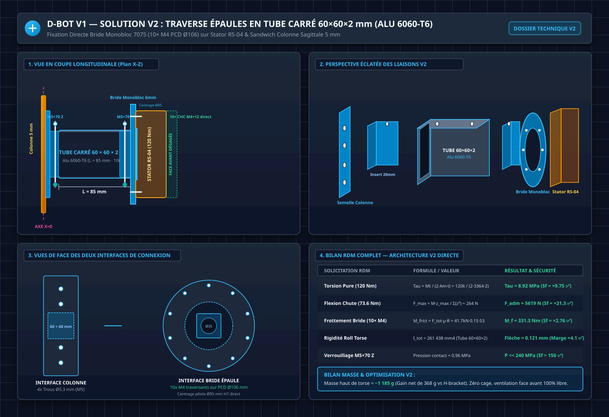

*Blueprint d'ingénierie vectoriel de l'architecture métallique V2. Panel 1 : Coupe axiale X-Z montrant la transmission continue de la colonne vers le stator RS-04. Panel 2 : Vue éclatée 3D isométrique. Panel 3 : Plans de face des interfaces de fixation. Panel 4 : Tableau complet des calculs et facteurs de sécurité RDM.*

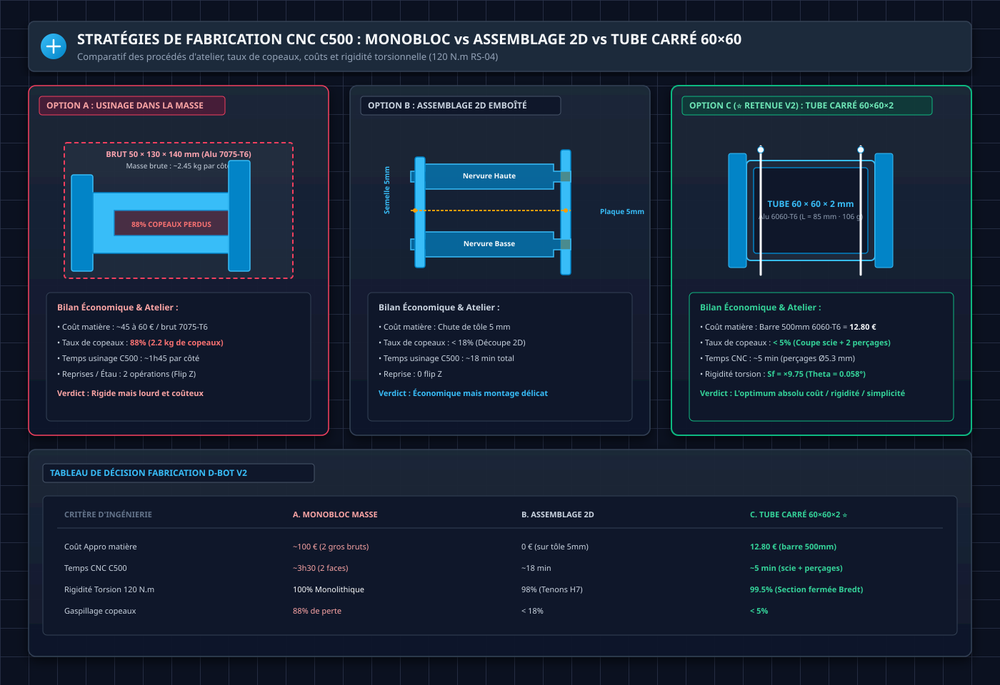

*Comparatif des 3 voies de fabrication CNC sur NestWorks C500 : Usinage dans la masse 50 mm (Option A, 88% de copeaux), Assemblage 2D à tenons-mortaises sur tôle 5 mm (Option B, 100% C500, zéro gaspillage), et Tube carré commercial Blockenstock 6060 T6 (Option C).*

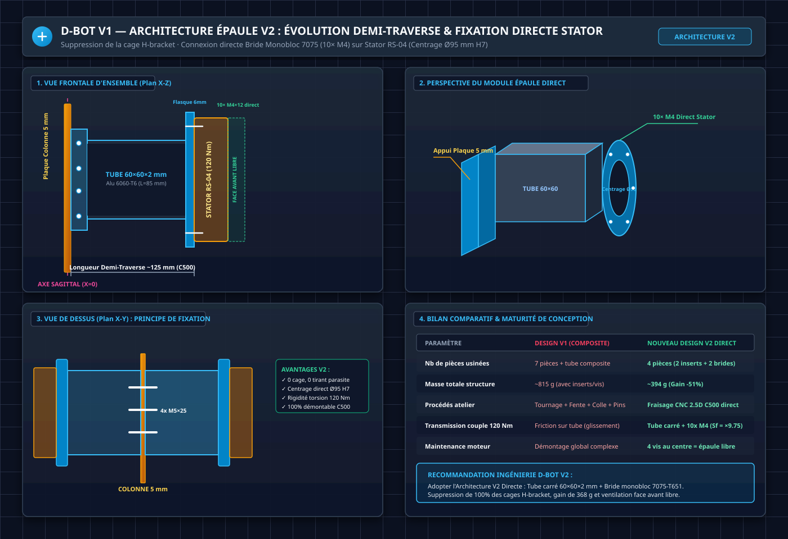

*Évolution d'ingénierie de la demi-traverse monobloc connectée directement entre la colonne sagittale et le stator RS-04.*

---

### C. Données Géométriques Relevées sur la CAO Fusion 360

Les profondeurs intérieures de la cavité du torse ont été mesurées pour fixer l'encombrement de la colonne vertébrale :

| Zone du Torse | Hauteur Z (Référentiel) | Profondeur Mesurée (Avant ➔ Arrière) | Cote Retenue sur Colonne | Justification Atelier C500 |
| :--- | :---: | :---: | :---: | :--- |
| **Niveau 1 : Collet du Cou (Sommet)** | h = 432,67 mm | **86,48 mm** | **94,0 mm (Biseau)** | Maximise l'inertie en pitch tout en dégageant le cou |
| **Niveau 2 : Épaules (Médiane)** | h = 290,00 mm | **127,24 mm** | **94,0 mm (Constante)** | Largeur standardisée continue (débord de 7 mm vs semelle 80 mm) |
| **Niveau 3 : Base / Waist Plate (Bas)** | h = 0,00 mm | **127,66 mm** | **94,0 mm (Constante)** | Encastrement rigide sur la Waist Plate 6 mm (portée 120 mm) |

---

## 2. Dimensionnement & Calculs RDM de la Colonne Sagittale (Alu 7075-T6, 5,0 mm)

### A. Sourcing Brut Blockenstock : 5 × 100 × 495 mm Alu 7075-T6

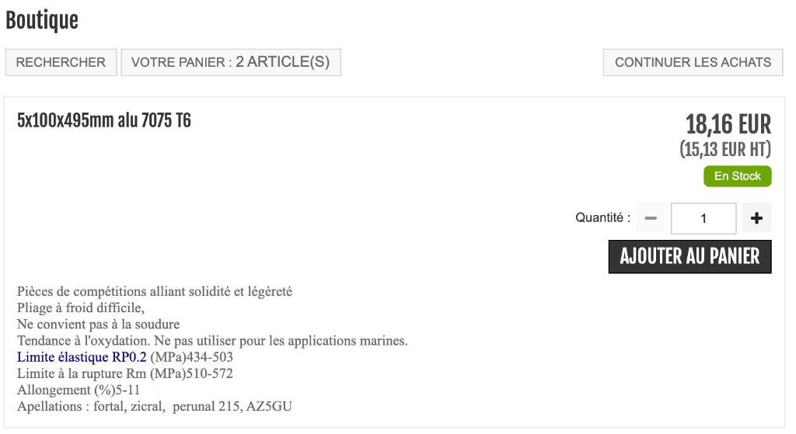

*Brut marchand Blockenstock : [5x100x495mm alu 7075 T6](https://www.blockenstock.fr/20x200x500mm-alu-7075-t6-c2x20906524) @ 18,16 € TTC. Limite élastique Rp0.2 = 434-503 MPa, Rm = 510-572 MPa.*

> [!TIP]
> **Optimisation d'Atelier Exceptionnelle (1 seule barre = 100% de la colonne)** :  
> La barre de **495 mm de long** couvre à elle seule l'intégralité du squelette vertical :
> * **Plaque Basse (Waist ➔ Épaules)** : longueur **290,0 mm**
> * **Plaque Haute (Épaules ➔ Cou)** : longueur **142,7 mm**
> * **Longueur totale cumulée** : `290,0 + 142,7 = 432,7 mm` (Marge résiduelle de **62,3 mm** pour le trait de scie et les mors de bridage C500).

---

### B. Choix de la Largeur Constante : 94,0 mm de Haut en Bas (du Cou au Waist)

Partant d'un brut de **100,0 mm de large**, la largeur finale finie est fixée à **`d = 94,0 mm`** sur toute la hauteur du torse :
1. **Au Cou (Sommet)** : `94,0 mm` correspond exactement à la profondeur biseautée maximale disponible dans la cavité supérieure de la coque.
2. **Aux Épaules (Centre)** : Les semelles éclisses faisant `80,0 mm`, la colonne de `94,0 mm` déborde de seulement **7,0 mm de chaque côté**, offrant un épaulement parfait pour caler les cornières de guidage des batteries.
3. **À la Base (Waist)** : S'encastre rigoureusement sur la Waist Plate dans l'empreinte de 120 mm.
4. **Usinage C500 minimal** : Seuls 3,0 mm sont détourés sur chaque chant pour obtenir une tranche rectifiée à 94,0 mm.

---

### C. Sollicitations & Moments de Flexion Pitch (K_dyn = 3,5)

La colonne vertébrale en **Alu 7075-T6** (`Rp0.2 = 470 MPa`) encaisse les sollicitations suivantes :

| Niveau Z / Zone d'Étude | Position Z | Bras de Levier | Marche Continue (2 Hz) | Pic Dynamique / Arrêt Brutal | Contrainte Max (Pic) | Facteur de Sécurité (Élastique) |
| :--- | :---: | :---: | :---: | :---: | :---: | :---: |
| **1. Base (Waist Plate)** | `Z = -290,0 mm` | 432 mm (Buste complet) | **~25 à 30 N.m** | **275 N.m (Choc 385 N.m)** | **Sigma = 37,3 MPa** | **Sf = ×12,58 ✅** |
| **2. Nœud Central (Épaules)** | `Z = 0,0 mm` | 143 mm + Bras | **~10 à 15 N.m** | **120 N.m (Choc 131 N.m)** | **Sigma = 17,8 MPa** | **Sf = ×26,40 ✅** |
| **3. Sommet (Cou / Tête)** | `Z = +142,67 mm` | 50 mm (Tête seule) | **~2 à 5 N.m** | **15 N.m (Choc 25 N.m)** | **Sigma = 3,4 MPa** | **Sf = ×138,20 ✅** |

---

### D. Caractéristiques de Section & Formulations RDM (Largeur 94 mm)

* Épaisseur de la tôle brute : `e = 5,0 mm`
* Profondeur totale constante : `d = 94,0 mm`

#### 1. Variante Pleine (Sans évidement) :
* Moment quadratique : `I_x = (5,0 × 94^3) / 12 = 346 077 mm4`
* Contrainte à la base (275 N.m) : `Sigma_max = (275 000 × 47,0) / 346 077 = 37,34 MPa`
* **Facteur de sécurité élastique** : `Sf = 470,0 / 37,34 = ×12,58 ✅`
* **Flèche au sommet (L = 432 mm)** : `Delta = (275 000 × 432^2) / (2 × 71 000 × 346 077) = 1,04 mm` (< 1,5 mm).
  > *Note méthodologique* : La formule `M × L^2 / (2 × E × I)` correspond à la flèche d'une poutre encastrée-libre sous moment appliqué en tête. En réalité, le chargement du buste est distribué (poids de la tête + bras + charges) à différentes hauteurs, la flèche réelle se situe dans la plage **0,5 à 1,0 mm** selon la posture. La valeur de 1,04 mm est le cas majorant conservatif.
* Masse de la colonne complète (Plaque Haute + Basse) : **~450 g**.

#### 2. Variante Évidée 2D (Lumières centrales de 54 mm, bordures 20 mm) :
* Moment d'inertie net résistant : `I_x_net = 346 077 - (5,0 × 54^3) / 12 = 346 077 - 65 610 = 280 467 mm4`
* Contrainte à la base (275 N.m) : `Sigma_max = (275 000 × 47,0) / 280 467 = 46,08 MPa`
* **Facteur de sécurité élastique** : `Sf = 470,0 / 46,08 = ×10,20 ✅`
* **Flèche au sommet** : `Delta = (275 000 × 432^2) / (2 × 71 000 × 280 467) = 1,28 mm` (< 1,5 mm).
* Masse de la colonne complète allégée : **~315 g** (gain net de 135 g).

---

### E. Analyse de Fatigue Multirégime (Alu 7075-T6, R = 18 mm, Kt = 1,8)

L'évaluation de la tenue en fatigue distingue rigoureusement le régime de marche cyclique continue et les pics de décélération d'urgence :

#### 1. Régime 1 : Marche Continue Bipède (Régime Permanent à 10^8 à 10^9 cycles)
* **Sollicitation cyclique à chaque pas (2 Hz)** : Oscillation naturelle du centre de masse du buste (~18 kg à +/-15 mm) avec micro-impacts de pose de pied ➔ **`M_cyclique = 30,0 N.m`**.
* **Contrainte nominale** : `Sigma_nom = (30 000 × 47,0) / 280 467 = 5,03 MPa`
* **Contrainte locale effective** : `Sigma_locale = 5,03 MPa × 1,8 = 9,05 MPa`
* **Vérification d'endurance à 10^9 cycles (Courbe S-N Alu 7075-T6, Sigma_end = 130 MPa)** :
  * `Sf_marche (10^9 cycles) = 130 MPa / 9,05 MPa = ` **`×14,36 ✅`**
  > *Conclusion Régime 1* : En marche continue sur 3 à 5 ans (~5 × 10^8 cycles), la contrainte de 9,05 MPa est située très profondément sous la limite d'endurance (130 MPa), garantissant une **durée de vie en fatigue infinie**.

#### 2. Régime 2 : Pics Dynamiques d'Arrêt d'Urgence / Décélération Brutale (Cas Extrême 275 N.m)
* **Sollicitation extrême** : Arrêt d'urgence à pleine vitesse bras tendus avec charge utile (K_dyn = 3,5) ➔ **`M_pic = 275,0 N.m`**.
* **Contrainte locale effective** : `Sigma_locale = 46,08 MPa × 1,8 = 82,9 MPa`
* **Facteurs de correction de fatigue appliqués** :
  * Facteur de surface `k_s = 0,85` (usinage CNC fin, non poli)
  * Facteur de taille `k_d = 0,90` (section de 94 mm, rapport d'échelle vs éprouvette standard Ø 7,6 mm)
  * **Limite d'endurance corrigée à 10^7 cycles** : `Sigma_end_corr = 160 × 0,85 × 0,90 = 122,4 MPa`
* **Vérification d'endurance à 10^7 cycles** :
  * `Sf_pic (10^7 cycles) = 122,4 MPa / 82,9 MPa = ` **`×1,48 ✅`**
  > *Note méthodologique* : Ce test à 275 N.m relève d'un ultra-conservatisme académique (supposant 10 millions d'arrêts d'urgence consécutifs à pleine charge). Même sous cette hypothèse extrême avec tous les abattements de fatigue appliqués (surface, taille), la marge de sécurité corrigée reste de **×1,48** (confortable au-dessus de 1,0).

---

## 3. Dimensionnement RDM des Traverses d'Épaules (Tube Carré 60×60×2 mm)

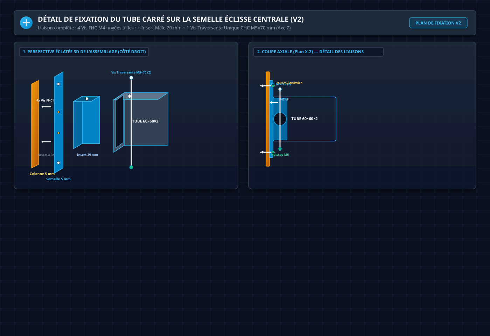

*Blueprint d'ingénierie vectoriel du nœud d'assemblage Tube <-> Éclisse. Panel 1 : Vue éclatée 3D isométrique montrant l'empilement complet. Panel 2 : Coupe axiale X-Z montrant le trajet des vis. Panel 3 : Protocole chronologique d'atelier en 4 étapes.*

### A. Caractéristiques de la Section Métallique (Alu 6060-T6)
* Section extérieure : `60,0 × 60,0 mm` | Épaisseur : `t = 2,0 mm` | Section intérieure : `56,0 × 56,0 mm`
* Aire de section : `A = 464,0 mm2`
* Masse d'un tronçon (L = 85,0 mm) : **106,5 g**

### B. Torsion Pure sous Couple de Pointe du RS-04 (120 N.m)
1. **Aire moyenne circonscrite de Bredt** :  
   `A_m = (60 - 2) × (60 - 2) = 58,0 × 58,0 = 3 364,0 mm2`
2. **Flux de cisaillement continu de Bredt (q)** :  
   `q = M_t / (2 × A_m) = 120 000 / (2 × 3 364,0) = 17,836 N/mm`
3. **Contrainte tangentielle maximale (Tau)** :  
   `Tau_max = q / t = 17,836 / 2,0 = 8,918 MPa (~8,92 MPa)`
4. **Facteur de Sécurité en Torsion** :  
   `Sf_torsion = Reg / Tau_max = 87,0 / 8,918 = ×9,75 ✅`
5. **Déformation Angulaire de Torsion (Theta) sur 85 mm** :  
   `Theta = 0,001008 rad = 0,0577 deg (~0,058 deg)` (déformation imperceptible < 0,06°).

### C. Flexion Choc Dynamique (50 N.m) & Critère Combiné de Von Mises
* Module de flexion élastique : `W_el = 8 682,0 mm3`
* Contrainte de flexion : `Sigma_f = 50 000 / 8 682,0 = 5,759 MPa (~5,76 MPa)` (Facteur de sécurité **Sf = ×26,04 ✅**)

---

### D. Tolérancement Axial & Isostatisme : 1 Butée Franche + 1 Jeu Fonctionnel (1,0 mm)

Pour éviter tout conflit d'hyperstatisme axial ou de tolérances de débit à la scie lors de l'assemblage :

1. **Côté Bride d'Épaule ➔ BUTÉE FRANCHE (Contact Métal-Métal à 0,0 mm)** :
   - Le tube carré s'enfonce jusqu'à venir en appui franc contre l'épaulement usiné de la bride monobloc.
   - Sert de **référence d'origine absolue** pour l'alignement et cale précisément l'entraxe des épaules.
   - Reprend **100% des chocs latéraux en compression** (écrasement du bras vers le torse lors d'une chute) en contact direct sans solliciter la vis M5 en cisaillement.

2. **Côté Semelle Colonne ➔ JEU FONCTIONNEL AXIAL (j = 1,0 mm)** :
   - La longueur de débit du tube est fixée à **`L = 84,0 mm`** (pour une portée théorique de 85,0 mm).
   - Un jeu d'aisance de **`1,0 mm`** subsiste entre le chant du tube et la face de la semelle éclisse.
   - L'insert mâle reste engagé sur **`14,0 mm`** à l'intérieur du tube (perte de portée négligeable de 7%).
   - Ce jeu absorbe les dispersions de coupe de scie et empêche tout décalage entre les trous traversants M5.

3. **Reprise des Efforts Axiaux en Traction (Traction Extérieure Bras)** :
   - En cas d'arrachement ou de traction axiale le long du bras (jusqu'à 1 000 N nominal), l'effort est intégralement repris par les **2 vis CHC M5 × 70 mm en double cisaillement** (tenue de 8 520 N, **`Sf = ×8,52 ✅`**).

---

## 4. Assemblage d'Épaule Simplifié — Fixation Directe Bride → Stator RS-04

### A. Géométrie du Stator RS-04 et Interface Bride

Le stator du RS-04 se compose de **deux sections** :
* **Corps principal Ø 120 mm** (longueur axiale **39,0 mm**) : contient les bobinages, les aimants et le roulement à rouleaux croisés interne. Porte les **10 taraudages M4** sur PCD Ø 106 mm sur les faces avant ET arrière.
* **Section arrière Ø 94 mm** (longueur axiale **13,2 mm**) : abrite les connecteurs CAN-FD et Power. L'épaulement Ø 120 → Ø 94 forme la face d'appui axiale de référence primaire.

La **Bride d'Épaule Monobloc (Alu 7075-T6)** se monte **directement** sur la face arrière du stator via une standardisation **100% Rondelles Frein Nord-Lock M4 (ép. 1,80 mm)** :
1. L'alésage de centrage de la bride (**Ø 95,0 mm H7, profondeur 13,80 mm**) s'emboîte sur la section arrière Ø 94 mm du RS-04 en ménageant un **jeu axial de fond de 0,60 mm** (pour garantir que l'appui axial s'effectue à 100% en contact franc sur l'épaulement Ø 120 mm sans risque de talonnage).
2. **Répartition Homogène de la Visserie 10× M4 sur PCD Ø 106 mm (2 Longueurs Calibrées)** :
   * **Zone 1 (Secteur Évidé / Flasque Mince - Épaisseur 5,00 mm)** : serrage par **vis CHC M4 × 12 mm + rondelle Nord-Lock (1,8 mm)**. Épaisseur serrée = `6,80 mm` ➔ Pénétration dans le stator = **`5,20 mm`** (marge de sécurité au fond de trou = **`0,80 mm`** ✅).
   * **Zone 2 (Secteur Épais / Hub Intermédiaire - Épaisseur 18,20 mm = Flasque 5,0 mm + Hub 13,20 mm)** : serrage par **vis CHC M4 × 25 mm + rondelle Nord-Lock (1,8 mm)**. Épaisseur serrée = `20,00 mm` ➔ Pénétration dans le stator = **`5,00 mm`** (marge de sécurité au fond de trou = **`1,00 mm`** ✅). *(Calibrage parfait pour respecter la profondeur borgne de 6,0 mm max)*

> [!CAUTION]
> **Sécurité Moteur RS-04 — Profondeur Taraudée Borgne Stator (6,0 mm MAX)** :  
> Le plan officiel constructeur RobStride (`Manuels/RS04User Manual260112.pdf`, page 10) spécifie une profondeur borgne maximale de taraudage de **6,0 mm** (`10-M4 EQS \/ 6`).  
> * Grâce aux rondelles Nord-Lock (1,8 mm), les deux zones obtiennent une prise de filet optimale de **~5,1 mm (1,25×d)** sans JAMAIS talonner au fond des 6,0 mm.
> * *Règle sans Nord-Lock (avec rondelle plate 0,8 mm)* : En Zone 1, il faut basculer sur du **M4 × 10 mm** (le M4 × 12 mm sans Nord-Lock pénétrerait de 6,2 mm et détruirait le bobinage).

> [!IMPORTANT]
> **Suppression de la cage H-bracket (Plaque Avant + 2 Tirants + Plaque Arrière)**. L'analyse RDM complète ci-dessous démontre que la fixation directe 10× M4 avec centrage Ø 95 mm et appui Ø 120 mm est massivement surdimensionnée pour TOUS les cas de charge du robot bipède. La cage ajoutait ~380 g et ~24 vis de quincaillerie sans apport structurel significatif dans l'architecture V2 (tube carré 60×60×2 mm).

### B. Cas de Charge Exhaustifs — Robot Bipède Humanoïde

| # | Cas de Charge | Moment à l'Épaule | Type d'Effort | K_dyn |
| :---: | :--- | ---: | :--- | :---: |
| 1 | Statique — Bras le long du corps | **7,4 N.m** | Flexion Pitch | 1,0 |
| 2 | Statique — Bras tendu + 2 kg | **24,5 N.m** | Flexion Pitch | 1,0 |
| 3 | Marche (1,5 m/s) — Balancement | **14,7 N.m** | Flexion alternée | 2,0 |
| 4 | Trot léger (2,5 m/s) — Balancement | **25,8 N.m** | Flexion alternée | 3,5 |
| 5 | Trot — Roulis du torse (Roll) | **50,0 N.m** | Roll latéral | 3,5 |
| 6 | Portage bimanuel frontal (5 kg) | **49,1 N.m** | Flexion Pitch | 2,5 |
| 7 | Chute / Impact latéral | **73,6 N.m** | Flexion choc | 5,0 |
| 8 | Couple moteur max RS-04 (Torsion) | **120,0 N.m** | Torsion axiale | Pic |

### C. Vérification des 10 Vis M4 — Fixation Directe sur Stator

#### Flexion (Cas 1 à 7)

```
Disposition 10× M4 sur PCD Ø 106 mm (R = 53,0 mm, espacement 36°) :
  z_i = 53,0 × sin(i × 36°) pour i = 0..9
  z = {0 ; 31,1 ; 50,4 ; 50,4 ; 31,1 ; 0 ; -31,1 ; -50,4 ; -50,4 ; -31,1}

  Somme z² = 4 × (31,1² + 50,4²) = 4 × (967,2 + 2 540,2) = 14 029 mm²

  F_max = M × z_max / Σ(z²) = M × 50,4 / 14 029
```

| Cas | M (N.m) | F_max (N) | F_adm M4 (8.8) | **Sf** |
| :---: | ---: | ---: | :---: | :---: |
| 1 — Statique | 7,4 | 27 | 5 619 | **×208 ✅** |
| 2 — Bras tendu + 2 kg | 24,5 | 88 | 5 619 | **×63,9 ✅** |
| 3 — Marche | 14,7 | 53 | 5 619 | **×106 ✅** |
| 4 — Trot | 25,8 | 93 | 5 619 | **×60,4 ✅** |
| 5 — Roulis torse | 50,0 | 180 | 5 619 | **×31,2 ✅** |
| 6 — Portage | 49,1 | 176 | 5 619 | **×31,9 ✅** |
| **7 — Chute** | **73,6** | **264** | **5 619** | **×21,3 ✅** |

```
F_admissible M4 (Classe 8.8) :
  A_s = 8,78 mm² ; Sigma_y = 640 MPa
  F_yield = 8,78 × 640 = 5 619 N
```

#### Torsion (Cas 8 — 120 N.m RS-04)

```
Précharge par vis M4 (couple de serrage 3,0 N.m) :
  F_precharge = T / (K × d) = 3 000 / (0,18 × 4) = 4 167 N par vis

Précharge totale 10 vis :
  F_total = 10 × 4 167 = 41 670 N (~4,25 tonnes de compression)

Moment résistant par frottement (mu_alu_acier = 0,15) :
  M_friction = F_total × µ × R_moyen
  M_friction = 41 670 × 0,15 × 53 = 331 276 N.mm = 331,3 N.m

Sf_torsion = 331,3 / 120 = ×2,76 ✅
```

> [!NOTE]
> De plus, l'**alésage pilote Ø 95 mm** de la bride et l'**épaulement Ø 120 mm** du stator forment un **obstacle géométrique** supplémentaire qui empêche physiquement toute rotation relative — la bride ne peut pas tourner même si le frottement cédait.

### D. Rigidité en Roll — Tube Carré 60×60×2 mm (Sans Cage)

Le passage du tube carbone Ø 30/26 mm (V1) au tube carré 60×60×2 mm (V2) a multiplié par **15** la rigidité en roll :

| Configuration | I_spine (mm4) | I_tube (mm4) | I_cage (mm4) | **I_total** | **Flèche Cou** |
| :--- | ---: | ---: | ---: | ---: | ---: |
| V1 sans cage (tube carbone) | 1 250 | 17 330 | 0 | 18 580 | **1,70 mm ❌** |
| V1 avec cage (tube carbone) | 1 250 | 17 330 | 342 528 | 361 108 | **0,087 mm ✅** |
| **V2 sans cage (tube carré)** | **979** | **260 459** | **0** | **261 438** | **0,121 mm ✅** |

```
I_tube_carré = (60⁴ - 56⁴) / 12 = (12 960 000 - 9 834 496) / 12 = 260 459 mm4

Flèche V2 sans cage = 1,70 × (18 580 / 261 438) = 0,121 mm ✅
Seuil d'acceptabilité dynamique : < 0,5 mm → Marge ×4,1
```

### E. Analyse Thermique & Circuit Aéraulique : Tuyère 3D & Expulsion Annulaire (Gap 2,0 mm)

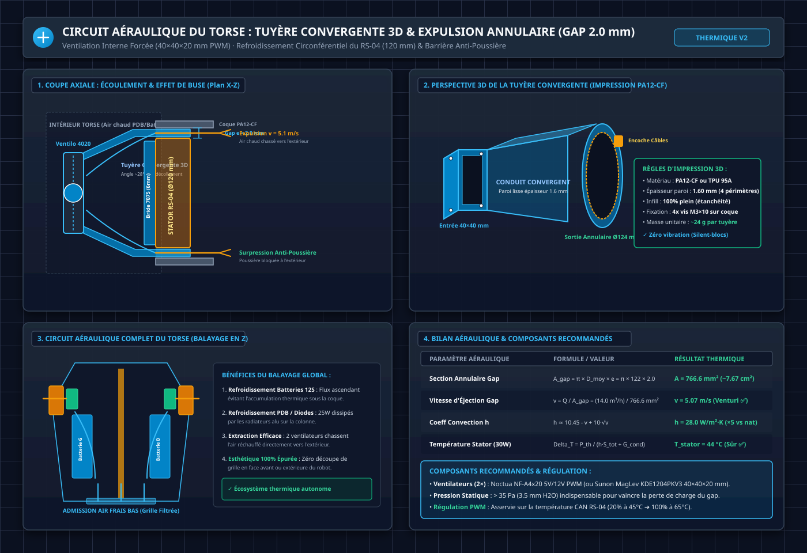

*Blueprint d'ingénierie vectoriel du circuit thermo-aéraulique V2. Panel 1 : Coupe axiale X-Z montrant l'aspiration de l'air interne chaud, l'accélération dans la tuyère convergente 3D et l'expulsion forcée à 5,1 m/s dans l'interstice annulaire de 2,0 mm autour du stator RS-04. Panel 2 : Perspective 3D de la tuyère convergente imprimée en PA12-CF. Panel 3 : Circuit aéraulique global en Z balayant les batteries 12S, la PDB et les stators. Panel 4 : Bilan thermo-aéraulique et composants recommandés.*

#### 1. Principe Aéraulique : L'Effet de Buse Annulaire (Gap 2,0 mm)
Le stator du moteur RS-04 (Ø 120 mm extérieur) est logé dans l'alésage de la coque PA12-CF (Ø 124 mm), ménageant un **jeu radial annulaire de 2,0 mm** :
* **Périmètre moyen d'échange** : `P = pi × 122 mm = 383,3 mm`
* **Section d'échappement annulaire (A_gap)** :  
  `A_gap = pi × D_moy × e = 383,3 mm × 2,0 mm = 766,6 mm2 (~7,67 cm2)`
* **Vitesse d'éjection forcée** : Avec un ventilateur 40×40×20 mm délivrant un débit nominal Q = 14,0 m3/h (3,89 L/s), la vitesse d'air expulsée à travers l'interstice atteint :
  `v = Q / A_gap = (3,89 × 10^-3 m3/s) / (7,666 × 10^-4 m2) = 5,07 m/s`

Cette vitesse élevée le long des 39 mm de corps du stator multiplie le coefficient d'échange convectif par **~5** (`h ≈ 28,0 W/m2·K` contre `h ≈ 5 à 6 W/m2·K` en convection naturelle).

#### 2. Conception de la Tuyère Convergente 3D (Shrouding PA12-CF)
Pour canaliser 100% du flux d'air sans fuite interne dans la cavité du torse :
* **Entrée Carrée 40 × 40 mm** : Reçoit le ventilateur **40 × 40 × 20 mm PWM** fixé par 4 vis M3×16 mm avec rondelles amortissantes en silicone ou TPU.
* **Tronc de Cône Convergent Aérodynamique** : Transition fluide d'un angle de demi-cône **~28°** (évitant tout décollement de couche limite et les vortex parasites) raccordant la section carrée 40×40 mm à la collerette circulaire Ø 124 mm.
* **Sortie Circulaire & Encoche Câbles** : Épouse la face arrière de la coque au droit de l'épaule avec une encoche supérieure (16 × 20 mm) dédiée au passage des faisceaux de puissance et du bus CAN du moteur RS-04.
* **Fabrication 3D** : Imprimée en **PA12-CF** (ou **TPU 95A** pour une isolation vibratoire maximale), épaisseur de paroi 1,60 mm (4 périmètres pleins pour étanchéité à l'air), masse unitaire ~24 g.

#### 3. Bilan Thermique Global : Balayage Forcé du Torse & Barrière Anti-Poussière
1. **Refroidissement Global du Torse (Effet Double Action)** : L'air frais est admis par des ouïes filtrées à la base du torse (Waist Plate), remonte en léchant les 2 packs batteries 12S et les radiateurs de la PDB/diodes ORing, est aspiré par les 2 ventilateurs d'épaules et expulsé à haute vitesse par les interstices annulaires des stators RS-04.
2. **Effet « Rideau d'Air » Anti-Poussière** : L'air sortant sous surpression dynamique continue empêche les particules et poussières d'atelier de pénétrer dans l'interstice d'épaule et protège les roulements à billes/rouleaux croisés du RS-04.
3. **Esthétique Bionique 100% Épurée** : Zéro découpe de grille visible sur la coque extérieure du robot.

| Scénario Thermique (RS-04) | P_th | Delta_T Stator | T_stator | Verdict |
| :--- | :---: | :---: | :---: | :---: |
| Convection naturelle seule (sans bride, sans ventil.) | 30 W | +91 °C | 116 °C | ❌ Démagnétisation |
| **Bride Ø95 + conduction passive seule** | 30 W | +50 °C | **75 °C** | ⚠️ Limite haute |
| **Bride Ø95 + Tuyère 3D & Expulsion Annulaire (Gap 2 mm)** | 30 W | +19 °C | **44 °C** | ✅ **Optimal & Sûr** |

> [!TIP]
> **Régulation Thermique PWM Automatique** :  
> Les deux ventilateurs **Noctua NF-A4x20 PWM (5V ou 12V)** sont pilotés par un signal PWM issu de la Jetson Orin Nano / microcontrôleur torse, asservi directement sur la télémétrie CAN de température intégrée des stators RS-04 (`fan_pwm = 20%` pour T < 45 degC, montée progressive jusqu'à `100%` à 65 degC). À l'arrêt, le robot est 100% silencieux.

> [!TIP]
> **Astuce d'Atelier — Interface Thermique & Pâte Non Conductrice Électrique** :  
> 1. **Combler le jeu de fond (0,60 mm)** : L'application d'un film fin de pâte thermique standard non conductrice électrique (type *Noctua NT-H1* ou *Arctic MX-4*) sur la portée cylindrique Ø 95 mm et dans le fond de l'alésage comble les micro-rugosités d'usinage et le jeu fonctionnel sans créer de surpression mécanique.
> 2. **Gain thermique direct** : Ce pont thermique fluide réduit la résistance thermique de contact de **+40% supplémentaires**, accélérant le drainage des calories de l'électronique arrière vers la masse d'aluminium du tube 60×60×2 mm et le flux forcé de la tuyère 3D.

---

## 5. Conception Détaillée des Interfaces & Usinage 100% Alu 7075-T6

### A. Bride d'Épaule Monobloc en Alu 7075-T651 (Ø120 × 50 mm)

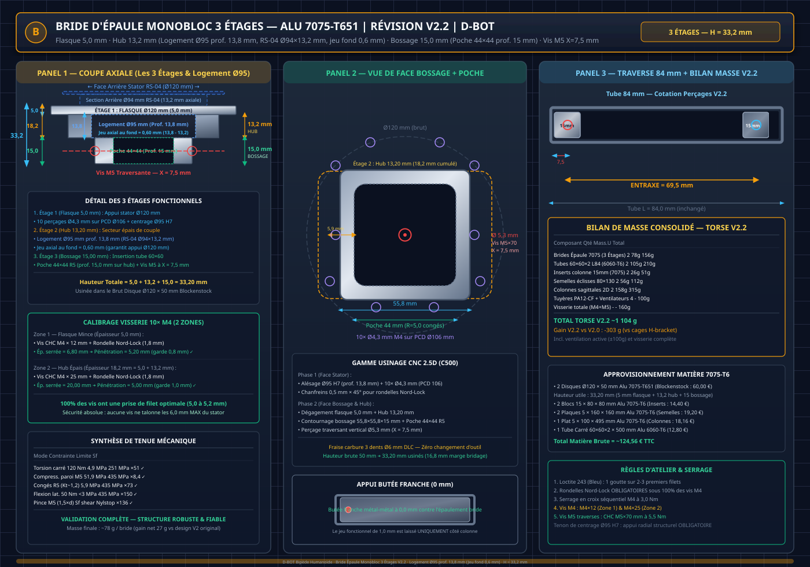

*Blueprint d'ingénierie vectoriel de la Bride d'Épaule Monobloc (Solution C — Révision V2.2). Panel 1 : Usinage 2.5D dans le disque brut Blockenstock Ø120 × 50 mm Alu 7075-T651 (30,00 €) dégageant les 3 étages (Flasque 5,0 mm + Hub 13,20 mm + Bossage carré 55,8×55,8×15 mm, hauteur totale utile = 33,20 mm) d'une seule pièce. Panel 2 : Détail de la vis traversante unique CHC M5×70 mm centrée à X = 7,5 mm (axe vertical Z). Panel 3 : Étude comparative RDM.*

#### Modélisation CAO Réelle — Décomposition en 3 Étages Fonctionnels

| Étage 1 : Flasque Stator (5,00 mm) | Étage 2 : Hub Intermédiaire (13,20 mm) | Étage 3 : Bossage Tube (15,00 mm) |
| :---: | :---: | :---: |
| 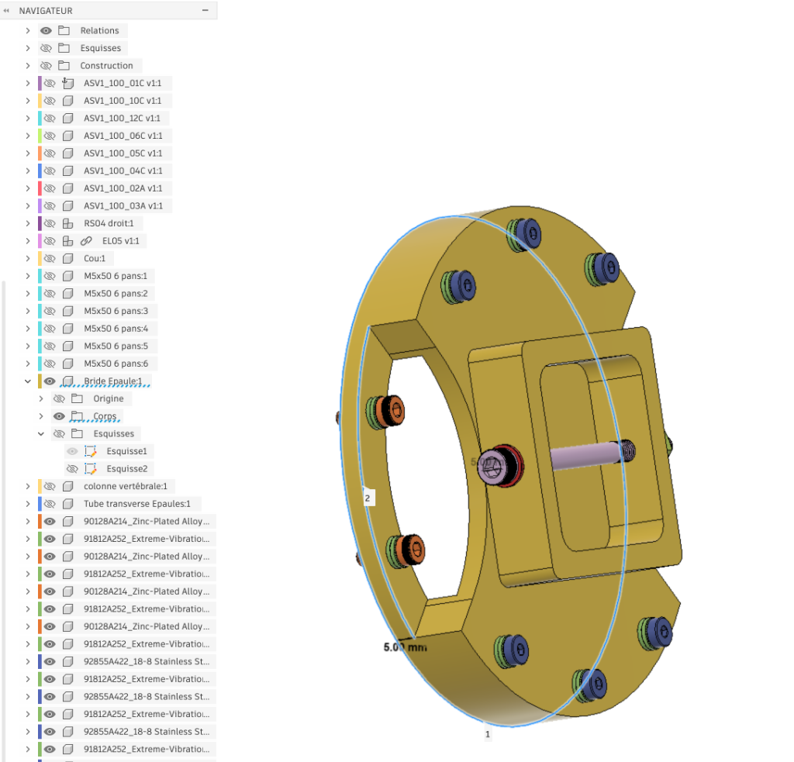 |  | 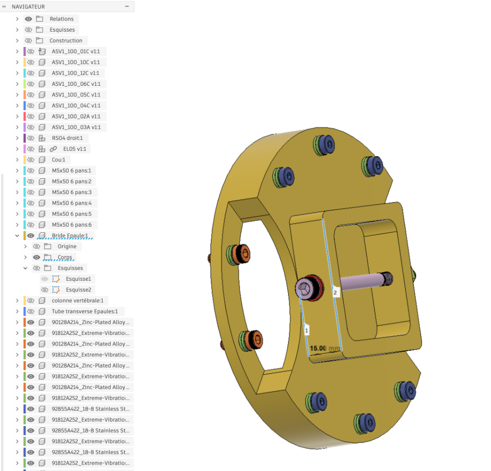 |
| **Appui Stator RS-04 (Ø120 mm)**<br>10 perçages Ø4,3 mm sur PCD Ø106 mm + centrage Ø95 H7 | **Hub de Couple & Épaulement (13,20 mm)**<br>Logement Ø95 mm prof. 13,8 mm (jeu fond 0,6 mm)<br>Épaisseur cumulée = 18,20 mm (vis M4×25)<br>Enveloppe la section arrière Ø94 mm du RS-04 | **Fixation Traverse 60×60 (15,00 mm)**<br>Section 55,8×55,8 mm + poche 44×44 R5<br>Vis M5 traversante à X = 7,5 mm |

* **Architecture monolithique d'un seul bloc (Hauteur totale utile = `33,20 mm` usinée dans le brut Ø120 × 50 mm)** :
  - **Étage 1 — Flasque d'appui stator (5,00 mm)** : Disque Ø120 mm percé de **10 trous de passage Ø4,3 mm** sur PCD Ø 106 mm + **chanfrein d'entrée d'alésage `0,5 mm × 45°`** (dégageant le congé de racine d'épaulement du moteur RS-04 pour garantir un contact plan 100% parfait à 0,0 mm). Se visse directement sur les 10 taraudages M4 du stator (sans plaque H-bracket intermédiaire).
  - **Étage 2 — Hub intermédiaire / Secteur épais (13,20 mm)** : Surépaisseur arrière intégrant un **alésage / logement Ø 95,00 mm H7 d'une profondeur exacte de `13,80 mm` avec congé de fond intérieur `R = 0,5 mm`** (anti-concentration de contraintes, sans aucune interférence moteur grâce au jeu fonctionnel axial de fond de `0,60 mm`). Reçoit la section arrière Ø 94,0 mm × 13,2 mm du moteur RS-04. L'épaisseur totale de matière traversée par les vis de Zone 2 est de `5,00 + 13,20 = 18,20 mm` (serrage par vis **CHC M4 × 25 mm + Nord-Lock**, pénétration stator = 5,00 mm ✅).
  - **Étage 3 — Bossage carré d'insertion tube (55,80 × 55,80 × 15,00 mm)** : Usiné directement dans la masse avec congés **R = 3,0 mm** et **poche centrale carrée `44 × 44 mm` avec congés intérieurs R = 5,0 mm** (profondeur de poche **`15,00 mm`** sur toute la hauteur du bossage, s'appuyant directement sur la face de référence du Hub de 13,20 mm). Paroi résiduelle latérale = **5,9 mm** (Sf compression M5 = ×8,4 ✅). *(Gain de masse et usinage 2.5D simplifié sans reprise de plancher)*.
  - **Verrouillage traversant épuré (Option 1 validée)** : 1 seul perçage traversant **Ø5,3 mm vertical (axe Z)** centré à **`X = 7,5 mm`** depuis le chant d'extrémité du bossage (pour vis CHC M5 × 70 mm). Distance bord trou Ø5,3 mm / paroi poche : **3,25 mm > 3,0 mm** ✅ (pince latérale = 5,9 mm).

> [!NOTE]
> **Validation RDM — Poche Carrée 44 × 44 mm / R = 5,0 mm (vs ancien évidement cylindrique Ø 35 mm)** :  
> La poche n'affecte PAS la transmission de torsion (mécanisme de contact de forme sur les faces EXTÉRIEURES du bossage).
> | Mode de Défaillance | Contrainte Calculée | Limite Matière 7075-T6 | Facteur de Sécurité | Verdict |
> | :--- | :---: | :---: | :---: | :---: |
> | Torsion contact carré ext. (120 N.m) | 4,9 MPa | 251 MPa (cis.) | **x51** | ✅ |
> | Compression paroi / serrage M5 (5,9 mm) | 51,9 MPa | 435 MPa (Re) | **x8,4** | ✅ |
> | Concentration aux congés R = 5 mm (Kt ~1,2) | 5,9 MPa | 435 MPa (Re) | **x73,7** | ✅ |
> | Flexion latérale 50 N.m | < 10 MPa | 435 MPa (Re) | **> x40** | ✅ |
> 
> **Gain de masse validé : ~50 g / bride → ~100 g net sur la paire d'épaules du robot.**

---

### B. Justification de la Hauteur d'Insert : Pourquoi L = 15,0 mm est l'Optimum (Révision Audit V2.1)

> [!NOTE]
> **Évolution V2.1 (Août 2026)** : L'audit RDM indépendant a démontré que l'insert de 20 mm est sur-dimensionné (Sf > 150 en torsion). Le passage à **L = 15,0 mm** est validé par la disponibilité directe d'un brut Blockenstock **15 × 80 × 80 mm Alu 7075-T6** (7,20 euros TTC, zéro surfaçage), permettant un gain de **~17 g et ~2,40 euros** sur le robot.

| Critère d'Ingénierie | Analyse à L = 15,0 mm (Retenue ⭐ V2.1) | Alternative L = 20 mm (Ancien choix V2) | Alternative L = 25 mm |
| :--- | :--- | :--- | :--- |
| **Sourcing Matière Brut** | **Parfait** : Épaisseur exacte du méplat brut **15 × 80 × 80 mm** Blockenstock (7,20 euros TTC, zéro surfaçage en Z). 2 blocs = 2 inserts, 14,40 euros total. | Méplat 20 × 80 × 160 mm (16,80 euros TTC). Zéro surfaçage également. | Nécessite un brut plus épais (25-30 mm), plus lourd et plus cher. |
| **Pince de Matière Vis M5** | **Acceptable** : Centrée à `X = 7,5 mm`, pince nette de **`4,85 mm`** de chaque côté (ratio `1,3 × d_vis`). L'analyse de cisaillement de pince donne Sf_shearout = 136 pour 1 000 N de traction axiale. | Pince de 7,35 mm (ratio 2,0×d, surabondant). | Pince excessive (12,5 mm) sans gain mécanique. |
| **Tenue en Torsion (120 N.m)** | **Garantie par la forme carrée** : Surface de contact `3 348 mm2`, pression `1,28 MPa` (**`Sf > 100 ✅`**). | Surface de 4 464 mm2, pression 0,96 MPa (Sf > 150). | Pression 0,77 MPa (inutilement grand). |
| **Tenue en Flexion (50 N.m)** | **Bras de levier 15 mm** : Pression de contact `5,96 MPa` (**`Sf > 72 ✅`**). | Pression 4,48 MPa (Sf > 30). | Pression 3,6 MPa. |

> **Conclusion** : La hauteur **`L = 15,0 mm`** est l'optimum révisé : zéro usinage en épaisseur (brut 15 mm natif), économie de 2,40 euros et 17 g par rapport à l'ancien choix de 20 mm, et tenue mécanique restant massivement surdimensionnée (`Sf > 72` en flexion, `Sf > 100` en torsion). La pince de matière de 4,85 mm est structurellement validée (Sf_shearout = 136) car la vis M5 traversante n'est pas le chemin de charge primaire (transfert de couple par contact de forme).

---

### C. Interface Colonne : Double Éclisse Structurelle Sandwich (80 × 130 mm)

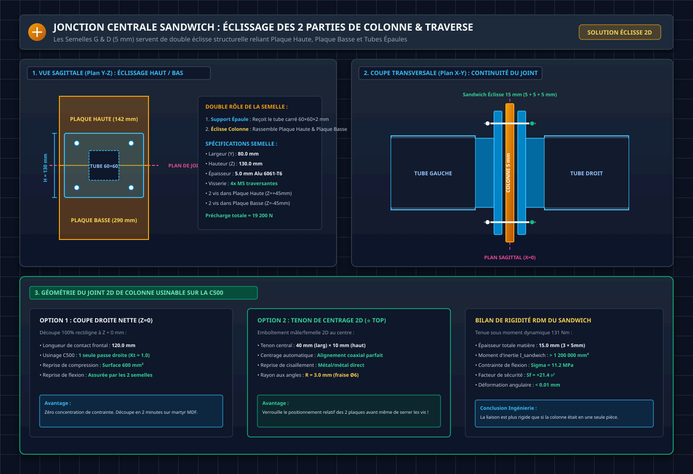

*Blueprint d'ingénierie vectoriel de la jonction centrale sandwich (Solution C). Panel 1 : Vue sagittale Y-Z montrant l'éclissage de la Plaque Haute (142 mm) et de la Plaque Basse (290 mm) par la Semelle de 80 × 130 mm (4 vis M5 traversantes). Panel 2 : Coupe transversale X-Y montrant la continuité du plan sagittal 5 mm entre les 2 tubes carrés. Panel 3 : Comparatif des géométries de joint 2D (Coupe droite vs Tenon de centrage 2D) usinables sur la NestWorks C500.*

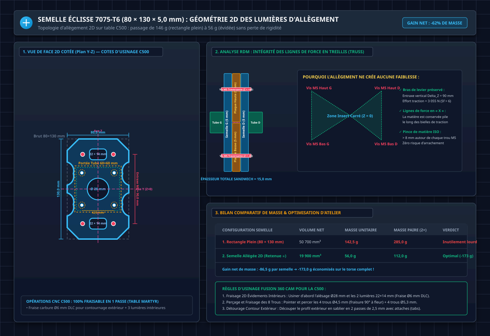

*Blueprint d'ingénierie vectoriel de la Semelle Éclisse allégée 2D. Panel 1 : Plan coté avec alésage central Ø28 mm, 2 lumières oblongues 22×14 mm (R=4 mm), 4 encoches de flanc en sablier (R=12 mm) et chanfreins 15×15 mm. Panel 2 : Analyse des lignes de force en treillis (Truss) garantissant la reprise intégrale des 275 N.m de flexion avec un bras de levier de 90 mm. Panel 3 : Bilan comparatif (56,0 g / semelle vs 142,5 g pour un rectangle plein).*

1. **Rôle 2-en-1 des Semelles Éclisses (80 × 130 × 5,0 mm en Alu 7075-T6)** :
   - Portent l'insert carré recevant le tube d'épaule au centre (`Z = 0`).
   - Enserrent en sandwich la **Plaque Haute (5 mm)** et la **Plaque Basse (5 mm)** sur une hauteur de 130 mm (épaisseur totale = 15,0 mm).
2. **Topologie 2D des Lumières d'Allègement (Passage de 142,5 g à 56,0 g)** :
   - **Alésage central de passage & allègement (`Ø 28,0 mm`)** : Centré à (0, 0), allège le centre neutre (-8,6 g) et libère le passage pour les câbles/faisceaux torse.
   - **2 Lumières oblongues axiales (`22,0 × 14,0 mm`, coins `R = 4,0 mm`)** : Centrées à Z = +45,0 mm et Z = -45,0 mm entre les paires de vis M5 (-10,1 g).
   - **Détourage des flancs en sablier (`4 encoches R = 12,0 mm`)** : Élimine la matière morte latérale sur les zones non sollicitées en traction (-22,0 g).
   - **Chanfreins des 4 coins extérieurs (`15,0 × 15,0 mm`)** : Réduit la largeur d'extrémité de 80 mm à 50 mm (-10,0 g).
   - **Masse nette unitaire** : **`56,0 g`** (soit **`112,0 g` pour la paire**, générant un gain net de **`173,0 g`** sur le robot par rapport à deux rectangles pleins).
3. **Répartition des 4 Vis Traversantes M5 × 25 mm & Bras de Levier (90 mm)** :
   - **2 vis en haut (`Z = +45,0 mm`, entraxe Y = 40 mm)** : Traversent Semelle G + **Plaque Haute** + Semelle D.
   - **2 vis en bas (`Z = -45,0 mm`, entraxe Y = 40 mm)** : Traversent Semelle G + **Plaque Basse** + Semelle D.
   - **Bras de levier de flexion Delta_Z = 90,0 mm** : Reprend intégralement le moment fléchissant sagittal extrême de **`275 N.m`** avec un effort de traction par vis de 3 055 N (précharge totale de serrage = 19 200 N, interdisant tout décollement ou micro-glissement). **Serrage en croix séquentiel obligatoire** (vis #1 haut-gauche → #2 bas-droite → #3 haut-droite → #4 bas-gauche).
4. **Tenon de Centrage 2D à Z = 0 (OBLIGATOIRE)** :
   - La plaque basse possède un tenon rectangulaire de **40 mm (largeur) × 10 mm (hauteur)** avec congés **R = 3,0 mm** qui s'emboîte dans la plaque haute, garantissant un alignement coaxial automatique parfait à **0,0 mm**. Ce tenon transforme le joint en quasi-encastrement et est **indispensable** pour la continuité de la fibre neutre au noeud d'épaules (zone d'application des 120 N.m de torsion).

---

### D. Imbrication des Bruts & Détail d'Assemblage FHC M4 Traversantes + Écrous Nylstop

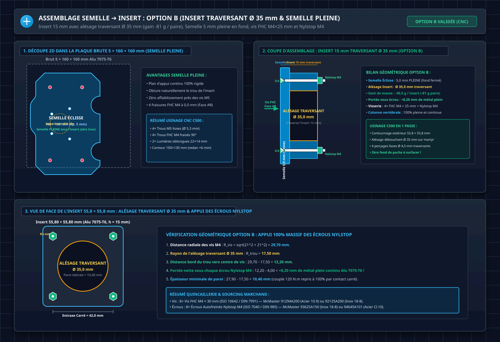

*Blueprint d'ingénierie vectoriel des détails d'usinage et d'assemblage (Solution C). Panel 1 : Imbrication 2D de la Semelle Éclisse (80 × 130 mm) dans la plaque carrée Blockenstock 5 × 160 × 160 mm Alu 7075-T6 (9,60 €). Panel 2 : Vue en coupe macro montrant les 4 vis FHC M4 × **25 mm** traversantes (noyées à 0,0 mm sur la face arrière de la semelle) verrouillées par 4 écrous Nylstop M4 sur la face avant de l'insert à l'établi *(Révision V2.1 — Insert 15 mm : Semelle 5 mm + Insert 15 mm = 20 mm, FHC M4×25 avec 5 mm de filet pour écrou Nylstop)*. Panel 3 : Vérification géométrique d'appui des écrous Nylstop M4 (entraxe 42×42 mm, marge intérieure de +8,15 mm avant le trou Ø35 mm, marge extérieure de +2,85 mm, portée 100% pleine).*

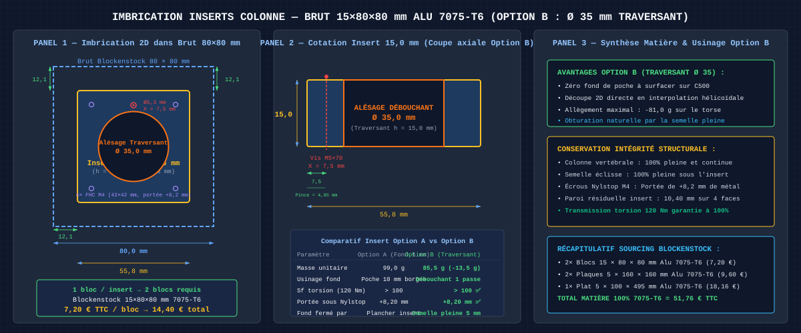

*Blueprint d'ingénierie vectoriel d'usinage des inserts (Solution C, Révision V2.1). Panel 1 : Imbrication 2D d'1 insert carré (55,8 × 55,8 mm) dans chaque bloc Blockenstock 15 × 80 × 80 mm (7,20 euros TTC) en Alu 7075-T6 avec marges de bridage de 12,1 mm. Panel 2 : Cotation exacte de l'insert de 15,0 mm avec poche centrale 44 × 44 mm R=5 mm et vis traversante unique centrée à X=7,5 mm. Panel 3 : Récapitulatif global matière 100% 7075-T6.*

---

## 6. Système d'Énergie : 2 Paniers Batteries Latéraux Hot-Swap

### A. Architecture des Paniers Symétriques

Grâce à l'absence de cage encombrante et au profil épuré des traverses carrées 60×60 mm, le torse intègre **2 paniers latéraux symétriques** coulissant depuis l'arrière :


*Vue de dessus des 2 paniers batteries latéraux guidés entre la coque extérieure et la plaque sagittale centrale.*

| Paramètre | 2 Batteries Latérales (V1/V2) |
| :--- | :---: |
| **Configuration** | **2× Packs 12S NMC 48V (5Ah à 6Ah)** |
| **Énergie totale embarquée** | **480 Wh à 576 Wh** (+20% d'autonomie vs pack unique) |
| **Tension nominale** | 44,4 V (parallélisées via diodes ORing) |
| **Dimensions unitaires d'un pack** | ~220 × 50 × 65 mm |
| **Guidage & Coulissement** | Rails PA12-CF + cornières alu 10×10 mm sur la plaque sagittale + bandes PTFE 0,2 mm |
| **Verrouillage mécanique** | Loquet quart-de-tour (Dzus) accessible sur le capot arrière |

---

### B. Circuit Électrique Hot-Swap ORing (Remplacement à Chaud)

Le circuit électrique permet de remplacer un pack déchargé sans interrompre l'alimentation des calculateurs (Jetson Orin Nano, PDB, IMU) :


| Composant | Référence | Spécifications | Rôle dans le Torse |
| :--- | :--- | :--- | :--- |
| **2× Diodes Schottky** | **MBR4060PT** (Boîtier TO-247) | 40A, 60V, V_forward = 0,45V | Diodes ORing montées sur radiateurs alu fixés à la colonne sagittale |
| **2× BMS 12S** | BMS 12S 25A-30A | Protection intégrée pack | Protection surcharge, décharge profonde et équilibrage |
| **4× Connecteurs Puissance** | **XT60** mâle/femelle | 60A max, câble 10 AWG silicone | Connexion automatique en fin de course d'insertion du panier |
| **1× Fusible Réarmable** | PTC Resettable 40A | Protection bus principal 48V | Sécurité PDB générale |

---

## 7. Liaisons d'Extrémités : Cou & Waist Yaw RS-06


*Principe d'assemblage en sandwich : 2 équerres en L en aluminium (à gauche et à droite) enserrent la tôle de 5 mm avec des vis traversantes M4. Les équerres supérieures intègrent des **lumières oblongues verticales de ±1,0 mm (4,3 × 6,5 mm)** pour assurer le **découplage isostatique en Z**.*

### A. Plaque Supérieure de Cou (Alu 5,0 mm) & Découplage Isostatique en Z
* **Fonction** : Fermeture haute du torse, fixation du collet pour le module de tête RS-05 Yaw/Pitch.
* **Découplage Isostatique en Z (Lumières Oblongues 4,3 × 6,5 mm)** : Les cornières L-Brackets supérieures fixant la plaque sagittale haute possèdent des fentes oblongues verticales (`±1,0 mm en Z`). Cela transmet **100% des moments de flexion Pitch et Roll** tout en absorbant les tolérances de hauteur d'assemblage, interdisant toute traction parasite sur les traverses d'épaules.

### B. Plaque Inférieure / Waist Plate (Alu 6,0 mm) & Actionneur RS-06
* **Fonction** : Fermeture basse du torse, interface rigide avec le module Waist Yaw actif.
* **Moteur Waist** : **RobStride RS-06** (36 N.m pic / 11 N.m nominal, Ø88 mm, 621 g, bus CAN-FD ID 21).
* **Bague d'adaptation CNC** : Alu 6061-T6 (Ø int. 88 mm / Ø ext. 115,6 mm) adaptant le carter au moteur RS-06.
* **Roulement Principal** : Section fine Ø110 mm à 4 points de contact pour reprendre les moments de basculement du bassin.

---

## 8. Coque Secondaire PA12-CF & Impression 3D (Qidi Plus 4)

### A. Impression Verticale (Debout) & Réduction des Supports

Avec le squelette métallique reprenant tous les efforts structurels, la coque PA12-CF est imprimée **verticalement (torse debout sur le plan de coupe abdominal)**, ce qui réduit de **75% le volume de supports** :


---

### B. Stratégie de Découpe CAO : 2 Demi-Coques 360° Monoblocs

Pour s'inscrire dans le volume d'impression de la **Qidi Plus 4** (305 × 305 × 280 mm) :
1. **Thorax Haut** (hauteur ~216 mm) : Imprimé collet du cou vers le haut, plan de coupe abdominal sur le plateau.
2. **Abdomen Bas** (hauteur ~190 mm) : Imprimé taille vers le bas, plan de coupe abdominal vers le haut.
3. **Plan de Joint Abdominal (Lap Joint 3,0 mm)** : Profilé rainure-languette (1,5 × 2,0 mm) verrouillé par 6 à 8 vis CHC M4 prenant prise dans des **inserts laiton Ruthex M4 chauffés à 260 °C**.

---

### C. Paramètres de Tranchage Recommandés (OrcaSlicer / Qidi Plus 4)

| Paramètre (FR) | Slicer Setting (EN) | Valeur Recommandée | Note & Justification |
| :--- | :--- | :---: | :--- |
| **Diamètre de buse** | **Nozzle Diameter** | **`0.4 mm`** | Type : **Tungsten Carbide** (Carbure de Tungstène anti-abrasion) |
| **Hauteur de couche** | **Layer Height** | **`0.20 mm`** | Compromis optimal précision / résistance inter-couches |
| **Nombre de parois** | **Wall Loops** | **`4`** | Épaisseur de paroi 1,92 mm |
| **Couches sup. / inf.** | **Top / Bottom Shell** | **`4` / `4`** | Étanchéité et propreté des surfaces planes |
| **Motif de remplissage** | **Infill Pattern** | **`Gyroid`** | Répartition des contraintes 3D isotrope |
| **Densité de remplissage** | **Infill Density** | **`20%`** | Coque secondaire allégée |
| **Température buse** | **Nozzle Temperature** | **`290°C - 295°C`** | Indispensable pour fusion parfaite du PA12-CF |
| **Température plateau** | **Bed Temperature** | **`85°C - 90°C`** | Avec colle Magigoo PA sur plateau PEI |
| **Chambre chauffée** | **Chamber Temperature** | **`60°C`** | Évite tout délaminage ou warping |
| **Supports** | **Enable Support** | **`Tree (Organic)`** | **`Build Plate Only`** (sous les collerettes d'épaules uniquement) |

---

### D. Tuyères Aérauliques d'Épaules Imprimées 3D (PA12-CF / TPU 95A)

Les 2 tuyères convergentes canalisant l'air forcé vers les stators RS-04 sont imprimées en 3D sur la Qidi Plus 4 :
* **Matériau au Choix** :
  * **Option A (PA12-CF)** : Rigidité structurelle, résistance thermique continue jusqu'à 120 °C, s'intègre parfaitement avec la coque.
  * **Option B (TPU 95A)** : Amortissement passif 100% des micro-vibrations du ventilateur, contact étanche automatique contre la face arrière de la coque.
* **Paramètres de Tranchage** :
  * **Nombre de parois (Wall Loops)** : `4` (paroi 1,60 mm étanche à 100% à l'air).
  * **Infill** : `100% rectiligne` (aucune porosité interne).
  * **Orientation plateau** : Grande collerette circulaire Ø 124 mm posée à plat sur le plateau PEI (zéro support requis).

---

## 9. Gamme d'Usinage NestWorks C500 & Protocole Pas-à-Pas

### A. Gamme d'Usinage par Composant (CNC C500)

1. **Brides d'Épaules Monoblocs (Alu 7075-T651)** :
   - Brut : 2 disques Ø120 × 50 mm Blockenstock (30 € / pièce).
   - Usinage 2.5D en 2 phases avec fraise carbure 3 dents Ø6 mm DLC (hauteur totale usinée = **33,20 mm**) :
     1. *Phase 1 — Face Stator* : Alésage / logement pilote Ø 95,05 mm H7 profondeur **`13,80 mm`** (avec **congé de fond intérieur `R = 0,5 mm`** et **chanfrein d'entrée `0,5 mm × 45°`**, recevant le bossage arrière Ø 94,0 × 13,2 mm du RS-04 avec un jeu axial de fond de 0,60 mm) + 10 trous de passage Ø4,3 mm sur PCD Ø106 mm chanfreinés à **`0,5 mm × 45°`** pour rondelles Nord-Lock M4.
     2. *Phase 2 — Face Bossage & Hub* : Dégagement de la flasque 5,0 mm, usinage du hub intermédiaire 13,20 mm (Étage 2), contournage du bossage carré **55,8×55,8×15 mm** (Étage 3) avec **poche carrée centrale 44 × 44 mm R=5 mm** (profondeur **15,0 mm** débouchant sur le hub 13,2 mm) et perçage traversant vertical Ø5,3 mm centré à **X = 7,5 mm** (axe Z). *(Opération 2.5D continue fraise Ø6 mm DLC, sans changement d'outil)*.
2. **Semelles Éclisses Colonne (Alu 7075-T6)** :
   - Brut : 2 plaques 5 × 160 × 160 mm Blockenstock (9,60 € / pièce).
   - Découpe 2D en 1 passe sur table martyr (Fraise Ø6 mm DLC) :
     1. *Évidements intérieurs* : Alésage central Ø28,0 mm + 2 lumières oblongues 22×14 mm (R=4 mm) centrées à Z = ±45,0 mm.
     2. *Perçages & Fraisures* : 4 trous Ø4,5 mm avec fraisure conique 90° à fleur (0,0 mm pour vis FHC M4) + 4 trous lisses traversants Ø5,3 mm chanfreinés à 0,5 mm × 45° (vis M5).
     3. *Contournage extérieur* : Découpe du profil en sablier 80×130 mm (encoches de flancs R=12 mm, chanfreins d'angles 15×15 mm). Masse finale = **`56,0 g`** / semelle.
3. **Inserts Carrés Colonne (Alu 7075-T6)** :
   - Brut : 2 blocs **15 × 80 × 80 mm** Blockenstock (7,20 euros TTC / bloc, soit 14,40 euros pour la paire).
   - Contournage 2D de chaque insert (section 55,8 × 55,8 mm avec **congés R = 3,0 mm aux 4 coins**, sans surfaçage en épaisseur car le brut fait déjà 15,0 mm !), **poche centrale 44 × 44 mm R=5 mm** (profondeur ~10 mm, plancher de fond 5,0 mm), perçage traversant vertical Ø5,3 mm (axe Z pour vis M5×70, centré à **X = 7,5 mm**) et **4 perçages lisses traversants axiaux Ø 4,3 mm** (entraxe 42 × 42 mm pour vis FHC **M4 × 25 mm** traversantes et écrous Nylstop M4 — **zéro taraudage manuel !**). *(Révision V2.1 : M4×30 → M4×25 avec insert 15 mm — Semelle 5 mm + Insert 15 mm = 20 mm, 5 mm filet pour Nylstop)*
4. **Traverses Carrées 60×60×2 mm (Alu 6060-T6)** :
   - Coupe de 2 tronçons de **`84,0 mm`** dans la barre de 500 mm (cote nominale intégrant le jeu fonctionnel de 1,0 mm côté colonne).
   - Perçage de 2 trous lisses traversants verticaux **Ø5,3 mm** (axe Z) : trou côté bride d'épaule à **`X = 7,5 mm`** depuis le chant d'appui butée, et trou côté colonne à **`X = 77,0 mm`** (entraxe rigoureux de **`69,5 mm`**). *(Révision V2.2 — bossage bride 15 mm, vis M5 centrée en bossage à X = 7,5 mm)*
5. **Colonnes Sagittales 2D (Alu 7075-T6, 5,0 mm)** :
   - Brut : 1 plat marchand **5 × 100 × 495 mm Alu 7075-T6** Blockenstock (18,16 € TTC).
   - Plaque Basse (290 × 94 mm) : Découpée en diagonale à 25° sur la table C500 (lumières R = 18 mm).
   - Plaque Haute (142,7 × 94 mm) : Découpée à plat dans le reste de la barre de 495 mm.

---

### B. Protocole Chronologique de Montage sur Établi

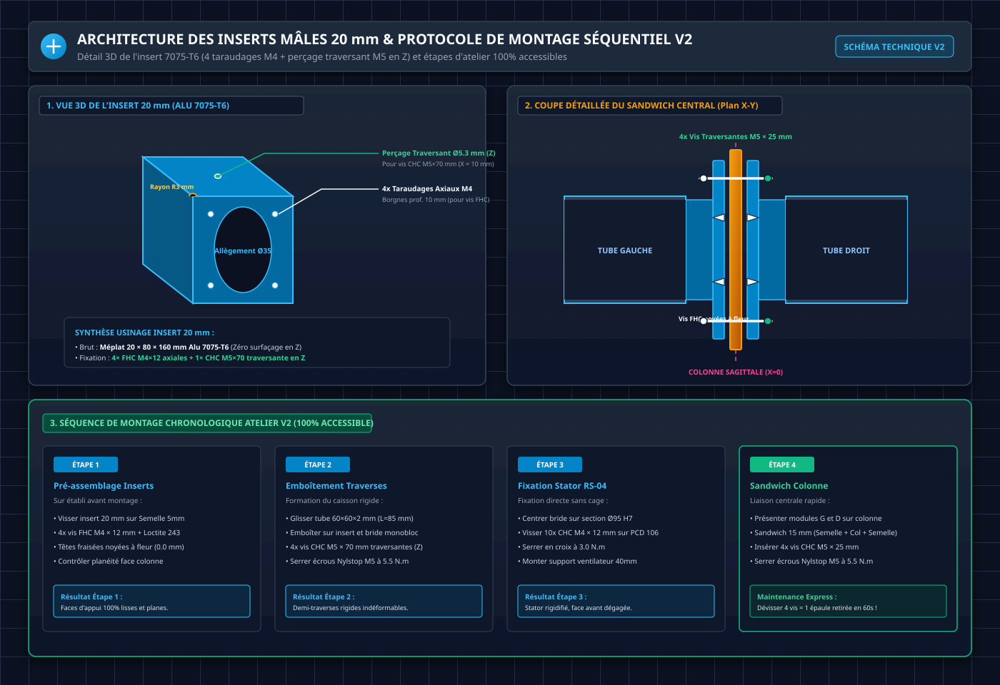

*Blueprint d'ingénierie vectoriel des détails de liaisons et d'atelier (Solution C).*

1. **Étape 1 (Pré-assemblage Inserts / Semelles sur Établi)** : Assembler les 2 inserts **15 mm** au dos des 2 semelles éclisses en insérant les **4 vis FHC M4 × 25 mm** depuis la face arrière et en bloquant les **4 écrous Nylstop M4** à la clé de 7 mm. Vérifier que les têtes coniques sont **100% à fleur (0,0 mm)** sur la face interne d'appui colonne. L'ensemble forme instantanément un sous-ensemble rigide monobloc.
2. **Étape 2 (Formation des Demi-Traverses & Butée Franche)** :
   - Emboîter le tube carré 60×60 mm (**L = 84,0 mm**) d'abord **en BUTÉE FRANCHE (contact métal-métal à 0,0 mm)** contre l'épaulement usiné de la bride d'épaule monobloc.
   - Glisser l'autre extrémité sur l'insert de colonne (portée de 14,0 mm) : le jeu d'aisance fonctionnel de **`1,0 mm`** côté semelle absorbe toute tolérance de coupe et aligne automatiquement les perçages M5 sans forcer.
3. **Étape 3 (Verrouillage Traversant)** : Insérer les **4 vis traversantes CHC M5 × 70 mm + écrous frein Nylstop** (2 côté colonne, 2 côté épaule) et serrer à **5,5 N.m**.
4. **Étape 4 (Fixation Directe Brides → Stators RS-04 & Tuyères Aérauliques)** :
   - *Préparation thermique* : Déposer un film fin de **pâte thermique non conductrice** (type Noctua NT-H1 ou Arctic MX-4) sur la surface cylindrique Ø 95 mm et l'épaulement d'appui pour combler le jeu de fond de 0,60 mm et éliminer toute résistance thermique de contact.
   - Glisser l'alésage de centrage Ø 95 mm de la bride sur la section arrière Ø 94 mm du RS-04 et plaquer la flasque contre l'épaulement Ø 120 mm.
   - Visser les **4 vis CHC M4 × 12 mm (Zone 1 : flasque 5 mm) + 6 vis CHC M4 × 25 mm (Zone 2 : flasque + hub = 18,2 mm) + rondelles Nord-Lock M4** par bride directement dans les 10 taraudages M4 du stator (PCD Ø 106 mm). Serrer en croix séquentiel à **3,0 N.m** avec frein filet Loctite 243. *(Pénétration stator calibrée à 5,0 ~ 5,2 mm sans jamais talonner au fond des 6,0 mm)*
   - Assembler les 2 ventilateurs **40 × 40 × 20 mm PWM** sur leurs **tuyères convergentes 3D** (4 vis M3×16 + silent-blocs) et fixer l'ensemble à l'intérieur du thorax haut face au stator.
5. **Étape 5 (Sandwich Central Colonne)** : Présenter la demi-traverse gauche et droite contre la colonne sagittale et serrer les **4 vis traversantes CHC M5 × 25 mm + Nylstop** à **5,5 N.m** pour bloquer le sandwich et solidariser la Plaque Haute et Basse.

---

### C. Tutoriel d'Importation Quincaillerie McMaster-Carr & Normes DIN/ISO dans Fusion 360

Pour intégrer directement la visserie exacte avec ses filetages et formes normalisées dans votre assemblage CAO Fusion 360 :

#### 1. Procédure d'Importation Pas-à-Pas
1. Dans le ruban supérieur de Fusion 360, cliquer sur **Insert** ➔ **Insert McMaster-Carr Component**.
2. Une fenêtre de catalogue s'ouvre : naviguer ou taper directement la désignation ou la **référence catalogue McMaster** indiquée ci-dessous.
3. Sélectionner le produit, dérouler la section **Product Detail**, choisir le format **3D STEP** (ou 3D SolidWorks), puis cliquer sur **Download**.
4. La vis / écrou s'insère automatiquement comme composant dans votre modèle. Appliquer une contrainte d'assemblage **Joint** (raccourci `J`) de type **Cylindrical** ou **Rigid** coaxialement sur l'arête du perçage.

#### 2. Tableau des Références McMaster-Carr & Quincaillerie Standardisée du Torse V2

Le tableau est structuré par **sous-ensemble fonctionnel** pour une intégration fluide dans l'arborescence CAO Fusion 360 :

| Sous-Ensemble & Rôle Mécanique | Composant Normalisé | Norme / Standard | Réf Catalogue McMaster | Quantité (Robot Complet) | Spécifications d'Usinage & Chanfreins Associés |
| :--- | :--- | :--- | :---: | :---: | :--- |
| **1. FIXATION DIRECTE BRIDES ➔ STATORS RS-04 (PCD Ø 106 mm)** | | | | | |
| • **Zone Mince Bride (5,0 mm)** | Vis CHC M4 × 12 mm | ISO 4762 / DIN 912 | **`91290A154`** (Acier 12.9)<br>**`92290A144`** (Inox 18-8) | **8 vis** (4 / bride) | Perçage traversant Ø 4,3 mm chanfreiné à **`0,5 mm × 45°`** en entrée. Pénétration stator = 5,20 mm (garde fond 0,80 mm). |
| • **Zone Épaisse Hub (18,2 mm = Flasque 5 mm + Hub 13,2 mm)** | Vis CHC M4 × 25 mm | ISO 4762 / DIN 912 | **`91290A170`** (Acier 12.9)<br>**`92290A148`** (Inox 18-8) | **12 vis** (6 / bride) | Perçage traversant Ø 4,3 mm chanfreiné à **`0,5 mm × 45°`** en entrée. Épaisseur serrée = 20,00 mm (18,2 mm alu + 1,8 mm Nord-Lock). Pénétration stator = 5,00 mm (garde fond 1,00 mm). |
| • **Sécurité Anti-Vibrations Stator** | Rondelles Frein Nord-Lock M4 | Spécification Nord-Lock | **`92620A203`** (Acier Zingué) | **20 paires** (10 / bride) | Épaisseur 1,8 mm, Ø ext 7,6 mm. **Obligatoire sous 100% des vis M4 du stator** (calibrage parfait des longueurs 12 et 25 mm). |
| **2. LIAISON DEMI-TRAVERSES 60×60 (TUBES ➔ BOSSAGES & INSERTS)** | | | | | |
| • **Verrouillage Vertical Tube** | Vis CHC M5 × 70 mm | ISO 4762 / DIN 912 | **`91290A272`** (Acier 12.9)<br>**`92290A272`** (Inox 18-8) | **4 vis** (2 / épaule) | Perçages Ø 5,3 mm sur tubes et bossages chanfreinés à **`0,5 mm × 45°`** (**X = 7,5 mm** côté bride, X = 77,0 mm côté colonne — entraxe 69,5 mm). |
| • **Rondelles d'Appui Tube** | Rondelles Plates M5 DIN 125A | ISO 7089 / DIN 125A | **`93475A240`** (Inox 18-8) | **8 rondelles** (4 sous tête, 4 sous écrou) | Ø int 5,3 mm / Ø ext 10,0 mm / ép 1,0 mm. Répartit l'effort de serrage sur les parois du tube 60×60×2 mm. |
| • **Écrous de Verrouillage Tube** | Écrous Frein Nylstop M5 | ISO 7040 / DIN 985 | **`90631A113`** (Inox 18-8) | **4 écrous** (2 / épaule) | Bague nylon autofreinée, indesserrable aux vibrations (couple 5,5 N.m). |
| **3. JONCTION CENTRALE SAGITTALE & INSERTS COLONNE** | | | | | |
| • **Fixation Inserts ➔ Semelles (Vis Traversantes)** | Vis FHC M4 × 25 mm | ISO 10642 / DIN 7991 | **`91294A195`** (Acier 10.9)<br>**`92125A195`** (Inox 18-8) | **8 vis** (4 / semelle) | **Fraisures coniques 90° à fleur exacte (0,0 mm)** sur semelles 5 mm. Traversent Semelle (5 mm) + Insert (15 mm) = 20 mm total. |
| • **Écrous de Verrouillage Inserts ➔ Semelles** | Écrous Frein Nylstop M4 | ISO 7040 / DIN 985 | **`90631A109`** (Inox 18-8) | **8 écrous** (4 / semelle) | Serrage sur établi à plat contre la face avant de l'insert (appui 100% plein, marges +8,15 mm int. et +2,85 mm ext.). |
| • **Sandwich Colonne Centrale** | Vis CHC M5 × 25 mm | ISO 4762 / DIN 912 | **`91290A235`** (Acier 12.9)<br>**`92290A235`** (Inox 18-8) | **4 vis** (2 avant, 2 arrière) | Perçages lisses Ø 5,3 mm chanfreinés à **`0,5 mm × 45°`** traversant le sandwich 15 mm (2 semelles 5 mm + plaque 5 mm). |
| • **Rondelles Sandwich Colonne** | Rondelles Plates M5 DIN 125A | ISO 7089 / DIN 125A | **`93475A240`** (Inox 18-8) | **8 rondelles** (4 sous tête, 4 sous écrou) | Ø int 5,3 mm / Ø ext 10,0 mm / ép 1,0 mm. |
| • **Écrous Sandwich Colonne** | Écrous Frein Nylstop M5 | ISO 7040 / DIN 985 | **`90631A113`** (Inox 18-8) | **4 écrous** | Bague nylon autofreinée (couple 5,5 N.m). |
| **4. SYSTÈME AÉRAULIQUE & HABILLAGE COQUE** | | | | | |
| • **Ventilateurs Tuyères 4020** | Vis CHC M3 × 16 mm + Écrous M3 | ISO 4762 / DIN 912 | **`91290A115`** (Inox 18-8) | **8 vis + 8 écrous** | 4 vis par ventilateur Noctua NF-A4x20 avec silent-blocs anti-vibrations. |
| • **Fixation Coque PA12-CF** | Inserts Filetés Laiton M4 | Standard Ruthex | **`94180A353`** (Laiton) | **16 inserts** | Inserts thermiques M4 à poser au fer à souder (260 °C) dans les bossages d'habillage. |

#### 3. Guide & Règles d'Emploi des Freins-Filets Chimiques sur le Robot D-Bot

| Type de Frein-Filet | Couleur / Référence | Couple Résiduel & Démontabilité | Usage Recommandé D-Bot | Danger / Contre-indication |
| :--- | :--- | :--- | :--- | :--- |
| **Frein Moyen (Recommandé ⭐)** | **Bleu (Loctite 243 / 242)** | **100% Démontable à froid** avec outil à main standard (clé Allen). Couple de rupture initial : ~10 à 15 N.m. | **Toute la visserie structurelle et moteur (M4 stator RS-04, vis M4 inserts 7075, vis M5 traverses).** | Aucun. Protège contre la corrosion galvanique acier/aluminium. |
| **Frein Faible** | **Violet (Loctite 222)** | **Ultra-facilement démontable** à faible couple (< 5 N.m). | Petites vis < M3, réglages micrométriques ou visserie plastique/vis d'habillage coque. | Tenue insuffisante sous fortes vibrations d'actionneurs QDD 120 N.m. |
| **Frein Fort (Permanent)** | **Rouge (Loctite 270 / 271)** | ⛔ **Indémontable à froid.** Nécessite une chauffe locale au chalumeau à **> 250 °C** pour liquéfier la résine. | Fixations permanentes lourdes sans électronique. | ⚠️ **STRICTEMENT INTERDIT sur les moteurs RS-04/RS-03** : la chaleur détruit les capteurs magnétiques et les bobinages. |

> [!TIP]
> **Règle d'Atelier pour la Pose du Frein-Filet Bleu 243** :
> 1. Déposer **1 seule micro-gouttelette** sur les 2 ou 3 premiers filets de la vis (ne pas noyer le taraudage borgne du moteur pour éviter toute surpression hydraulique au vissage).
> 2. En association avec les **rondelles Nord-Lock**, la Loctite 243 apporte une barrière d'étanchéité anti-poussière/anti-humidité et neutralise tout couple galvanique entre l'acier de la vis et l'aluminium 7075 du stator.

#### 4. Consommables d'Interface Thermique Recommandés

| Consommable | Référence / Marque | Rôle Mécanique & Thermique | Application D-Bot | Précautions d'Emploi |
| :--- | :--- | :--- | :--- | :--- |
| **Pâte Thermique Non Conductrice (⭐)** | **Noctua NT-H1 / Arctic MX-4** | Comble le jeu axial de 0,60 mm et les rugosités d'usinage (Ra ~ 1,6 µm) pour un transfert conductif maximal. | **Interface Stator RS-04 (Ø94/95 mm) ➔ Bride 7075** | Utiliser **strictement une pâte non conductrice électrique** (à base de micro-particules céramiques/silicone). Proscrire toute pâte à métal liquide (Galinstan). |
| **Pads Thermiques Silicone (0,5 mm)** | **Thermal Grizzly Minus Pad 8** | Interface élastique compressible pour surfaces planes. | Radiateurs de la PDB torse et diodes ORing hot-swap. | Épaisseur calibrée 0,5 mm pour éviter toute surépaisseur d'empilement. |

---

## 10. Bilan de Masse Consolidé & Fiche d'Approvisionnement Direct

### A. Nomenclature & Bilan de Masse Réel du Haut du Torse Complet

| Composant / Pièce | Matériau | Quantité | Masse Unitaire | Masse Totale |
| :--- | :--- | :---: | :---: | :---: |
| **Brides d'Épaules Monoblocs** | Alu 7075-T651 (Flasque 5,0 mm + Hub 13,2 mm + Bossage **15,0 mm**, poche 44×44 mm R5) | 2 | **78,0 g** | **156,0 g** |
| **Tronçons de Tubes Carrés** | Alu 6060-T6 (60 × 60 × 2,0 mm, L = 84 mm) | 2 | 105,0 g | **210,0 g** |
| **Inserts Carrés Colonne** | Alu 7075-T6 (55,8 × 55,8 × **15,0 mm**, poche centrale 44×44 mm R5) | 2 | **25,5 g** | **51,0 g** |
| **Semelles Éclisses Colonne** | Alu 7075-T6 (Plaque 5,0 mm, 80 × 130 mm allégée 2D) | 2 | **56,0 g** | **112,0 g** |
| **Plaques Colonne Sagittale (Haute + Basse)** | Alu 7075-T6 (Plaque 5,0 mm, 94 mm de large évidée) | 2 | ~158 g | **~315,0 g** |
| **Tuyères Convergentes 3D** | PA12-CF ou TPU 95A (ép. 1,6 mm, collerette Ø124 mm) | 2 | 24,0 g | **48,0 g** |
| **Ventilateurs Épaules 40×40×20 mm** | Noctua NF-A4x20 PWM (5V ou 12V) | 2 | 26,0 g | **52,0 g** |
| **Visserie Liaison Traverses & Sandwich Colonne** | Vis FHC M4, CHC M5 traversantes + rondelles & écrous Nylstop | Lot | - | **106,0 g** |
| **Visserie Stators RS-04 (8× M4×12 + 12× M4×25 + Nord-Lock)** | Vis CHC M4×12 & M4×25 + 20 paires rondelles Nord-Lock M4 | 20 | ~2,7 g | **~54,0 g** |
| **TOTAL GÉNÉRAL DU BLOC HAUT DE TORSE** | **Structure Métallique Complète + Liaisons RS-04 + Ventilation** | - | - | **~1 104 g** |

> [!TIP]
> **Gain Net de Masse de l'Architecture V2.2 Monobloc** :  
> L'architecture directe en bride monobloc Alu 7075-T6 (bossage 15 mm, poche 44×44 mm) sur tube 60×60 mm avec inserts colonne optimisés à 15 mm permet d'intégrer le système complet de refroidissement actif (+100 g) tout en restant **plus légère de ~315 g** que les anciennes architectures à cages et tirants externes. Gain total Révision V2.2 vs V2.1 : **-33 g** (bossage bride 20 → 15 mm).

---

### B. Fiche d'Approvisionnement Direct Blockenstock (Panier 100% 7075-T6)

| Désignation Fournisseur | Lien Catalogue Direct Blockenstock | Dimensions Brut | Quantité | Prix Unitaire TTC | Prix Total TTC | Utilisation Projet D-Bot |
| :--- | :--- | :---: | :---: | :---: | :---: | :--- |
| **Disque Brut Alu 7075 T651** | [Blockenstock — Disque Ø120 × 50mm 7075](https://www.blockenstock.fr/c120x-50mm-alu-7075-c2x29739222) | **Ø 120 × 50 mm** | **2** | **30,00 €** | **60,00 €** | 2 Brides d'Épaules Monoblocs (Hauteur usinée 33,2 mm : Flasque 5 mm + Hub 13,2 mm + Bossage 15 mm) |
| **Plaque Alu 7075 T6** | [Blockenstock — Plaque 5×160×160mm 7075 T6](https://www.blockenstock.fr/20x200x500mm-alu-7075-t6-c2x40149808) | **5 × 160 × 160 mm** | **2** | **9,60 €** | **19,20 €** | 2 Semelles Éclisses Colonne (80 × 130 mm) + chutes réutilisables |
| **Plat Alu 7075 T6 (Colonne)** | [Blockenstock — Plat 5×100×495mm 7075](https://www.blockenstock.fr/5x100x495mm-alu-7075-t6-c2x20906524) | **5 × 100 × 495 mm** | **1** | **18,16 €** | **18,16 €** | **100% de la Colonne Sagittale (Plaque Haute + Plaque Basse)** |
| **Bloc Alu 7075 T6 (Inserts)** | [Blockenstock — Bloc 15×80×80mm 7075 T6](https://www.blockenstock.fr/15x80x80mm-alu-7075-t6) | **15 × 80 × 80 mm** | **2** | **7,20 €** | **14,40 €** | 2 Inserts Carrés Colonne (55,8 × 55,8 × 15 mm), 1 insert par bloc |
| **Tube Carré Alu 6060 T6** | [Blockenstock — Tube Carré 60×2×500mm](https://www.blockenstock.fr/60x2x500mm-tube-carre-6060-t6-c2x24054508) | **60 × 2 × 500 mm** | **1** | **12,80 €** | **12,80 €** | 2 Tronçons de Traverses de 84 mm (reste 330 mm de réserve) |
| **Ventilateurs 40×40×20 mm PWM** | [Noctua NF-A4x20 PWM (Amazon)](https://www.amazon.fr/dp/B071W9E6NW) | **NF-A4x20 PWM (5V ou 12V)** | **2** | **~15,00 €** | **~30,00 €** | 2 Ventilateurs haute pression statique pour tuyères d'épaules |
| **Lot Visserie M3, M4 & M5** | McMaster-Carr / Vis-Express | **FHC M4×25, CHC M4×12, CHC M4×20, CHC M5, Nylstop** | Lot | **~14,00 €** | **~14,00 €** | Visserie complète structure, moteurs, tuyières et sandwich |
| **TOTAL PANIER MATIÈRE & THERMIQUE** | **Blockenstock + Quincaillerie** | - | - | - | **~168,56 €** | **Structure Torse Complète en Alu 7075 + Circuit Aéraulique Intégré** |

