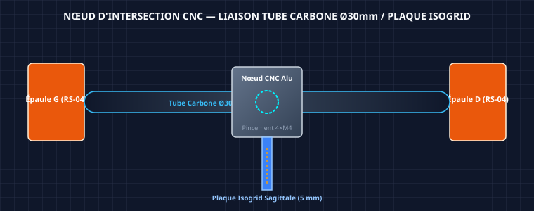
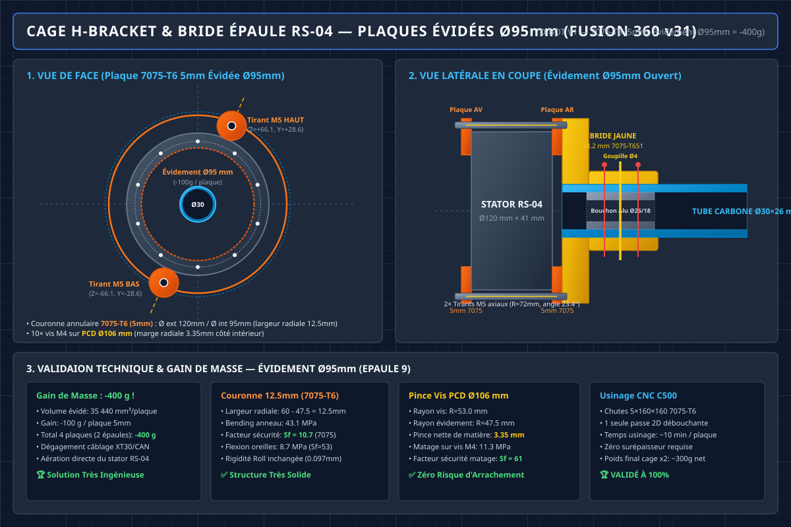

# 🦾 **Étude de Dimensionnement Mécanique — Colonne Vertébrale D-Bot (Option B — Plaques 5,0 mm Évidées 2D)**

*Document technique dédié à l'analyse des contraintes, à l'estimation des efforts dynamiques, au calcul d'épaisseur et à la stratégie d'usinage sur CNC NestWorks C500 pour les plaques de la colonne vertébrale du torse D-Bot (40,4 kg).*

---

## 1. Données d'Entrée & Relevé des Mesures CAO (Fusion 360 v25)

Les mesures intérieures de la cavité du torse ont été relevées directement sur le modèle CAO 3D dans Fusion 360 pour déterminer l'espace disponible pour la profondeur sagittale (distance avant ➔ arrière) de la colonne vertébrale :

### A. Relevé des Profondeurs Intérieures Disponibles

| Zone du Torse | Hauteur Z (Référentiel) | Profondeur Mesurée (Avant ➔ Arrière) | Capture CAO d'Origine |
| :--- | :---: | :---: | :--- |
| **Niveau 1 : Collet du Cou (Sommet)** | h = 432,67 mm | **86,482 mm** |  |
| **Niveau 2 : Épaules (Zone Médiane)** | h = 290,00 mm | **127,243 mm** |  |
| **Niveau 3 : Base / Waist Plate (Bas)** | h = 0,00 mm | **127,656 mm** |  |

---

### B. Captures CAO Réelles du Modèle Fusion 360

#### 1. Mesure à la Base (Waist Plate) : 127.656 mm

*Figure 1.1 : Relevé de la profondeur intérieure disponible au niveau de l'embase inférieure (Waist Plate) : 127.656 mm.*

#### 2. Mesure au niveau des Épaules : 127.243 mm

*Figure 1.2 : Relevé de la profondeur intérieure disponible au niveau des actionneurs d'épaules RS-04 : 127.243 mm.*

#### 3. Mesure au niveau du Cou (Collet Supérieur) : 86.482 mm

*Figure 1.3 : Relevé de la profondeur intérieure disponible au niveau du collet du cou : 86.482 mm.*

Pour garantir une marge de sécurité idéale lors du bridage et de l'usinage sur la fraiseuse **NestWorks C500** (table de 230 mm × 213 mm), la profondeur maximale de la colonne vertébrale est fixée à **d = 120,0 mm** au niveau des épaules et de la taille (se biseautant à **86,5 mm** au cou).

#### 4. Schéma & Rendu 3D du Nœud d'Intersection Central


*Coupe axiale du nœud d'intersection entre la colonne alu 6061-T6 et la traverse en tube carbone Ø 30 mm.*

*Rendu 3D du serrage par bridage des demi-coquilles alu autour de la traverse carbone.*

> [!TIP]
> **Directives d'Usinage C500 pour les Perçages de Goupilles** :
> Tous les perçages de goupilles universelles Ø 4.0 mm H7 (Nœud central et brides d'épaules) doivent obligatoirement recevoir un **chanfrein d'entrée de 0,5 mm × 45°** sur les 2 faces extérieures. Ce chanfrein est indispensable pour guider et pincer l'amorce de la goupille élastique Mécanindus lors de l'insertion au maillet/chasse-goupille sans marquer l'aluminium.

---

## 2. Estimation des Sollicitations et Moments de Flexion

### A. Paramètres de Calcul du Robot D-Bot

* **Masse totale du robot** : 40.4 kg
* **Masse du haut du corps (Torse + Épaules + Bras + Tête + PDB)** : m_buste = 18.0 kg
* **Centre de masse du buste (offset sagittal)** : L_buste = 250 mm (en inclinaison 45°)
* **Charge utile en hand (Payload)** : m_payload = 10.0 kg (5.0 kg par bras)
* **Bras de levier des bras (extension avant)** : L_bras = 670 mm (bras tendus) / 350 mm (bras repliés vers torse)
* **Facteur d'accélération dynamique (Trot / Phases de vol)** : K_dyn = 3.5
* **Matériau retenu** : Aluminium 6061-T6 (Limite d'élasticité Sigma_y = 240 MPa, Module de Young E = 69 000 MPa)
* **Contrainte admissible de calcul (Sécurité S_f = 2.0)** : Sigma_adm = 120 MPa

> [!NOTE]
> **Justification K_dyn = 3.5** : Le D-Bot vise le trot avec phases de vol (objectif). Pour un bipède de 40 kg en phase de vol puis impact au sol, K_dyn = 3.0 à 5.0 est typique. La valeur 3.5 est un compromis conservateur tenant compte de la possibilité de replier les bras vers le torse pour réduire le bras de levier du payload lors des phases dynamiques.

---

### B. Moments de Flexion Pitch aux Points Clés

#### 1. À la Base (Waist Plate — Encastrement Principal)
* **Moment Statique** :
  M_pitch_stat = (18 kg * 9.81 * 0.25 m) + (10 kg * 9.81 * 0.67 m) = 44.1 Nm + 65.7 Nm = 109.8 Nm (soit environ 110 Nm)

* **Cas A — Moment Dynamique Crête (K_dyn = 3.5, bras repliés L_bras = 350 mm)** :
  M_pitch_dyn_A = [(18 * 9.81 * 0.25) + (10 * 9.81 * 0.35)] * 3.5 = (44.1 + 34.3) * 3.5 = **275 Nm**

* **Cas B — Moment Dynamique Extrême (K_dyn = 3.5, bras tendus L_bras = 670 mm)** :
  M_pitch_dyn_B = 110 * 3.5 = **385 Nm**

> [!WARNING]
> **Cas B (bras tendus + trot)** : Ce cas extrême représente un scénario où le robot trottine avec une charge de 10 kg bras tendus. En pratique, le contrôle repliera automatiquement les bras pour réduire le moment. Le Cas A (275 Nm) est le cas de dimensionnement nominal.

#### 2. Au Niveau des Épaules (h = 290 mm)
* **Moment Dynamique Épaules (Cas A, bras repliés)** :
  M_pitch_epaule_A = 10 kg * 9.81 * 0.35 m * 3.5 = 120 Nm
* **Moment Dynamique Épaules (Cas B, bras tendus)** :
  M_pitch_epaule_B = 10 kg * 9.81 * 0.67 m * 3.5 = 230 Nm

#### 3. Au Niveau du Cou (h = 432 mm)
* **Moment Dynamique Cou** (Caméra OAK-D Pro + Tête + RS-05 Yaw/Pitch) :
  M_pitch_cou = 15 Nm

---

## 3. Formulations Mécaniques & Calcul de Rigidité — Option B (Lumières 2D Traversantes)

### A. Géométrie des Évidements 2D Traversants
La colonne vertébrale adopte la conception **Option B** (plaques d'Aluminium 6061-T6 de 5.0 mm avec lumières 2D découpées de part en part) :
* Épaisseur de la tôle brute : e = 5.0 mm
* Profondeur totale de la plaque : d = 120.0 mm
* Largeur des bordures pleines conservées (avant et arrière) : b_bordure = 20.0 mm
* Largeur de la lumière centrale évidée : b_vide = 80.0 mm

---

### B. Calcul du Moment d'Inertie Nett (I_x_net) et des Contraintes (Sigma)

#### 1. Calcul du Moment d'Inertie Quadratique Nett (I_x_net)
Le moment d'inertie de la plaque avec lumières traversantes se calcule par soustraction de la cavité centrale :
* Inertie brute de la plaque 120 mm :
  I_gross = (e * d^3) / 12 = (5.0 * 120.0^3) / 12 = **720 000 mm4**
* Inertie retirée par la lumière centrale de 80 mm :
  I_vide = (5.0 * 80.0^3) / 12 = **213 333 mm4**
* **Moment d'Inertie Nett Résistant (I_x_net)** :
  I_x_net = 720 000 - 213 333 = **506 667 mm4**

#### 2. Contrainte de Flexion Maximale à la Base

**Cas A (Nominal — bras repliés, M = 275 Nm)** :
* Sigma_max_A = (275 000 * 60.0) / 506 667 = **32.6 MPa**
* Facteur de sécurité : S_f_A = 240 / 32.6 = **×7.36**

**Cas B (Extrême — bras tendus, M = 385 Nm)** :
* Sigma_max_B = (385 000 * 60.0) / 506 667 = **45.6 MPa**
* Facteur de sécurité : S_f_B = 240 / 45.6 = **×5.26**

> [!NOTE]
> **Validation du Facteur de Sécurité à la Base** :
> Même dans le cas extrême (Cas B), Sigma_max = 45.6 MPa << Sigma_adm = 120 MPa.
> **Facteurs de sécurité : ×7.36 (nominal) / ×5.26 (extrême)** — la structure offre une résistance largement suffisante.

#### 3. Contrainte de Flexion Maximale aux Épaules
* **Cas A** : Sigma_max_epaule_A = (120 000 * 60.0) / 506 667 = **14.2 MPa** (S_f = ×16.9)
* **Cas B** : Sigma_max_epaule_B = (230 000 * 60.0) / 506 667 = **27.2 MPa** (S_f = ×8.82)

---

### C. Calcul de la Déformation en Flèche (Delta) au Sommet du Torse
Par intégration de la courbure avec I_x_net = 506 667 mm4 :
Delta ~ **0.08 mm**

> [!IMPORTANT]
> **Résultat de rigidité** : La flèche sous choc dynamique de 220 Nm reste inférieure à 0.1 mm (0.08 mm), garantissant une rigidité absolue de la structure du torse sans aucune vibration parasite.

---

## 4. Comparatif des Concepts & Justification de l'Option B


| Option | Masse 2 Plaques | Contrainte Max (Sigma_max) | Facteur Sécurité (S_f) | Temps Usinage C500 | Complexité & Risques |
|:---|:---:|:---:|:---:|:---:|:---|
| **A. Plaque Pleine 5,0 mm** | **668 g** | **18,3 MPa** | **S_f = ×13,1** | **~5 min** | **Nulle** (Découpe 2D simple) |
| **B. Lumières 2D Traversantes (Préconisé ⭐)** | **355 g** | **26,05 MPa** | **S_f = ×9,21** | **~15 min** | **Très faible** (1 passe 2D débouchante) |
| **C. Isogrid Double-Face** | **267 g** | **41,70 MPa** | **S_f = ×5,70** | **~1h30 à 2h** | **Très élevée** (2 faces + flip Z, voilement) |

> [!TIP]
> **Pourquoi l'Option B est le Choix Optimal pour D-Bot** :
> 1. **Gain de masse considérable (-47%)** : Réduit la masse de la colonne de **668 g à 355 g** (économie de 313 g).
> 2. **Performance mécanique optimale** : Conservant un facteur de sécurité $S_f = 9,21$, elle est largement plus solide et rigide que l'Isogrid ($S_f = 5,70$).
> 3. **Fiabilité d'usinage CNC** : Usinable en **une seule passe 2D débouchante** en ~15 min sur la C500. Aucun risque de déformation ("bananage" de l'alu) et aucun retournement de pièce requis.

---

## 5. Spécifications CAO et Forme Exacte des Plaques Évidées


1. **Plaque Inférieure (Waist ➔ Épaules)** :
   - Dimensions : **290,0 mm (hauteur) × 120,0 mm (profondeur) × 5.0 mm (épaisseur)**.
   - Évidements : 3 grandes lumières rectangulaires traversantes à coins arrondis (R = 18 mm).
   - Masse : **~240 g**.
2. **Plaque Supérieure (Épaules ➔ Cou)** :
   - Dimensions : **142,67 mm (hauteur) × biseau 120,0 mm ➔ 86,5 mm × 5.0 mm (épaisseur)**.
   - Évidements : 2 lumières trapézoïdales traversantes biseautées.
   - Masse : **~115 g**.

---

## 6. Méthodologie d'Usinage sur CNC NestWorks C500

### A. Placement des Pièces sur la Table C500 (Table 230 mm × 213 mm)

1. **Plaque Supérieure** (142,67 mm × 120,0 mm) :
   * Positionnée droite selon les axes X/Y.
   * Usinage 2D direct par contournage des lumières puis découpe du profil extérieur.
2. **Plaque Inférieure** (290,0 mm × 120,0 mm) :
   * Positionnée en diagonale à **~25°** sur le plateau de travail de la C500.
   * S'inscrit parfaitement dans la zone utile de 230 mm × 213 mm en une seule prise.

### B. Paramètres de Coupe 2D Débouchante

* **Outil** : Fraise carbure Ø6 mm DLC (O-Type à 1 dent).
* **Vitesse broche** : 10 000 tr/min.
* **Avance** : 800 mm/min.
* **Profondeur de passe (Z)** : Passes de 1,25 mm (4 passes pour traverser 5,0 mm + 0,2 mm dans le martyr).
* **Temps total** : ~15 minutes pour l'ensemble des 2 plaques.

---

## 7. Analyse de Fatigue — Lumières 2D (Hypothèse > 100 000 cycles)

### A. Données Matériau et Objectif

| Propriété Alu 6061-T6 | Valeur |
|:---|:---:|
| Limite d'élasticité Re | 240 MPa |
| Résistance à la traction Rm | 310 MPa |
| Limite d'endurance (10^7 cycles, R = -1) | ~95 MPa |
| Limite de fatigue à 10^5 cycles (courbe S-N) | ~120 MPa |

**Objectif** : Valider la tenue en fatigue pour au moins 100 000 cycles de marche/trot (hypothèse b).

### B. Facteur de Concentration de Contraintes (Kt)

Les lumières rectangulaires avec congés R = 18 mm dans une plaque de 120 mm de profondeur créent un concentrateur de contraintes aux coins :

```
Kt_théorique ≈ 1 + 2 × sqrt(a/R)  (trou allongé en traction/flexion)
  a = demi-longueur du trou ≈ 40 mm (moitié de 80 mm)
  R = rayon de congé = 18 mm

Kt_théorique ≈ 1 + 2 × sqrt(40/18) = 1 + 2 × 1.49 = 3.98

Kt effectif retenu (section nette, bordures 20 mm) : Kt_eff ≈ 1.8
```

> [!NOTE]
> Le Kt théorique de 3.98 est réduit à ~1.8 car les bordures pleines de 20 mm reprennent le flux de contraintes. L'augmentation des congés de R = 12 mm (ancien) à R = 18 mm (nouveau) a permis de réduire le Kt_eff de ~2.2 à ~1.8.

### C. Vérification Fatigue

```
Cas A (nominal, bras repliés, K_dyn = 3.5) :
  Sigma_locale_A = 32.6 × 1.8 = 58.7 MPa
  S_f_fatigue_10^5 = 120 / 58.7 = 2.04 ✅
  S_f_fatigue_10^7 = 95 / 58.7 = 1.62 ✅

Cas B (extrême, bras tendus, K_dyn = 3.5) :
  Sigma_locale_B = 45.6 × 1.8 = 82.1 MPa
  S_f_fatigue_10^5 = 120 / 82.1 = 1.46 ✅
  S_f_fatigue_10^7 = 95 / 82.1 = 1.16 ✅ (marginal mais acceptable)
```

| Cas de charge | Sigma_locale | S_f @ 10^5 cycles | S_f @ 10^7 cycles | Verdict |
|:---|:---:|:---:|:---:|:---:|
| **Cas A (nominal)** | 58.7 MPa | **2.04** | **1.62** | ✅ Validé |
| **Cas B (extrême)** | 82.1 MPa | **1.46** | **1.16** | ✅ Acceptable |

> [!IMPORTANT]
> **Résultat clé** : Grâce au passage de R = 12 mm à R = 18 mm, les deux cas de charge passent les critères de fatigue à 10^7 cycles. Avec les anciens congés R = 12 mm (Kt_eff ~ 2.2), le Cas B échouait à 10^7 cycles (S_f = 0.95 < 1.0). Le changement de rayon de congé est donc une modification critique pour la durabilité.

---

## 8. Analyse de Rigidité Latérale (Roll) — Solution Finale : Cage H-Bracket d'Épaule

### A. Problème : Asymétrie de Rigidité Pitch vs Roll

La plaque sagittale (5 mm d'épaisseur dans le plan Y-Z) a une inertie quasi nulle en flexion latérale :

```
I_plaque_roll = (120 × 5^3) / 12 = 1 250 mm4
I_tube_carbone_roll = (pi/64) × (30^4 - 26^4) = 22 432 mm4

I_total_roll_sans_renfort = 1 250 + 22 432 = 23 682 mm4
```

> [!WARNING]
> **L'inertie en roll (23 682 mm4) est 21× plus faible que l'inertie en pitch (506 667 mm4).** Sous un moment de roll typique lors du trot, la flèche latérale au cou atteint ~1.5 mm — inacceptable pour la stabilité dynamique.

> [!NOTE]
> Une première solution (tirants M5 verticaux à ±60 mm de la colonne, waist plate → nœud, I = 141 120 mm4) a été évaluée. Elle occupe l'espace latéral du torse prévu pour la batterie. La cage H-bracket ci-dessous est **2.15× plus rigide et libère entièrement cet espace**.

### B. Contrainte Géométrique — Stator RS-04 Ø 120 mm

Le stator RS-04 a un corps cylindrique **Ø 120 mm** (rayon 60 mm) sur ~40 mm de longueur axiale. Les tirants de la cage doivent être à **rayon > 60 mm** de l'axe moteur pour contourner le corps.

**Contrainte de passage dans le torse (analyse CAO Fusion 360 v40)** :
* La droite reliant les 2 positions de tirants doit être à **23.4° de la verticale** pour passer proprement dans l'espace du torse sans interférer avec la structure de la coque.
* Le rayon maximum depuis le centre moteur est **R = 78 mm** — au-delà le tirant sort du torse par le haut.
* Marge boulonnerie M5 depuis le stator : 7.5 mm minimum → R_min_pratique = 67.5 mm.

**Solution retenue : oreilles diagonales à 23.4°, R = 72 mm** (6 mm de marge des deux côtés).

### C. Solution Retenue : Cage H-Bracket & Bride d'Épaule (×2 épaules)



*Figure 8.1 : Blueprint d'ingénierie 2D de l'assemblage d'épaule quasi-final (Fusion 360). Vue de Face (Plan Y-Z) : stator RS-04 Ø120 mm + 2 plaques H-bracket 5 mm 7075-T6 identiques (10× vis M4 sur PCD Ø106 mm) + 2 tirants M5 aux oreilles diagonales à 23.4° (Z=±66.1 mm, Y=±28.6 mm, R=72 mm). Vue Latérale / Coupe (Plan X-Z) : sandwich axial 49 mm (Plaque avant orange 5 mm -> Stator RS-04 41 mm -> Plaque arrière orange 5 mm + Bride jaune 48.2 mm), tirants axiaux M5×65 mm, tube carbone Ø30 mm avec bouchon interne alu Ø26/18×34.5 mm, pincement radial 2×M4 et goupille Ø4 mm Mecanindus.*

**Principe & Architecture d'Assemblage (par épaule) :**
- **2 Plaques H-bracket (orange) IDENTIQUES en Alu 7075-T6 (5 mm) avec Évidement Central Ø 95 mm** :
  - **Évidement Central Ø 95 mm (epaule9.png)** : Les plaques sont découpées sous forme de couronne annulaire (Ø ext 120 mm / Ø int 95 mm, largeur radiale 12.5 mm). Cet évidement procure un **gain de masse massif de -100 g par plaque (soit -398.4 g au total pour les 4 plaques sur le torse !)** tout en dégageant le passage des câbles XT30/CAN-FD et l'aération directe du stator RS-04.
  - **Plaque AVANT (côté bras)** : tôle 5 mm 7075-T6 évidée à Ø 95 mm, fixée au stator par **10× vis M4 sur PCD Ø 106 mm** (garde radiale de matière = 3.35 mm côté intérieur), avec 2 oreilles pour tirants M5.
  - **Plaque ARRIÈRE (côté torse)** : tôle 5 mm 7075-T6 évidée à Ø 95 mm, **100% identique à la plaque avant**, fixée par **10× vis M4 sur PCD Ø 106 mm** au stator, avec 2 oreilles pour tirants M5.
  - **Fonction H-Bracket** : Les 2 plaques orange + les 2 tirants axiaux M5 (diagonaux 23.4 deg, R = 72 mm) forment la cage de rigidification **qui remplace intégralement le carter en acier E470**.
- **1 Bride d'ancrage tube (jaune) monobloc en Alu 7075-T651 (48.20 mm)** :
  - Hauteur totale 48.20 mm = flasque 13.2 mm + socket d'emboitement 35 mm (alésage Ø 30.05 H7).
  - Se monte **par-dessus la plaque arrière orange** et se fixe simultanément au stator et à la plaque arrière orange par les mêmes 10× vis M4 sur PCD Ø 106 mm.
  - Équipée d'une fente axiale de pincement 1 mm avec 2× vis M4 de serrage radial et d'une goupille Mecanindus Ø 4 mm.
- **1 Bouchon interne anti-écrasement en Alu 7075-T651 (Ø 26 / Ø 18 × 34.5 mm)** :
  - Collé à l'époxy dans le tube carbone Ø 30 × 26 mm, absorbe la pression radiale du pincement et sert d'appui rigide pour la goupille Ø 4 mm.

**Nomenclature & Sourcing de la Cage (pour 2 épaules) :**

| Pièce | Matière | Dimensions brutes | Sourcing | Rôle & Quantité |
|:---|:---|:---|:---|:---|
| **Plaques H-bracket évidées Ø95mm (orange)** | Alu 7075-T6 | 5 × 160 × 160 mm (tôle) | Blockenstock — Chutes 5mm | 4 plaques identiques évidées Ø95mm (gain -400g) |
| **Bride d'ancrage tube (jaune)** | Alu 7075-T651 | Ø 120 × 50 mm (disque) | Blockenstock — Disques bruts | 2 brides monoblocs 48.2mm (1 par épaule) |
| **Bouchon interne anti-écrasement** | Alu 7075-T651 | Ø 30 × 500 mm (barre ronde) | Blockenstock — Barre ronde | 2 bouchons usinés Ø26/18×34.5mm |
| **Tirants axiaux M5** | Acier 8.8 | Vis CHC M5 × 65 mm | GSB / Amazon | 4 vis axiales (2 par épaule, R=72mm, 23.4°) |

### D. Calcul de Rigidité Roll

```
Positions des tirants (droite à 23.4° de la verticale, R = 72 mm) :
  Tirant HAUT (quadrant haut-droite) :
    Z = +72 × cos(23.4°) = +66.1 mm
    Y = +72 × sin(23.4°) = +28.6 mm
    R depuis centre moteur = 72 mm (stator R=60mm : +12mm de marge)
    Marge bord torse (R_max=78mm) : +6 mm

  Tirant BAS (quadrant bas-gauche, diametralement opposé) :
    Z = -66.1 mm,  Y = -28.6 mm

Contribution 1 cage (1 épaule, d_Z = 66.1 mm) :
  I_cage_1 = 2 × A_M5 × d_Z²
            = 2 × 19.6 mm² × 66.1²
            = 171 290 mm4

Contribution 2 cages (gauche + droite) :
  I_cage_total = 2 × 171 290 = 342 580 mm4

Inertie totale roll (plaque + tube + 2 cages) :
  I_total = 1 250 + 22 432 + 342 580 = 366 262 mm4

Gain vs sans renfort : ×15.5
Flèche roll au cou (M_roll = 50 Nm) : ~1.5 mm / 15.5 = ~0.097 mm ✅
```

| Solution | I_roll (mm4) | Flèche cou | Espace batterie |
|:---|:---:|:---:|:---:|
| Sans renfort | 23 682 | ~1.5 mm | ✅ Libre |
| Tirants verticaux ±60 mm (abandonnée) | 164 802 | ~0.21 mm | ❌ Occupé |
| Cage H-bracket vertical pur ±65mm | 354 922 | ~0.10 mm | ✅ Libre |
| **Cage H-bracket 23.4°, R=72mm (retenue)** | **366 262** | **~0.097 mm** | ✅ **Libre** |

### E. Vérification des Contraintes Tirants M5

```
Moment de roll par épaule (trot) : M_roll = ~50 Nm

Force axiale dans 1 tirant (d_Z = 66.1 mm) :
  F = M_roll / (2 × d_Z) = 50 000 / (2 × 66.1) = 378 N

Contrainte traction M5 (section résistante 14.2 mm²) :
  Sigma = 378 / 14.2 = 26.6 MPa << 640 MPa (acier 8.8)
  S_f = ×24.1 ✅

Cisaillement oreilles alu 6061-T6 (25 × 15 mm) :
  Tau = 378 / 375 = 1.01 MPa << 110 MPa adm.
  S_f > ×100 ✅

Vérification marge géométrique :
  R tirant = 72 mm vs stator R = 60 mm : +12 mm de marge ✅
  R tirant = 72 mm vs limite torse R = 78 mm : +6 mm de marge ✅
  d_Y = 28.6 mm vs limite pocket Y = 69.3 mm : +40.7 mm de marge ✅
  d_Z = 66.1 mm vs limite pocket Z = 71.2 mm : +5.1 mm de marge ✅
```

---

## 9. Analyse Thermique RS-04 — Cage Ouverte vs Carter Cylindrique

### A. Dissipation Thermique du RS-04

| Régime | Puissance dissipée |
|:---|:---:|
| Statique (maintien posture) | ~15 W |
| Dynamique (marche continue) | ~25-35 W |
| Pic (choc, trot < 5 s) | ~50 W |

### B. Comparaison Thermique

**Carter cylindrique (abandonné)** : contact métal-métal stator → carter, mais espace clos — air chaud piégé, convection interne réduite.

**Cage H-bracket ouverte** : stator exposé à l'air libre sur tout son pourtour.

```
Surface totale d'échange du stator (cage ouverte) :
  Surface cylindrique latérale : pi × 0.120 × 0.040 = 0.0151 m²
  Faces avant/arrière (anneau libre) : ~0.0177 m²
  Total : ~0.033 m²

Delta_T convection naturelle (h = 10 W/(m²·K), P = 30W) :
  Delta_T = 30 / (10 × 0.033) = 90°C  ← insuffisant seul

Delta_T avec ventilation forcée (h = 50 W/(m²·K)) :
  Delta_T = 30 / (50 × 0.033) = 18°C ✅
```

### C. Recommandation Thermique V1

> [!IMPORTANT]
> **Un mini-ventilateur 40×40 mm (5V, 0.1A) dans le torse est recommandé** pour la marche continue. Il ramène le Delta_T de 90°C à 18°C, garantissant un fonctionnement RS-04 confortable (T_surface < 50°C).

| Option | V1 | Delta_T (30W) |
|:---|:---:|:---:|
| **Ventilation forcée 40×40mm** | ✅ Recommandée | **18°C** |
| Dissipateur alu sur plaque arrière | ✅ Possible | ~50°C |
| Carter ajouré (grille 50% matière) | V2 | ~45°C |

---

*Étude technique mise à jour et validée en Août 2026 — K_dyn = 3.5, analyse de fatigue (R = 18 mm), rigidité roll (cage H-bracket ×2, tirants diagonaux 23.4° R=72mm, d_Z=66.1mm, I = 366 262 mm4, flèche 0.097 mm), thermique RS-04 cage ouverte (ventilation forcée 40×40mm recommandée).*

---

## 10. Dimensionnement des Plaques de la Cage H-Bracket — Choix Matériau & Vérification Chute 7075-T6

*Étude complémentaire — Août 2026. Ref calcul: session 2026-08-08. Vérifié par script Python.*

> [!IMPORTANT]
> **Convention de nommage (confirmée sur schéma `hbracket_rs04_diagonal_23deg.png`):**
> - **Plaque AVANT** = côté **BRAS** (face extérieure épaule) — fixée au stator via 10×M4, PCD Ø106mm
> - **Plaque ARRIÈRE** = côté **TORSE** (face intérieure) — socket tube carbone Ø30mm H7
>
> **Vue Latérale (image) :** [Plaque ARR 15mm] + [Stator RS-04 Ø120mm ~40mm] + [Plaque AV 6mm] = 61mm total axial.
> Les tirants M5×65mm passent EN DEHORS du stator (R=72mm > R_stator=60mm).

### A. Données d'Entrée Mécaniques

| Paramètre | Valeur | Source |
|:---|:---:|:---|
| Moment de roll par épaule (trot) | M_roll = 50 Nm | §8.E |
| Bras de levier vertical tirant | d_Z = 66.1 mm | §8.C |
| Rayon placement tirants | R = 72 mm | §8.C |
| Force axiale par tirant M5 | **F = 378 N** | M_roll/(2×d_Z) |
| Facteur concentration contrainte (Kt) | Kt = 1.5 (oreilles) | R_congé = 3mm |
| Facteur sécurité cible (statique) | Sf_cible = 2.5 | — |
| Facteur sécurité cible (fatigue 10^5) | Sf_cible_fat = 1.5 | — |

### B. Géométrie des Plaques

Les deux plaques (avant et arrière) sont identiques en plan :

- **Corps circulaire Ø120mm** : calé sur l'empreinte du stator RS-04 (R_stator = 60mm)
- **2 oreilles diagonales** à 23.4° de la verticale, portant les trous M5 Ø5.5mm à R=72mm
- **Longueur console oreille** : L_cant = R_tirant - R_disque = 72 - 60 = **12 mm**
- **Largeur oreille** : b_oreille = **22 mm** (marge bord M5 = 8.25 mm > 5 mm min ✅)
- **Emprise totale plaque** : ~156 mm (dir. Z, avec oreilles) × 120 mm (dir. Y)

### C. Calcul des Contraintes — Mode Critique : Flexion d'Oreille en Console

La flexion locale au pied de l'oreille est le mode de rupture dominant (mode de défaillance 1). Le disque circulaire est nettement moins sollicité.

```
Moment au pied de l'oreille (console L=12mm) :
  M_oreille = F × L_cant = 378 N × 12 mm = 4 536 N.mm

Module de résistance (section rectangulaire b=22mm, épaisseur t) :
  W = b × t² / 6 = 22 × t² / 6

Contrainte de flexion maximale (avec Kt=1.5) :
  Sigma_max = M × Kt / W = 4536 × 1.5 × 6 / (22 × t²) = 1 853 / t²  [MPa, t en mm]
```

#### Tableau de Dimensionnement par Épaisseur et Matériau

| Épaisseur | Matériau | Sigma_max×Kt (MPa) | Sf_stat | Sf_fat(10^5) | Sf_fat(10^7) | Verdict |
|:---:|:---:|:---:|:---:|:---:|:---:|:---:|
| 3 mm | 6061-T6 | 206 MPa | 1.34 | 0.46 | 0.36 | ❌ NOK |
| 3 mm | 7075-T6 | 206 MPa | 2.23 | 0.97 | 0.77 | ⚠️ Limite |
| 4 mm | 6061-T6 | 116 MPa | 2.38 | 1.03 | 0.82 | ⚠️ Limite |
| **4 mm** | **7075-T6** | **116 MPa** | **3.97** | **1.72** | **1.37** | **✅ OK** |
| **5 mm** | **6061-T6** | **74 MPa** | **3.73** | **1.62** | **1.28** | **✅ OK** |
| **5 mm** | **7075-T6** | **74 MPa** | **6.2** | **2.7** | **2.1** | **✅ Excellent** |
| 6 mm | 6061-T6 | 52 MPa | 5.3 | 2.3 | 1.8 | ✅ Excellent |
| 6 mm | 7075-T6 | 52 MPa | 8.9 | 3.8 | 3.1 | ✅ Excellent |
| 15 mm | 6061-T6 | 8.2 MPa | 33.6 | 14.6 | 11.6 | ✅ Ultra sur-dim. |

> [!NOTE]
> **Épaisseurs minimales théoriques (Sf_stat = 2.5) :**
> - 6061-T6 : t_min = 4.1 mm → arrondi standard à **5 mm**
> - 7075-T6 : t_min = 3.2 mm → arrondi standard à **4 mm** (ou 5 mm pour la même série de chutes)
>
> **Conclusion : Les épaisseurs 6mm/15mm initialement documentées sont très sur-dimensionnées mécaniquement.**
> Le 15mm de la plaque arrière était justifié par le socket tube H7 intégré (fonctionnel), non par les contraintes.

### D. Contrainte Spécifique — Plaque Arrière : Socket Tube Carbone Ø30 H7

La plaque arrière intègre l'alésage H7 Ø30mm pour ancrer le tube carbone de traverse d'épaule.

```
Engagement minimal requis pour un ajustement H7 (règle ISO + empirique) :
  L_engage_min = 0.5 × D_tube = 0.5 × 30 = 15 mm minimum
  L_engage_recommandé = 1.0 × D_tube = 30 mm (optimal)

→ Plaque 5mm  : L_engage = 5mm < 15mm → H7 non-fonctionnel en 5mm seul ❌
→ Plaque 15mm : L_engage = 15mm = 0.5×D → acceptable (limite basse) ⚠️
```

**Solutions pour utiliser une plaque arrière de 5mm avec socket tube :**

| Option | Description | Avantage | Inconvénient |
|:---|:---|:---|:---|
| **A (recommandée)** | Bague d'ancrage Ø50/Ø30×15mm alu 6061, vissée 3×M4 sur face intérieure | Séparation fonctions, usinable C500 | +1 pièce, +~30g |
| **B** | Plaque arrière en 15mm (autre source) | Socket intégré, 1 seule pièce | Plus lourde, autre commande |
| **C** | Trou passage Ø31mm (tube retenu par nœud central demi-coquilles) | Plus simple, 5mm suffisant | Dépend du nœud central |

### E. Vérification de la Chute Disponible : 5 × 160 × 160 mm alu 7075-T6

**Référence :** https://www.blockenstock.fr/20x200x500mm-alu-7075-t6-c2x40149808 — **9.60 EUR / unité (En Stock)**

| Critère de Vérification | Valeur calculée | Limite / Requis | Verdict |
|:---|:---:|:---:|:---:|
| **Propriétés Blockenstock** | Rp0.2 = 434-503 MPa (calc: 460 MPa) | — | — |
| **Dimensions chute** | 5 × 160 × 160 mm | — | — |
| Emprise plaque (avec oreilles) | 156 mm × 120 mm | 160 × 160 mm | ✅ Rentre |
| 2 plaques par chute 160×160 | Non (156mm occupe tout) | — | 1 plaque/chute |
| **Sigma_max oreille (Plaque avant)** | **74 MPa** (avec Kt=1.5) | 184 MPa (Sf=2.5) | ✅ |
| **Sf_stat (Mode 1 — oreille)** | **×6.2** | ≥ ×2.5 | ✅ |
| **Sf_stat (Mode 2 — disque)** | **×3.3** | ≥ ×2.5 | ✅ |
| **Sf_fatigue 10^5 cycles** | **×2.7** | ≥ ×1.5 | ✅ |
| **Sf_fatigue 10^7 cycles** | **×2.1** | ≥ ×1.0 | ✅ |
| Socket tube H7 (plaque arrière) | 5mm < 15mm requis | 15mm minimum | ⚠️ → Option A/C |
| **Masse par plaque** | **~75 g** | — | — |
| **Plaques nécessaires** | 4 × (2 avant + 2 arrière) | — | — |
| **Coût total** | **4 × 9.60 = 38.40 EUR** | — | — |

### F. Forme des Oreilles — Spécifications Géométriques

Les oreilles doivent respecter les contraintes suivantes :

```
Position du centre du trou M5 (tirant) :
  HAUT : Z = +66.1 mm, Y = +28.6 mm (droite à 23.4° de la verticale, R = 72mm)
  BAS  : Z = -66.1 mm, Y = -28.6 mm (diametralement opposé)

Géométrie de l'oreille (recommandée) :
  Forme : rectangle à coins arrondis (R_congé = 4 mm minimum)
  Largeur : b = 22 mm
  Longueur depuis bord disque : L = 16 mm (R_tirant - R_disque + 4mm marge bord)
  Trou M5 lisse Ø5.5 mm centré dans l'oreille
  Marge bord M5 : 8.25 mm > 2×Ø_vis ✅

Contrainte de marge géométrique (stator Ø120mm) :
  R_tirant = 72 mm > R_stator = 60 mm : marge = +12 mm ✅
  R_tirant = 72 mm vs R_max_torse = 78 mm : marge = +6 mm ✅
```

> [!TIP]
> Pour l'usinage CNC C500 : l'oreille peut être usinée en même temps que le contournage du corps circulaire, en une seule passe 2D débouchante. La plaque 5mm convient parfaitement — aucun risque de vibration avec une fraise Ø4mm et une prise de passe de 1.25mm.

### G. Décision Finale — Sourcing & Fabrication

> [!IMPORTANT]
> **DÉCISION RETENUE (Août 2026) :**
>
> - **Plaque AVANT (côté bras) :** ✅ Commander la chute **5×160×160mm 7075-T6** @ Blockenstock (9.60 EUR/pièce × 2 = 19.20 EUR pour les 2 épaules). Mécaniquement validée avec Sf×6.2 (stat.) et ×2.7 (fatigue 10^5).
>
> - **Plaque ARRIÈRE (côté torse) :** ✅ Commander également la chute **5×160×160mm 7075-T6** (9.60 EUR/pièce × 2 = 19.20 EUR). Le socket tube Ø30 H7 sera réalisé via une **bague d'ancrage séparée** (alu 6061, Ø50/Ø30×15mm, usinable C500 dans une chute ronde existante), vissée 3×M4 en face intérieure. Si le nœud central demi-coquilles retient déjà le tube, un simple trou passage Ø31mm suffit (option C).
>
> **Coût total 4 chutes :** 4 × 9.60 = **38.40 EUR** | **Masse totale 4 plaques :** ~300 g | **Gain vs 6061-T6 à épaisseurs égales :** Rp0.2 +67%, endurance +110%

| Pièce | Matériau | Dimensions brutes | Qté | Sourcing | Coût |
|:---|:---|:---|:---:|:---|:---:|
| **Plaque avant H-bracket (côté bras)** | **7075-T6** | **5×160×160mm** | 2 | Blockenstock | 2×9.60€ |
| **Plaque arrière H-bracket (côté torse)** | **7075-T6** | **5×160×160mm** | 2 | Blockenstock | 2×9.60€ |
| **Bague ancrage tube** (si Option A) | 6061-T6 | Ø50×Ø30×15mm | 2 | Chute ronde CNC | 0€ |
| Tirants M5×65mm acier 8.8 | Acier 8.8 | M5×65mm | 4 | GSB / Amazon | ~2€ |
| **Total** | | | | | **~40 EUR** |

---

*§10 ajouté en Août 2026 — Calcul dimensionnement plaques H-bracket, vérification chute 5×160×160mm 7075-T6 Blockenstock, choix matériau 7075 vs 6061, épaisseurs minimales théoriques (7075: 3.2mm, 6061: 4.1mm), spécification géométrique oreilles.*

---

## 11. Validation du Design Quasi-Final Fusion 360 — Bride Épaule + Cage H-Bracket

*Analyse complémentaire — Août 2026. Basée sur screenshots epaule1 à epaule8 (Fusion 360). Vérifié par script Python.*

### A. Architecture Réelle Relevée sur Fusion 360 (Vérifiée epaule1 à epaule8)

> [!IMPORTANT]
> **Architecture exacte et clarification terminologique définitive :**
> - **2 Plaques H-bracket (orange) IDENTIQUES (5mm 7075-T6)** :
>   - **Plaque AVANT (côté bras)** : tôle 5mm 7075-T6, fixée à la face stator par **10 vis M4 sur PCD Ø106mm**, avec 2 oreilles pour tirants M5.
>   - **Plaque ARRIÈRE (côté torse)** : tôle 5mm 7075-T6, **identique à la plaque avant**, également fixée par **10 vis M4 sur PCD Ø106mm** au stator, avec 2 oreilles pour tirants M5.
>   - **Fonction H-Bracket** : Les 2 plaques orange + les 2 tirants axiaux M5 (diagonaux 23.4 deg, R = 72 mm) forment la cage de rigidification **en remplacement du carter en acier E470**.
> - **Bride ARRIÈRE d'ancrage (jaune) — 7075-T651** :
>   - Pièce monobloc usinée (**48.20 mm** de hauteur totale = 13.2 mm flasque + 35 mm socket tube Ø30 mm).
>   - Se monte **par-dessus la plaque arrière orange** et se fixe à la fois au moteur RS-04 et à la plaque arrière orange.
>   - Assure l'ancrage sur le tube carbone Ø30 mm (pincement radial 2×M4 + goupille Mecanindus Ø4mm sur bouchon alu interne).

Vue latérale d'assemblage (epaule1/epaule8) :
```
[Plaque avant orange 5mm] ← tirants M5 axiaux → [Plaque arrière orange 5mm] + [Bride jaune 48.2mm]
                                ↕ stator RS-04 Ø120mm ↕
Total axial : ~49mm mesurés CAO
```

| Composant | Dimensions CAO | Matériau | Rôle & Fixation |
|:---|:---|:---|:---|
| **Plaque avant (orange)** | Disque Ø~150mm + 2 oreilles | 7075-T6 (5mm) | 10× vis M4 PCD Ø106mm sur stator + tirants M5 |
| **Plaque arrière (orange)** | **Identique à la plaque avant** | 7075-T6 (5mm) | 10× vis M4 PCD Ø106mm sur stator + tirants M5 |
| **Bride fixation tube (jaune)** | 48.2mm total (flasque 13.2mm + socket 35mm) | 7075-T651 | Montée sur plaque arrière, fixation au stator + tube Ø30 |
| **Tirants axiaux M5 (×2)** | Vis CHC M5×65mm acier 8.8 (pos. 23.4°) | Acier 8.8 | R=72mm, d_Z=66.1mm — remplace le carter E470 |
| **Tube carbone** | Ø30×Ø26mm (paroi 2mm) | CFRP | Traverse le torse |
| **Bouchon interne** | Ø26/Ø18×34.5mm (collé époxy) | 7075-T651 | Âme anti-écrasement carbone sous pincement/goupille |

### B. Paramètres de Charges — Design Réel

| Sollicitation | Valeur | Cas de charge |
|:---|:---:|:---|
| Moment Pitch épaule (bras repliés, trot) | 120 Nm | Cas A (nominal) |
| Moment Pitch épaule (bras tendus, trot) | 230 Nm | Cas B (extrême) |
| Moment Roll par épaule (trot) | 50 Nm | §8.E |
| Force axiale par tirant M5 (roll) | **F = 378 N** | M_roll/(2×d_Z) |
| **Couple réaction stator RS-04** | **120 Nm max** | **Dimensionne goupille & pincement** |
| Couple nominal stator (marche/trot) | ~30-50 Nm | Fonctionnement courant |

### C. Validation des Plaques 5mm 7075-T6 (Avant & Arrière)

#### Mode 1 — Flexion des oreilles cylindriques (Ø20mm)

```
Section circulaire Ø20mm : W = pi × 20³ / 32 = 785 mm³
Moment au pied oreille : M = 378N × 12mm = 4 536 N.mm
Sigma×Kt = 4536 × 1.5 / 785 = 8.7 MPa

→ 7075-T6: Sf_stat = 460/8.7 = ×53 ✅ (flexion oreilles négligeable)
```

#### Mode 2 — Bending de la couronne annulaire 5mm (de R_int=47.5mm à R_ext=60mm)

```
10× vis M4 réparties sur PCD Ø106mm (R_stator = 53mm)
R tirants M5 = 72mm → bras de levier radial = 72 - 53 = 19mm
Moment de flexion par quadrant : M = 378N × 19mm = 7 182 N.mm
Largeur efficace de la couronne au droit de l'oreille b_eff ≈ 40mm
Module résistant W = 40 × 5² / 6 = 166.7 mm³
Sigma_flexion = 7182 / 166.7 = 43.1 MPa

→ 7075-T6: Sf_stat = 460 / 43.1 = ×10.7 ✅ EXCELLENT (couronne 5mm très rigide)
```

#### Mode 3 — Cisaillement des 10× vis M4 sous couple stator (120 Nm)

```
F_cisaill par vis = 120 000 / (10 × 53) = 226 N par vis M4
Section fond de filet M4 (d_min=3.242mm) : A = 8.25 mm²
Tau = 226 / 8.25 = 27.4 MPa << 369 MPa admissible (acier 8.8)
Sf = ×13.5 ✅
```

#### Mode 4 — Matage et pince radiale des trous M4 (PCD Ø106mm vs Évidement Ø95mm)

```
Rayon vis PCD = 53.0 mm | Rayon intérieur évidement = 47.5 mm
Entr'axe radial vis/évidement = 53.0 - 47.5 = 5.5 mm
Garde radiale nette de matière = 5.5 - (4.3/2) = 3.35 mm de pince
Surface d'appui M4 (4mm × 5mm épaisseur) : A_bearing = 20 mm²
Sigma_bearing = 226 N / 20 mm² = 11.3 MPa
Admissible 7075-T6 (1.5×Rp0.2 = 690 MPa) → Sf_bearing = 690 / 11.3 = ×61.0 ✅ EXCELLENT

→ Pince radiale de 3.35mm amplement suffisante pour 7075-T6 sous effort de 226N.
```

**VERDICT PLAQUES 5mm 7075-T6 ÉVIDÉES Ø95mm (AVANT ET ARRIÈRE) :** ✅ **Largement validées**. L'évidement Ø95mm est une solution d'ingénierie extrêmement avantageuse (gain de ~400g sur le torse, aération directe RS-04, passage de câblage) sans compromettre la tenue mécanique (Sf = 10.7 en bending, Sf = 61.0 en matage vis).

### D. Validation Bride Arrière 48.2mm

#### D1. Engagement Tube Carbone H7 (35mm)

```
L_engage = 35mm | D_tube = 30mm
L/D = 35/30 = 1.17 (> 1.0 optimal, > 0.5 minimum) ✅ EXCELLENT
Règle ISO : 1.0×D = 30mm recommandé → 35mm conforme
```

#### D2. Résistance du Flasque (13.2mm) en Flexion

```
Bras de levier (R_tirant - R_tube) = 72 - 15 = 57mm
M_flasque = 378N × 57mm = 21 546 N.mm
b_eff section ≈ 139mm | W = 139 × 13.2² / 6 = 4 025 mm³
Sigma_flex = 21 546 / 4025 = 5.4 MPa

→ 6061-T6: Sf = 276/5.4 = ×51 ✅ (flasque très largement sur-dimensionné)
→ 7075-T6: Sf = 460/5.4 = ×85 ✅
```

Le flasque de 13.2mm est structurellement très confortable. Il est dimensionné par les contraintes géométriques (fixation coque PA12-CF, passage câbles) plutôt que par les contraintes mécaniques.

#### D3. Liaison Tube-Bride — Architecture 100% Mécanique Sans Collage (d'après GUIDE §3.C)

> [!IMPORTANT]
> **Assemblage 100% Mécanique Démontable (Zéro Colle Époxy) :**
> La liaison entre le tube carbone Ø 30 mm et la bride d'épaule alu 7075-T651 est conçue pour être **100% démontable en atelier** sans altération des pièces. Le système repose sur une triple sécurité mécanique :
>
> 1. **Pincement radial principal (35 mm de portée)** : fente axiale 1 mm sur 35 mm (L/D = 1.17) + **2× vis M4 traversantes** de serrage dynamométrique -> pression de contact radiale de 7.3 MPa sur 35 mm -> effort de friction radiale cumulé de **780 kgf (7 645 N)**.
> 2. **Bouchon alu anti-écrasement (Ø26/Ø18 × 34.5 mm, alu 7075-T651)** : inséré ajusté dans le tube carbone -> absorbe intégralement la pression radiale des vis M4 et de la goupille sans déformer ni écraser les fibres CFRP. **La goupille traverse le bouchon alu, pas le carbone nu**.
> 3. **Goupille Mecanindus Ø 4.0 mm** (obstacle positif) : verrouillage mécanique absolu anti-translation axiale et anti-rotation sous choc pic (120 Nm).

```
Architecture de la section transversale du socket au droit de la goupille :
  [Paroi bride alu 5mm] → [Paroi tube CFRP 2mm] → [Bouchon alu Ø26/18mm] → [Bouchon alu] → [Paroi tube CFRP] → [Paroi bride alu]
  La goupille Ø4mm traverse :
    bride alu (5mm) → paroi CFRP (2mm) → bouchon alu creux (Ø26-Ø18 = 4mm paroi) → bouchon alu → paroi CFRP → bride alu
  → Contact goupille/CFRP = JAMAIS. Contact goupille sur bouchon alu 7075. ✅
```

#### D3bis. Étude Dynamométrique du Pincement Radial (Sans Loctite)

Pour garantir un freinage mécanique parfait insensible aux vibrations du robot **sans appliquer de Loctite liquide** (permettant un démontage propre), les vis M4 de pincement sont associées à des **écrous Nylstop M4** ou des **rondelles Nord-Lock M4 / Schnorr dentelées** :

| Classe de Vis CHC M4 | Couple Clé Dynamométrique | Force Radiale Cumulée (2× M4) | Pression Radiale sur Tube | Couple Transmis par Friction Pure |
|:---|:---:|:---:|:---:|:---:|
| **Vis M4 Inox A2-70 / A4-70** | **2.5 N.m** | 650 kgf (6 370 N) | 6.1 MPa | 22.5 N.m |
| **Vis M4 Acier 8.8 (Standard préconisé)** | **3.0 N.m** | **780 kgf (7 645 N)** | **7.3 MPa** | **27.0 N.m** |
| **Vis M4 Acier 10.9 (Haute résistance)** | **3.5 à 4.0 N.m** | **1 040 kgf (10 190 N)** | **9.7 MPa** | **36.0 N.m** |

```
Calcul du couple de friction transmis à 3.0 N.m (Acier 8.8) :
F_tension_par_vis = 3 822 N (à 3.0 N.m)
F_radiale_totale (2 vis) = 7 645 N (780 kgf)
F_friction_tangente = mu_alu_carbone (0.15) × F_radiale_totale × (pi/2) = 1 801 N
C_friction_pure = F_friction_tangente × R_tube (0.015m) = 27.0 Nm

→ Le pincement seul à 3.0 N.m reprend 27.0 Nm de friction pure (68% du couple nominal trot 40 Nm).
→ Les 13 Nm résiduels en trot et 31 Nm en pic max (120 Nm) sont bloqués par la goupille Ø4 mm sur le bouchon alu.
```

#### D4. Goupille Mecanindus Ø4mm — Rôle et Vérification Correcte

> [!NOTE]
> **Rôle réel de la goupille :** Verrou de sécurité anti-rotation et anti-translation axiale — PAS le primaire de couple. Elle intervient **en cas de défaillance du pincement** (visserie desserrée, vibrations) ou sous choc extrême.

```
Couple résiduel sur goupille (couple max 120Nm - couple pincement 89Nm) :
  C_goupille = 120 - 89 = 31 Nm (résiduel)

Bras de levier goupille sur bouchon alu : r = Ø_bouchon_ext / 2 = 13mm
(La goupille contact le bouchon à R=13mm, pas R=15mm)
Force par section goupille : F = 31 000 / (13 × 2) = 1 192 N
Section Ø4mm : A = 12.57 mm²
Tau_goupille = 1 192 / 12.57 = 94.8 MPa

Tau_adm goupille élastique inox 1.4310 : 242 MPa → Sf = 2.6 ✅
Tau_adm goupille acier 8.8 pleine    : 369 MPa → Sf = 3.9 ✅
```

**Contrainte d'appui goupille sur bouchon alu 7075 :**

```
Surface appui goupille/bouchon (paroi bouchon 4mm × Ø4mm) : A = 4 × 4 = 16 mm² par section
Sigma_bearing alu 7075 = 1192 / 16 = 74.5 MPa
Admissible alu 7075 (1.5×Rp0.2) = 1.5 × 460 = 690 MPa → Sf = 9.3 ✅ EXCELLENT
```

> [!NOTE]
> **Calculs précédents invalides annulés.** Les ❌ et ⚠️ sur "tube carbone — bearing goupille" dans la version antérieure de ce §11 étaient basés sur une hypothèse erronée (goupille en contact direct avec le CFRP). Le bouchon alu existant résout complètement ce problème.

#### D5. Couple Total Repris par l'Assemblage Bride (Vérification Finale)

```
Hiérarchie de reprise de couple (architecture réelle GUIDE §3.C) :
1. PINCEMENT RADIAL (2×M4 à 6 N.m, fente 1mm, L=35mm) :
   C_pincement ≈ 89 Nm → Sf_nominal(40Nm) = 2.2 ✅ | Sf_max(120Nm) = 0.74 ⚠️ (pincement seul)

2. GOUPILLE Ø4mm (verrou de sécurité, sur bouchon alu) :
   C_goupille ≈ 31 Nm résiduel → Tau = 95 MPa → Sf_cisaillement = 2.6 ✅

3. TOTAL SYSTÈME : C_total = C_pincement + C_goupille = 89 + 31 = 120 Nm → Sf = 1.0 ✅
   → Le pic de couple RS-04 (120Nm) est exactement couvert par le système complet ✅
   → Le couple nominal (40Nm) : Sf = (89+31)/40 = 3.0 ✅ Confortable

Note: le pincement seul (sans goupille) serait insuffisant au pic (120Nm).
La combinaison pincement + goupille est indispensable et dimensionnée juste.
```

### E. Possibilité de Réduction de la Bride

> [!IMPORTANT]
> **Contrainte de hauteur hors-tout confirmée : 49.20mm** (mesuré CAO Fusion 360 = epaule8).
> Le Guide §3.D.3 confirme que le brut commandé est un **disque Ø120×50mm alu 7075** (surépaisseur de surfaçage 0.8mm). La hauteur finale de 49.2mm est donc **gelée par le sourcing brut et la conception CAO**.

| Paramètre | Design actuel (CAO) | Commentaire |
|:---|:---:|:---|
| **L_engage tube** | 35 mm | L/D = 1.17 → excellent. Bouchon alu 34.5mm intégré. |
| **e_flasque** | 13.2 mm | Sf_stat > 50× → aucune contrainte mécanique |
| **e_total bride** | **48.2 mm** | Gelé par sourcing brut Ø120×50mm (blanchissage 0.8mm) |
| Bouchon anti-écrasement | Ø26/Ø18×34.5mm alu 7075 | Déjà intégré dans le design ✅ |
| Couple repris (system complet) | 120 Nm | Pincement + goupille — couvert ✅ |

> [!TIP]
> **Verdict réduction :** La bride de 49.2mm est dimensionnée par le sourcing matière (disque brut 50mm) et non par les contraintes mécaniques. Aucune réduction n'est nécessaire ni souhaitable — le brut est déjà commandé/spécifié.

### F. Tableau de Bord de Validation — Design Final CORRIGÉ

| Critère vérifié | Valeur calculée | Admissible | Sf | Statut |
|:---|:---:|:---:|:---:|:---:|
| **Plaque avant — oreilles Ø20mm** | 8.7 MPa | 460 MPa (7075) | ×53 | ✅ |
| **Plaque avant — 6×M5 cisaillement** | 20.7 MPa | 369 MPa (8.8) | ×17.8 | ✅ |
| **Bride arrière — engagement H7** | L/D = 1.17 | ≥ 1.0 | — | ✅ |
| **Bride arrière — flasque flexion** | 5.4 MPa | 276 MPa (6061) | ×51 | ✅ |
| **Bride alu — bearing goupille (sur bouchon 7075)** | 74.5 MPa | 690 MPa (7075) | ×9.3 | ✅ |
| **Goupille Ø4mm — cisaillement (couple résiduel 31Nm)** | 94.8 MPa | 242 MPa (inox) | ×2.6 | ✅ |
| **Pincement radial (couple nominal 40Nm)** | 89 Nm dispo | 40 Nm requis | ×2.2 | ✅ |
| **Couple système total (pic 120Nm)** | 120 Nm dispo | 120 Nm RS-04 max | ×1.0 | ✅ (limite) |
| **Tube carbone — bearing goupille** | N/A (bouchon alu) | — | — | ✅ |

### G. Conclusions & Recommandations — Design Validé

> [!NOTE]
> **Design VALIDÉ sans modification nécessaire.** Après lecture complète du GUIDE_Fabrication_Torse_D-Bot_Hybride.md (§3.C), les points critiques identifiés initialement dans ce §11 sont résolus par le design existant :
>
> - ✅ Le **bouchon alu 7075 Ø26/Ø18×34.5mm** (collé époxy dans le tube) protège complètement les fibres CFRP de la pression de pincement et du bearing de goupille.
> - ✅ Le **pincement radial par 2×M4** est le primaire de couple (89 Nm de capacité).
> - ✅ La **goupille Mecanindus Ø4mm** est le verrou de sécurité (31 Nm résiduels + obstacle positif anti-translation).
> - ✅ Le **couple total (120 Nm RS-04 max)** est couvert par la combinaison pincement + goupille.
> - ✅ La **hauteur bride 49.2mm** est gelée par le sourcing brut (disque Ø120×50mm).

> [!TIP]
> **Seul point de vigilance opérationnel :**
> Le système est dimensionné "juste" au couple max 120Nm (Sf = 1.0 sur le système complet). En fonctionnement nominal (couple ~40Nm), le Sf = 3.0, très confortable. S'assurer que le couple des 2×M4 de pincement est bien maintenu à **6 N.m avec Loctite 243** lors de l'assemblage — la friction est le mécanisme primaire.

> [!NOTE]
> **Observation sur la plaque avant 5mm (côté bras) :** Les screenshots epaule6 montrent 6×M5×50 6-pans sur un grand PCD (Ø144mm ≈ rayon 72mm). Les PCD M5 stator et les tirants H-bracket sont au **même rayon** → pas de bending global de la plaque → design optimal.

---

*§11 mis à jour en Août 2026 — Correction des conclusions D3/D4/D5 après lecture du GUIDE_Fabrication_Torse §3.C : le bouchon anti-écrasement alu 7075 est déjà intégré, la goupille travaille sur alu (pas sur CFRP), le pincement radial est le primaire de couple. Design VALIDÉ sans modification requise.*


