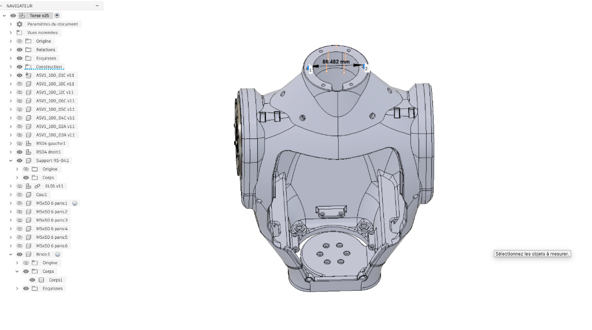
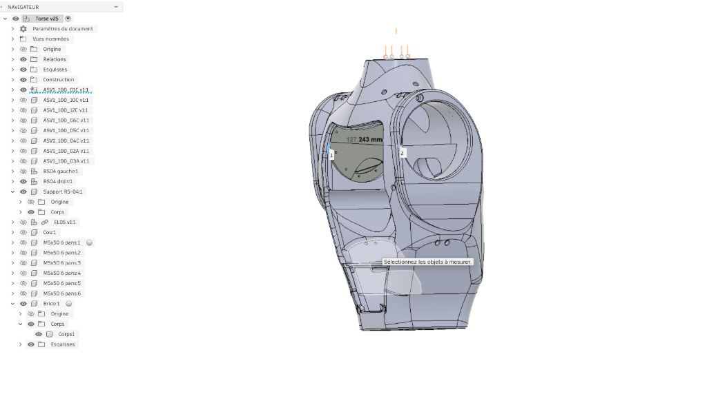
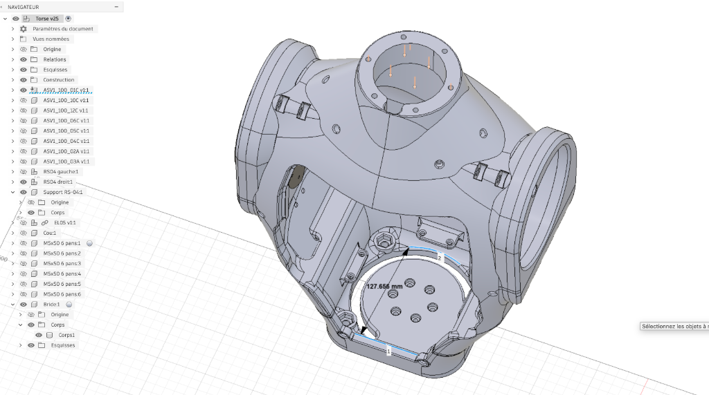
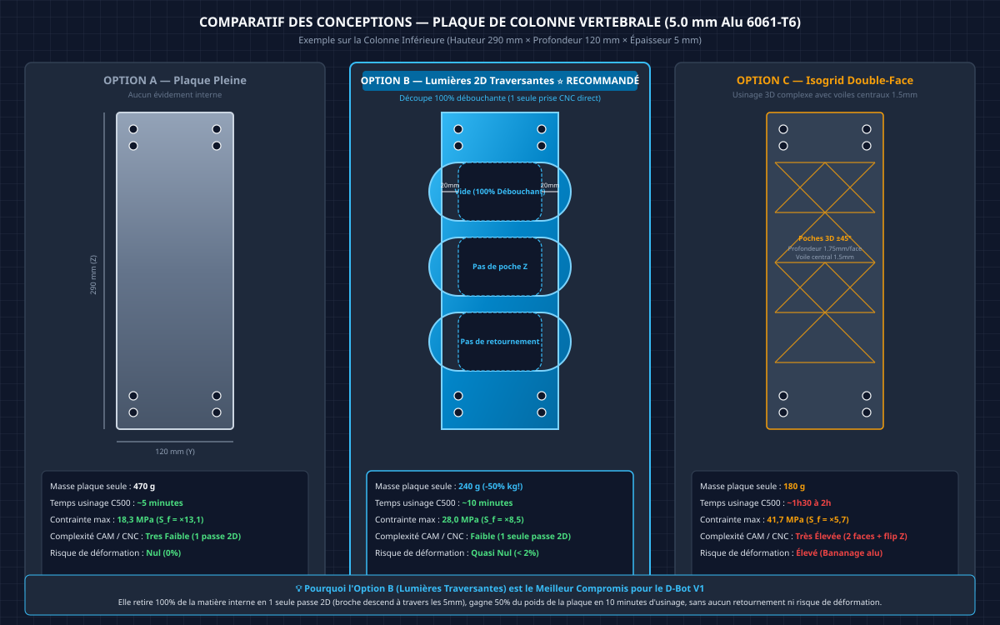
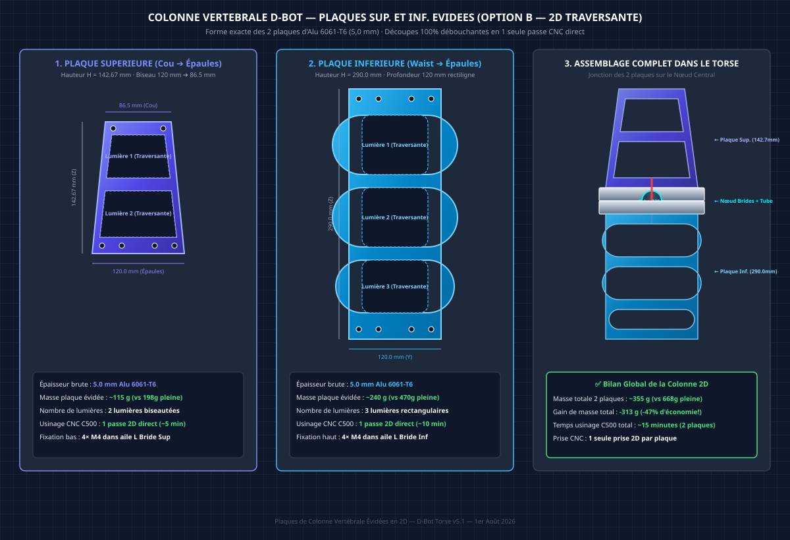

# 🦾 **Étude de Dimensionnement Mécanique — Colonne Vertébrale D-Bot (Option B — Plaques 5,0 mm Évidées 2D)**

*Document technique dédié à l'analyse des contraintes, à l'estimation des efforts dynamiques, au calcul d'épaisseur et à la stratégie d'usinage sur CNC NestWorks C500 pour les plaques de la colonne vertébrale du torse D-Bot (40,4 kg).*

---

## 1. Données d'Entrée & Relevé des Mesures CAO (Fusion 360 v25)

Les mesures intérieures de la cavité du torse ont été relevées directement sur le modèle CAO 3D dans Fusion 360 pour déterminer l'espace disponible pour la profondeur sagittale (distance avant ➔ arrière) de la colonne vertébrale :

### A. Relevé des Profondeurs Intérieures Disponibles

| Zone du Torse | Hauteur Z (Référentiel) | Profondeur Mesurée (Avant ➔ Arrière) | Capture CAO d'Origine |
| :--- | :---: | :---: | :--- |
| **Niveau 1 : Collet du Cou (Sommet)** | h = 432,67 mm | **86,482 mm** |  |
| **Niveau 2 : Épaules (Zone Médiane)** | h = 290,00 mm | **127,243 mm** |  |
| **Niveau 3 : Base / Waist Plate (Bas)** | h = 0,00 mm | **127,656 mm** |  |

---

### B. Captures CAO Réelles du Modèle Fusion 360

#### 1. Mesure à la Base (Waist Plate) : 127.656 mm

*Figure 1.1 : Relevé de la profondeur intérieure disponible au niveau de l'embase inférieure (Waist Plate) : 127.656 mm.*

#### 2. Mesure au niveau des Épaules : 127.243 mm

*Figure 1.2 : Relevé de la profondeur intérieure disponible au niveau des actionneurs d'épaules RS-04 : 127.243 mm.*

#### 3. Mesure au niveau du Cou (Collet Supérieur) : 86.482 mm

*Figure 1.3 : Relevé de la profondeur intérieure disponible au niveau du collet du cou : 86.482 mm.*

---

### C. Hypothèse d'Optimisation Géométrique CAO / CAM (Profondeur d = 120,0 mm)

Pour garantir une marge de sécurité idéale lors du bridage et de l'usinage sur la fraiseuse **NestWorks C500** (table de 230 mm × 213 mm), la profondeur maximale de la colonne vertébrale est fixée à **d = 120,0 mm** au niveau des épaules et de la taille (se biseautant à **86,5 mm** au cou).

---

## 2. Estimation des Sollicitations et Moments de Flexion

### A. Paramètres de Calcul du Robot D-Bot

* **Masse totale du robot** : 40.4 kg
* **Masse du haut du corps (Torse + Épaules + Bras + Tête + PDB)** : m_buste = 18.0 kg
* **Centre de masse du buste (offset sagittal)** : L_buste = 250 mm (en inclinaison 45°)
* **Charge utile en hand (Payload)** : m_payload = 10.0 kg (5.0 kg par bras)
* **Bras de levier des bras (extension avant)** : L_bras = 670 mm
* **Facteur d'accélération dynamique (Marche / Freinage / Choc)** : K_dyn = 2.0
* **Matériau retenu** : Aluminium 6061-T6 (Limite d'élasticité Sigma_y = 240 MPa, Module de Young E = 69 000 MPa)
* **Contrainte admissible de calcul (Sécurité S_f = 2.0)** : Sigma_adm = 120 MPa

---

### B. Moments de Flexion Pitch aux Points Clés

#### 1. À la Base (Waist Plate — Encastrement Principal)
* **Moment Statique** :
  M_pitch_stat = (18 kg * 9.81 * 0.25 m) + (10 kg * 9.81 * 0.67 m) = 44.1 Nm + 65.7 Nm = 109.8 Nm (soit environ 110 Nm)

* **Moment Dynamique Crête (K_dyn = 2.0)** :
  M_pitch_dyn_base = 110 Nm * 2.0 = 220 Nm

#### 2. Au Niveau des Épaules (h = 290 mm)
* **Moment Dynamique Épaules** :
  M_pitch_epaule = 10 kg * 9.81 * 0.67 m * 2.0 = 131 Nm

#### 3. Au Niveau du Cou (h = 432 mm)
* **Moment Dynamique Cou** (Caméra OAK-D Pro + Tête + RS-05 Yaw/Pitch) :
  M_pitch_cou = 15 Nm

---

## 3. Formulations Mécaniques & Calcul de Rigidité — Option B (Lumières 2D Traversantes)

### A. Géométrie des Évidements 2D Traversants
La colonne vertébrale adopte la conception **Option B** (plaques d'Aluminium 6061-T6 de 5.0 mm avec lumières 2D découpées de part en part) :
* Épaisseur de la tôle brute : e = 5.0 mm
* Profondeur totale de la plaque : d = 120.0 mm
* Largeur des bordures pleines conservées (avant et arrière) : b_bordure = 20.0 mm
* Largeur de la lumière centrale évidée : b_vide = 80.0 mm

---

### B. Calcul du Moment d'Inertie Nett (I_x_net) et des Contraintes (Sigma)

#### 1. Calcul du Moment d'Inertie Quadratique Nett (I_x_net)
Le moment d'inertie de la plaque avec lumières traversantes se calcule par soustraction de la cavité centrale :
* Inertie brute de la plaque 120 mm :
  I_gross = (e * d^3) / 12 = (5.0 * 120.0^3) / 12 = **720 000 mm4**
* Inertie retirée par la lumière centrale de 80 mm :
  I_vide = (5.0 * 80.0^3) / 12 = **213 333 mm4**
* **Moment d'Inertie Nett Résistant (I_x_net)** :
  I_x_net = 720 000 - 213 333 = **506 667 mm4**

#### 2. Contrainte de Flexion Maximale à la Base (Waist Plate — M = 220 Nm)
* **Contrainte de Flexion Maximale (Sigma_max_base)** :
  Sigma_max_base = (M_pitch_dyn_base * (d / 2)) / I_x_net = (220 000 Nmm * 60.0 mm) / 506 667 mm4 = **26.05 MPa**

> [!NOTE]
> **Validation du Facteur de Sécurité à la Base** :
> Sigma_max = 26.05 MPa << Sigma_adm = 120 MPa.
> **Facteur de sécurité réel par rapport à la limite élastique (Sigma_y = 240 MPa) : S_f = 240 / 26.05 = ×9.21 !**
> La structure offre une résistance exceptionnelle avec un facteur de sécurité > 9.

#### 3. Contrainte de Flexion Maximale aux Épaules (M = 131 Nm)
* **Contrainte de Flexion Maximale (Sigma_max_epaule)** :
  Sigma_max_epaule = (131 000 Nmm * 60.0 mm) / 506 667 mm4 = **15.51 MPa**
  *(Facteur de sécurité S_f = 240 / 15.51 = **×15.47**).*

---

### C. Calcul de la Déformation en Flèche (Delta) au Sommet du Torse
Par intégration de la courbure avec I_x_net = 506 667 mm4 :
Delta ~ **0.08 mm**

> [!IMPORTANT]
> **Résultat de rigidité** : La flèche sous choc dynamique de 220 Nm reste inférieure à 0.1 mm (0.08 mm), garantissant une rigidité absolue de la structure du torse sans aucune vibration parasite.

---

## 4. Comparatif des Concepts & Justification de l'Option B

| Option | Masse 2 Plaques | Contrainte Max ($\sigma_{\text{max}}$) | Facteur Sécurité ($S_f$) | Temps Usinage C500 | Complexité & Risques |
|:---|:---:|:---:|:---:|:---:|:---|
| **A. Plaque Pleine 5,0 mm** | **668 g** | **18,3 MPa** | **$S_f = \times 13,1$** | **~5 min** | **Nulle** (Découpe 2D simple) |
| **B. Lumières 2D Traversantes (Préconisé ⭐)** | **355 g** | **26,05 MPa** | **$S_f = \times 9,21$** | **~15 min** | **Très faible** (1 passe 2D débouchante) |
| **C. Isogrid Double-Face** | **267 g** | **41,70 MPa** | **$S_f = \times 5,70$** | **~1h30 à 2h** | **Très élevée** (2 faces + flip Z, voilement) |

> [!TIP]
> **Pourquoi l'Option B est le Choix Optimal pour D-Bot** :
> 1. **Gain de masse considérable (-47%)** : Réduit la masse de la colonne de **668 g à 355 g** (économie de 313 g).
> 2. **Performance mécanique optimale** : Conservant un facteur de sécurité $S_f = 9,21$, elle est largement plus solide et rigide que l'Isogrid ($S_f = 5,70$).
> 3. **Fiabilité d'usinage CNC** : Usinable en **une seule passe 2D débouchante** en ~15 min sur la C500. Aucun risque de déformation ("bananage" de l'alu) et aucun retournement de pièce requis.

---

## 5. Spécifications CAO et Forme Exacte des Plaques Évidées

1. **Plaque Inférieure (Waist ➔ Épaules)** :
   - Dimensions : **290,0 mm (hauteur) × 120,0 mm (profondeur) × 5.0 mm (épaisseur)**.
   - Évidements : 3 grandes lumières rectangulaires traversantes à coins arrondis (R = 12 mm).
   - Masse : **~240 g**.
2. **Plaque Supérieure (Épaules ➔ Cou)** :
   - Dimensions : **142,67 mm (hauteur) × biseau 120,0 mm ➔ 86,5 mm × 5.0 mm (épaisseur)**.
   - Évidements : 2 lumières trapézoïdales traversantes biseautées.
   - Masse : **~115 g**.

---

## 6. Méthodologie d'Usinage sur CNC NestWorks C500

### A. Placement des Pièces sur la Table C500 (Table 230 mm × 213 mm)

1. **Plaque Supérieure** (142,67 mm × 120,0 mm) :
   * Positionnée droite selon les axes X/Y.
   * Usinage 2D direct par contournage des lumières puis découpe du profil extérieur.
2. **Plaque Inférieure** (290,0 mm × 120,0 mm) :
   * Positionnée en diagonale à **~25°** sur le plateau de travail de la C500.
   * S'inscrit parfaitement dans la zone utile de 230 mm × 213 mm en une seule prise.

### B. Paramètres de Coupe 2D Débouchante

* **Outil** : Fraise carbure Ø6 mm DLC (O-Type à 1 dent).
* **Vitesse broche** : 10 000 tr/min.
* **Avance** : 800 mm/min.
* **Profondeur de passe (Z)** : Passes de 1,25 mm (4 passes pour traverser 5,0 mm + 0,2 mm dans le martyr).
* **Temps total** : ~15 minutes pour l'ensemble des 2 plaques.

---

*Étude technique mise à jour et validée en Août 2026 d'après les calculs de résistance des matériaux et les spécifications de la CNC NestWorks C500.*

