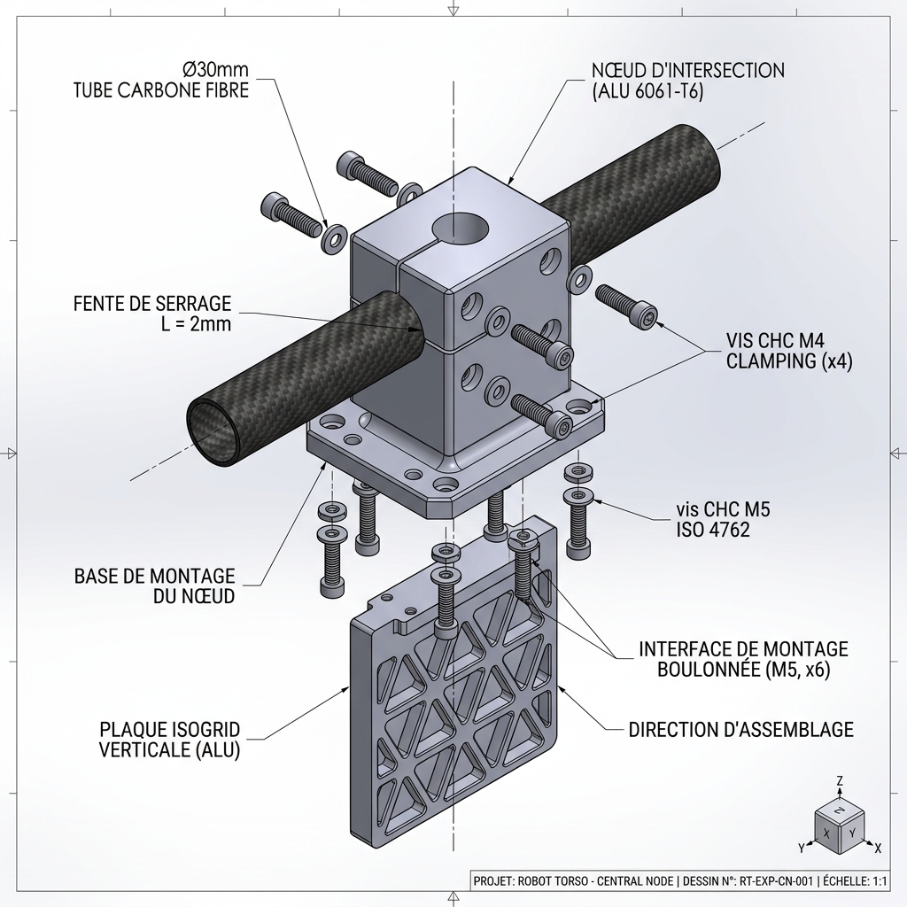

# 🛠️ Guide de Fabrication Hybride : Torse D-Bot (Architecture Cruciforme + FDM PA12-CF + CNC Alu)

*Ce document remplace le [GUIDE_Fabrication_Torse_Asimov_Hybride.md](./GUIDE_Fabrication_Torse_Asimov_Hybride.md) (archivé). Il intègre l'architecture cruciforme interne (plaque isogrid sagittale + traverse carbone), les 2 paniers batterie latéraux avec hot-swap, l'orientation d'impression verticale, et les manchons d'épaule en aluminium.*

> [!NOTE]
> **Évolution architecturale majeure (Mai 2026)** : Le torse passe d'une coque PA12-CF porteuse primaire à une **coque secondaire allégée** habillant un **squelette métallique cruciforme** qui reprend l'intégralité des efforts structurels.

---

## 1. Principe Architectural : Le Squelette Cruciforme Interne

### A. Philosophie de conception

Le torse du D-Bot est basé sur la coque organique de l'Asimov v1 (mise à l'échelle de +18 %), mais son architecture interne est radicalement différente :

| Élément | Ancien design (Asimov pur) | Nouveau design (D-Bot Cruciforme) |
|:---|:---|:---|
| **Structure porteuse** | Coque PA12-CF seule (6 périmètres, 35% infill) | **Squelette alu/carbone cruciforme** |
| **Rôle de la coque** | Primaire (porte tous les efforts) | **Secondaire** (protection, forme, transmission locale) |
| **Colonne vertébrale** | 2 lattes alu latérales (irréalisable) | **1 plaque isogrid sagittale** (dos→ventre, toute la hauteur) |
| **Traverse épaules** | Aucune | **Tube carbone Ø30mm** reliant les 2 brides de liaison d'épaule |
| **Flasques épaules** | Disques plats alu 5mm | **Manchon ouvert alu + bride de liaison CNC** (montage direct) |
| **Batterie** | 1 panier coulissant central | **2 paniers latéraux** (G + D) avec hot-swap |
| **Orientation impression** | Dos au plateau (horizontal) | **Verticale** (debout sur le plan de coupe) |

### B. Schéma de la Structure Cruciforme

```
Vue de Face (Plan Frontal)                    Vue de Dessus (Plan Transversal)

    ┌── Plaque Alu Cou (5mm) ──┐                 DOS (ouvert)
    │           │               │                     │
┌───┤     Tube Carbone Ø30mm   ├───┐          ┌──────┤──────┐
│Mch│◄──────── │ ──────────────►│Mch│          │Bat.G │Bat.D │
│Alu│     ╔════╧════╗          │Alu│          │      │      │
│ G │     ║ Plaque  ║          │ D │          │  ┌───┼───┐  │
└───┤     ║ Isogrid ║          ├───┘          │  │Iso│   │  │
    │     ║ Sagit.  ║          │              │  │grd│   │  │
    │ B.G ║ Alu 5mm ║ B.D     │              │  │5mm│   │  │
    │     ║ (±45°)  ║         │              │  └───┼───┘  │
    │     ╚════╤════╝          │              │      │      │
    └── Waist Plate (6mm) ─────┘              └──────┤──────┘
               │                                     │
          RS-06 Waist Yaw                        VENTRE
```

### C. Rigidité comparée

| Sollicitation | Ancien (lattes) | Nouveau (cruciforme) | Gain |
|:---|:---:|:---:|:---:|
| **Flexion Pitch** (avant/arrière) | I ≈ 773 000 mm⁴ | I ≈ 21 700 000 mm⁴ | **×28** |
| **Flexion Roll** (latérale) | Bon | Bon (traverse carbone) | ~×1 |
| **Torsion Yaw** | Très faible | Bon (boîte de torsion fermée + nervures ±45°) | **×5-8** |
| **Compression axiale** | Bon | Excellent | ×2 |

---

## 2. Plaque Isogrid Sagittale (Colonne Vertébrale)

### A. Spécifications

| Paramètre | Valeur |
|:---|:---|
| **Matériau** | Aluminium 6061-T6, tôle de 5 mm |
| **Orientation** | Plan sagittal (dos → ventre), verticale sur toute la hauteur du torse |
| **Dimensions brutes** | ~432 mm (hauteur) × ~200 mm (profondeur sagittale) |
| **Découpage** | En **2 parties** (Haut + Bas) alignées sur le split abdominal du torse |
| **Jonction des 2 parties** | Éclisse boulonnée M4 × 4 vis, chevauchement 30 mm au plan de coupe |
| **Fixation haute** | Boulonnage M4/M5 sur la plaque alu de cou (5 mm) |
| **Fixation basse** | Boulonnage M4/M5 sur la Waist Plate alu (6 mm) |
| **Masse estimée** | ~350 g (isogrid, efficacité structurelle ~65%) |

### B. Motif Isogrid Optimisé pour la Torsion (Nervures à ±45°)

> [!IMPORTANT]
> Le motif isogrid classique (triangles équilatéraux, nervures à 0°/60°/−60°) est optimisé pour la compression et la flexion. Pour améliorer **spécifiquement la résistance en torsion Yaw** (sollicitée par le RS-06 de la taille à 36 N.m), le motif doit être adapté :

**Motif recommandé : Nervures diagonales à ±45° (motif losange/diamant)**

```
┌─────────────────────────────────────┐
│ ╲   ╱   ╲   ╱   ╲   ╱   ╲   ╱     │  ← Nervures principales à +45°
│   ╳       ╳       ╳       ╳        │
│ ╱   ╲   ╱   ╲   ╱   ╲   ╱   ╲     │  ← Nervures principales à −45°
│       ╳       ╳       ╳            │
│ ╲   ╱   ╲   ╱   ╲   ╱   ╲   ╱     │     Pas du motif : 20-25 mm
│   ╳       ╳       ╳       ╳        │     Largeur nervures : 3 mm
│ ╱   ╲   ╱   ╲   ╱   ╲   ╱   ╲     │     Profondeur poches : 3.5 mm
│       ╳       ╳       ╳            │     Fond résiduel : 1.5 mm
└─────────────────────────────────────┘
```

**Pourquoi ±45° :**
- Les nervures à ±45° sont orientées dans la **direction des contraintes principales de cisaillement** induites par la torsion Yaw
- Elles transforment la contrainte de cisaillement (τ) en traction/compression le long des nervures (σ) → beaucoup plus efficace
- C'est le même principe que les **raidisseurs diagonaux des fuselages d'avion** (stressed-skin aéronautique)
- Gain en rigidité torsionnelle estimé : **×3 à ×5** par rapport à un motif standard 0°/60°/−60°

### C. Fabrication CNC (C500)

| Étape | Détail |
|:---|:---|
| **1. Bridage** | Fixer la tôle brute 6061-T6 sur une table sacrificielle MDF avec des vis traversantes dans les futures zones de perçage (libère toute la course de la C500) |
| **2. Ébauche** | Fraise plate carbure Ø4 mm, 3 passes de 1,2 mm, vitesse 1200 mm/min, avance 0,05 mm/dent |
| **3. Finition poches** | Fraise plate carbure Ø3 mm, 1 passe de 0,3 mm (fond résiduel 1,5 mm), vitesse 800 mm/min |
| **4. Contour extérieur** | Fraise Ø4 mm, découpe du profil sagittal + perçages de fixation M4/M5 |
| **5. Ébavurage** | Lime douce + papier 320 sur les arêtes |
| **Temps estimé** | ~3-4h par demi-plaque (soit ~7h total pour les 2 parties) |

> [!WARNING]
> **Taille de la plaque** : Chaque demi-plaque mesure ~216 × 200 mm. Vérifiez que la course utile de votre C500 permet de couvrir cette surface en une seule prise. Si nécessaire, usinez en 2 phases avec repositionnement (référence par 2 pions de centrage Ø4 mm dans des trous de tooling).

---

## 3. Traverse Horizontale (Liaison Épaules)

### A. Spécifications

| Paramètre | Valeur |
|:---|:---|
| **Matériau** | Tube carbone 3K, époxy, Ø30 mm extérieur, épaisseur 2 mm |
| **Longueur** | ~260 mm (entraxe des cylindres d'épaule) |
| **Masse** | ~70 g |
| **Rigidité torsionnelle** | J ≈ 52 000 mm⁴ (×15 par rapport à une plaque de 5 mm de même largeur) |
| **Fixation aux épaules** | Emmanché dans la bride de liaison alu CNC de chaque côté, serré par 2 vis M4 (pincement) |
| **Fixation à la plaque isogrid** | Traverse le plan sagittal via un **nœud d'intersection** (collier CNC alu) boulonné |

### B. Nœud d'Intersection Plaque/Traverse

Le tube carbone traverse la plaque isogrid sagittale au niveau des épaules. Un **nœud CNC en aluminium** assure la liaison rigide :

```
Vue en Coupe (plan horizontal au niveau des épaules)

    Manchon/Moteur G       Nœud d'intersection         Manchon/Moteur D
    ┌─────────┐           ┌────┬────┐                  ┌─────────┐
    │         │           │    │    │                   │         │
    │  RS-04  ├───────────┤Tube│Carb├───────────────────┤  RS-04  │
    │         │           │    │one │                   │         │
    └─────────┘           └────┴────┘                  └─────────┘
                               │
                           Plaque Isogrid
                           (vue en coupe)
```


*Vue détaillée du nœud d'intersection : le tube en carbone traverse le bloc alu CNC. Le serrage par pincement est assuré par la fente de serrage supérieure resserrée par 4 vis CHC M4. La base du nœud est fixée sur la plaque isogrid sagittale.*

Le nœud est un bloc alu usiné CNC (~80 g) avec :
- Un **alésage traversant** de Ø30 mm (+0,05 mm pour ajustement glissant du tube carbone).
- **Principe de serrage par alésage fendu (pincement) :** Le nœud est fendu longitudinalement sur sa partie supérieure (fente d'usinage de $1,5\text{ mm}$ de large débouchant dans l'alésage).
- 4 **perçages transversaux pour vis CHC M4** (2 de chaque côté de la plaque isogrid, orientés perpendiculairement à la fente) permettant de resserrer élastiquement l'alésage alu. Le serrage applique une pression uniforme sur les $360^\circ$ du tube carbone par friction, évitant tout point de pression localisé qui pourrait fracturer ou délaminer les fibres.
- Une **base plate** boulonnée directement sur la plaque isogrid sagittale (4 vis M4).

### C. Bride de Liaison Tube Carbone / Stator Moteur (Pièce ③ — Usiné CNC)

Pour coupler la traverse en carbone à l'ensemble épaule, une **bride de liaison CNC** en aluminium 6061-T6 est utilisée de chaque côté. Elle sert de transition rigide entre le tube de carbone Ø30 mm et la face arrière du stator du moteur RS-04.


*Vue détaillée de la bride de liaison : le tube en carbone ($\varnothing 30 \times 26\text{ mm}$) est renforcé par un **bouchon interne de renfort** ($\varnothing 26\text{ mm}$) collé à l'époxy. L'ensemble s'insère dans l'alésage de la bride alu CNC, bridé mécaniquement par une **goupille élastique traversante** ($\varnothing 3\text{ mm}$) et sécurisé sans jeu par un collier fendu à 2 vis M4.*

#### Modes de Fixation (Axial et Rotation)

| Liaison | Fixation Axiale (Translation) | Fixation en Rotation |
|:---|:---|:---|
| **Tube Carbone ↔ Bride alu** | **Obstacle mécanique** : Goupille élastique traversante (Mécanindus) $\varnothing 3\text{ mm}$ travaillant en double cisaillement — bloque toute translation axiale (arrachement et compression) de manière positive et définitive. La friction du collier fendu (2 vis M4) complète pour éliminer les micro-jeux. | **Obstacle mécanique** : La goupille verrouille la rotation de façon positive. Le serrage par pincement (collier fendu M4) élimine tout micro-jeu angulaire (backlash) par friction. Le bouchon de renfort creux empêche l'écrasement du tube sous l'effet du serrage M4. |
| **Bride alu ↔ Stator Moteur** | **Serrage mécanique** via les 8 vis M5 traversant le collet PA12-CF et la bride, plaquant le stator contre le lip du manchon. | **Obstacle mécanique** via les 8 vis CHC M5 dans leurs taraudages borgnes du stator (encastrement rigide). |

#### Spécifications de la goupille et du bouchon de renfort
* **Bouchon interne de renfort :** Manchon cylindrique **creux** (pour optimiser la masse) de $\varnothing 26\text{ mm}$ extérieur (ajustement glissant serré H7/h6) et $\varnothing 16-20\text{ mm}$ intérieur, d'une longueur de $30\text{ mm}$. Usiné en alu 6061-T6 ou imprimé en PA12-CF (100% de remplissage). Il est inséré et collé à l'époxy structurale à l'extrémité du tube. Son rôle est d'empêcher l'écrasement ou la délamination des fibres sous la contrainte du collier fendu ou de la goupille.
* **Perçage transversal :** Le trou transversal de $\varnothing 3\text{ mm}$ pour la goupille doit être percé à une distance de **$12\text{ mm}$** du bord d'extrémité du tube carbone (règle standard de $3 \times d$ pour éviter la rupture par cisaillement de l'arête du composite).
* **Goupille élastique :** Goupille de type Mécanindus (fendue en acier trempé) de $\varnothing 3\text{ mm} \times 35\text{ mm}$ (dépassant légèrement de chaque côté de la bride). Résistance au double cisaillement supérieure à $6300\text{ N}$ ($\approx 630\text{ kg}$).

---

## 4. Manchon d'Épaule (Aluminium 6061-T6) et Collet PA12-CF

### A. Concept : Manchon alu ouvert + Lip avant + Collet PA12-CF enveloppant

> [!IMPORTANT]
> **Révision architecturale (Juin 2026)** : L'ancien concept de « cylindre + fond plat 5 mm » puis « manchon à 2 rebords » est remplacé par un **manchon ouvert à l'arrière** avec uniquement un **lip avant**. Ce design est le seul qui permette l'assemblage : le moteur RS-04 **glisse par l'arrière** dans le manchon, et les **vis M5 se vissent directement dans les taraudages borgnes du stator** sans traverser d'aluminium côté arrière.

Chaque logement d'épaule est un assemblage de **3 couches** :

1. **Manchon alu 6061-T6** — manchon cylindrique ouvert à l'arrière, avec un **lip avant uniquement** (butée axiale)
2. **Collet PA12-CF** — poche imprimée dans la coque du torse, enveloppant le manchon alu + moteur, avec un **rebord arrière** portant les trous de passage pour les vis et les câbles
3. **Résine époxy JB Weld** — film de collage structural entre le manchon alu et le collet PA12-CF

Les **câbles du moteur** (puissance XT30 + CAN) sortent par un **canal** dans le rebord PA12-CF arrière, vers l'**intérieur du torse**. Le **tube carbone Ø30 mm est purement structural** et ne sert **pas** au passage de câbles.

### B. Le Manchon Aluminium (Pièce ① — Usiné CNC)

Le manchon alu est un **simple tube ouvert à l'arrière** avec un **lip intérieur côté avant** :

```
Vue en coupe axiale — Manchon Alu 6061-T6

                     AVANT (vers le bras)
                            ↑
    ┌────────────────────────────────────────────┐
    │       LIP AVANT (butée axiale, 3mm)        │  ← Anneau alu plat, dépasse de ~2-3mm
    │       (empêche le moteur de sortir         │     vers l'intérieur au-delà du corps moteur
    │        vers l'extérieur lors du serrage)   │
    ├────┐                                  ┌────┤
    │    │                                  │    │
    │    │     PAROI CYLINDRIQUE (3mm)       │    │  ← Manchon, contact latéral 360°
    │    │     (enveloppe le corps moteur)   │    │     collé résine époxy sur le collet PA12-CF
    │    │                                  │    │
    │    │                                  │    │
    └────┘                                  └────┘
                            ↓
              ARRIÈRE : COMPLÈTEMENT OUVERT
              (le moteur glisse par ici)
```

> [!CAUTION]
> **PAS d'anneau arrière sur le manchon alu.** Un manchon fermé aux deux extrémités (lip avant + anneau arrière) rendrait l'insertion du moteur **impossible**. L'arrière doit rester **complètement ouvert** pour permettre le montage.

#### Spécifications du manchon alu

| Paramètre | Valeur |
|:---|:---|
| **Matériau** | Aluminium 6061-T6 (usinage CNC ou tournage) |
| **Forme** | Manchon cylindrique **ouvert à l'arrière**, avec **lip avant uniquement** |
| **Diamètre extérieur** | Diamètre du collet PA12-CF **−0,2 mm** (tolérance FDM) |
| **Épaisseur de paroi cylindrique** | 3 mm |
| **Lip avant** | Anneau plat de **3 mm** d'épaisseur, dépassant de 2-3 mm vers l'intérieur au-delà du corps du moteur. Sert de **butée axiale** empêchant le moteur de sortir vers l'extérieur lors du serrage des vis |
| **Arrière** | **Complètement ouvert** — pas d'anneau, pas de fond. La face arrière du stator est exposée |
| **Trou d'évent** | 1× Ø2 mm dans la paroi cylindrique pour éviter l'effet piston lors de l'insertion du moteur |
| **Masse unitaire estimée** | ~100 g |

### C. Le Collet PA12-CF (Pièce ② — Intégré à la coque imprimée)

Le collet PA12-CF est directement intégré à la coque du torse (imprimé d'un seul tenant). Il enveloppe la **totalité** de l'assemblage (manchon alu + moteur) :

| Paramètre | Valeur |
|:---|:---|
| **Matériau** | PA12-CF (coque torse, impression FDM) |
| **Forme** | Poche cylindrique ouverte côté avant (la bride rotor dépasse) |
| **Paroi latérale** | Enveloppe le manchon alu sur toute sa hauteur. Interstice ~0,2 mm rempli de **résine époxy JB Weld** |
| **Côté avant** | S'arrête au niveau du lip alu avant (la bride du rotor reste accessible) |
| **Rebord arrière** | Anneau PA12-CF qui se positionne **derrière la face arrière du stator** (pas derrière l'alu, qui est ouvert). Comporte : |
| | — 8× **trous de passage Ø7-8 mm** alignés avec les taraudages du stator (pour accès clé Allen) |
| | — **Lamage de 1 mm** côté intérieur pour noyer les têtes de vis CHC M5 |
| | — **Canal en U** pour le passage des câbles XT30 + CAN |
| **Rôle structural** | Fournit l'appui arrière des vis (la tête de vis repose sur le rebord), protège l'arrière du moteur, guide les câbles |

### D. Chemin de Fixation et Routage Câbles

> [!IMPORTANT]
> **Chemin des vis M5** :
> 
> `Intérieur du torse → tête CHC M5 dans lamage PA12-CF → trou lisse Ø7-8 du rebord PA12-CF → DIRECTEMENT dans taraudage borgne M5 du stator RS-04`
> 
> **Il n'y a PAS d'aluminium dans le chemin des vis côté arrière.** Le manchon alu est ouvert à l'arrière. Les vis traversent uniquement le rebord PA12-CF puis se vissent directement dans les 8 taraudages borgnes de la face arrière du stator.
>
> Le serrage plaque le stator contre le lip alu avant via la réaction axiale des vis : `tête vis → rebord PA12-CF → stator → lip alu avant`.

> [!NOTE]
> **Chemin des câbles** :
> 
> `Connecteurs stator (face arrière) → canal en U du rebord PA12-CF → intérieur du torse → routage le long de la plaque isogrid → PDB Matek + bus CAN`
> 
> Le **tube carbone Ø30 mm est exclusivement structural** : il ne sert pas de conduit pour les câbles.

### E. Séquence d'Assemblage

```
Étape 1 : Coller le manchon alu dans le collet PA12-CF (résine époxy JB Weld)
          → Le manchon est inséré par l'avant dans le collet PA12-CF
          → Laisser polymériser 24h

Étape 2 : Insérer le RS-04 par l'arrière du collet
          → Le moteur glisse dans le manchon alu
          → Il bute contre le lip avant (stator vers l'arrière, rotor vers l'avant)
          → Les câbles sortent par le canal en U du rebord PA12-CF

Étape 3 : Fixer les vis CHC M5 × 8 depuis l'intérieur du torse
          → Vis passent par les trous Ø7-8 du rebord PA12-CF
          → Se vissent dans les taraudages borgnes du stator
          → Appliquer Loctite 243 sur chaque vis
```

### F. Illustration Technique — Coupe Axiale Corrigée


*Coupe axiale corrigée montrant le design assemblable : le manchon alu (gris) est un simple tube avec lip avant, **ouvert à l'arrière**. Le moteur RS-04 (noir) glisse par l'arrière. Les vis CHC M5 (rouge) se vissent **directement dans les taraudages borgnes du stator** en ne traversant que le rebord PA12-CF. Les câbles (bleu) sortent par le canal en U vers l'intérieur du torse. Aucun aluminium dans le chemin des vis côté arrière.*

### G. Avantages de l'architecture manchon ouvert + lip avant

| Critère | Description |
|:---|:---|
| **Assemblabilité** | ✅ Le moteur glisse par l'arrière — montage et démontage possibles |
| **Chemin de vis** | ✅ Vis → PA12-CF → taraudages stator (direct, sans intermédiaire alu) |
| **Butée axiale** | ✅ Le lip avant empêche le moteur de sortir lors du serrage |
| **Maintien latéral** | ✅ Paroi cylindrique alu 360° collée au PA12-CF |
| **Dissipation thermique** | ✅ Contact 360° entre corps moteur et manchon alu |
| **Résistance à l'ovalisation** | ✅ Le manchon corsetise le PA12-CF |
| **Passage câbles** | ✅ Canal en U dans le rebord PA12-CF |
| **Maintenance** | ✅ Retrait du moteur possible en dévissant 8 vis depuis l'intérieur |

---

## 5. Orientation d'Impression : Verticale (Debout)

### A. Pourquoi l'orientation change

Avec le squelette cruciforme reprenant tous les efforts structurels, la coque PA12-CF n'est plus la structure porteuse primaire. Le risque de délamination inter-couche au niveau des collerettes d'épaule est **compensé** par les manchons alu internes. Cela autorise l'impression **verticale** (le torse debout), ce qui élimine massivement les supports.

### B. Orientation pour chaque demi-torse

**Coque Abdominale (Bas) — Verticale, taille en bas :**

```
                    ┌─────────────┐  ← Plan de coupe (belly)
                    │             │
                    │  Abdomen    │     Z (print)
                    │             │     ↑
                    │             │     │
                    └─────────────┘  ← Taille (sur le plateau)
              ══════════════════════════  Plateau Qidi Plus 4
```

- **Base sur le plateau** : La taille (Waist) est posée à plat
- **Hauteur Z d'impression** : ~216 mm (passe dans 280 mm ✅)
- **Largeur X** : ~295 mm (passe dans 305 mm ✅, marge de 5 mm de chaque côté)
- **Profondeur Y** : ~260 mm (passe dans 305 mm ✅)
- **Supports** : Quasi inexistants — la coque abdominale est une forme relativement simple sans collerettes
- **Fibres PA12-CF** : Orientées horizontalement → excellente résistance en compression axiale

**Thorax (Haut) — Verticale, plan de coupe en bas :**

```
                    ┌─────────────┐  ← Cou (sommet)
                    │      │      │
               ┌────┤  Collets    ├────┐  ← Manchons d'épaule
               │    │  d'épaule   │    │     (porte-à-faux)
               │    │             │    │
                    │  Thorax     │
                    │             │
                    └─────────────┘  ← Plan de coupe (belly, sur le plateau)
              ══════════════════════════  Plateau Qidi Plus 4
```

- **Base sur le plateau** : Le plan de coupe (belly) est posé à plat
- **Hauteur Z d'impression** : ~216 mm ✅
- **Collerettes d'épaule** : Se projettent latéralement à environ mi-hauteur → besoin de supports **uniquement sous les collets** (supports arborescents depuis le plateau, hauteur courte ~100 mm au lieu de ~260 mm en orientation horizontale)
- **Dos ouvert** : Pas de surplomb arrière → aucun support nécessaire côté dos

### C. Comparaison des volumes de support

| Zone | Orientation horizontale (ancienne) | Orientation verticale (nouvelle) |
|:---|:---:|:---:|
| **Sous les collerettes** | Supports massifs (piliers de 260 mm de haut) | Supports courts (~100 mm) |
| **Courbes poitrine** | Supports modérés (surplombs organiques) | Quasi nuls (parois verticales auto-supportées) |
| **Dos** | Supports légers | Aucun (ouvert) |
| **Nervures internes** | Supports possibles | Quasi nuls |
| **Volume total estimé** | **~350-500 cm³** | **~80-120 cm³** (÷3 à ÷4) |

> [!TIP]
> **Gain de temps et de matière** : La réduction de 70-80% du volume de supports se traduit par :
> - ~2-4h de temps d'impression en moins
> - ~50-100g de PA12-CF économisé (supports + purge)
> - Retrait des supports beaucoup plus facile (surfaces de contact réduites)
> - État de surface des collerettes amélioré (moins de marques de support)

### D. Impact structural de l'impression verticale

| Critère | Impression horizontale (dos au plateau) | Impression verticale (debout) |
|:---|:---|:---|
| **Collerettes** : cercles continus | ✅ 100% continus (cercles dans le plan XY) | 🟡 Couches coupent le cercle → arcs de ~80% par couche |
| **Résistance collet en hoop stress** | ✅ Excellent (fibres le long du cercle) | 🟡 Moyen (fibres coupent le cercle) |
| **Compensation par manchon alu** | N/A (pas de manchon dans l'ancien design) | ✅ **Le manchon alu reprend 100% du hoop stress** |
| **Résistance axiale du collet** | 🟡 Inter-couche (faible) | ✅ Le long des fibres (fort) |
| **Support nécessaire** | ❌ Massif | ✅ **Minimal** |

> [!IMPORTANT]
> L'impression verticale n'est **viable que parce que les manchons alu internes reprennent les charges** du collet. Sans le squelette cruciforme, cette orientation serait dangereuse. C'est l'architecture cruciforme qui débloque cette orientation avantageuse.

---

## 6. Paramètres de Tranchage (Slicing) — Coque Secondaire PA12-CF

### A. Paramètres Globaux (Zone Courante)

La coque étant désormais secondaire (le squelette porte les efforts), les paramètres d'impression sont **allégés** par rapport à l'ancien guide :

| Catégorie | Paramètre (FR) | Slicer Setting Name (EN) | Slicer Tab / Menu Path (EN) | Recommended Value | Ancien | Description & Note |
| :--- | :--- | :--- | :--- | :---: | :---: | :--- |
| **Printer** | Diamètre de buse | **Nozzle Diameter** | `Printer settings` ➔ `Extruder` ➔ `Nozzle` | `0.4 mm` | 0.4 mm | Type : **Tungsten Carbide** (Carbure de Tungstène) |
| **Quality** | Hauteur de couche | **Layer Height** | `Process` ➔ `Quality` ➔ `Layer Height` | `0.20 mm` | 0.18 mm | Légèrement plus épais pour accélérer l'impression |
| **Quality** | Largeur d'extrusion | **Line Width / Extrusion Width** | `Process` ➔ `Quality` ➔ `Line Width` | `0.48 mm` | 0.48 mm | Inchangé |
| **Strength** | Nombre de parois | **Wall Loops / Perimeters** | `Process` ➔ `Strength` ➔ `Walls` | **`4`** | ~~6~~ | ⚠️ **Réduit de 6 à 4** — coque secondaire (épaisseur 1,92 mm) |
| **Strength** | Couches sup. / inf. | **Top / Bottom Shell Layers** | `Process` ➔ `Strength` ➔ `Shells` | **`4` / `4`** | ~~6/6~~ | ⚠️ **Réduit** |
| **Strength** | Motif de remplissage | **Infill Pattern** | `Process` ➔ `Strength` ➔ `Sparse infill` | `Gyroid` | Gyroid | Inchangé |
| **Strength** | Taux de remplissage | **Infill Density** | `Process` ➔ `Strength` ➔ `Sparse infill` | **`20%`** | ~~35%~~ | ⚠️ **Réduit de 35% à 20%** — le squelette porte les charges |
| **Filament** | Température de buse | **Nozzle Temperature** | `Filament settings` ➔ `Filament` ➔ `Nozzle temperature` | `290°C - 295°C` | 290-295°C | Inchangé |
| **Filament** | Température plateau | **Bed Temperature** | `Filament settings` ➔ `Filament` ➔ `Bed temperature` | `85°C - 90°C` | 85-90°C | Avec colle Magigoo PA ou PVP |
| **Filament** | Chambre chauffée | **Chamber Temperature** | `Filament settings` ➔ `Filament` ➔ `Chamber temperature` | `60°C` | 60°C | Indispensable pour le PA12-CF |
| **Cooling** | Ventilation pièce | **Part Cooling Fan Speed** | `Filament settings` ➔ `Cooling` ➔ `Part cooling fan` | `0%` | 0% | Max 10% pour ponts |
| **Speed** | Vitesse parois ext. | **Outer Wall Speed** | `Process` ➔ `Speed` ➔ `Walls` | `45 - 55 mm/s` | 40-45 | Légèrement augmentée (coque secondaire tolère + d'imperfections) |
| **Speed** | Vitesse parois int. | **Inner Wall Speed** | `Process` ➔ `Speed` ➔ `Walls` | `55 - 65 mm/s` | 50-55 | Idem |
| **Speed** | Vitesse remplissage | **Sparse Infill Speed** | `Process` ➔ `Speed` ➔ `Infill` | `55 - 65 mm/s` | 50-55 | Idem |
| **Support** | Activer supports | **Enable Support** | `Process` ➔ `Support` ➔ `Support` | `Checked (Yes)` | Yes | Type : **Tree (Organic)** |
| **Support** | Support Build Plate Only | **Support on Build Plate Only** | `Process` ➔ `Support` ➔ `Support` | `Checked (Yes)` | Yes | Aucun support interne |
| **Support** | Angle seuil | **Support Threshold Angle** | `Process` ➔ `Support` ➔ `Support` | `55° - 60°` | 55-60° | Le PA12-CF ponte bien jusqu'à 55° |
| **Support** | Z-Distance sup. | **Support Top Z Distance** | `Process` ➔ `Support` ➔ `Support` | `0.30 - 0.40 mm` | 0.28-0.36 | Augmenté pour faciliter le retrait |
| **Travel** | Saut en Z | **Z-hop when Retracting** | `Printer settings` ➔ `Extruder` ➔ `Retraction` | `0.4 mm` | 0.4 mm | Normal ou Slope |
| **Others** | Couche variable | **Adaptive Layer Height** | `Top Toolbar` ➔ `Variable Layer Height (Icon)` | `Disabled` | Disabled | Inchangé |

### B. Zone d'Épaule : Modifier Volume (Renforcement Local)

> [!CAUTION]
> **Les collerettes d'épaules restent à paramètres MAXIMAUX.** Même avec les manchons alu, la coque PA12-CF doit résister localement au serrage radial du RS-04 et transmettre les efforts au manchon. Il faut créer un **Modifier Volume** dans le slicer pour surcharger les paramètres dans cette zone.

#### Procédure détaillée OrcaSlicer / Qidi Print (en anglais, pas à pas) :

**Étape 1 — Importer et positionner le modèle**
1. Ouvrez **OrcaSlicer** (ou Qidi Print)
2. Importez le fichier STL du Thorax (demi-torse haut)
3. Positionnez-le verticalement (plan de coupe au belly → sur le plateau)

**Étape 2 — Ajouter un Modifier Volume cylindrique**
1. **Clic droit** sur le modèle dans la vue 3D (ou dans le panneau de gauche sur le nom de l'objet)
2. Sélectionnez **`Add Modifier`** → **`Cylinder`**
3. Un cylindre transparent apparaît dans la scène

**Étape 3 — Dimensionner et positionner le Modifier**
1. **Sélectionnez** le cylindre modifier (clic gauche dessus)
2. Dans le panneau de droite, sous **`Object Manipulation`**, ajustez :
   - **`Size X`** : Diamètre du collet d'épaule + 30 mm de marge (ex: si collet = 90 mm → taper `120`)
   - **`Size Y`** : Identique à X (`120`)
   - **`Size Z`** : `80` mm (hauteur de la zone renforcée)
3. **Positionnez** le cylindre exactement sur le logement de l'épaule :
   - Utilisez **`Move`** (touche `M`) pour déplacer le cylindre modifier
   - Centrez-le sur le collet d'épaule visible dans le modèle
   - Ajustez visuellement en vue de face, de côté et de dessus
4. **Répétez** pour l'épaule opposée (Clic droit → `Add Modifier` → `Cylinder` → positionner)

**Étape 4 — Configurer les paramètres du Modifier**
1. **Clic droit** sur le cylindre modifier (dans le panneau de gauche ou dans la vue 3D)
2. Sélectionnez **`Edit modifier settings`** (ou **`Change type`** → `Advanced`)
3. Cochez et configurez les paramètres suivants :
   - ☑️ **`Wall loops`** → valeur : **`6`** (au lieu de 4 global)
   - ☑️ **`Sparse infill density`** → valeur : **`35%`** (au lieu de 20% global)
   - ☑️ **`Top shell layers`** → valeur : **`6`**
   - ☑️ **`Bottom shell layers`** → valeur : **`6`**
4. Cliquez **`OK`** / **`Apply`**

**Étape 5 — Vérifier visuellement**
1. Cliquez sur **`Slice`** (bouton en bas à droite)
2. Utilisez le **curseur de couches** (barre verticale à droite) pour naviguer couche par couche
3. Vérifiez que dans la zone du cylindre modifier :
   - Les parois sont plus épaisses (6 boucles au lieu de 4)
   - Le remplissage est plus dense (35% au lieu de 20%)
   - La transition entre la zone renforcée et la zone allégée est progressive
4. Si le positionnement est incorrect, annulez le slice, ajustez le modifier et re-slicez

### C. Paramètres de Tranchage pour Prototype PLA

Pour valider l'ajustement mécanique avant de lancer l'impression PA12-CF, imprimer un prototype en PLA avec les paramètres accélérés suivants :

| Catégorie | Slicer Setting (EN) | Valeur PLA | Note |
| :--- | :--- | :---: | :--- |
| **Quality** | **Layer Height** | `0.28 mm` | Mode draft rapide |
| **Strength** | **Wall Loops** | `3` | Suffisant pour test d'ajustement |
| **Strength** | **Infill Density** | `10% - 15%` | Remplissage léger |
| **Strength** | **Infill Pattern** | `Grid` | Plus rapide que Gyroid en PLA |
| **Filament** | **Nozzle Temperature** | `210°C - 220°C` | Standard PLA |
| **Filament** | **Bed Temperature** | `55°C - 60°C` | Standard PLA |
| **Filament** | **Chamber Temperature** | **`0°C (OFF)`** | ⚠️ **Éteindre le chauffage + ouvrir le capot** (heat creep) |
| **Cooling** | **Part Cooling Fan** | **`100%`** | Maximum pour PLA |
| **Speed** | **Outer Wall Speed** | `100 - 120 mm/s` | Vitesse CoreXY |
| **Speed** | **Sparse Infill Speed** | `200 - 250 mm/s` | Gain de temps massif |
| **Support** | **Enable Support** | `Yes, Tree` | Se détachent facilement en PLA |

### D. Conditionnement du Filament PA12-CF

> [!WARNING]
> **Le PA12 (Nylon) est extrêmement hydrophile.** Si le filament absorbe de l'humidité, les couches crépitent, la pièce devient cassante et les efforts inter-couches s'effondrent. C'est le **facteur n°1 d'échec** d'impression en PA12-CF.

1. **Séchage initial** : Sécher la bobine au four ou dans un sécheur actif à **90°C pendant 6 à 8 heures** avant de lancer l'impression
2. **Impression sous atmosphère contrôlée** : Imprimer impérativement à partir d'une **boîte sèche hermétique** (*Drybox*) reliée directement à l'imprimante, maintenant un taux d'humidité **inférieur à 10%**
3. **Stockage** : Après impression, remettre immédiatement la bobine dans un sac sous vide avec sachets de gel de silice

---

## 7. Split Abdominal Rigide et Emboîtement (Lap Joint)

Le torse est divisé horizontalement au niveau du ventre pour l'impression. L'assemblage des deux moitiés reste **100 % rigide** grâce à l'emboîtement et au squelette cruciforme traversant :

### A. Lèvre d'Emboîtement (Lap Joint de 3 mm)

La procédure de modélisation du Lap Joint sous Fusion 360 reste identique à celle documentée dans le guide archivé (Section 5.A) :

1. **Bandeau de renfort interne** : Épaissir la coque de 3 mm supplémentaires sur une bande de ±8 mm autour du plan de coupe → épaisseur locale de 4,92 mm (4 périmètres + renfort)
2. **Split Body** : Scinder le torse au plan de coupe abdominal
3. **Lèvre mâle** : Extrusion de +3 mm sur la coque abdominale (bas)
4. **Rainure femelle** : Combine/Cut sur le Thorax (haut)
5. **Tolérances** : Press Pull −0,15 mm radial et −0,10 mm axial sur la rainure femelle

### B. Bossages de Vissage Internes (M4)

- **4 à 6 bossages** (Ø12 mm) répartis le long de la circonférence intérieure
- *Côté Thorax* : Passage lisse Ø4,2 mm lamé pour tête de vis M4
- *Côté Abdomen* : Logement Ø5,8 mm × 9 mm pour insert laiton M4 posé à chaud
- **Éviter** de placer les bossages là où ils interféreraient avec les paniers batterie ou la plaque isogrid

### C. Jonction avec le Squelette Cruciforme

La plaque isogrid sagittale (en 2 parties) se joint **au même niveau** que le split abdominal :
- Les 2 demi-plaques se chevauchent sur 30 mm (éclisse) et se boulonnent par 4 vis M4
- La vis de l'éclisse traverse le plan de coupe → **renforcement supplémentaire** du joint abdominal
- Le squelette rigide + le Lap Joint + les bossages = **triple verrouillage** du plan de coupe

---

## 8. Système de Batteries : 2 Paniers Latéraux avec Hot-Swap

### A. Architecture des Paniers

Le panier unique Asimov (`ASV1_100_10C`) est remplacé par **2 paniers latéraux symétriques**, coulissant depuis le dos (ouvert) vers le ventre :

```
Vue de Dessus (coupe au niveau des paniers)

   DOS (ouvert) ─────────────────────────────────── VENTRE
        │                                              │
        │  ┌────────┐ ┌──┐  ┌──┐ ┌────────┐           │
        │  │Panier G│ │C │  │C │ │Panier D│           │
        │  │ ◄───── │ │o │  │o │ │ ─────► │           │
        │  │(inser.)│ │l.│  │l.│ │(inser.)│           │
        │  └────────┘ │Is│  │Is│ └────────┘           │
        │              │og│  │og│                       │
        │              │ri│  │ri│                       │
        │              │d │  │d │                       │
        │              └──┘  └──┘                       │
        │                                              │
```

### B. Système de Coulisses

| Élément | Description |
|:---|:---|
| **Coulisses latérales (existantes)** | Le design Asimov v1 possède déjà des rails de guidage gauche et droite dans la coque PA12-CF → **réutilisés tels quels** (modulo scale +18%) |
| **Coulisses centrales (ajoutées)** | 2 petites coulisses supplémentaires fixées de chaque côté de la plaque isogrid sagittale (1 par face). Usinées dans un profilé alu en L de 10×10×1,5 mm ou imprimées en PA12-CF et collées sur la plaque |
| **Bandes PTFE** | Coller des bandes autocollantes PTFE (0,2 mm d'épaisseur) sur les faces de la plaque isogrid au niveau du passage des paniers → glissement silencieux et sans usure |
| **Jeu latéral** | 1,0 mm entre la paroi du panier et la face de la plaque isogrid de chaque côté |

### C. Verrouillage des Paniers

| Solution | Description | Complexité | Recommandation |
|:---|:---|:---:|:---:|
| **Loquet quart-de-tour (Dzus)** | 1 par panier, accessible depuis l'arrière. Rotation 90° pour verrouiller | ⭐⭐ | ✅ Recommandé |
| **Clips à ressort PA12-CF** | Intégrés dans les rails de la coque, s'enclenchent automatiquement | ⭐⭐⭐ | 🟡 Alternative |
| **Vis papillon M4** | Simple mais lent (outil nécessaire ou serrage à la main) | ⭐ | ❌ Trop lent pour hot-swap |

### D. Spécifications des 2 Batteries

| Paramètre | Batterie unique (ancienne) | 2 Batteries (nouvelle) |
|:---|:---:|:---:|
| **Configuration** | 1× 12S NMC 48V 10Ah | **2× 12S NMC 48V 5Ah** (ou 2× 6Ah) |
| **Énergie totale** | 480 Wh | 480 Wh (2×5Ah) ou **576 Wh** (2×6Ah, +20%) |
| **Tension nominale** | 44,4V | 44,4V (parallèle via diodes ORing) |
| **Masse** | 2,3 kg | ~2,5 kg (+200g pour 2 BMS + câblage + diodes) |
| **Dimensions unitaires** | ~220×100×65 mm | ~220×**50**×65 mm chacune |
| **Hot-swap** | ❌ | ✅ |
| **CdG symétrique** | 🟡 (dépend du placement) | ✅ Parfaitement centré en X |

### E. Circuit Électrique de Hot-Swap (Diode ORing Détaillé)

#### E.1 Principe de fonctionnement

Le hot-swap permet d'**échanger une batterie sans couper l'alimentation du robot**. Le circuit utilise des **diodes ORing** : chaque batterie alimente le bus principal via sa propre diode. Quand une batterie est retirée, l'autre prend instantanément le relais sans coupure ni transitoire dangereux.

```
                    BATTERIE GAUCHE                    BATTERIE DROITE
                    (12S, 48V, 5Ah)                    (12S, 48V, 5Ah)
                         │                                  │
                    ┌────┴────┐                        ┌────┴────┐
                    │  BMS G  │                        │  BMS D  │
                    │(12S,20A)│                        │(12S,20A)│
                    └────┬────┘                        └────┬────┘
                         │ V_bat_G                          │ V_bat_D
                         │                                  │
                    ┌────┴────┐                        ┌────┴────┐
                    │ DIODE   │                        │ DIODE   │
                    │SCHOTTKY │                        │SCHOTTKY │
                    │  D1     │                        │  D2     │
                    │MBR4060PT│                        │MBR4060PT│
                    │(40A,60V)│                        │(40A,60V)│
                    └────┬────┘                        └────┬────┘
                         │                                  │
                         └──────────────┬───────────────────┘
                                        │
                                   V_bus = V_bat - V_forward
                                   (V_forward ≈ 0.45V pour Schottky)
                                        │
                              ┌─────────┴─────────┐
                              │  FUSIBLE 40A       │
                              │  (Resettable PTC)  │
                              └─────────┬─────────┘
                                        │
                              ┌─────────┴─────────┐
                              │   BUS 48V          │
                              │   PRINCIPAL        │
                              │   (vers PDB Matek) │
                              └───────────────────┘
```

#### E.2 Sélection des composants

| Composant | Référence | Spécifications | Prix unitaire | Quantité |
|:---|:---|:---|:---:|:---:|
| **Diode Schottky** | **MBR4060PT** (ON Semi) | 40A, 60V, V_forward=0.45V, boîtier TO-247 | ~3€ | 2 |
| **BMS 12S** | BMS générique 12S 20A | Protection surcharge/décharge/court-circuit | ~15€ | 2 |
| **Connecteur panier** | **XT60** mâle/femelle | 60A max, détrompé, soudé sur câble 10AWG | ~2€ | 4 (2 paires) |
| **Fusible PTC** | Resettable 40A | Protection du bus principal | ~5€ | 1 |
| **Dissipateur thermique** | Radiateur TO-247 alu | Vissé sur la plaque isogrid ou la waist plate | ~2€ | 2 |
| **LED de statut** | LED bicolore (vert/rouge) | Indicateur visuel de présence batterie + charge | ~1€ | 2 |
| **TOTAL** | | | **~48€** | |

#### E.3 Fonctionnement détaillé

| Situation | Batterie G | Batterie D | Comportement du bus |
|:---|:---:|:---:|:---|
| **Normal** (2 batteries) | ✅ Connectée | ✅ Connectée | La batterie avec la tension la plus haute alimente le bus. L'autre est en standby (diode bloquée car V_G < V_D + V_forward ou vice-versa). En pratique les 2 partagent la charge si leurs tensions sont proches. |
| **Hot-swap** (retrait G) | ❌ Retirée | ✅ Connectée | D2 conduit instantanément. Transitoire : ~0.5 ms (temps de commutation diode). Le bus ne voit qu'une micro-chute de 0.45V → **aucun reset des contrôleurs**. |
| **1 seule batterie** | ❌ Absente | ✅ Connectée | D2 conduit en permanence. Autonomie divisée par 2, mais le robot fonctionne normalement. |
| **Rechargement en place** | 🔌 En charge | ✅ Alimente | Le chargeur externe se branche sur le connecteur XT60 de la batterie G via le panier. La diode D1 empêche le courant de retour vers le bus. |

#### E.4 Option avancée : MOSFET Ideal Diode (Pour minimiser les pertes)

La diode Schottky MBR4060PT dissipe **P = I × V_forward = 20A × 0.45V = 9W** en fonctionnement normal. C'est significatif. Pour réduire cette perte à **<0.5W**, remplacer chaque diode par un **contrôleur de diode idéale MOSFET** :

| Composant | Référence | V_drop | Pertes à 20A | Prix |
|:---|:---|:---:|:---:|:---:|
| Diode Schottky (baseline) | MBR4060PT | 0.45V | **9W** | 3€ |
| **MOSFET Ideal Diode** | **LTC4357** + MOSFET N-CH 60V | **0.020V** | **0.4W** | ~15€ |

> [!TIP]
> Pour la V1, les **diodes Schottky** suffisent. Le 9W de perte est facilement dissipé par un petit radiateur vissé sur la plaque isogrid (l'aluminium est un excellent conducteur thermique). Passer au MOSFET Ideal Diode en **V2** si l'autonomie devient critique.

#### E.5 Montage physique

- Les 2 diodes Schottky (ou modules MOSFET) sont montées sur des **radiateurs alu TO-247** vissés directement **sur la plaque isogrid** (face intérieure)
- Les connecteurs **XT60** sont fixés à l'arrière de chaque panier batterie → branchement/débranchement en coulissant le panier
- Les câbles d'alimentation (10 AWG silicone) cheminent le long de la plaque isogrid vers la PDB Matek située dans le torse

---

## 9. Plaques Structurelles Horizontales (Heritage Asimov v1)

### A. Plaque Supérieure (Cou)

| Paramètre | Valeur |
|:---|:---|
| **Matériau** | Aluminium 6061-T6 |
| **Épaisseur** | 5 mm |
| **Origine** | BOM Asimov v1 (scale +18%) |
| **Rôle** | Fondation pour le collet du cou + ancrage haut de la plaque isogrid + ancrage haut du tube carbone (via nœud) |
| **Usinage** | CNC C500, perçages M4/M5 pour fixation squelette + collet cou RS-05 |

### B. Plaque Inférieure (Waist Plate)

| Paramètre | Valeur |
|:---|:---|
| **Matériau** | Aluminium 6061-T6 |
| **Épaisseur** | 6 mm |
| **Origine** | BOM Asimov v1 (scale +18%) |
| **Rôle** | Fermeture du bas du torse rigide + ancrage bas de la plaque isogrid + interface de liaison avec le roulement de grand diamètre du module Waist Yaw actif |
| **Usinage** | CNC C500, profil extérieur + alésage central pour axe RS-06 |

---

## 10. Liaison Active Waist Yaw (RobStride RS-06)

La rotation en lacet de la taille est assurée par le module Waist d'Asimov v1 (scale +18%), adapté pour le moteur **RobStride RS-06** :

| Paramètre | Valeur |
|:---|:---|
| **Moteur** | RobStride RS-06 (36 N.m pic / 11 N.m nom., Ø88 mm, 621 g) |
| **ID CAN-FD** | 21 |
| **Logement Asimov v1** | Conçu pour Cubemars AK80 (Ø98 mm) → Ø115,6 mm après scale +18% |
| **Bague d'adaptation CNC** | Ø int. 88 mm / Ø ext. 115,6 mm → épaisseur radiale 13,8 mm, alu 6061-T6 |
| **Roulement** | Section fine Ø110 mm (scale +18%), billes à 4 points de contact |
| **Accouplement** | Stator fixé au pelvis inférieur / Rotor accouplé au centre de la Waist Plate du torse rigide |

---

## 11. Workflow de Fabrication Révisé (Plan d'Action)

### Phase 1 — Conception CAO (Fusion 360)

1. ☐ Mettre à l'échelle (+18%) les fichiers originaux du torse et de la taille Asimov v1
2. ☐ Modéliser la **plaque isogrid sagittale** (motif ±45°) en 2 parties avec éclisse de jonction
3. ☐ Modéliser les **2 manchons d'épaule** (paroi 3 mm, ouverts à l'arrière, avec lip avant) et les **2 brides de liaison**
4. ☐ Modéliser le **nœud d'intersection** plaque/traverse (bloc CNC alu)
5. ☐ Dessiner les **2 paniers batterie** latéraux + coulisses centrales sur la plaque isogrid
6. ☐ Réaliser le **split rigide abdominal** avec bandeau de renfort, Lap Joint de 3 mm et tolérances
7. ☐ Modéliser la **bague d'adaptation CNC** pour le RS-06 (13,8 mm d'épaisseur radiale)
8. ☐ Vérifier les **dégagements internes** (paniers + squelette + câblage)

### Phase 2 — Usinage CNC (C500)

1. ☐ Usiner les 2 demi-plaques isogrid sagittales (alu 6061-T6, 5 mm)
2. ☐ Usiner les 2 manchons d'épaule (ouverts à l'arrière, lip avant) et les 2 brides de liaison (alu 6061-T6)
3. ☐ Usiner le nœud d'intersection plaque/traverse (bloc alu 6061-T6)
4. ☐ Usiner la plaque supérieure de cou (alu 6061-T6, 5 mm) — scale +18% d'Asimov v1
5. ☐ Usiner la Waist Plate (alu 6061-T6, 6 mm) — scale +18% d'Asimov v1
6. ☐ Usiner la bague d'adaptation RS-06 (alu 6061-T6)
7. ☐ Couper le tube carbone Ø30 mm à ~260 mm, usiner les 2 bouchons internes de renfort, et chanfreiner les extrémités

### Phase 3 — Impression 3D (Qidi Plus 4)

1. ☐ **Prototype PLA** : Imprimer les 2 demi-coques verticalement en PLA (paramètres § 6.C) → valider les ajustements
2. ☐ **Version finale PA12-CF** : Imprimer les 2 demi-coques verticalement (paramètres § 6.A + Modifier Volume épaules § 6.B)
   - Coque abdominale : taille en bas sur le plateau, ~216 mm de Z
   - Thorax : plan de coupe en bas, cou en haut, ~216 mm de Z
3. ☐ Configurer le **Modifier Volume** cylindrique autour de chaque collet d'épaule (6 périmètres, 35% infill)
4. ☐ Supports arborescents (**Tree**) uniquement sous les collerettes d'épaule du Thorax, **Build Plate Only**

### Phase 4 — Assemblage du Torse Rigide

1. ☐ Poser les inserts filetés M4 en laiton (Ruthex) dans les coques PA12-CF au fer à souder (260°C)
2. ☐ Insérer les **manchons alu d'épaule** dans les collets PA12-CF (avec film de résine époxy JB Weld pour rattrapage de jeu)
3. ☐ Assembler les 2 demi-plaques isogrid sagittales avec l'éclisse M4 (4 vis)
4. ☐ Insérer le tube carbone Ø30mm avec ses bouchons de renfort collés dans le nœud d'intersection (4 vis M4) et dans les brides de liaison de chaque côté (2 vis M4 + goupilles élastiques Ø3mm traversantes)
5. ☐ Fixer la plaque isogrid au nœud et aux brides de liaison
6. ☐ Fixer la plaque de cou (haut) et la Waist Plate (bas) sur les extrémités de la plaque isogrid
7. ☐ Assembler le Thorax et l'Abdomen via le Lap Joint + vis M4 des bossages internes
8. ☐ Insérer les moteurs RS-04 dans les manchons alu par l'arrière, serrer les vis CHC M5 depuis l'intérieur du torse (vis → rebord PA12-CF → bride alu → taraudages stator). Router les câbles XT30/CAN par les encoches vers l'intérieur du torse.
9. ☐ Appliquer de la **Loctite 243** sur toutes les vis métalliques

### Phase 5 — Assemblage Batteries + Hot-Swap

1. ☐ Monter les diodes Schottky MBR4060PT sur les radiateurs TO-247
2. ☐ Visser les radiateurs sur la plaque isogrid (face interne)
3. ☐ Câbler les connecteurs XT60 à l'arrière de chaque panier
4. ☐ Câbler le bus principal (sortie diodes → fusible PTC 40A → PDB Matek)
5. ☐ Installer les 2 paniers batterie dans les coulisses (test de coulissement + verrouillage)
6. ☐ Tester le hot-swap : alimenter avec les 2 batteries → retirer une → vérifier que le bus ne coupe pas

### Phase 6 — Assemblage de la Liaison Waist Yaw

1. ☐ Monter la bague d'adaptation alu CNC sur le corps du RS-06
2. ☐ Encastrer le moteur dans le pelvis inférieur
3. ☐ Poser le roulement à section fine Ø110 mm sous la Waist Plate
4. ☐ Accoupler le rotor du RS-06 au centre de la Waist Plate
5. ☐ Câbler le bus CAN-FD (ID 21) et la puissance 48V vers la PDB

---

## 12. Questions Ouvertes (À Résoudre)

1. **Dimensions internes réelles** : Quelle est la largeur interne utile entre les parois du torse (à mi-hauteur) dans le CAD après scale +18% ? Conditionne la largeur maximale des paniers.

2. **Batteries** : Source pour des packs 12S étroits (~50 mm) ? Ou assemblage custom à partir de cellules 21700 ?

3. **Traverse d'épaule** : Tube carbone Ø30 mm (léger, rigide, isolant thermique) ou barre isogrid alu (conductrice thermique, plus lourde) ?

4. **Profondeur du manchon alu d'épaule** : Confirmer la hauteur utile du manchon (30 mm recommandé, collet total = 68,44 mm après scale).

5. **Circuit hot-swap** : Diodes Schottky (V1, simple, 9W de pertes) ou MOSFET Ideal Diode (V2, <0.5W, plus complexe) ?

---

*Document créé en Mai 2026 — Architecture Cruciforme D-Bot v1.0. Remplace le GUIDE_Fabrication_Torse_Asimov_Hybride.md (archivé).*
