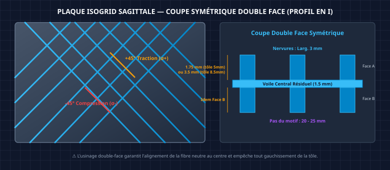
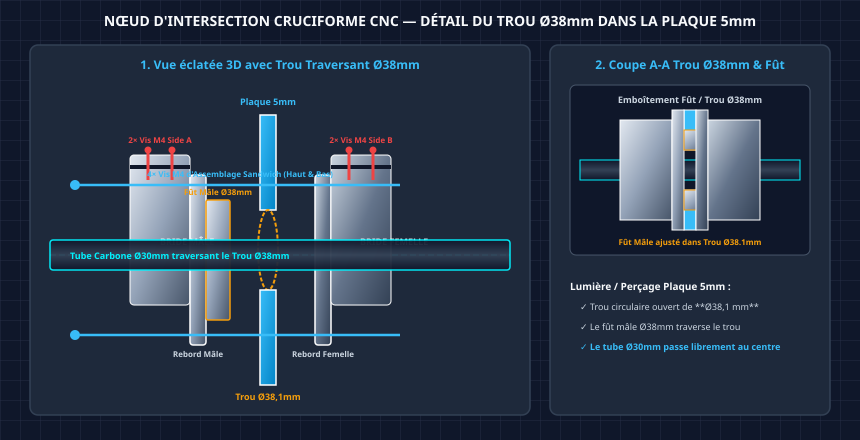

# 🛠️ Guide de Fabrication Hybride : Torse D-Bot (Architecture Cruciforme + FDM PA12-CF + CNC Alu)

*Ce document remplace le [GUIDE_Fabrication_Torse_Asimov_Hybride.md](./GUIDE_Fabrication_Torse_Asimov_Hybride.md) (archivé). Il intègre l'architecture cruciforme interne (plaque isogrid sagittale + traverse carbone), les 2 paniers batterie latéraux avec hot-swap, l'orientation d'impression verticale, et les manchons d'épaule en aluminium.*

> [!NOTE]
> **Évolution architecturale majeure (Mai 2026)** : Le torse passe d'une coque PA12-CF porteuse primaire à une **coque secondaire allégée** habillant un **squelette métallique cruciforme** qui reprend l'intégralité des efforts structurels.

---

## 1. Principe Architectural : Le Squelette Cruciforme Interne

### A. Philosophie de conception

Le torse du D-Bot est basé sur la coque organique de l'Asimov v1 (mise à l'échelle de +18 %), mais son architecture interne est radicalement différente :

| Élément | Ancien design (Asimov pur) | Nouveau design (D-Bot Cruciforme) |
|:---|:---|:---|
| **Structure porteuse** | Coque PA12-CF seule (6 périmètres, 35% infill) | **Squelette alu/carbone cruciforme** |
| **Rôle de la coque** | Primaire (porte tous les efforts) | **Secondaire** (protection, forme, transmission locale) |
| **Colonne vertébrale** | 2 lattes alu latérales (irréalisable) | **1 plaque isogrid sagittale** (dos→ventre, toute la hauteur) |
| **Traverse épaules** | Aucune | **Tube carbone Ø30mm** reliant les 2 brides de liaison d'épaule |
| **Flasques épaules** | Disques plats alu 5mm | **Carter monobloc alu CNC** (flasque arrière + cerclage 360° + ancrage carbone, insertion RS-04 par l'avant) |
| **Batterie** | 1 panier coulissant central | **2 paniers latéraux** (G + D) avec hot-swap |
| **Orientation impression** | Dos au plateau (horizontal) | **Verticale** (debout sur le plan de coupe) |

### B. Schéma de la Structure Cruciforme


*Schéma d'architecture 2D de la structure cruciforme du torse D-Bot : Vue de Face (Plan Frontal avec la traverse carbone Ø30mm, la plaque isogrid sagittale 5mm et les moteurs RS-04/RS-06) et Vue de Dessus (Plan Transversal avec l'orientation sagittal dos->ventre et les 2 paniers batteries latéraux).*


### C. Rigidité comparée

| Sollicitation | Ancien (lattes) | Nouveau (cruciforme) | Gain |
|:---|:---:|:---:|:---:|
| **Flexion Pitch** (avant/arrière) | I ≈ 773 000 mm⁴ | I ≈ 21 700 000 mm⁴ | **×28** |
| **Flexion Roll** (latérale) | Bon | Bon (traverse carbone) | ~×1 |
| **Torsion Yaw** | Très faible | Bon (boîte de torsion fermée + nervures ±45°) | **×5-8** |
| **Compression axiale** | Bon | Excellent | ×2 |

---

## 2. Plaque Isogrid Sagittale (Colonne Vertébrale)

### A. Spécifications

| Paramètre | Valeur |
|:---|:---|
| **Matériau** | Aluminium 6061-T6, tôle de 5 mm |
| **Orientation** | Plan sagittal (dos → ventre), verticale sur toute la hauteur du torse |
| **Dimensions brutes** | ~432 mm (hauteur) × ~200 mm (profondeur sagittale) |
| **Découpage** | En **2 parties** (Haut + Bas) alignées sur le split abdominal du torse |
| **Jonction des 2 parties** | Éclisse boulonnée M4 × 4 vis, chevauchement 30 mm au plan de coupe |
| **Fixation haute & basse** | **Équerres CNC Alu en Sandwich (L-Brackets)** fixées par vis M4 traversantes |
| **Masse estimée** | ~350 g (isogrid, efficacité structurelle ~65%) |
| **Étude de dimensionnement** | 📄 Voir **[ETUDE_Dimensionnement_Colonne_Vertebrale.md](./ETUDE_Dimensionnement_Colonne_Vertebrale.md)** pour le calcul des moments et flèches |

#### Solution de Fixation Haute et Basse (Équerres CNC L-Brackets en Sandwich)


*Principe d'assemblage en sandwich : 2 équerres en L en aluminium 6061-T6 (à gauche et à droite) enserrent la tôle de 5 mm avec 3 à 4 vis traversantes M4. Le rebord horizontal des équerres est vissé sur les plaques circulaires de cou (5 mm) et de taille (6 mm).*

### B. Motif Isogrid Optimisé pour la Torsion (Nervures à ±45°)

> [!IMPORTANT]
> Le motif isogrid classique (triangles équilatéraux, nervures à 0°/60°/−60°) est optimisé pour la compression et la flexion. Pour améliorer **spécifiquement la résistance en torsion Yaw** (sollicitée par le RS-06 de la taille à 36 N.m), le motif doit être adapté :

**Motif recommandé : Nervures diagonales à ±45° (motif losange/diamant)**



*Schéma du motif Isogrid optimisé en losanges à ±45° avec coupe symétrique double-face (profil en I) pour maximiser la rigidité en torsion Yaw sans gauchissement.*

> [!IMPORTANT]
> **Règle d'ingénierie : Usinage Symétrique Double-Face (I-Beam)** :
> L'usinage isogrid doit impérativement être effectué **des deux côtés de la plaque (Face A et Face B)** de manière parfaitement symétrique. 
> - **Pourquoi la symétrie** : Un usinage mono-face décalerait l'axe neutre en flexion et provoquerait un gauchissement (voilage) de la plaque sous les contraintes d'usinage et les charges mécaniques. L'usinage double-face maintient le voile résiduel de 1,5 mm au centre géométrique neutre.
> - **Cotes d'usinage pour tôle brute de 5 mm** : Poches de $1,75\text{ mm}$ sur la Face A + Voile central résiduel de $1,5\text{ mm}$ + Poches de $1,75\text{ mm}$ sur la Face B (total = $1.75 + 1.5 + 1.75 = 5.0\text{ mm}$).
> - **Cotes d'usinage pour tôle brute de 8,5 mm** : Poches de $3,5\text{ mm}$ sur la Face A + Voile central de $1,5\text{ mm}$ + Poches de $3,5\text{ mm}$ sur la Face B (total = $3.5 + 1.5 + 3.5 = 8.5\text{ mm}$).

**Pourquoi ±45° :**
- Les nervures à ±45° sont orientées dans la **direction des contraintes principales de cisaillement** induites par la torsion Yaw
- Elles transforment la contrainte de cisaillement (τ) en traction/compression le long des nervures (σ) → beaucoup plus efficace
- C'est le même principe que les **raidisseurs diagonaux des fuselages d'avion** (stressed-skin aéronautique)
- Gain en rigidité torsionnelle estimé : **×3 à ×5** par rapport à un motif standard 0°/60°/−60°

### C. Fabrication CNC (C500)

| Étape | Détail |
|:---|:---|
| **1. Bridage** | Fixer la tôle brute 6061-T6 sur une table sacrificielle MDF avec des vis traversantes dans les futures zones de perçage (libère toute la course de la C500) |
| **2. Ébauche** | Fraise plate carbure Ø4 mm, 3 passes de 1,2 mm, vitesse 1200 mm/min, avance 0,05 mm/dent |
| **3. Finition poches** | Fraise plate carbure Ø3 mm, 1 passe de 0,3 mm (fond résiduel 1,5 mm), vitesse 800 mm/min |
| **4. Contour extérieur** | Fraise Ø4 mm, découpe du profil sagittal + perçages de fixation M4/M5 |
| **5. Ébavurage** | Lime douce + papier 320 sur les arêtes |
| **Temps estimé** | ~3-4h par demi-plaque (soit ~7h total pour les 2 parties) |

> [!WARNING]
> **Taille de la plaque** : Chaque demi-plaque mesure ~216 × 200 mm. Vérifiez que la course utile de votre C500 permet de couvrir cette surface en une seule prise. Si nécessaire, usinez en 2 phases avec repositionnement (référence par 2 pions de centrage Ø4 mm dans des trous de tooling).

---

## 3. Traverse Horizontale (Liaison Épaules)

### A. Spécifications

| Paramètre | Valeur |
|:---|:---|
| **Matériau** | Tube carbone 3K, époxy, Ø30 mm extérieur, épaisseur 2 mm |
| **Longueur** | ~260 mm (entraxe des cylindres d'épaule) |
| **Masse** | ~70 g |
| **Rigidité torsionnelle** | J ≈ 52 000 mm⁴ (×15 par rapport à une plaque de 5 mm de même largeur) |
| **Fixation aux épaules** | Emmanché dans la bride de liaison alu CNC de chaque côté, serré par 2 vis M4 (pincement) |
| **Fixation à la plaque isogrid** | Traverse le plan sagittal via un **nœud d'intersection** (collier CNC alu) boulonné |

### B. Nœud d'Intersection Plaque/Traverse

Le tube carbone traverse la plaque isogrid sagittale au niveau des épaules. Un **nœud CNC en aluminium** assure la liaison rigide :



*Schéma technique du nœud d'intersection cruciforme CNC symétrique 2 pièces : (1) Vue 3D éclatée montrant la Bride Mâle (fût de centrage Ø38 mm + 2 vis M4 pincement tube), la tôle isogrid 5 mm et la Bride Femelle (alésage d'emboîtement de centrage + 2 vis M4 pincement tube). (2) Vue en coupe A-A détaillant l'emboîtement direct Mâle / Femelle à travers le perçage de la tôle.*

Le nœud cruciforme est composé d'un ensemble **2 pièces en aluminium 6061-T6 usiné CNC (Bride Mâle + Bride Femelle, ~110 g total)** offrant un centrage et un blocage d'une précision et d'une rigidité exceptionnelles :

1. **Bride Mâle (Côté A)** :
   - Présente un rebord d'appui se plaquant contre la Face A de la tôle de 5 mm.
   - Intègre un **fût de centrage mâle (Ø38,0 mm h7)** qui s'insère à travers le trou de Ø38,1 mm de la tôle.
   - Comporte un manchon cylindrique complet qui entoure le tube carbone sur 360° (symétriquement en haut et en bas de l'axe) avec **2 vis CHC M4 de pincement** sur le Côté A.
2. **Bride Femelle (Côté B)** :
   - Présente un rebord d'appui se plaquant contre la Face B de la tôle de 5 mm.
   - Intègre un **alésage de centrage femelle (Ø38,05 mm H7)** qui reçoit directement le bout du fût mâle traversant. Cela garantit un **auto-alignement coaxial direct et isostatique à 100% sans aucun jeu**.
   - Comporte un manchon cylindrique complet qui entoure le tube carbone sur 360° (symétriquement en haut et en bas de l'axe) avec **2 vis CHC M4 de pincement** sur le Côté B.
3. **Double Sandwich & Pincement Symétrique (Total 8 Vis)** :
   - **4 vis traversantes CHC M4** (disposées en haut et en bas des rebords d'appui) relient la Bride Mâle, la tôle de 5 mm (trous lisses Ø4,2 mm) et la Bride Femelle en enserrant la colonne vertébrale en sandwich parfait.
   - **4 vis CHC M4 de pincement au total (2 à gauche, 2 à droite)** serrent le tube carbone Ø30 mm de manière parfaitement équilibrée des deux côtés de la tôle.

### C. Carter Monobloc CNC Alu 6061-T6 (Flasque Arrière + Cerclage Épaule + Ancrage Carbone)

Pour maximiser la rigidité, la dissipation thermique et simplifier la chaîne d'assemblage, l'ensemble d'épaule adopte un **carter monobloc usiné CNC en aluminium 6061-T6**. Il réunit en une seule pièce :
1. **La flasque arrière de liaison (6 mm)** : Sert de bride d'ancrage arrière pour le stator et prend l'appui des 8 vis M5.
2. **Le manchon cylindrique de cerclage (3 mm)** : Entoure le corps du moteur RS-04 sur 360° pour supprimer l'ovalisation et dissiper les calories.
3. **Le socket d'ancrage du tube carbone Ø30 mm** : Reçoit l'extrémité du tube carbone et la goupille d'arrêt vertical.

#### Vue d'ensemble et Séquence d'assemblage (Schéma Conceptuel & Rendu 3D)


*Schéma conceptuel coaxial (de gauche à droite) : ① Vis CHC M5 (×8), ② Ancrage tube carbone Ø30 mm avec goupille Ø3 mm, ③ Carter Monobloc Alu 6061-T6 (Flasque 6 mm + Cerclage 360°), ④ Poche du collet PA12-CF de la coque torse, ⑤ Moteur RobStride RS-04 inséré par l'avant (façade extérieure épaule).*


*Rendu 3D réaliste de l'assemblage d'épaule révisé : le carter monobloc alu CNC 6061-T6 réunit la flasque arrière 6 mm, le socket de réception du tube carbone Ø30 mm et le cerclage 360° ouvert à l'avant pour l'insertion frontale du moteur RS-04.*

#### Vue en coupe — Détail interne


*Coupe longitudinale A-A révisée : le tube carbone (Ø30×26 mm) est renforcé par le **bouchon alu interne** (Ø26 mm ext, Ø18 mm int, 30 mm long) collé à l'époxy. L'ensemble s'insère dans le socket Ø30,05 mm H7 du carter monobloc alu CNC (profondeur 35 mm). La **goupille élastique inox** (Ø3 mm × 35 mm, rouge) traverse perpendiculairement l'axe du tube, à 12 mm du bord d'entrée de la flasque 6 mm.*

#### Orientations des éléments (référentiel)

> [!IMPORTANT]
> **Axes de référence** — Indispensables pour la modélisation Fusion 360 :
>
> | Élément | Orientation | Direction |
> |:---|:---|:---|
> | **Axe du tube carbone** | Horizontal (X) | L'axe principal de l'assemblage |
> | **Goupille élastique Ø3 mm** | **Perpendiculaire au tube** (Z) | Traverse verticalement : paroi bride → paroi tube → bouchon → paroi tube → paroi bride |
> | **Fente de serrage** *(si V2)* | **Axiale** — le long du tube (X) | Court sur toute la longueur du collier, au sommet |
> | **Vis M4 de serrage** *(si V2)* | **Enjambent la fente** perpendiculairement | Compriment les 2 moitiés du collier pour resserrer la fente |

#### Collier fendu : optionnel pour la V1

> [!TIP]
> **Simplification recommandée pour le prototype V1** : La **goupille élastique seule suffit** pour le verrouillage primaire (translation + rotation par obstacle mécanique positif). Le collier fendu + 2 vis M4 est un complément « ceinture et bretelles » qui peut être ajouté en V2 si du jeu ou des vibrations sont constatés.
>
> | Rôle du collier fendu | Impact si supprimé |
> |:---|:---|
> | Élimine les micro-jeux (jeu H7 = 0~25 µm) | Micro-rotations possibles sous vibrations |
> | Friction distribuée 360° → amortissement | Usure par fretting du trou de goupille à long terme |
> | Pression radiale → protège le carbone | Le bouchon de renfort + époxy structurale suffisent |
>
> **En V1** : supprimer la fente et les M4 → le collier devient un simple alésage cylindrique lisse, beaucoup plus simple à usiner CNC.

#### Modes de Fixation (Axial et Rotation)

| Liaison | Fixation Axiale (Translation) | Fixation en Rotation |
|:---|:---|:---|
| **Tube Carbone ↔ Bride alu** | **Obstacle mécanique** : Goupille élastique traversante (Mécanindus) $\varnothing 3\text{ mm}$ travaillant en double cisaillement (perpendiculaire à l'axe du tube) — bloque toute translation axiale de manière positive et définitive. *(V2 optionnel : le collier fendu complète par friction pour éliminer les micro-jeux.)* | **Obstacle mécanique** : La goupille verrouille la rotation de façon positive. *(V2 optionnel : le serrage par pincement du collier fendu élimine tout micro-jeu angulaire.)* Le bouchon de renfort creux empêche l'écrasement du tube. |
| **Bride alu ↔ Stator Moteur** | **Serrage mécanique** via les 8 vis M5 traversant le collet PA12-CF et la bride, plaquant le stator contre le lip du manchon. | **Obstacle mécanique** via les 8 vis CHC M5 dans leurs taraudages borgnes du stator (encastrement rigide). |

#### Spécifications de la goupille et du bouchon de renfort

* **Bouchon interne de renfort :** Manchon cylindrique **creux** (pour optimiser la masse) de $\varnothing 26\text{ mm}$ extérieur (ajustement glissant serré H7/h6) et $\varnothing 16-20\text{ mm}$ intérieur, d'une longueur de $30\text{ mm}$. Usiné en alu 6061-T6 ou imprimé en PA12-CF (100% de remplissage). Il est inséré et collé à l'époxy structurale à l'extrémité du tube. Son rôle est d'empêcher l'écrasement ou la délamination des fibres sous la contrainte de la goupille (et du collier fendu en V2).
* **Perçage transversal :** Le trou de $\varnothing 3\text{ mm}$ pour la goupille est **perpendiculaire à l'axe du tube** (transversal). Il doit être percé à une distance de **$12\text{ mm}$** du bord d'extrémité du tube carbone (règle standard de $3 \times d$ pour éviter la rupture par cisaillement de l'arête du composite). Le perçage traverse successivement : paroi bride alu → paroi tube carbone → bouchon de renfort → paroi tube carbone → paroi bride alu.
* **Goupille élastique :** Goupille de type Mécanindus (fendue en acier trempé) de $\varnothing 3\text{ mm} \times 35\text{ mm}$ (dépassant légèrement de chaque côté de la bride). Résistance au double cisaillement supérieure à $6300\text{ N}$ ($\approx 630\text{ kg}$).

#### Dimensions de la Bride pour Fusion 360


*Dessin coté 4 vues (avant, arrière, coupe B-B, isométrique) avec tolérances — RT-DIM-BL-002.*

| Feature | Dimension | Tolérance | Note |
|:---|:---:|:---:|:---|
| **Alésage tube** | $\varnothing 30{,}05\text{ mm}$ | H7 (+0,025/0) | Ajustement glissant pour tube carbone Ø30 mm |
| **Profondeur alésage** | $35\text{ mm}$ | ±0,5 mm | Pour bouchon (30 mm) + marge |
| **Ø extérieur collier** | $\varnothing 42\text{ mm}$ | — | Épaisseur paroi ~6 mm |
| **Ø plaque flasque** | $\varnothing 90\text{ mm}$ | — | À ajuster selon PCD mesuré du RS-04 |
| **Épaisseur plaque** | $6\text{ mm}$ | — | Face d'appui contre le stator |
| **8× trous M5 passage** | $\varnothing 5{,}3\text{ mm}$ | — | Sur PCD ~70 mm (mesurer sur le RS-04 !) |
| **Perçage goupille** | $\varnothing 3{,}0\text{ mm}$ traversant | H7 | Perpendiculaire à l'axe du tube, à 12 mm du bord |
| **Congé collier→plaque** | $R2\text{ mm}$ | — | Réduction de concentration de contraintes |
| *(V2)* **Fente de serrage** | $1{,}5\text{ mm}$ × longueur collier | — | Axiale (le long du tube), au sommet du collier |
| *(V2)* **2× trous M4 passage** | $\varnothing 4{,}2\text{ mm}$ | — | Enjambent la fente perpendiculairement |

> [!WARNING]
> **Mesure critique avant modélisation** : Le **PCD (diamètre du cercle de boulonnage)** des 8 taraudages borgnes M5 sur la face arrière du stator RS-04 conditionne le Ø de la plaque et la position des perçages. Mesurer au pied à coulisse sur le moteur physique avant de finaliser le modèle.

#### Guide de Modélisation Fusion 360 (6 étapes)


*Étapes de modélisation : (1) Sketch du profil de révolution sur le plan XZ, (2) Revolve 360°, (3) Fente de serrage — Extrude Cut axial *(V2 uniquement)*, (4) Perçages M4 enjambant la fente *(V2 uniquement)*, (5) 8× M5 sur la face stator — Circular Pattern, (6) Perçage goupille Ø3 mm vertical + congés R2 mm.*

**Étapes détaillées :**

1. **Sketch Profil de Révolution** (plan XZ) — Profil en L : rayon int. $15{,}025\text{ mm}$, rayon ext. collier $21\text{ mm}$, hauteur collier $35\text{ mm}$, rayon ext. plaque $45\text{ mm}$, épaisseur plaque $6\text{ mm}$. Axe de révolution = axe X (horizontal).
2. **Revolve 360°** — Résultat : solide étagé (collier $\varnothing 42$ + plaque $\varnothing 90$).
3. *(V2 uniquement)* **Fente de Serrage** — Extrude Cut d'un rectangle $1{,}5\text{ mm} \times$ longueur collier, au sommet, radial vers l'alésage.
4. *(V2 uniquement)* **Perçages M4** — 2× $\varnothing 4{,}2\text{ mm}$ enjambant la fente perpendiculairement (vus de face : positions ~11h et ~1h).
5. **8× M5 — Circular Pattern** — 1 trou $\varnothing 5{,}3\text{ mm}$ sur le PCD → pattern ×8, espacement 45°.
6. **Goupille Ø3 mm + Congés** — Trou $\varnothing 3{,}0\text{ mm}$ traversant, **vertical** (axe Z, perpendiculaire au tube), à $12\text{ mm}$ du bord d'entrée. Congés $R2\text{ mm}$ sur la transition collier→plaque.

---

## 4. Carter Monobloc d'Épaule (Aluminium 6061-T6) et Collet PA12-CF

### A. Concept : Carter alu ouvert à l'avant + Flasque arrière intégrée + Insertion par l'extérieur

> [!IMPORTANT]
> **Révision architecturale majeure (Juillet 2026)** : L'ancien concept d'insertion du moteur par l'intérieur (avec lip avant) est remplacé par une **insertion du moteur par l'extérieur (Front-Loading)** dans un **carter monobloc alu CNC**. Ce design offre 4 avantages majeurs :
> 1. **Maintenabilité optimale** : Le RS-04 se monte et se démonte directement par le flanc du robot sans toucher au reste de l'intérieur du torse.
> 2. **Plaquage 100% métal-métal** : La face arrière du stator plaque directement contre la flasque alu arrière (dissipation thermique et rigidité maximales).
> 3. **Appui de vis 100% métal** : Les 8 vis M5 s'appuient sur la flasque en alu (élimination totale du risque de fluage du PA12-CF).
> 4. **Intégration monobloc** : Le manchon cylindrique 360°, la flasque arrière et l'ancrage du tube carbone sont usinés d'un seul tenant en aluminium 6061-T6.

Chaque logement d'épaule est un sous-assemblage de **3 éléments** :

1. **Carter Monobloc Alu 6061-T6** — carter cylindrique **ouvert à l'avant**, avec **flasque arrière intégrée (6 mm)** et **socket pour tube carbone Ø30 mm**
2. **Collet PA12-CF** — poche cylindrique imprimée dans la coque du torse, enveloppant le carter alu
3. **Résine époxy JB Weld** — film de collage structural entre le carter alu et le collet PA12-CF

Les **câbles du moteur** (puissance XT30 + CAN) sortent par une encoche dans la flasque alu arrière vers l'intérieur du torse.

### B. Le Carter Monobloc Aluminium (Pièce ① — Usiné CNC)

Le carter alu est un **cylindre ouvert à l'avant avec flasque arrière fermée et ancrage carbone** :


> [!CAUTION]
> **OUVERT À L'AVANT.** L'avant du carter reste complètement ouvert pour permettre le glissement et l'extraction du moteur RS-04 depuis l'extérieur de l'épaule.

#### Spécifications du carter monobloc alu

| Paramètre | Valeur |
|:---|:---|
| **Matériau** | Aluminium 6061-T6 (usinage CNC 3 axes ou tournage + fraisage) |
| **Forme** | Carter cylindrique **ouvert à l'avant**, avec **flasque arrière fermée intégrée** |
| **Diamètre extérieur** | Diamètre de la poche collet PA12-CF **−0,2 mm** (tolérance FDM) |
| **Épaisseur de paroi cylindrique** | 3 mm (cerclage 360° anti-ovalisation) |
| **Flasque arrière** | Disque alu de **6 mm** d'épaisseur intégrant 8× trous lisses Ø5,5 mm pour vis M5 et 1× socket Ø30 mm pour tube carbone |
| **Avant** | **Complètement ouvert** — le rotor et la bride de sortie dépassent vers le bras |
| **Trou d'évent** | 1× Ø2 mm dans la paroi cylindrique pour éviter l'effet piston lors du glissement du moteur |
| **Masse unitaire estimée** | ~180 g |

### C. Le Collet PA12-CF (Pièce ② — Intégré à la coque imprimée)

Le collet PA12-CF est directement intégré à la coque du torse (imprimé d'un seul tenant). Il enveloppe le carter monobloc alu :

| Paramètre | Valeur |
|:---|:---|
| **Matériau** | PA12-CF (coque torse, impression FDM) |
| **Forme** | Poche cylindrique traversante |
| **Paroi latérale** | Enveloppe le carter alu sur toute sa hauteur. Interstice ~0,2 mm rempli de **résine époxy JB Weld** |
| **Côté avant** | S'arrête à la limite du carter alu (accès direct au RS-04 par l'extérieur) |
| **Côté arrière** | Laisse l'accès libre à la flasque alu et au trou d'ancrage du tube carbone |
| **Rôle structural** | Transmet les efforts locaux du torse au carter alu et protège l'ensemble |

### D. Chemin de Fixation et Routage Câbles

> [!IMPORTANT]
> **Chemin des vis M5** :
> 
> `Intérieur du torse → tête CHC M5 avec rondelle inox → trou lisse Ø5,5 mm de la Flasque Alu CNC → DIRECTEMENT dans taraudage borgne M5 du stator RS-04`
> 
> **Le vissage est 100% métal-métal.** Les têtes de vis s'appuient sur la flasque rigide en aluminium 6061-T6. Le serrage plaque énergiquement la face arrière du stator contre la flasque alu.

> [!NOTE]
> **Chemin des câbles** :
> 
> `Connecteurs stator (face arrière) → encoche de la flasque alu → intérieur du torse → routage le long de la plaque isogrid → PDB Matek + bus CAN`

### E. Séquence d'Assemblage

```
Étape 1 : Insérer et coller le Carter Monobloc Alu CNC dans le collet PA12-CF (résine époxy JB Weld)
          → Laisser polymériser 24h

Étape 2 : Connecter et goupiller le tube carbone Ø30 mm dans le socket arrière du carter alu
          → Insérer la goupille Ø3 mm verticale

Étape 3 : Insérer le moteur RS-04 par l'AVANT (extérieur de l'épaule)
          → Le moteur glisse dans la paroi 360° du carter alu
          → La face arrière du stator vient en appui direct contre la flasque alu arrière

Étape 4 : Serrer les 8 vis CHC M5 depuis l'intérieur du torse
          → Les vis traversent les trous lisses de la flasque alu et se vissent dans le stator
          → Appliquer de la Loctite 243 sur chaque vis
```

### F. Illustration Technique — Coupe Axiale Révisée


*Coupe axiale révisée montrant le carter monobloc alu CNC (gris) avec sa flasque arrière de 6 mm et son cerclage 360°. Le moteur RS-04 (orange) s'insère **par l'avant (extérieur de l'épaule)**. Les vis CHC M5 (rouge) s'insèrent depuis l'intérieur du torse et traversent la flasque alu pour se visser directement dans le stator.*

### G. Avantages du Carter Monobloc avec Insertion par l'Avant

| Critère | Description |
|:---|:---|
| **Maintenabilité** | ✅ **Remplacement du RS-04 par l'extérieur** sans désosser l'intérieur du torse |
| **Interface de vis** | ✅ **Appui 100% métal-métal** (vis M5 → flasque alu → stator). Zéro fluage plastique |
| **Dissipation thermique** | ✅ Contact 360° latéral + **contact direct face arrière stator contre flasque alu** |
| **Intégration** | ✅ **1 seule pièce monobloc CNC** (flasque arrière + cerclage 360° + ancrage carbone) |
| **Transmission d'efforts** | ✅ Liaison directe et rigide entre le RS-04, la flasque alu et le tube carbone Ø30 mm |
| **Résistance à l'ovalisation** | ✅ Le cerclage 360° alu reprend 100% des contraintes radiale (hoop stress) |

---

## 5. Orientation d'Impression : Verticale (Debout)

### A. Pourquoi l'orientation change

Avec le squelette cruciforme reprenant tous les efforts structurels, la coque PA12-CF n'est plus la structure porteuse primaire. Le risque de délamination inter-couche au niveau des collerettes d'épaule est **compensé** par les manchons alu internes. Cela autorise l'impression **verticale** (le torse debout), ce qui élimine massivement les supports.

### B. Orientation pour chaque demi-torse

**Coque Abdominale (Bas) — Verticale, taille en bas :**


- **Base sur le plateau** : Le plan de coupe (belly) est posé à plat
- **Hauteur Z d'impression** : ~216 mm ✅
- **Collerettes d'épaule** : Se projettent latéralement à environ mi-hauteur → besoin de supports **uniquement sous les collets** (supports arborescents depuis le plateau, hauteur courte ~100 mm au lieu de ~260 mm en orientation horizontale)
- **Dos ouvert** : Pas de surplomb arrière → aucun support nécessaire côté dos

### C. Comparaison des volumes de support

| Zone | Orientation horizontale (ancienne) | Orientation verticale (nouvelle) |
|:---|:---:|:---:|
| **Sous les collerettes** | Supports massifs (piliers de 260 mm de haut) | Supports courts (~100 mm) |
| **Courbes poitrine** | Supports modérés (surplombs organiques) | Quasi nuls (parois verticales auto-supportées) |
| **Dos** | Supports légers | Aucun (ouvert) |
| **Nervures internes** | Supports possibles | Quasi nuls |
| **Volume total estimé** | **~350-500 cm³** | **~80-120 cm³** (÷3 à ÷4) |

> [!TIP]
> **Gain de temps et de matière** : La réduction de 70-80% du volume de supports se traduit par :
> - ~2-4h de temps d'impression en moins
> - ~50-100g de PA12-CF économisé (supports + purge)
> - Retrait des supports beaucoup plus facile (surfaces de contact réduites)
> - État de surface des collerettes amélioré (moins de marques de support)

### D. Impact structural de l'impression verticale

| Critère | Impression horizontale (dos au plateau) | Impression verticale (debout) |
|:---|:---|:---|
| **Collerettes** : cercles continus | ✅ 100% continus (cercles dans le plan XY) | 🟡 Couches coupent le cercle → arcs de ~80% par couche |
| **Résistance collet en hoop stress** | ✅ Excellent (fibres le long du cercle) | 🟡 Moyen (fibres coupent le cercle) |
| **Compensation par manchon alu** | N/A (pas de manchon dans l'ancien design) | ✅ **Le manchon alu reprend 100% du hoop stress** |
| **Résistance axiale du collet** | 🟡 Inter-couche (faible) | ✅ Le long des fibres (fort) |
| **Support nécessaire** | ❌ Massif | ✅ **Minimal** |

> [!IMPORTANT]
> L'impression verticale n'est **viable que parce que les manchons alu internes reprennent les charges** du collet. Sans le squelette cruciforme, cette orientation serait dangereuse. C'est l'architecture cruciforme qui débloque cette orientation avantageuse.

---

## 6. Paramètres de Tranchage (Slicing) — Coque Secondaire PA12-CF

### A. Paramètres Globaux (Zone Courante)

La coque étant désormais secondaire (le squelette porte les efforts), les paramètres d'impression sont **allégés** par rapport à l'ancien guide :

| Catégorie | Paramètre (FR) | Slicer Setting Name (EN) | Slicer Tab / Menu Path (EN) | Recommended Value | Ancien | Description & Note |
| :--- | :--- | :--- | :--- | :---: | :---: | :--- |
| **Printer** | Diamètre de buse | **Nozzle Diameter** | `Printer settings` ➔ `Extruder` ➔ `Nozzle` | `0.4 mm` | 0.4 mm | Type : **Tungsten Carbide** (Carbure de Tungstène) |
| **Quality** | Hauteur de couche | **Layer Height** | `Process` ➔ `Quality` ➔ `Layer Height` | `0.20 mm` | 0.18 mm | Légèrement plus épais pour accélérer l'impression |
| **Quality** | Largeur d'extrusion | **Line Width / Extrusion Width** | `Process` ➔ `Quality` ➔ `Line Width` | `0.48 mm` | 0.48 mm | Inchangé |
| **Strength** | Nombre de parois | **Wall Loops / Perimeters** | `Process` ➔ `Strength` ➔ `Walls` | **`4`** | ~~6~~ | ⚠️ **Réduit de 6 à 4** — coque secondaire (épaisseur 1,92 mm) |
| **Strength** | Couches sup. / inf. | **Top / Bottom Shell Layers** | `Process` ➔ `Strength` ➔ `Shells` | **`4` / `4`** | ~~6/6~~ | ⚠️ **Réduit** |
| **Strength** | Motif de remplissage | **Infill Pattern** | `Process` ➔ `Strength` ➔ `Sparse infill` | `Gyroid` | Gyroid | Inchangé |
| **Strength** | Taux de remplissage | **Infill Density** | `Process` ➔ `Strength` ➔ `Sparse infill` | **`20%`** | ~~35%~~ | ⚠️ **Réduit de 35% à 20%** — le squelette porte les charges |
| **Filament** | Température de buse | **Nozzle Temperature** | `Filament settings` ➔ `Filament` ➔ `Nozzle temperature` | `290°C - 295°C` | 290-295°C | Inchangé |
| **Filament** | Température plateau | **Bed Temperature** | `Filament settings` ➔ `Filament` ➔ `Bed temperature` | `85°C - 90°C` | 85-90°C | Avec colle Magigoo PA ou PVP |
| **Filament** | Chambre chauffée | **Chamber Temperature** | `Filament settings` ➔ `Filament` ➔ `Chamber temperature` | `60°C` | 60°C | Indispensable pour le PA12-CF |
| **Cooling** | Ventilation pièce | **Part Cooling Fan Speed** | `Filament settings` ➔ `Cooling` ➔ `Part cooling fan` | `0%` | 0% | Max 10% pour ponts |
| **Speed** | Vitesse parois ext. | **Outer Wall Speed** | `Process` ➔ `Speed` ➔ `Walls` | `45 - 55 mm/s` | 40-45 | Légèrement augmentée (coque secondaire tolère + d'imperfections) |
| **Speed** | Vitesse parois int. | **Inner Wall Speed** | `Process` ➔ `Speed` ➔ `Walls` | `55 - 65 mm/s` | 50-55 | Idem |
| **Speed** | Vitesse remplissage | **Sparse Infill Speed** | `Process` ➔ `Speed` ➔ `Infill` | `55 - 65 mm/s` | 50-55 | Idem |
| **Support** | Activer supports | **Enable Support** | `Process` ➔ `Support` ➔ `Support` | `Checked (Yes)` | Yes | Type : **Tree (Organic)** |
| **Support** | Support Build Plate Only | **Support on Build Plate Only** | `Process` ➔ `Support` ➔ `Support` | `Checked (Yes)` | Yes | Aucun support interne |
| **Support** | Angle seuil | **Support Threshold Angle** | `Process` ➔ `Support` ➔ `Support` | `55° - 60°` | 55-60° | Le PA12-CF ponte bien jusqu'à 55° |
| **Support** | Z-Distance sup. | **Support Top Z Distance** | `Process` ➔ `Support` ➔ `Support` | `0.30 - 0.40 mm` | 0.28-0.36 | Augmenté pour faciliter le retrait |
| **Travel** | Saut en Z | **Z-hop when Retracting** | `Printer settings` ➔ `Extruder` ➔ `Retraction` | `0.4 mm` | 0.4 mm | Normal ou Slope |
| **Others** | Couche variable | **Adaptive Layer Height** | `Top Toolbar` ➔ `Variable Layer Height (Icon)` | `Disabled` | Disabled | Inchangé |

### B. Zone d'Épaule : Modifier Volume (Renforcement Local)

> [!CAUTION]
> **Les collerettes d'épaules restent à paramètres MAXIMAUX.** Même avec les manchons alu, la coque PA12-CF doit résister localement au serrage radial du RS-04 et transmettre les efforts au manchon. Il faut créer un **Modifier Volume** dans le slicer pour surcharger les paramètres dans cette zone.

#### Procédure détaillée OrcaSlicer / Qidi Print (en anglais, pas à pas) :

**Étape 1 — Importer et positionner le modèle**
1. Ouvrez **OrcaSlicer** (ou Qidi Print)
2. Importez le fichier STL du Thorax (demi-torse haut)
3. Positionnez-le verticalement (plan de coupe au belly → sur le plateau)

**Étape 2 — Ajouter un Modifier Volume cylindrique**
1. **Clic droit** sur le modèle dans la vue 3D (ou dans le panneau de gauche sur le nom de l'objet)
2. Sélectionnez **`Add Modifier`** → **`Cylinder`**
3. Un cylindre transparent apparaît dans la scène

**Étape 3 — Dimensionner et positionner le Modifier**
1. **Sélectionnez** le cylindre modifier (clic gauche dessus)
2. Dans le panneau de droite, sous **`Object Manipulation`**, ajustez :
   - **`Size X`** : Diamètre du collet d'épaule + 30 mm de marge (ex: si collet = 90 mm → taper `120`)
   - **`Size Y`** : Identique à X (`120`)
   - **`Size Z`** : `80` mm (hauteur de la zone renforcée)
3. **Positionnez** le cylindre exactement sur le logement de l'épaule :
   - Utilisez **`Move`** (touche `M`) pour déplacer le cylindre modifier
   - Centrez-le sur le collet d'épaule visible dans le modèle
   - Ajustez visuellement en vue de face, de côté et de dessus
4. **Répétez** pour l'épaule opposée (Clic droit → `Add Modifier` → `Cylinder` → positionner)

**Étape 4 — Configurer les paramètres du Modifier**
1. **Clic droit** sur le cylindre modifier (dans le panneau de gauche ou dans la vue 3D)
2. Sélectionnez **`Edit modifier settings`** (ou **`Change type`** → `Advanced`)
3. Cochez et configurez les paramètres suivants :
   - ☑️ **`Wall loops`** → valeur : **`6`** (au lieu de 4 global)
   - ☑️ **`Sparse infill density`** → valeur : **`35%`** (au lieu de 20% global)
   - ☑️ **`Top shell layers`** → valeur : **`6`**
   - ☑️ **`Bottom shell layers`** → valeur : **`6`**
4. Cliquez **`OK`** / **`Apply`**

**Étape 5 — Vérifier visuellement**
1. Cliquez sur **`Slice`** (bouton en bas à droite)
2. Utilisez le **curseur de couches** (barre verticale à droite) pour naviguer couche par couche
3. Vérifiez que dans la zone du cylindre modifier :
   - Les parois sont plus épaisses (6 boucles au lieu de 4)
   - Le remplissage est plus dense (35% au lieu de 20%)
   - La transition entre la zone renforcée et la zone allégée est progressive
4. Si le positionnement est incorrect, annulez le slice, ajustez le modifier et re-slicez

### C. Paramètres de Tranchage pour Prototype PLA

Pour valider l'ajustement mécanique avant de lancer l'impression PA12-CF, imprimer un prototype en PLA avec les paramètres accélérés suivants :

| Catégorie | Slicer Setting (EN) | Valeur PLA | Note |
| :--- | :--- | :---: | :--- |
| **Quality** | **Layer Height** | `0.28 mm` | Mode draft rapide |
| **Strength** | **Wall Loops** | `3` | Suffisant pour test d'ajustement |
| **Strength** | **Infill Density** | `10% - 15%` | Remplissage léger |
| **Strength** | **Infill Pattern** | `Grid` | Plus rapide que Gyroid en PLA |
| **Filament** | **Nozzle Temperature** | `210°C - 220°C` | Standard PLA |
| **Filament** | **Bed Temperature** | `55°C - 60°C` | Standard PLA |
| **Filament** | **Chamber Temperature** | **`0°C (OFF)`** | ⚠️ **Éteindre le chauffage + ouvrir le capot** (heat creep) |
| **Cooling** | **Part Cooling Fan** | **`100%`** | Maximum pour PLA |
| **Speed** | **Outer Wall Speed** | `100 - 120 mm/s` | Vitesse CoreXY |
| **Speed** | **Sparse Infill Speed** | `200 - 250 mm/s` | Gain de temps massif |
| **Support** | **Enable Support** | `Yes, Tree` | Se détachent facilement en PLA |

### D. Conditionnement du Filament PA12-CF

> [!WARNING]
> **Le PA12 (Nylon) est extrêmement hydrophile.** Si le filament absorbe de l'humidité, les couches crépitent, la pièce devient cassante et les efforts inter-couches s'effondrent. C'est le **facteur n°1 d'échec** d'impression en PA12-CF.

1. **Séchage initial** : Sécher la bobine au four ou dans un sécheur actif à **90°C pendant 6 à 8 heures** avant de lancer l'impression
2. **Impression sous atmosphère contrôlée** : Imprimer impérativement à partir d'une **boîte sèche hermétique** (*Drybox*) reliée directement à l'imprimante, maintenant un taux d'humidité **inférieur à 10%**
3. **Stockage** : Après impression, remettre immédiatement la bobine dans un sac sous vide avec sachets de gel de silice

---

## 7. Split Abdominal Rigide et Emboîtement (Lap Joint)

Le torse est divisé horizontalement au niveau du ventre pour l'impression. L'assemblage des deux moitiés reste **100 % rigide** grâce à l'emboîtement et au squelette cruciforme traversant :

### A. Lèvre d'Emboîtement (Lap Joint de 3 mm)

La procédure de modélisation du Lap Joint sous Fusion 360 reste identique à celle documentée dans le guide archivé (Section 5.A) :

1. **Bandeau de renfort interne** : Épaissir la coque de 3 mm supplémentaires sur une bande de ±8 mm autour du plan de coupe → épaisseur locale de 4,92 mm (4 périmètres + renfort)
2. **Split Body** : Scinder le torse au plan de coupe abdominal
3. **Lèvre mâle** : Extrusion de +3 mm sur la coque abdominale (bas)
4. **Rainure femelle** : Combine/Cut sur le Thorax (haut)
5. **Tolérances** : Press Pull −0,15 mm radial et −0,10 mm axial sur la rainure femelle

### B. Bossages de Vissage Internes (M4)

- **4 à 6 bossages** (Ø12 mm) répartis le long de la circonférence intérieure
- *Côté Thorax* : Passage lisse Ø4,2 mm lamé pour tête de vis M4
- *Côté Abdomen* : Logement Ø5,8 mm × 9 mm pour insert laiton M4 posé à chaud
- **Éviter** de placer les bossages là où ils interféreraient avec les paniers batterie ou la plaque isogrid

### C. Jonction avec le Squelette Cruciforme

La plaque isogrid sagittale (en 2 parties) se joint **au même niveau** que le split abdominal :
- Les 2 demi-plaques se chevauchent sur 30 mm (éclisse) et se boulonnent par 4 vis M4
- La vis de l'éclisse traverse le plan de coupe → **renforcement supplémentaire** du joint abdominal
- Le squelette rigide + le Lap Joint + les bossages = **triple verrouillage** du plan de coupe

---

## 8. Système de Batteries : 2 Paniers Latéraux avec Hot-Swap

### A. Architecture des Paniers

Le panier unique Asimov (`ASV1_100_10C`) est remplacé par **2 paniers latéraux symétriques**, coulissant depuis le dos (ouvert) vers le ventre :


### B. Système de Coulisses

| Élément | Description |
|:---|:---|
| **Coulisses latérales (existantes)** | Le design Asimov v1 possède déjà des rails de guidage gauche et droite dans la coque PA12-CF → **réutilisés tels quels** (modulo scale +18%) |
| **Coulisses centrales (ajoutées)** | 2 petites coulisses supplémentaires fixées de chaque côté de la plaque isogrid sagittale (1 par face). Usinées dans un profilé alu en L de 10×10×1,5 mm ou imprimées en PA12-CF et collées sur la plaque |
| **Bandes PTFE** | Coller des bandes autocollantes PTFE (0,2 mm d'épaisseur) sur les faces de la plaque isogrid au niveau du passage des paniers → glissement silencieux et sans usure |
| **Jeu latéral** | 1,0 mm entre la paroi du panier et la face de la plaque isogrid de chaque côté |

### C. Verrouillage des Paniers

| Solution | Description | Complexité | Recommandation |
|:---|:---|:---:|:---:|
| **Loquet quart-de-tour (Dzus)** | 1 par panier, accessible depuis l'arrière. Rotation 90° pour verrouiller | ⭐⭐ | ✅ Recommandé |
| **Clips à ressort PA12-CF** | Intégrés dans les rails de la coque, s'enclenchent automatiquement | ⭐⭐⭐ | 🟡 Alternative |
| **Vis papillon M4** | Simple mais lent (outil nécessaire ou serrage à la main) | ⭐ | ❌ Trop lent pour hot-swap |

### D. Spécifications des 2 Batteries

| Paramètre | Batterie unique (ancienne) | 2 Batteries (nouvelle) |
|:---|:---:|:---:|
| **Configuration** | 1× 12S NMC 48V 10Ah | **2× 12S NMC 48V 5Ah** (ou 2× 6Ah) |
| **Énergie totale** | 480 Wh | 480 Wh (2×5Ah) ou **576 Wh** (2×6Ah, +20%) |
| **Tension nominale** | 44,4V | 44,4V (parallèle via diodes ORing) |
| **Masse** | 2,3 kg | ~2,5 kg (+200g pour 2 BMS + câblage + diodes) |
| **Dimensions unitaires** | ~220×100×65 mm | ~220×**50**×65 mm chacune |
| **Hot-swap** | ❌ | ✅ |
| **CdG symétrique** | 🟡 (dépend du placement) | ✅ Parfaitement centré en X |

### E. Circuit Électrique de Hot-Swap (Diode ORing Détaillé)

#### E.1 Principe de fonctionnement

Le hot-swap permet d'**échanger une batterie sans couper l'alimentation du robot**. Le circuit utilise des **diodes ORing** : chaque batterie alimente le bus principal via sa propre diode. Quand une batterie est retirée, l'autre prend instantanément le relais sans coupure ni transitoire dangereux.


#### E.2 Sélection des composants

| Composant | Référence | Spécifications | Prix unitaire | Quantité |
|:---|:---|:---|:---:|:---:|
| **Diode Schottky** | **MBR4060PT** (ON Semi) | 40A, 60V, V_forward=0.45V, boîtier TO-247 | ~3€ | 2 |
| **BMS 12S** | BMS générique 12S 20A | Protection surcharge/décharge/court-circuit | ~15€ | 2 |
| **Connecteur panier** | **XT60** mâle/femelle | 60A max, détrompé, soudé sur câble 10AWG | ~2€ | 4 (2 paires) |
| **Fusible PTC** | Resettable 40A | Protection du bus principal | ~5€ | 1 |
| **Dissipateur thermique** | Radiateur TO-247 alu | Vissé sur la plaque isogrid ou la waist plate | ~2€ | 2 |
| **LED de statut** | LED bicolore (vert/rouge) | Indicateur visuel de présence batterie + charge | ~1€ | 2 |
| **TOTAL** | | | **~48€** | |

#### E.3 Fonctionnement détaillé

| Situation | Batterie G | Batterie D | Comportement du bus |
|:---|:---:|:---:|:---|
| **Normal** (2 batteries) | ✅ Connectée | ✅ Connectée | La batterie avec la tension la plus haute alimente le bus. L'autre est en standby (diode bloquée car V_G < V_D + V_forward ou vice-versa). En pratique les 2 partagent la charge si leurs tensions sont proches. |
| **Hot-swap** (retrait G) | ❌ Retirée | ✅ Connectée | D2 conduit instantanément. Transitoire : ~0.5 ms (temps de commutation diode). Le bus ne voit qu'une micro-chute de 0.45V → **aucun reset des contrôleurs**. |
| **1 seule batterie** | ❌ Absente | ✅ Connectée | D2 conduit en permanence. Autonomie divisée par 2, mais le robot fonctionne normalement. |
| **Rechargement en place** | 🔌 En charge | ✅ Alimente | Le chargeur externe se branche sur le connecteur XT60 de la batterie G via le panier. La diode D1 empêche le courant de retour vers le bus. |

#### E.4 Option avancée : MOSFET Ideal Diode (Pour minimiser les pertes)

La diode Schottky MBR4060PT dissipe **P = I × V_forward = 20A × 0.45V = 9W** en fonctionnement normal. C'est significatif. Pour réduire cette perte à **<0.5W**, remplacer chaque diode par un **contrôleur de diode idéale MOSFET** :

| Composant | Référence | V_drop | Pertes à 20A | Prix |
|:---|:---|:---:|:---:|:---:|
| Diode Schottky (baseline) | MBR4060PT | 0.45V | **9W** | 3€ |
| **MOSFET Ideal Diode** | **LTC4357** + MOSFET N-CH 60V | **0.020V** | **0.4W** | ~15€ |

> [!TIP]
> Pour la V1, les **diodes Schottky** suffisent. Le 9W de perte est facilement dissipé par un petit radiateur vissé sur la plaque isogrid (l'aluminium est un excellent conducteur thermique). Passer au MOSFET Ideal Diode en **V2** si l'autonomie devient critique.

#### E.5 Montage physique

- Les 2 diodes Schottky (ou modules MOSFET) sont montées sur des **radiateurs alu TO-247** vissés directement **sur la plaque isogrid** (face intérieure)
- Les connecteurs **XT60** sont fixés à l'arrière de chaque panier batterie → branchement/débranchement en coulissant le panier
- Les câbles d'alimentation (10 AWG silicone) cheminent le long de la plaque isogrid vers la PDB Matek située dans le torse

---

## 9. Plaques Structurelles Horizontales (Heritage Asimov v1)

### A. Plaque Supérieure (Cou)

| Paramètre | Valeur |
|:---|:---|
| **Matériau** | Aluminium 6061-T6 |
| **Épaisseur** | 5 mm |
| **Origine** | BOM Asimov v1 (scale +18%) |
| **Rôle** | Fondation pour le collet du cou + ancrage haut de la plaque isogrid + ancrage haut du tube carbone (via nœud) |
| **Usinage** | CNC C500, perçages M4/M5 pour fixation squelette + collet cou RS-05 |

### B. Plaque Inférieure (Waist Plate)

| Paramètre | Valeur |
|:---|:---|
| **Matériau** | Aluminium 6061-T6 |
| **Épaisseur** | 6 mm |
| **Origine** | BOM Asimov v1 (scale +18%) |
| **Rôle** | Fermeture du bas du torse rigide + ancrage bas de la plaque isogrid + interface de liaison avec le roulement de grand diamètre du module Waist Yaw actif |
| **Usinage** | CNC C500, profil extérieur + alésage central pour axe RS-06 |

---

## 10. Liaison Active Waist Yaw (RobStride RS-06)

La rotation en lacet de la taille est assurée par le module Waist d'Asimov v1 (scale +18%), adapté pour le moteur **RobStride RS-06** :

| Paramètre | Valeur |
|:---|:---|
| **Moteur** | RobStride RS-06 (36 N.m pic / 11 N.m nom., Ø88 mm, 621 g) |
| **ID CAN-FD** | 21 |
| **Logement Asimov v1** | Conçu pour Cubemars AK80 (Ø98 mm) → Ø115,6 mm après scale +18% |
| **Bague d'adaptation CNC** | Ø int. 88 mm / Ø ext. 115,6 mm → épaisseur radiale 13,8 mm, alu 6061-T6 |
| **Roulement** | Section fine Ø110 mm (scale +18%), billes à 4 points de contact |
| **Accouplement** | Stator fixé au pelvis inférieur / Rotor accouplé au centre de la Waist Plate du torse rigide |

---

## 11. Workflow de Fabrication Révisé (Plan d'Action)

### Phase 1 — Conception CAO (Fusion 360)

1. ☐ Mettre à l'échelle (+18%) les fichiers originaux du torse et de la taille Asimov v1
2. ☐ Modéliser la **plaque isogrid sagittale** (motif ±45°) en 2 parties avec éclisse de jonction
3. ☐ Modéliser les **2 manchons d'épaule** (paroi 3 mm, ouverts à l'arrière, avec lip avant) et les **2 brides de liaison**
4. ☐ Modéliser le **nœud d'intersection** plaque/traverse (bloc CNC alu)
5. ☐ Dessiner les **2 paniers batterie** latéraux + coulisses centrales sur la plaque isogrid
6. ☐ Réaliser le **split rigide abdominal** avec bandeau de renfort, Lap Joint de 3 mm et tolérances
7. ☐ Modéliser la **bague d'adaptation CNC** pour le RS-06 (13,8 mm d'épaisseur radiale)
8. ☐ Vérifier les **dégagements internes** (paniers + squelette + câblage)

### Phase 2 — Usinage CNC (C500)

1. ☐ Usiner les 2 demi-plaques isogrid sagittales (alu 6061-T6, 5 mm)
2. ☐ Usiner les 2 manchons d'épaule (ouverts à l'arrière, lip avant) et les 2 brides de liaison (alu 6061-T6)
3. ☐ Usiner le nœud d'intersection plaque/traverse (bloc alu 6061-T6)
4. ☐ Usiner la plaque supérieure de cou (alu 6061-T6, 5 mm) — scale +18% d'Asimov v1
5. ☐ Usiner la Waist Plate (alu 6061-T6, 6 mm) — scale +18% d'Asimov v1
6. ☐ Usiner la bague d'adaptation RS-06 (alu 6061-T6)
7. ☐ Couper le tube carbone Ø30 mm à ~260 mm, usiner les 2 bouchons internes de renfort, et chanfreiner les extrémités

### Phase 3 — Impression 3D (Qidi Plus 4)

1. ☐ **Prototype PLA** : Imprimer les 2 demi-coques verticalement en PLA (paramètres § 6.C) → valider les ajustements
2. ☐ **Version finale PA12-CF** : Imprimer les 2 demi-coques verticalement (paramètres § 6.A + Modifier Volume épaules § 6.B)
   - Coque abdominale : taille en bas sur le plateau, ~216 mm de Z
   - Thorax : plan de coupe en bas, cou en haut, ~216 mm de Z
3. ☐ Configurer le **Modifier Volume** cylindrique autour de chaque collet d'épaule (6 périmètres, 35% infill)
4. ☐ Supports arborescents (**Tree**) uniquement sous les collerettes d'épaule du Thorax, **Build Plate Only**

### Phase 4 — Assemblage du Torse Rigide

1. ☐ Poser les inserts filetés M4 en laiton (Ruthex) dans les coques PA12-CF au fer à souder (260°C)
2. ☐ Insérer les **manchons alu d'épaule** dans les collets PA12-CF (avec film de résine époxy JB Weld pour rattrapage de jeu)
3. ☐ Assembler les 2 demi-plaques isogrid sagittales avec l'éclisse M4 (4 vis)
4. ☐ Insérer le tube carbone Ø30mm avec ses bouchons de renfort collés dans le nœud d'intersection (4 vis M4) et dans les brides de liaison de chaque côté (2 vis M4 + goupilles élastiques Ø3mm traversantes)
5. ☐ Fixer la plaque isogrid au nœud et aux brides de liaison
6. ☐ Fixer la plaque de cou (haut) et la Waist Plate (bas) sur les extrémités de la plaque isogrid
7. ☐ Assembler le Thorax et l'Abdomen via le Lap Joint + vis M4 des bossages internes
8. ☐ Insérer les moteurs RS-04 dans les manchons alu par l'arrière, serrer les vis CHC M5 depuis l'intérieur du torse (vis → rebord PA12-CF → bride alu → taraudages stator). Router les câbles XT30/CAN par les encoches vers l'intérieur du torse.
9. ☐ Appliquer de la **Loctite 243** sur toutes les vis métalliques

### Phase 5 — Assemblage Batteries + Hot-Swap

1. ☐ Monter les diodes Schottky MBR4060PT sur les radiateurs TO-247
2. ☐ Visser les radiateurs sur la plaque isogrid (face interne)
3. ☐ Câbler les connecteurs XT60 à l'arrière de chaque panier
4. ☐ Câbler le bus principal (sortie diodes → fusible PTC 40A → PDB Matek)
5. ☐ Installer les 2 paniers batterie dans les coulisses (test de coulissement + verrouillage)
6. ☐ Tester le hot-swap : alimenter avec les 2 batteries → retirer une → vérifier que le bus ne coupe pas

### Phase 6 — Assemblage de la Liaison Waist Yaw

1. ☐ Monter la bague d'adaptation alu CNC sur le corps du RS-06
2. ☐ Encastrer le moteur dans le pelvis inférieur
3. ☐ Poser le roulement à section fine Ø110 mm sous la Waist Plate
4. ☐ Accoupler le rotor du RS-06 au centre de la Waist Plate
5. ☐ Câbler le bus CAN-FD (ID 21) et la puissance 48V vers la PDB

---

## 12. Questions Ouvertes (À Résoudre)

1. **Dimensions internes réelles** : Quelle est la largeur interne utile entre les parois du torse (à mi-hauteur) dans le CAD après scale +18% ? Conditionne la largeur maximale des paniers.

2. **Batteries** : Source pour des packs 12S étroits (~50 mm) ? Ou assemblage custom à partir de cellules 21700 ?

3. **Traverse d'épaule** : Tube carbone Ø30 mm (léger, rigide, isolant thermique) ou barre isogrid alu (conductrice thermique, plus lourde) ?

4. **Profondeur du manchon alu d'épaule** : Confirmer la hauteur utile du manchon (30 mm recommandé, collet total = 68,44 mm après scale).

5. **Circuit hot-swap** : Diodes Schottky (V1, simple, 9W de pertes) ou MOSFET Ideal Diode (V2, <0.5W, plus complexe) ?

---

*Document créé en Mai 2026 — Architecture Cruciforme D-Bot v1.0. Remplace le GUIDE_Fabrication_Torse_Asimov_Hybride.md (archivé).*
