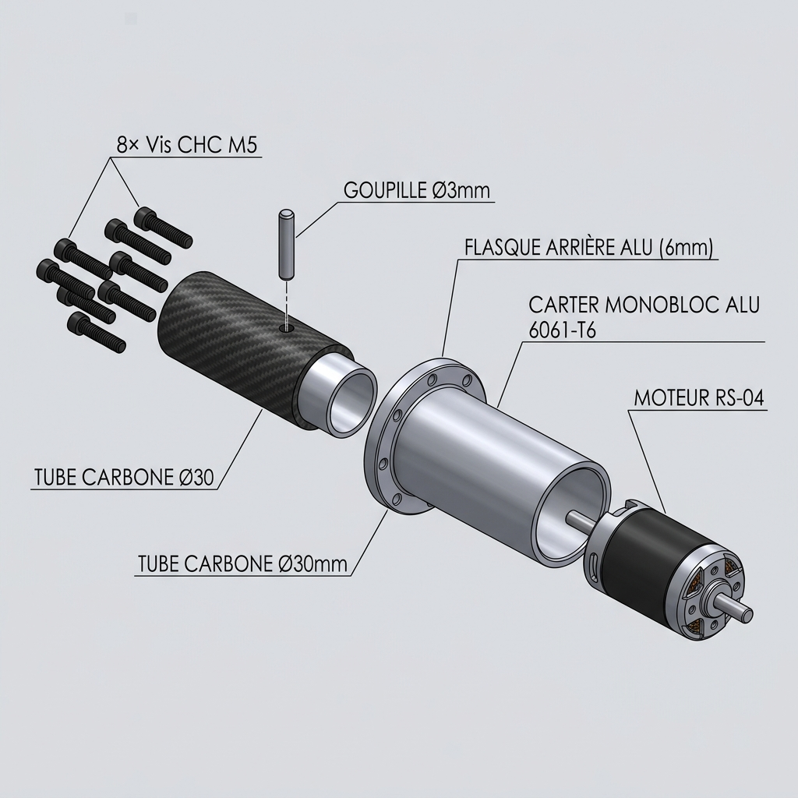

# 🛠️ Guide de Fabrication Hybride : Torse D-Bot (Architecture Cruciforme + FDM PA12-CF + CNC Alu)

*Ce document remplace le [GUIDE_Fabrication_Torse_Asimov_Hybride.md](./00_Archives_Recherche/GUIDE_Fabrication_Torse_Asimov_Hybride.md) (archivé). Il intègre l'architecture cruciforme interne (plaque isogrid sagittale + traverse carbone), les 2 paniers batterie latéraux avec hot-swap, l'orientation d'impression verticale, et les manchons d'épaule en aluminium.*

> [!NOTE]
> **Évolution architecturale majeure (Mai 2026)** : Le torse passe d'une coque PA12-CF porteuse primaire à une **coque secondaire allégée** habillant un **squelette métallique cruciforme** qui reprend l'intégralité des efforts structurels.

---

## 1. Principe Architectural : Le Squelette Cruciforme Interne

### A. Philosophie de conception

Le torse du D-Bot est basé sur la coque organique de l'Asimov v1 (mise à l'échelle de +18 %), mais son architecture interne est radicalement différente :

| Élément | Ancien design (Asimov pur) | Nouveau design (D-Bot Cruciforme) |
|:---|:---|:---|
| **Structure porteuse** | Coque PA12-CF seule (6 périmètres, 35% infill) | **Squelette alu/carbone/acier cruciforme** |
| **Rôle de la coque** | Primaire (porte tous les efforts) | **Secondaire** (protection, forme, transmission locale) |
| **Colonne vertébrale** | 2 lattes alu latérales (irréalisable) | **1 plaque isogrid sagittale** (dos→ventre, toute la hauteur) |
| **Traverse épaules** | Aucune | **Tube carbone Ø30mm** reliant les 2 brides de liaison d'épaule |
| **Flasques épaules** | Disques plats alu 5mm | **Carter monobloc acier E470 CNC** (Plan 2D *Support RS-04* : Ø124mm, alésage Ø120.2mm H7, paroi 1.9mm, fond 4mm évidé Ø97mm, insertion par l'extérieur) |
| **Batterie** | 1 panier coulissant central | **2 paniers latéraux** (G + D) avec hot-swap |
| **Orientation impression** | Dos au plateau (horizontal) | **Verticale** (debout sur le plan de coupe) |

### B. Schéma de la Structure Cruciforme


*Schéma d'architecture 2D de la structure cruciforme du torse D-Bot : Vue de Face (Plan Frontal avec la traverse carbone Ø30mm, la plaque isogrid sagittale 5mm et les moteurs RS-04/RS-06) et Vue de Dessus (Plan Transversal avec l'orientation sagittal dos->ventre et les 2 paniers batteries latéraux).*


### C. Rigidité comparée

| Sollicitation | Ancien (lattes) | Nouveau (cruciforme) | Gain |
|:---|:---:|:---:|:---:|
| **Flexion Pitch** (avant/arrière) | I ≈ 773 000 mm⁴ | I ≈ 21 700 000 mm⁴ | **×28** |
| **Flexion Roll** (latérale) | Bon | Bon (traverse carbone) | ~×1 |
| **Torsion Yaw** | Très faible | Bon (boîte de torsion fermée + nervures ±45°) | **×5-8** |
| **Compression axiale** | Bon | Excellent | ×2 |

---

## 2. Plaques de Colonne Vertébrale — Conception Option B (Lumières 2D Traversantes)

### A. Spécifications Générales

| Paramètre | Valeur |
|:---|:---|
| **Matériau** | Aluminium 6061-T6, tôle de 5,0 mm |
| **Orientation** | Plan sagittal (dos → ventre), verticale sur toute la hauteur du torse |
| **Conception retenue** | **Option B (Lumières 2D Traversantes ⭐)** : Évidements 100% débouchants en 1 seule passe |
| **Dimensions brutes** | ~432 mm (hauteur totale) × **120,0 mm (profondeur max d'usinage C500)** |
| **Découpage** | En **2 parties** (Haute 142,67 mm + Basse 290,0 mm) jointes au Nœud Central d'épaule (h = 290 mm) |
| **Jonction des 2 parties** | **Nœud Demi-Coquilles CNC Alu** + Tube Carbone Ø30 mm + Goupille Verticale Z (60 mm) |
| **Fixation haute & basse** | **Équerres CNC Alu en Sandwich (L-Brackets)** fixées par vis M4 traversantes |
| **Masse totale 2 plaques** | **~355 g** (vs 668 g pleine — **économie de 313 g / -47%**) |
| **Étude de dimensionnement** | 📄 Voir **[ETUDE_Dimensionnement_Colonne_Vertebrale.md](./ETUDE_Dimensionnement_Colonne_Vertebrale.md)** pour le calcul des moments et flèches |

#### Solution de Fixation Haute et Basse (Équerres CNC L-Brackets en Sandwich)


*Principe d'assemblage en sandwich : 2 équerres en L en aluminium 6061-T6 (à gauche et à droite) enserrent la tôle de 5 mm avec 3 à 4 vis traversantes M4. Le rebord horizontal des équerres est vissé sur les plaques circulaires de cou (5 mm) et de taille (6 mm).*

---

### B. Justification & Comparatif des Formes d'Évidements


> [!IMPORTANT]
> **Décision d'Architecture (Août 2026) : Adoption de l'Option B (Lumières 2D Traversantes)**
> La solution d'évidement 2D traversant est retenue comme le choix optimal pour le torse D-Bot par rapport à l'Isogrid (Option C) :
> 1. **Solidité supérieure** : Propose un facteur de sécurité **$S_f = \times 9,21$** sous choc dynamique de 220 Nm à la base ($\sigma_{\text{max}} = 26,05\text{ MPa}$), très supérieur à l'Isogrid ($S_f = \times 5,70$).
> 2. **Gain de poids massif (-47%)** : Économise 313 g sur la colonne (masse totale = 355 g contre 668 g en plaque pleine).
> 3. **Fiabilité d'Usinage C500** : Découpée en **une seule passe 2D débouchante** en 15 minutes total. Risque de voilement ("bananage" alu) NUL et aucun retournement de pièce requis (pas de Flip Z).


---

### C. Fabrication CNC sur NestWorks C500

| Étape | Détail |
|:---|:---|
| **1. Bridage** | Fixer la tôle brute 6061-T6 de 5,0 mm à plat sur la table C500 (sur martyre MDF) |
| **2. Outil** | Fraise carbure Ø6 mm DLC (O-Type 1 dent) |
| **3. Paramètres de coupe** | Vitesse 10 000 tr/min, avance 800 mm/min, passes de Z = -1,25 mm (4 passes) |
| **4. Lumières 2D** | Découpe 100% débouchante à Z = -5,2 mm en une passe continue |
| **5. Contour & Perçages** | Découpe du profil sagittal + trous M4 de fixation |
| **Temps estimé** | **~15 minutes au total pour les 2 plaques** (vs 3-4h pour Isogrid) |

---

---

## 3. Traverse Horizontale (Liaison Épaules)

### A. Spécifications

> [!IMPORTANT]
> **Orientation du tube — Point fondamental** : Le tube carbone est un élément **transversal** (axe X, gauche ↔ droite). Il passe **perpendiculairement au plan sagittal** formé par les plaques de colonne vertébrale. Les plaques (Colonne Supérieure et Inférieure) sont dans le plan Y-Z (dos ↔ ventre, vertical). Le tube carbone **ne traverse pas** les plaques : il passe dans le joint entre la Colonne Supérieure et la Colonne Inférieure, au niveau de l'axe des épaules (h = 290 mm). Seules les **brides demi-coquilles** possèdent un demi-alésage Ø30 mm.

| Paramètre | Valeur |
|:---|:---|
| **Matériau** | Tube carbone 3K, époxy, Ø30 mm extérieur, épaisseur 2 mm |
| **Longueur** | ~260 mm (entraxe des carters d'épaule) |
| **Axe** | **Transversal (X)**, perpendiculaire au plan sagittal des plaques |
| **Masse** | ~70 g |
| **Rigidité torsionnelle** | J ≈ 52 000 mm⁴ (×15 par rapport à une plaque de 5 mm de même largeur) |
| **Fixation aux épaules** | Emmanché dans le socket du carter monobloc alu CNC de chaque côté, goupille Ø4 mm + bouchon de renfort |
| **Fixation centrale (nœud)** | **2 demi-coquilles CNC alu** (Bride Sup. + Bride Inf.) serrant le tube sur 45 mm de longueur, boulonnées aux plaques |

### B. Nœud d'Intersection Plaque/Traverse — Système Demi-Coquilles

> [!IMPORTANT]
> **Évolution architecturale (Juillet 2026)** : La "Grande Bride Sagittale Longue" monobloc est remplacée par un système de **deux demi-coquilles distinctes** (Bride Supérieure + Bride Inférieure), inspiré du principe du chapeau de bielle / split clamp block. Ce design est mécaniquement supérieur (distribution d'effort ×6, pas de taraudage dans les brides, assemblage sans outil spécialisé).


*Vue en coupe frontale (plan sagittal Y-Z) et vue de dessus (plan transversal X-Y) du nœud d'intersection. Le tube carbone Ø30 mm est transversal (axe X), il sort perpendiculairement au plan des plaques. La Bride Supérieure s'appuie sur la face inférieure de la Colonne Supérieure via ses ailes en L ; la Bride Inférieure s'appuie sur la face supérieure de la Colonne Inférieure. Les deux brides sont serrées l'une contre l'autre par 2× vis M6 traversantes + écrous Nylstop, créant le pincement du tube carbone sur 45 mm de longueur.*

Cette architecture offre 4 bénéfices d'ingénierie majeurs :

1. **Plaques de colonne 100% continues** :
   - Aucun trou dans les tôles de 5 mm — la plaque isogrid reste intacte à l'endroit de l'effort maximal (h = 290 mm, M = 131 Nm dynamique).
   - Le tube carbone passe dans le **joint naturel** entre les deux demi-plaques, sans découpe.
2. **Distribution d'effort sur toute la largeur des plaques (120 mm)** :
   - Les ailes en L des brides portent sur toute la largeur des plaques (120 mm dos → ventre).
   - Contrainte de contact divisée par ~6 par rapport à un rebord court de 20 mm.
3. **Pincement fiable sans taraudage dans les brides** :
   - Vis de serrage **traversantes** (bride sup. → bride inf.) avec écrous Nylstop → aucun taraudage en alu sous effort répété.
   - Idem pour la fixation des plaques : vis M4 traversantes + Nylstop dans les ailes en L.
4. **Verrouillage positif par goupille Ø4 mm (axe Z, vertical)** :
   - Anti-rotation ET anti-translation axiale du tube carbone dans les brides.
   - Goupille traversant la Bride Sup, le tube et la Bride Inf de haut en bas en axe Z (60 mm total).

#### Dimensionnement Mécanique du Nœud

| Paramètre | Valeur | Justification |
|:---|:---:|:---|
| **Charge dimensionnante** | 2 400 N (tangentiels) | Torsion Yaw RS-06 : M_yaw = 36 Nm / R_tube = 15 mm |
| **Force de serrage requise** | ~17 000 N (radiale totale) | F_serg = F_tang / µ × S_f = 2 400 / 0,35 × 2,5 |
| **Vis de pincement tube** | **4× M6 traversant + Nylstop** | 2 côté DOS + 2 côté VENTRE — de chaque côté de la plaque (X≈10mm et X≈35mm) — F_total = 4 × 14 500 N = 58 000 N — S_f = ×3.4 ✅ |
| **Longueur de portée tube** | **45 mm** (axe X) | p_contact = 8 500 N / (45 × 30) = 6,3 MPa << 15 MPa adm. composite ✅ |
| **Profondeur sagittale brides** | **120 mm** (axe Y) | Appui pleine largeur des plaques |
| **Vis de fixation plaques** | **4× M4 traversant + Nylstop** par bride | Ailes en L intégrées aux brides |
| **Goupille anti-rotation + centrage** | **Ø4 mm élastique inox, axe Z (vertical)** | Traversante complète : Bride Sup (15mm) + tube (30mm) + Bride Inf (15mm) — 60 mm total — percée en 1 seule passe 3 axes C500 — double cisaillement S_f = ×6,3 ✅ |
| **Espace vertical requis (axe Z)** | ~90 mm | 30 mm tube + 2× 30 mm brides — validé CAO (127 mm dispo.) ✅ |

#### Spécifications des Pièces CNC

**Bride Supérieure (Demi-Coquille Haute) — Alu 6061-T6 :**

| Feature | Dimension | Note |
|:---|:---:|:---|
| **Longueur (axe X, portée tube)** | 45 mm | Pression contact = 6,3 MPa — protège le composite |
| **Profondeur (axe Y, sagittale)** | 120 mm | Appui pleine largeur des plaques |
| **Hauteur corps bride (axe Z)** | ~30 mm | Paroi min. 5 mm au-dessus du demi-alésage R = 15 mm |
| **Demi-alésage tube** | R = 15 mm (demi-Ø30) | Fraisage cylindrique sur toute la longueur 45 mm |
| **Ailes en L (appui plaque sup.)** | 120 mm × 10 mm | Face plane d'appui + rebord centrage épaisseur 5 mm |
| **Vis de pincement (axe Z)** | **4× M6 lisse Ø6,3 mm** | 2 côté DOS (Y≈10mm) + 2 côté VENTRE (Y≈110mm) — à X≈10mm et X≈35mm de chaque bord (de part et d'autre de la plaque) — Nylstop M6 |
| **Vis de fixation plaque (aile L)** | 4× M4 lisse Ø4,2 mm | Traversant plaque + bride — écrou Nylstop M4 |
| **Perçage goupille (axe Z)** | Ø4 mm H7, **Axe Z (vertical)** | Trou vertical de haut en bas — percé en 1 seule passe 60 mm avec Bride Inf. assemblée |
| **Centrage plaque** | Rebord 5 mm (aile L) | Obstacle mécanique biface — pas de réglage à l'assemblage |

**Bride Inférieure (Demi-Coquille Basse) — miroir de la Bride Supérieure :**

| Feature | Dimension | Note |
|:---|:---:|:---|
| **Géométrie générale** | Miroir de la Bride Sup. | 1 seul programme CAM — flip de pièce |
| **Demi-alésage tube** | R = 15 mm, orienté vers le haut | Idem Bride Sup. |
| **Ailes en L (appui plaque inf.)** | 120 mm × 10 mm | Idem Bride Sup. |
| **Vis de pincement (axe Z)** | **4× trous M6 lisse** | Nut-side — écrous Nylstop M6 — positions identiques à Bride Sup. |
| **Vis de fixation plaque (aile L)** | 4× M4 lisse | Idem Bride Sup. |
| **Perçage goupille (axe Z)** | Ø4 mm H7, Axe Z (vertical) | Sortie inférieure du trou vertical 60 mm |

| **Jeu de Pincement (Split Gap)** | **0,8 mm à 1,0 mm** au plan de joint | Dépouille de serrage : évite le contact alu/alu avant le pincement du tube |

> [!IMPORTANT]
> **Règle de l'Art pour l'Usinage des Brides (Dépouille de Pincement / Split Gap)** :
> Si les deux brides étaient usinées avec deux demi-cercles exacts de 15,00 mm de profondeur sans jeu, leurs faces plates entreraient en contact ("butée alu contre alu") **avant** de développer toute la pression radiale sur le tube carbone. Le moindre sous-dimensionnement du tube (ex. Ø29,90 mm) rendrait le serrage inefficace.
>
> **Méthodes d'usinage préconisées sur C500 :**
> - **Option A (Surfaçage CAM — Recommandé)** : Retirer **0,4 mm à 0,5 mm de matière** sur la face plate de joint de chaque demi-bride. La profondeur du demi-alésage passe à **14,5 mm** au lieu de 15,0 mm. À l'assemblage autour du tube Ø30,00 mm, il reste un jeu résiduel garanti de **0,8 mm à 1,0 mm** entre les brides. 100% de la force des vis M6 est transmise en pincement radial direct.
> - **Option B (Usinage avec cale d'épaisseur — Shimmed Boring)** : Assembler les 2 blocs bruts d'alu avec une cale d'épaisseur (shim) de 1,0 mm au centre, puis usiner l'alésage Ø30,00 mm H7 assemblé. Retirer la cale après usinage.
>
> **Sécurité du Serrage vs Écrasement Carbone** :
> - Serrer les 4× vis M6 à un couple maîtrisé de **6 N.m à 8 N.m**.
> - Pression de contact résultante = **15 à 18 MPa** (parfaitement dans la limite admissible de 20 MPa du composite carbone).
> - Force de friction seule = **~12 000 N** (Facteur de sécurité par friction S_f > 5 par rapport aux 2 400 N requis par le moteur RS-06).
> - La goupille Ø4 mm verticale verrouille de surcroît tout mouvement par obstacle positif.

> [!IMPORTANT]
> **La goupille traversante complète — Triple rôle** : Percée à Z = 0 (axe neutre de flexion = affaiblissement minimal du tube) à travers **les deux brides + les deux parois du tube** en une seule passe. Elle assure simultanément : (1) anti-rotation du tube autour de X, (2) anti-translation axiale du tube (axe X), (3) pion de centrage de précision des 2 demi-coquilles entre elles. C'est la solution la plus simple, la plus robuste et la plus équilibrée mécaniquement.

#### Séquence d'Assemblage du Nœud

```
Étape 1 : Insérer le tube carbone dans la Bride Inférieure (demi-alésage orienté vers le haut)
          → Le tube repose dans la demi-coquille

Étape 2 : Poser la Bride Supérieure par-dessus (demi-alésage vers le bas)
          → Les 2 brides forment l'alésage complet Ø30 mm autour du tube

Étape 3 : Insérer les 4× vis M6 traversantes en rectangle
          → 2 côté DOS : une à X≈10mm et une à X≈35mm (de chaque côté de la plaque)
          → 2 côté VENTRE : idem aux mêmes positions en X
          → Serrer les 4 écrous Nylstop M6 au DOIGT uniquement (maintien sans serrage final)

Étape 4 : PERCER la goupille Ø4 mm EN UNE SEULE PASSE VERTICALE (axe Z)
          Percer de haut en bas (60 mm total) à travers : Bride Sup (15mm) + paroi tube haut (2mm) + creux tube (26mm) + paroi tube bas (2mm) + Bride Inf (15mm)
          → La passe unique 3 axes sur C500 garantit l'alignement parfait des alésages
          → Insérer la goupille élastique Ø4 mm × 60 mm (inox) par pression (maillet plastique)
          → Triple rôle : anti-rotation tube + anti-translation axiale + pion de centrage brides ✅

Étape 5 : Serrer les 4× vis M6 au couple final (10 N.m)
          → F_serrage total = 4 × 14 500 N = 58 000 N — S_f = ×3.4 — tube pincé sur 45 mm
          → Appliquer Loctite 243 côté écrou sur chacune

Étape 6 : Placer le sous-ensemble [brides + tube] entre Colonne Supérieure et Colonne Inférieure
          → Les ailes en L des brides viennent enserrer la tôle de 5,0 mm de chaque côté
          → Insérer les 4× vis M4 traversantes par bride et serrer les écrous Nylstop M4 au couple (4 N.m)
```

### B.1 — Stratégie de Fabrication & Montage Hors-Torse sur NestWorks C500

Cette section couvre les opérations de perçage des goupilles sur l'ensemble du sous-système tube carbone. L'approche recommandée est un **montage hors-torse** permettant de réaliser tous les perçages critiques sur CNC C500 avant intégration dans la coque PA12-CF.

#### Récapitulatif des 3 types de goupilles

| Goupille | Position | Direction | Diamètre | Profondeur | Outillage C500 |
|:---|:---|:---:|:---:|:---:|:---|
| **Nœud central** | Brides demi-coquilles (centre torse) | **Axe Z (Vertical)** | Ø4 mm H7 | **60 mm** | **C500 — 3 axes direct (broche Z)** |
| **Ancrage épaule gauche** | Carter alu + tube extrémité gauche | Axe Z (Vertical) | Ø3 mm H7 | 30 mm | C500 — 3 axes direct |
| **Ancrage épaule droit** | Carter alu + tube extrémité droit | Axe Z (Vertical) | Ø3 mm H7 | 30 mm | C500 — 3 axes direct |

---

#### Phase 1 — Usinage CNC C500 : Brides et Carters (3 axes standard)

La C500 (course utile ~230 × 213 × 128 mm) est parfaitement adaptée à toutes les opérations d'usinage des pièces individuelles.

---

#### Phase 2 — Perçage Goupille Nœud Central (Axe Z, 60 mm) — **100% 3 Axes Direct sur C500**

> [!TIP]
> **La goupille étant VERTICALE (axe Z), cette opération s'effectue en 3 axes directs par la broche Z de la NestWorks C500.** Aucun 4ème axe rotatif n'est nécessaire. La profondeur totale de 60 mm laisse une garde Z très confortable de **68 mm** (sur la course de 128 mm de la machine).

**Principe :** Le sous-ensemble [Bride Sup + Tube + Bride Inf] (maintenu par les 4 vis M6 serrées au doigt) est posé à plat sur la table de la C500. La broche descend verticalement selon l'axe Z pour percer de haut en bas sur 60 mm.

**Séquence de perçage vertical Z — CNC C500 :**

```
MONTAGE :

1. Assembler les 2 brides autour du tube (étapes 1-3 de la séquence principale)
   → 4× M6 serrés AU DOIGT (maintien sans serrage final)

2. Poser le sous-ensemble [Bride Sup + Tube + Bride Inf] à plat sur la table CNC (sur cales de précision)
   → Brider les ailes en L sur la table
   → Palper la face supérieure de la Bride Sup avec le Touch Probe 3D (Z = 0 référence)

PERÇAGE CNC (programme CAM 3 axes) :

3. Perçage Ø3,8 mm — cycle peck drilling G83 (dégagement copeaux)
   → Vitesse broche : ~800 tr/min (CFRP + alu)
   → Avance : ~50 mm/min
   → Profondeur : 60 mm exacts (15mm Alu Sup + 2mm CFRP + 26mm vide + 2mm CFRP + 15mm Alu Inf)
   → Pas de peck : 3 mm (évacuation continue des poussières)

4. Alésage Ø4mm H7 (fraise Ø4mm DLC en interpolation hélicoïdale sur les 5mm supérieurs et 5mm inférieurs)
   → Précision CNC ±0,02 mm

5. Insérer la goupille élastique Ø4 mm × 60 mm inox (frappe légère au maillet plastique)

6. Serrer les 4× M6 au couple final (10 N.m + Loctite 243)
```

---

#### Récapitulatif Final — Faisabilité C500

| Opération | Faisable C500 | Mode CNC | Profondeur | Priorité |
|:---|:---:|:---|:---:|:---:|
| Usinage brides (alésage, trous, ailes L) | ✅ Oui | 3 axes standard | 30 mm | Critique |
| **Perçage goupille nœud Ø4mm H7 (axe Z)** | ✅ **Oui** | **3 axes direct (broche Z)** | **60 mm** | **Critique** |
| Usinage carters épaule acier E470 | ✅ Oui | 3 axes standard | 43 mm | Critique |
| Perçage goupilles épaule Ø3mm H7 (axe Z) | ✅ Oui | 3 axes direct | 30 mm | Important |
| Vissage M4 stator RS-04 | ✅ Simplifié | Trous lisses Ø 3,3 mm + vis CHC M4 | — | Simplifié |

> [!IMPORTANT]
> **Conclusion : TOUTES les opérations de perçage du torse sont réalisables en 3 axes direct sur la NestWorks C500**, avec une grande simplicité et sans outillage rotatif 4ème axe.

---

### C. Carter Monobloc CNC (Support RS-04 en Acier E470 & Collet PA12-CF)

Pour maximiser la rigidité, la dissipation thermique et la précision géométrique, l'épaule adopte le carter monobloc **Support RS-04 usiné en Acier E470 (Plan 2D David SERGENT)** :
1. **Le fond d'embase (4,0 mm avec évidement Ø 97 mm)** : Sert de flasque d'ancrage arrière pour le stator et prend l'appui direct des 10× vis CHC M4 × 10 mm.
2. **Le manchon cylindrique de cerclage (1,9 mm)** : Entoure le corps du moteur RS-04 sur 360° (Ø ext 124,0 mm, alésage Ø 120,2 mm H7) pour supprimer l'ovalisation et dissiper les calories.
3. **L'ancrage du tube carbone Ø 30 mm** : Reçoit l'extrémité du tube carbone et la goupille d'arrêt verticale.

#### Vue d'ensemble et Séquence d'assemblage (Schéma Conceptuel & Rendu 3D)


*Schéma conceptuel coaxial (de gauche à droite) : ① 10× Vis CHC M4 × 10 mm, ② Ancrage tube carbone Ø30 mm avec goupille Ø3 mm, ③ Carter Monobloc Acier E470 (Flasque 4,0 mm évidée Ø97 mm + Cerclage 360° 1,9 mm), ④ Poche du collet PA12-CF de la coque torse, ⑤ Moteur RobStride RS-04 inséré par l'avant (façade extérieure épaule).*



*Rendu 3D réaliste de l'assemblage d'épaule : le carter monobloc Support RS-04 en acier E470 CNC réunit le fond d'embase de 4,0 mm, le socket de réception du tube carbone Ø30 mm et le cerclage 360° ouvert à l'avant pour l'insertion frontale du RS-04.*

#### Vue en coupe — Détail interne


*Coupe longitudinale A-A révisée : le tube carbone (Ø30×26 mm) est emmanché dans la bride d'épaule du carter monobloc Acier E470 CNC. La **goupille élastique inox** (Ø3 mm × 35 mm, rouge) traverse perpendiculairement l'axe du tube, à 12 mm du bord d'entrée de la flasque.*

#### Orientations des éléments (référentiel)

> [!IMPORTANT]
> **Axes de référence** — Indispensables pour la modélisation Fusion 360 :
>
> | Élément | Orientation | Direction |
> |:---|:---|:---|
> | **Axe du tube carbone** | Horizontal (X) | L'axe principal de l'assemblage |
> | **Goupille élastique Ø3 mm** | **Perpendiculaire au tube** (Z) | Traverse verticalement : paroi bride → paroi tube → bouchon → paroi tube → paroi bride |
> | **Fente de serrage** *(si V2)* | **Axiale** — le long du tube (X) | Court sur toute la longueur du collier, au sommet |
> | **Vis M4 de serrage** *(si V2)* | **Enjambent la fente** perpendiculairement | Compriment les 2 moitiés du collier pour resserrer la fente |

#### Collier fendu : optionnel pour la V1

> [!TIP]
> **Simplification recommandée pour le prototype V1** : La **goupille élastique seule suffit** pour le verrouillage primaire (translation + rotation par obstacle mécanique positif). Le collier fendu + 2 vis M4 est un complément « ceinture et bretelles » qui peut être ajouté en V2 si du jeu ou des vibrations sont constatés.
>
> | Rôle du collier fendu | Impact si supprimé |
> |:---|:---|
> | Élimine les micro-jeux (jeu H7 = 0~25 µm) | Micro-rotations possibles sous vibrations |
> | Friction distribuée 360° → amortissement | Usure par fretting du trou de goupille à long terme |
> | Pression radiale → protège le carbone | Le bouchon de renfort + époxy structurale suffisent |
>
> **En V1** : supprimer la fente et les M4 → le collier devient un simple alésage cylindrique lisse, beaucoup plus simple à usiner CNC.

#### Modes de Fixation (Axial et Rotation)

| Liaison | Fixation Axiale (Translation) | Fixation en Rotation |
|:---|:---|:---|
| **Tube Carbone ↔ Bride alu** | **Obstacle mécanique** : Goupille élastique traversante (Mécanindus) $\varnothing 3\text{ mm}$ travaillant en double cisaillement (perpendiculaire à l'axe du tube) — bloque toute translation axiale de manière positive et définitive. *(V2 optionnel : le collier fendu complète par friction pour éliminer les micro-jeux.)* | **Obstacle mécanique** : La goupille verrouille la rotation de façon positive. *(V2 optionnel : le serrage par pincement du collier fendu élimine tout micro-jeu angulaire.)* Le bouchon de renfort creux empêche l'écrasement du tube. |
| **Bride alu ↔ Stator Moteur** | **Serrage mécanique** via les 8 vis M5 traversant le collet PA12-CF et la bride, plaquant le stator contre le lip du manchon. | **Obstacle mécanique** via les 8 vis CHC M5 dans leurs taraudages borgnes du stator (encastrement rigide). |

#### Spécifications de la goupille et du bouchon de renfort (Carter Monobloc Épaule)

* **Bouchon interne de renfort :** Manchon cylindrique **creux** (pour optimiser la masse) de 26 mm extérieur (ajustement glissant serré H7/h6) et 16-20 mm intérieur, d'une longueur de 30 mm. Usiné en alu 6061-T6 ou imprimé en PA12-CF (100% de remplissage). Il est inséré et collé à l'époxy structurale à l'extrémité du tube (côté carter d'épaule). Son rôle est d'empêcher l'écrasement ou la délamination des fibres sous la contrainte de la goupille.
* **Perçage transversal :** Le trou de 4 mm pour la goupille est **perpendiculaire à l'axe du tube** (transversal). Il doit être percé à une distance de **16 mm** du bord d'extrémité du tube carbone (règle standard de 4 × d_goupille pour éviter la rupture par cisaillement de l'arête du composite). Le perçage traverse successivement : paroi carter alu → paroi tube carbone → bouchon de renfort → paroi tube carbone → paroi carter alu.
* **Goupille élastique :** Goupille de type Mécanindus (fendue en acier trempé) de **4 mm × 40 mm** (même diamètre que la goupille du nœud central — BOM unifiée). Résistance au double cisaillement > 7 500 N (facteur de sécurité ×6,3 par rapport à l'effort axial dynamique).

#### Dimensions de la Bride pour Fusion 360


*Dessin coté 4 vues (avant, arrière, coupe B-B, isométrique) avec tolérances — RT-DIM-BL-002.*

| Feature | Dimension | Tolérance | Note |
|:---|:---:|:---:|:---|
| **Alésage tube** | 30,05 mm | H7 (+0,025/0) | Ajustement glissant pour tube carbone Ø30 mm |
| **Profondeur alésage** | 35 mm | ±0,5 mm | Pour bouchon (30 mm) + marge |
| **Ø extérieur collier** | 42 mm | — | Épaisseur paroi ~6 mm |
| **Ø plaque flasque** | 90 mm | — | À ajuster selon PCD mesuré du RS-04 |
| **Épaisseur plaque** | 6 mm | — | Face d'appui contre le stator |
| **8× trous M5 passage** | 5,3 mm | — | Sur PCD ~70 mm (mesurer sur le RS-04 !) |
| **Perçage goupille** | **4,0 mm** traversant | H7 | Perpendiculaire à l'axe du tube, à **16 mm** du bord — **BOM unifiée Ø4 mm** |
| **Congé collier→plaque** | R2 mm | — | Réduction de concentration de contraintes |

> [!WARNING]
> **Mesure critique avant modélisation** : Le **PCD (diamètre du cercle de boulonnage)** des 8 taraudages borgnes M5 sur la face arrière du stator RS-04 conditionne le Ø de la plaque et la position des perçages. Mesurer au pied à coulisse sur le moteur physique avant de finaliser le modèle.

#### Guide de Modélisation Fusion 360 (6 étapes)


*Étapes de modélisation : (1) Sketch du profil de révolution sur le plan XZ, (2) Revolve 360°, (3) Fente de serrage — Extrude Cut axial *(V2 uniquement)*, (4) Perçages M4 enjambant la fente *(V2 uniquement)*, (5) 8× M5 sur la face stator — Circular Pattern, (6) Perçage goupille Ø3 mm vertical + congés R2 mm.*

**Étapes détaillées :**

1. **Sketch Profil de Révolution** (plan XZ) — Profil en L : rayon int. $15{,}025\text{ mm}$, rayon ext. collier $21\text{ mm}$, hauteur collier $35\text{ mm}$, rayon ext. plaque $45\text{ mm}$, épaisseur plaque $6\text{ mm}$. Axe de révolution = axe X (horizontal).
2. **Revolve 360°** — Résultat : solide étagé (collier $\varnothing 42$ + plaque $\varnothing 90$).
3. *(V2 uniquement)* **Fente de Serrage** — Extrude Cut d'un rectangle $1{,}5\text{ mm} \times$ longueur collier, au sommet, radial vers l'alésage.
4. *(V2 uniquement)* **Perçages M4** — 2× Ø 4.2 mm enjambant la fente perpendiculairement (vus de face : positions ~11h et ~1h).
5. **8× M5 — Circular Pattern** — 1 trou Ø 5.3 mm sur le PCD → pattern ×8, espacement 45°.
6. **Goupille Ø3 mm + Congés** — Trou Ø 3.0 mm traversant, **vertical** (axe Z, perpendiculaire au tube), à 12 mm du bord d'entrée. Congés R2 mm sur la transition collier→plaque.

---

## 4. Carter Monobloc d'Épaule (Acier E470 / Alu 6061-T6) et Collet PA12-CF

### A. Concept : Carter ouvert à l'avant + Flasque arrière intégrée + Insertion par l'extérieur

> [!IMPORTANT]
> **Révision architecturale majeure (Juillet 2026)** : L'ancien concept d'insertion du moteur par l'intérieur (avec lip avant) est remplacé par une **insertion du moteur par l'extérieur (Front-Loading)** dans un **carter monobloc CNC (Acier E470 retenu)**. Ce design offre 4 avantages majeurs :
> 1. **Maintenabilité optimale** : Le RS-04 se monte et se démonte directement par le flanc du robot sans toucher au reste de l'intérieur du torse.
> 2. **Plaquage 100% métal-métal** : La face arrière du stator plaque directement contre la flasque arrière de 4.0 mm en acier E470 (dissipation thermique et rigidité maximales).
> 3. **Appui de vis 100% métal** : Les vis M4 s'appuient sur la flasque en acier (élimination totale du risque de fluage du PA12-CF).
> 4. **Intégration monobloc** : Le manchon cylindrique 360° (paroi 1.9 mm), la flasque arrière (4.0 mm) et l'ancrage du tube carbone sont usinés d'un seul tenant dans une ébauche creuse en acier E470.


### B. Le Carter Monobloc : Option Alu 6061-T6 (Historique) & Plan Officiel Acier E470 (David SERGENT)

Le carter monobloc d'épaule est un **cylindre en acier E470 ouvert à l'avant avec flasque arrière évidée** :

#### 1. Plan de Définition CAO 2D (`Support RS-04` — David SERGENT 03/08/2026)


*Plan de Définition 2D officiel du Support RS-04 en Acier E470 (par David SERGENT — 03/08/2026) : Ø ext 124,0 mm, alésage Ø 120,2 mm H7, paroi 1,9 mm, fond 4,0 mm évidé à Ø 97,0 mm, 10× perçages Ø 3,3 mm sur PCD Ø 106,0 mm.*

#### 2. Schéma Vectoriel d'Assemblage en Coupe Axiale


*Coupe axiale révisée du Support RS-04 en acier E470 CNC (gris acier) avec sa flasque arrière de 4,0 mm (évidement central Ø 97,0 mm) et sa paroi cylindrique 360° de 1,9 mm (Ø ext 124,0 mm). Le moteur RS-04 (orange) s'insère **par l'avant (extérieur de l'épaule)**. Les 10× vis CHC M4 × 10 mm (rouge) s'insèrent depuis l'intérieur du torse et traversent la flasque acier E470 pour se visser directement dans le stator.*

> [!CAUTION]
> **OUVERT À L'AVANT.** L'avant du carter reste complètement ouvert pour permettre le glissement et l'extraction du moteur RS-04 depuis l'extérieur de l'épaule.

#### 3. Spécifications du Plan CAO Officiel `Support RS-04` (David SERGENT — Révision 04/08/2026)

> [!NOTE]
> **Cotes officielles du Plan de Définition CAO (`Support RS-04`)** :
> - **Matériau** : **Acier E470** (ébauche creuse Blockenstock d131 / d88)
> - **Diamètre extérieur final ($D_{\text{ext}}$)** : **Ø 124,0 mm**
> - **Diamètre intérieur alésage ($D_{\text{int}}$)** : **Ø 120,2 mm H7** ($120,2 + 2 \times 1,9 = 124,0\text{ mm}$)
> - **Épaisseur de paroi cylindrique** : **1,9 mm**
> - **Hauteur axiale totale ($H$)** : **39,0 mm** (Profondeur utiles de la poche alésée = **35,0 mm**)
> - **Épaisseur du fond (flasque d'embase)** : **4,0 mm**
> - **Évidement central arrière** : **Ø 97,0 mm** (ouverture pour connectique et allégement de masse)
> - **PCD Perçages Stator Arrière** : **10× perçages Ø 3,3 mm** sur cercle de **Ø 106,0 mm**

> [!TIP]
> **🛒 Directive d'Approvisionnement Matière Première (Blockenstock)** :
> - **Composant à commander** : **2 pièces de 4 cm (40 mm)** d'épaisseur de [Ébauche creuse d131 / d88 au cm - Acier E470 sur Blockenstock](https://www.blockenstock.fr/d131-d88-au-cm-acier-e470-c2x42431541).
> - **Justification d'usinage C500** : Les tronçons bruts de **40 mm** laissent une surépaisseur idéale de **1,0 mm** pour le surfaçage de la face avant, garantissant l'obtention de la hauteur finale de **39,0 mm** avec une tolérance parfaite sur la CNC C500.

---

#### 4. Étude Comparative d'Ingénierie : Aluminium 6061-T6 vs Acier E470 (Plan Officiel 1,9 mm / Ø 124 mm)

Une étude approfondie d'ingénierie mécanique compare l'option historique Aluminium 6061-T6 aux cotes officielles du plan 2D **Acier E470 (Plan `Support RS-04`)** :

| Critère de Dimensionnement | Option A : Aluminium 6061-T6 (Historique) | Option B : Acier E470 (🏆 PLAN OFFICIEL 2D) | Justification Technique |
|:---|:---:|:---:|:---|
| **Module d'Young (E - Rigidité)** | 69 GPa | **210 GPa** | **L'acier E470 est 3,04× plus rigide** |
| **Limite d'Élasticité (Re)** | 275 MPa | **470 MPa** | **+71% de résistance à la plastification** |
| **Épaisseur de Paroi Cylindrique** | 3,0 mm | **1,9 mm** | **Ø ext final carter = 124,0 mm** |
| **Diamètre Alésage Intérieur** | 120,0 mm H7 | **120,2 mm H7** | **Ajustement d'encastrement idéal RS-04** |
| **Hauteur Axiale Totale** | 52,2 mm | **39,0 mm** (Poche 35 mm) | **Logement ajusté sur 90% du stator** |
| **Épaisseur du Fond (Flasque)** | 6,0 mm | **4,0 mm** (Évidement Ø 97 mm) | **+53% plus rigide en flexion hors-plan** |
| **Rigidité Flexion Paroi Cylindrique** | 1,0 (Référence) | **1,93 (+93% PLUS RIGIDE !)** | **Quasi doublement de la rigidité en flexion** |
| **Masse Totale du Support** | ~220 g (alu plein) | **~344 g** (avec évidement Ø97) | Robustesse extrême pour +124 g par épaule |
| **Perçages Stator Arrière** | 10× Ø 4,5 mm | **10× Ø 3,3 mm sur PCD Ø 106 mm** | Ancrage direct sur le stator RS-04 |
| **Usinabilité C500** | Évidement depuis bloc plein | **Ébauche creuse d131/d88** | **Usinage 4× plus rapide** (déjà creusé à Ø 88 mm !) |

---

#### 5. Spécifications Techniques Retenues (Plan Officiel `Support RS-04`)

| Paramètre | Valeur (Acier E470 — Retenue) | Valeur (Alu 6061-T6 — Secours) |
|:---|:---|:---|
| **Matériau** | **Acier E470** (ébauche creuse Blockenstock d131/d88) | Aluminium 6061-T6 (barre pleine Ø 130 mm) |
| **Forme** | Carter cylindrique ouvert à l'avant, fond 4 mm avec évidement Ø97 mm | Idem |
| **Alésage intérieur (poche)** | **120,2 mm H7** (encastrement RS-04) | 120,05 mm H7 |
| **Épaisseur paroi cylindrique** | **1,9 mm** (Ø ext carter final = **124,0 mm**) | 3,0 mm (Ø ext carter final = 126,0 mm) |
| **Hauteur totale / Poche** | **39,0 mm total** (poche intérieure de 35,0 mm) | 52,2 mm total |
| **Épaisseur du fond (flasque)** | **4,0 mm** (évidement central Ø 97,0 mm) | 6,0 mm |
| **Perçages arrière** | **10× perçages Ø 3,3 mm** sur PCD Ø 106,0 mm | 10× Ø 4,5 mm |
| **Masse unitaire carter** | **~344 g** | ~220 g |

---

#### 6. Directives de Débitage & Usinage C500 (Plan `Support RS-04`)

> [!TIP]
> **Débitage du tube Acier E470 (d131 / d88)** :
> Pour les tronçons d'ébauche creuse d131/d88 de **4 cm (40 mm)** commandés sur Blockenstock, aucun débitage complexe n'est requis. Utiliser la scie à ruban uniquement si l'approvisionnement est fait en barre plus longue (~50 mm de coupe).

> [!IMPORTANT]
> **Paramètres de Coupe C500 pour Acier E470 (Plan 2D — Ø 124,0 mm / H = 39,0 mm)** :
> 1. **Outil** : Fraise carbure monobloc Ø 4 mm ou Ø 6 mm avec revêtement **AlTiN / TiAlN** (spécial acier).
> 2. **Vitesse de broche** : **5 000 à 6 000 tr/min** (ne pas tourner à 18 000 tr/min pour préserver l'outil).
> 3. **Avance & Passes** : Avance de **300 mm/min**, passes en Z de **0,5 mm** en alésage hélicoïdal avec lubrification (huile de coupe / WD-40).
> 4. **Ordre d'usinage anti-broutement** :
>    - Surfaçage de la face avant pour passer de 40,0 mm brut à **39,0 mm net**.
>    - Évidement intérieur de Ø 88,0 mm à **Ø 120,2 mm H7** sur 35,0 mm de profondeur en conservant la masse extérieure brute de Ø 131,0 mm.
>    - Évidement central arrière à **Ø 97,0 mm** et perçage des **10× trous Ø 3,3 mm sur PCD Ø 106 mm**.
>    - Contournage extérieur final à **Ø 124,0 mm** en toute dernière passe.

---

### C. Le Collet PA12-CF (Pièce ② — Intégré à la coque imprimée)

Le collet PA12-CF est directement intégré à la coque du torse (imprimé d'un seul tenant). Il enveloppe le carter monobloc (acier ou alu) :

| Paramètre | Valeur |
|:---|:---|
| **Matériau** | PA12-CF (coque torse, impression FDM) |
| **Forme** | Poche cylindrique traversante |
| **Paroi latérale** | Enveloppe le carter métallique sur toute sa hauteur. Interstice ~0,2 mm rempli de **résine époxy JB Weld** |
| **Côté avant** | S'arrête à la limite du carter métallique (accès direct au RS-04 par l'extérieur) |
| **Côté arrière** | Laisse l'accès libre à la flasque arrière et au trou d'ancrage du tube carbone |
| **Rôle structural** | Transmet les efforts locaux du torse au carter métallique et protège l'ensemble |

### D. Chemin de Fixation et Routage Câbles

> [!IMPORTANT]
> **Chemin des vis M4 (Configuration Acier E470 4.0 mm)** :
> 
> `Intérieur du torse → tête CHC M4 avec rondelle inox → trou lisse Ø4,5 mm de la Flasque Acier E470 (4,0 mm) → DIRECTEMENT dans 10× taraudages borgnes M4 du stator RS-04 (6,0 mm d'implant)`
> 
> **Le vissage est 100% métal-métal.** Les têtes de vis CHC M4 × 10 mm s'appuient sur la flasque rigide en acier E470 (4,0 mm d'épaisseur). Le serrage plaque énergiquement la face arrière du stator contre la flasque en acier avec une rigidité 53% supérieure à l'aluminium.

> [!NOTE]
> **Chemin des câbles** :
> 
> `Connecteurs stator (face arrière) → encoche de la flasque alu → intérieur du torse → routage le long de la plaque isogrid → PDB Matek + bus CAN`

### E. Séquence d'Assemblage

```
Étape 1 : Insérer et coller le Carter Monobloc Acier E470 dans le collet PA12-CF (résine époxy JB Weld)
          → Laisser polymériser 24h

Étape 2 : Connecter et goupiller le tube carbone Ø30 mm dans le socket de la bride d'épaule
          → Insérer la goupille Ø3 mm verticale

Étape 3 : Insérer le moteur RS-04 par l'AVANT (extérieur de l'épaule)
          → Le moteur glisse dans l'alésage Ø120.2 mm H7 de la paroi 1.9 mm en acier E470
          → La face arrière du stator vient en appui direct contre le fond de 4.0 mm en acier E470

Étape 4 : Serrer les 10 vis CHC M4 × 10 mm depuis l'intérieur du torse
          → Les vis traversent les perçages Ø3.3 mm de la flasque acier E470 (4.0 mm) et se vissent dans le stator
          → Appliquer de la Loctite 243 sur chaque vis (implantation 6.0 mm)
```

### F. Illustration Technique — Coupe Axiale Révisée (Acier E470)


*Coupe axiale révisée montrant le carter monobloc en acier E470 CNC (gris acier) avec sa flasque arrière de 4.0 mm (évidement Ø97 mm) et son cerclage 360° de 1.9 mm (Ø ext 124.0 mm). Le moteur RS-04 (orange) s'insère **par l'avant (extérieur de l'épaule)**. Les vis CHC M4 × 10 mm s'insèrent depuis l'intérieur du torse et traversent la flasque acier E470 pour se visser directement dans le stator.*

### G. Avantages du Carter Monobloc Acier E470 avec Insertion par l'Avant

| Critère | Description |
|:---|:---|
| **Maintenabilité** | ✅ **Remplacement du RS-04 par l'extérieur** sans désosser l'intérieur du torse |
| **Interface de vissage** | ✅ **Appui 100% métal-métal** (10× vis M4 → flasque acier E470 4 mm → stator). Zéro fluage plastique |
| **Dissipation thermique** | ✅ Contact 360° latéral + **contact direct face arrière stator contre flasque acier** (1 800× mieux que l'air) |
| **Intégration** | ✅ **1 seule pièce monobloc CNC** usinée depuis une ébauche creuse d131 / d88 Blockenstock |
| **Transmission d'efforts** | ✅ Liaison directe et ultra-rigide entre le RS-04, la flasque acier E470 et le tube carbone Ø30 mm |
| **Résistance à l'ovalisation** | ✅ **Paroi 1.9 mm en acier E470 (+93% de rigidité en flexion vs alu 3mm)** reprend 100% des contraintes radiale |

---

## 5. Orientation d'Impression : Verticale (Debout)

### A. Pourquoi l'orientation change

Avec le squelette cruciforme reprenant tous les efforts structurels, la coque PA12-CF n'est plus la structure porteuse primaire. Le risque de délamination inter-couche au niveau des collerettes d'épaule est **compensé** par les manchons alu internes. Cela autorise l'impression **verticale** (le torse debout), ce qui élimine massivement les supports.

### B. Orientation pour chaque demi-torse

**Coque Abdominale (Bas) — Verticale, taille en bas :**


- **Base sur le plateau** : Le plan de coupe (belly) est posé à plat
- **Hauteur Z d'impression** : ~216 mm ✅
- **Collerettes d'épaule** : Se projettent latéralement à environ mi-hauteur → besoin de supports **uniquement sous les collets** (supports arborescents depuis le plateau, hauteur courte ~100 mm au lieu de ~260 mm en orientation horizontale)
- **Dos ouvert** : Pas de surplomb arrière → aucun support nécessaire côté dos

### C. Comparaison des volumes de support

| Zone | Orientation horizontale (ancienne) | Orientation verticale (nouvelle) |
|:---|:---:|:---:|
| **Sous les collerettes** | Supports massifs (piliers de 260 mm de haut) | Supports courts (~100 mm) |
| **Courbes poitrine** | Supports modérés (surplombs organiques) | Quasi nuls (parois verticales auto-supportées) |
| **Dos** | Supports légers | Aucun (ouvert) |
| **Nervures internes** | Supports possibles | Quasi nuls |
| **Volume total estimé** | **~350-500 cm³** | **~80-120 cm³** (÷3 à ÷4) |

> [!TIP]
> **Gain de temps et de matière** : La réduction de 70-80% du volume de supports se traduit par :
> - ~2-4h de temps d'impression en moins
> - ~50-100g de PA12-CF économisé (supports + purge)
> - Retrait des supports beaucoup plus facile (surfaces de contact réduites)
> - État de surface des collerettes amélioré (moins de marques de support)

### D. Impact structural de l'impression verticale

| Critère | Impression horizontale (dos au plateau) | Impression verticale (debout) |
|:---|:---|:---|
| **Collerettes** : cercles continus | ✅ 100% continus (cercles dans le plan XY) | 🟡 Couches coupent le cercle → arcs de ~80% par couche |
| **Résistance collet en hoop stress** | ✅ Excellent (fibres le long du cercle) | 🟡 Moyen (fibres coupent le cercle) |
| **Compensation par manchon alu** | N/A (pas de manchon dans l'ancien design) | ✅ **Le manchon alu reprend 100% du hoop stress** |
| **Résistance axiale du collet** | 🟡 Inter-couche (faible) | ✅ Le long des fibres (fort) |
| **Support nécessaire** | ❌ Massif | ✅ **Minimal** |

> [!IMPORTANT]
> L'impression verticale n'est **viable que parce que les manchons alu internes reprennent les charges** du collet. Sans le squelette cruciforme, cette orientation serait dangereuse. C'est l'architecture cruciforme qui débloque cette orientation avantageuse.

---

## 6. Paramètres de Tranchage (Slicing) — Coque Secondaire PA12-CF

### A. Paramètres Globaux (Zone Courante)

La coque étant désormais secondaire (le squelette porte les efforts), les paramètres d'impression sont **allégés** par rapport à l'ancien guide :

| Catégorie | Paramètre (FR) | Slicer Setting Name (EN) | Slicer Tab / Menu Path (EN) | Recommended Value | Ancien | Description & Note |
| :--- | :--- | :--- | :--- | :---: | :---: | :--- |
| **Printer** | Diamètre de buse | **Nozzle Diameter** | `Printer settings` ➔ `Extruder` ➔ `Nozzle` | `0.4 mm` | 0.4 mm | Type : **Tungsten Carbide** (Carbure de Tungstène) |
| **Quality** | Hauteur de couche | **Layer Height** | `Process` ➔ `Quality` ➔ `Layer Height` | `0.20 mm` | 0.18 mm | Légèrement plus épais pour accélérer l'impression |
| **Quality** | Largeur d'extrusion | **Line Width / Extrusion Width** | `Process` ➔ `Quality` ➔ `Line Width` | `0.48 mm` | 0.48 mm | Inchangé |
| **Strength** | Nombre de parois | **Wall Loops / Perimeters** | `Process` ➔ `Strength` ➔ `Walls` | **`4`** | ~~6~~ | ⚠️ **Réduit de 6 à 4** — coque secondaire (épaisseur 1,92 mm) |
| **Strength** | Couches sup. / inf. | **Top / Bottom Shell Layers** | `Process` ➔ `Strength` ➔ `Shells` | **`4` / `4`** | ~~6/6~~ | ⚠️ **Réduit** |
| **Strength** | Motif de remplissage | **Infill Pattern** | `Process` ➔ `Strength` ➔ `Sparse infill` | `Gyroid` | Gyroid | Inchangé |
| **Strength** | Taux de remplissage | **Infill Density** | `Process` ➔ `Strength` ➔ `Sparse infill` | **`20%`** | ~~35%~~ | ⚠️ **Réduit de 35% à 20%** — le squelette porte les charges |
| **Filament** | Température de buse | **Nozzle Temperature** | `Filament settings` ➔ `Filament` ➔ `Nozzle temperature` | `290°C - 295°C` | 290-295°C | Inchangé |
| **Filament** | Température plateau | **Bed Temperature** | `Filament settings` ➔ `Filament` ➔ `Bed temperature` | `85°C - 90°C` | 85-90°C | Avec colle Magigoo PA ou PVP |
| **Filament** | Chambre chauffée | **Chamber Temperature** | `Filament settings` ➔ `Filament` ➔ `Chamber temperature` | `60°C` | 60°C | Indispensable pour le PA12-CF |
| **Cooling** | Ventilation pièce | **Part Cooling Fan Speed** | `Filament settings` ➔ `Cooling` ➔ `Part cooling fan` | `0%` | 0% | Max 10% pour ponts |
| **Speed** | Vitesse parois ext. | **Outer Wall Speed** | `Process` ➔ `Speed` ➔ `Walls` | `45 - 55 mm/s` | 40-45 | Légèrement augmentée (coque secondaire tolère + d'imperfections) |
| **Speed** | Vitesse parois int. | **Inner Wall Speed** | `Process` ➔ `Speed` ➔ `Walls` | `55 - 65 mm/s` | 50-55 | Idem |
| **Speed** | Vitesse remplissage | **Sparse Infill Speed** | `Process` ➔ `Speed` ➔ `Infill` | `55 - 65 mm/s` | 50-55 | Idem |
| **Support** | Activer supports | **Enable Support** | `Process` ➔ `Support` ➔ `Support` | `Checked (Yes)` | Yes | Type : **Tree (Organic)** |
| **Support** | Support Build Plate Only | **Support on Build Plate Only** | `Process` ➔ `Support` ➔ `Support` | `Checked (Yes)` | Yes | Aucun support interne |
| **Support** | Angle seuil | **Support Threshold Angle** | `Process` ➔ `Support` ➔ `Support` | `55° - 60°` | 55-60° | Le PA12-CF ponte bien jusqu'à 55° |
| **Support** | Z-Distance sup. | **Support Top Z Distance** | `Process` ➔ `Support` ➔ `Support` | `0.30 - 0.40 mm` | 0.28-0.36 | Augmenté pour faciliter le retrait |
| **Travel** | Saut en Z | **Z-hop when Retracting** | `Printer settings` ➔ `Extruder` ➔ `Retraction` | `0.4 mm` | 0.4 mm | Normal ou Slope |
| **Others** | Couche variable | **Adaptive Layer Height** | `Top Toolbar` ➔ `Variable Layer Height (Icon)` | `Disabled` | Disabled | Inchangé |

### B. Zone d'Épaule : Modifier Volume (Renforcement Local)

> [!CAUTION]
> **Les collerettes d'épaules restent à paramètres MAXIMAUX.** Même avec les manchons alu, la coque PA12-CF doit résister localement au serrage radial du RS-04 et transmettre les efforts au manchon. Il faut créer un **Modifier Volume** dans le slicer pour surcharger les paramètres dans cette zone.

#### Procédure détaillée OrcaSlicer / Qidi Print (en anglais, pas à pas) :

**Étape 1 — Importer et positionner le modèle**
1. Ouvrez **OrcaSlicer** (ou Qidi Print)
2. Importez le fichier STL du Thorax (demi-torse haut)
3. Positionnez-le verticalement (plan de coupe au belly → sur le plateau)

**Étape 2 — Ajouter un Modifier Volume cylindrique**
1. **Clic droit** sur le modèle dans la vue 3D (ou dans le panneau de gauche sur le nom de l'objet)
2. Sélectionnez **`Add Modifier`** → **`Cylinder`**
3. Un cylindre transparent apparaît dans la scène

**Étape 3 — Dimensionner et positionner le Modifier**
1. **Sélectionnez** le cylindre modifier (clic gauche dessus)
2. Dans le panneau de droite, sous **`Object Manipulation`**, ajustez :
   - **`Size X`** : Diamètre du collet d'épaule + 30 mm de marge (ex: si collet = 90 mm → taper `120`)
   - **`Size Y`** : Identique à X (`120`)
   - **`Size Z`** : `80` mm (hauteur de la zone renforcée)
3. **Positionnez** le cylindre exactement sur le logement de l'épaule :
   - Utilisez **`Move`** (touche `M`) pour déplacer le cylindre modifier
   - Centrez-le sur le collet d'épaule visible dans le modèle
   - Ajustez visuellement en vue de face, de côté et de dessus
4. **Répétez** pour l'épaule opposée (Clic droit → `Add Modifier` → `Cylinder` → positionner)

**Étape 4 — Configurer les paramètres du Modifier**
1. **Clic droit** sur le cylindre modifier (dans le panneau de gauche ou dans la vue 3D)
2. Sélectionnez **`Edit modifier settings`** (ou **`Change type`** → `Advanced`)
3. Cochez et configurez les paramètres suivants :
   - ☑️ **`Wall loops`** → valeur : **`6`** (au lieu de 4 global)
   - ☑️ **`Sparse infill density`** → valeur : **`35%`** (au lieu de 20% global)
   - ☑️ **`Top shell layers`** → valeur : **`6`**
   - ☑️ **`Bottom shell layers`** → valeur : **`6`**
4. Cliquez **`OK`** / **`Apply`**

**Étape 5 — Vérifier visuellement**
1. Cliquez sur **`Slice`** (bouton en bas à droite)
2. Utilisez le **curseur de couches** (barre verticale à droite) pour naviguer couche par couche
3. Vérifiez que dans la zone du cylindre modifier :
   - Les parois sont plus épaisses (6 boucles au lieu de 4)
   - Le remplissage est plus dense (35% au lieu de 20%)
   - La transition entre la zone renforcée et la zone allégée est progressive
4. Si le positionnement est incorrect, annulez le slice, ajustez le modifier et re-slicez

### C. Paramètres de Tranchage pour Prototype PLA

Pour valider l'ajustement mécanique avant de lancer l'impression PA12-CF, imprimer un prototype en PLA avec les paramètres accélérés suivants :

| Catégorie | Slicer Setting (EN) | Valeur PLA | Note |
| :--- | :--- | :---: | :--- |
| **Quality** | **Layer Height** | `0.28 mm` | Mode draft rapide |
| **Strength** | **Wall Loops** | `3` | Suffisant pour test d'ajustement |
| **Strength** | **Infill Density** | `10% - 15%` | Remplissage léger |
| **Strength** | **Infill Pattern** | `Grid` | Plus rapide que Gyroid en PLA |
| **Filament** | **Nozzle Temperature** | `210°C - 220°C` | Standard PLA |
| **Filament** | **Bed Temperature** | `55°C - 60°C` | Standard PLA |
| **Filament** | **Chamber Temperature** | **`0°C (OFF)`** | ⚠️ **Éteindre le chauffage + ouvrir le capot** (heat creep) |
| **Cooling** | **Part Cooling Fan** | **`100%`** | Maximum pour PLA |
| **Speed** | **Outer Wall Speed** | `100 - 120 mm/s` | Vitesse CoreXY |
| **Speed** | **Sparse Infill Speed** | `200 - 250 mm/s` | Gain de temps massif |
| **Support** | **Enable Support** | `Yes, Tree` | Se détachent facilement en PLA |

### D. Conditionnement du Filament PA12-CF

> [!WARNING]
> **Le PA12 (Nylon) est extrêmement hydrophile.** Si le filament absorbe de l'humidité, les couches crépitent, la pièce devient cassante et les efforts inter-couches s'effondrent. C'est le **facteur n°1 d'échec** d'impression en PA12-CF.

1. **Séchage initial** : Sécher la bobine au four ou dans un sécheur actif à **90°C pendant 6 à 8 heures** avant de lancer l'impression
2. **Impression sous atmosphère contrôlée** : Imprimer impérativement à partir d'une **boîte sèche hermétique** (*Drybox*) reliée directement à l'imprimante, maintenant un taux d'humidité **inférieur à 10%**
3. **Stockage** : Après impression, remettre immédiatement la bobine dans un sac sous vide avec sachets de gel de silice

---

## 7. Split Abdominal Rigide et Emboîtement (Lap Joint)

Le torse est divisé horizontalement au niveau du ventre pour l'impression. L'assemblage des deux moitiés reste **100 % rigide** grâce à l'emboîtement et au squelette cruciforme traversant :

### A. Lèvre d'Emboîtement (Lap Joint de 3 mm)

La procédure de modélisation du Lap Joint sous Fusion 360 reste identique à celle documentée dans le guide archivé (Section 5.A) :

1. **Bandeau de renfort interne** : Épaissir la coque de 3 mm supplémentaires sur une bande de ±8 mm autour du plan de coupe → épaisseur locale de 4,92 mm (4 périmètres + renfort)
2. **Split Body** : Scinder le torse au plan de coupe abdominal
3. **Lèvre mâle** : Extrusion de +3 mm sur la coque abdominale (bas)
4. **Rainure femelle** : Combine/Cut sur le Thorax (haut)
5. **Tolérances** : Press Pull −0,15 mm radial et −0,10 mm axial sur la rainure femelle

### B. Bossages de Vissage Internes (M4)

- **4 à 6 bossages** (Ø12 mm) répartis le long de la circonférence intérieure
- *Côté Thorax* : Passage lisse Ø4,2 mm lamé pour tête de vis M4
- *Côté Abdomen* : Logement Ø5,8 mm × 9 mm pour insert laiton M4 posé à chaud
- **Éviter** de placer les bossages là où ils interféreraient avec les paniers batterie ou la plaque isogrid

### C. Jonction avec le Squelette Cruciforme

La plaque isogrid sagittale (en 2 parties) se joint **au même niveau** que le split abdominal :
- Les 2 demi-plaques se chevauchent sur 30 mm (éclisse) et se boulonnent par 4 vis M4
- La vis de l'éclisse traverse le plan de coupe → **renforcement supplémentaire** du joint abdominal
- Le squelette rigide + le Lap Joint + les bossages = **triple verrouillage** du plan de coupe

---

## 8. Système de Batteries : 2 Paniers Latéraux avec Hot-Swap

### A. Architecture des Paniers

Le panier unique Asimov (`ASV1_100_10C`) est remplacé par **2 paniers latéraux symétriques**, coulissant depuis le dos (ouvert) vers le ventre :


### B. Système de Coulisses

| Élément | Description |
|:---|:---|
| **Coulisses latérales (existantes)** | Le design Asimov v1 possède déjà des rails de guidage gauche et droite dans la coque PA12-CF → **réutilisés tels quels** (modulo scale +18%) |
| **Coulisses centrales (ajoutées)** | 2 petites coulisses supplémentaires fixées de chaque côté de la plaque isogrid sagittale (1 par face). Usinées dans un profilé alu en L de 10×10×1,5 mm ou imprimées en PA12-CF et collées sur la plaque |
| **Bandes PTFE** | Coller des bandes autocollantes PTFE (0,2 mm d'épaisseur) sur les faces de la plaque isogrid au niveau du passage des paniers → glissement silencieux et sans usure |
| **Jeu latéral** | 1,0 mm entre la paroi du panier et la face de la plaque isogrid de chaque côté |

### C. Verrouillage des Paniers

| Solution | Description | Complexité | Recommandation |
|:---|:---|:---:|:---:|
| **Loquet quart-de-tour (Dzus)** | 1 par panier, accessible depuis l'arrière. Rotation 90° pour verrouiller | ⭐⭐ | ✅ Recommandé |
| **Clips à ressort PA12-CF** | Intégrés dans les rails de la coque, s'enclenchent automatiquement | ⭐⭐⭐ | 🟡 Alternative |
| **Vis papillon M4** | Simple mais lent (outil nécessaire ou serrage à la main) | ⭐ | ❌ Trop lent pour hot-swap |

### D. Spécifications des 2 Batteries

| Paramètre | Batterie unique (ancienne) | 2 Batteries (nouvelle) |
|:---|:---:|:---:|
| **Configuration** | 1× 12S NMC 48V 10Ah | **2× 12S NMC 48V 5Ah** (ou 2× 6Ah) |
| **Énergie totale** | 480 Wh | 480 Wh (2×5Ah) ou **576 Wh** (2×6Ah, +20%) |
| **Tension nominale** | 44,4V | 44,4V (parallèle via diodes ORing) |
| **Masse** | 2,3 kg | ~2,5 kg (+200g pour 2 BMS + câblage + diodes) |
| **Dimensions unitaires** | ~220×100×65 mm | ~220×**50**×65 mm chacune |
| **Hot-swap** | ❌ | ✅ |
| **CdG symétrique** | 🟡 (dépend du placement) | ✅ Parfaitement centré en X |

### E. Circuit Électrique de Hot-Swap (Diode ORing Détaillé)

#### E.1 Principe de fonctionnement

Le hot-swap permet d'**échanger une batterie sans couper l'alimentation du robot**. Le circuit utilise des **diodes ORing** : chaque batterie alimente le bus principal via sa propre diode. Quand une batterie est retirée, l'autre prend instantanément le relais sans coupure ni transitoire dangereux.


#### E.2 Sélection des composants

| Composant | Référence | Spécifications | Prix unitaire | Quantité |
|:---|:---|:---|:---:|:---:|
| **Diode Schottky** | **MBR4060PT** (ON Semi) | 40A, 60V, V_forward=0.45V, boîtier TO-247 | ~3€ | 2 |
| **BMS 12S** | BMS générique 12S 20A | Protection surcharge/décharge/court-circuit | ~15€ | 2 |
| **Connecteur panier** | **XT60** mâle/femelle | 60A max, détrompé, soudé sur câble 10AWG | ~2€ | 4 (2 paires) |
| **Fusible PTC** | Resettable 40A | Protection du bus principal | ~5€ | 1 |
| **Dissipateur thermique** | Radiateur TO-247 alu | Vissé sur la plaque isogrid ou la waist plate | ~2€ | 2 |
| **LED de statut** | LED bicolore (vert/rouge) | Indicateur visuel de présence batterie + charge | ~1€ | 2 |
| **TOTAL** | | | **~48€** | |

#### E.3 Fonctionnement détaillé

| Situation | Batterie G | Batterie D | Comportement du bus |
|:---|:---:|:---:|:---|
| **Normal** (2 batteries) | ✅ Connectée | ✅ Connectée | La batterie avec la tension la plus haute alimente le bus. L'autre est en standby (diode bloquée car V_G < V_D + V_forward ou vice-versa). En pratique les 2 partagent la charge si leurs tensions sont proches. |
| **Hot-swap** (retrait G) | ❌ Retirée | ✅ Connectée | D2 conduit instantanément. Transitoire : ~0.5 ms (temps de commutation diode). Le bus ne voit qu'une micro-chute de 0.45V → **aucun reset des contrôleurs**. |
| **1 seule batterie** | ❌ Absente | ✅ Connectée | D2 conduit en permanence. Autonomie divisée par 2, mais le robot fonctionne normalement. |
| **Rechargement en place** | 🔌 En charge | ✅ Alimente | Le chargeur externe se branche sur le connecteur XT60 de la batterie G via le panier. La diode D1 empêche le courant de retour vers le bus. |

#### E.4 Option avancée : MOSFET Ideal Diode (Pour minimiser les pertes)

La diode Schottky MBR4060PT dissipe **P = I × V_forward = 20A × 0.45V = 9W** en fonctionnement normal. C'est significatif. Pour réduire cette perte à **<0.5W**, remplacer chaque diode par un **contrôleur de diode idéale MOSFET** :

| Composant | Référence | V_drop | Pertes à 20A | Prix |
|:---|:---|:---:|:---:|:---:|
| Diode Schottky (baseline) | MBR4060PT | 0.45V | **9W** | 3€ |
| **MOSFET Ideal Diode** | **LTC4357** + MOSFET N-CH 60V | **0.020V** | **0.4W** | ~15€ |

> [!TIP]
> Pour la V1, les **diodes Schottky** suffisent. Le 9W de perte est facilement dissipé par un petit radiateur vissé sur la plaque isogrid (l'aluminium est un excellent conducteur thermique). Passer au MOSFET Ideal Diode en **V2** si l'autonomie devient critique.

#### E.5 Montage physique

- Les 2 diodes Schottky (ou modules MOSFET) sont montées sur des **radiateurs alu TO-247** vissés directement **sur la plaque isogrid** (face intérieure)
- Les connecteurs **XT60** sont fixés à l'arrière de chaque panier batterie → branchement/débranchement en coulissant le panier
- Les câbles d'alimentation (10 AWG silicone) cheminent le long de la plaque isogrid vers la PDB Matek située dans le torse

---

## 9. Plaques Structurelles Horizontales (Heritage Asimov v1)

### A. Plaque Supérieure (Cou)

| Paramètre | Valeur |
|:---|:---|
| **Matériau** | Aluminium 6061-T6 |
| **Épaisseur** | 5 mm |
| **Origine** | BOM Asimov v1 (scale +18%) |
| **Rôle** | Fondation pour le collet du cou + ancrage haut de la plaque isogrid + ancrage haut du tube carbone (via nœud) |
| **Usinage** | CNC C500, perçages M4/M5 pour fixation squelette + collet cou RS-05 |

### B. Plaque Inférieure (Waist Plate)

| Paramètre | Valeur |
|:---|:---|
| **Matériau** | Aluminium 6061-T6 |
| **Épaisseur** | 6 mm |
| **Origine** | BOM Asimov v1 (scale +18%) |
| **Rôle** | Fermeture du bas du torse rigide + ancrage bas de la plaque isogrid + interface de liaison avec le roulement de grand diamètre du module Waist Yaw actif |
| **Usinage** | CNC C500, profil extérieur + alésage central pour axe RS-06 |

---

## 10. Liaison Active Waist Yaw (RobStride RS-06)

La rotation en lacet de la taille est assurée par le module Waist d'Asimov v1 (scale +18%), adapté pour le moteur **RobStride RS-06** :

| Paramètre | Valeur |
|:---|:---|
| **Moteur** | RobStride RS-06 (36 N.m pic / 11 N.m nom., Ø88 mm, 621 g) |
| **ID CAN-FD** | 21 |
| **Logement Asimov v1** | Conçu pour Cubemars AK80 (Ø98 mm) → Ø115,6 mm après scale +18% |
| **Bague d'adaptation CNC** | Ø int. 88 mm / Ø ext. 115,6 mm → épaisseur radiale 13,8 mm, alu 6061-T6 |
| **Roulement** | Section fine Ø110 mm (scale +18%), billes à 4 points de contact |
| **Accouplement** | Stator fixé au pelvis inférieur / Rotor accouplé au centre de la Waist Plate du torse rigide |

---

## 11. Workflow de Fabrication Révisé (Plan d'Action)

### Phase 1 — Conception CAO (Fusion 360)

1. ☐ Mettre à l'échelle (+18%) les fichiers originaux du torse et de la taille Asimov v1
2. ☐ Modéliser la **plaque de colonne vertébrale 2D évidée** (Option B) en 2 parties avec jonction au Nœud Central
3. ☐ Modéliser les **2 carters d'épaule Support RS-04 en acier E470** (selon plan 2D David SERGENT : Ø ext 124 mm, alésage Ø 120.2 mm H7, paroi 1.9 mm, fond 4 mm évidé à Ø 97 mm, 10× perçages Ø 3.3 mm sur PCD Ø 106 mm)
4. ☐ Modéliser le **nœud d'intersection** à demi-coquilles (Bride Sup. + Bride Inf. CNC alu)
5. ☐ Dessiner les **2 paniers batterie** latéraux + coulisses centrales sur la plaque de colonne
6. ☐ Réaliser le **split rigide abdominal** avec bandeau de renfort, Lap Joint de 3 mm et tolérances
7. ☐ Modéliser la **bague d'adaptation CNC** pour le RS-06 (13,8 mm d'épaisseur radiale)
8. ☐ Vérifier les **dégagements internes** (paniers + squelette + câblage)

### Phase 2 — Usinage CNC (C500)

1. ☐ Usiner les 2 demi-plaques de colonne vertébrale (alu 6061-T6, 5 mm — évidements 2D traversants)
2. ☐ Usiner les **2 carters Support RS-04 (H = 39,0 mm)** à partir de **2 tronçons de 4 cm (40 mm)** d'ébauche creuse Acier E470 d131 / d88 commandés sur Blockenstock (alésage Ø 120.2 mm H7 sur 35.0 mm de profondeur, surfaçage à 39.0 mm net, contournage Ø 124.0 mm, évidement Ø 97 mm et 10× perçages Ø 3.3 mm sur PCD Ø 106 mm)
3. ☐ Usiner les **2 demi-coquilles du nœud d'intersection** (Bride Sup. et Bride Inf. alu 6061-T6)
4. ☐ Usiner la plaque supérieure de cou (alu 6061-T6, 5 mm) — équerres L-Brackets en sandwich
5. ☐ Usiner la Waist Plate (alu 6061-T6, 6 mm) — équerres L-Brackets en sandwich
6. ☐ Usiner la bague d'adaptation RS-06 (alu 6061-T6)
7. ☐ Couper le tube carbone Ø30 mm à ~260 mm, chanfreiner les extrémités et percer la goupille Ø4 mm verticale à travers le nœud assemblé

### Phase 3 — Impression 3D (Qidi Plus 4)

1. ☐ **Prototype PLA** : Imprimer les 2 demi-coques verticalement en PLA (paramètres § 6.C) → valider les ajustements
2. ☐ **Version finale PA12-CF** : Imprimer les 2 demi-coques verticalement (paramètres § 6.A + Modifier Volume épaules § 6.B)
   - Coque abdominale : taille en bas sur le plateau, ~216 mm de Z
   - Thorax : plan de coupe en bas, cou en haut, ~216 mm de Z
3. ☐ Configurer le **Modifier Volume** cylindrique autour de chaque collet d'épaule (6 périmètres, 35% infill)
4. ☐ Supports arborescents (**Tree**) uniquement sous les collerettes d'épaule du Thorax, **Build Plate Only**

### Phase 4 — Assemblage du Torse Rigide

1. ☐ Poser les inserts filetés M4 en laiton (Ruthex) dans les coques PA12-CF au fer à souder (260°C)
2. ☐ Insérer et coller les **carters Support RS-04 en acier E470** dans les collets PA12-CF (avec film de résine époxy JB Weld)
3. ☐ Assembler le nœud d'intersection (demi-coquilles) sur le tube carbone Ø30 mm et verrouiller par la goupille Ø4 mm verticale
4. ☐ Assembler les 2 demi-plaques de colonne vertébrale sur le nœud via leurs ailes en L (vis M4 traversantes + écrous Nylstop)
5. ☐ Fixer la plaque de cou (haut) et la Waist Plate (bas) via les équerres L-Brackets en sandwich
6. ☐ Assembler le Thorax et l'Abdomen via le Lap Joint + vis M4 des bossages internes
7. ☐ Insérer les moteurs RS-04 dans les carters en acier par l'AVANT (extérieur de l'épaule) et serrer les 10× vis CHC M4 × 10 mm depuis l'intérieur du torse (vis → flasque acier 4 mm → taraudages stator RS-04). Router les câbles XT30/CAN par l'évidement Ø97 mm vers l'intérieur du torse.
8. ☐ Appliquer de la **Loctite 243** sur toutes les vis métalliques

### Phase 5 — Assemblage Batteries + Hot-Swap

1. ☐ Monter les diodes Schottky MBR4060PT sur les radiateurs TO-247
2. ☐ Visser les radiateurs sur la plaque isogrid (face interne)
3. ☐ Câbler les connecteurs XT60 à l'arrière de chaque panier
4. ☐ Câbler le bus principal (sortie diodes → fusible PTC 40A → PDB Matek)
5. ☐ Installer les 2 paniers batterie dans les coulisses (test de coulissement + verrouillage)
6. ☐ Tester le hot-swap : alimenter avec les 2 batteries → retirer une → vérifier que le bus ne coupe pas

### Phase 6 — Assemblage de la Liaison Waist Yaw

1. ☐ Monter la bague d'adaptation alu CNC sur le corps du RS-06
2. ☐ Encastrer le moteur dans le pelvis inférieur
3. ☐ Poser le roulement à section fine Ø110 mm sous la Waist Plate
4. ☐ Accoupler le rotor du RS-06 au centre de la Waist Plate
5. ☐ Câbler le bus CAN-FD (ID 21) et la puissance 48V vers la PDB

---

## 12. Questions Ouvertes (À Résoudre)

1. **Dimensions internes réelles** : Quelle est la largeur interne utile entre les parois du torse (à mi-hauteur) dans le CAD après scale +18% ? Conditionne la largeur maximale des paniers.

2. **Batteries** : Source pour des packs 12S étroits (~50 mm) ? Ou assemblage custom à partir de cellules 21700 ?

3. **Traverse d'épaule** : Tube carbone Ø30 mm (léger, rigide, isolant thermique) ou barre isogrid alu (conductrice thermique, plus lourde) ?

4. **Profondeur du manchon alu d'épaule** : Confirmer la hauteur utile du manchon (30 mm recommandé, collet total = 68,44 mm après scale).

5. **Circuit hot-swap** : Diodes Schottky (V1, simple, 9W de pertes) ou MOSFET Ideal Diode (V2, <0.5W, plus complexe) ?

---

*Document créé en Mai 2026 — Architecture Cruciforme D-Bot v1.0. Remplace le GUIDE_Fabrication_Torse_Asimov_Hybride.md (archivé).*
