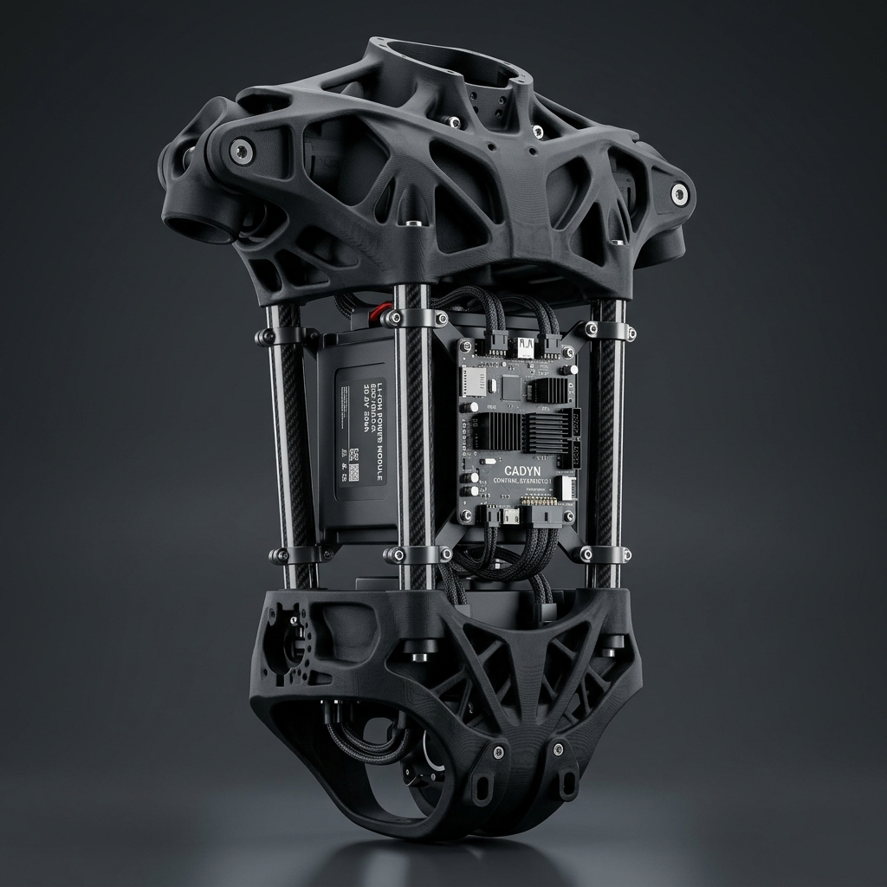
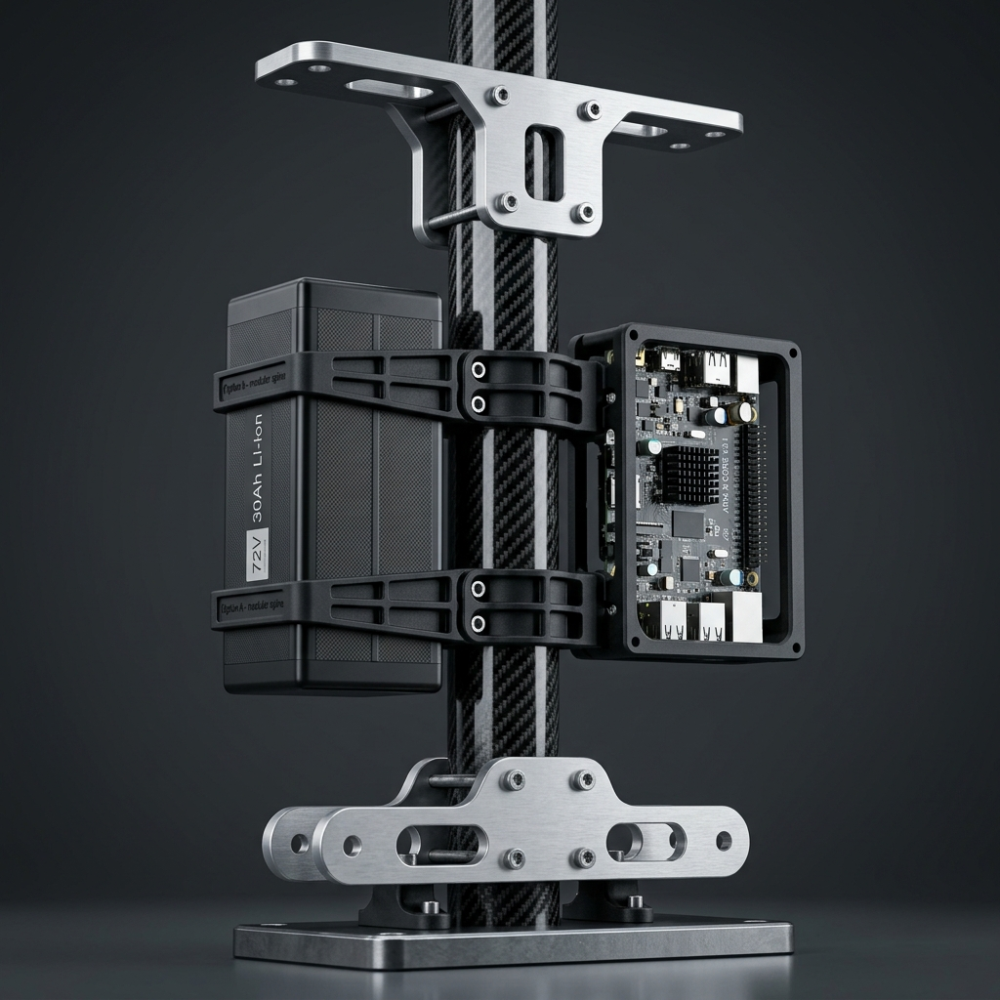

# 📐 Guide de Modélisation 3D et Sécurisation du Torse (Option C & Option A)

Ce document répertorie les rendus 3D précis, le script d'automatisation de CAO pour Fusion 360 et l'analyse mécanique des liaisons structurelles en carbone pour la conception révisée du torse du robot D-Bot.

---

## 1. Rendu CAO 3D des Deux Conceptions Révisées

Voici les modélisations de ce que nous envisageons pour le torse du D-Bot :

### 🩻 Option C : Le Split-Monocoque Hybride (Recommandé)
Ce design divise le torse de 420 mm de hauteur en deux boîtiers structurels fermés imprimés en **PA12-CF** (Bassin et Thorax de 140 mm chacun), reliés par **4 tubes de carbone légers de Ø25 mm** (entraxe 220 mm en X, 140 mm en Y). C'est le design le plus rigide en torsion, idéal pour la Qidi Plus 4 car imprimable à plat sans risque de délamination inter-couche sous l'effort des moteurs.

---

### 🦴 Option A : L'Spine Carbone Centrale + Clamps Modulaires
Ce design repose sur une unique colonne vertébrale centrale (un gros tube de carbone de Ø50 mm) sur lequel viennent se clamper des plaques d'extrémités en aluminium et des cages intermédiaires imprimées en PA12-CF.

---

## 2. Génération CAO Automatisée dans Fusion 360

Pour simplifier votre conception et vous donner une base de travail 3D géométriquement exacte, un script d'automatisation CAO a été créé et stocké dans le dépôt :

*   **Lien absolu du script** : [generate_option_c_torso.py](file:///Users/Shared/Mon%20Google%20Drive%20Physique/Documentation/Code/scripts/fusion360/generate_option_c_torso.py)
*   **Chemin relatif** : `../../Code/scripts/fusion360/generate_option_c_torso.py`

### Comment exécuter ce script dans Fusion 360 :
1. Dans Fusion 360, allez dans l'onglet **Utilitaires (Utilities)** dans le bandeau supérieur.
2. Cliquez sur **Scripts et compléments (Scripts and Add-ins)** (ou utilisez le raccourci `Alt + F8`).
3. Dans l'onglet *Scripts*, cliquez sur **Créer (Create)**.
4. Sélectionnez **Python**, nommez le script `Generate_Torso_OptionC`, puis cliquez sur **Créer (Create)**.
5. Fusion 360 crée un dossier temporaire. Dans la liste, faites un clic droit sur votre nouveau script et choisissez **Modifier (Edit)**.
6. Votre éditeur de code s'ouvre. Remplacez tout le contenu par le code du fichier [generate_option_c_torso.py](file:///Users/Shared/Mon%20Google%20Drive%20Physique/Documentation/Code/scripts/fusion360/generate_option_c_torso.py).
7. Enregistrez et fermez l'éditeur.
8. Sélectionnez `Generate_Torso_OptionC` dans la boîte de dialogue de Fusion 360 et cliquez sur **Exécuter (Run)**.

> [!TIP]
> Le script génère instantanément trois composants natifs et modifiables (`Pelvis_PA12CF`, `Thorax_PA12CF` et `Carbon_Tubes`) à l'échelle exacte du robot (hauteur totale 420 mm, largeur 300 mm, profondeur 220 mm, tubes Ø25 mm). Vous n'avez plus qu'à creuser l'intérieur des blocs pour loger vos moteurs RS-04 et votre batterie !

---

## 3. Analyse du Risque de Glissement des Tubes Carbone (Option C)

**Oui, un simple serrage par friction (brides en plastique serrées sur du carbone lisse) présente un risque très élevé de glissement avec le temps et les vibrations.**

### Pourquoi cela glisse-t-il ?
1. **Faible coefficient de friction du carbone** : Les tubes de carbone pultrudés ou enroulés ont une surface en résine époxy extrêmement lisse et glissante (`mu = 0.15` à `0.20`).
2. **Le fluage des plastiques (Creep)** : Même imprimé en PA12-CF, le nylon est un polymère sujet au fluage sous contrainte constante. Si vous serrez un collier en plastique très fort, le plastique va lentement "s'écouler" à l'échelle microscopique au fil des mois, relâchant la pression de serrage.
3. **Les vibrations de locomotion** : Les chocs répétés à chaque pas (~2 Hz) agissent comme un mini-marteau-piqueur qui favorise le micro-glissement alternatif. Le couple de pointe de 120 N.m du moteur RS-04 sollicitera fortement ce joint en torsion et en flexion.

---

## 4. Les 3 Solutions Professionnelles pour un Glissement ZÉRO

Pour sécuriser l'Option C (ou l'Option A), vous devez mettre en œuvre l'une de ces trois stratégies mécaniques :

### Solution 1 : Le Goupillage Traversant Sécurisé (Le standard industriel - Démontable)
C'est la solution la plus robuste et la plus simple à réaliser en atelier. Elle consiste à insérer une goupille ou une vis transversale qui traverse le bloc PA12-CF et le tube en carbone.

*   **Le Risque d'un perçage direct** : Le carbone est fragile sous pression concentrée. Si la vis appuie directement sur le bord du trou du tube carbone, les vibrations vont ovaliser le trou ou délaminer les fibres.
*   **La Règle de l'Art** : 
    1. Insérer un **insert métallique cylindrique** (un petit tube d'aluminium ou de laiton de Ø5 mm externe, Ø4 mm interne) à l'intérieur du tube carbone au niveau du trou pour servir de manchon anti-écrasement.
    2. Passer une vis transversale M4 en acier à travers le bloc PA12-CF, le tube carbone et ce manchon.
    3. Serrer avec un écrou nylstop.
    *   *Résultat* : La liaison travaille en cisaillement mécanique pur sur une surface métallique. Le glissement axial et en rotation est **physiquement impossible**.

### Solution 2 : Le Collage Structurel Époxy (Rigidité et durabilité absolues - Fixe)
C'est la méthode de construction privilégiée dans l'aérospatiale, le cyclisme de compétition (liaisons tubes/raccords) et la Formule 1.

*   **Comment faire** :
    1. Ajuster les perçages de vos blocs PA12-CF pour avoir un jeu radial de `0.1 mm` à `0.15 mm` par rapport au tube carbone (le script génère un emmanchement parfait, idéal pour le collage).
    2. Poncer légèrement la zone de contact du tube carbone avec un papier abrasif (grain 120 ou 180) pour casser le brillant de la résine et créer des micro-accroches.
    3. Nettoyer et dégraisser à l'alcool isopropylique.
    4. Appliquer une colle époxy structurelle bi-composant haute performance (ex: **3M Scotch-Weld DP420** ou **DP490**, ou **Araldite 2011**).
    5. Insérer le tube et laisser polymériser 24h.
*   **Pourquoi c'est indestructible** : Les stries d'impression 3D du PA12-CF agissent comme des milliers de micro-chambres de verrouillage mécanique pour l'époxy. La colle fusionne chimiquement avec la résine époxy du tube carbone.
    *   *Résultat* : La structure devient monolithique. Aucun jeu mécanique possible, aucun desserrage vibratoire, gain de poids maximal (zéro vis de serrage nécessaires).
    *   *Inconvénient* : Liaison permanente et non démontable.

### Solution 3 : Serrage par Bride Fendue + Pâte d'Assemblage Carbone (Démontable)
Si vous souhaitez impérativement que le torse reste démontable sans utiliser de goupilles traversantes.

*   **Comment faire** :
    1. Concevoir le logement des tubes dans les blocs PA12-CF sous forme de **brides fendues** (split clamps) avec 2 ou 3 vis de serrage M5 transversales par tube.
    2. Ajouter un **épaulement mécanique** (un rebord d'arrêt) au fond du trou dans le bloc PA12-CF : le tube vient buter contre ce rebord. Ainsi, la gravité et les chocs verticaux sont encaissés par un obstacle physique, et non par la friction.
    3. Appliquer de la **pâte d'assemblage carbone** (ex: Finish Line Fiber Grip, Muc-Off Carbon Gripper) sur le tube avant insertion. Cette pâte contient des micro-particules de silice (quartz) invisibles qui augmentent considérablement le coefficient de frottement (`mu` passe de 0.15 à **plus de 0.40**).
    *   *Résultat* : Le couple de serrage nécessaire pour bloquer le tube est divisé par deux, ce qui protège le plastique PA12-CF du fluage tout en bloquant toute rotation ou glissement.
