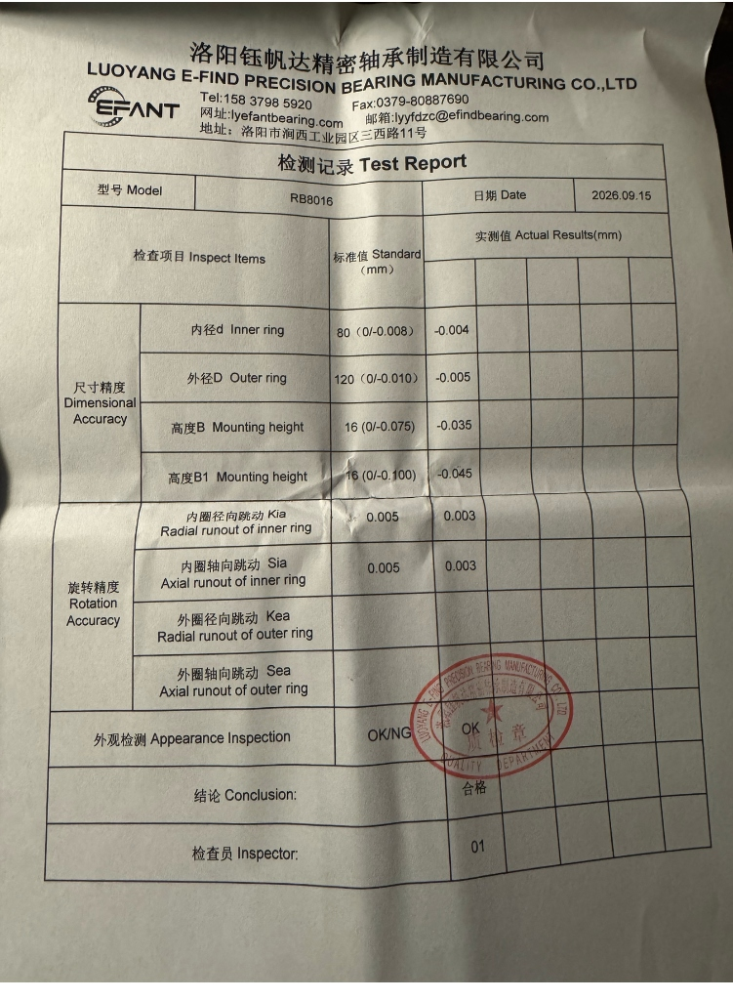
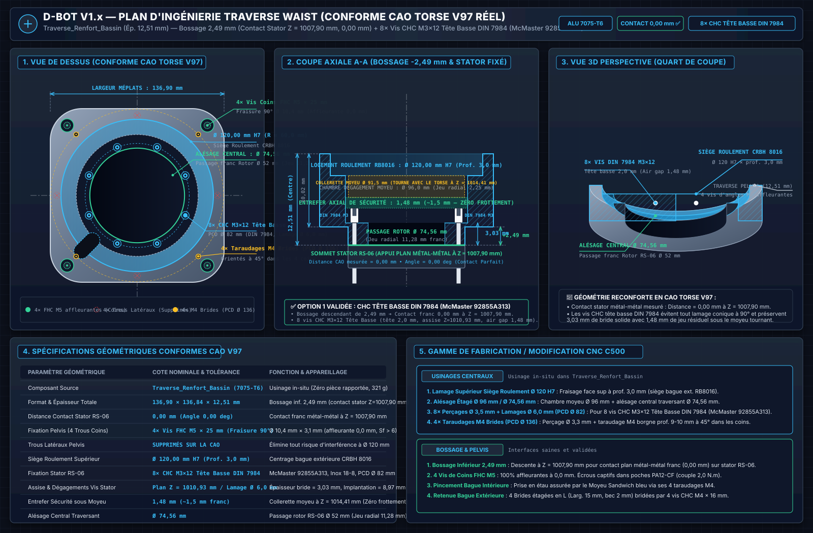
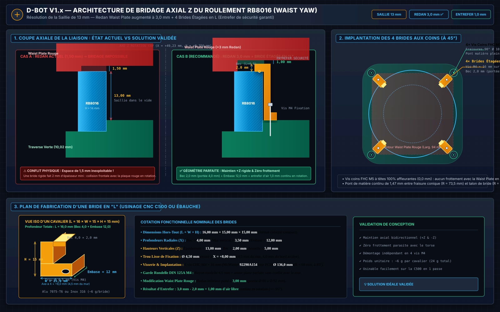

# 🦾 Dossier Technique : Bassin (Pelvis) & Liaison Active Waist Yaw — D-Bot V1.x

> **Statut** : Document de référence officiel — Conception Mécanique & Dimensionnement  
> **Auteur** : Équipe D-Bot & Pair-Programming Antigravity  
> **Date** : Septembre 2026  
> **Version** : 1.2 (Roulement CRBH 8016 validé & Platine d'Interface Waist monolithique — Septembre 2026)  
> **Système CAO** : Autodesk Fusion 360 (Scale Torse & Bassin +18 %, facteur 1,18)

---

## 📑 Sommaire

- [1. Architecture Globale & Rôle Fonctionnel du Bassin](#1-architecture-globale--rôle-fonctionnel-du-bassin)
  - [1.1 Contexte Morphologique du D-Bot V1.x](#11-contexte-morphologique-du-d-bot-v1x)
  - [1.2 Le Rôle Pivot du Waist Yaw (Lacet de Taille)](#12-le-rôle-pivot-du-waist-yaw-lacet-de-taille)
  - [1.3 Le Bassin comme Nœud de Répartition Structurel](#13-le-bassin-comme-nœud-de-répartition-structurel)
- [2. Bilan Biomécanique & Cartographie Complète des Efforts](#2-bilan-biomécanique--cartographie-complète-des-efforts)
  - [2.1 Bilan des Masses Suspendues au-dessus du Waist](#21-bilan-des-masses-suspendues-au-dessus-du-waist)
  - [2.2 Charge Axiale Pure (Compression Statique & Dynamique)](#22-charge-axiale-pure-compression-statique--dynamique)
  - [2.3 Moments de Basculement Critiques (Tangage Pitch & Roulis Roll)](#23-moments-de-basculement-critiques-tangage-pitch--roulis-roll)
  - [2.4 Forces Radiales de Cisaillement](#24-forces-radiales-de-cisaillement)
  - [2.5 Couple de Rotation en Lacet (Yaw Torque)](#25-couple-de-rotation-en-lacet-yaw-torque)
- [3. Analyse Critique des Roulements & Choix Technologique](#3-analyse-critique-des-roulements--choix-technologique)
  - [3.1 Diagnostic de la Butée Axiale à Aiguilles Seule (AXK 5578 / OD78 ID55 H5)](#31-diagnostic-de-la-butée-axiale-à-aiguilles-seule-axk-5578--od78-id55-h5)
  - [3.2 Benchmark Asimov v1 : Pourquoi l'Absence de Roulement Externe est Inadaptée au D-Bot](#32-benchmark-asimov-v1--pourquoi-labsence-de-roulement-externe-est-inadaptée-au-d-bot)
  - [3.3 Roulement 4 Points Section Mince (Étude Initiale : Remplacé)](#33-roulement-4-points-section-mince-étude-initiale--remplacé)
  - [3.4 Solution Retenue : Roulement à Rouleaux Croisés CRBH 8016 (80 x 120 x 16 mm)](#34-solution-retenue--roulement-à-rouleaux-croisés-crbh-8016-80-x-120-x-16-mm)
  - [3.5 Tableau Synthétique Comparatif des Solutions de Guidage](#35-tableau-synthétique-comparatif-des-solutions-de-guidage)
- [4. Motorisation du Waist Yaw : Intégration du RobStride RS-06](#4-motorisation-du-waist-yaw--intégration-du-robstride-rs-06)
  - [4.1 Spécifications de l'Actionneur RS-06](#41-spécifications-de-lactionneur-rs-06)
  - [4.2 Platine d'Interface Waist / Traverse de Renfort Pelvis (Alu 7075-T6, 136,90 × 12,51 mm)](#42-platine-dinterface-waist--traverse-de-renfort-pelvis-alu-7075-t6-13690--1251-mm)
  - [4.3 Schéma de Transmission & Découplage des Charges](#43-schéma-de-transmission--découplage-des-charges)
  - [4.4 Schéma Vectoriel d'Ingénierie & Détails d'Exécution CRBH 8016](#44-schéma-vectoriel-dingénierie--détails-dexécution-crbh-8016)
  - [4.5 Système de Bridage Axial Z du Roulement RB8016](#45-système-de-bridage-axial-z-du-roulement-rb8016)
    - [4.5.1 Pourquoi Augmenter le Redan de la Waist Plate de 1,5 mm à 3,0 mm ?](#451-pourquoi-augmenter-le-redan-de-la-waist-plate-de-15-mm-à-30-mm-)
    - [4.5.2 Implantation des 4 Brides Étagées en L aux 4 Coins (45°)](#452-implantation-des-4-brides-étagées-en-l-aux-4-coins-45)
    - [4.5.3 Fiche Technique Dimensionnelle Complète de la Bride en L (Fusion 360)](#453-fiche-technique-dimensionnelle-complète-de-la-bride-en-l-fusion-360)
- [5. Interfaces Mécaniques & Chaîne Cinématique Pelvienne](#5-interfaces-mécaniques--chaîne-cinématique-pelvienne)
  - [5.1 Interface Supérieure : Waist Plate 6,0 mm & Équerres Basses L = 90,0 mm](#51-interface-supérieure--waist-plate-60-mm--équerres-basses-l--900-mm)
    - [5.1.1 Cartographie Complète des Perçages, Vis CHC M4 & Pincement Sandwich](#511-cartographie-complète-des-perçages-vis-chc-m4--pincement-sandwich)
  - [5.2 Le Bloc Pelvien Inférieur (Pelvis Asimov Scalé +18%)](#52-le-bloc-pelvien-inférieur-pelvis-asimov-scalé-18)
  - [5.3 Connexion avec les Hanches en Chaîne F-A-R (RS-04 Hip Pitch)](#53-connexion-avec-les-hanches-en-chaîne-f-a-r-rs-04-hip-pitch)
  - [5.4 Système de Butée Angulaire : Rainure Interne vs Doigt Externe (Solution A)](#54-système-de-butée-angulaire--rainure-interne-vs-doigt-externe-solution-a)
  - [5.5 Corridor de Traversée du Faisceau (48V & Bus CAN-FD)](#55-corridor-de-traversée-du-faisceau-48v--bus-can-fd)
  - [5.6 Gestion Thermique du RS-06 Waist & Ventilation du Caisson Pelvien](#56-gestion-thermique-du-rs-06-waist--ventilation-du-caisson-pelvien)
  - [5.7 Tableau Récapitulatif des Chanfreins, Fraisures & Ébavurages du Bassin & Waist](#57-tableau-récapitulatif-des-chanfreins-fraisures--ébavurages-du-bassin--waist)
- [6. Nomenclature Matérielle & Approvisionnement (BOM)](#6-nomenclature-matérielle--approvisionnement-bom)
- [7. Recommandations de Modélisation CAO Fusion 360](#7-recommandations-de-modélisation-cao-fusion-360)
  - [7.1 Import Direct du Modèle 3D CAO du Roulement (Méthode Recommandée Fusion 360)](#71-import-direct-du-modèle-3d-cao-du-roulement-méthode-recommandée-fusion-360)
  - [7.2 Procédure de Modélisation & Assemblage Sous Fusion 360](#72-procédure-de-modélisation--assemblage-sous-fusion-360)
  - [7.3 Modélisation du Moyeu d'Accouplement & Pincement Sandwich (Alu 7075-T6)](#73-modélisation-du-moyeu-daccouplement--pincement-sandwich-alu-7075-t6)
  - [7.4 Tableau des Références McMaster-Carr pour Modélisation CAO Fusion 360 (Bassin & Waist)](#74-tableau-des-références-mcmaster-carr-pour-modélisation-cao-fusion-360-bassin--waist)
  - [7.5 Tableau Synthétique des Couples Dynamométriques & Outillage d'Atelier (Bassin & Waist)](#75-tableau-synthétique-des-couples-dynamométriques--outillage-datelier-bassin--waist)
- [8. Checklist de Contrôle & Métrologie Avant Usinage C500](#8-checklist-de-contrôle--métrologie-avant-usinage-c500)

---

## 1. Architecture Globale & Rôle Fonctionnel du Bassin

### 1.1 Contexte Morphologique du D-Bot V1.x

Le robot humanoïde bipède **D-Bot V1.x** est dimensionné selon les caractéristiques anthropomorphes suivantes :
- **Hauteur totale** : `~1,55 m` (ajustée suite à l'agrandissement de +18 % du torse et du bassin, hauteur torse = `432,67 mm`).
- **Masse totale de référence** : `~40,4 kg` (châssis hybride alu/carbone, 27 moteurs RobStride QDD, 2 packs batteries 12S Li-Ion, préhenseurs D-Hand).
- **Origine CAO du torse et du bassin** : Dérivés des fichiers open-source du projet **Asimov v1** (Menlo Research), soumis à un **facteur d'échelle de 1,18 (+18 %)** afin de loger sans interférence les gros actionneurs d'épaules et de hanches **RobStride RS-04** (Ø 120 mm).


*Blueprint d'ingénierie vectoriel officiel du bloc pelvien et de la liaison active Waist Yaw (D-Bot V1.x). Panel 1 : Coupe axiale montrant le découplage mécanique entre la reprise des moments de basculement (56 à 220 N.m) par le roulement à section mince Ø 110 mm et la transmission du couple pur (36 N.m) par le moteur RobStride RS-06 centré via sa bague CNC Alu 6061-T6 (Ø 88 / Ø 115,6 mm). Panel 2 : Architecture pelvienne en vue de face en chaîne cinématique F-A-R (RS-04 Pitch ➔ RS-03 Roll ➔ RS-03 Yaw, entraxe hanches ~378 mm). Panel 3 : Expertise critique des roulements comparant l'inadéquation de la butée AXK 5578 seule au roulement 4 points de contact.*

### 1.2 Le Rôle Pivot du Waist Yaw (Lacet de Taille)

L'articulation du **Waist Yaw (rotation Z de la taille)** assure une fonction essentielle dans la commande globale du robot (Whole-Body Control / WBC) :
1. **Dissociation Locomotion / Manipulation** : Permet au haut du corps d'orienter le buste et les deux bras vers une zone de travail (table, étagère, préhension asymétrique) pendant que le bassin et les jambes maintiennent une trajectoire de marche stable en ligne droite.
2. **Compensation du Moment Cinétique (Balancement)** : Lors de la marche dynamique, l'oscillation en contre-phase du buste et des bras permet d'annuler une partie du moment d'inertie de lacet produit par les jambes en mouvement alternatif, réduisant l'effort nécessaire au sol pour ne pas dévier de cap.
3. **Réduction de la Dépense Énergétique** : Évite de devoir faire tourner l'ensemble du robot "en crabe" ou en pas chassés pour des ajustements d'orientation du haut du corps de +/- 45°.

### 1.3 Le Bassin comme Nœud de Répartition Structurel

Le bassin mécanique (Pelvis) constitue le carrefour le plus sollicité de tout le robot :
- Il reçoit **vers le haut** l'intégralité du poids et des moments de basculement du torse, des bras et de la tête via la **Waist Plate** et la liaison pivot de taille.
- Il transmet **vers le bas** l'ensemble des charges aux deux jambes via les actionneurs **RS-04 Hip Pitch** fixés sur ses flancs droit et gauche (entraxe transversal `Y = ~378 mm`).
- Il héberge les répartiteurs de puissance électrique secondaire (mini-busbars 6 bornes 60V pour la distribution vers les membres inférieurs).

---

## 2. Bilan Biomécanique & Cartographie Complète des Efforts

### 2.1 Bilan des Masses Suspendues au-dessus du Waist

Toutes les masses situées au-dessus du plan de joint de la taille sont intégralement portées par le module Waist Yaw. Le tableau ci-dessous détaille cette masse suspendue en configuration V1 officielle :

| Sous-Système | Composants Inclus | Masse Estimée |
| :--- | :--- | :---: |
| **Squelette Métallique Torse V2 (Alu 7075/6060)** | Colonne sagittale, brides monoblocs, traverses tube carré, inserts, éclisses, équerres, tuyères, ventilateurs, visserie | `1 763 g` |
| **Coques & Carénages Abdominaux** | Coques imprimées PA12-CF (Thorax, Abdomen) | `1 000 g` |
| **Moteurs d'Épaules & Bras (x2)** | 2x RS-04 Pitch, 2x RS-03 Roll, 2x RS-02 Yaw, 2x RS-03 Coude, 2x RS-02 Sup, 2x RS-00 | `8 420 g` |
| **Membres Supérieurs (Bras Carbone & D-Hand)** | Tubes carbone 3K, brides alu, 2 mains D-Hand Hybrid Premium | `2 100 g` |
| **Tête & Cou** | 2x moteurs RS-05, équerres cou, caméra RGB-D RealSense, structure tête | `1 150 g` |
| **Pack Énergie Torse (Batteries 12S)** | 2 packs Li-Ion 12S / 50V montés en paniers latéraux hot-swap | `1 600 g` |
| **Électronique & Câblage Haut** | Jetson Orin Nano / AGX, PDB haute puissance, diodes ORing, faisceaux | `950 g` |
| **Marge & Quincaillerie Non Comptée** | Marge forfaitaire câbles, capteurs, fixations diverses | `350 g` |
| **TOTAL MASSE SUSPENDUE (Haut du Corps)** | **Torse V2 + Bras + Tête + Énergie + Calcul** | **`~17 333 g (~17,3 kg)`** |

> [!NOTE]
> **Révision Septembre 2026** : Le bilan de masse a été révisé pour refléter l'architecture Torse V2 Tout Métal. L'ancien squelette (cage alu boulonnée V1 à 2 360 g) a été remplacé par le squelette séminal métallique V2 à 1 763 g. Le total masse suspendue passe de ~18,3 kg à **~17,3 kg**. Tous les calculs d'efforts et de moments restent valides car conservatifs (dimensionnés sur 18,3 kg).

### 2.2 Charge Axiale Pure (Compression Statique & Dynamique)

- **Effort Axial Statique (F_z_stat)** :
  `F_z_stat = m_suspendue * g = 18,3 kg * 9,81 m/s^2 = 179,5 N (~180 N)`
- **Facteur d'Accélération Dynamique (Marche & Réception de Saut)** :
  Lors de la marche normale, les accélérations verticales alternées introduisent un facteur de charge de `1,5 à 2,0 g`. En cas de trébuchement, d'arrêt d'urgence ou de choc dynamique, le facteur d'impact atteint couramment `3,0 g`.
  `F_z_dyn_max = 3,0 * F_z_stat = 3,0 * 180 N = 540 N`

> **Constat Axial** : La force de compression verticale pure (`180 N` statique, `540 N` pic dynamique) est modérée. N'importe quel roulement à aiguilles ou à billes du commerce reprend plusieurs kilonewtons en compression pure. **Le véritable défi mécanique ne se situe pas là.**

### 2.3 Moments de Basculement Critiques (Tangage Pitch & Roulis Roll)

Le centre de gravité (CdG) du haut du corps est situé à environ `h_CdG = 220 à 250 mm` au-dessus de la Waist Plate. De plus, les bras peuvent s'étendre horizontalement en avant ou sur les côtés (portée `~0,55 m`), portant des charges utiles (manipulation de charges jusqu'à 3 kg par main).

#### A. Moment de Tangage Sagittal (Pitch — Avant / Arrière)
- **Posture Droite (Statique)** : En posture neutre, un léger désalignement de 30 mm du CdG produit :
  `M_pitch_statique = 180 N * 0,03 m = 5,4 N.m`
- **Flexion du Buste en Avant (30° d'inclinaison)** : Le CdG avance de `~120 mm` :
  `M_pitch_flexion = 180 N * 0,12 m = 21,6 N.m`
- **Deux Bras Tendus Portant 2 kg Chacun** :
  `M_pitch_bras = (2 bras * 1,2 kg + 2 charges * 2,0 kg) * 9,81 * 0,55 m = 6,4 kg * 9,81 * 0,55 m = 34,5 N.m`
  `M_pitch_total = 21,6 + 34,5 = 56,1 N.m`
- **Accélération / Décélération Brusque (Freinage d'Urgence)** :
  Une décélération horizontale de `1,0 g` sur le buste à `h = 0,25 m` de la taille génère :
  `M_pitch_choc = 180 N * 0,25 m = 45 N.m` (qui s'additionne au moment de flexion).
- **Moment Sagittal Pic de Calcul (Dimensionnement Châssis Torse V2)** :
  La colonne vertébrale est calculée pour un choc de basculement extrême de **`275 N.m`** (facteur de sécurité `Sf = 12,58` dans l'Alu 7075-T6).

#### B. Moment de Roulis Frontal (Roll — Gauche / Droite)
- **Marche sur une Jambe d'Appui (Single Support Phase)** :
  Le bassin bascule latéralement de 2 à 5°. Pour stabiliser le buste, le robot compense par un moment latéral :
  `M_roll_marche = 25 à 45 N.m`
- **Port de Charge Asymétrique (3 kg dans une seule main, bras tendu à 0,50 m)** :
  `M_roll_charge = (3,0 kg + 1,2 kg bras) * 9,81 * 0,50 m = 20,6 N.m`
- **Moment Frontal Pic Combiné** :
  `M_roll_pic = 60 à 110 N.m`

### 2.4 Forces Radiales de Cisaillement

Les accélérations latérales et sagittales lors des transferts d'appui de la marche bipède exercent un cisaillement horizontal direct sur la liaison rotative :
`F_radial_dyn = m_suspendue * a_transversale = 18,3 kg * (0,5 à 1,0 g) = 90 à 180 N` (avec des pics à `~300 N` lors des impacts au sol).

### 2.5 Couple de Rotation en Lacet (Yaw Torque)

- **Couple résistant en rotation pure** : Généré par l'inertie de rotation du buste (`I_zz ~ 0,18 kg.m^2`) lors des accélérations angulaires rapides (`alpha = 20 à 50 rad/s^2`) :
  `T_yaw_dyn = I_zz * alpha = 0,18 * 50 = 9,0 N.m`
- **Couple Pic Prévu pour le Moteur RS-06** : **`36 N.m`** (avec un couple continu nominal de **`11 N.m`**).
  Le ratio de couple disponible / couple requis est :
  `Ratio = 36 N.m / 9 N.m = 4,0 (Marge de sécurité confortable de 300 %)`

---

## 3. Analyse Critique des Roulements & Choix Technologique

### 3.1 Diagnostic de la Butée Axiale à Aiguilles Seule (AXK 5578 / OD78 ID55 H5)

La référence `THRUST-BEARING-OD78ID55H5` correspond au standard ISO **AXK 5578** (cage à aiguilles axiale `55 × 78 × 3 mm` accompagnée de deux rondelles de roulement trempées `AS 5578` de 1 mm, épaisseur totale = `5,00 mm`).

*(Voir l'illustration détaillée du phénomène de décollement dans le **Panneau 3 du blueprint vectoriel** ci-dessus).*

#### Diagnostic d'Inadéquation de l'AXK 5578 Seule à la Taille :
1. **Zéro Reprise Radiale (0 N)** : Une butée axiale n'a strictement aucun épaulement de guidage radial. Les rondelles plates glisseraient librement sur le plan XY sous le moindre effort de cisaillement transversal (`90 à 300 N`), désaxant immédiatement le rotor du moteur RS-06 et endommageant ses réducteurs planétaires.
2. **Fonctionnement Unidirectionnel Ouvert (Décollement sous Moment)** : Une butée axiale ne travaille qu'en compression pure d'un seul côté. Dès qu'un moment de tangage (`M_pitch > 5,4 N.m`) est appliqué :
   - Le bord avant de la butée encaisse toute la charge en contrainte locale ponctuelle.
   - Le bord arrière **se décolle physiquement de son appui** car la butée est incapable d'exercer la moindre traction.
   - Il en résulte un **jeu angulaire majeur**, le buste du robot bascule d'avant en arrière comme une charnière branlante, rendant impossible tout équilibrage par le contrôleur RL.
3. **Risque Mortel pour l'Actionneur RS-06** : Si la butée n'empêche pas le basculement, c'est le petit roulement interne du moteur RobStride RS-06 qui se retrouve à encaisser le moment de flexion de `50 à 110 N.m`, entraînant la destruction des roulements internes du moteur et la casse des satellites du réducteur.

> [!CAUTION]
> **Conclusion Formelle** : Le roulement à aiguilles `AXK 5578` **ne peut absolument pas être utilisé seul** pour assurer la liaison rotative du Waist. Il exigerait l'ajout d'au minimum deux roulements rigides à billes à gorge profonde supplémentaires pour le guidage radial et d'un système de précharge bilatérale complexe, annulant tout gain d'encombrement.

---

### 3.2 Benchmark Asimov v1 : Pourquoi l'Absence de Roulement Externe est Inadaptée au D-Bot

L'inspection approfondie du modèle CAO d'origine de l'**Asimov v1** (Menlo Research) montre que la plaque inférieure du torse est vissée directement sur la bride de sortie d'un gros actionneur modulaire intégré (type AK80 / Unitree), sans roulement auxiliaire externe :

1. **Le Contexte Spécifique d'Asimov v1** :
   - Le robot Asimov d'origine est un prototype de laboratoire de dimension modeste (1,20 m, ~30-35 kg), doté d'un haut de corps très compact (< 14 kg).
   - L'actionneur employé intègre d'origine un roulement de sortie renforcé à double rangée de billes ou à contact oblique capable de tolérer des moments légers à faible vitesse.
   - Les concepteurs ont visé un compromis d'extrême compacité axiale (zéro millimètre ajouté en Z) au détriment de la rigidité sous forte dynamique.

2. **Pourquoi D-Bot V1.x Ne Peut Pas Adopter ce Montage Direct** :
   - **Masse Suspendue Élevée** : Le torse du D-Bot est agrandi de **+18 %**, pèse **18,3 kg** suspendus (avec deux packs 12S Li-Ion en fond de coffre et des bras de 55 cm portant des charges).
   - **Moteur RobStride RS-06 Ultra-Compact** : Le RS-06 (621 g, Ø 88 mm) a été choisi pour son ratio couple/masse exceptionnel (36 N.m pic), mais ses roulements internes sont petits et optimisés pour la rotation, pas pour faire office de palier structural de tout le squelette.
   - **Conclusion Mécanique** : Confier les 18,3 kg et les moments de basculement de `56 à 220 N.m` aux seuls roulements internes du RS-06 provoquerait un matage rapide des pistes, l'arc-boutement des satellites planétaires et une destruction rapide de l'actionneur.

---

### 3.3 Roulement 4 Points Section Mince (Étude Initiale : Remplacé)

> [!NOTE]
> **Section conservée pour traçabilité.** L'étude initiale préconisait un roulement à 4 points de contact section mince (Ø int 90 mm, Ø ext 110 mm, ép 10 mm, type CSXB / Kaydon Reali-Slim). Cependant, **aucune référence standard n'existe en ces dimensions exactes**. Les séries CSXB ont des cotes impériales (pouces), et la conversion la plus proche ne correspond pas aux cotes métriques spécifiées. Le sourcing s'est avéré impossible dans des délais et coûts raisonnables. Cette solution est donc **remplacée** par le roulement à rouleaux croisés CRBH 8016 (section 3.4).

Les principes d'ingénierie restent valides :
1. **Géométrie en Arc Gothique** : Chaque bille en contact en 4 points simultanés avec les bagues (traction + compression bilatérale).
2. **Reprise simultanée des 3 composantes d'efforts** : axiale, radiale, et moment de basculement.
3. **Section mince → grand alésage central** pour le passage des câbles.

---

### 3.4 Solution Retenue : Roulement à Rouleaux Croisés CRBH 8016 (80 x 120 x 16 mm)

Après étude de sourcing approfondie (Septembre 2026), la solution retenue pour le D-Bot est un **roulement à rouleaux croisés standard industriel** :

#### Référence Validée : CRBH 8016 UU (ou équivalent RB 8016 UU)

| Paramètre | Valeur |
| :--- | :---: |
| **Diamètre Intérieur (Ø int)** | **`80 mm`** |
| **Diamètre Extérieur (Ø ext)** | **`120 mm`** |
| **Épaisseur (B)** | **`16 mm`** |
| **Type de Roulement** | Rouleaux croisés 90 deg, bagues intégrales (non fendu) |
| **Joints** | UU (joints des 2 côtés, protection poussière) |
| **Classe de Précision** | **P5** minimum (runout < 0,01 mm) |
| **Matériau** | Acier à roulement GCr15 trempé (62 HRC) |
| **Charge Axiale Dynamique (Ca)** | ~22 kN |
| **Charge Radiale Dynamique (Cr)** | ~15 kN |
| **Moment de Basculement Statique (M0)** | **~520 N.m** |
| **Rigidité en Basculement** | ~250 N.m/arcmin |
| **Masse** | ~250-350 g |
| **Passage Central Câbles** | **Ø 80 mm** (largement > 40 mm requis) |

#### Pourquoi les Rouleaux Croisés sont Supérieurs au 4 Points :
1. **Rigidité torsionnelle 3 à 4 fois supérieure** au roulement à billes : les rouleaux cylindriques disposés en croix à 90 deg dans une gorge en V unique offrent une déformation élastique quasi-nulle sous fort moment de basculement.
2. **Capacité en moment de basculement : 520 N.m** (vs ~300 N.m pour un 4 points de section comparable), soit un facteur de sécurité de **x2,36** face au pire cas D-Bot (arrêt d'urgence à 220 N.m).
3. **Standard industriel immédiatement disponible** : Référence de catalogue (THK, IKO, génériques Luoyang), disponible sur AliExpress pour **60 à 90 EUR** en 2-4 semaines.
4. **Technologie de référence en robotique humanoïde** : Les robots Unitree H1/G1, Figure 02, et Tesla Optimus utilisent tous des rouleaux croisés pour leurs articulations à forte charge.

#### Sourcing Validé (Septembre 2026)

| Fournisseur | Plateforme | Recherche / Référence | Prix Estimé | Délai |
| :--- | :--- | :--- | :---: | :---: |
| **Luoyang (Chine)** | [AliExpress](https://www.aliexpress.com) | Rechercher **"CRBH8016 UU crossed roller bearing P5"** | **40 à 90 EUR** | 2-4 sem. |
| **123Roulement (France)** | [123roulement.com](https://www.123roulement.com) | Contacter le service client : **"CRBH 8016 UU"** | **150 à 350 EUR** (devis) | 2-6 sem. |
| **Rubix (France)** | [rubix.com/fr](https://www.rubix.com/fr-fr/) | Devis **"Roulement rouleaux croisés 80x120x16"** | **200 à 400 EUR** | 3-6 sem. |
| **MISUMI Europe** | [misumi-ec.com](https://www.misumi-ec.com) | Configurateur série THK **RB 8016** | **250 à 500 EUR** | 2-4 sem. |

> [!IMPORTANT]
> **Statut Réception & Métrologie Réelle (Validé en Atelier au 25 Septembre 2026)** :  
> Le roulement **RB8016** est **✅ REÇU ET CONTRÔLÉ EN ATELIER**.  
> Le certificat officiel d'inspection d'usine émis par **LUOYANG E-FIND PRECISION BEARING MANUFACTURING CO., LTD (EFANT)** (Rapport Test N° 01 du 15/09/2026, tamponné par le Département Qualité) confirme une précision métrologique remarquable de classe **P4 / P2** :
> * **Diamètre Intérieur (d)** : Standard `80 mm (0 / -0,008 mm)` ➔ **Mesuré réel = `79,996 mm`** (Écart de seulement -4 µm vs nominal, ajustement glissant doux parfait avec le fût du Moyeu Sandwich).
> * **Diamètre Extérieur (D)** : Standard `120 mm (0 / -0,010 mm)` ➔ **Mesuré réel = `119,995 mm`** (Écart de seulement -5 µm vs nominal, ajustement H7/h6 idéal dans le lamage de Traverse).
> * **Hauteur de Montage (B)** : Standard `16 mm (0 / -0,075 mm)` ➔ **Mesuré réel = `15,965 mm`** (Écart de -35 µm).
> * **Hauteur de Montage (B1)** : Standard `16 mm (0 / -0,100 mm)` ➔ **Mesuré réel = `15,955 mm`** (Écart de -45 µm).
> * **Battement Radial Intérieur (Kia)** : Standard <= 0,005 mm ➔ **Mesuré réel = `0,003 mm` (3 µm !)**
> * **Battement Axial Intérieur (Sia)** : Standard <= 0,005 mm ➔ **Mesuré réel = `0,003 mm` (3 µm !)**
> * **Conclusion Usine** : **合格 (Conforme / Passed)**.
>
> 
> *Certificat officiel d'inspection d'usine Luoyang E-Find Precision Bearing (EFANT) — RB8016 réceptionné pour le D-Bot (15/09/2026).*

---

### 3.5 Tableau Synthétique Comparatif des Solutions de Guidage

| Critère Mécanique | Butée Aiguilles AXK 5578 (Seule) | Montage Direct sur Moteur (Asimov v1) | ~~Roulement 4 Pts Section Mince~~ | **Rouleaux Croisés CRBH 8016 ✅** |
| :--- | :---: | :---: | :---: | :---: |
| **Reprise Charge Axiale (F_z)** | Excellente (> 100 kN) | Modérée (~1,5 kN) | ~~Excellente (> 20 kN)~~ | **Exceptionnelle (> 22 kN)** |
| **Reprise Charge Radiale (F_xy)** | **NULLE (0 N) ❌** | Modérée (~1 kN) | ~~Excellente (> 10 kN)~~ | **Exceptionnelle (> 15 kN)** |
| **Reprise Moment Basculement** | **NULLE (Décollement) ❌** | Faible (< 40 N.m) | ~~> 300 N.m~~ | **> 520 N.m ✅** |
| **Protection du Moteur RS-06** | Nulle (Moteur détruit) | Nulle (Moteur en direct) | ~~100% découplé~~ | **100% découplé ✅** |
| **Jeu Angulaire sous Moment** | Inacceptable (Bascule) | Prise de jeu progressive | ~~Zéro (précharge)~~ | **Zéro absolu (ultra-rigide) ✅** |
| **Passage Central Câblage** | Moyen (Ø 55 mm) | Restreint | ~~Ø 90 mm~~ | **Ø 80 mm ✅** |
| **Hauteur / Épaisseur Z** | Ultra-fine (5 mm) | Nulle (0 mm) | ~~10 mm~~ | **16 mm** (compensé par la Platine) |
| **Disponibilité Marché** | Standard | N/A | ~~Introuvable ❌~~ | **Standard industriel ✅** |
| **Prix** | ~10 EUR | 0 EUR | ~~Inconnu (custom)~~ | **60-90 EUR ✅** |
| **Verdict D-Bot V1.2** | **REJETÉ ❌** | **REJETÉ ❌** | **REMPLACÉ** | **SOLUTION OFFICIELLE ✅** |

---

## 4. Motorisation du Waist Yaw : Intégration du RobStride RS-06

### 4.1 Spécifications de l'Actionneur RS-06

L'actionneur **RobStride RS-06** a été sélectionné, commandé et validé pour motoriser l'axe Waist Yaw :
- **Technologie** : Moteur synchrone sans balais à aimants permanents avec réducteur planétaire intégré (Quasi-Direct Drive — QDD).
- **Couple Maximal (Pic)** : **`36 N.m`**.
- **Couple Continu (Nominal)** : **`11 N.m`**.
- **Vitesse Maximale** : **`~31 rad/s (300 rpm)`**.
- **Diamètre Extérieur Carter (Stator)** : **`Ø 88,0 mm`**.
- **Épaisseur Totale** : **`~41,5 mm`**.
- **Masse** : **`621 g`**.
- **Protocole de Communication** : CAN-FD haute vitesse, identifiant officiel : **`ID CAN = 21`** (terminaison 120 ohms intégrée ou chaînée).

### 4.2 Platine d'Interface Waist / Traverse de Renfort Pelvis (Alu 7075-T6, 136,90 × 12,51 mm)

> [!NOTE]
> **Révision V1.2.3 (Septembre 2026 — Conforme CAO Torse v97, Option A & Option 1 Validées avec Vis CHC M3 Tête Basse DIN 7984)** : 
> 1. **Usinage direct in-situ** : La platine est issue directement de la plaque d'origine Asimov v1 mise à l'échelle +18 % (`Traverse_Renfort_Bassin [ASV1_200_16A]:1`, épaisseur brute **`10,02 mm`** en périphérie, portée à **`12,51 mm`** au centre via bossage inférieur). Ce choix élimine toute pièce d'adaptation superflue et préserve l'assise structurelle sur le berceau pelvien.
> 2. **Fixation directe du Stator RS-06 & Bossage Inférieur 2,49 mm (Option 1 Validée)** : La face inférieure de la traverse reçoit un bossage cylindrique descendant de `2,49 mm` (cote `Z = 1007,90 mm`) qui comble l'entrefer axial et vient plaquer en **contact franc métal-métal mesuré à 0,00 mm (Angle 0,00 deg)** sur le sommet du carter statorique du RobStride RS-06. L'alésage est étagé en 4 gradins fonctionnels :
>    - **Étage 1 — Siège Supérieur Roulement** : `Ø 120,00 mm H7` (prof. `3,00 mm`, de `Z = 1020,41 mm` à `Z = 1017,41 mm`) pour loger et caler la bague extérieure du CRBH 8016 UU.
>    - **Étage 2 — Chambre de Dégagement Collerette Moyeu** : `Ø 96,00 mm` (de `Z = 1017,41 mm` à `Z = 1010,93 mm`) ménageant un jeu radial franc de `2,25 mm` autour de la collerette tournante (Ø 91,5 mm) du `Moyeu_Waist_Sandwich_7075`.
>    - **Étage 3 — Collerette Fixe de Bridage Stator & Vis Tête Basse** : Plan d'appui des têtes de vis à `Z = 1010,93 mm` (épaisseur saine de bride sous tête = `1010,93 - 1007,90 = 3,03 mm`) percé de **8 trous lisses Ø 3,50 mm sur PCD `Ø 82,00 mm`** (orientés à 22,5°, 67,5°, 112,5°, 157,5°, etc.) avec lamages cylindriques (spotfaces) de dégagement **`Ø 6,00 mm`**. La fixation est assurée par **8 vis CHC M3 × 12 mm Tête Basse DIN 7984 Inox 18-8** (McMaster-Carr `92855A313`). Les têtes (hauteur 2,00 mm, Ø 5,50 mm, sommet à `Z = 1012,93 mm`) ménagent un **entrefer vertical de sécurité franc (Air Gap) de `1,48 mm (~1,5 mm)`** sous la collerette tournante (plan `Z = 1014,41 mm`) du Moyeu Sandwich (zéro contact, zéro frottement).
>    - **Étage 4 — Alésage Central Traversant Passage Rotor** : **`Ø 74,56 mm`** (de `Z = 1010,93 mm` à `Z = 1007,90 mm`), laissant un jeu radial franc de **`11,28 mm`** autour du bossage rotor (Ø 52,0 mm) et du col inférieur du Moyeu Sandwich se fixant sur les vis M4 du rotor.
> 3. **Fixation Pelvis sur 4 vis d'angles FHC M5 affleurantes (Option A Validée)** : Les 4 trous latéraux à R = 63,19 mm ont été supprimés sur la CAO pour éliminer tout risque d'interférence et de fissuration à proximité du siège Ø 120 mm (où il ne restait que 0,54 mm de matière). Seuls les 4 trous d'angles (R = 78,67 mm à 45°) sont conservés, usinés avec une fraisure conique à 90° (Ø 10,40 mm × prof. 3,10 mm) pour vis FHC M5 affleurantes à **0,0 mm**. Les têtes ne créent aucune saillie, préservant la libre rotation de la Waist Plate et maintenant un pont de matière plein de **1,47 mm** face aux talons des brides. L'ancrage inférieur s'effectue dans les poches hexagonales de 8,50 mm sous plafond PA12-CF (3,54 mm) avec rondelles DIN 125A M5 et écrous M5 bloqués en rotation (couple calibré de 1,8 à 2,0 N.m, facteur de sécurité > 6 en lacet et > 9 en basculement).



*Plan d'ingénierie vectoriel officiel de la Traverse / Platine d'Interface Waist CNC (Alu 7075-T651, conforme au modèle CAO Fusion 360 Torse v97 & Option 1). Panneau 1 : Vue de dessus montrant le format extérieur de 136,90 × 136,84 mm, les 4 vis d'angles Pelvis FHC M5 affleurantes à 0,0 mm, les 4 taraudages M4 des brides en L sur PCD Ø 136 mm, la chambre de dégagement Ø 96 mm du moyeu, le cercle de bridage stator (8× CHC M3×12 Tête Basse DIN 7984 McMaster 92855A313 sur PCD Ø 82 mm avec lamages Ø 6,0 mm) et l'alésage central traversant Ø 74,56 mm. Panneau 2 : Coupe axiale A-A révélant le profil réel en gradin avec le bossage inférieur de 2,49 mm (épaisseur totale 12,51 mm au centre), le contact franc mesuré à 0,00 mm à Z = 1007,90 mm avec le sommet du stator RS-06, l'assise des vis à Z = 1010,93 mm (bride de 3,03 mm), l'entrefer axial de sécurité de 1,48 mm sous la collerette du Moyeu Sandwich et le lamage siège roulement Ø 120 H7 profondeur 3,0 mm. Panneau 3 : Vue 3D isométrique en quart de coupe.*

#### Contexte Dimensionnel & Origine Asimov :
Le châssis pelvien d'Asimov v1 comporte une plaque supérieure de renfort et de fermeture (`Traverse_Renfort_Bassin` / `ASV1_200_16A`). Avec le facteur d'échelle global de **`+18 % (×1,18)`**, cette plaque présente un format quasi-carré aux coins arrondis de **`136,90 × 136,84 mm`** de largeur et une épaisseur périphérique de **`10,02 mm`** (portée à **`12,51 mm`** au centre par le bossage inférieur). Plutôt que de superposer une pièce rapportée, cette plaque d'origine est **directement usinée in-situ pour former la Platine d'Interface Waist D-Bot**, garantissant une continuité structurelle maximale.

#### Définition Métrologique Conforme CAO Torse v97 :
- **Matière** : Aluminium **7075-T6** (masse réelle CAO = **`321,24 g`**, volume = `114,32 cm3`).
- **Format Extérieur Fini** : Quasi-carré aux coins arrondis de **`136,90 mm × 136,84 mm (+/- 0,2 mm)`**.
- **Épaisseur Finie** : **`10,02 mm (+/- 0,05 mm)`** en périphérie (appui berceau pelvis à `Z = 1010,39 mm`), **`12,51 mm`** au centre via bossage descendant de `2,49 mm` (face inférieure d'appui stator à `Z = 1007,90 mm`).
- **Distance de Contact Stator Mesurée en CAO** : **`0,00 mm`** (Angle **`0,00 deg`**), contact rigide métal-métal franc et direct à `Z = 1007,90 mm`.
- **Alésage Central Traversant (Passage Rotor RS-06 & Col Moyeu)** : **`Ø 74,56 mm (+0,05 / 0,00)`** — de `Z = 1010,93 mm` à `Z = 1007,90 mm`. Laisse un jeu radial franc de **`11,28 mm`** autour du bossage rotor Ø 52,0 mm et de la liaison vissée basse du `Moyeu_Waist_Sandwich_7075`.
- **Fixation Stator RS-06 (Collerette de Bridage Intégrée & DIN 7984)** :
  - **8 vis à tête cylindrique basse DIN 7984 CHC M3 × 12 mm en Inox 18-8** (McMaster-Carr **`92855A313`**).
  - **Cercle primitif** : **`PCD Ø 82,00 mm (+/- 0,05 mm)`** (`R = 41,00 mm`), 8 trous orientés à `22,5°`, `67,5°`, `112,5°`, `157,5°`, `202,5°`, `247,5°`, `292,5°` et `337,5°` (coordonnées `X = ±15,69 mm` et `Y = ±37,88 mm`, ou `X = ±37,88 mm` et `Y = ±15,69 mm`).
  - **Lamages cylindriques de dégagement de tête (face supérieure à Z = 1010,93 mm)** : Diamètre **`Ø 6,00 mm`**, logeant avec aisance la tête de vis DIN 7984 (diamètre de tête **`5,50 mm`**, hauteur de tête **`2,00 mm`**).
  - **Épaisseur de matière bridée sous tête** : `1010,93 - 1007,90 =` **`3,03 mm`** d'Alu 7075-T6 plein.
  - **Implantation filetée dans le stator RS-06** : `12,00 - 3,03 =` **`8,97 mm (~9,0 mm)`** de filet utile dans les taraudages M3 borgnes du carter moteur (profondeur taraudée nominale 9 à 10 mm, prise filetée optimale égale à 3× le diamètre nominal).
  - **Couple de serrage & RDM** : Serrage dynamométrique calibré à **`1,3 à 1,4 N.m`** (clé Allen 2,0 mm + Loctite 243). Cisaillement sous couple de crête (36 N.m) : `tau = 21,8 MPa` (limite admissible 545 MPa, **facteur de sécurité Sf = 25,0**). Précharge globale de 15,2 kN conférant un couple transmissible par pure adhérence de **`93,5 N.m`** (2,6 fois le couple de choc maxi).
- **Chambre de Dégagement Collerette Moyeu** : **`Ø 96,00 mm`**, profondeur `6,48 mm` (de `Z = 1017,41 mm` à `Z = 1010,93 mm`). Offre un jeu radial de `2,25 mm` autour de la collerette tournante (Ø 91,5 mm) et un **jeu axial de sécurité franc de `1,48 mm (~1,5 mm)`** au-dessus des têtes de vis DIN 7984 (sommet à `Z = 1012,93 mm`, collerette moyeu à `Z = 1014,41 mm`). Zéro frottement garanti.
- **Siège Roulement (Lamage Face Supérieure)** : **`Ø 120,000 mm H7 (+0,000 / +0,035)`**, profondeur **`3,00 mm (+/- 0,05 mm)`** (de `Z = 1020,41 mm` à `Z = 1017,41 mm`) — centre et retient la bague extérieure fixe du CRBH 8016 UU. Épaisseur résiduelle sous le siège = 7,02 mm.
- **4× Vis de Fixation d'Angles ➔ Pelvis (Option A Validée)** :
  - **4 vis à tête fraisée FHC M5 × 25 mm Inox 316** (McMaster `92125A230`).
  - **Coordonnées CAO réelles** : `X = ±56,08 mm`, `Y = ±55,17 mm`, rayon mesuré **`R = 78,67 mm`** sur les diagonales à 45° (PCD `~157,3 mm`).
  - **Fraisures coniques 90° (face supérieure)** : Diamètre supérieur **`Ø 10,40 mm`**, profondeur **`3,10 mm`**. Garantit un **noyage à fleur rigoureux à 0,0 mm** (zéro frottement avec le balayage de la Waist Plate rouge mobile).
  - **Épaisseur saine résiduelle sous tête** : `10,02 - 3,10 =` **`6,92 mm`** de métal plein en Alu 7075-T6 (résistance au cisaillement > 30 kN).
  - **Pont de matière plein face aux brides** : Arête extérieure de fraisure à `R = 78,67 - 5,20 =` **`73,47 mm`**, laissant un pont plein de **`1,47 mm`** d'Alu 7075-T6 continu face au talon arrière de chaque bride en L (`R = 72,00 mm`).
  - **Suppression des 4 trous latéraux** : Élimine définitivement le risque de fragilisation mécanique à proximité du siège Ø 120 mm.
  - **Fixation inférieure dans le Châssis Pelvien PA12-CF** : Traversée du plafond composite de 3,54 mm vers les 4 poches hexagonales de largeur 8,50 mm. Répartition d'effort par rondelle DIN 125A M5 (McMaster `93475A240`, Ø ext 10,0 mm) et écrou hexagonal M5 (McMaster `90631A113`) bloqué contre rotation par les parois de la poche. Serrage dynamométrique calibré à **`1,8 à 2,0 N.m`** (respect de la contrainte admissible composite < 30 MPa, précharge globale 12 kN, Sf > 6 en lacet et > 9 en basculement).
- **4× Taraudages M4 pour Brides Étagées en L** : 4 perçages borgnes taraudés M4 × 0,7 mm (avant-trou foret carbure Ø 3,30 mm, profondeur taraudée utile 8,0 mm, prof. perçage 10,0 mm) sur PCD **`Ø 136,0 mm`** (`R = 68,0 mm`, soit `X = ±48,08 mm`, `Y = ±48,08 mm`), orientés à **45°, 135°, 225° et 315°** vers les 4 coins massifs. Serrage par vis CHC M4 × 16 mm (couple 2,8-3,0 N.m + Loctite 243).
- **Lumière de Câblage à 7h** : Lumière oblongue inclinée conservée pour le passage du faisceau de puissance 48V et du bus CAN-FD vers le bas du robot.
- **Concentricité Ø 74,56 / Ø 82 / Ø 96 / Ø 120** : **`< 0,02 mm`**.
- **Planéité Face Inférieure & Bossage** : **`< 0,03 mm`** (appui plan franc sur carter stator et caisson pelvien).
- **Centre de Gravité CoM** : `X = +49,268 mm`, `Y = +9,356 mm`, `Z = 1013,934 mm`.

> [!IMPORTANT]
> **Gamme d'usinage sur NestWorks C500** : Pièce 2.5D usinable en 2 phases sur la NestWorks C500 (~45 min).
> - Phase 1 (face sup) : surfaçage + siège Ø 120 H7 × 3 mm + 4 perçages Ø 5,1 mm coins + 4 fraisures 90° Ø 10,4 mm (prof. 3,1 mm) + 4 taraudages M4 PCD Ø 136 + chanfreins.
> - Phase 2 (retournement) : surfaçage face inf à 10,02 mm + alésage dégagement Ø 102 mm prof. 7 mm + chanfrein alésage + ébavurage.
>
> **PROTOCOLE ATELIER C500 — ALÉSAGE SIÈGE ROULEMENT Ø 120 H7 (MATCH MACHINING)** :
> Pour éviter tout risque de sur-alésage et s'affranchir de l'achat d'un micromètre 100-125 mm, l'usinage du siège Ø 120 H7 s'effectue par appariement direct avec le roulement physique sur la C500 :
> 1. **Réception & Dégraissage du Roulement** : Nettoyer la bague extérieure du CRBH 8016 UU et la poser propre sur la table de la machine.
> 2. **Contrôle relatif au Touch Probe 3D** : Lancer le cycle automatique de palpage extérieur 4 points (Boss Probing X+, X-, Y+, Y-) pour relever le diamètre extérieur effectif `D_roulement`.
> 3. **Ébauche avec Surépaisseur de Sécurité** : Programmer l'interpolation circulaire sous Fusion 360 avec une surépaisseur radiale de finition (*Stock to Leave*) de `+0,10 mm` (alésage usiné à ~`Ø 119,80 mm`). Utiliser une fraise carbure DLC 3 dents Ø 6 mm ou Ø 8 mm (10 000 tr/min, avance 800 mm/min, lubrification brumisation/air comprimé).
> 4. **Passes de Finition d'Approche (Sans Démonter la Pièce)** :
>    - Présenter le roulement à la main au-dessus du logement : il ne rentre pas.
>    - Palper l'alésage usiné au Touch Probe 3D (cycle Bore Probing) pour mesurer le diamètre réel obtenu.
>    - Ajuster la compensation de rayon d'outil (*Tool Wear Offset*) pour retirer `0,05 mm`, relancer la passe de finition.
>    - Répéter par micro-passes de `0,01 à 0,02 mm` en présentant le roulement physique entre chaque passe.
> 5. **Validation d'Ajustement Glissant Juste (H7/h6)** : Le cycle s'arrête dès que le roulement s'insère manuellement avec une résistance douce ("ajustement gras"), sans aucun jeu radial perceptible. La cote est alors rigoureusement parfaite à 0,0 mm sans instrument de métrologie externe.

### 4.3 Schéma de Transmission & Découplage des Charges

Le principe fondamental de la conception mécanique du D-Bot est le **découplage absolu entre la génération de couple et la reprise des charges structurales** :

1. **Le Roulement CRBH 8016 (Ø 80×120×16 mm)** encaisse l'intégralité des efforts perturbateurs : les `~17,3 kg` de compression axiale, les `180 N` de cisaillement et les `56 à 220 N.m` de moment de basculement. Sa capacité en moment (520 N.m) offre un facteur de sécurité de x2,36 dans le pire cas.
2. **Le Moteur RobStride RS-06** n'encaisse strictement aucun effort de basculement. Son arbre de sortie (rotor) ne transmet que le couple de rotation pur en lacet (**36 N.m max**), garantissant une durée de vie maximale et l'absence d'usure anormale des réducteurs.

### 4.4 Schéma Vectoriel d'Ingénierie & Détails d'Exécution CRBH 8016

Le schéma vectoriel ci-dessous regroupe les détails d'exécution géométrique issus de l'expertise mécanique pour un montage sans frottement et sans perte de course :


*Schéma technique d'ingénierie vectoriel officiel (D-Bot V1.2).*
- **Panneau 1 (Coupe Axiale Z)** : Détaillant la retenue axiale Z de la bague extérieure et le redan sous la Waist Plate créant un entrefer de sécurité face aux éléments en rotation (voir section 4.5 pour la résolution détaillée de la saillie de 13 mm et des 4 brides étagées en L).
- **Panneau 2 (Cinématique de Butée)** : Démontrant que 2 goupilles espacées de 15 mm consomment 19.2° d'angle mort sur une rainure de 190°, et validant la solution optimale à goupille unique DIN 6325 Ø 8 mm (course nominale +/- 95° préservée, tenue > 45 kN).
- **Panneau 3 (Traversée Électrique & Gamme C500)** : Implantation du corridor latéral déporté (25 × 15 mm) avec boucle de service (L = 150 mm) et checklist de validation avant usinage.

### 4.5 Système de Bridage Axial Z du Roulement RB8016

L'inspection géométrique approfondie sous Fusion 360 (`Torse v95`) a mis en évidence une contrainte dimensionnelle critique concernant la bague extérieure du roulement :
- **Épaisseur de la Traverse Verte (`Traverse_Renfort_Bassin`)** : `10,02 mm`.
- **Profondeur du lamage de réception** : `3,00 mm` (face supérieure de `Z = 1018,91 mm` à `Z = 1021,91 mm`).
- **Hauteur axiale du roulement RB8016** : `16,00 mm`.
- **Saillie libre du roulement au-dessus de la traverse** : `16,00 - 3,00 =` **`13,00 mm`**. La bague extérieure du roulement dépasse donc de 13,00 mm dans le vide au-dessus de la traverse.



*Schéma vectoriel d'ingénierie officiel (D-Bot V1.x) : Résolution de la saillie de 13 mm du RB8016.*
- **Panneau 1 (Coupe Axiale Z)** : Comparaison entre le Cas A (redan initial de 1,50 mm, inexploitable car l'espace d'air ne permet pas d'insérer une bride rigide sans collision en rotation) et le Cas B (redan optimisé à **`3,00 mm`** sous la Waist Plate, libérant un entrefer total de 3,0 mm pour loger un bec de bride rigide de **`2,00 mm`** tout en préservant un entrefer de sécurité de **`1,00 mm`** franc).
- **Panneau 2 (Vue de Dessus)** : Implantation des 4 brides étagées en "L" orientées à 45° dans les 4 coins dégagés de la Traverse, hors de l'encombrement étroit (94 mm) de la Waist Plate.
- **Panneau 3 (Plan de Fabrication de la Bride en L)** : Cotation fonctionnelle 3D complète (dimensions hors-tout 16,00 × 15,00 × 15,00 mm, profondeur totale 16,00 mm décomposée en bec 4,00 mm, mur 3,50 mm et embase 12,00 mm, trou lisse Ø 4,50 mm centré à X = +8,00 mm, hauteur d'épaulement 13,00 mm, bec de 2,00 mm, vis CHC M4 × 16 mm sur PCD Ø 136,0 mm à 45°, masse ~6 g/bride).

#### 4.5.1 Pourquoi Augmenter le Redan de la Waist Plate de 1,5 mm à 3,0 mm ?

1. **Cas A (Redan initial de 1,50 mm) — Inexploitable & Dangereux** :
   - L'espace d'air entre le sommet de la bague extérieure fixe du roulement et la face inférieure de la Waist Plate rouge en rotation n'est que de `1,50 mm` (comme mesuré directement à l'outil inspect de Fusion 360).
   - Une bride métallique de retenue axiale doit présenter une rigidité suffisante pour encaisser les chocs dynamiques verticaux (+Z) lors de la marche bipède. Son bec de pincement doit mesurer au minimum `2,00 mm` d'épaisseur.
   - Avec seulement 1,50 mm d'espace, une bride de 2 mm crée une **interférence frontale de 0,5 mm** (collision franche). Même une bride amincie à 1,5 mm frotterait métal contre métal (0 mm de garde), bloquant la rotation ou créant une usure abrasive catastrophique.
2. **Cas B (Redan augmenté à 3,00 mm) — Solution Optimale & Validée** :
   - En augmentant la hauteur du redan circulaire d'appui sous la Waist Plate de **`1,50 mm à 3,00 mm`** (plage comprise entre Ø 80,0 mm et Ø 92,0 mm), la face inférieure de la plaque rouge s'élève à `Z = +3,00 mm` au-dessus de la bague extérieure.
   - La bride étagée en "L" dispose ainsi de l'espace idéal : son bec de **`2,00 mm`** vient plaquer fermement la bague extérieure acier, tandis qu'il subsiste un **entrefer d'air franc de `1,00 mm`** (`3,00 - 2,00 = 1,00 mm`) entre le dessus de la bride et le dessous de la Waist Plate en rotation.
   - **Zéro frottement parasite garanti** sur l'intégralité de la course angulaire (+/- 90°).
   - **Impact cinématique nul** : L'élévation de `+1,5 mm` du torse complet sur l'axe Z est strictement négligeable à l'échelle d'un humanoïde de 1,55 m et améliore même les dégagements autour des carters des moteurs de hanches RS-04.

#### 4.5.2 Implantation des 4 Brides Étagées en L aux 4 Coins (45°)

Les 4 brides sont positionnées aux 4 coins diagonaux de la traverse pelvienne :
- **Orientation** : Inclinées à `45,0°` par rapport aux axes sagittal X et médio-latéral Y (sur un cercle primitif PCD d'environ Ø 128 à Ø 136 mm).
- **Dégagement géométrique parfait** : La Waist Plate rouge possède une largeur réduite de `94,0 mm` entre méplats latéraux. Les 4 coins de la Traverse verte (`136,82 mm`) sont donc totalement libres et découverts. Même lorsque le torse pivote, le bord de fuite de la Waist Plate reste au-dessus du redan de 3,0 mm et survole le bec des brides avec 1,0 mm de garde d'air.
- **Fixation & Remplacement aisé** : Chaque bride est fixée par **1 vis CHC M4 × 16 mm Inox 316 (McMaster `92290A154`)** vissée dans un trou borgne taraudé M4 (profondeur taraudée 9 à 10 mm, avant-trou Ø 3,30 mm) percé dans la Traverse sur PCD **`Ø 136,00 mm`** (`R = 68,00 mm` à 45°). Ce montage indépendant permet de déposer ou remplacer le roulement en retirant simplement les 4 vis M4 sans toucher au berceau pelvien ni au moteur RS-06.

#### 4.5.3 Fiche Technique Dimensionnelle Complète de la Bride en L (Fusion 360)

Pour assurer une modélisation CAO exacte et sans ambiguïté du composant `Bride_Retenue_RB8016_L`, voici la cotation fonctionnelle tridimensionnelle complète :

```
             ◄── 4,0 mm ──►◄── 3,5 mm ──►◄──────── 8,5 mm ────────►
             (Avancée bec)   (Mur vert.)         (Semelle)
                            ▲           ▲
              ┌─────────────┴───────────┐ ─── Z = 15,0 mm (Sommet)
              │  BEC SUPÉRIEUR (2 mm)   │
  ────────────┴─────────────┐           │ ─── Z = 13,0 mm (Face appui roulement)
  Bague ext. RB8016         │    MUR    │
  (Acier Ø 120 mm)          │  VERTICAL │
                            │  (13 mm)  │
                            │           │ ─── Z = 5,0 mm (Haut semelle)
                            │           └───────────┬─────────────┐
                            │      Trou Ø 4,5 mm    │  VIS M4     │
  ──────────────────────────┴───────────────────────┼─────────────┘ ─── Z = 0,0 mm (Assise Traverse)
  Traverse Pelvis                                   │
                                                    ▼
  X = -4,0 mm               X = 0,0 mm              X = +8,0 mm   X = +12,0 mm
  (Bout du bec)             (Appui roulement)       (Axe vis)     (Talon arrière)
```

##### 1. Dimensions Synthétiques par Axe
| Axe Géométrique | Paramètre | Cote Nominale | Description Fonctionnelle |
| :--- | :--- | :---: | :--- |
| **Axe X (Profondeur radiale)** | **Longueur Hors-Tout** | **`16,00 mm`** | `4,0 mm` (bec) + `12,0 mm` (embase de fixation) |
| | **Avancée du Bec** | **`4,00 mm`** | Surplomb de maintien sur la face supérieure de la bague extérieure acier (Ø 120 mm) |
| | **Épaisseur Mur Vertical** | **`3,50 mm`** | Rigidité maximale sous l'effort de serrage axial Z |
| | **Position Axe Trou Vis** | **`X = +8,00 mm`** | Centré à 4,5 mm du mur vertical (passage rondelle Ø 9 mm) et 4,0 mm du talon arrière |
| **Axe Y (Largeur transverse)** | **Largeur d'Extrusion** | **`15,00 mm`** | Assise stable sous rondelle DIN 125A M4 (Ø 9,0 mm) avec 3,0 mm de matière latérale |
| **Axe Z (Hauteur verticale)** | **Hauteur Hors-Tout** | **`15,00 mm`** | Épaulement vertical (13,0 mm) + Bec de pincement (2,0 mm) |
| | **Hauteur sous Bec** | **`13,00 mm`** | Épouse rigoureusement la saillie du roulement RB8016 au-dessus de la traverse |
| | **Épaisseur Semelle** | **`5,00 mm`** | Semelle d'appui rigide sous la tête de vis CHC M4 |

##### 2. Coordonnées des Sommets pour l'Esquisse 2D (Fusion 360)
Origine `(X = 0,0 mm, Z = 0,0 mm)` placée au coin inférieur d'appui contre le cylindre extérieur du roulement :
- **P1** : `(0,00, 0,00) mm` — Origine : coin inférieur d'assise face au roulement
- **P2** : `(0,00, 13,00) mm` — Face d'appui vertical contre la bague extérieure du RB8016
- **P3** : `(-4,00, 13,00) mm` — Dessous du bec (contact plan supérieur bague extérieure acier)
- **P4** : `(-4,00, 15,00) mm` — Bout supérieur extrême du bec
- **P5** : `(+3,50, 15,00) mm` — Sommet arrière du mur vertical
- **P6** : `(+3,50, 5,00) mm` — Raccordement supérieur de la semelle d'embase
- **P7** : `(+12,00, 5,00) mm` — Talon arrière supérieur
- **P8** : `(+12,00, 0,00) mm` — Talon arrière inférieur (assise sur la traverse)

##### 3. Quincaillerie & Implantation Traverse Associée
- **Trou de passage dans la bride** : Trou lisse traversant **`Ø 4,50 mm`** (ISO 273 Moyen) à `X = +8,00 mm` et `Y = 7,50 mm` (milieu de l'embase).
- **Taraudage dans la Traverse** : Trou borgne taraudé **M4 × 0,7 mm** (avant-trou foret carbure Ø 3,30 mm, profondeur taraudée utile 8,0 mm, prof. perçage 10,0 mm) positionné à `45,0°` sur un cercle primitif **PCD = `Ø 136,00 mm`** (`R = 68,00 mm`, coordonnées relatives `X = ±48,08 mm`, `Y = ±48,08 mm`).
- **Vis CHC M4 × 16 mm** Inox 316 (McMaster **`92290A154`** / Inox 18-8 **`91292A115`**) + **Rondelle DIN 125A M4** Inox 316 (McMaster **`93475A230`**).
- **Couple de serrage recommandé** : **`2,8 à 3,0 N.m`** avec frein-filet Loctite 243.

##### 4. Dégagement Géométrique & Indépendance face aux Vis d'Angles Pelvis (Option A Validée)
- **Talon arrière de chaque bride** : Situé au rayon `R = 60,00 mm` (rayon extérieur roulement) + `12,00 mm` (longueur d'embase) = **`72,00 mm`**.
- **Axe de la vis d'angle Pelvis** : Centre du trou situé au rayon **`R = 78,67 mm`** sur les diagonales à 45° (`X = ±56,08 mm`, `Y = ±55,17 mm`).
- **Fraisure conique 90° (Ø 10,40 mm)** : Rayon interne de la fraisure = `78,67 - (10,40 / 2) =` **`73,47 mm`**.
- **Pont de matière saine en Alu 7075-T6** : `73,47 - 72,00 =` **`1,47 mm`** de métal plein continu entre l'arête conique de la fraisure et la face arrière de la bride.
- **Indépendance fonctionnelle absolue** : Le bridage axial de la bague extérieure du roulement (4 vis CHC M4 × 16 mm sur PCD Ø 136 mm serrées à 3,0 N.m dans les taraudages de la traverse) et l'ancrage structural du berceau pelvien (4 vis FHC M5 × 25 mm traversantes serrées à 2,0 N.m dans les poches PA12-CF) disposent de leurs propres lignes de charge indépendantes. Aucun risque d'interférence, d'empilement d'efforts parasites ou d'écrasement mutuel.

---

## 5. Interfaces Mécaniques & Chaîne Cinématique Pelvienne

### 5.1 Interface Supérieure : Waist Plate 6,0 mm & Équerres Basses L = 90,0 mm

La connexion avec le haut du corps s'effectue via la **Waist Plate** (plaque inférieure du torse) :
- **Matériau** : Aluminium **6061-T6** ou **7075-T6**, épaisseur brute **`6,00 mm`**.
- **Dimensions de contour** : Portée axiale `120,0 mm`, largeur rectifiée `94,0 mm` (cohérente avec la largeur constante de la colonne sagittale).
- **Liaison avec la Colonne Sagittale** : Réalisée par les **2 Équerres Basses de Waist** (`L = 90,0 mm`, cornière Blockenstock `30 × 30 × 3,0 mm`, adaptée sous Fusion 360 pour garantir l'assise face au moyeu et au rétrécissement bas de colonne PA12-CF) :
  - Flanc vertical pincé sur la colonne par **4 vis CHC M4 × 20 mm traversantes + 8 rondelles DIN 125A + 4 écrous Nylstop M4** (entraxes réguliers de 18 mm, entraxe total 54 mm).
  - Aile horizontale fixée et bridée directement par les **4 vis traversantes CHC M4 × 20 mm du sandwich moyeu** (2 vis par équerre à `X = ±24,04 mm`, `Y = ±24,04 mm`) traversant l'équerre (`3,0 mm`) et la Waist Plate (`6,0 mm`) pour s'ancrer directement dans le Moyeu 7075-T6. Les 4 anciens perçages intermédiaires de fixation directe sur la plaque sont **supprimés** (gain de masse, suppression de quincaillerie et encastrement direct monolithe).
  - Couple de serrage normalisé : **`2,8 à 3,0 N.m`** (facteur de sécurité au basculement `Sf = 1,68` face au choc de 275 N.m, et sécurité au glissement lacet `Sf = 3,63` face aux 36 N.m du moteur).
- **Redan d'Appui Bague Intérieure (Face Inférieure)** :
  - Usinage d'une portée circulaire en saillie de **`+3,0 mm`** sur la plage de diamètre comprise entre **`Ø 80,0 mm et Ø 92,0 mm`** (zone de contact exclusive avec la bague intérieure mobile du CRBH 8016).
  - La surface au-delà de Ø 95,0 mm reste usinée en retrait de 3,0 mm, garantissant un **entrefer d'air franc de 1,0 mm** au-dessus des 4 brides étagées en L (bec de 2,0 mm) et de **3,0 mm face à la bague extérieure fixe**. Zéro frottement parasite aluminium/acier garanti.
- **Lumière Oblongue de Traversée de Faisceau** :
  - Découpe traversante de **`25,0 mm × 15,0 mm`** (rayons R = 7,5 mm) usinée en zone postérieure libre (en retrait du roulement).
  - Bords chanfreinés à 1,0 mm × 45° sur les deux faces et équipés d'un passe-fil souple en TPU imprimé 3D ou caoutchouc EPDM pour protéger le faisceau 48V et CAN-FD.

#### 5.1.1 Cartographie Complète des Perçages, Vis CHC M4 & Pincement Sandwich

Le verrouillage axial et la transmission du couple de rotation de taille (Waist Yaw) reposent sur un **assemblage en étau (sandwich)** ultra-rigide prenant en compression directe la bague intérieure du roulement **RB8016** (ou **CRBH8016**) entre :
1. **L'étage supérieur** : Les ailes horizontales des **2 Équerres Basses** (épaisseur 3,00 mm en Alu 6060-T6) reposant sur la **Waist Plate** (épaisseur 6,00 mm en Alu 6061-T6 ou 7075-T6), dont la face inférieure usine un redan d'appui circulaire de `+3,00 mm` (plage comprise entre Ø 80,0 mm et Ø 92,0 mm).
2. **Le roulement intermédiaire** : La bague intérieure mobile du RB8016 (alésage intérieur Ø 80,00 mm, portée extérieure Ø 95,00 mm, épaisseur axiale 16,00 mm).
3. **La pièce inférieure d'accouplement** : Le **Moyeu d'Accouplement Sandwich** (`Moyeu_Waist_Sandwich_7075` en Alu 7075-T651) :
   - Son fût cylindrique rectifié (Ø 80,00 mm tolérance h6, soit +0,000 / -0,019 mm) guide l'alésage du roulement sur **`15,60 mm`** de hauteur axiale (préservant 97,5 % de la portée de guidage).
   - **Règle d'or de précharge anti-talonnage (Jeu axial obligatoire)** : Le sommet du fût est volontairement usiné en **retrait axial de `0,40 mm`** sous la face supérieure de la bague intérieure du roulement (`Z = -0,40 mm`). Ce jeu d'entrefer franc interdit tout contact direct aluminium/aluminium entre le sommet du moyeu et la Waist Plate lors du serrage, garantissant que 100 % de la force de précharge axiale des 4 vis CHC M4 (19,2 kN) compresse exclusivement la bague intérieure en acier du roulement sans aucun court-circuit d'effort.
   - Sa collerette annulaire inférieure (Ø 91,5 mm × épaisseur 3,00 mm) vient en appui franc sous la face inférieure de la bague intérieure du roulement.
   - 4 trous borgnes taraudés M4 (profondeur 12,0 mm, filet utile 10,0 mm) sont usinés dans la face supérieure du fût sur le diamètre primitif **PCD Ø 68,00 mm** (rayon R = 34,00 mm) orientés à 45,0° des axes principaux.
   - Son embase inférieure (Ø 65,0 mm × hauteur 5,00 mm) descend sous le roulement et se boulonne directement sur les perçages d'origine du rotor RobStride RS-06.
   - **Hauteur totale monobloc du moyeu** : `3,00 mm (collerette) + 15,60 mm (fût) + 5,00 mm (embase) =` **`23,60 mm`**.

Le serrage axial est assuré par **4 vis à tête cylindrique à six pans creux CHC M4 × 20 mm (ISO 4762 / DIN 912, classe 10.9 ou 12.9 acier noir)** insérées depuis le dessus des ailes horizontales des 2 équerres basses (2 vis par équerre, avec rondelles plates DIN 125A sous tête) et traversant l'équerre (`3,0 mm`) puis la Waist Plate (`6,0 mm`) pour venir se visser directement dans le Moyeu 7075-T6.

---

##### A. Tableau Cartographique Millimétrique des 4 Perçages CHC M4

Les 4 vis sont disposées aux 4 sommets d'un carré d'entraxe linéaire de `48,08 mm` inscrit dans le cercle primitif **PCD Ø 68,00 mm** (Rayon primitif `R = 34,00 mm`). L'orientation est inclinée à exactement **`45,0°`** par rapport à l'axe sagittal (`X`) et l'axe médio-latéral (`Y`), positionnant 2 vis sur l'équerre gauche et 2 vis sur l'équerre droite :

`X = R * cos(45,0°) = 34,00 * 0,707107 = +24,04 mm` (ou `-24,04 mm`)  
`Y = R * sin(45,0°) = 34,00 * 0,707107 = +24,04 mm` (ou `-24,04 mm`)

| Repère Trou | Cadran & Position | Coordonnée X (Sagittale) | Coordonnée Y (Latérale) | Cote Z d'Entrée | Perçage Lisse Traversant (Équerre + Waist Plate) | Logement de Tête (Face Supérieure) | Taraudage Borgne (Moyeu 7075) | Visserie Normalisée Associée |
| :---: | :--- | :---: | :---: | :---: | :--- | :--- | :--- | :--- |
| **CHC #1** | **Avant-Gauche (Av-G)** | **`+24,04 mm`** | **`-24,04 mm`** | `Z = +3,00 mm` (Dessus Équerre G) | Foret carbure **`Ø 4,50 mm`** traversant Équerre (3 mm) + Waist (6 mm) | Tête CHC en surface sur aile équerre (+ rondelle DIN 125A M4) | Borgne Ø 3,3 mm prof. 12 mm / Taraudé M4x0.7 prof. 10 mm | Vis CHC M4 × 20 mm cl. 10.9/12.9 / Loctite 243 |
| **CHC #2** | **Avant-Droit (Av-D)** | **`+24,04 mm`** | **`+24,04 mm`** | `Z = +3,00 mm` (Dessus Équerre D) | Foret carbure **`Ø 4,50 mm`** traversant Équerre (3 mm) + Waist (6 mm) | Tête CHC en surface sur aile équerre (+ rondelle DIN 125A M4) | Borgne Ø 3,3 mm prof. 12 mm / Taraudé M4x0.7 prof. 10 mm | Vis CHC M4 × 20 mm cl. 10.9/12.9 / Loctite 243 |
| **CHC #3** | **Arrière-Droit (Ar-D)** | **`-24,04 mm`** | **`+24,04 mm`** | `Z = +3,00 mm` (Dessus Équerre D) | Foret carbure **`Ø 4,50 mm`** traversant Équerre (3 mm) + Waist (6 mm) | Tête CHC en surface sur aile équerre (+ rondelle DIN 125A M4) | Borgne Ø 3,3 mm prof. 12 mm / Taraudé M4x0.7 prof. 10 mm | Vis CHC M4 × 20 mm cl. 10.9/12.9 / Loctite 243 |
| **CHC #4** | **Arrière-Gauche (Ar-G)** | **`-24,04 mm`** | **`-24,04 mm`** | `Z = +3,00 mm` (Dessus Équerre G) | Foret carbure **`Ø 4,50 mm`** traversant Équerre (3 mm) + Waist (6 mm) | Tête CHC en surface sur aile équerre (+ rondelle DIN 125A M4) | Borgne Ø 3,3 mm prof. 12 mm / Taraudé M4x0.7 prof. 10 mm | Vis CHC M4 × 20 mm cl. 10.9/12.9 / Loctite 243 |

---

##### B. Caractéristiques Géométriques du Perçage Traversant & Sandwich Équerre + Waist Plate

Pour le montage traversant direct des 4 vis CHC M4 :

1. **Diamètre de Passage Lisse Traversant** :
   * **`Ø 4,50 mm`** (**Recommandé — Tolérance ISO 273 Série Moyenne**) : Percé identiquement dans l'aile de l'équerre (`3,0 mm`) et dans la Waist Plate (`6,0 mm`).
   * Laisse un jeu radial de `0,25 mm` autour du corps de vis M4, autorisant un assemblage glissant sans coincement ni contrainte parasite d'alignement.

2. **Montage Direct en Surface sur l'Équerre (Zéro Lamage, Zéro Fraisage)** :
   * La tête cylindrique DIN 912 (diamètre `d_k = 7,0 mm`, hauteur `k = 4,0 mm`) repose sur l'aile horizontale de l'équerre avec une rondelle plate standard **DIN 125A M4** (`Ø 9,0 mm × 0,8 mm`).
   * **Épaisseur totale bridée sous tête** : **`9,00 mm d'aluminium plein`** (`3,0 mm` cornière + `6,0 mm` Waist Plate).
   * **Avantage mécanique décisif** : Cette prise en étau continue crée un encastrement direct monobloc entre la cornière de colonne vertébrale et le moyeu tournant, supprimant tout fléchissement de plaque intermédiaire.
   * **Suppression des perçages superflus** : L'aile horizontale ne requiert aucun perçage supplémentaire. Les 4 anciens perçages intermédiaires de la plaque sont éliminés, simplifiant la fabrication CNC.

3. **Ébavurage & Finition Métal-Métal** :
   * Micro-chanfrein d'ébavurage de **`0,3 mm × 45°`** obligatoire sur les deux faces de l'équerre et de la Waist Plate pour garantir un contact plan rigoureusement franc à 0,0 mm.

---

##### C. Taraudage du Moyeu 7075-T6 & Longueur d'Implantation des Vis

Le corps du Moyeu étant en alliage haute résistance **Aluminium 7075-T651** (`Rm = 540 MPa`, `Rp0.2 = 470 MPa`) :
1. **Perçage de l'Avant-Trou Borgne** : Foret hélicoïdal carbure **`Ø 3,30 mm`**, profondeur de perçage **`12,00 mm`** depuis la face supérieure du fût.
2. **Chanfrein d'Entrée de Taraudage** : **`0,5 mm × 45°`** (débouchant à `Ø 4,50 mm`).
3. **Taraudage Machine M4×0,70** : Tolérance **ISO 2 (6H)**, profondeur de filet utile rectifié **`10,00 mm`**.
4. **Bilan d'Engagement de la Vis CHC M4 × 20 mm (Sandwich Équerre + Waist Plate)** :
   - Longueur totale sous tête de la vis CHC M4 : `L = 20,00 mm`.
   - Épaisseur de la rondelle DIN 125A sous tête : `0,80 mm`.
   - Épaisseur traversée totale (Équerre 3 mm + Waist Plate 6 mm) : `9,00 mm`.
   - Entrefer de précharge libre (retrait fût anti-talonnage) : `0,40 mm`.
   - **Longueur de pénétration filetée effective dans le moyeu** :  
     `L_eng = 20,00 mm - 0,80 mm - 9,00 mm - 0,40 mm =` **`9,80 mm`**
   - **Ratio d'implantation sur diamètre nominal** :  
     `Ratio = L_eng / d = 9,80 mm / 4,00 mm =` **`2,45 * d`** (très supérieur au minimum aéronautique de `1,5 * d`).
   - **Garde au fond de trou borgne** :  
     `Garde = 12,00 mm - 9,80 mm =` **`2,20 mm`** (zéro risque de talonnage).

---

##### D. Dimensionnement RDM & Tenue Mécanique du Serrage Sandwich (Zéro Glissement)

Le dimensionnement mécanique du serrage sandwich a été validé selon les critères normalisés VDI 2230 :

1. **Caractéristiques Mécaniques de la Visserie CHC M4 Classe 10.9 ou 12.9** :
   - Section résistante sous traction : `A_s = 8,78 mm^2`.
   - Limite d'élasticité : `Re = 940 MPa` (cl. 10.9) ou `1 080 MPa` (cl. 12.9).
   - Résistance à la rupture en traction : `Rm = 1 040 MPa` (cl. 10.9) ou `1 220 MPa` (cl. 12.9).
2. **Précharge Axiale de Montage (Couple C = 2,8 N.m)** :
   - Avec un coefficient de frottement moyen sous tête et dans les filets `mu = 0,14` (lubrification légère ou frein-filet Loctite 243 à l'état liquide) :  
     `F_0 ~ C / (0,16 * P + 0,58 * d_2 * mu + 0,5 * d_tête * mu)`  
     `F_0 ~ 4 800 N` (soit `~480 kgf` de précharge élastique par vis).
3. **Effort de Pincement Axial Total du Sandwich** :
   - Sur les 4 vis réparties symétriquement :  
     `F_pincement_total = 4 * 4 800 N = 19 200 N = 19,2 kN` (soit `~1,92 tonne` de pression continue).
   - Cette compression de 19,2 kN bride infailliblement la bague intérieure du roulement RB8016, éliminant tout jeu axial parasite et garantissant une rigidité angulaire maximale en lacet.
4. **Pression d'Assise Sous Tête de Vis CHC (Vérification Matage Alu)** :
   - Avec une rondelle standard DIN 125A M4 (Ø int 4,3 mm, Ø ext 9,0 mm) ou rondelle DIN 433 (Ø int 4,3 mm, Ø ext 8,0 mm) :  
     `Surface_portante ~ pi/4 * (8,0^2 - 4,5^2) = 34,4 mm^2`  
     `Pression_contact = 4 800 N / 34,4 mm^2 = 139,5 MPa`.  
   - La limite d'écrasement admissible de l'Aluminium 6061-T6 est `Rp0.2 = 276 MPa` (et `470 MPa` en 7075-T6). Facteur de sécurité au matage sous rondelle : `Sf = 276 / 139,5 = 1,98` en 6061-T6 (et `3,37` en 7075-T6). Zéro risque d'enfoncement plastique.
5. **Résistance Ultime à l'Arrachement en Traction Pure (Charges Dynamiques Torse)** :
   - Capacité limite de rupture en traction des 4 vis classe 10.9 :  
     `F_rupture = 4 * A_s * Rm = 4 * 8,78 mm^2 * 1 040 MPa = 36 524 N = 36,5 kN` (soit `~3,65 tonnes`).
   - En comparaison, la capacité dynamique axiale du roulement RB8016 est de `C_a = 22,0 kN`. Le sandwich de visserie est plus résistant que le roulement lui-même (`Sf = 36,5 / 22,0 = 1,66`).
   - Sous la charge de suspension dynamique maximale du haut du corps (masse torse + bras = 17,3 kg, soit sous une décélération extrême de 3G un effort de traction axiale de `F_traction = 17,3 kg * 9,81 m/s^2 * 3 = 509 N`) :  
     `Facteur_Securite_Traction = 36 524 N / 509 N = 71,7` (marge de sécurité extrême > 70).
6. **Résistance au Cisaillement des Filets dans l'Aluminium 7075-T6** :
   - Résistance admissible au cisaillement de l'Alu 7075-T6 : `tau_rupture ~ 330 MPa`.
   - Surface de cisaillement du taraudage sur `L_eng = 10,0 mm` :  
     `A_filet = pi * d_nom * 0,75 * L_eng = 3,1416 * 4,00 mm * 0,75 * 10,00 mm = 94,25 mm^2`.
   - Résistance à l'arrachement du taraudage par vis :  
     `F_arrachement_taraudage = 94,25 mm^2 * 330 MPa = 31 100 N = 31,1 kN` par vis !  
   - Les 4 taraudages offrent une résistance théorique cumulée de `124 kN` (12,4 tonnes). La vis en acier céderait en traction bien avant que les filets dans l'Alu 7075 ne s'arrachent.

---

##### E. Guide de Modélisation CAO Fusion 360 (Outil `Hole` / Touche `H`)

Pour implémenter ces 4 perçages CHC avec une précision paramétrique absolue sous **Autodesk Fusion 360** :

1. **Création de l'Esquisse 2D (Face Supérieure de la Waist Plate)** :
   - Sélectionner la face supérieure plane de la Waist Plate (`Waist_Plate_6mm`).
   - Cliquer sur **Créer une esquisse** (*Create Sketch*).
   - Tracer un cercle de construction (`Type: Construction`, touche `X`) centré sur l'Origine axiale (axe Z), de diamètre **`68,00 mm`**.
   - Tracer deux droites de construction diagonales passant par le centre à **`+45,0°`** et **`-45,0°`** de l'axe X.
   - Avec l'outil **Point** (`Create > Point`), poser 4 points d'esquisse à l'intersection du cercle Ø 68 mm et des deux droites diagonales.
   - Cliquer sur **Terminer l'esquisse** (*Finish Sketch*).
2. **Génération des 4 Trous via la Commande Perçage (`Hole`, Touche `H`)** :
   - Taper la touche **`H`** pour ouvrir la boîte de dialogue `Hole`.
   - **Placement** : Choisir `À partir de l'esquisse (plusieurs trous)` (*From sketch (multiple holes)*). Sélectionner les 4 points créés.
   - **Option 1 (Tête en Surface — Recommandé)** :
     - **Type de trou (`Hole Type`)** : **Simple (`Simple`)**.
     - **Type de perçage (`Hole Tap Type`)** : **Simple (`Simple`)**.
     - **Étendue (`Extent`)** : `À travers tout` (*Through All*) ou `Distance = 6,00 mm`.
     - **Diamètre du trou lisse** : **`4,50 mm`**.
   - **Option 2 (Tête Noyée / Lamée — DIN 7984 tête basse)** :
     - **Type de trou (`Hole Type`)** : **Lamé (`Counterbore`)**.
     - **Diamètre du lamage** : **`8,00 mm`** (ou `8,50 mm`).
     - **Profondeur du lamage** : **`3,20 mm`**.
     - **Diamètre de passage lisse** : **`4,50 mm`**.
   - Cliquer sur **OK**. Les 4 trous sont générés proprement.
3. **Modélisation des 4 Trous Borgnes Taraudés sur le Moyeu 7075-T6** :
   - Sélectionner la face supérieure du fût du composant `Moyeu_Waist_Sandwich_7075`.
   - Créer une esquisse, projeter les 4 points ou répliquer le cercle PCD Ø 68,0 mm à 45,0°.
   - Lancer la commande **Perçage (`Hole`, touche `H`)** :
     - **Type de trou (`Hole Type`)** : **Simple (`Simple Hole`)**.
     - **Type de perçage (`Hole Tap Type`)** : **Taraudé (`Tapped`)**.
     - **Profil de filetage (`Thread Type`)** : **ISO Métrique profil (`ISO Metric profile`)**.
     - **Taille (`Size`)** : **`4.0 mm`**.
     - **Désignation (`Designation`)** : **`M4x0.7`**.
     - **Classe de tolérance (`Class`)** : **`6H`**.
     - **Profondeur de perçage foret (`Hole Depth`)** : **`12,00 mm`**.
     - **Profondeur de filetage effectif (`Thread Depth`)** : **`10,00 mm`**.
     - **Pointe de foret (`Drill Point Angle`)** : **`118,0 deg`**.
   - Appliquer ensuite un **Chanfrein (`Chamfer`)** de **`0,50 mm × 45°`** sur l'arête d'entrée de chaque trou.

---

##### F. Consignes d'Atelier & Gamme d'Usinage CNC C500

Pour l'usinage sur la fraiseuse CNC NestWorks C500 :
1. **Perçage de la Waist Plate (Alu 6061-T6 ou 7075-T6)** :
   - Foret carbure monobloc **Ø 4,50 mm** non revêtu ou DLC (spécial aluminium).
   - Vitesse de coupe : `Vc = 120 m/min` (`N ~ 8 500 tr/min`), avance par dent `fz = 0,05 mm/dent`.
   - Cycle de perçage avec débourrage périodique (`G83`, pas de débourrage `Q = 2,0 mm`) et arrosage fluide continu pour éviter le collage de l'aluminium sur les goujures.
2. **Usinage du Lamage Optionnel (si retenu)** :
   - Fraise carbure 2 lèvres Ø 6 mm ou Ø 8 mm travaillant en interpolation hélicoïdale ou poche circulaire (`2D Pocket` Fusion 360). Vitesse `Vc = 150 m/min`, avance par dent `fz = 0,04 mm/dent`.
3. **Ébavurage & Contrôle Métrologique** :
   - Réaliser un micro-chanfrein `0,3 mm × 45°` sur chaque face.
   - Insérer une vis de référence CHC M4 × 16 mm avec sa rondelle dans chaque trou : la vis doit s'insérer librement sans contrainte géométrique (glissement doux sans jeu excessif).

---

### 5.2 Le Bloc Pelvien Inférieur (Pelvis Asimov Scalé +18%)

Le caisson pelvien sert de berceau structurel :
- Il reçoit la **Traverse / Platine d'Interface Waist** (`136,82 × 10,02 mm`) sur sa face supérieure plane, fixée par **4 vis CHC M5 × 20 mm** aux 4 coins (diagonales à 45°, R ~ 80 mm).
- La Traverse intègre le siège supérieur du roulement CRBH 8016 (Ø 120 H7 × 3 mm) et l'alésage inférieur de dégagement du moteur RS-06 (Ø 102 mm sur 7 mm de profondeur).
- Le stator du RS-06 plonge dans le volume intérieur du pelvis à travers l'alésage Ø 102 mm avec un jeu radial de 7 mm assurant une aération thermique généreuse.
- Il présente une largeur d'entraxe hanches de **`Y = ~378 mm`** (largeur d'origine Asimov `320 mm × 1,18 = 377,6 mm`).

> [!NOTE]
> **Dimensions à valider** : Le Ø ext du roulement (120 mm) et le Ø ext de la Platine (140 mm) sont supérieurs à l'ancien design (Ø ext 110 mm + collerette 124 mm). L'espace disponible sur la face supérieure du pelvis (>200 mm de large) est largement suffisant. **Validation définitive après réception du roulement et essai d'assemblage à sec.**

### 5.3 Connexion avec les Hanches en Chaîne F-A-R (RS-04 Hip Pitch)

Le D-Bot V1.x utilise officiellement l'ordre cinématique **F-A-R (Flexion Pitch ➔ Abduction Roll ➔ Rotation Yaw)** pour les hanches :
- **Maillon 1 (Hip Pitch — Moteur RS-04)** :
  - Deux moteurs **RobStride RS-04** (120 N.m pic, Ø 120 mm, 1 420 g) sont montés directement sur les flancs droit et gauche du bassin.
  - Leurs axes sont colinéaires à l'axe sagittal/médio-latéral transversal (`Y`).
  - Le stator du RS-04 est rigidement boulonné au châssis pelvien.
  - Le rotor du RS-04 porte le **L-Bracket Pitch-Roll** (usinage 7075-T6) qui descend vers le moteur RS-03 Roll.
- **Avantage de cette implantation** :
  - Les deux plus lourds moteurs de jambe (`2 × 1,42 kg = 2,84 kg`) sont immobiles par rapport au bassin. Ils n'ajoutent aucune inertie lors du swing latéral de jambe, permettant une dynamique de marche optimale.

*(Consulter la représentation anatomique complète de la chaîne cinématique pelvienne F-A-R dans le **Panneau 2 du blueprint vectoriel** en tête de dossier).*

### 5.4 Système de Butée Angulaire : Rainure Interne vs Doigt Externe (Solution A)


*Schéma d'ingénierie vectoriel officiel — Butée angulaire par Doigt Externe (Solution A) : Panneau 1 — Vue de dessus cinématique montrant l'arc de balayage de 190° du doigt arrière entre les 2 butées fixes de la Platine (zéro conflit sur les flancs de 94 mm). Panneau 2 — Vue en coupe axiale XZ montrant l'impact franc du doigt sur la vis de butée sans contact avec le roulement.*

Afin de sécuriser physiquement la rotation de taille face à tout risque de vrillage destructeur du faisceau électrique :

#### Option 1 (Étude Initiale) : Rainure Borgne Creusée sous la Waist Plate
- **Principe** : Une gorge circulaire de 190° usinée sous la plaque recevant une goupille fixe DIN 6325 Ø 8 mm.
- **Limite constatée sous CAO** : La Waist Plate ne faisant que 94 mm de large au niveau des flancs (rayon 47 mm), un cercle extérieur au roulement (> Ø 120 mm) débouche dans le vide sur les côtés gauche et droit. De plus, fraiser 3 mm de profondeur dans une plaque de 6 mm réduit de moitié son inertie mécanique sous les 520 N.m de basculement.

#### Option 2 (Solution A Recommandée) : Doigt de Butée Externe Arrière (Cam & Stop Dog)
- **Principe** : Un petit doigt en aluminium (15 × 15 × 10 mm) vissé sous la face arrière de la Waist Plate (zone longue de 120 mm) vient frapper deux vis de butée fixes (CHC M5) implantées à -95° et +95° sur la Platine d'Interface fixe (Ø 140 mm).
- **Avantages** : Zéro affaiblissement de la Waist Plate (qui reste 100% pleine à 6 mm), suppression totale du conflit d'encombrement sur les flancs de 94 mm, et possibilité d'interposer un petit tampon en élastomère pour amortir le choc en douceur.
1. **Correction Cinématique de la Butée (Gain de 19,2°)** :
   - L'étude cinématique a démontré que disposer deux goupilles de Ø 5,0 mm avec un entraxe linéaire de 15 mm sur le rayon moyen R = 45 mm consommait un angle mort parasite :
     `Delta_theta = 2 * arcsin(15 / (2 * 45)) = 19.2°`
   - Sur une rainure de 190°, la course effective se trouvait bridée à `190° - 19.2° = 170.8°` (soit seulement `+/- 85.4°`), amputant la rotation nominale logicielle de `+/- 90.0°`.
   - **Solution Optimale Validée** : Remplacement des 2 goupilles par une **unique goupille cylindrique rectifiée trempée ISO 8734 / DIN 6325 (Acier trempé 60 HRC, Ø 8,0 mm × 16 mm)**.
2. **Dimensionnement au Cisaillement de la Goupille Ø 8 mm** :
   - Section résistante de la goupille : `S = pi * 8^2 / 4 = 50.2 mm^2`.
   - Avec une résistance admissible au cisaillement `tau_adm = 900 MPa` pour un acier DIN 6325, l'effort tranchant admissible dépasse :
     `F_adm = 50.2 mm^2 * 900 MPa = 45.2 kN`
   - Sur le bras de levier R = 45 mm, le couple maximal d'arrêt brutal du moteur RS-06 (36 N.m) ne produit qu'un effort tangentiel de :
     `F_tang = 36 N.m / 0.045 m = 800 N`
   - Le facteur de sécurité au cisaillement est donc colossal : `Sf = 45 200 / 800 = 56.5` (marge > 50).
3. **Usinage de la Rainure en Arc de Cercle (Waist Plate 6,0 mm)** :
   - Usinée par fraisage CNC C500 dans la face inférieure de la Waist Plate en aluminium.
   - **Profondeur** : `3,00 mm` (laisse 3,0 mm de matière pleine rigide au-dessus).
   - **Largeur de gorge** : `9,00 mm` (laisse 0,5 mm de jeu radial de chaque côté avec la goupille Ø 8,0 mm).
   - **Débattement angulaire physique** : Arc circulaire ouvert sur **`190°` (soit `+/- 95°`)**, permettant de couvrir sans frottement la course nominale logicielle de **`+/- 90°`**.
   - **Fonds de gorge arrondis** à R = 4,5 mm pour épouser parfaitement le profil de la goupille en fin de course.
4. **Protection Absolue du Faisceau Électrique (Anti-Cable-Wrap)** :
   - Empêche physiquement le torse de tourner à 360° en cas de défaillance de l'encodeur moteur ou de plantage logiciel. Les câbles 48V et bus CAN ne peuvent en aucun cas être vrillés ou arrachés.

### 5.5 Corridor de Traversée du Faisceau (48V & Bus CAN-FD)

Pour permettre la rotation de la taille sans risque d'arrachement, d'écrasement ou d'usure par frottement des câbles :
- **Spécificité de l'Actionneur RS-06** : Le moteur RobStride RS-06 possède un carter fermé et un arbre plein (aucun arbre creux central traversant). Ses propres câbles (48V et CAN-FD ID 21) émergent par une encoche latérale à l'arrière du stator directement dans le volume intérieur du caisson pelvien fixe.
- **Corridor de Traversée Torse ➔ Pelvis** : Le faisceau reliant le haut du corps aux membres inférieurs transite par un **corridor latéral / postérieur déporté** (lumière oblongue 25 × 15 mm avec bords chanfreinés et passe-fil souple TPU/caoutchouc) usiné dans la zone arrière de la Waist Plate et du pelvis, en dehors de la zone balayée par le roulement CRBH 8016.
- **Boucle de Service Souple** : Une surlongueur libre de **`L = 140 à 180 mm`** garantit un rayon de courbure dynamique `R >= 40 mm` absorbant les rotations de **`-90° à +90°`** sans contrainte de traction.
- **Composition du Faisceau Traversant le Waist** :
  1. **Ligne de Puissance Haute Tension (48V)** : Câbles silicone 10 AWG (GND / +48V) reliant les 2 packs batteries situés dans le torse bas vers les 2 mini-busbars pelviens qui alimentent les 12 moteurs des jambes.
  2. **Ligne Bus CAN-FD Jambes** : Paire torsadée blindée CAN-H / CAN-L / GND allant du Jetson vers le contrôleur maître des membres inférieurs.
  3. **Alimentation Auxiliaire 12V / 5V** : Pour les capteurs d'efforts ou caméras de bassin.

---

### 5.6 Gestion Thermique du RS-06 Waist & Ventilation du Caisson Pelvien

L'actionneur RobStride RS-06 (couple continu nominal de 11 N.m, couple de crête de 36 N.m) dissipe entre **15 W et 25 W thermiques** en régime de régulation Whole-Body Control (WBC) actif continu. Implanté au cœur du caisson pelvien fermé, sa dissipation thermique repose sur une stratégie hybride à deux niveaux :

#### A. Dissipation Conductive Primaire (Alu 7075-T6 Métal-Métal)
* **Contact Direct Traverse ➔ Stator** : Grâce à l'épaississement validé sur `Torse v97` de la `Traverse_Renfort_Bassin` (épaisseur totale 12,51 mm en Aluminium 7075-T6, masse 247 g), le bossage inférieur de la traverse descend à `Z = 1007,90 mm` et plaque **directement en contact franc plan à 0,0 mm** sur la face supérieure du stator du RS-06.
* **Pont Thermique Métallique Massif** : Ce couplage serré par 8 vis CHC M3 DIN 7984 transforme la Traverse de 247 g et le Châssis Structurel Pelvien `ASV1_200_01C` (3,79 kg d'Alu 7075) en un **dissipateur thermique massif conductif** (conductivité thermique lambda = 130 W/m.K). Les calories générées par les bobinages du stator sont immédiatement drainées vers les parois extérieures en aluminium du bassin.

#### B. Aération Passive & Convection Pelvienne (Option A — Standard Atelier)
* **4 Lumières Oblongues de Convection (20 × 8 mm)** : Usinées sur les flasques latéraux et la trappe inférieure du pelvis en PA12-CF, ces ouïes permettent d'établir un tirage thermique naturel par effet de cheminée (air frais aspiré par la trappe basse `ASV1_200_15C`, air chaud refoulé par les lumières latérales hautes).
* **Bilan Température Passive** : Cette circulation d'air abaisse l'échauffement interne de `Delta_T = +60 °C` à **`Delta_T ~ +35 °C`**, maintenant le stator en dessous de 65 °C pour une température ambiante d'atelier de 25 °C à 30 °C.

#### C. Ventilation Forcée Active Optionnelle (Option B — Prédisposition Noctua 5V PWM)
* **Emplacement & Fixation** : Un logement pour micro-ventilateur silencieux **Noctua NF-A3x10** (30 × 30 × 10 mm, alimentation 5V, masse 10 g) est prédisposé sur la trappe d'accès pelvienne inférieure `PEL-14`.
* **Pilotage Thermocontrolé CAN** : Le ventilateur est raccordé sur une sortie PWM 5V du contrôleur et n'est activé que si la télémétrie thermique CAN du RS-06 dépasse le seuil de **`T_stator > 55 °C`**.
* **Bilan Température Active** : En cas de manœuvres dynamiques prolongées de Whole-Body Control, la ventilation forcée stabilise la température stator à **`T_stator < 48 °C`** (Delta_T < +18 °C), garantissant une longévité maximale des aimants néodyme et des roulements.

---

### 5.7 Tableau Récapitulatif des Chanfreins, Fraisures & Ébavurages du Bassin & Waist

L'ensemble des pièces mobiles et fixes du bloc pelvien et de la liaison de taille subit des contraintes combinées élevées (moments de basculement jusqu'à 220 N.m, compression continue de 19,2 kN et passage dynamique du faisceau 48V/CAN-FD). Le respect des chanfreins et ébavurages ci-dessous est **strictement obligatoire** pour garantir la tenue d'assemblage et la sécurité électrique :

| Composant & Zone | Face / Arête Concernée | Type d'Usinage / Outil | Cote Spécifiée | Rôle Mécanique & Justification d'Atelier |
| :--- | :--- | :--- | :---: | :--- |
| **1. Équerres Basses Waist (30×30×3, L = 90 mm)** | Aile Horizontale — Face Supérieure (sous têtes CHC M4 et rondelles DIN 125A) | Fraise à chanfreiner C500 | **`0,3 mm × 45°`** | Assise plane parfaite pour la rondelle plate standard DIN 125A M4 (Ø 9,0 mm, rayon 4,5 mm arrivant à 2,88 mm du bord libre). |
| **1. Équerres Basses Waist (30×30×3, L = 90 mm)** | Aile Horizontale — Face Inférieure (contact plan d'appui Waist Plate 6 mm) | Fraise à chanfreiner C500 | **`0,3 mm × 45°`** | **Obligatoire** : Élimine le morfil de perçage pour garantir un **contact plan métal-métal franc à 0,0 mm** lors du serrage sandwich 19,2 kN sur la bague intérieure RB8016. |
| **1. Équerres Basses Waist (30×30×3, L = 90 mm)** | Aile Horizontale — Congés d'Angles Extérieurs | Fraise 2 lèvres ou meuleuse | **`R = 5,0 mm`** | Remplace les congés initiaux R = 10 mm pour que la rondelle DIN 125A repose à 100% sur une face plane sans déborder sur la courbure. |
| **1. Équerres Basses Waist (30×30×3, L = 90 mm)** | Aile Verticale — Face Intérieure (contact bilatéral colonne 5 mm) | Fraise à chanfreiner C500 ou outil à main | **`0,3 mm × 45°`** | Placage plan bilatéral sans aucun jour avec les flancs en Alu 7075-T6 de la colonne sagittale basse. |
| **1. Équerres Basses Waist (30×30×3, L = 90 mm)** | Aile Verticale — Face Extérieure (sous têtes CHC M4 et écrous Nylstop) | Fraise à chanfreiner C500 | **`0,3 mm × 45°`** | Portée plane des rondelles DIN 125A M4 sous tête et sous écrou Nylstop M4 (couple 3,0 N.m). |
| **1. Équerres Basses Waist (30×30×3, L = 90 mm)** | 2 Chants Sciés d'Extrémités (L = 90,0 mm) & Arêtes Libres | Lime fine d'ajusteur ou bande abrasive | **`0,5 mm × 45°`** | Élimination des bavures de tronçonnage, sécurité lors des manipulations et protection des câbles environnants. |
| **2. Waist Plate Inférieure (Alu 6,0 mm, 120 × 94 mm)** | Face Supérieure — 4 Perçages Traversants Sandwich Ø 4,50 mm | Fraise à chanfreiner C500 | **`0,3 mm × 45°`** | Assise plane rigoureuse sous les ailes d'équerres basses sans discontinuité ni pont d'effort parasite. |
| **2. Waist Plate Inférieure (Alu 6,0 mm, 120 × 94 mm)** | Face Inférieure — Redan d'Appui Bague Intérieure (+3,00 mm, Ø 80 à Ø 92 mm) | Outil de surfaçage / tournage CNC | **`0,3 mm × 45°`** | Raccordement franc de l'épaulement assurant un contact plan exclusif avec l'acier de la bague intérieure du RB8016. |
| **2. Waist Plate Inférieure (Alu 6,0 mm, 120 × 94 mm)** | Face Inférieure — Débouché des 4 Perçages Traversants Ø 4,50 mm | Fraise à chanfreiner C500 | **`0,3 mm × 45°`** | Ébavurage propre éliminant tout copeau résiduel à proximité immédiate des chemins de roulement. |
| **2. Waist Plate Inférieure (Alu 6,0 mm, 120 × 94 mm)** | Face Inférieure — Rainure Circulaire de Butée (larg. 9 mm × prof. 3 mm, arc 190°) | Fraise 2 lèvres carbure Ø 8,00 mm | **Rayon fond `R = 0,5 mm` + Entrée `0,3 mm × 45°`** | Coulissement fluide et silencieux de la goupille trempée Ø 8 mm avec garde de fond de 0,60 mm (zéro coincement). |
| **2. Waist Plate Inférieure (Alu 6,0 mm, 120 × 94 mm)** | Lumière Oblongue Déportée Traversée Faisceau (25 × 15 mm) | Fraise hélicoïdale CNC + toile émeri | **`1,0 mm × 45°` (des 2 côtés)** | **Protection vitale du faisceau électrique** : Arrondit et adoucit les arêtes vives pour proscrire tout cisaillement des câbles 48V et bus CAN-FD. |
| **2. Waist Plate Inférieure (Alu 6,0 mm, 120 × 94 mm)** | Contour Périmétrique Extérieur (120 × 94 mm) | Fraise de contournage C500 | **`0,5 mm × 45°`** | Cassage d'arête sur tout le pourtour supérieur et inférieur de la plaque. |
| **3. Traverse / Platine d'Interface (Alu 7075-T6, 137 × 12,5 mm)** | Face Supérieure — Siège Logement Roulement (Ø 120,00 mm H7, prof. 3,0 mm) | Outil d'alésage circulaire CNC | **Congé fond `R = 0,5 mm` + Entrée `0,5 mm × 45°`** | L'entrée pilote à 45° facilite l'insertion sans forcer de la bague extérieure du CRBH 8016 ; le congé R = 0,5 mm garantit un appui au fond sans talonnage sur le rayon constructeur (r = 1,0 mm). |
| **3. Traverse / Platine d'Interface (Alu 7075-T6, 137 × 12,5 mm)** | Face Supérieure — Chambre Dégagement Moyeu (Ø 96,00 mm) & Assise Vis Stator (Z = 1010,93 mm) | Fraise circulaire CNC | **Congé fond `R = 0,3 mm` + Chanfrein `0,3 mm × 45°`** | Dégagement radial franc (+2,25 mm) autour de la collerette tournante (Ø 91,5 mm) et plan d'assise rigoureusement plat pour les têtes basses DIN 7984. |
| **3. Traverse / Platine d'Interface (Alu 7075-T6, 137 × 12,5 mm)** | Face Supérieure — 8 Perçages Traversants Fixation Stator RS-06 (Ø 3,50 mm sur PCD Ø 82,00 mm) | Foret carbure Ø 3,50 mm + fraise à lamer plate Ø 6,00 mm | **Lamages cylindriques `Ø 6,00 mm` sur plan Z = 1010,93 mm + Chanfreins `0,2 mm × 45°` (des 2 côtés)** | Assise plane parfaite pour les têtes basses DIN 7984 (Ø 5,5 mm) et débouché franc sans morfil sur la face inférieure d'appui stator (Z = 1007,90 mm). |
| **3. Traverse / Platine d'Interface (Alu 7075-T6, 137 × 12,5 mm)** | Alésage Central Traversant (Passage Bossage Rotor RS-06 Ø 52 mm) | Outil d'alésage CNC Ø 74,56 mm | **`0,5 mm × 45°` (Haut & Bas)** | Dégagement très large sans contact (jeu radial 11,28 mm franc). |
| **3. Traverse / Platine d'Interface (Alu 7075-T6, 137 × 12,5 mm)** | 4 Perçages Traversants d'Angles Fixation Pelvis (diagonales à 45°, R = 78,67 mm) | Fraise à chanfreiner 90° C500 | **Face sup : Fraisure conique 90° `Ø 10,40 mm × prof. 3,10 mm` (affleurante 0,0 mm)<br>Face inf : Chanfrein `0,3 mm × 45°`** | Noyage rigoureusement à fleur (0,0 mm) des têtes de vis FHC M5 × 25 mm : supprime toute surépaisseur sous la Waist Plate tournante et préserve 1,47 mm de pont matière face aux brides. Face inférieure ébavurée pour un appui plan franc sur le caisson pelvien PA12-CF. |
| **3. Traverse / Platine d'Interface (Alu 7075-T6, 137 × 12,5 mm)** | 4 Taraudages Borgnes M4 Brides Étagées en L (coins à 45° sur PCD Ø 136,00 mm) | Foret carbure Ø 3,30 mm + fraise chanfrein | **Chanfrein entrée `0,4 mm × 45°`** | Évite le refoulement du premier filet taraudé lors du serrage des 4 vis CHC M4 × 16 mm des brides (couple 2,8-3,0 N.m). |
| **3. Traverse / Platine d'Interface (Alu 7075-T6, 137 × 12,5 mm)** | Logement Borgne Goupille Butée (Ø 8,00 mm H7 prof. 10 mm au rayon R = 45 mm) | Alésoir machine H7 | **`0,5 mm × 45°`** | Facilite l'emmanchement serré à la presse de la goupille ISO 8734 tolérance m6. |
| **3. Traverse / Platine d'Interface (Alu 7075-T6, 137 × 12,5 mm)** | Contour Extérieur Format Asimov +18 % (136,90 × 136,84 mm × 12,51 mm) | Outil de fraisage / contournage | **`0,8 mm × 45°` (Haut & Bas)** | Élimination des arêtes vives extérieures et finition premium. |
| **4. Moyeu d'Accouplement Sandwich (Alu 7075-T651)** | Fût Cylindrique de Centrage Bague Intérieure (Ø 80,00 mm h6 × hauteur 15,60 mm) | Outil de tournage CNC | **Chanfrein supérieur `0,5 mm × 45°` + Gorge fond `R = 0,3 mm`** | Insertion glissante juste dans l'alésage du roulement sans bavure et contact franc contre la collerette. |
| **4. Moyeu d'Accouplement Sandwich (Alu 7075-T651)** | 4 Taraudages Borgnes M4 Sandwich (PCD Ø 68,00 mm à 45°) | Foret carbure Ø 3,30 mm + fraise chanfrein | **Chanfrein entrée `0,5 mm × 45°`** | Débouche à Ø 4,50 mm, guidant parfaitement les vis CHC M4 × 20 mm sans déformation du plan d'appui. |
| **4. Moyeu d'Accouplement Sandwich (Alu 7075-T651)** | Collerette Annulaire Inférieure (Ø 91,5 mm × 3,0 mm) | Outil de tournage CNC | **`0,4 mm × 45°`** | Contact franc et plan sous la bague intérieure du roulement. |
| **4. Moyeu d'Accouplement Sandwich (Alu 7075-T651)** | Embase Inférieure Raccordement Rotor RS-06 (Ø 65 mm × 5,0 mm) | Foret Ø 3,40 mm + fraise chanfrein | **`0,3 mm × 45°` (des 2 côtés)** | Perçages de passage vis CHC M3 chanfreinés pour fixation directe sur rotor. |
| **5. Brides Étagées en L de Retenue Axiale (4 brides Alu 7075 ou Acier)** | Épaulement Vertical (H = 13,00 mm) & Assise Inférieure | Fraise 2 lèvres C500 | **Congé d'angle `R = 0,3 mm`** | Épouse rigoureusement la saillie axiale de 13,00 mm du roulement RB8016 au-dessus de la Traverse sans talonnage. |
| **5. Brides Étagées en L de Retenue Axiale (4 brides Alu 7075 ou Acier)** | Bec Supérieur de Pincement (épaisseur 2,00 mm, avancée 4 mm) & Perçage M4 | Fraise d'usinage + foret carbure Ø 4,50 mm | **`0,3 mm × 45°` (toutes arêtes)** | Assise plane sur la face supérieure de la bague extérieure acier (Ø 110 à 120 mm) et passage franc de la vis CHC M4 × 16 mm. |
| **6. Flancs Latéraux du Pelvis (Liaison Moteurs RS-04 Hip Pitch)** | Logement de Centrage Stator RS-04 (Ø 95,05 mm H7) | Fraise circulaire CNC | **`0,5 mm × 45°`** | Emboîtement pilote sans contrainte du stator RobStride RS-04 sur le châssis pelvien. |
| **6. Flancs Latéraux du Pelvis (Liaison Moteurs RS-04 Hip Pitch)** | 20 Perçages Traversants Fixation Stator RS-04 (Ø 4,30 mm sur PCD Ø 106 mm) | Fraise à chanfreiner C500 | **`0,5 mm × 45°` (des 2 côtés)** | Assise plane parfaite pour les rondelles frein Nord-Lock M4 (ép. 1,8 mm, couple 3,0 N.m). |
| **6. Flancs Latéraux du Pelvis (Liaison Moteurs RS-04 Hip Pitch)** | Orifice Déporté de Traversée Faisceau Membres Inférieurs | Fraise 2 lèvres CNC + passe-fil | **`1,0 mm × 45°` (des 2 côtés)** | Raccordement lisse sans arête coupante équipé d'un passe-fil souple EPDM pour protéger les câbles de puissance et CAN-FD des jambes. |

---

## 6. Nomenclature Matérielle & Approvisionnement (BOM)

| Repère | Désignation Composant | Spécification Technique | Réf Fournisseur / Standard | Qté | Fonction Mécanique |
| :---: | :--- | :--- | :--- | :---: | :--- |
| **M-04** | **Moteur Waist Yaw** | RobStride RS-06 (36 N.m pic, 11 N.m nom., CAN-FD, arbre plein) | RobStride / RS-06-V1 | 1 | Motorisation active du lacet de taille (Acheté & Monté) |
| **B-01** | **Roulement Principal Waist** | **Roulement à rouleaux croisés CRBH 8016 UU (Ø int 80 mm, Ø ext 120 mm, ép 16 mm, P5)** | **CRBH8016 UU / RB8016 UU (AliExpress Luoyang)** | 1 | Reprise intégrale de F_z, F_xy, M_pitch et M_roll (520 N.m) |
| **A-01** | **Traverse / Platine Waist** | **Usinage Traverse_Renfort_Bassin Alu 7075-T6 (136,90 × 136,84 × 12,51 mm, bossage inf. -2,49 mm, alésage étagé Ø 74,56 / PCD Ø 82 / Ø 96 / Ø 120 H7, 4 taraudages M4 brides, 8 perçages Ø 3,5 mm avec lamages Ø 6,0 mm pour vis CHC M3 tête basse DIN 7984)** | **Usinage interne CNC C500** | 1 | Siège bague ext. RB8016 + fixation directe stator RS-06 (contact franc 0,00 mm à Z = 1007,90 mm) + renfort berceau pelvien (321,24 g réels) |
| **HUB-01** | **Moyeu d'Accouplement Sandwich** | **Moyeu CNC tournage/fraisage Alu 7075-T651 (Fût Ø 80 h6 × 15,60 mm avec retrait anti-talonnage 0,40 mm, collerette Ø 91,5 × 3 mm, embase RS-06 Ø 52 mm × 5 mm, hauteur totale 23,60 mm, 4 taraudages borgnes M4 prof. 12 mm sur PCD Ø 68 mm)** | **Usinage interne CNC C500** | **1** | **Accouplement rotor RS-06 ➔ Waist Plate et pincement sandwich bague intérieure RB8016** |
| **BRIDE-01 à 04** | **Brides Étagées en L** | **4 cavaliers rigides Alu 7075-T6 ou Acier inoxydable (H = 15,0 mm, épaulement 13,0 mm, bec 2,0 mm, trou lisse Ø 4,5 mm, masse ~6 g/bride)** | **Usinage CNC C500 ou ébauche atelier** | **4** | **Maintien axial positif (+Z) de la bague extérieure du RB8016 sans frottement (entrefer d'air 1,0 mm sous Waist Plate)** |
| **P-01** | **Waist Plate** | Plaque usinée Alu 6061-T6 (ép. 6,0 mm, 120 × 94 mm, avec redan +3,0 mm, rainure d'arc 9 mm et lumière 25×15 mm) | Découpe & Usinage CNC C500 | 1 | Fermeture basse torse, portée bague intérieure, chemin de butée et passage faisceau |
| **G-01** | **Goupille Butée Angulaire** | Goupille cylindrique rectifiée trempée ISO 8734 / DIN 6325 (Acier trempé 60 HRC, Ø 8,0 mm × 16 mm) | ISO 8734 / DIN 6325 | 1 | Ergot unique de butée mécanique franche (+/- 95°, tenue > 45 kN) |
| **E-02** | **Équerres Basses Waist** | Cornière marchande Alu 6060-T6 (30 × 30 × 3,0 mm, L = 90,0 mm, 40,5 g/p) | Blockenstock `30x30x3-lg500mm` | 2 | Ancrage rigide colonne sagittale 5 mm ➔ Waist Plate & Moyeu 7075 |
| **V-01** | **Vis Pincement Colonne** | Vis CHC M4 × 20 mm classe 12.9 noir ou Inox A2 | ISO 4762 / DIN 912 | 4 | Pincement traversant des équerres sur colonne 5 mm (avec écrous Nylstop M4) |
| **V-02** | **Vis Fixation Waist Plate** | *Supprimé / Intégré dans V-05* | — | 0 | Encastrement direct monolithique assuré par les 4 vis CHC M4 × 20 mm traversantes |
| **V-03** | **Vis Fixation Traverse → Pelvis** | **Vis FHC M5 × 25 mm Inox 316 (Tête Fraisée 90° affleurante 0,0 mm)** | **ISO 10642 / DIN 7991 (McMaster `92125A230`)** | **4** | **Fixation aux 4 coins sur le berceau pelvien (R = 78,67 mm à 45°), écrous M5 captifs dans poches PA12-CF, couple calibré 1,8 à 2,0 N.m** |
| **V-04** | **Vis Brides Axiales Roulement** | **Vis CHC M4 × 16 mm classe 12.9 noir ou Inox A2** | **ISO 4762 / DIN 912 (McMaster `92290A154`)** | **4** | **Serrage des 4 brides étagées en L dans les 4 coins de la Traverse sur PCD Ø 136 mm (couple 2,8-3,0 N.m + Loctite 243)** |
| **V-05** | **Vis Serrage Sandwich Waist** | **Vis CHC M4 × 20 mm classe 10.9 ou 12.9 acier noir** | **ISO 4762 / DIN 912 (McMaster `91290A160`)** | **4** | **Pincement axial sandwich Équerres (3 mm) + Waist Plate (6 mm) ➔ Moyeu 7075 (couple 2,8-3,0 N.m, L_eng = 9,8 mm)** |
| **V-06** | **Vis Fixation Stator RS-06** | **Vis CHC M3 × 12 mm Tête Basse DIN 7984 Inox 18-8** | **DIN 7984 (McMaster `92855A313`)** | **8** | **Fixation directe du stator RS-06 sur la Traverse sur PCD Ø 82,0 mm (couple 1,3-1,4 N.m, Loctite 243, tête 2,0 mm, air gap franc 1,48 mm sous moyeu tournant)** |
| **N-01** | **Écrous Frein Nylstop M4** | Écrous autofreinés bague nylon classe 8/10 | ISO 7040 / DIN 985 (McMaster `93625A150`) | 4 | Verrouillage anti-vibrations visserie d'équerres sur colonne (3,0 N.m) |
| **N-02** | **Écrous Captifs Poches Pelvis** | Écrous hexagonaux M5 Inox 316 (plats s = 8,0 mm, diag. e = 9,24 mm) | ISO 4032 / DIN 934 (McMaster `90631A113`) | 4 | Logés dans les poches hexagonales de 8,50 mm sous plafond PA12-CF, bloqués contre rotation |
| **W-01** | **Rondelles Plates M4** | Rondelles plates standard DIN 125A M4 (Ø ext 9 mm) | ISO 7089 / DIN 125A (McMaster `93475A230`) | 16 | 8 rondelles sur colonne + 4 rondelles sous têtes CHC M4 sandwich + 4 rondelles sous têtes vis de brides |
| **W-02** | **Rondelles Plates M5 Poches Pelvis** | Rondelles plates standard DIN 125A M5 (Ø int 5,3 mm, Ø ext 10,0 mm, ép 1,0 mm) | ISO 7089 / DIN 125A (McMaster `93475A240`) | 4 | Interposées sous plafond PA12-CF dans les poches pour proscrire le poinçonnement composite |
| **D-01** | **Disque Brut Platine** | **Disque Ø 150 × 15 mm Alu 7075-T651** | **Blockenstock (~12-15 EUR TTC)** | **1** | **Brut d'usinage pour Platine d'Interface Waist (épaisseur 15 mm couvrant les 12,51 mm finis)** |
| **D-02** | **Rond Brut Moyeu Sandwich** | **Barre ronde Ø 100 × 35 mm Alu 7075-T651** | **Blockenstock (~10-12 EUR TTC)** | **1** | **Brut de tournage/fraisage pour Moyeu d'Accouplement Waist** |

---

## 7. Recommandations de Modélisation CAO Fusion 360


*Guide d'ingénierie visuel officiel (D-Bot V1.2) : Panneau 1 — Vue éclatée axiale verticale Z (lévitation des 6 étages). Panneau 2 — Schéma fonctionnel bicolore (Bleu = Bâti fixe bassin, Orange = Équipage mobile torse, Vert = Entrefer d'air franc de 1.5 mm). Panneau 3 — Recette de modélisation CAO pas-à-pas sous Autodesk Fusion 360 (4 corps simples et 3 liaisons Joints).*

### 7.1 Import Direct du Modèle 3D CAO du Roulement (Méthode Recommandée Fusion 360)

Pour intégrer le roulement **RB8016** (ou **CRBH8016**) dans l'assemblage sans avoir à redessiner les rouleaux et chemins de roulement internes, il est fortement recommandé d'insérer directement le composant 3D STEP normalisé via la bibliothèque intégrée à Autodesk Fusion 360 :

1. **Accès au Menu Intégré** :
   - Dans le ruban supérieur de l'espace de travail **Conception** (*Design*), cliquer sur le menu déroulant **Insérer** (*Insert*).
   - Sélectionner **Contenu du fabricant** (*Manufacturer Part Content*) ou l'icône de catalogue de composants partenaires (**PartCommunity / TraceParts**).
2. **Recherche de la Référence Normalisée** :
   - Dans la barre de recherche du catalogue intégré, taper la désignation normalisée : `RB8016` ou `RB 8016 UU` (ou alternativement `CRBH8016`).
   - Sélectionner le modèle standard (fabricant THK, IKO ou générique Luoyang / Cadenas, cotes 80 × 120 × 16 mm).
3. **Téléchargement & Insertion Directe dans l'Assemblage** :
   - Choisir le format d'export : **3D STEP (.stp)** ou **Autodesk Fusion 360 (.f3d)**.
   - Cliquer sur **Insérer directement dans le design** (*Insert into current design*).
   - Le composant 3D s'ajoute automatiquement dans l'arborescence du projet, avec ses surfaces cylindriques et arêtes d'appui immédiatement prêtes pour l'application des contraintes d'assemblage (*Joints* / *Rigid* / *Revolute*).

> [!TIP]
> **Alternative Hors Ligne / Glisser-Déposer** :
> Si la bibliothèque en ligne Autodesk est indisponible, télécharger directement le fichier STEP `RB8016UU` depuis la bibliothèque **THK CAD Data Library** ([thk.com](https://www.thk.com)) ou **TraceParts**, puis le glisser-déposer (*Drag & Drop*) dans le panneau de données (*Data Panel*) de Fusion 360.

### 7.2 Procédure de Modélisation & Assemblage Sous Fusion 360


*Blueprint vectoriel d'ingénierie officiel pour les cotes d'usinage et esquisses CAO : Coupe axiale Z-X cotée, chronologie d'atelier, esquisse cotée de la Waist Plate 6 mm et esquisse cotée de la Platine monolithique Ø 140 mm.*

1. **Insertion du Waist dans l'Arborescence Fusion 360** :
   - Créer un composant maître `[02_Bassin_Pelvis]` distinct du composant `[01_Torse]`.
   - Appliquer le composant dérivé de la taille Asimov v1 en lui appliquant la commande **Scale** avec le facteur uniforme **`1,18`** depuis son point d'origine.
2. **Modélisation de la Waist Plate 6,0 mm (`Waist_Plate_6mm`)** :
   - **Face inférieure — Redan d'appui bague intérieure** : Dessiner un redan circulaire de saillie **`+3,00 mm`** entre Ø 80,0 mm et Ø 92,0 mm. Le reste de la face au-delà de Ø 95,0 mm est laissé à la cote de dégagement (créant un entrefer de sécurité de 3,0 mm face à la bague extérieure fixe et 1,00 mm au-dessus des brides).
   - **Face inférieure — Rainure de butée angulaire** : Tracer une rainure circulaire borgne concentrique à l'axe Z (rayon moyen R = 45,0 mm), largeur **`9,00 mm`**, profondeur **`3,00 mm`**, ouverture d'arc **`190°` (`+/- 95°`)** avec extrémités arrondies tangentes à R = 4,5 mm.
   - **Zone postérieure — Lumière de faisceau déporté** : Tracer une lumière oblongue traversante de **`25,0 × 15,0 mm`** (R = 7,5 mm) située derrière le cercle de roulement. Appliquer des chanfreins de 1,0 mm × 45° sur les deux arêtes d'entrée/sortie.
3. **Usinage in-situ de la Traverse / Platine d'Interface (`Traverse_Renfort_Bassin`)** :
   - Format extérieur : quasi-carré Asimov v1 scalé +18 % (`136,90 × 136,84 mm` × `10,02 mm` d'épaisseur périphérique, `12,51 mm` au centre).
   - Bossage inférieur central : extrusion cylindrique descendante de **`2,49 mm`** de hauteur (atteignant `Z = 1007,90 mm`) assurant un **contact plan franc métal-métal à 0,00 mm (Angle 0,00 deg)** sur le sommet du stator RS-06.
   - Siège roulement face supérieure : **Ø 120,00 mm H7**, profondeur `3,00 mm` (de `Z = 1020,41 mm` à `Z = 1017,41 mm`) pour loger la bague extérieure du CRBH 8016.
   - Chambre intermédiaire de dégagement moyeu : **Ø 96,00 mm** (de `Z = 1017,41 mm` à `Z = 1010,93 mm`) procurant `2,25 mm` de jeu radial pour la collerette tournante (Ø 91,5 mm) du `Moyeu_Waist_Sandwich_7075`.
   - Fixation stator RS-06 (plan d'assise à `Z = 1010,93 mm`, bride d'épaisseur 3,03 mm) : 8 trous traversants lisses **Ø 3,50 mm** sur PCD nominal **`Ø 82,00 mm`** (orientés à 22,5°, 67,5°, etc.) avec lamages cylindriques (spotfaces) **Ø 6,00 mm** pour 8 vis CHC M3 × 12 mm Tête Basse DIN 7984 (McMaster `92855A313`). Tête de hauteur 2,00 mm (sommet à `Z = 1012,93 mm`), ménageant un **entrefer axial franc de 1,48 mm (~1,5 mm)** sous la collerette tournante du moyeu (plan `Z = 1014,41 mm`) sans aucun risque de frottement. Pénétration filetée dans le stator = 8,97 mm.
   - Alésage central traversant de passage rotor : **Ø 74,56 mm** (de `Z = 1010,93 mm` à `Z = 1007,90 mm`) laissant un jeu radial franc de **`11,28 mm`** autour du bossage rotor (Ø 52,0 mm) et du fût d'accouplement bas du Moyeu Sandwich.
   - 4 perçages d'angles de fixation Pelvis (Option A) : perçages traversants Ø 5,10 mm à `R = 78,67 mm` (`X = ±56,08 mm`, `Y = ±55,17 mm` à 45°) avec fraisure conique 90° (Ø 10,40 mm × profondeur 3,10 mm) sur la face supérieure pour têtes FHC M5 affleurantes à 0,0 mm. Suppression des 4 trous latéraux pour préserver la matière saine autour du siège roulement.
   - 4 taraudages de brides étagées en L : borgnes taraudés M4 profondeur utile 8,0 mm (avant-trou foret carbure Ø 3,30 mm prof. 10,0 mm) percés dans les 4 coins à 45° de la Traverse sur PCD nominal **`Ø 136,00 mm`** (`R = 68,00 mm`, soit `X = ±48,08 mm`, `Y = ±48,08 mm`).
4. **Modélisation & Insertion des 4 Brides Étagées en L (`Bride_Retenue_RB8016_L`)** :
   - Créer un composant dédié `Bride_Retenue_RB8016_L` aux cotes exactes **`16,00 mm (profondeur) × 15,00 mm (largeur) × 15,00 mm (hauteur)`**.
   - Tracer l'esquisse 2D selon les sommets P1 à P8 (section 4.5.3) : épaulement vertical d'appui de 13,00 mm épousant la saillie du roulement, bec supérieur d'épaisseur 2,00 mm (avancée 4,00 mm en surplomb sur la bague extérieure acier Ø 120 mm), mur vertical de 3,50 mm d'épaisseur, embase d'assise de 12,00 mm avec trou de passage lisse traversant Ø 4,50 mm centré à `X = +8,00 mm` (laissant 4,50 mm pour le rayon de la rondelle DIN 125A M4 et 4,00 mm de matière au talon arrière).
   - Extruder symétriquement ou en plan médian sur une largeur **`W = 15,00 mm`**.
   - Positionner et contraindre la première bride (Joint Rigide `J`) sur l'un des taraudages de coin à 45° de la Traverse.
   - Appliquer une répétition circulaire (**Circular Pattern**) de type Composant, axe Z, quantité 4 (orientations 45°, 135°, 225°, 315°).
   - Insérer 4 vis CHC M4 × 16 mm McMaster-Carr `92290A154` (Inox 316) ou `91290A158` (Acier 12.9) avec rondelles plates DIN 125A M4 `93475A230` pour verrouiller les brides.
5. **Modélisation de la Goupille de Butée sur le Pelvis** :
   - Percer un trou borgne **Ø 8,00 mm (tolérance H7)** sur la face supérieure du châssis pelvien (au rayon R = 45,0 mm sur l'axe sagittal X).
   - Emmancher la goupille DIN 6325 Ø 8,0 mm × 16 mm avec une saillie supérieure de **`2,40 mm`** pour coulisser librement dans la rainure avec 0,60 mm de garde en fond de gorge.
6. **Définition de la Liaison Pivot (Revolute Joint)** :
   - **Origine du Joint** : Centre géométrique de la face inférieure de la Waist Plate (`Z = -290,0 mm` par rapport au nœud d'épaules).
   - **Axe de Rotation** : Axe `Z` global (Yaw).
   - **Limites Angulaires logicielles (Joint Limits)** : Définir un débattement nominal de **`-90,0°` à `+90,0°`** (la butée physique intervenant à `+/- 95°`).
7. **Contrôle d'Interférence Statique & Dynamique** :
   - Exécuter la fonction `Interference Detection` entre la Waist Plate en rotation (+/- 45°) et les carters des deux moteurs **RS-04 Hip Pitch** du bassin, ainsi qu'entre le dessous de la plaque rouge et le dessus des 4 brides (vérification du maintien de l'entrefer d'air franc de 1,00 mm).
   - S'assurer que le jeu mécanique radial minimal reste supérieur à **`8,0 mm`** sur toute la course angulaire pour éviter tout pincement de câbles.
8. **Export URDF / Isaac Gym** :
   - Nom du joint dans l'URDF officiel : `waist_yaw_joint`.
   - Limites URDF associées : `lower="-1.5708"`, `upper="1.5708"`, `effort="36.0"`, `velocity="31.4"`.

### 7.3 Modélisation du Moyeu d'Accouplement & Pincement Sandwich (Alu 7075-T6)


*Blueprint vectoriel d'ingénierie officiel du Moyeu d'Accouplement Waist (D-Bot V1.2) :*
- **Panneau 1 (Coupe Axiale Z Assemblée)** : Détaillant la prise en étau (sandwich) continue de la bague intérieure de 16,0 mm du RB8016 entre le redan inférieur de la Waist Plate (+3,0 mm) et la collerette du Moyeu (Ø 91,5 mm × 3 mm), le serrage direct par les 4 vis CHC M4 × 20 mm supérieures traversant les ailes des équerres basses (3 mm) et la Waist Plate (6 mm), l'entrefer de précharge anti-talonnage de 0,40 mm entre le fût du moyeu et la Waist Plate (garantissant 100% du serrage sur l'acier du roulement), et l'entrefer d'air de protection de 2,0 mm au-dessus du stator fixe.
- **Panneau 2 (Plan Coté 2D de Fabrication CNC)** : Fût cylindrique de centrage Ø 80,00 mm tolérance h6 (+0,000 / -0,019 mm) de hauteur 15,60 mm (retrait de 0,40 mm sous bague), collerette inférieure Ø 91,50 mm, embase de fixation rotor RS-06 Ø 65,00 mm, hauteur totale 23,60 mm et dégagement d'outil.
- **Panneau 3 (Vue de Dessus Cotée & Implantation des 4 Trous M4)** : Cartographie des 4 trous borgnes taraudés M4 sur le diamètre primitif PCD Ø 68,00 mm (rayon R = 34,00 mm) orientés à 45,0°, avec leurs coordonnées cartésiennes sagittales/latérales exactes `X = +/- 24,04 mm` et `Y = +/- 24,04 mm`.

#### Spécifications & Rôle de la Pièce :
1. **Double Fonction Clé** : Cette pièce monobloc usinée en tournage/fraisage CNC résout simultanément :
   - Le raccordement mécanique avec la face supérieure affleurante du rotor RobStride RS-06 (qui se situe sous le roulement).
   - Le verrouillage axial bidirectionnel de la bague intérieure du roulement RB8016 (22 kN en traction et compression).
2. **Pincement de la Bague Intérieure (Prise en Sandwich)** :
   - Par le dessus : Les ailes horizontales des 2 équerres basses (3,0 mm) posées sur la face supérieure de la Waist Plate (redan inférieur +3,0 mm en contact exclusif avec la bague intérieure Ø 80 à Ø 92 mm).
   - Par le dessous : La collerette annulaire Ø 91,5 mm × 3,0 mm du Moyeu.
   - Sommet du fût : Usiné à **`15,60 mm`** de hauteur, ménageant un **entrefer d'air de précharge de `0,40 mm`** sous la Waist Plate.
   - Serrage : 4 vis CHC M4 × 20 mm traversant les équerres et la Waist Plate viennent se visser dans les 4 taraudages borgnes M4 (prof. 12 mm, filet 10 mm sur PCD Ø 68,0 mm) du Moyeu (prise filetée 9,8 mm).
3. **Transmission du Couple Moteur (36 N.m)** :
   - L'embase inférieure Ø 65 mm descend sous le roulement et se boulonne directement sur les perçages d'origine du rotor RS-06.
   - Un jeu d'air protecteur franc de **2,0 mm** est préservé entre le moyeu tournant et le carter extérieur fixe du stator.

---

### 7.4 Tableau des Références McMaster-Carr pour Modélisation CAO Fusion 360 (Bassin & Waist)

Pour modéliser avec une fidélité géométrique absolue l'ensemble du module Pelvis & Waist dans Autodesk Fusion 360, insérer directement les modèles 3D STEP normalisés via le menu **Insérer** (`Insert`) ➔ **Insert McMaster-Carr Component** :

| Sous-Ensemble & Rôle Mécanique | Composant Normalisé | Norme / Standard | Réf Catalogue McMaster | Quantité (Module Bassin) | Spécifications d'Usinage & Diamètres de Perçage Associés |
| :--- | :--- | :--- | :---: | :---: | :--- |
| **1. LIAISON SANDWICH WAIST YAW (ÉQUERRES ➔ WAIST PLATE ➔ MOYEU 7075)** | | | | | |
| • **Serrage Sandwich Continu (Bague Intérieure RB8016)** | Vis CHC M4 × 20 mm | ISO 4762 / DIN 912 | **`91290A160`** (Acier 12.9)<br>**`92290A168`** (Inox 316)<br>**`91292A121`** (Inox 18-8) | **4 vis** (2 / équerre) | **Perçage lisse traversant Ø 4,50 mm** (tolérance ISO 273 série moyenne) chanfreiné à **`0,3 mm × 45°`** traversant Équerres (3 mm) et Waist Plate (6 mm). Vissage dans 4 taraudages borgnes Moyeu 7075 (avant-trou foret carbure **Ø 3,30 mm** prof. 12 mm, taraudage machine M4x0,7 prof. utile 10 mm sur PCD Ø 68,0 mm à 45°). Prise filetée = 8,58 mm (garde au fond = 3,42 mm), couple 2,8 à 3,0 N.m + Loctite 243. |
| • **Rondelles d'Appui Ailes Équerres Waist** | Rondelles Plates M4 DIN 125A | ISO 7089 / DIN 125A | **`93475A230`** (Inox 18-8)<br>**`90965A150`** (Inox 316) | **4 rondelles** | **Diamètre de passage Ø 4,30 mm**. Dimensions : Ø intérieur 4,3 mm / Ø extérieur 9,0 mm / épaisseur 0,8 mm. Portée plane à 100% sur l'aile d'équerre (congé d'angle R = 5,0 mm, garde au bord = 2,88 mm). |
| **2. PINCEMENT SAGITTAL COLONNE VERTÉBRALE BASSE** | | | | | |
| • **Pincement Flanc Équerres ➔ Colonne 5 mm** | Vis CHC M4 × 20 mm | ISO 4762 / DIN 912 | **`91290A160`** (Acier 12.9)<br>**`92290A146`** (Inox 18-8) | **4 vis** traversantes | **Perçages lisses traversants Ø 4,30 mm** (ISO 273 fin) coaxiaux dans Équerre G (3 mm) + Colonne (5 mm) + Équerre D (3 mm) = 11 mm. Entraxes réguliers 18,0 mm (54 mm total, axe à Z = 10,0 mm au-dessus du pli). |
| • **Rondelles Pincement Colonne Basse** | Rondelles Plates M4 DIN 125A | ISO 7089 / DIN 125A | **`93475A220`** (Inox 18-8) | **8 rondelles** (4 sous tête, 4 sous écrou) | **Diamètre de passage Ø 4,30 mm**. Dimensions : Ø intérieur 4,3 mm / Ø extérieur 9,0 mm / épaisseur 0,8 mm. |
| • **Écrous de Verrouillage Colonne Basse** | Écrous Frein Nylstop M4 | ISO 7040 / DIN 985 | **`93625A150`** (Inox 18-8)<br>**`94645A101`** (Acier Cl.10) | **4 écrous** | Bague nylon autofreinée indesserrable aux vibrations (couple nominal 3,0 N.m), montés sur vis traversantes **Ø 4,30 mm**. |
| **3. FIXATION TRAVERSE / PLATINE D'INTERFACE ➔ PELVIS (BÂTI FIXE — OPTION A VALIDÉE)** | | | | | |
| • **Fixation Coins Traverse ➔ Bâti Pelvien** | Vis FHC M5 × 25 mm (Tête Fraisée 90°) | ISO 10642 / DIN 7991 | **`92125A230`** (Inox 316)<br>**`92125A220`** (Inox 18-8)<br>**`91294A232`** (Acier 10.9) | **4 vis** (diagonales à 45°) | **Perçages lisses traversants Ø 5,10 mm** avec **fraisure conique 90° Ø 10,40 mm × profondeur 3,10 mm** sur la face supérieure de la Traverse 7075-T6 (coordonnées `X = ±56,08 mm`, `Y = ±55,17 mm`, `R = 78,67 mm`). Têtes **100% affleurantes à 0,0 mm** (zéro frottement avec la Waist Plate en rotation, pont matière continu de 1,47 mm face au talon des brides). Traversée du plafond composite PA12-CF (épaisseur 3,54 mm). |
| • **Fixation Stator RS-06 ➔ Traverse (Option 1 Validée)** | Vis CHC M3 × 12 mm Tête Basse | DIN 7984 | **`92855A313`** (Inox 18-8) | **8 vis** | **8 perçages traversants lisses Ø 3,50 mm** sur PCD **`Ø 82,00 mm`** chanfreinés à `0,2 mm × 45°` avec **lamages cylindriques Ø 6,00 mm** usinés sur le plan d'assise `Z = 1010,93 mm` (bride sous tête de 3,03 mm jusqu'au plan de contact stator à `Z = 1007,90 mm`). Tête basse de hauteur 2,00 mm, Ø 5,50 mm, empreinte Allen 2,0 mm. Pénétration utile dans le stator = 8,97 mm (~9,0 mm). Ménage un **entrefer axial franc de `1,48 mm (~1,5 mm)`** sous la collerette tournante (plan `Z = 1014,41 mm`) du Moyeu Sandwich (zéro frottement). Serrage dynamométrique calibré : **`1,3 à 1,4 N.m`** + Loctite 243. |
| • **Rondelles d'Appui Intérieures Poches Châssis** | Rondelles Plates M5 DIN 125A | ISO 7089 / DIN 125A | **`93475A240`** (Inox 18-8 / 316) | **4 rondelles** | **Diamètre de passage Ø 5,30 mm**. Dimensions : Ø intérieur 5,3 mm / Ø extérieur 10,0 mm / épaisseur 1,0 mm logées dans les poches sous plafond PA12-CF pour répartir l'effort de serrage et proscrire le poinçonnement du composite. |
| • **Écrous Captifs Anti-Rotation Poches Pelvis** | Écrous Hexagonaux M5 (ou Nylstop) | ISO 4032 / DIN 934 (ou ISO 7040) | **`90631A113`** (Inox 316)<br>**`90576A104`** (Acier Cl.8) | **4 écrous** | **Plats s = 8,0 mm, diagonale e = 9,24 mm**. Bloqués en rotation par les parois de la poche de 8,50 mm de largeur. Permet le serrage unilatéral par le haut. Couple dynamométrique calibré : **`1,8 à 2,0 N.m`** (sécurité composite PA12-CF). |
| **4. RETENUE AXIALE ROULEMENT CRBH 8016 (4 BRIDES ÉTAGÉES EN L 16 × 15 × 15 mm)** | | | | | |
| • **Fixation des 4 Brides en L sur la Traverse** | Vis CHC M4 × 16 mm | ISO 4762 / DIN 912 | **`92290A154`** (Inox 316)<br>**`91290A158`** (Acier 12.9)<br>**`91292A115`** (Inox 18-8) | **4 vis** (coins à 45°) | **Perçages lisses traversants Ø 4,50 mm** (ISO 273 moyen) chanfreinés à **`0,3 mm × 45°`** centrés à `X = +8,00 mm` dans l'embase de chaque bride (`16,00 × 15,00 × 15,00 mm`). Vissage dans 4 taraudages borgnes M4 de la Traverse (avant-trou foret carbure **Ø 3,30 mm** prof. 10,0 mm, taraudé M4x0,7 prof. utile 8,0 mm sur PCD **Ø 136,00 mm** aux 4 coins à 45°). Prise filetée = 7,0 mm, couple 2,8 à 3,0 N.m + Loctite 243. |
| • **Rondelles d'Appui Vis de Brides** | Rondelles Plates M4 DIN 125A | ISO 7089 / DIN 125A | **`93475A230`** (Inox 316)<br>**`93475A220`** (Inox 18-8) | **4 rondelles** | **Diamètre de passage Ø 4,30 mm**. Dimensions : Ø intérieur 4,3 mm / Ø extérieur 9,0 mm / épaisseur 0,8 mm sous têtes CHC M4 des brides. Assise parfaite avec 4,5 mm de dégagement face au mur vertical. |
| **5. BUTÉE MÉCANIQUE ANGULAIRE DE TAILLE (+/- 95°)** | | | | | |
| • **Goupille Cylindrique Trempée Rectifiée** | Goupille ISO 8734 / DIN 6325 (Ø 8,0 × 16 mm, 60 HRC, m6) | ISO 8734 / DIN 6325 | **`98381A542`** (Acier Trempé) | **1 goupille** | **Alésage borgne d'emmanchement serré Ø 8,00 mm tolérance H7** (+0,015 / 0,000 mm) profondeur 10,0 mm percé dans la Platine Ø 140 mm (ou le Pelvis) au rayon R = 45,0 mm. Saillie libre = 2,40 mm coulissant dans la **rainure circulaire borgne largeur 9,00 mm × profondeur 3,00 mm** (fraisage 2D fraise hélicoïdale **Ø 8,00 mm**) usinée sous la Waist Plate. |
| **6. ACCOUPLEMENT ROTOR ROBSTRIDE RS-06 ➔ EMBASE MOYEU 7075** | | | | | |
| • **Boulonnerie Rotor RS-06 ➔ Embase Moyeu** | Vis CHC M3 × 10 mm | ISO 4762 / DIN 912 | **`91290A113`** (Acier 12.9)<br>**`92290A113`** (Inox 18-8) | **4 vis** (ou 6 selon rotor) | **Perçages lisses traversants Ø 3,40 mm** chanfreinés à **`0,3 mm × 45°`** traversant l'embase moyeu Ø 65 mm (épaisseur 5,0 mm). Vissage direct dans les taraudages constructeur du rotor RS-06 (pénétration filetée = 5,0 mm, couple 1,4 N.m + Loctite 243). |
| **7. FIXATION DES MOTEURS DE HANCHES RS-04 HIP PITCH ➔ FLANCS PELVIS (ENTRAXE Y = ~378 mm)** | | | | | |
| • **Fixation Stator RS-04 Hip Pitch Flancs Pelvis** | Vis CHC M4 × 16 mm | ISO 4762 / DIN 912 | **`91290A158`** (Acier 12.9)<br>**`92290A145`** (Inox 18-8) | **20 vis** (10 / hanche) | **Perçages lisses traversants Ø 4,30 mm** chanfreinés à **`0,5 mm × 45°`** sur PCD **Ø 106,0 mm** traversant les parois latérales du Pelvis (épaisseur flasque 5,0 mm). Pénétration filetée stator RS-04 = 5,20 mm (avec rondelles Nord-Lock ép. 1,8 mm). |
| • **Sécurité Anti-Vibrations Stators Hanches** | Rondelles Frein Nord-Lock M4 | Spécification Nord-Lock | **`92620A203`** (Acier Zingué) | **20 paires** (10 / hanche) | **Diamètre de passage Ø 4,30 mm**. Rondelles à cames appariées, épaisseur 1,80 mm, Ø extérieur 7,6 mm. Sécurisation anti-dévissage absolue sous chocs dynamiques de marche bipède (chocs jusqu'à 3G). |

---

### 7.5 Tableau Synthétique des Couples Dynamométriques & Outillage d'Atelier (Bassin & Waist)

Tous les serrages d'assemblage du module Pelvis & Waist doivent être rigoureusement effectués à la clé dynamométrique étalonnée selon les valeurs ci-dessous :

| Liaison Mécanique & Composant | Filetage & Type de Vis | Norme & Réf McMaster | Couple Dynamométrique | Outillage Recommandé | Freinage & Recommandations |
| :--- | :---: | :---: | :---: | :---: | :--- |
| **Fixation Stator RS-06 ➔ Traverse (Option 1 Validée)** | **M3 × 12 mm Tête Basse** | **DIN 7984 (`92855A313`)** | **`1,3 à 1,4 N.m`** | Clé Allen 2,0 mm | **Loctite 243 (Bleu)** — Entrefer 1,48 mm franc sous moyeu tournant |
| **Accouplement Rotor RS-06 ➔ Embase Moyeu 7075** | M3 × 10 mm CHC | ISO 4762 (`92290A113`) | **`1,3 à 1,4 N.m`** | Clé Allen 2,5 mm | **Loctite 243 (Bleu)** — Serrage en étoile |
| **Serrage Sandwich Continu (Waist Plate ➔ Moyeu 7075)** | M4 × 20 mm CHC | ISO 4762 (`91290A160`) | **`2,8 à 3,0 N.m`** | Clé Allen 3,0 mm | **Loctite 243 (Bleu)** — Pincement 19,2 kN bague int. RB8016 |
| **Fixation des 4 Brides en L ➔ Traverse** | M4 × 16 mm CHC | ISO 4762 (`92290A154`) | **`2,8 à 3,0 N.m`** | Clé Allen 3,0 mm | **Loctite 243 (Bleu)** + Rondelle DIN 125A M4 |
| **Pincement Équerres Waist ➔ Colonne 5 mm** | M4 × 20 mm CHC | ISO 4762 (`91290A160`) | **`3,0 N.m`** | Clé Allen 3,0 mm + Clé 7 | **Écrous Nylstop M4 (`93625A150`)** |
| **Fixation Coins Traverse ➔ Pelvis PA12-CF** | M5 × 25 mm FHC 90° | ISO 10642 (`92125A230`) | **`1,8 à 2,0 N.m`** | Clé Allen 3,0 mm | **Écrous M5 captifs (`90631A113`)** dans poches PA12-CF |
| **Fixation Stators RS-04 Hanche ➔ Flancs Pelvis** | M4 × 16 mm CHC | ISO 4762 (`91290A158`) | **`3,0 N.m`** | Clé Allen 3,0 mm | **Rondelles Nord-Lock M4 (`92620A203`)** |

---

## 8. Checklist de Contrôle & Métrologie Avant Usinage C500

- [x] **Roulement RB8016 UU (EFANT Luoyang) reçu et contrôlé en atelier** (Rapport d'inspection EFANT N° 01 du 15/09/2026 : d = 79,996 mm, D = 119,995 mm, B = 15,965 mm, faux-rond radial/axial de 0,003 mm / 3 µm — Classe de précision P4/P2).
- [ ] **Bruts commandés (Blockenstock)** :
  - Disque Alu 7075-T651 Ø 150 × 15 mm (Platine d'Interface Waist).
  - Barre ronde Alu 7075-T651 Ø 100 × 35 mm (Moyeu d'Accouplement Sandwich).
  - Plaque Alu 6061-T6 ou 7075-T6 épaisseur 6,0 mm (Waist Plate 120 × 94 mm).
- [ ] **Visserie commandée** :
  - 8 vis CHC M3 × 12 mm Tête Basse DIN 7984 Inox 18-8 (McMaster `92855A313`) pour fixation directe stator RS-06 sur la Traverse (Option 1 Validée).
  - 4 vis CHC M4 × 20 mm classe 10.9 ou 12.9 noir (ISO 4762 / DIN 912) + 4 rondelles M4 DIN 125A pour serrage sandwich continu (traversant équerres + Waist Plate).
  - 4 vis CHC M4 × 20 mm classe 12.9 + 8 rondelles DIN 125A + 4 écrous Nylstop M4 pour pincement équerres sur colonne 5 mm.
  - 4 vis CHC M4 × 16 mm classe 12.9 + 4 rondelles DIN 125A M4 (fixation des 4 brides étagées en L).
  - 4 vis FHC M5 × 25 mm Inox 316 (McMaster `92125A230`) + 4 rondelles DIN 125A M5 (`93475A240`) + 4 écrous M5 (`90631A113`) pour fixation affleurante Traverse ➔ Pelvis.
  - 1 tube frein-filet normal Loctite 243 (bleu).
- [ ] **Métrologie & Alésage C500 du Roulement** : Palpage au Touch Probe 3D C500 du CRBH 8016 réceptionné et usinage du siège Ø 120 H7 par passes d'approche successives (*Match Machining* direct sur table, ajustement H7/h6 glissant juste sans instrument externe).
- [x] **Pied à coulisse numérique de précision acquis** : SHAHE 5110-150 (0-150 mm, IP54, acier inoxydable trempé, règle en verre, résolution 0,01 mm) pour le contrôle métrologique des bruts et assemblages d'atelier.
- [ ] **CAO Fusion 360 à jour (Waist Plate & Équerres)** :
  - Redan +3,00 mm modélisé sous la Waist Plate (Ø 80 à Ø 92 mm).
  - 4 perçages lisses traversants **`Ø 4,50 mm`** sur PCD Ø 68,0 mm à 45° (`X = +/- 24,04 mm`, `Y = +/- 24,04 mm`), coaxiaux entre les ailes horizontales d'équerres et la Waist Plate.
  - Suppression des 4 anciens perçages intermédiaires de l'aile horizontale.
  - Rainure de butée angulaire d'arc 190° (R = 45 mm, largeur 9 mm, prof. 3 mm) ou Doigt de butée externe vissé en zone arrière (Solution A).
  - Lumière oblongue 25 × 15 mm chanfreinée modélisée pour le passage de faisceau en zone arrière.
- [ ] **CAO Fusion 360 à jour (Traverse Pelvis & Brides en L)** :
  - 4 perçages d'angles Ø 5,10 mm à 45° (`R = 78,67 mm`) avec fraisures coniques 90° Ø 10,40 mm × 3,10 mm pour vis FHC M5 affleurantes à 0,0 mm (4 trous latéraux supprimés).
  - 4 taraudages borgnes M4 ajoutés dans les 4 coins à 45° sur PCD nominal **`Ø 136,00 mm`** pour fixation des brides.
  - 4 brides étagées en L modélisées et contraintes en position (épaulement 13,0 mm, bec 2,0 mm, entrefer résiduel 1,00 mm sous la plaque rouge).
- [ ] **CAO Fusion 360 à jour (Moyeu Sandwich 7075)** :
  - Fût de centrage Ø 80,00 mm tolérance h6 (+0,000 / -0,019 mm), hauteur **`15,60 mm`** (retrait anti-talonnage de `0,40 mm` sous la bague intérieure pour garantir 100% de serrage effectif sur le roulement).
  - Collerette inférieure Ø 91,50 mm × 3,00 mm.
  - 4 trous borgnes taraudés M4 (avant-trou Ø 3,30 mm prof. 12,0 mm, filetage M4x0.7 prof. 10,0 mm, chanfrein 0,5×45°) sur PCD Ø 68,0 mm à 45°.
  - Embase rotor Ø 65 mm × 5,0 mm boulonnée sur le rotor RS-06 avec dégagement stator de 2,0 mm.
  - Hauteur totale de pièce : **`23,60 mm`**.
- [ ] **Contrôle d'interférence dynamique** : Vérification sous Fusion 360 de l'absence totale de contact entre la Waist Plate et les carters des RS-04 Hip Pitch ainsi qu'avec les 4 brides étagées sur toute la rotation de +/- 90°.
- [ ] **Boucle de service électrique qualifiée** : Vérification que la surlongueur libre de câble (L = 140 à 180 mm) respecte un rayon de courbure `R >= 40 mm` sans pincement à +/- 90°.

---
*Fin du Dossier Technique — Validé pour modélisation CAO et fabrication atelier D-Bot V1.x.*
