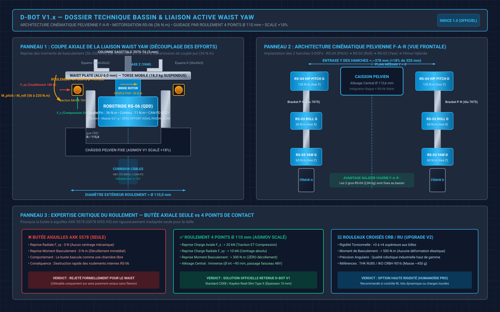
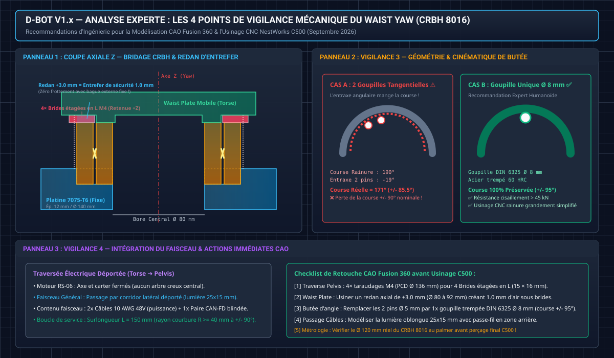
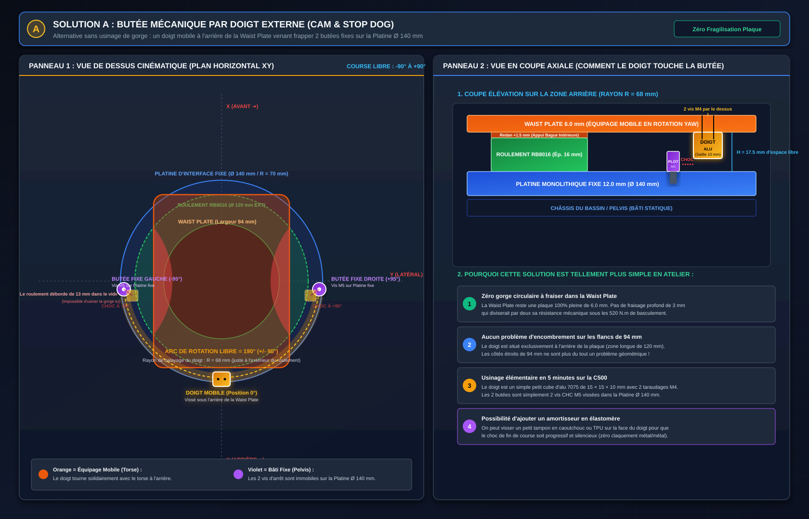
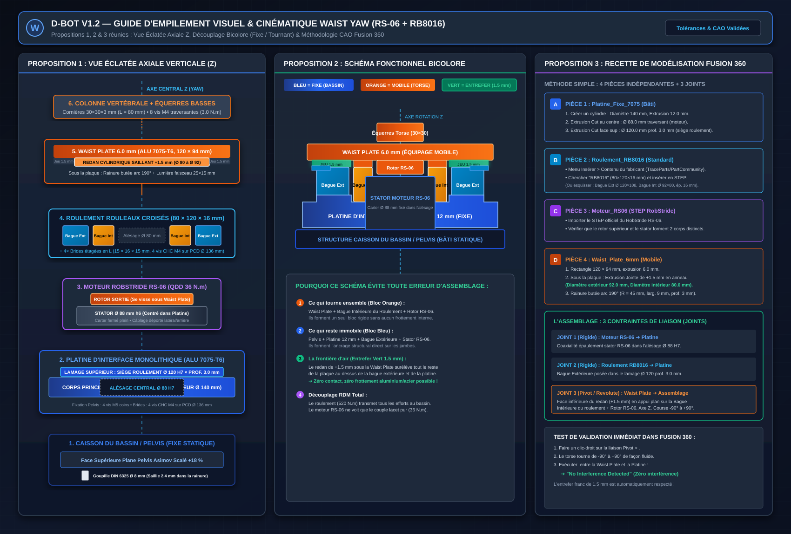
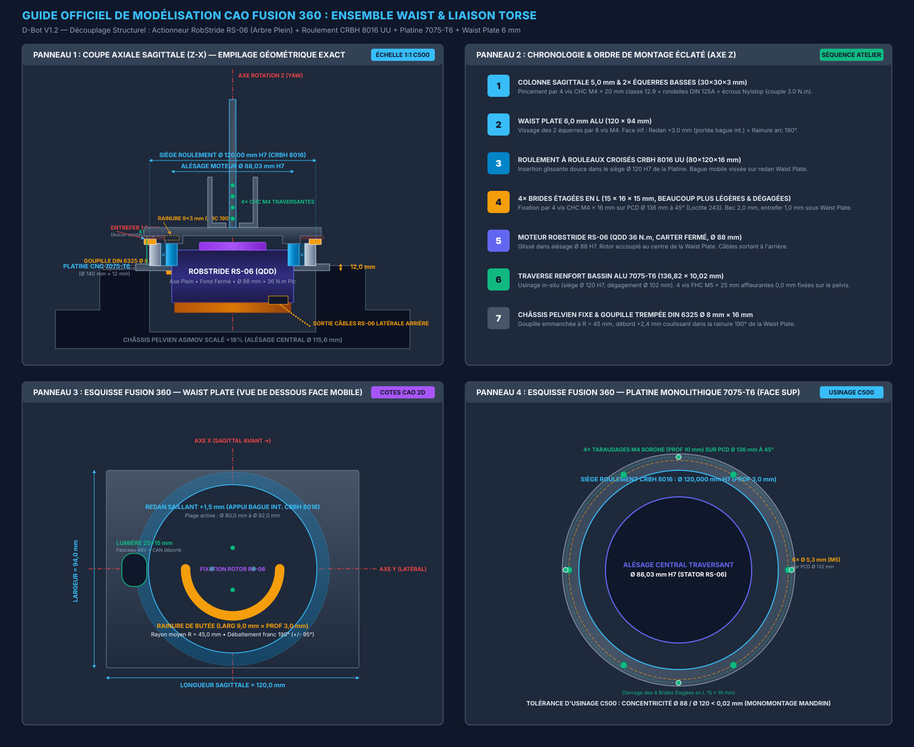
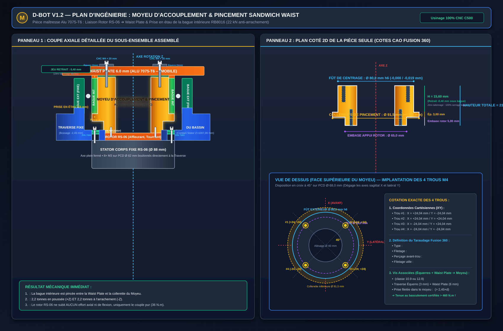

# 🦾 Dossier Technique : Bassin (Pelvis) & Liaison Active Waist Yaw — D-Bot V1.x

> **Statut** : Document de référence officiel — Conception Mécanique & Dimensionnement  
> **Auteur** : Équipe D-Bot & Pair-Programming Antigravity  
> **Date** : Septembre 2026  
> **Version** : 1.2 (Roulement CRBH 8016 validé & Platine d'Interface Waist monolithique — Septembre 2026)  
> **Système CAO** : Autodesk Fusion 360 (Scale Torse & Bassin +18 %, facteur 1,18)

---

## 📑 Sommaire

- [1. Architecture Globale & Rôle Fonctionnel du Bassin](#1-architecture-globale--rôle-fonctionnel-du-bassin)
  - [1.1 Contexte Morphologique du D-Bot V1.x](#11-contexte-morphologique-du-d-bot-v1x)
  - [1.2 Le Rôle Pivot du Waist Yaw (Lacet de Taille)](#12-le-rôle-pivot-du-waist-yaw-lacet-de-taille)
  - [1.3 Le Bassin comme Nœud de Répartition Structurel](#13-le-bassin-comme-nœud-de-répartition-structurel)
- [2. Bilan Biomécanique & Cartographie Complète des Efforts](#2-bilan-biomécanique--cartographie-complète-des-efforts)
  - [2.1 Bilan des Masses Suspendues au-dessus du Waist](#21-bilan-des-masses-suspendues-au-dessus-du-waist)
  - [2.2 Charge Axiale Pure (Compression Statique & Dynamique)](#22-charge-axiale-pure-compression-statique--dynamique)
  - [2.3 Moments de Basculement Critiques (Tangage Pitch & Roulis Roll)](#23-moments-de-basculement-critiques-tangage-pitch--roulis-roll)
  - [2.4 Forces Radiales de Cisaillement](#24-forces-radiales-de-cisaillement)
  - [2.5 Couple de Rotation en Lacet (Yaw Torque)](#25-couple-de-rotation-en-lacet-yaw-torque)
- [3. Analyse Critique des Roulements & Choix Technologique](#3-analyse-critique-des-roulements--choix-technologique)
  - [3.1 Diagnostic de la Butée Axiale à Aiguilles Seule (AXK 5578 / OD78 ID55 H5)](#31-diagnostic-de-la-butée-axiale-à-aiguilles-seule-axk-5578--od78-id55-h5)
  - [3.2 Benchmark Asimov v1 : Pourquoi l'Absence de Roulement Externe est Inadaptée au D-Bot](#32-benchmark-asimov-v1--pourquoi-labsence-de-roulement-externe-est-inadaptée-au-d-bot)
  - [3.3 Roulement 4 Points Section Mince (Étude Initiale — Remplacé)](#33-roulement-4-points-section-mince-étude-initiale--remplacé)
  - [3.4 Solution Retenue : Roulement à Rouleaux Croisés CRBH 8016 (80×120×16 mm)](#34-solution-retenue--roulement-à-rouleaux-croisés-crbh-8016-80×120×16-mm)
  - [3.5 Tableau Synthétique Comparatif des Solutions de Guidage](#35-tableau-synthétique-comparatif-des-solutions-de-guidage)
- [4. Motorisation du Waist Yaw : Intégration du RobStride RS-06](#4-motorisation-du-waist-yaw--intégration-du-robstride-rs-06)
  - [4.1 Spécifications de l'Actionneur RS-06](#41-spécifications-de-lactionneur-rs-06)
  - [4.2 Platine d'Interface Waist Monolithique CNC (Alu 7075-T6, Ø 140 × 12 mm)](#42-platine-dinterface-waist-monolithique-cnc-alu-7075-t6-ø-140--12-mm)
  - [4.3 Schéma de Transmission & Découplage des Charges](#43-schéma-de-transmission--découplage-des-charges)
  - [4.4 Schéma Vectoriel d'Ingénierie & Détails d'Exécution CRBH 8016](#44-schéma-vectoriel-dingénierie--détails-dexécution-crbh-8016)
- [5. Interfaces Mécaniques & Chaîne Cinématique Pelvienne](#5-interfaces-mécaniques--chaîne-cinématique-pelvienne)
  - [5.1 Interface Supérieure : Waist Plate 6,0 mm & Équerres Basses L = 80,0 mm](#51-interface-supérieure--waist-plate-60-mm--équerres-basses-l--800-mm)
    - [5.1.1 Cartographie Complète des Perçages, Fraisures FHC M4 & Pincement Sandwich](#511-cartographie-complète-des-perçages-fraisures-fhc-m4--pincement-sandwich)
  - [5.2 Le Bloc Pelvien Inférieur (Pelvis Asimov Scalé +18 %)](#52-le-bloc-pelvien-inférieur-pelvis-asimov-scalé-18-)
  - [5.3 Connexion avec les Hanches en Chaîne F-A-R (RS-04 Hip Pitch)](#53-connexion-avec-les-hanches-en-chaîne-f-a-r-rs-04-hip-pitch)
  - [5.4 Système de Butée Angulaire : Rainure Interne vs Doigt Externe (Solution A)](#54-système-de-butée-angulaire--rainure-interne-vs-doigt-externe-solution-a)
  - [5.5 Corridor de Traversée du Faisceau (48V & Bus CAN-FD)](#55-corridor-de-traversée-du-faisceau-48v--bus-can-fd)
- [6. Nomenclature Matérielle & Approvisionnement (BOM)](#6-nomenclature-matérielle--approvisionnement-bom)
- [7. Recommandations de Modélisation CAO Fusion 360](#7-recommandations-de-modélisation-cao-fusion-360)
  - [7.1 Import Direct du Modèle 3D CAO du Roulement (Méthode Recommandée Fusion 360)](#71-import-direct-du-modèle-3d-cao-du-roulement-méthode-recommandée-fusion-360)
  - [7.2 Procédure de Modélisation & Assemblage Sous Fusion 360](#72-procédure-de-modélisation--assemblage-sous-fusion-360)
  - [7.3 Modélisation du Moyeu d'Accouplement & Pincement Sandwich (Alu 7075-T6)](#73-modélisation-du-moyeu-daccouplement--pincement-sandwich-alu-7075-t6)
- [8. Checklist de Contrôle & Métrologie Avant Usinage C500](#8-checklist-de-contrôle--métrologie-avant-usinage-c500)

---

## 1. Architecture Globale & Rôle Fonctionnel du Bassin

### 1.1 Contexte Morphologique du D-Bot V1.x

Le robot humanoïde bipède **D-Bot V1.x** est dimensionné selon les caractéristiques anthropomorphes suivantes :
- **Hauteur totale** : `~1,55 m` (ajustée suite à l'agrandissement de +18 % du torse et du bassin, hauteur torse = `432,67 mm`).
- **Masse totale de référence** : `~40,4 kg` (châssis hybride alu/carbone, 27 moteurs RobStride QDD, 2 packs batteries 12S Li-Ion, préhenseurs D-Hand).
- **Origine CAO du torse et du bassin** : Dérivés des fichiers open-source du projet **Asimov v1** (Menlo Research), soumis à un **facteur d'échelle de 1,18 (+18 %)** afin de loger sans interférence les gros actionneurs d'épaules et de hanches **RobStride RS-04** (Ø 120 mm).

*Blueprint d'ingénierie vectoriel officiel du bloc pelvien et de la liaison active Waist Yaw (D-Bot V1.x). Panel 1 : Coupe axiale montrant le découplage mécanique entre la reprise des moments de basculement (56 à 220 N.m) par le roulement à section mince Ø 110 mm et la transmission du couple pur (36 N.m) par le moteur RobStride RS-06 centré via sa bague CNC Alu 6061-T6 (Ø 88 / Ø 115,6 mm). Panel 2 : Architecture pelvienne en vue de face en chaîne cinématique F-A-R (RS-04 Pitch ➔ RS-03 Roll ➔ RS-03 Yaw, entraxe hanches ~378 mm). Panel 3 : Expertise critique des roulements comparant l'inadéquation de la butée AXK 5578 seule au roulement 4 points de contact.*

### 1.2 Le Rôle Pivot du Waist Yaw (Lacet de Taille)

L'articulation du **Waist Yaw (rotation Z de la taille)** assure une fonction essentielle dans la commande globale du robot (Whole-Body Control / WBC) :
1. **Dissociation Locomotion / Manipulation** : Permet au haut du corps d'orienter le buste et les deux bras vers une zone de travail (table, étagère, préhension asymétrique) pendant que le bassin et les jambes maintiennent une trajectoire de marche stable en ligne droite.
2. **Compensation du Moment Cinétique (Balancement)** : Lors de la marche dynamique, l'oscillation en contre-phase du buste et des bras permet d'annuler une partie du moment d'inertie de lacet produit par les jambes en mouvement alternatif, réduisant l'effort nécessaire au sol pour ne pas dévier de cap.
3. **Réduction de la Dépense Énergétique** : Évite de devoir faire tourner l'ensemble du robot "en crabe" ou en pas chassés pour des ajustements d'orientation du haut du corps de +/- 45°.

### 1.3 Le Bassin comme Nœud de Répartition Structurel

Le bassin mécanique (Pelvis) constitue le carrefour le plus sollicité de tout le robot :
- Il reçoit **vers le haut** l'intégralité du poids et des moments de basculement du torse, des bras et de la tête via la **Waist Plate** et la liaison pivot de taille.
- Il transmet **vers le bas** l'ensemble des charges aux deux jambes via les actionneurs **RS-04 Hip Pitch** fixés sur ses flancs droit et gauche (entraxe transversal `Y = ~378 mm`).
- Il héberge les répartiteurs de puissance électrique secondaire (mini-busbars 6 bornes 60V pour la distribution vers les membres inférieurs).

---

## 2. Bilan Biomécanique & Cartographie Complète des Efforts

### 2.1 Bilan des Masses Suspendues au-dessus du Waist

Toutes les masses situées au-dessus du plan de joint de la taille sont intégralement portées par le module Waist Yaw. Le tableau ci-dessous détaille cette masse suspendue en configuration V1 officielle :

| Sous-Système | Composants Inclus | Masse Estimée |
| :--- | :--- | :---: |
| **Squelette Métallique Torse V2 (Alu 7075/6060)** | Colonne sagittale, brides monoblocs, traverses tube carré, inserts, éclisses, équerres, tuyères, ventilateurs, visserie | `1 754 g` |
| **Coques & Carénages Abdominaux** | Coques imprimées PA12-CF (Thorax, Abdomen) | `1 000 g` |
| **Moteurs d'Épaules & Bras (x2)** | 2x RS-04 Pitch, 2x RS-03 Roll, 2x RS-02 Yaw, 2x RS-03 Coude, 2x RS-02 Sup, 2x RS-00 | `8 420 g` |
| **Membres Supérieurs (Bras Carbone & D-Hand)** | Tubes carbone 3K, brides alu, 2 mains D-Hand Hybrid Premium | `2 100 g` |
| **Tête & Cou** | 2x moteurs RS-05, équerres cou, caméra RGB-D RealSense, structure tête | `1 150 g` |
| **Pack Énergie Torse (Batteries 12S)** | 2 packs Li-Ion 12S / 50V montés en paniers latéraux hot-swap | `1 600 g` |
| **Électronique & Câblage Haut** | Jetson Orin Nano / AGX, PDB haute puissance, diodes ORing, faisceaux | `950 g` |
| **Marge & Quincaillerie Non Comptée** | Marge forfaitaire câbles, capteurs, fixations diverses | `350 g` |
| **TOTAL MASSE SUSPENDUE (Haut du Corps)** | **Torse V2 + Bras + Tête + Énergie + Calcul** | **`~17 324 g (~17,3 kg)`** |

> [!NOTE]
> **Révision Septembre 2026** : Le bilan de masse a été révisé pour refléter l'architecture Torse V2 Tout Métal. L'ancien squelette (cage alu boulonnée V1 à 2 360 g) a été remplacé par le squelette séminal métallique V2 à 1 754 g. Le total masse suspendue passe de ~18,3 kg à **~17,3 kg**. Tous les calculs d'efforts et de moments restent valides car conservatifs (dimensionnés sur 18,3 kg).

### 2.2 Charge Axiale Pure (Compression Statique & Dynamique)

- **Effort Axial Statique (F_z_stat)** :
  `F_z_stat = m_suspendue * g = 18,3 kg * 9,81 m/s^2 = 179,5 N (~180 N)`
- **Facteur d'Accélération Dynamique (Marche & Réception de Saut)** :
  Lors de la marche normale, les accélérations verticales alternées introduisent un facteur de charge de `1,5 à 2,0 g`. En cas de trébuchement, d'arrêt d'urgence ou de choc dynamique, le facteur d'impact atteint couramment `3,0 g`.
  `F_z_dyn_max = 3,0 * F_z_stat = 3,0 * 180 N = 540 N`

> **Constat Axial** : La force de compression verticale pure (`180 N` statique, `540 N` pic dynamique) est modérée. N'importe quel roulement à aiguilles ou à billes du commerce reprend plusieurs kilonewtons en compression pure. **Le véritable défi mécanique ne se situe pas là.**

### 2.3 Moments de Basculement Critiques (Tangage Pitch & Roulis Roll)

Le centre de gravité (CdG) du haut du corps est situé à environ `h_CdG = 220 à 250 mm` au-dessus de la Waist Plate. De plus, les bras peuvent s'étendre horizontalement en avant ou sur les côtés (portée `~0,55 m`), portant des charges utiles (manipulation de charges jusqu'à 3 kg par main).

#### A. Moment de Tangage Sagittal (Pitch — Avant / Arrière)
- **Posture Droite (Statique)** : En posture neutre, un léger désalignement de 30 mm du CdG produit :
  `M_pitch_statique = 180 N * 0,03 m = 5,4 N.m`
- **Flexion du Buste en Avant (30° d'inclinaison)** : Le CdG avance de `~120 mm` :
  `M_pitch_flexion = 180 N * 0,12 m = 21,6 N.m`
- **Deux Bras Tendus Portant 2 kg Chacun** :
  `M_pitch_bras = (2 bras * 1,2 kg + 2 charges * 2,0 kg) * 9,81 * 0,55 m = 6,4 kg * 9,81 * 0,55 m = 34,5 N.m`
  `M_pitch_total = 21,6 + 34,5 = 56,1 N.m`
- **Accélération / Décélération Brusque (Freinage d'Urgence)** :
  Une décélération horizontale de `1,0 g` sur le buste à `h = 0,25 m` de la taille génère :
  `M_pitch_choc = 180 N * 0,25 m = 45 N.m` (qui s'additionne au moment de flexion).
- **Moment Sagittal Pic de Calcul (Dimensionnement Châssis Torse V2)** :
  La colonne vertébrale est calculée pour un choc de basculement extrême de **`275 N.m`** (facteur de sécurité `Sf = 12,58` dans l'Alu 7075-T6).

#### B. Moment de Roulis Frontal (Roll — Gauche / Droite)
- **Marche sur une Jambe d'Appui (Single Support Phase)** :
  Le bassin bascule latéralement de 2 à 5°. Pour stabiliser le buste, le robot compense par un moment latéral :
  `M_roll_marche = 25 à 45 N.m`
- **Port de Charge Asymétrique (3 kg dans une seule main, bras tendu à 0,50 m)** :
  `M_roll_charge = (3,0 kg + 1,2 kg bras) * 9,81 * 0,50 m = 20,6 N.m`
- **Moment Frontal Pic Combiné** :
  `M_roll_pic = 60 à 110 N.m`

### 2.4 Forces Radiales de Cisaillement

Les accélérations latérales et sagittales lors des transferts d'appui de la marche bipède exercent un cisaillement horizontal direct sur la liaison rotative :
`F_radial_dyn = m_suspendue * a_transversale = 18,3 kg * (0,5 à 1,0 g) = 90 à 180 N` (avec des pics à `~300 N` lors des impacts au sol).

### 2.5 Couple de Rotation en Lacet (Yaw Torque)

- **Couple résistant en rotation pure** : Généré par l'inertie de rotation du buste (`I_zz ~ 0,18 kg.m^2`) lors des accélérations angulaires rapides (`alpha = 20 à 50 rad/s^2`) :
  `T_yaw_dyn = I_zz * alpha = 0,18 * 50 = 9,0 N.m`
- **Couple Pic Prévu pour le Moteur RS-06** : **`36 N.m`** (avec un couple continu nominal de **`11 N.m`**).
  Le ratio de couple disponible / couple requis est :
  `Ratio = 36 N.m / 9 N.m = 4,0 (Marge de sécurité confortable de 300 %)`

---

## 3. Analyse Critique des Roulements & Choix Technologique

### 3.1 Diagnostic de la Butée Axiale à Aiguilles Seule (AXK 5578 / OD78 ID55 H5)

La référence `THRUST-BEARING-OD78ID55H5` correspond au standard ISO **AXK 5578** (cage à aiguilles axiale `55 × 78 × 3 mm` accompagnée de deux rondelles de roulement trempées `AS 5578` de 1 mm, épaisseur totale = `5,00 mm`).

*(Voir l'illustration détaillée du phénomène de décollement dans le **Panneau 3 du blueprint vectoriel** ci-dessus).*

#### Diagnostic d'Inadéquation de l'AXK 5578 Seule à la Taille :
1. **Zéro Reprise Radiale (0 N)** : Une butée axiale n'a strictement aucun épaulement de guidage radial. Les rondelles plates glisseraient librement sur le plan XY sous le moindre effort de cisaillement transversal (`90 à 300 N`), désaxant immédiatement le rotor du moteur RS-06 et endommageant ses réducteurs planétaires.
2. **Fonctionnement Unidirectionnel Ouvert (Décollement sous Moment)** : Une butée axiale ne travaille qu'en compression pure d'un seul côté. Dès qu'un moment de tangage (`M_pitch > 5,4 N.m`) est appliqué :
   - Le bord avant de la butée encaisse toute la charge en contrainte locale ponctuelle.
   - Le bord arrière **se décolle physiquement de son appui** car la butée est incapable d'exercer la moindre traction.
   - Il en résulte un **jeu angulaire majeur**, le buste du robot bascule d'avant en arrière comme une charnière branlante, rendant impossible tout équilibrage par le contrôleur RL.
3. **Risque Mortel pour l'Actionneur RS-06** : Si la butée n'empêche pas le basculement, c'est le petit roulement interne du moteur RobStride RS-06 qui se retrouve à encaisser le moment de flexion de `50 à 110 N.m`, entraînant la destruction des roulements internes du moteur et la casse des satellites du réducteur.

> [!CAUTION]
> **Conclusion Formelle** : Le roulement à aiguilles `AXK 5578` **ne peut absolument pas être utilisé seul** pour assurer la liaison rotative du Waist. Il exigerait l'ajout d'au minimum deux roulements rigides à billes à gorge profonde supplémentaires pour le guidage radial et d'un système de précharge bilatérale complexe, annulant tout gain d'encombrement.

---

### 3.2 Benchmark Asimov v1 : Pourquoi l'Absence de Roulement Externe est Inadaptée au D-Bot

L'inspection approfondie du modèle CAO d'origine de l'**Asimov v1** (Menlo Research) montre que la plaque inférieure du torse est vissée directement sur la bride de sortie d'un gros actionneur modulaire intégré (type AK80 / Unitree), sans roulement auxiliaire externe :

1. **Le Contexte Spécifique d'Asimov v1** :
   - Le robot Asimov d'origine est un prototype de laboratoire de dimension modeste (1,20 m, ~30-35 kg), doté d'un haut de corps très compact (< 14 kg).
   - L'actionneur employé intègre d'origine un roulement de sortie renforcé à double rangée de billes ou à contact oblique capable de tolérer des moments légers à faible vitesse.
   - Les concepteurs ont visé un compromis d'extrême compacité axiale (zéro millimètre ajouté en Z) au détriment de la rigidité sous forte dynamique.

2. **Pourquoi D-Bot V1.x Ne Peut Pas Adopter ce Montage Direct** :
   - **Masse Suspendue Élevée** : Le torse du D-Bot est agrandi de **+18 %**, pèse **18,3 kg** suspendus (avec deux packs 12S Li-Ion en fond de coffre et des bras de 55 cm portant des charges).
   - **Moteur RobStride RS-06 Ultra-Compact** : Le RS-06 (621 g, Ø 88 mm) a été choisi pour son ratio couple/masse exceptionnel (36 N.m pic), mais ses roulements internes sont petits et optimisés pour la rotation, pas pour faire office de palier structural de tout le squelette.
   - **Conclusion Mécanique** : Confier les 18,3 kg et les moments de basculement de `56 à 220 N.m` aux seuls roulements internes du RS-06 provoquerait un matage rapide des pistes, l'arc-boutement des satellites planétaires et une destruction rapide de l'actionneur.

---

### 3.3 Roulement 4 Points Section Mince (Étude Initiale — Remplacé)

> [!NOTE]
> **Section conservée pour traçabilité.** L'étude initiale préconisait un roulement à 4 points de contact section mince (Ø int 90 mm, Ø ext 110 mm, ép 10 mm, type CSXB / Kaydon Reali-Slim). Cependant, **aucune référence standard n'existe en ces dimensions exactes**. Les séries CSXB ont des cotes impériales (pouces), et la conversion la plus proche ne correspond pas aux cotes métriques spécifiées. Le sourcing s'est avéré impossible dans des délais et coûts raisonnables. Cette solution est donc **remplacée** par le roulement à rouleaux croisés CRBH 8016 (section 3.4).

Les principes d'ingénierie restent valides :
1. **Géométrie en Arc Gothique** : Chaque bille en contact en 4 points simultanés avec les bagues (traction + compression bilatérale).
2. **Reprise simultanée des 3 composantes d'efforts** : axiale, radiale, et moment de basculement.
3. **Section mince → grand alésage central** pour le passage des câbles.

---

### 3.4 Solution Retenue : Roulement à Rouleaux Croisés CRBH 8016 (80×120×16 mm)

Après étude de sourcing approfondie (Septembre 2026), la solution retenue pour le D-Bot est un **roulement à rouleaux croisés standard industriel** :

#### Référence Validée : CRBH 8016 UU (ou équivalent RB 8016 UU)

| Paramètre | Valeur |
| :--- | :---: |
| **Diamètre Intérieur (Ø int)** | **`80 mm`** |
| **Diamètre Extérieur (Ø ext)** | **`120 mm`** |
| **Épaisseur (B)** | **`16 mm`** |
| **Type de Roulement** | Rouleaux croisés 90 deg, bagues intégrales (non fendu) |
| **Joints** | UU (joints des 2 côtés, protection poussière) |
| **Classe de Précision** | **P5** minimum (runout < 0,01 mm) |
| **Matériau** | Acier à roulement GCr15 trempé (62 HRC) |
| **Charge Axiale Dynamique (Ca)** | ~22 kN |
| **Charge Radiale Dynamique (Cr)** | ~15 kN |
| **Moment de Basculement Statique (M0)** | **~520 N.m** |
| **Rigidité en Basculement** | ~250 N.m/arcmin |
| **Masse** | ~250-350 g |
| **Passage Central Câbles** | **Ø 80 mm** (largement > 40 mm requis) |

#### Pourquoi les Rouleaux Croisés sont Supérieurs au 4 Points :
1. **Rigidité torsionnelle 3 à 4 fois supérieure** au roulement à billes : les rouleaux cylindriques disposés en croix à 90 deg dans une gorge en V unique offrent une déformation élastique quasi-nulle sous fort moment de basculement.
2. **Capacité en moment de basculement : 520 N.m** (vs ~300 N.m pour un 4 points de section comparable), soit un facteur de sécurité de **x2,36** face au pire cas D-Bot (arrêt d'urgence à 220 N.m).
3. **Standard industriel immédiatement disponible** : Référence de catalogue (THK, IKO, génériques Luoyang), disponible sur AliExpress pour **60 à 90 EUR** en 2-4 semaines.
4. **Technologie de référence en robotique humanoïde** : Les robots Unitree H1/G1, Figure 02, et Tesla Optimus utilisent tous des rouleaux croisés pour leurs articulations à forte charge.

#### Sourcing Validé (Septembre 2026)

| Fournisseur | Plateforme | Recherche / Référence | Prix Estimé | Délai |
| :--- | :--- | :--- | :---: | :---: |
| **Luoyang (Chine)** | [AliExpress](https://www.aliexpress.com) | Rechercher **"CRBH8016 UU crossed roller bearing P5"** | **40 à 90 EUR** | 2-4 sem. |
| **123Roulement (France)** | [123roulement.com](https://www.123roulement.com) | Contacter le service client : **"CRBH 8016 UU"** | **150 à 350 EUR** (devis) | 2-6 sem. |
| **Rubix (France)** | [rubix.com/fr](https://www.rubix.com/fr-fr/) | Devis **"Roulement rouleaux croisés 80x120x16"** | **200 à 400 EUR** | 3-6 sem. |
| **MISUMI Europe** | [misumi-ec.com](https://www.misumi-ec.com) | Configurateur série THK **RB 8016** | **250 à 500 EUR** | 2-4 sem. |

> [!IMPORTANT]
> **Statut** : Commande à effectuer immédiatement — le roulement est sur le **chemin critique** de la fabrication du bassin. Les cotes de la Platine d'Interface Waist seront validées définitivement une fois le roulement reçu et mesuré au pied à coulisse.

---

### 3.5 Tableau Synthétique Comparatif des Solutions de Guidage

| Critère Mécanique | Butée Aiguilles AXK 5578 (Seule) | Montage Direct sur Moteur (Asimov v1) | ~~Roulement 4 Pts Section Mince~~ | **Rouleaux Croisés CRBH 8016 ✅** |
| :--- | :---: | :---: | :---: | :---: |
| **Reprise Charge Axiale (F_z)** | Excellente (> 100 kN) | Modérée (~1,5 kN) | ~~Excellente (> 20 kN)~~ | **Exceptionnelle (> 22 kN)** |
| **Reprise Charge Radiale (F_xy)** | **NULLE (0 N) ❌** | Modérée (~1 kN) | ~~Excellente (> 10 kN)~~ | **Exceptionnelle (> 15 kN)** |
| **Reprise Moment Basculement** | **NULLE (Décollement) ❌** | Faible (< 40 N.m) | ~~> 300 N.m~~ | **> 520 N.m ✅** |
| **Protection du Moteur RS-06** | Nulle (Moteur détruit) | Nulle (Moteur en direct) | ~~100% découplé~~ | **100% découplé ✅** |
| **Jeu Angulaire sous Moment** | Inacceptable (Bascule) | Prise de jeu progressive | ~~Zéro (précharge)~~ | **Zéro absolu (ultra-rigide) ✅** |
| **Passage Central Câblage** | Moyen (Ø 55 mm) | Restreint | ~~Ø 90 mm~~ | **Ø 80 mm ✅** |
| **Hauteur / Épaisseur Z** | Ultra-fine (5 mm) | Nulle (0 mm) | ~~10 mm~~ | **16 mm** (compensé par la Platine) |
| **Disponibilité Marché** | Standard | N/A | ~~Introuvable ❌~~ | **Standard industriel ✅** |
| **Prix** | ~10 EUR | 0 EUR | ~~Inconnu (custom)~~ | **60-90 EUR ✅** |
| **Verdict D-Bot V1.2** | **REJETÉ ❌** | **REJETÉ ❌** | **REMPLACÉ** | **SOLUTION OFFICIELLE ✅** |

---

## 4. Motorisation du Waist Yaw : Intégration du RobStride RS-06

### 4.1 Spécifications de l'Actionneur RS-06

L'actionneur **RobStride RS-06** a été sélectionné, commandé et validé pour motoriser l'axe Waist Yaw :
- **Technologie** : Moteur synchrone sans balais à aimants permanents avec réducteur planétaire intégré (Quasi-Direct Drive — QDD).
- **Couple Maximal (Pic)** : **`36 N.m`**.
- **Couple Continu (Nominal)** : **`11 N.m`**.
- **Vitesse Maximale** : **`~31 rad/s (300 rpm)`**.
- **Diamètre Extérieur Carter (Stator)** : **`Ø 88,0 mm`**.
- **Épaisseur Totale** : **`~41,5 mm`**.
- **Masse** : **`621 g`**.
- **Protocole de Communication** : CAN-FD haute vitesse, identifiant officiel : **`ID CAN = 21`** (terminaison 120 ohms intégrée ou chaînée).

### 4.2 Platine d'Interface Waist Monolithique CNC (Alu 7075-T6, Ø 140 × 12 mm)

> [!NOTE]
> **Révision V1.2 (Septembre 2026)** : La bague d'adaptation séparée (Ø int 88 / Ø ext 115,6 mm, collerette Ø 124) de la V1.1 est **supprimée et remplacée** par une Platine d'Interface monolithique. Raison : la collerette (Ø 124 mm) entre en interférence radiale avec la bague externe du roulement CRBH 8016 (Ø ext 120 mm) sur la face du pelvis. La Platine monolithique élimine ce conflit en intégrant le siège du roulement ET le centrage du moteur en une seule pièce CNC.

#### Contexte Dimensionnel :
Le châssis pelvien d'Asimov v1 comportait initialement un logement circulaire de **`Ø 98,0 mm`** (conçu pour un moteur Cubemars AK80). Avec le facteur d'échelle global de **`+18 % (×1,18)`**, cet alésage passe à `Ø 115,64 mm (~115,6 mm)`. Le moteur RS-06 (Ø 88 mm) s'insère dans l'alésage Ø 88 H7 de la Platine, qui elle-même se pose sur la face supérieure du pelvis au-dessus de l'alésage Ø 115,6 mm.

#### Définition de la Platine d'Interface Waist :
- **Matière** : Aluminium **7075-T6** (résistance mécanique maximale, excellent dissipateur thermique).
- **Brut** : Disque Ø 150 × 15 mm Alu 7075-T651 (Blockenstock, ~12-15 EUR TTC).
- **Diamètre Extérieur Fini** : **`Ø 140,0 mm (+/- 0,2 mm)`**.
- **Épaisseur Finie** : **`12,0 mm (+/- 0,05 mm)`** (surfaçage CNC des 2 faces).
- **Alésage Central (Moteur RS-06)** : **`Ø 88,03 mm H7 (+0,000 / +0,035)`** — traversant sur toute l'épaisseur. Ajustement glissant juste sur le carter cylindrique Ø 88 h6 du RS-06.
- **Siège Roulement (Recess Face Supérieure)** : **`Ø 120,000 mm H7 (+0,000 / +0,035)`**, profondeur **`3,0 mm (+/- 0,05 mm)`** — centre et retient axialement la bague externe du CRBH 8016. Épaisseur résiduelle sous le siège = 9,0 mm.
- **6× Trous de Fixation Platine ➔ Pelvis** : **`Ø 5,3 mm traversants`**, répartis sur PCD **`Ø 132 mm`** à 60° — pour vis CHC M5 × 20 mm fixant la Platine sur la face supérieure du pelvis.
- **4× Taraudages M3 pour Flasque de Retenue Axiale Z** : 4 perçages borgnes taraudés M3 à 90° sur PCD **`Ø 128,0 mm`**, profondeur taraudée utile 6,0 mm. Ils reçoivent un flasque circulaire mince en aluminium (épaisseur 2,5 à 3,0 mm, Ø int 118 mm / Ø ext 136 mm) bridé par 4 vis FHC M3 × 8 mm pour empêcher tout glissement de la bague extérieure du roulement vers le haut (+Z) en cas de saut ou choc dynamique.
- **Concentricité Ø 88 / Ø 120** : **`< 0,02 mm`** (usiner les deux alésages dans le même montage mandrin sur la C500).
- **Planéité Face Inférieure** : **`< 0,03 mm`** (appui franc sur le pelvis).
- **Chanfreins** : 0,5 mm × 45° en entrée des alésages Ø 88 et Ø 120 (2 côtés), 0,3 mm × 45° périphérique.
- **Masse de la Platine Finie** : **`~265 g`**.
- **Fonction Thermique** : Les 12 mm d'Alu 7075-T6 autour du Ø 88 du moteur (section radiale de 26 mm de large) assurent la conduction thermique du stator RS-06 vers la structure du pelvis (~15-20 W en régime nominal de 11 N.m continu).

> [!IMPORTANT]
> **Gamme d'usinage sur NestWorks C500** : Pièce 2.5D usinable en 2 retournements sur la NestWorks C500 (~45 min).
> - Phase 1 (face sup) : surfaçage + siège Ø 120 H7 × 3 mm + alésage Ø 88 H7 traversant + 6 perçages PCD Ø 132 + 4 taraudages M3 PCD Ø 128 + chanfreins.
> - Phase 2 (retournement) : surfaçage face inf à 12 mm + chanfrein alésage Ø 88 côté inf + ébavurage.
>
> **RÈGLE ATELIER INVIOLABLE** : Ne pas usiner le siège Ø 120 H7 avant d'avoir réceptionné le roulement CRBH 8016 UU. Mesurer le diamètre extérieur effectif au palmer et ajuster le parcours d'outil pour un ajustement glissant juste (**H7/h6**, soit 0.000 à +0.020 mm de jeu effectif).

### 4.3 Schéma de Transmission & Découplage des Charges

Le principe fondamental de la conception mécanique du D-Bot est le **découplage absolu entre la génération de couple et la reprise des charges structurales** :

1. **Le Roulement CRBH 8016 (Ø 80×120×16 mm)** encaisse l'intégralité des efforts perturbateurs : les `~17,3 kg` de compression axiale, les `180 N` de cisaillement et les `56 à 220 N.m` de moment de basculement. Sa capacité en moment (520 N.m) offre un facteur de sécurité de x2,36 dans le pire cas.
2. **Le Moteur RobStride RS-06** n'encaisse strictement aucun effort de basculement. Son arbre de sortie (rotor) ne transmet que le couple de rotation pur en lacet (**36 N.m max**), garantissant une durée de vie maximale et l'absence d'usure anormale des réducteurs.

### 4.4 Schéma Vectoriel d'Ingénierie & Détails d'Exécution CRBH 8016

Le schéma vectoriel ci-dessous regroupe les détails d'exécution géométrique issus de l'expertise mécanique pour un montage sans frottement et sans perte de course :

*Schéma technique d'ingénierie vectoriel officiel (D-Bot V1.2).*
- **Panneau 1 (Coupe Axiale Z)** : Détaillant le flasque mince de retenue axiale Z fixé sur la Platine (PCD Ø 128 mm) pour bloquer la bague extérieure, et le redan de +1.5 mm sous la Waist Plate créant un entrefer de sécurité de 1.5 mm face à la bague extérieure fixe.
- **Panneau 2 (Cinématique de Butée)** : Démontrant que 2 goupilles espacées de 15 mm consomment 19.2° d'angle mort sur une rainure de 190°, et validant la solution optimale à goupille unique DIN 6325 Ø 8 mm (course nominale +/- 95° préservée, tenue > 45 kN).
- **Panneau 3 (Traversée Électrique & Gamme C500)** : Implantation du corridor latéral déporté (25 × 15 mm) avec boucle de service (L = 150 mm) et checklist de validation avant usinage.

---

## 5. Interfaces Mécaniques & Chaîne Cinématique Pelvienne

### 5.1 Interface Supérieure : Waist Plate 6,0 mm & Équerres Basses L = 80,0 mm

La connexion avec le haut du corps s'effectue via la **Waist Plate** (plaque inférieure du torse) :
- **Matériau** : Aluminium **6061-T6** ou **7075-T6**, épaisseur brute **`6,00 mm`**.
- **Dimensions de contour** : Portée axiale `120,0 mm`, largeur rectifiée `94,0 mm` (cohérente avec la largeur constante de la colonne sagittale).
- **Liaison avec la Colonne Sagittale** : Réalisée par les **2 Équerres Basses de Waist** (`L = 80,0 mm`, cornière Blockenstock `30 × 30 × 3,0 mm`) :
  - Flanc vertical pincé sur la colonne par **4 vis CHC M4 × 20 mm traversantes + 8 rondelles DIN 125A + 4 écrous Nylstop M4** (entraxes réguliers de 18 mm, entraxe total 54 mm).
  - Aile horizontale fixée sur la Waist Plate par **8 vis M4** réparties (4 par équerre).
  - Couple de serrage normalisé : **`3,0 N.m`** (facteur de sécurité au glissement par adhérence `Sf = 2,78` face aux 36 N.m du moteur).
- **Redan d'Appui Bague Intérieure (Face Inférieure)** :
  - Usinage d'une portée circulaire en saillie de **`+1,5 mm`** sur la plage de diamètre comprise entre **`Ø 80,0 mm et Ø 92,0 mm`** (zone de contact exclusive avec la bague intérieure mobile du CRBH 8016).
  - La surface au-delà de Ø 95,0 mm reste usinée en retrait de 1,5 mm, garantissant un **entrefer d'air franc de 1,5 mm** au-dessus de la bague extérieure fixe et du flasque de retenue axiale. Zéro frottement parasite aluminium/acier garanti.
- **Lumière Oblongue de Traversée de Faisceau** :
  - Découpe traversante de **`25,0 mm × 15,0 mm`** (rayons R = 7,5 mm) usinée en zone postérieure libre (en retrait du roulement).
  - Bords chanfreinés à 1,0 mm × 45° sur les deux faces et équipés d'un passe-fil souple en TPU imprimé 3D ou caoutchouc EPDM pour protéger le faisceau 48V et CAN-FD.

#### 5.1.1 Cartographie Complète des Perçages, Fraisures FHC M4 & Pincement Sandwich

Le verrouillage axial et la transmission du couple de rotation de taille (Waist Yaw) reposent sur un **assemblage en étau (sandwich)** ultra-rigide prenant en compression directe la bague intérieure du roulement **RB8016** (ou **CRBH8016**) entre :
1. **La face supérieure** : La **Waist Plate** (épaisseur 6,00 mm en Alu 6061-T6 ou 7075-T6), dont la face inférieure usine un redan d'appui circulaire de `+1,50 mm` (plage comprise entre Ø 80,0 mm et Ø 92,0 mm).
2. **Le roulement intermédiaire** : La bague intérieure mobile du RB8016 (alésage intérieur Ø 80,00 mm, portée extérieure Ø 95,00 mm, épaisseur axiale 16,00 mm).
3. **La pièce inférieure d'accouplement** : Le **Moyeu d'Accouplement Sandwich** (`Moyeu_Waist_Sandwich_7075` en Alu 7075-T651) :
   - Son fût cylindrique rectifié (Ø 80,00 mm tolérance h6, soit +0,000 / -0,019 mm) guide l'alésage du roulement sur ses 16,00 mm de hauteur et affleure pile au plan supérieur du roulement (`Z = 0,00 mm`).
   - Sa collerette annulaire inférieure (Ø 91,5 mm × épaisseur 3,00 mm) vient en appui franc sous la face inférieure de la bague intérieure du roulement.
   - 4 trous borgnes taraudés M4 (profondeur 12,0 mm, filet utile 10,0 mm) sont usinés dans la face supérieure du fût sur le diamètre primitif **PCD Ø 68,00 mm** (rayon R = 34,00 mm) orientés à 45,0° des axes principaux.
   - Son embase inférieure (Ø 65,0 mm) descend sous le roulement et se boulonne directement sur les perçages d'origine du rotor RobStride RS-06.

Le serrage axial est assuré par **4 vis à tête fraisée conique FHC M4 × 16 mm (ISO 10642 / DIN 7991, classe 10.9 ou 12.9)** insérées depuis le dessus de la Waist Plate et venant se visser directement dans le Moyeu 7075-T6.

---

##### A. Tableau Cartographique Millimétrique des 4 Perçages & Fraisures FHC M4

Les 4 vis sont disposées aux 4 sommets d'un carré d'entraxe linéaire de `48,08 mm` inscrit dans le cercle primitif **PCD Ø 68,00 mm** (Rayon primitif `R = 34,00 mm`). L'orientation est inclinée à exactement **`45,0°`** par rapport à l'axe sagittal (`X`) et l'axe médio-latéral (`Y`), évitant tout conflit avec l'axe longitudinal de la colonne vertébrale et les ailes des équerres basses :

`X = R * cos(45,0°) = 34,00 * 0,707107 = +24,04 mm` (ou `-24,04 mm`)  
`Y = R * sin(45,0°) = 34,00 * 0,707107 = +24,04 mm` (ou `-24,04 mm`)

| Repère Trou | Cadran & Position | Coordonnée X (Sagittale) | Coordonnée Y (Latérale) | Cote Z d'Entrée | Perçage Lisse (Waist Plate 6 mm) | Fraisure Conique 90° (Waist Plate) | Taraudage Borgne (Moyeu 7075) | Visserie Normalisée Associée |
| :---: | :--- | :---: | :---: | :---: | :--- | :--- | :--- | :--- |
| **FHC #1** | **Avant-Gauche (Av-G)** | **`+24,04 mm`** | **`-24,04 mm`** | `Z = 0,00 mm` (Face Sup.) | Foret carbure Ø 4,50 mm traversant (6 mm) | **Cône 90° Ø 8,40 mm** (prof. 2,20 mm) à fleur `0,0 mm` | Borgne Ø 3,3 mm prof. 12 mm / Taraudé M4x0.7 prof. 10 mm | Vis FHC M4 × 16 mm cl. 10.9 / Loctite 243 |
| **FHC #2** | **Avant-Droit (Av-D)** | **`+24,04 mm`** | **`+24,04 mm`** | `Z = 0,00 mm` (Face Sup.) | Foret carbure Ø 4,50 mm traversant (6 mm) | **Cône 90° Ø 8,40 mm** (prof. 2,20 mm) à fleur `0,0 mm` | Borgne Ø 3,3 mm prof. 12 mm / Taraudé M4x0.7 prof. 10 mm | Vis FHC M4 × 16 mm cl. 10.9 / Loctite 243 |
| **FHC #3** | **Arrière-Droit (Ar-D)** | **`-24,04 mm`** | **`+24,04 mm`** | `Z = 0,00 mm` (Face Sup.) | Foret carbure Ø 4,50 mm traversant (6 mm) | **Cône 90° Ø 8,40 mm** (prof. 2,20 mm) à fleur `0,0 mm` | Borgne Ø 3,3 mm prof. 12 mm / Taraudé M4x0.7 prof. 10 mm | Vis FHC M4 × 16 mm cl. 10.9 / Loctite 243 |
| **FHC #4** | **Arrière-Gauche (Ar-G)** | **`-24,04 mm`** | **`-24,04 mm`** | `Z = 0,00 mm` (Face Sup.) | Foret carbure Ø 4,50 mm traversant (6 mm) | **Cône 90° Ø 8,40 mm** (prof. 2,20 mm) à fleur `0,0 mm` | Borgne Ø 3,3 mm prof. 12 mm / Taraudé M4x0.7 prof. 10 mm | Vis FHC M4 × 16 mm cl. 10.9 / Loctite 243 |

---

##### B. Caractéristiques Géométriques de la Fraisure FHC M4 (ISO 10642 / DIN 7991)

Pour garantir un appui conique rigoureux et un **affleurement strict à 0,00 mm (zéro saillie de tête)** au-dessus de la Waist Plate :
- **Diamètre extérieur nominal du cône (en surface)** : **`Ø 8,40 mm`** (tolérance atelier `+0,10 / +0,00 mm`, soit `Ø 8,40 à Ø 8,50 mm`). Un léger micro-retrait de la tête conique de `0,05 mm` en dessous du plan supérieur est préférable à une saillie de 0,05 mm qui empêcherait le montage à plat des accessoires ou carters du torse.
- **Angle au sommet de la fraisure** : **`90,0°`** (angle normalisé métrique européen ISO 10642).
- **Diamètre de passage lisse traversant** : **`Ø 4,50 mm`** (tolérance normale ISO 273 moyen pour vis M4, laissant 0,25 mm de jeu radial pour compenser les micro-écarts d'entraxe).
- **Hauteur totale du cône de fraisure** :
  `h_cone_total = (8,40 mm - 4,00 mm) / (2 * tan(45°)) = 4,40 / 2 = 2,20 mm`
- **Hauteur apparente du cône jusqu'au diamètre de perçage Ø 4,50 mm** :
  `h_cone_trou = (8,40 mm - 4,50 mm) / (2 * tan(45°)) = 3,90 / 2 = 1,95 mm`
- **Épaisseur de matière pleine résiduelle sous la fraisure** :
  `e_residuelle = 6,00 mm - 2,20 mm = 3,80 mm`  
  Cette épaisseur de 3,80 mm d'aluminium plein sous la tête de vis garantit une résistance exceptionnelle à l'écrasement localisé et empêche tout phénomène de poinçonnement lors du serrage au couple.
- **Ébavurage face inférieure** : Sur la face inférieure de la Waist Plate (au débouché du trou Ø 4,50 mm sur le redan), réaliser un micro-chanfrein d'ébavurage de **`0,3 mm × 45°`** pour éliminer toute bavure de perçage susceptible de fausser le plaquage plan sur le redan du roulement.

---

##### C. Taraudage du Moyeu 7075-T6 & Longueur d'Implantation des Vis

Le corps du Moyeu étant en alliage haute résistance **Aluminium 7075-T651** (résistance à la rupture `Rm = 540 MPa`, limite d'élasticité `Rp0.2 = 470 MPa`) :
1. **Perçage de l'Avant-Trou Borgne** :
   - Foret hélicoïdal carbure non revêtu ou revêtu TiAlN : **`Ø 3,30 mm`** (diamètre normalisé ISO pour taraudage M4 au pas standard de `0,70 mm`).
   - Profondeur de perçage : **`12,00 mm`** depuis la face supérieure du fût.
   - Pointe de foret à 118° standard.
2. **Chanfrein d'Entrée de Taraudage** :
   - Chanfrein d'entrée usiné à la fraise conique 90° : **`0,5 mm × 45°`** (débouchant à `Ø 4,50 mm`). Ce chanfrein protège le premier filet contre l'arrachement et absorbe tout éventuel refoulement de métal lors du serrage sous forte tension.
3. **Taraudage Machine M4×0,70** :
   - Taraud machine hélicoïdal à goujures hélicoïdales (pour évacuation des copeaux vers le haut en trou borgne), tolérance **ISO 2 (6H)**.
   - Profondeur de filet utile rectifié : **`10,00 mm`**.
4. **Bilan d'Engagement de la Vis FHC M4 × 16 mm** :
   - Longueur totale sous tête de la vis FHC M4 : `L = 16,00 mm`.
   - Épaisseur traversée (Waist Plate) : `6,00 mm`.
   - Longueur de pénétration filetée dans le moyeu :  
     `L_eng = 16,00 mm - 6,00 mm = 10,00 mm`
   - Ratio d'implantation sur diamètre nominal :  
     `Ratio = L_eng / d = 10,00 mm / 4,00 mm = 2,50 * d`
   - **Conformité RDM** : La règle de l'art en construction mécanique aéronautique impose un engagement minimal de `1,5 * d` dans l'Alu 7075-T6 (soit 6,0 mm). Avec `2,5 * d` (10,0 mm), la résistance du taraudage dépasse très largement la résistance en traction de la vis en acier.
   - **Garde au fond de trou borgne** :  
     `Garde = 12,00 mm - 10,00 mm = 2,00 mm`  
     Cette garde de 2,0 mm interdit formellement tout talonnage de l'extrémité du filet de vis sur le fond conique du perçage, garantissant que 100 % du couple de serrage se transforme en précharge de serrage axial effectif.

---

##### D. Dimensionnement RDM & Tenue Mécanique du Serrage Sandwich (Zéro Glissement)

Le dimensionnement mécanique du serrage sandwich a été validé selon les critères normalisés VDI 2230 :

1. **Caractéristiques Mécaniques de la Visserie FHC M4 Classe 10.9** :
   - Section résistante sous traction : `A_s = 8,78 mm^2`.
   - Limite d'élasticité : `Re = 940 MPa`.
   - Résistance à la rupture en traction : `Rm = 1 040 MPa`.
2. **Précharge Axiale de Montage (Couple C = 2,8 N.m)** :
   - Avec un coefficient de frottement moyen sous tête et dans les filets `mu = 0,14` (lubrification légère ou frein-filet Loctite 243 à l'état liquide) :  
     `F_0 ~ C / (0,16 * P + 0,58 * d_2 * mu + 0,5 * d_tête * mu)`  
     `F_0 ~ 4 800 N` (soit `~480 kgf` de précharge élastique par vis).
3. **Effort de Pincement Axial Total du Sandwich** :
   - Sur les 4 vis réparties symétriquement :  
     `F_pincement_total = 4 * 4 800 N = 19 200 N = 19,2 kN` (soit `~1,92 tonne` de pression continue).
   - Cette compression de 19,2 kN bride infailliblement la bague intérieure du roulement RB8016, éliminant tout jeu axial parasite et garantissant une rigidité angulaire maximale en lacet.
4. **Résistance Ultime à l'Arrachement en Traction Pure (Charges Dynamiques Torse)** :
   - Capacité limite de rupture en traction des 4 vis classe 10.9 :  
     `F_rupture = 4 * A_s * Rm = 4 * 8,78 mm^2 * 1 040 MPa = 36 524 N = 36,5 kN` (soit `~3,65 tonnes`).
   - En comparaison, la capacité dynamique axiale du roulement RB8016 est de `C_a = 22,0 kN`. Le sandwich de visserie est plus résistant que le roulement lui-même (`Sf = 36,5 / 22,0 = 1,66`).
   - Sous la charge de suspension dynamique maximale du haut du corps (masse torse + bras = 17,3 kg, soit sous une décélération extrême de 3G un effort de traction axiale de `F_traction = 17,3 kg * 9,81 m/s^2 * 3 = 509 N`) :  
     `Facteur_Securite_Traction = 36 524 N / 509 N = 71,7` (marge de sécurité extrême > 70).
5. **Résistance au Cisaillement des Filets dans l'Aluminium 7075-T6** :
   - Résistance admissible au cisaillement de l'Alu 7075-T6 : `tau_rupture ~ 330 MPa`.
   - Surface de cisaillement du taraudage sur `L_eng = 10,0 mm` :  
     `A_filet = pi * d_nom * 0,75 * L_eng = 3,1416 * 4,00 mm * 0,75 * 10,00 mm = 94,25 mm^2`.
   - Résistance à l'arrachement du taraudage par vis :  
     `F_arrachement_taraudage = 94,25 mm^2 * 330 MPa = 31 100 N = 31,1 kN` par vis !  
   - Les 4 taraudages offrent une résistance théorique cumulée de `124 kN` (12,4 tonnes). La vis en acier 10.9 céderait en traction bien avant que les filets dans l'Alu 7075 ne s'arrachent.

---

##### E. Guide de Modélisation CAO Fusion 360 (Outil `Hole` / Touche `H`)

Pour implémenter ces 4 perçages fraisés avec une précision paramétrique absolue sous **Autodesk Fusion 360** :

1. **Création de l'Esquisse 2D (Face Supérieure de la Waist Plate)** :
   - Sélectionner la face supérieure plane de la Waist Plate (`Waist_Plate_6mm`).
   - Cliquer sur **Créer une esquisse** (*Create Sketch*).
   - Tracer un cercle de construction (`Type: Construction`, touche `X`) centré sur l'Origine axiale (axe Z), de diamètre **`68,00 mm`**.
   - Tracer deux droites de construction diagonales passant par le centre à **`+45,0°`** et **`-45,0°`** de l'axe X.
   - Avec l'outil **Point** (`Create > Point`), poser 4 points d'esquisse à l'intersection du cercle Ø 68 mm et des deux droites diagonales.
   - Cliquer sur **Terminer l'esquisse** (*Finish Sketch*).
2. **Génération des 4 Fraisures via la Commande Perçage (`Hole`, Touche `H`)** :
   - Taper la touche **`H`** pour ouvrir la boîte de dialogue `Hole`.
   - **Placement** : Choisir `À partir de l'esquisse (plusieurs trous)` (*From sketch (multiple holes)*). Sélectionner les 4 points créés.
   - **Type de trou (`Hole Type`)** : Choisir **Fraisé (`Countersink`)** (icône avec tête conique 90°).
   - **Type de perçage (`Hole Tap Type`)** : Choisir **Simple (`Simple`)**.
   - **Type de pointe de foret (`Drill Point`)** : Plat ou Angle (indifférent car débouchant).
   - **Étendue (`Extent`)** : Choisir `À travers tout` (*Through All*) ou `Distance = 6,00 mm`.
   - **Paramètres dimensionnels à saisir dans le volet numérique** :
     - Diamètre supérieur du cône de fraisure : **`8,40 mm`**.
     - Angle du cône de fraisure : **`90,0 deg`**.
     - Diamètre du perçage de passage lisse : **`4,50 mm`**.
   - Cliquer sur **OK**. Les 4 trous fraisés sont générés en une seule opération paramétrique propre.
3. **Modélisation des 4 Trous Borgnes Taraudés sur le Moyeu 7075-T6** :
   - Sélectionner la face supérieure du fût du composant `Moyeu_Waist_Sandwich_7075`.
   - Créer une esquisse, projeter les 4 points ou répliquer le cercle PCD Ø 68,0 mm à 45,0°.
   - Lancer la commande **Perçage (`Hole`, touche `H`)** :
     - **Type de trou (`Hole Type`)** : **Simple (`Simple Hole`)**.
     - **Type de perçage (`Hole Tap Type`)** : **Taraudé (`Tapped`)**.
     - **Profil de filetage (`Thread Type`)** : **ISO Métrique profil (`ISO Metric profile`)**.
     - **Taille (`Size`)** : **`4.0 mm`**.
     - **Désignation (`Designation`)** : **`M4x0.7`**.
     - **Classe de tolérance (`Class`)** : **`6H`**.
     - **Profondeur de perçage foret (`Hole Depth`)** : **`12,00 mm`**.
     - **Profondeur de filetage effectif (`Thread Depth`)** : **`10,00 mm`**.
     - **Pointe de foret (`Drill Point Angle`)** : **`118,0 deg`**.
   - Appliquer ensuite un **Chanfrein (`Chamfer`)** de **`0,50 mm × 45°`** sur l'arête d'entrée de chaque trou.

---

##### F. Consignes d'Atelier & Gamme d'Usinage CNC C500

Pour l'usinage sur la fraiseuse CNC NestWorks C500 :
1. **Perçage de la Waist Plate (Alu 6061-T6 ou 7075-T6)** :
   - Foret carbure monobloc Ø 4,50 mm non revêtu ou DLC (spécial aluminium).
   - Vitesse de coupe : `Vc = 120 m/min` (`N ~ 8 500 tr/min`), avance par dent `fz = 0,05 mm/dent`.
   - Cycle de perçage avec débourrage périodique (`G83`, pas de débourrage `Q = 2,0 mm`) et arrosage fluide continu pour éviter le collage de l'aluminium sur les goujures.
2. **Usinage de la Fraisure Conique 90°** :
   - **Option A (Fraise à noyer 90° standard)** : Outil à noyer carbure 3 lèvres 90° Ø 10 mm. Vitesse lente `Vc = 35 m/min` (`N ~ 1 100 tr/min`), avance `F = 60 mm/min` avec temporisation en fond de passe (`G04 P500`) de 0,5 seconde pour éliminer tout broutement et obtenir une portée miroir.
   - **Option B (Interpolation hélicoïdale à la fraise à chanfreiner)** : Fraise à chanfreiner carbure 90° 4 lèvres Ø 6 mm travaillant en interpolation hélicoïdale circulaire 3D (`G02 / G03`) sur parcours Fusion 360 CAM (`2D Bore` ou `Chamfer Milling`). Cette méthode offre un état de surface optimal et permet d'ajuster le diamètre de fraisure à `0,01 mm` près via la compensation de rayon d'outil (`D`).
3. **Contrôle Métrologique d'Affleurement à l'Établi** :
   - Insérer une vis de référence FHC M4 × 16 mm dans chaque logement.
   - Poser un réglet de précision rectifié ou un comparateur à cadran sur la face supérieure de la plaque.
   - **Critère de conformité** : La tête de vis doit se situer entre **`0,00 mm et -0,05 mm`** sous la surface (aucun accrochage au passage du doigt ou du réglet). Si la tête dépasse de `+0,02 mm`, reprendre la passe de fraisure de `0,04 mm` de profondeur.

---

### 5.2 Le Bloc Pelvien Inférieur (Pelvis Asimov Scalé +18 %)

Le caisson pelvien sert de berceau structurel :
- Il reçoit la **Platine d'Interface Waist** (Ø 140 × 12 mm) sur sa face supérieure plane, fixée par **6 vis CHC M5 × 20 mm** sur PCD Ø 132 mm.
- La Platine intègre le siège du roulement CRBH 8016 (Ø 120 H7 × 3 mm) et l'alésage de centrage du moteur RS-06 (Ø 88 H7).
- Le stator du RS-06 traverse l'alésage de la Platine et plonge dans le volume intérieur du pelvis (débord de 29,5 mm sous la Platine, dans l'alésage Ø 115,6 mm du pelvis scalé).
- Il présente une largeur d'entraxe hanches de **`Y = ~378 mm`** (largeur d'origine Asimov `320 mm × 1,18 = 377,6 mm`).

> [!NOTE]
> **Dimensions à valider** : Le Ø ext du roulement (120 mm) et le Ø ext de la Platine (140 mm) sont supérieurs à l'ancien design (Ø ext 110 mm + collerette 124 mm). L'espace disponible sur la face supérieure du pelvis (>200 mm de large) est largement suffisant. **Validation définitive après réception du roulement et essai d'assemblage à sec.**

### 5.3 Connexion avec les Hanches en Chaîne F-A-R (RS-04 Hip Pitch)

Le D-Bot V1.x utilise officiellement l'ordre cinématique **F-A-R (Flexion Pitch ➔ Abduction Roll ➔ Rotation Yaw)** pour les hanches :
- **Maillon 1 (Hip Pitch — Moteur RS-04)** :
  - Deux moteurs **RobStride RS-04** (120 N.m pic, Ø 120 mm, 1 420 g) sont montés directement sur les flancs droit et gauche du bassin.
  - Leurs axes sont colinéaires à l'axe sagittal/médio-latéral transversal (`Y`).
  - Le stator du RS-04 est rigidement boulonné au châssis pelvien.
  - Le rotor du RS-04 porte le **L-Bracket Pitch-Roll** (usinage 7075-T6) qui descend vers le moteur RS-03 Roll.
- **Avantage de cette implantation** :
  - Les deux plus lourds moteurs de jambe (`2 × 1,42 kg = 2,84 kg`) sont immobiles par rapport au bassin. Ils n'ajoutent aucune inertie lors du swing latéral de jambe, permettant une dynamique de marche optimale.

*(Consulter la représentation anatomique complète de la chaîne cinématique pelvienne F-A-R dans le **Panneau 2 du blueprint vectoriel** en tête de dossier).*

### 5.4 Système de Butée Angulaire : Rainure Interne vs Doigt Externe (Solution A)

*Schéma d'ingénierie vectoriel officiel — Butée angulaire par Doigt Externe (Solution A) : Panneau 1 — Vue de dessus cinématique montrant l'arc de balayage de 190° du doigt arrière entre les 2 butées fixes de la Platine (zéro conflit sur les flancs de 94 mm). Panneau 2 — Vue en coupe axiale XZ montrant l'impact franc du doigt sur la vis de butée sans contact avec le roulement.*

Afin de sécuriser physiquement la rotation de taille face à tout risque de vrillage destructeur du faisceau électrique :

#### Option 1 (Étude Initiale) : Rainure Borgne Creusée sous la Waist Plate
- **Principe** : Une gorge circulaire de 190° usinée sous la plaque recevant une goupille fixe DIN 6325 Ø 8 mm.
- **Limite constatée sous CAO** : La Waist Plate ne faisant que 94 mm de large au niveau des flancs (rayon 47 mm), un cercle extérieur au roulement (> Ø 120 mm) débouche dans le vide sur les côtés gauche et droit. De plus, fraiser 3 mm de profondeur dans une plaque de 6 mm réduit de moitié son inertie mécanique sous les 520 N.m de basculement.

#### Option 2 (Solution A Recommandée) : Doigt de Butée Externe Arrière (Cam & Stop Dog)
- **Principe** : Un petit doigt en aluminium (15 × 15 × 10 mm) vissé sous la face arrière de la Waist Plate (zone longue de 120 mm) vient frapper deux vis de butée fixes (CHC M5) implantées à -95° et +95° sur la Platine d'Interface fixe (Ø 140 mm).
- **Avantages** : Zéro affaiblissement de la Waist Plate (qui reste 100% pleine à 6 mm), suppression totale du conflit d'encombrement sur les flancs de 94 mm, et possibilité d'interposer un petit tampon en élastomère pour amortir le choc en douceur.
1. **Correction Cinématique de la Butée (Gain de 19,2°)** :
   - L'étude cinématique a démontré que disposer deux goupilles de Ø 5,0 mm avec un entraxe linéaire de 15 mm sur le rayon moyen R = 45 mm consommait un angle mort parasite :
     `Delta_theta = 2 * arcsin(15 / (2 * 45)) = 19.2°`
   - Sur une rainure de 190°, la course effective se trouvait bridée à `190° - 19.2° = 170.8°` (soit seulement `+/- 85.4°`), amputant la rotation nominale logicielle de `+/- 90.0°`.
   - **Solution Optimale Validée** : Remplacement des 2 goupilles par une **unique goupille cylindrique rectifiée trempée ISO 8734 / DIN 6325 (Acier trempé 60 HRC, Ø 8,0 mm × 16 mm)**.
2. **Dimensionnement au Cisaillement de la Goupille Ø 8 mm** :
   - Section résistante de la goupille : `S = pi * 8^2 / 4 = 50.2 mm^2`.
   - Avec une résistance admissible au cisaillement `tau_adm = 900 MPa` pour un acier DIN 6325, l'effort tranchant admissible dépasse :
     `F_adm = 50.2 mm^2 * 900 MPa = 45.2 kN`
   - Sur le bras de levier R = 45 mm, le couple maximal d'arrêt brutal du moteur RS-06 (36 N.m) ne produit qu'un effort tangentiel de :
     `F_tang = 36 N.m / 0.045 m = 800 N`
   - Le facteur de sécurité au cisaillement est donc colossal : `Sf = 45 200 / 800 = 56.5` (marge > 50).
3. **Usinage de la Rainure en Arc de Cercle (Waist Plate 6,0 mm)** :
   - Usinée par fraisage CNC C500 dans la face inférieure de la Waist Plate en aluminium.
   - **Profondeur** : `3,00 mm` (laisse 3,0 mm de matière pleine rigide au-dessus).
   - **Largeur de gorge** : `9,00 mm` (laisse 0,5 mm de jeu radial de chaque côté avec la goupille Ø 8,0 mm).
   - **Débattement angulaire physique** : Arc circulaire ouvert sur **`190°` (soit `+/- 95°`)**, permettant de couvrir sans frottement la course nominale logicielle de **`+/- 90°`**.
   - **Fonds de gorge arrondis** à R = 4,5 mm pour épouser parfaitement le profil de la goupille en fin de course.
4. **Protection Absolue du Faisceau Électrique (Anti-Cable-Wrap)** :
   - Empêche physiquement le torse de tourner à 360° en cas de défaillance de l'encodeur moteur ou de plantage logiciel. Les câbles 48V et bus CAN ne peuvent en aucun cas être vrillés ou arrachés.

### 5.5 Corridor de Traversée du Faisceau (48V & Bus CAN-FD)

Pour permettre la rotation de la taille sans risque d'arrachement, d'écrasement ou d'usure par frottement des câbles :
- **Spécificité de l'Actionneur RS-06** : Le moteur RobStride RS-06 possède un carter fermé et un arbre plein (aucun arbre creux central traversant). Ses propres câbles (48V et CAN-FD ID 21) émergent par une encoche latérale à l'arrière du stator directement dans le volume intérieur du caisson pelvien fixe.
- **Corridor de Traversée Torse ➔ Pelvis** : Le faisceau reliant le haut du corps aux membres inférieurs transite par un **corridor latéral / postérieur déporté** (lumière oblongue 25 × 15 mm avec bords chanfreinés et passe-fil souple TPU/caoutchouc) usiné dans la zone arrière de la Waist Plate et du pelvis, en dehors de la zone balayée par le roulement CRBH 8016.
- **Boucle de Service Souple** : Une surlongueur libre de **`L = 140 à 180 mm`** garantit un rayon de courbure dynamique `R >= 40 mm` absorbant les rotations de **`-90° à +90°`** sans contrainte de traction.
- **Composition du Faisceau Traversant le Waist** :
  1. **Ligne de Puissance Haute Tension (48V)** : Câbles silicone 10 AWG (GND / +48V) reliant les 2 packs batteries situés dans le torse bas vers les 2 mini-busbars pelviens qui alimentent les 12 moteurs des jambes.
  2. **Ligne Bus CAN-FD Jambes** : Paire torsadée blindée CAN-H / CAN-L / GND allant du Jetson vers le contrôleur maître des membres inférieurs.
  3. **Alimentation Auxiliaire 12V / 5V** : Pour les capteurs d'efforts ou caméras de bassin.

---

## 6. Nomenclature Matérielle & Approvisionnement (BOM)

| Repère | Désignation Composant | Spécification Technique | Réf Fournisseur / Standard | Qté | Fonction Mécanique |
| :---: | :--- | :--- | :--- | :---: | :--- |
| **M-04** | **Moteur Waist Yaw** | RobStride RS-06 (36 N.m pic, 11 N.m nom., CAN-FD, arbre plein) | RobStride / RS-06-V1 | 1 | Motorisation active du lacet de taille (Acheté & Monté) |
| **B-01** | **Roulement Principal Waist** | **Roulement à rouleaux croisés CRBH 8016 UU (Ø int 80 mm, Ø ext 120 mm, ép 16 mm, P5)** | **CRBH8016 UU / RB8016 UU (AliExpress Luoyang)** | 1 | Reprise intégrale de F_z, F_xy, M_pitch et M_roll (520 N.m) |
| **A-01** | **Platine d'Interface Waist** | **Platine monolithique CNC Alu 7075-T6 (Ø 140 × 12 mm, alésage Ø 88 H7, siège roulement Ø 120 H7 × 3 mm, 4 taraudages M3)** | **Usinage interne CNC C500** | 1 | Siège roulement + centrage RS-06 + dissipateur thermique (remplace l'ancienne bague) |
| **HUB-01** | **Moyeu d'Accouplement Sandwich** | **Moyeu CNC tournage/fraisage Alu 7075-T651 (Fût Ø 80 h6 × 16 mm, collerette Ø 91,5 × 3 mm, embase RS-06 Ø 65 mm, 4 taraudages borgnes M4 prof. 12 mm sur PCD Ø 68 mm)** | **Usinage interne CNC C500** | **1** | **Accouplement rotor RS-06 ➔ Waist Plate et pincement sandwich bague intérieure RB8016** |
| **F-01** | **Flasque Retenue Axiale Z** | Anneau plat Alu 6061 ou 7075 (ép. 2,5 mm, Ø int 118 mm, Ø ext 136 mm, 4 perçages fraisés M3) | Découpe CNC C500 | 1 | Maintien axial positif (+Z) de la bague extérieure du CRBH 8016 |
| **P-01** | **Waist Plate** | Plaque usinée Alu 6061-T6 (ép. 6,0 mm, 120 × 94 mm, avec redan +1,5 mm, rainure d'arc 9 mm et lumière 25×15 mm) | Découpe & Usinage CNC C500 | 1 | Fermeture basse torse, portée bague intérieure, chemin de butée et passage faisceau |
| **G-01** | **Goupille Butée Angulaire** | Goupille cylindrique rectifiée trempée ISO 8734 / DIN 6325 (Acier trempé 60 HRC, Ø 8,0 mm × 16 mm) | ISO 8734 / DIN 6325 | 1 | Ergot unique de butée mécanique franche (+/- 95°, tenue > 45 kN) |
| **E-02** | **Équerres Basses Waist** | Cornière marchande Alu 6060-T6 (30 × 30 × 3,0 mm, L = 80,0 mm) | Blockenstock `30x30x3-lg500mm` | 2 | Ancrage rigide colonne sagittale 5 mm ➔ Waist Plate |
| **V-01** | **Vis Pincement Colonne** | Vis CHC M4 × 20 mm classe 12.9 noir ou Inox A2 | ISO 4762 / DIN 912 | 4 | Pincement traversant des équerres sur colonne 5 mm |
| **V-02** | **Vis Fixation Waist Plate** | Vis CHC M4 × 16 mm classe 12.9 noir | ISO 4762 / DIN 912 | 8 | Fixation des ailes horizontales d'équerres sur Waist Plate |
| **V-03** | **Vis Fixation Platine → Pelvis** | **Vis CHC M5 × 20 mm classe 12.9 noir ou Inox A2** | **ISO 4762 / DIN 912** | **6** | **Fixation de la Platine d'Interface sur le pelvis (PCD Ø 132 mm, 60°)** |
| **V-04** | **Vis Flasque Axial Roulement** | Vis FHC M3 × 8 mm classe 10.9 ou Inox A2 | ISO 10642 / DIN 7991 | 4 | Serrage du flasque de retenue axiale sur la Platine (couple 1,2 N.m + Loctite 243) |
| **V-05** | **Vis Serrage Sandwich Waist** | **Vis FHC M4 × 16 mm classe 10.9 ou 12.9 acier noir** | **ISO 10642 / DIN 7991** | **4** | **Pincement axial sandwich Waist Plate ➔ Moyeu 7075 (couple 2,8 N.m + Loctite 243, précharge 19,2 kN)** |
| **N-01** | **Écrous Frein Nylstop M4** | Écrous autofreinés bague nylon classe 8/10 | ISO 7040 / DIN 985 | 12 | Verrouillage anti-vibrations visserie d'équerres (3,0 N.m) |
| **W-01** | **Rondelles Plates M4** | Rondelles plates standard DIN 125A M4 (Ø ext 9 mm) | ISO 7089 / DIN 125A | 16 | Répartition de contrainte sous têtes et écrous M4 |
| **D-01** | **Disque Brut Platine** | **Disque Ø 150 × 15 mm Alu 7075-T651** | **Blockenstock (~12-15 EUR TTC)** | **1** | **Brut d'usinage pour Platine d'Interface Waist** |
| **D-02** | **Rond Brut Moyeu Sandwich** | **Barre ronde Ø 100 × 35 mm Alu 7075-T651** | **Blockenstock (~10-12 EUR TTC)** | **1** | **Brut de tournage/fraisage pour Moyeu d'Accouplement Waist** |

---

## 7. Recommandations de Modélisation CAO Fusion 360

*Guide d'ingénierie visuel officiel (D-Bot V1.2) : Panneau 1 — Vue éclatée axiale verticale Z (lévitation des 6 étages). Panneau 2 — Schéma fonctionnel bicolore (Bleu = Bâti fixe bassin, Orange = Équipage mobile torse, Vert = Entrefer d'air franc de 1.5 mm). Panneau 3 — Recette de modélisation CAO pas-à-pas sous Autodesk Fusion 360 (4 corps simples et 3 liaisons Joints).*

### 7.1 Import Direct du Modèle 3D CAO du Roulement (Méthode Recommandée Fusion 360)

Pour intégrer le roulement **RB8016** (ou **CRBH8016**) dans l'assemblage sans avoir à redessiner les rouleaux et chemins de roulement internes, il est fortement recommandé d'insérer directement le composant 3D STEP normalisé via la bibliothèque intégrée à Autodesk Fusion 360 :

1. **Accès au Menu Intégré** :
   - Dans le ruban supérieur de l'espace de travail **Conception** (*Design*), cliquer sur le menu déroulant **Insérer** (*Insert*).
   - Sélectionner **Contenu du fabricant** (*Manufacturer Part Content*) ou l'icône de catalogue de composants partenaires (**PartCommunity / TraceParts**).
2. **Recherche de la Référence Normalisée** :
   - Dans la barre de recherche du catalogue intégré, taper la désignation normalisée : `RB8016` ou `RB 8016 UU` (ou alternativement `CRBH8016`).
   - Sélectionner le modèle standard (fabricant THK, IKO ou générique Luoyang / Cadenas, cotes 80 × 120 × 16 mm).
3. **Téléchargement & Insertion Directe dans l'Assemblage** :
   - Choisir le format d'export : **3D STEP (.stp)** ou **Autodesk Fusion 360 (.f3d)**.
   - Cliquer sur **Insérer directement dans le design** (*Insert into current design*).
   - Le composant 3D s'ajoute automatiquement dans l'arborescence du projet, avec ses surfaces cylindriques et arêtes d'appui immédiatement prêtes pour l'application des contraintes d'assemblage (*Joints* / *Rigid* / *Revolute*).

> [!TIP]
> **Alternative Hors Ligne / Glisser-Déposer** :
> Si la bibliothèque en ligne Autodesk est indisponible, télécharger directement le fichier STEP `RB8016UU` depuis la bibliothèque **THK CAD Data Library** ([thk.com](https://www.thk.com)) ou **TraceParts**, puis le glisser-déposer (*Drag & Drop*) dans le panneau de données (*Data Panel*) de Fusion 360.

### 7.2 Procédure de Modélisation & Assemblage Sous Fusion 360

*Blueprint vectoriel d'ingénierie officiel pour les cotes d'usinage et esquisses CAO : Coupe axiale Z-X cotée, chronologie d'atelier, esquisse cotée de la Waist Plate 6 mm et esquisse cotée de la Platine monolithique Ø 140 mm.*

1. **Insertion du Waist dans l'Arborescence Fusion 360** :
   - Créer un composant maître `[02_Bassin_Pelvis]` distinct du composant `[01_Torse]`.
   - Appliquer le composant dérivé de la taille Asimov v1 en lui appliquant la commande **Scale** avec le facteur uniforme **`1,18`** depuis son point d'origine.
2. **Modélisation de la Waist Plate 6,0 mm (`Waist_Plate_6mm`)** :
   - **Face inférieure — Redan d'appui bague intérieure** : Dessiner un redan circulaire de saillie **`+1,50 mm`** entre Ø 80,0 mm et Ø 92,0 mm. Le reste de la face au-delà de Ø 95,0 mm est laissé à la cote de dégagement (créant un entrefer de sécurité de 1,5 mm face à la bague extérieure fixe).
   - **Face inférieure — Rainure de butée angulaire** : Tracer une rainure circulaire borgne concentrique à l'axe Z (rayon moyen R = 45,0 mm), largeur **`9,00 mm`**, profondeur **`3,00 mm`**, ouverture d'arc **`190°` (`+/- 95°`)** avec extrémités arrondies tangentes à R = 4,5 mm.
   - **Zone postérieure — Lumière de faisceau déporté** : Tracer une lumière oblongue traversante de **`25,0 × 15,0 mm`** (R = 7,5 mm) située derrière le cercle de roulement. Appliquer des chanfreins de 1,0 mm × 45° sur les deux arêtes d'entrée/sortie.
3. **Modélisation de la Platine d'Interface (`Platine_Interface_Waist_7075`)** :
   - Corps cylindrique Ø 140,0 mm × 12,0 mm.
   - Siège roulement face supérieure : Ø 120,00 mm H7, profondeur 3,0 mm.
   - Alésage moteur central : Ø 88,03 mm H7 traversant.
   - 6 perçages de fixation : Ø 5,3 mm traversants sur PCD Ø 132,0 mm à 60°.
   - 4 perçages de flasque axial : borgnes taraudés M3 profondeur 6,0 mm sur PCD Ø 128,0 mm à 90°.
4. **Modélisation de la Goupille de Butée sur le Pelvis** :
   - Percer un trou borgne **Ø 8,00 mm (tolérance H7)** sur la face supérieure du châssis pelvien (au rayon R = 45,0 mm sur l'axe sagittal X).
   - Emmancher la goupille DIN 6325 Ø 8,0 mm × 16 mm avec une saillie supérieure de **`2,40 mm`** pour coulisser librement dans la rainure avec 0,60 mm de garde en fond de gorge.
5. **Définition de la Liaison Pivot (Revolute Joint)** :
   - **Origine du Joint** : Centre géométrique de la face inférieure de la Waist Plate (`Z = -290,0 mm` par rapport au nœud d'épaules).
   - **Axe de Rotation** : Axe `Z` global (Yaw).
   - **Limites Angulaires logicielles (Joint Limits)** : Définir un débattement nominal de **`-90,0°` à `+90,0°`** (la butée physique intervenant à `+/- 95°`).
6. **Contrôle d'Interférence Statique & Dynamique** :
   - Exécuter la fonction `Interference Detection` entre la Waist Plate en rotation (+/- 45°) et les carters des deux moteurs **RS-04 Hip Pitch** du bassin.
   - S'assurer que le jeu mécanique radial minimal reste supérieur à **`8,0 mm`** sur toute la course angulaire pour éviter tout pincement de câbles.
7. **Export URDF / Isaac Gym** :
   - Nom du joint dans l'URDF officiel : `waist_yaw_joint`.
   - Limites URDF associées : `lower="-1.5708"`, `upper="1.5708"`, `effort="36.0"`, `velocity="31.4"`.

### 7.3 Modélisation du Moyeu d'Accouplement & Pincement Sandwich (Alu 7075-T6)

*Blueprint vectoriel d'ingénierie officiel du Moyeu d'Accouplement Waist (D-Bot V1.2) :*
- **Panneau 1 (Coupe Axiale Z Assemblée)** : Détaillant la prise en étau (sandwich) de la bague intérieure de 16,0 mm du RB8016 entre le redan inférieur de la Waist Plate (+1,5 mm) et la collerette du Moyeu (Ø 91,5 mm × 3 mm), le serrage par vis FHC M4 supérieures à fleur (0,0 mm) et l'entrefer d'air de protection de 2,0 mm au-dessus du stator fixe.
- **Panneau 2 (Plan Coté 2D de Fabrication CNC)** : Fût cylindrique de centrage Ø 80,00 mm tolérance h6 (+0,000 / -0,019 mm), collerette inférieure Ø 91,50 mm, embase de fixation rotor RS-06 Ø 65,00 mm, hauteur totale 24,00 mm et dégagement d'outil.
- **Panneau 3 (Vue de Dessus Cotée & Implantation des 4 Trous M4)** : Cartographie des 4 trous borgnes taraudés M4 sur le diamètre primitif PCD Ø 68,00 mm (rayon R = 34,00 mm) orientés à 45,0°, avec leurs coordonnées cartésiennes sagittales/latérales exactes `X = +/- 24,04 mm` et `Y = +/- 24,04 mm`.

#### Spécifications & Rôle de la Pièce :
1. **Double Fonction Clé** : Cette pièce monobloc usinée en tournage/fraisage CNC résout simultanément :
   - Le raccordement mécanique avec la face supérieure affleurante du rotor RobStride RS-06 (qui se situe sous le roulement).
   - Le verrouillage axial bidirectionnel de la bague intérieure du roulement RB8016 (22 kN en traction et compression).
2. **Pincement de la Bague Intérieure (Prise en Sandwich)** :
   - Par le dessus : La face inférieure de la Waist Plate 6 mm (redan d'appui Ø 80 à Ø 92 mm).
   - Par le dessous : La collerette annulaire Ø 91,5 mm × 3,0 mm du Moyeu.
   - Serrage : 4 vis FHC M4 × 16 mm traversant la Waist Plate viennent se visser dans les 4 taraudages borgnes M4 (prof. 12 mm, filet 10 mm sur PCD Ø 68,0 mm) du Moyeu.
3. **Transmission du Couple Moteur (36 N.m)** :
   - L'embase inférieure Ø 65 mm descend sous le roulement et se boulonne directement sur les perçages d'origine du rotor RS-06.
   - Un jeu d'air protecteur franc de **2,0 mm** est préservé entre le moyeu tournant et le carter extérieur fixe du stator.

---

## 8. Checklist de Contrôle & Métrologie Avant Usinage C500

- [ ] **Roulement CRBH 8016 UU commandé** (AliExpress JieMao / Luoyang ou ZYS Bearings, cotes 80 × 120 × 16 mm).
- [ ] **Bruts commandés (Blockenstock)** :
  - Disque Alu 7075-T651 Ø 150 × 15 mm (Platine d'Interface Waist).
  - Barre ronde Alu 7075-T651 Ø 100 × 35 mm (Moyeu d'Accouplement Sandwich).
  - Plaque Alu 6061-T6 ou 7075-T6 épaisseur 6,0 mm (Waist Plate 120 × 94 mm).
- [ ] **Visserie commandée** :
  - 4 vis FHC M4 × 16 mm classe 10.9 ou 12.9 noir (ISO 10642) pour serrage sandwich.
  - 4 vis FHC M3 × 8 mm classe 10.9 (flasque axial roulement).
  - 6 vis CHC M5 × 20 mm classe 12.9 (fixation Platine ➔ Pelvis).
  - 1 tube frein-filet normal Loctite 243 (bleu).
- [ ] **Métrologie Réception Roulement** : Mesurer le diamètre extérieur réel du CRBH 8016 au palmer/micromètre avant d'usiner le siège Ø 120 H7 de la Platine (ajustement H7/h6 glissant juste).
- [ ] **CAO Fusion 360 à jour (Waist Plate)** :
  - Redan +1,5 mm modélisé sous la Waist Plate (Ø 80 à Ø 92 mm).
  - 4 perçages fraisés FHC 90° Ø 8,40 mm (profondeur cône 2,20 mm, trou lisse Ø 4,50 mm) sur PCD Ø 68,0 mm à 45° (`X = +/- 24,04 mm`, `Y = +/- 24,04 mm`), affleurement strict à fleur `0,00 mm`.
  - Rainure de butée angulaire d'arc 190° (R = 45 mm, largeur 9 mm, prof. 3 mm) ou Doigt de butée externe vissé en zone arrière (Solution A).
  - Lumière oblongue 25 × 15 mm chanfreinée modélisée pour le passage de faisceau en zone arrière.
- [ ] **CAO Fusion 360 à jour (Moyeu Sandwich 7075)** :
  - Fût de centrage Ø 80,00 mm tolérance h6 (+0,000 / -0,019 mm), hauteur 16,00 mm.
  - Collerette inférieure Ø 91,50 mm × 3,00 mm.
  - 4 trous borgnes taraudés M4 (avant-trou Ø 3,30 mm prof. 12,0 mm, filetage M4x0.7 prof. 10,0 mm, chanfrein 0,5×45°) sur PCD Ø 68,0 mm à 45°.
  - Embase rotor Ø 65 mm boulonnée sur le rotor RS-06 avec dégagement stator de 2,0 mm.
- [ ] **CAO Fusion 360 à jour (Platine Ø 140 mm)** : 4 perçages taraudés M3 pour flasque axial ajoutés sur PCD Ø 128 mm.
- [ ] **Contrôle d'interférence dynamique** : Vérification sous Fusion 360 de l'absence totale de contact entre la Waist Plate et les carters des RS-04 Hip Pitch sur toute la rotation de +/- 90°.
- [ ] **Boucle de service électrique qualifiée** : Vérification que la surlongueur libre de câble (L = 140 à 180 mm) respecte un rayon de courbure `R >= 40 mm` sans pincement à +/- 90°.

---
*Fin du Dossier Technique — Validé pour modélisation CAO et fabrication atelier D-Bot V1.x.*
