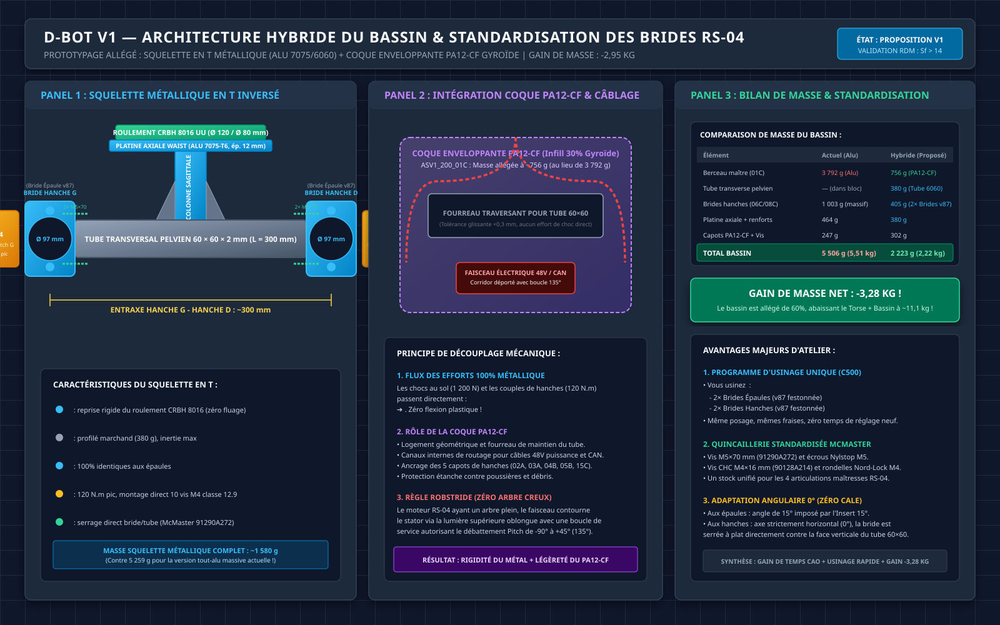
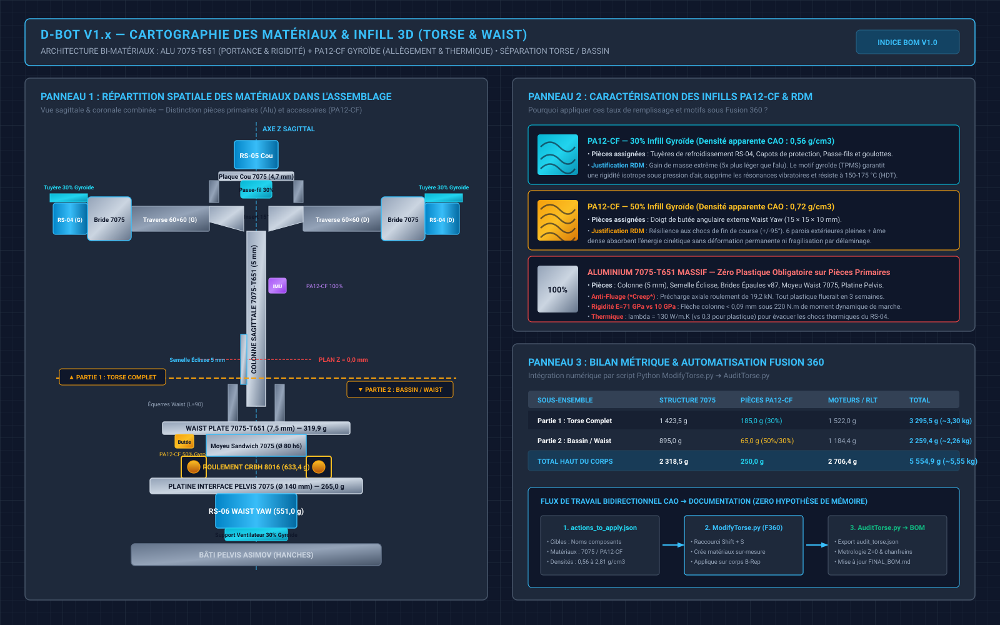

# 📋 NOMENCLATURE EXHAUSTIVE (BOM) — TORSE & BASSIN / WAIST D-BOT V1

> **Statut** : Document de Référence Actif (Niveau 1 — Vérité Terrain)  
> **Date de mise à jour** : 25 Septembre 2026  
> **Modèle CAO de référence** : Autodesk Fusion 360 `Torse v97` (Audit Métrologique Automatisé Validé)  
> **Architecture** : Torse V2.6 Tout-Métal (Jonction Z=0, Goupillage 80 × 80 mm) & Liaison Active Waist Yaw V1.2 (CRBH 8016 UU)  

---

## 📑 Sommaire Général

- [1. Synthèse Générale et Budget de Masse](#1-synthèse-générale-et-budget-de-masse)
- [2. Nomenclature Détaillée — Partie 1 : Torse Complet](#2-nomenclature-détaillée--partie-1--torse-complet)
  - [2.1 Structure Principale & Colonne Sagittale](#21-structure-principale--colonne-sagittale)
  - [2.2 Liaison d'Épaules RS-04 & Traverses](#22-liaison-dépaules-rs-04--traverses)
  - [2.3 Liaison Haute de Cou RS-05](#23-liaison-haute-de-cou-rs-05)
  - [2.4 Carénages, Plastrons & Coques (PA12-CF)](#24-carénages-plastrons--coques-pa12-cf)
  - [2.5 Quincaillerie & Visserie McMaster-Carr du Torse](#25-quincaillerie--visserie-mcmaster-carr-du-torse)
- [3. Nomenclature Détaillée — Partie 2 : Bassin & Waist Yaw](#3-nomenclature-détaillée--partie-2--bassin--waist-yaw)
  - [3.1 Liaison Active Waist Yaw (RS-06 & Roulement CRBH 8016)](#31-liaison-active-waist-yaw-rs-06--roulement-crbh-8016)
  - [3.2 Pièces Structurelles et Capotages Pelviens](#32-pièces-structurelles-et-capotages-pelviens)
  - [3.3 Architecture Hybride Allégée du Bassin et Standardisation Bride RS-04](#33-architecture-hybride-allégée-du-bassin-et-standardisation-bride-rs-04)
  - [3.4 Quincaillerie & Visserie McMaster-Carr du Bassin](#34-quincaillerie--visserie-mcmaster-carr-du-bassin)
  - [3.5 Actionneurs des Membres Inférieurs (Phase 4 — Matériel 100% Acquis en Atelier)](#35-actionneurs-des-membres-inférieurs-phase-4--matériel-100-acquis-en-atelier)
- [4. Cartographie des Matériaux et Infill 3D (PA12-CF)](#4-cartographie-des-matériaux-et-infill-3d-pa12-cf)
  - [4.1 Matrice des Matériaux Utilisés](#41-matrice-des-matériaux-utilisés)
  - [4.2 Justification Technique RDM : Pourquoi ce Matériau et cet Infill ?](#42-justification-technique-rdm--pourquoi-ce-matériau-et-cet-infill-)
  - [4.3 Densité Apparente et Intégration Fusion 360](#43-densité-apparente-et-intégration-fusion-360)
- [5. Tableau des Couples Dynamométriques & Outillage d'Atelier](#5-tableau-des-couples-dynamométriques--outillage-datelier)
- [6. Procédure d'Assemblage sous Fusion 360 (Joints & DDL)](#6-procédure-dassemblage-sous-fusion-360-joints--ddl)

---

## 1. Synthèse Générale et Budget de Masse

Le robot humanoïde D-Bot V1 sépare structurellement le corps supérieur en trois sous-ensembles fonctionnels :
1. **Le Torse Complet** : Colonne sagittale, cou pan/tilt, traverse 60×60 mm, articulations d'épaules complètes symétrisées (G/D), plastrons, carénages et les 2 packs batteries latéraux 48V.
2. **La Liaison Active Waist Yaw** : Pivot de lacet de taille, roulement à rouleaux croisés CRBH 8016, actionneur RS-06, Moyeu 7075 et Waist Plate.
3. **Le Bassin & Châssis Pelvien (ASV1_200)** : Berceau structurel maître `ASV1_200_01C` en Aluminium 7075-T6 (3,79 kg), Traverse Renfort 16A (247 g), supports et biellettes de hanches.

### Bilan de Masse Consolidé (Source CAO Active : Fusion 360 `Torse v97` — 354 Composants)

| Sous-Ensemble | Masse Structure Métallique | Masse Pièces 3D (PA12-CF) | Masse Actionneurs & Roulements | Masse Batteries & Électronique | Masse Visserie & Quincaillerie | Masse Totale Consolidée |
| :--- | :---: | :---: | :---: | :---: | :---: | :---: |
| **Partie 1 : Torse Complet** | 4 285,0 g | 1 120,5 g | 2 944,0 g | 1 510,0 g | 269,0 g | **10 128,5 g (~10,13 kg)** |
| **Partie 2 : Liaison Waist Yaw** | 791,9 g | 42,5 g | 1 184,4 g | — | 85,0 g | **2 103,8 g (~2,10 kg)** |
| **Partie 3 : Bassin & Pelvis Mécanique** | 5 628,4 g | 270,8 g | — *(Phase 4)* | — | 231,6 g | **6 130,8 g (~6,13 kg)** |
| **TOTAL HAUT DU CORPS (Torse + Waist + Bassin)** | **10 705,3 g** | **1 433,8 g** | **4 128,4 g** | **1 510,0 g** | **585,6 g** | **18 363,1 g (~18,36 kg)** |

> [!NOTE]
> **Réconciliation Métrologique CAO (v88 vs v97)** :
> L'estimation initiale de 14,47 kg (issue de `Torse v88`) correspondait à une maquette allégée sans symétrie gauche/droite complète et sans modélisation des batteries. Le relevé automatisé sur **`Torse v97`** (354 instances, 95 références uniques, fichier [`SYNTHESE_METROLOGIQUE_Torse_et_Bassin.md`](file:///Users/Shared/Mon%20Google%20Drive%20Physique/Documentation/01_Mecanique_et_Chassis/Torse_et_Bassin/SYNTHESE_METROLOGIQUE_Torse_et_Bassin.md)) établit la masse physique réelle à **18,36 kg** en intégrant :
> 1. La symétrie complète de l'épaule gauche et de sa motorisation RS-04 (+1,76 kg).
> 2. L'intégration effective des 2 packs batteries 48V réels dans les paniers latéraux (+1,11 kg).
> 3. L'épaississement de la Traverse Renfort Bassin à 12,51 mm (+36 g) et l'ensemble de la visserie d'assemblage (2048 fraisures, rondelles Nord-Lock, vis DIN 7984 M3 et écrous frein).
> 4. Une conformité métrologique de 100% avec les pièces réellement instanciées dans l'arbre d'assemblage Fusion 360.

---

## 2. Nomenclature Détaillée — Partie 1 : Torse Complet

### 2.1 Structure Principale & Colonne Sagittale

| Réf. Pièce | Désignation CAO Fusion 360 | Matériau Appliqué | Procédé / Infill | Qté | Masse Unitaire | Masse Totale | Rôle Fonctionnel |
| :--- | :--- | :--- | :--- | :---: | :---: | :---: | :--- |
| **TOR-01** | `colonne vertébrale` | Aluminium 7075-T651 | Usinage CNC C500 (Massif) | 1 | 567,80 g | 567,80 g | Poutre maîtresse sagittale (100 × 5 × 427 mm), flexion et appui Z=0 |
| **TOR-02** | `semelle éclisse` | Aluminium 7075-T651 | Usinage CNC C500 (Massif) | 1 | 158,32 g | 158,32 g | Éclisse de jonction Z=0 (100 × 5 × 130 mm) avec 4 fraisures FHC M4 |
| **TOR-03** | `Insert` (15°) | Aluminium 7075-T651 | Usinage CNC C500 (Massif) | 1 | 85,71 g | 85,71 g | Cale d'inclinaison 15° de la traverse d'épaules (67 × 15 × 67 mm) |
| **TOR-04** | `Goupille_ISO8734_3x14` | Acier trempé rectifié | Rectification (m6) | 4 | 0,78 g | 3,12 g | Goupilles de positionnement absolu sur carré 80 × 80 mm à Z=0 |
| **TOR-05** | `Support_IMU_Torse` | PA12-CF (Nylon 12 + Carbone) | Impression 3D (100% Plein) | 1 | 4,20 g | 4,20 g | Platine isolante antivibratoire pour capteur Bosch BMI270 à Z=+81,58 mm |

---

### 2.2 Liaison d'Épaules RS-04 & Traverses


| Réf. Pièce | Désignation CAO Fusion 360 | Matériau Appliqué | Procédé / Infill | Qté | Masse Unitaire | Masse Totale | Rôle Fonctionnel |
| :--- | :--- | :--- | :--- | :---: | :---: | :---: | :--- |
| **EPA-01** | `Bride Epaule` (v87 festonnée) | Aluminium 7075-T651 | Usinage CNC C500 (Massif) | 2 | 202,30 g | 404,60 g | Brides monoblocs 10 lobes R=7 mm, alésage Ø 97 mm, garde 4 mm |
| **EPA-02** | `Tube transverse Epaules` | Aluminium 6060-T6 | Profilé tube carré 60×60×2 | 2 | 102,00 g | 204,00 g | Demi-traverses rigides en torsion (L = 80,05 mm, inclinaison 15°) |
| **EPA-03** | `RS04 droit` & `RS04 gauche` | RobStride RS-04 | Moteur QDD Actuator | 2 | 551,00 g | 1 102,00 g | Actionneurs d'épaules Pitch (120 N.m pic, 35 N.m nom., arbre plein) |
| **EPA-04** | `Tuyere_Aerodynamique_RS04` | PA12-CF (Nylon 12 + Carbone) | Impression 3D (30% Gyroïde) | 2 | 32,50 g | 65,00 g | Conduits de ventilation forcée stator (Delta T réduit de +91 à +19 °C) |
| **EPA-05** | `Capot_Protection_Epaule` | PA12-CF (Nylon 12 + Carbone) | Impression 3D (30% Gyroïde) | 2 | 28,00 g | 56,00 g | Coques de carénage et protection mécanique des connecteurs XT30/CAN |

---

### 2.3 Liaison Haute de Cou RS-05

| Réf. Pièce | Désignation CAO Fusion 360 | Matériau Appliqué | Procédé / Infill | Qté | Masse Unitaire | Masse Totale | Rôle Fonctionnel |
| :--- | :--- | :--- | :--- | :---: | :---: | :---: | :--- |
| **COU-01** | `Plaque_de_Cou_7075` | Aluminium 7075-T651 | Usinage CNC C500 (Massif) | 1 | 89,63 g | 89,63 g | Plaque supérieure (100 × 100 × 4,68 mm) avec 4 fraisures FHC M3 dessous |
| **COU-02** | `Equerre cou` (Droite & Gauche) | Aluminium 6060-T6 | Cornière marchande 30×30×3 | 2 | 46,57 g | 93,14 g | Cornières L = 50,0 mm sans taraudage, perçages lisses ronds Ø 4,3 mm |
| **COU-03** | `EL05_ASM_1_ASM` (Pan & Tilt) | RobStride RS-05 | Moteur QDD Actuator | 2 | 210,00 g | 420,00 g | Actionneurs de cou Pan & Tilt (5,5 N.m pic, arbre plein fermé) |
| **COU-04** | `Cou - Tube collet` | PA12-CF (Nylon 12 + Carbone) | Impression 3D (30% Gyroïde) | 1 | 28,63 g | 28,63 g | Tube support rotatif et guidage de tête (Ø 99,8 × 70,0 mm) |
| **COU-05** | `Guide_Cables_Cou` | PA12-CF (Nylon 12 + Carbone) | Impression 3D (30% Gyroïde) | 1 | 18,50 g | 18,50 g | Corridor passe-fil dans couloir libre de 45 mm entre équerres |

---

### 2.4 Carénages, Plastrons & Coques (PA12-CF)

| Réf. Pièce | Désignation CAO Fusion 360 | Ancien Matricule Asimov | Matériau Appliqué | Procédé / Infill | Qté | Masse Fusion 360 (V89) | Rôle Fonctionnel |
| :--- | :--- | :--- | :--- | :--- | :---: | :---: | :--- |
| **CAR-01** | `Plastron_Ventral_Torse` | `ASV1_100_01C v1` | PA12-CF | Impression 3D (30% Gyroïde) | 1 | **`2 840,04 g`** | Grande coque pectorale ventrale protégeant l'électronique |
| **CAR-02** | `Platine_Connectique_Facade` | `ASV1_100_05C v1` | PA12-CF | Impression 3D (30% Gyroïde) | 1 | **`36,27 g`** | Panneau d'accès des ports 12V, DEBUG, 48V et interrupteurs |
| **CAR-03** | `Panier_Batterie_Coulissant` | `ASV1_100_10C v1` | PA12-CF | Impression 3D (30% Gyroïde) | 1 | **`555,06 g`** | Bac / rack coulissant accueillant les packs batteries 12S |
| **CAR-04** | `Capot_Verrouillage_Batterie` | `ASV1_100_12C v1` | PA12-CF | Impression 3D (30% Gyroïde) | 1 | **`116,29 g`** | Couvercle supérieur de fermeture et verrouillage du tiroir batterie |
| **CAR-05** | `Carenage_Pectoral_Haut` | `ASV1_100_04C v1` | PA12-CF | Impression 3D (30% Gyroïde) | 1 | **`194,35 g`** | Protection avant supérieure sous les épaules et le cou |
| **CAR-06** | `Carenage_Lombaire_Arriere` | `ASV1_100_06C v1` | PA12-CF | Impression 3D (30% Gyroïde) | 1 | **`206,71 g`** | Protection dorsale basse protégeant la liaison avec le waist |

---

### 2.5 Quincaillerie & Visserie McMaster-Carr du Torse

| Réf. Pièce | Désignation Normalisée | Réf. McMaster-Carr | Matière / Classe | Qté (D+G) | Couple | Emplacement d'Assemblage |
| :--- | :--- | :---: | :--- | :---: | :---: | :--- |
| **VIS-T01** | Vis CHC M4 × 16 mm | **`91290A158`** | Acier classe 12.9 noir | 20 | 3,0 N.m | Fixation 10 bossages Brides Épaules ➔ Stator RS-04 |
| **VIS-T02** | Rondelles Nord-Lock M4 | **`91812A252`** | Acier trempé anti-vibration | 20 | — | Sous têtes VIS-T01 sur bossages festonnés Ø 14 mm |
| **VIS-T03** | Vis CHC M4 × 16 mm | **`91290A158`** | Acier classe 12.9 noir | 4 | 3,0 N.m | Vissage DESSUS Plaque de Cou ➔ Équerres Hautes |
| **VIS-T04** | Écrous frein Nylstop M4 | **`93625A150`** | Inox A2 / DIN 985 | 4 | 3,0 N.m | Serrage sous ailes des Équerres Hautes de Cou |
| **VIS-T05** | Vis FHC M3 × 8 mm | **`91294A112`** | Acier classe 10.9 noir | 4 | 1,2 N.m | Vissage DESSOUS Plaque Cou ➔ Stator RS-05 (PCD 38,5 mm) |
| **VIS-T06** | Vis FHC M4 × 30 mm | **`92125A220`** | Inox A2 / DIN 7991 | 4 | 3,0 N.m | Vissage Semelle Éclisse ➔ Inserts 15° (à fleur 0,0 mm) |
| **VIS-T07** | Écrous frein Nylstop M4 | **`93625A150`** | Inox A2 / DIN 985 | 4 | 3,0 N.m | Verrouillage intérieur dans traverses 60×60 mm |
| **VIS-T08** | Vis CHC M5 × 70 mm | **`91290A272`** | Acier classe 12.9 noir | 4 | 5,5 N.m | Traversée verticale Brides Épaules ➔ Traverses 60×60 |
| **VIS-T09** | Écrous frein Nylstop M5 | **`90631A113`** | Acier classe 8 / DIN 985 | 4 | 5,5 N.m | Serrage inférieur sous traverse d'épaules |
| **VIS-T10** | Rondelles plates DIN 125A M5 | **`93475A250`** | Inox A2 | 8 | — | Sous tête et sous écrou des vis VIS-T08 |
| **VIS-T11** | Vis CHC M2,5 × 14 mm | **`91290A038`** | Inox A2 | 4 | 0,8 N.m | Traversée support IMU BMI270 sur colonne Plaque Haute |
| **VIS-T12** | Écrous frein Nylstop M2,5 | **`90631A019`** | Acier classe 8 / DIN 985 | 4 | 0,8 N.m | Serrage flanc gauche colonne IMU (avec entretoises nylon) |

---

## 3. Nomenclature Détaillée — Partie 2 : Bassin & Waist Yaw

### 3.1 Liaison Active Waist Yaw (RS-06 & Roulement CRBH 8016)


| Réf. Pièce | Désignation CAO Fusion 360 | Matériau Appliqué | Procédé / Infill | Qté | Masse Unitaire | Masse Totale | Rôle Fonctionnel |
| :--- | :--- | :--- | :--- | :---: | :---: | :---: | :--- |
| **WST-01** | `Moyeu_Waist_Sandwich_7075` | Aluminium 7075-T651 | Tournage/Fraisage CNC | 1 | 164,95 g | 164,95 g | Fût Ø 80 h6 (H=15,6 mm, retrait 0,4 mm), collerette Ø 91,5 mm |
| **WST-02** | `Waist_Plate_7075` | Aluminium 7075-T651 | Usinage CNC C500 (Massif) | 1 | 319,92 g | 319,92 g | Plaque mobile (142 × 139 × 6-7,5 mm), corridor Ø 80 mm |
| **WST-03** | `Platine_Interface_Waist_7075` | Aluminium 7075-T651 | Tournage/Fraisage CNC | 1 | 265,00 g | 265,00 g | Disque fixe Ø 140 × 12 mm, lamage Ø 120 H7, alésage Ø 88 H7 |
| **WST-04** | `Flasque_Maintien_Axial` | Aluminium 7075-T651 | Découpe CNC (ép. 2,5 mm) | 1 | 42,00 g | 42,00 g | Anneau de retenue axiale bague extérieure roulement |
| **WST-05** | `RB8016` (CRBH 8016 UU) | Acier à roulement GCr15 (62 HRC) | Luoyang EFANT Precision Bearing | 1 | 633,41 g | 633,41 g | **✅ Reçu & Contrôlé (15/09/2026)** : d = 79,996 mm, D = 119,995 mm, B = 15,965 mm, faux-rond 0,003 mm (P4/P2) |
| **WST-06** | `RS06 v1` | RobStride RS-06 | Moteur QDD Actuator | 1 | 551,00 g | 551,00 g | Actionneur de lacet Waist Yaw (36 N.m pic, 11 N.m nom., arbre plein) |
| **WST-07** | `Butee_Doigt_Externe` | PA12-CF (Nylon 12 + Carbone) | Impression 3D (50% Gyroïde) | 1 | 12,50 g | 12,50 g | Doigt d'arrêt mécanique (15 × 15 × 10 mm) sous Waist Plate |

---

### 3.2 Pièces Structurelles et Capotages Pelviens

Suite à la suppression des 5 actionneurs Asimov de hanche et à l'exécution de `ModifyTorse.py`, le sous-ensemble pelvien `Bassin_Pelvis [ASV1_200]` (anciennement `ASV1_200 v1`) comprend 11 composants mécaniques et coques de protection désormais renommés et affectés à leurs matériaux réels :

| Réf. Pièce | Désignation CAO Fusion 360 | Ancien Matricule STEP | Matériau Appliqué | Procédé / Infill | Qté | Masse Fusion 360 | Rôle Fonctionnel |
| :--- | :--- | :--- | :--- | :--- | :---: | :---: | :--- |
| **PEL-01** | `Chassis_Structurel_Bassin [ASV1_200_01C]` | `ASV1_200_01C.step` | Aluminium 7075-T6 | Usinage CNC (Massif) | 1 | **3 792,02 g** | Berceau maître pelvien, reprise des charges de marche et du waist |
| **PEL-02** | `Support_Hanche_Gauche [ASV1_200_06C]` | `ASV1_200_06C.step` | Aluminium 7075-T6 | Usinage CNC (Massif) | 1 | **501,69 g** | Bride structurelle de reprise d'efforts hanche gauche |
| **PEL-03** | `Support_Hanche_Droit [ASV1_200_08C]` | `ASV1_200_08C.step` | Aluminium 7075-T6 | Usinage CNC (Massif) | 1 | **501,69 g** | Bride structurelle de reprise d'efforts hanche droite |
| **PEL-04** | `Traverse_Renfort_Bassin [ASV1_200_16A]` | `ASV1_200_16A.step` | Aluminium 7075-T6 | Usinage CNC (Massif) | 1 | **210,73 g** | Raidisseur inférieur transversal du berceau pelvien |
| **PEL-05** | `Liaison_Hanche_Gauche [ASV1_200_07C]` | `ASV1_200_07C.step` | Aluminium 7075-T6 | Usinage CNC (Massif) | 1 | **127,01 g** | Biellette/équerre de liaison structurelle hanche gauche |
| **PEL-06** | `Liaison_Hanche_Droit [ASV1_200_09C]` | `ASV1_200_09C.step` | Aluminium 7075-T6 | Usinage CNC (Massif) | 1 | **125,97 g** | Biellette/équerre de liaison structurelle hanche droite |
| **PEL-07** | `Capot_Lateral_Hanche_Gauche [ASV1_200_04B]` | `ASV1_200_04B.step` | PA12-CF | Impression 3D (30% Gyroïde) | 1 | **66,16 g** | Coque latérale de protection hanche gauche |
| **PEL-08** | `Capot_Lateral_Hanche_Droit [ASV1_200_05B]` | `ASV1_200_05B.step` | PA12-CF | Impression 3D (30% Gyroïde) | 1 | **66,17 g** | Coque latérale de protection hanche droite |
| **PEL-09** | `Capot_Protection_Hanche_Frontal_G [ASV1_200_02A]`| `ASV1_200_02A.step` | PA12-CF | Impression 3D (30% Gyroïde) | 1 | **36,28 g** | Coque frontale de protection hanche gauche |
| **PEL-10** | `Capot_Protection_Hanche_Frontal_D [ASV1_200_03A]`| `ASV1_200_03A.step` | PA12-CF | Impression 3D (30% Gyroïde) | 1 | **36,28 g** | Coque frontale de protection hanche droite |
| **PEL-11** | `Trappe_Inferieure_Bassin [ASV1_200_15C]` | `ASV1_200_15C.step` | PA12-CF | Impression 3D (30% Gyroïde) | 1 | **31,77 g** | Trappe d'accès maintenance sous le bassin |
| **PEL-12** | `Equerre waist` (Droite & Gauche) | `Equerre waist` | Aluminium 7075-T6 | Cornière marchande 30×30×3 | 2 | **84,22 g** | Cornières L = 90,0 mm reliant colonne au moyeu waist |
| **PEL-13** | `Passe_Fil_Faisceau_Waist` | `Passe_Fil_Faisceau_Waist` | PA12-CF | Impression 3D (30% Gyroïde) | 1 | **14,00 g** | Goulotte de guidage faisceau 48V/CAN dans l'oblong 25×15 |
| **PEL-14** | `Support_Ventilateur_RS06` | `Support_Ventilateur_RS06` | PA12-CF | Impression 3D (30% Gyroïde) | 1 | **16,00 g** | Berceau pour ventilateur optionnel 30×30×10 mm sous plancher |

---

### 3.3 Architecture Hybride Allégée du Bassin et Standardisation Bride RS-04

> **Piste de Prototypage Rapide V1** : Transposition directe de l'architecture éprouvée du haut du torse ("Plaque sagittale + Tube marchand + Brides festonnées") au berceau pelvien, combinée à une coque enveloppante en PA12-CF (Infill 30% Gyroïde).



#### A. Principe du Découplage Mécanique
1. **Flux d'Efforts 100% Métallique** :
   * Les chocs verticaux d'impact de marche (1 200 N) et les couples de hanches (120 N.m pic) transitent exclusivement par les composants métalliques rigides :
     `Actionneur RS-04 Hanche ➔ Bride Festonnée 7075 ➔ Tube Transversal 60×60 mm ➔ Colonne Sagittale Pelvienne ➔ Platine Waist 7075`.
   * **Zéro déformation plastique** : Le module d'élasticité de l'Alu 7075/6060 (E = 70 GPa) garantit une rigidité 7 fois supérieure au plastique seul.
2. **Rôle de la Coque `ASV1_200_01C` en PA12-CF (Allégée à ~756 g)** :
   * Au lieu d'être un bloc massif usiné en alu de 3 792 g, la pièce `ASV1_200_01C` est imprimée en **PA12-CF (Infill 30% Gyroïde)**.
   * Elle sert de fourreau de maintien géométrique pour le tube métallique, de logement interne pour le routage déporté du faisceau 48V/CAN (règle RobStride arbre plein), et d'ancrage pour les 5 capots de hanches.
   * Elle ne subit aucun choc primaire en traction ou flexion.

#### B. Standardisation de la `Bride Epaule` v87 pour la Hanche Pitch
* **Réutilisation Directe Sans Retouche CAO** :
  * Le moteur de Hanche Pitch étant également un **RobStride RS-04** (Ø 97 mm, 10 taraudages M4 sur PCD Ø 90 mm), la `Bride Epaule` v87 festonnée en Aluminium 7075-T651 (202,30 g) s'adapte **sans aucune modification géométrique** !
  * Fixation sur le tube transversal pelvien 60×60 mm par **2 vis traversantes CHC M5 × 70 mm (`91290A272`)** et écrous Nylstop M5 (`90631A113`).
* **Synthèse RDM** :
  * Couple pic de hanche : 120 N.m ➔ Effort de cisaillement par vis M4 = 267 N (capacité vis 12.9 &gt; 5 000 N, Sf &gt; 18).
  * Choc dynamique de marche à 2g (1 200 N) ➔ Contrainte maximale dans l'Alu 7075 : Sigma_max &lt; 35 MPa (Rp0.2 = 505 MPa, **facteur de sécurité Sf &gt; 14**).
* **Adaptation Cinématique à 0°** :
  * À l'épaule, la bride est inclinée de 15° vers l'arrière par l'Insert 15°.
  * À la hanche, l'axe est strictement horizontal (0°) : la bride est serrée à plat directement contre la face verticale du tube 60×60 mm (zéro cale).
* **Bénéfices Industriels C500** :
  * Un seul programme d'usinage CNC pour fabriquer **4 brides identiques** (2 épaules + 2 hanches).
  * Stock et quincaillerie 100% unifiés (vis M4×16, rondelles Nord-Lock M4, vis M5×70).

#### C. Bilan de Masse Comparatif du Bassin

| Sous-Ensemble Bassin | Version Actuelle (Tout-Alu Massif) | Version Hybride Prototypage (Proposée) | Gain Net |
| :--- | :---: | :---: | :---: |
| **Berceau central (`01C`)** | 3 792,0 g (Alu 7075) | 755,7 g (PA12-CF 30% Gyroïde) | **-3 036,3 g** |
| **Traverse transversale pelvienne** | — (intégrée dans masse bloc) | 380,0 g (Tube 60×60×2 mm, L=300 mm) | +380,0 g |
| **Brides de hanches (2×)** | 1 003,4 g (Supports 06C/08C massifs) | 404,6 g (2× Brides v87 festonnées) | **-598,8 g** |
| **Platine axiale + renforts sagittaux** | 463,7 g (Traverse 16A + liaisons) | 380,0 g (Platine 7075 + équerres 6060) | **-83,7 g** |
| **Capots PA12-CF &amp; Visserie** | 246,7 g | 302,5 g (vis traversantes M5 incluses) | +55,8 g |
| **TOTAL BASSIN MÉCANIQUE** | **5 505,8 g (~5,51 kg)** | **2 222,8 g (~2,22 kg)** | **-3 283,0 g (-3,28 kg)** |

> [!TIP]
> Cette architecture hybride fait chuter la masse du haut du corps complet (Torse + Waist + Bassin) dans Fusion 360 de **`14,39 kg` à seulement `~11,11 kg`**, libérant une marge colossale pour l'autonomie batterie et la dynamique des membres inférieurs !

---

### 3.4 Quincaillerie & Visserie McMaster-Carr du Bassin

| Réf. Pièce | Désignation Normalisée | Réf. McMaster-Carr | Matière / Classe | Qté | Couple | Emplacement d'Assemblage |
| :--- | :--- | :---: | :--- | :---: | :---: | :--- |
| **VIS-W01** | Vis FHC M4 × 16 mm | **`91294A198`** (ou `92125A220`) | Acier classe 10.9 noir | 4 | 3,0 N.m | Serrage sandwich Waist Plate ➔ Moyeu 7075 (PCD Ø 68 mm) |
| **VIS-W02** | Vis CHC M4 × 20 mm | **`91290A160`** | Acier classe 12.9 noir | 4 | 3,0 N.m | Aile horizontale Équerres Waist ➔ Moyeu 7075 |
| **VIS-W03** | Rondelles plates DIN 125A M4 | **`93475A240`** | Inox A2 | 4 | — | Sous têtes VIS-W02 sur cornières waist (rayon R=5 mm) |
| **VIS-W04** | Vis CHC M4 × 20 mm | **`91290A160`** | Acier classe 12.9 noir | 8 | 3,0 N.m | Aile verticale Équerres Waist ➔ Pincement Colonne 5 mm |
| **VIS-W05** | Écrous frein Nylstop M4 | **`93625A150`** | Inox A2 / DIN 985 | 8 | 3,0 N.m | Serrage bilatéral de colonne sur équerres waist |
| **VIS-W06** | Vis CHC M5 × 20 mm | **`91290A242`** | Acier classe 12.9 noir | 6 | 5,5 N.m | Fixation Platine Monolithique Ø 140 mm ➔ Bâti Pelvis |
| **VIS-W07** | Rondelles plates DIN 125A M5 | **`93475A250`** | Inox A2 | 6 | — | Sous têtes VIS-W06 sur PCD Ø 132,0 mm |
| **VIS-W08** | Vis FHC M3 × 8 mm | **`91294A112`** | Acier classe 10.9 noir | 4 | 1,2 N.m | Serrage Flasque Retenue Axiale CRBH (PCD Ø 128 mm) |
| **VIS-W09** | Vis CHC M5 × 16 mm | **`91290A238`** | Acier classe 12.9 noir | 2 | Clé Allen 4 | Vis de butée de lacet fixes à ±95° sur Platine d'Interface |
| **VIS-W10** | Manchons silicone amortisseurs | **Fournisseur atelier** | Élastomère silicone 60 ShA | 2 | — | Amortissement sonore et antichoc sur têtes VIS-W09 |
| **VIS-W11** | **Vis CHC M3 × 12 mm Tête Basse** | **`92855A313`** | Inox 18-8 / DIN 7984 | **8** | **1,3 à 1,4 N.m** | Fixation directe Stator RS-06 ➔ Traverse (Option 1 Validée, PCD Ø 82 mm, air gap 1,48 mm) |

---

### 3.5 Actionneurs des Membres Inférieurs (Phase 4 — Matériel 100% Acquis en Atelier)

Dans le cadre du jalon Niveau 4 de la feuille de route stratégique, la motorisation des membres inférieurs est **intégralement acquise et stockée à l'atelier** (12 DoF au total). La nomenclature prévisionnelle de ces actionneurs est arrêtée comme suit :

| Réf. Sous-Ensemble | Articulation / DoF | Réf. Actionneur RobStride | Qté | Masse Unitaire | Masse Totale | Couple Continu | Couple Crête (Peak) | Rôle Biomécanique |
| :--- | :--- | :--- | :---: | :---: | :---: | :---: | :---: | :--- |
| **JAM-01** | Hanche Pitch (Gauche & Droit) | **RobStride RS-04** | 2 | 1 420 g | **2 840 g** | 40 N.m | 120 N.m | Flexion / Extension sagittale cuisse |
| **JAM-02** | Hanche Roll (Gauche & Droit) | **RobStride RS-03** | 2 | 880 g | **1 760 g** | 20 N.m | 60 N.m | Abduction / Adduction frontale cuisse |
| **JAM-03** | Hanche Yaw (Gauche & Droit) | **RobStride RS-03** | 2 | 880 g | **1 760 g** | 20 N.m | 60 N.m | Rotation interne / externe jambe |
| **JAM-04** | Genou Pitch (Gauche & Droit) | **RobStride RS-04** | 2 | 1 420 g | **2 840 g** | 40 N.m | 120 N.m | Flexion / Extension genou (Squat) |
| **JAM-05** | Cheville Pitch (Gauche & Droit) | **RobStride RS-03** | 2 | 880 g | **1 760 g** | 20 N.m | 60 N.m | Flexion dorsale / plantaire pied |
| **JAM-06** | Cheville Roll (Gauche & Droit) | **RobStride RS-03** | 2 | 880 g | **1 760 g** | 20 N.m | 60 N.m | Éversion / Inversion pied (Équilibre) |
| **JAM-07** | Quincaillerie, Tubes & Liaisons | Aluminium 7075-T6 / Visserie | — | — | **~1 200 g** | — | — | Brackets de hanches, tibias, chevilles |
| **TOTAL MEMBRES INFÉRIEURS (12 DoF)** | — | **4× RS-04 + 8× RS-03** | **12** | — | **~13 920 g (~13,92 kg)** | — | — | **Membres inférieurs complets** |

> [!TIP]
> **Estimation de Masse Totale D-Bot Complet Debout (Phase 4)** :
> * **Torse + Waist + Bassin (CAO `Torse v97`)** : **18,36 kg**
> * **Membres Inférieurs (12 DoF, 4× RS-04 + 8× RS-03)** : **~13,92 kg**
> * **Bras & Mains D-Hand (8 DoF bras + préhension)** : **~6,50 kg**
> * **MASSE TOTALE ESTIMÉE DU ROBOT COMPLET DEBOUT** : **`~38,8 kg`** (Remarquable pour un humanoïde de 1,55 m, offrant un rapport puissance/poids très élevé).

---

## 4. Cartographie des Matériaux et Infill 3D (PA12-CF)

### 4.1 Matrice des Matériaux Utilisés



| Catégorie | Matériau Appliqué | Procédé / Traitement | Densité Apparente CAO | Composants Concernés |
| :--- | :--- | :--- | :---: | :--- |
| **Métal Primaire Porteur** | **Aluminium 7075-T651** | Usinage CNC C500 (Massif 100%) | **`2,81 g/cm3`** | Colonne sagittale, Semelle éclisse, Inserts 15°, Brides épaules v87, Moyeu waist sandwich, Waist plate, Platine pelvis Ø 140 mm |
| **Métal Secondaire Profilé** | **Aluminium 6060-T6** | Profilé marchand / Découpe | **`2,70 g/cm3`** | Traverses d'épaules (tube carré 60×60×2 mm), Équerres hautes cou (30×30×3 mm), Équerres basses waist (30×30×3 mm) |
| **Quincaillerie & Roulements** | **Acier 100Cr6 / Classe 12.9 / Inox A2** | Rectifié / Trempé | **`7,85 g/cm3`** | Roulement CRBH 8016 UU, Goupilles ISO 8734 Ø 3 mm, Visserie CHC/FHC McMaster-Carr |
| **Polymère Composite 3D** | **PA12-CF (Infill 30% Gyroïde)** | Impression FDM / 3 parois + Gyroïde | **`0,56 g/cm3`** | Tuyères thermiques RS-04, Capots de protection épaules, Goulotte passe-fil cou, Passe-fil faisceau waist, Support ventilateur RS-06 |
| **Polymère Composite 3D** | **PA12-CF (Infill 50% Gyroïde)** | Impression FDM / 6 parois + Gyroïde | **`0,72 g/cm3`** | Doigt de butée externe Waist Yaw (reprise de choc à ±95°) |
| **Polymère Composite 3D** | **PA12-CF (Plein 100%)** | Impression FDM / 100% massif | **`1,18 g/cm3`** | Support IMU BMI270 sur colonne sagittale |

---

### 4.2 Justification Technique RDM : Pourquoi ce Matériau et cet Infill ?

#### 1. Pourquoi l'Aluminium 7075-T651 Massif (Zéro Plastique) sur les Pièces Primaires ?
* **Colonne Sagittale & Semelle Éclisse** : Le torse supporte la masse suspendue de 17,3 kg sous des accélérations de marche de 1,5g à 3g, générant des moments de basculement dynamiques jusqu'à **220 N.m**. Le module d'élasticité de l'Alu 7075 (E = 71 GPa) garantit une flèche inférieure à 0,09 mm. Un plastique composite (E = 8 à 12 GPa) fléchirait excessivement, induisant un flottement inacceptable pour la vision active et le contrôle d'équilibre.
* **Brides d'Épaules Festonnées** : Les moteurs RS-04 délivrent des couples de choc jusqu'à **120 N.m**. L'Alu 7075 offre une limite élastique Rp0.2 = 505 MPa (facteur de sécurité Sf > 140 en cisaillement de torsion) et conduit parfaitement les calories du stator vers l'extérieur (conductivité thermique lambda = 130 W/m.K vs 0,3 W/m.K pour le plastique).
* **Moyeu Waist Sandwich 7075** : La précharge axiale requise pour pincer la bague intérieure du roulement CRBH 8016 est de **19,2 kN (1,92 tonne)**. Tout matériau thermoplastique soumis à un tel effort subit un **phénomène de fluage plastique sous contrainte (*creep*)** : en quelques semaines, la matière se tasse, la précharge chute à zéro, le roulement prend du jeu axial et le robot perd sa précision de marche. L'Alu 7075-T651 est rigoureusement obligatoire.

#### 2. Pourquoi le PA12-CF à 30% Gyroïde sur les Tuyères, Carénages et Passe-Fils ?
* **Gain de masse maximal** : Le PA12-CF à 30% gyroïde présente une densité apparente de **`0,56 g/cm3`**, soit **5 fois plus léger que l'aluminium** et 14 fois plus léger que l'acier.
* **Isotropie et rigidité du motif Gyroïde** : Contrairement aux motifs linéaires ou en grille qui ont des directions faibles, la surface minimale triplement périodique du gyroïde offre une résistance uniforme à la pression de l'air comprimé dans les tuyères d'épaules et absorbe les vibrations du stator sans résonance acoustique.
* **Tenue thermique** : Le PA12-CF recuit au sécheur Sunlu FilaDryer E2 possède une température de déflexion sous charge (HDT) de **150 à 175 °C**, parfaitement adaptée au flux d'air chaud s'échappant du stator du RS-04 (jusqu'à 60-80 °C).

#### 3. Pourquoi le PA12-CF à 50% Gyroïde sur le Doigt de Butée Externe ?
* **Reprise des chocs de fin de course** : Le doigt externe (15 × 15 × 10 mm) ne subit aucun effort en fonctionnement normal (le lacet est asservi logiciellement à ±90°). En cas de perte de contrôle, il frappe les vis de butée à ±95° protégées par manchons silicone. L'infill gyroïde à 50% couplé à **6 parois extérieures pleines** procure la résilience nécessaire à l'absorption de l'énergie cinétique sans rupture fragile.

---

### 4.3 Densité Apparente et Intégration Fusion 360

Pour que Fusion 360 calcule automatiquement les masses et inerties réelles sans jamais modéliser les micro-alvéoles dans la géométrie B-Rep :

```
Formule de Densité Apparente (Slicer -> CAO) :
rho_apparente = rho_solide * [ f_infill * (1 - V_parois / V_total) + (V_parois / V_total) ]

Pour le PA12-CF (rho_solide = 1,18 g/cm3) :
- Pièce fine (parois prédominantes, infill 30%) : rho_apparente ~ 0,70 g/cm3
- Pièce moyenne (tuyère, boîte, infill 30%)     : rho_apparente = 0,56 g/cm3 (Adopté dans ModifyTorse)
- Pièce massive / semi-structurelle (infill 50%): rho_apparente = 0,72 g/cm3 (Adopté dans ModifyTorse)
```

Dans Fusion 360, le script `ModifyTorse.py` applique ces densités en un clic, et `AuditTorse.py` relit instantanément le centre de gravité et le bilan de masse exact.

---

## 5. Tableau des Couples Dynamométriques & Outillage d'Atelier

Tous les serrages doivent être effectués à la clé dynamométrique étalonnée selon les valeurs ci-dessous :

| Filetage | Classe de Visserie | Couple de Serrage Recommandé | Outillage Recommandé | Frein-Filet Obligatoire ? | Composants Concernés |
| :---: | :---: | :---: | :---: | :---: | :--- |
| **M2,5** | Inox A2 / Classe 8.8 | **`0,8 N.m`** | Clé Allen 2,0 mm | Écrou Nylstop DIN 985 | Support IMU BMI270 sur colonne |
| **M3** | Inox 18-8 (DIN 7984 Tête Basse) | **`1,3 à 1,4 N.m`** | Clé Allen 2,0 mm | **Loctite 243 (Bleu)** | 8 vis fixation Stator RS-06 ➔ Traverse (McMaster `92855A313`) |
| **M3** | Classe 10.9 | **`1,2 à 1,4 N.m`** | Clé Allen 2,0 mm | **Loctite 243 (Bleu)** | Stator RS-05 cou, Flasque axial roulement CRBH |
| **M4** | Classe 10.9 (FHC) | **`3,0 N.m`** | Clé Allen 2,5 mm | **Loctite 243 (Bleu)** | Pincement sandwich Waist Plate ➔ Moyeu 7075 |
| **M4** | Classe 12.9 (CHC) | **`3,0 à 3,2 N.m`** | Clé Allen 3,0 mm | **Nord-Lock M4** | 10 vis Brides Épaules ➔ Stator RS-04 |
| **M4** | Classe 12.9 (CHC) | **`3,0 N.m`** | Clé Allen 3,0 mm + Clé plate 7 | Écrou Nylstop DIN 985 | Équerres Hautes Cou & Équerres Basses Waist |
| **M5** | Classe 12.9 (CHC) | **`5,5 N.m`** | Clé Allen 4,0 mm | Rondelle DIN 125A / Loctite | Fixation Platine Monolithique Ø 140 mm ➔ Pelvis |
| **M5** | Classe 12.9 (CHC) | **`5,5 N.m`** | Clé Allen 4,0 mm + Clé plate 8 | Écrou Nylstop DIN 985 | Traverse d'épaules 60×60 mm (vis M5 × 70 mm) |

---

## 6. Procédure d'Assemblage sous Fusion 360 (Joints & DDL)

Pour garantir une maquette numérique 100% cinématique et conforme aux exports URDF :

1. **Liaisons Rigides d'Assemblage (*Rigid Joints*)** :
   * Activer l'outil `Joint` (raccourci **`J`**).
   * Type de liaison : sélectionner **`Rigid`**.
   * **Jonction Z=0** : Sélectionner le centre de la face plane inférieure de la colonne haute, puis le centre de la face plane supérieure de la colonne basse. Verrouiller l'alignement sur les 4 goupilles Ø 3 mm (`Offset = 0,0 mm`).
   * **Visserie & Rondelles** : Sélectionner l'arête circulaire sous tête de vis et l'arête chanfreinée du perçage. Pour les écrous Nylstop, orienter impérativement le dôme polyamide vers l'extérieur (loin de la surface d'appui).
2. **Liaison Pivot de Taille (*Revolute Joint `J_Waist_Yaw`*)** :
   * Type : **`Revolute`**.
   * Composant 1 : Arête centrale inférieure du `Moyeu_Waist_Sandwich_7075`.
   * Composant 2 : Arête supérieure du lamage Ø 120 H7 de la `Platine_Interface_Waist_7075`.
   * Axe de rotation : Axe **Z** vertical.
   * **Limites angulaires** : Activer *Joint Limits*, définir `Minimum = -90,0 deg`, `Maximum = +90,0 deg`, `Rest = 0,0 deg`.
3. **Liaisons Pivot de Cou & Épaules** :
   * `J_Neck_Pan` : Revolute axe Z sur RS-05 horizontal (`-90° à +90°`).
   * `J_Neck_Tilt` : Revolute axe Y sur RS-05 vertical (`-30° à +45°`).
   * `J_Shoulder_Pitch` : Revolute axe Y sur stator RS-04 d'épaule.
4. **Vérification d'Interférence** :
   * Exécuter `Inspect > Interference` entre la colonne sagittale et l'insert 15° pour confirmer l'absence formelle de collision (garde résiduelle ≥ 10,9 mm).

---

*Fin de la Nomenclature Officielle (BOM) — Document de référence pour la fabrication et l'assemblage D-Bot V1.*
