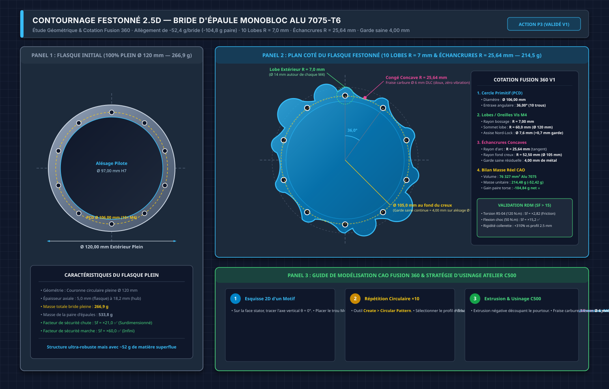

# 📋 Rapport d'Expertise Mécanique — Torse & Waist D-Bot V1.x
### Recommandations, Anomalies & Proposition d'Évolution Waist 2-DoF (Yaw + Pitch)

> **Statut** : Rapport d'expertise indépendant — Revue de conception  
> **Date** : 16 Septembre 2026  
> **Documents Audités** :  
> - [DOSSIER_TECHNIQUE_Bassin_et_Waist_D-Bot.md](file:///Users/Shared/Mon%20Google%20Drive%20Physique/Documentation/01_Mecanique_et_Chassis/Torse_et_Bassin/DOSSIER_TECHNIQUE_Bassin_et_Waist_D-Bot.md) (785 lignes, 87 ko)  
> - [DOSSIER_TECHNIQUE_Torse_Complet_D-Bot_V2.md](file:///Users/Shared/Mon%20Google%20Drive%20Physique/Documentation/01_Mecanique_et_Chassis/Torse_et_Bassin/DOSSIER_TECHNIQUE_Torse_Complet_D-Bot_V2.md) (1 184 lignes, 138 ko)  
> **Benchmark** : Tesla Optimus Gen 2, Unitree H1/G1, Fourier GR-1, Figure 02, BD Atlas Electric

---

## 📑 Sommaire

- [1. Synthèse du Verdict](#1-synthèse-du-verdict)
- [2. Anomalies Détectées & Corrections Nécessaires](#2-anomalies-détectées--corrections-nécessaires)
  - [2.1 Incohérence Dimensionnelle des Équerres Basses Waist](#21-incohérence-dimensionnelle-des-équerres-basses-waist)
  - [2.2 Roulement CRBH 8016 Non Commandé (Chemin Critique)](#22-roulement-crbh-8016-non-commandé-chemin-critique)
  - [2.3 Absence de Support IMU au Torse](#23-absence-de-support-imu-au-torse)
  - [2.4 Risque de Talonnage au Noeud d'Épaules (Tenon-Mortaise)](#24-risque-de-talonnage-au-noeud-dépaules-tenon-mortaise)
  - [2.5 Ventilation du RS-06 Waist Absente](#25-ventilation-du-rs-06-waist-absente)
- [3. Recommandation d'Allègement : Contournage Festonné des Brides](#3-recommandation-dallègement--contournage-festonné-des-brides)
- [4. Recommandations Diverses](#4-recommandations-diverses)
  - [4.1 Butées Logicielles en Amont de la Butée Mécanique](#41-butées-logicielles-en-amont-de-la-butée-mécanique)
  - [4.2 Amortissement Élastomère de la Butée de Fin de Course](#42-amortissement-élastomère-de-la-butée-de-fin-de-course)
  - [4.3 Protection IP54 du Corridor de Câbles](#43-protection-ip54-du-corridor-de-câbles)
  - [4.4 Goupillage de Positionnement au Tenon-Mortaise](#44-goupillage-de-positionnement-au-tenon-mortaise)
- [5. Proposition d'Évolution : Ajout du Waist Pitch (2-DoF)](#5-proposition-dévolution--ajout-du-waist-pitch-2-dof)
  - [5.1 Pourquoi le Pitch est le DoF le Plus Utile à Ajouter](#51-pourquoi-le-pitch-est-le-dof-le-plus-utile-à-ajouter)
  - [5.2 Choix du Moteur : RobStride RS-04 (120 N.m pic)](#52-choix-du-moteur--robstride-rs-04-120-nm-pic)
  - [5.3 Architecture Proposée : RS-04 Pitch SOUS le RS-06 Yaw](#53-architecture-proposée--rs-04-pitch-sous-le-rs-06-yaw)
  - [5.4 Dimensionnement & Calculs](#54-dimensionnement--calculs)
  - [5.5 Capacité de Ramassage au Sol & Portage de Charge](#55-capacité-de-ramassage-au-sol--portage-de-charge)
    - [5.5.E Ramassage SANS Waist Pitch (V1.0)](#e-capacité-de-ramassage-au-sol-sans-waist-pitch-v10--squat-seul)
    - [5.5.F Comparaison V1.0 vs V1.5](#f-comparaison-directe-v10-sans-pitch-vs-v15-avec-pitch-rs-04)
  - [5.6 Impact sur le Design Actuel](#56-impact-sur-le-design-actuel)
  - [5.7 Recommandation Finale sur le Waist Pitch](#57-recommandation-finale-sur-le-waist-pitch)
- [6. Tableau de Priorités d'Actions](#6-tableau-de-priorités-dactions)

---

## 1. Synthèse du Verdict

> [!IMPORTANT]
> **CONCEPTION VALIDÉE POUR FABRICATION.** Le niveau d'ingénierie des deux dossiers techniques est remarquable (calculs RDM complets, fatigue multi-régime, VDI 2230, benchmark état de l'art). Les choix technologiques fondamentaux (roulement à rouleaux croisés CRBH 8016, découplage moteur/structure, colonne sagittale tout-métal V2, traverses carrées 60x60x2 mm) sont **alignés avec les meilleures pratiques de l'industrie robotique humanoïde**.

Les 9 points de conception validés sans réserve :
1. Roulement CRBH 8016 UU (Sf moment = x2,36)
2. Découplage mécanique RS-06 / roulement (couple pur vs effort structural)
3. Colonne sagittale V2 tout-métal (rigidité roll x15 vs V1 composite)
4. Moyeu sandwich anti-talonnage (retrait 0,40 mm, précharge 19,2 kN)
5. Brides d'épaules monoblocs 7075-T6
6. Traverses carrées 60x60x2 mm (Sf torsion = x9,75)
7. Tuyères aérauliques 3D (Delta_T stator RS-04 : de +91 degC a +19 degC)
8. Hot-Swap batteries ORing 48V (480-576 Wh)
9. Chaîne cinématique hanches F-A-R (moteurs RS-04 immobiles sur le bassin)

---

## 2. Anomalies Détectées & Corrections Nécessaires

### 2.1 Incohérence Dimensionnelle des Équerres Basses Waist

**Constat** : Le dossier Torse V2 mentionne deux longueurs différentes pour les équerres basses du Waist :

| Localisation dans le dossier | Longueur indiquée |
| :--- | :---: |
| Section 7.C.2 (Conception détaillée, ligne 734) | **`L = 90,0 mm`** |
| Section 9.A.6 (Gamme d'usinage CNC, ligne 954) | **`L = 80,0 mm`** |
| Section 7.D (Protocole d'atelier, ligne 859) | **`L = 80,0 mm`** |

**Diagnostic** : Il s'agit d'un résidu de la version V2.5 (L = 80 mm) non harmonisé après le passage à 90 mm. La masse nette de 40,5 g (section 7.C.2) correspond à L = 90 mm.

> [!CAUTION]
> **Action corrective** : Harmoniser **toutes** les occurrences à `L = 90,0 mm` dans le dossier Torse, y compris la gamme d'usinage (section 9) et le protocole de montage (section 7.D). Mettre à jour le débit de barre en section 9 : `2 x 50 + 2 x 90 = 280 mm` (+ ~10 mm traits de scie), réserve = ~210 mm.

---

### 2.2 Roulement CRBH 8016 Non Commandé (Chemin Critique)

**Constat** : Le dossier Bassin indique explicitement (section 3.4) :

> *« Commande à effectuer immédiatement — le roulement est sur le chemin critique de la fabrication du bassin. »*

Et la checklist de fin de dossier (section 8) confirme que la case est non cochée :

> `- [ ] Roulement CRBH 8016 UU commandé`

**Impact** : Tant que le roulement n'est pas physiquement disponible à l'atelier, l'alésage critique du siège Ø 120 H7 de la Platine ne peut pas être finalisé. Les roulements génériques chinois (Luoyang) présentent couramment un surdimensionnement constructeur de +0,02 a +0,05 mm qui rendrait l'ajustement H7/h6 trop serré si usiné sur cote théorique nominale.

> [!CAUTION]
> **Action immédiate P0** : Commander le roulement CRBH 8016 UU (AliExpress Luoyang, 60-90 EUR, délai 2-4 semaines). Dès réception, la qualification de la cote s'effectue directement sur la CNC NestWorks C500 à l'aide du **Touch Probe 3D** (palpage relatif bossage) et par **usinage par passes d'approche (*Match Machining*)**, ce qui évite l'achat d'un micromètre 100-125 mm pour un usage unique.  
> Pour tous les autres contrôles dimensionnels d'atelier (épaisseur des tôles brutes, perçages, entraxes et visserie), le pied à coulisse numérique de précision **SHAHE 5110-150** (0-150 mm, IP54, acier inoxydable trempé, règle en verre haute stabilité, résolution 0,01 mm) a été acheté (**✅ Acheté**).

---

### 2.3 Absence de Support IMU au Torse

**Constat** : Aucun des deux dossiers ne mentionne de support mécanique pour une IMU (Inertial Measurement Unit) dédiée au torse. Pour le contrôle WBC (Whole-Body Control), les algorithmes de locomotion bipède nécessitent :
- L'orientation absolue du buste (roulis/tangage/lacet) en temps réel
- La vitesse angulaire de basculement pour la stabilisation réactive
- L'accélération linéaire pour la détection de chutes

**Benchmark des robots de référence** :

| Robot | Capteur IMU Torse | Emplacement |
| :--- | :--- | :--- |
| Tesla Optimus Gen 2 | IMU 6 axes intégrée | Centre du torse |
| Unitree H1/G1 | IMU 9 axes (BNO085 ou équiv.) | Colonne centrale |
| Fourier GR-1 | IMU + F/T sensors | Torse + chevilles |
| BD Atlas Electric | IMU + F/T 6-axes | Multiple |

> [!WARNING]
> **Action P1 (Validée & Intégrée)** : Implanter l'IMU Torse **Bosch BMI270** ([SparkFun SEN-22397](https://www.mouser.fr/ProductDetail/SparkFun/SEN-22397?qs=1Kr7Jg1SGW8PccltG0E4HQ%3D%3D), 25,4 × 25,4 mm, déjà achetée) directement sur le flanc droit de la **Plaque Haute** de colonne sagittale (Alu 7075-T6).
> - **Contrainte du tube transversal d'épaules** : La traverse d'épaules en tube carré bleu 60×60×2 mm (inclinée à 15°) boulonnée sur l'éclisse centrale obstrue le nœud d'épaules et rend inaccessible la zone médiane de la colonne. De plus, la Plaque Basse est écartée en raison des grandes lumières d'allègement de 54×55 mm qui ne laissent que 20 mm de bordure pleine (trop étroit pour les 25,4 mm du PCB).
> - **Fenêtre libre CAO Fusion 360** : La mesure précise entre la Face [1] (base de l'équerre de cou, `Z = +100,14 mm`) et la Face [2] (arête supérieure de l'éclisse d'épaule, `Z = +63,01 mm`) dégage une fenêtre 100% pleine et plane de **`37,125 mm`**.
> - **Emplacement exact** : IMU centrée en Z dans cette fenêtre à **`Z = +81,58 mm`** (`X = 0,0 mm`, flanc droit `Y = +2,50 mm`), ménageant une garde de sécurité symétrique de **`5,86 mm`** vers le haut (sous l'équerre de cou) et vers le bas (au-dessus de l'éclisse et du tube transversal).
> - **Perçages C500 & Montage Traversant Sécurisé** : 4 trous lisses traversants débouchants **`Ø 2,70 mm`** (ZÉRO taraudage dans le 7075-T6 pour éviter toute casse de taraud ou usure de filets) selon un carré d'entraxe standard Qwiic de `20,32 × 20,32 mm` (coordonnées `X = ±10,16 mm`, trous hauts `Z = +91,74 mm` et trous bas `Z = +71,42 mm`, dégageant plus de 8,4 mm au-dessus de l'obstacle du tube). Montage traversant par **4 vis CHC M2,5 × 14 mm inox + entretoises nylon 3,0 mm + 4 écrous autofreinés Nylstop M2,5 (DIN 985)** sur le flanc gauche.
> - **Intégration** : Voir le blueprint vectoriel `./media/plan_implantation_imu_torse_colonne.svg` et le tableau cartésien dans le dossier Torse V2. Co-localisation optimale avec le LiDAR Unitree L2 pour le SLAM et le filtrage EKF.

---

### 2.4 Risque de Talonnage au Noeud d'Épaules (Tenon-Mortaise)

**Constat** : La jonction Plaque Haute / Plaque Basse au noeud d'épaules (Z = 0) par tenon-mortaise 2D (40 x 10 mm, congés R = 3 mm) est un concentrateur de contraintes (Kt ~ 1,3 a 1,5) précisément à l'endroit de la torsion maximale du RS-04 (120 N.m).

**Atténuation existante** : Les facteurs de sécurité restent confortables (Sf = 32,6 en torsion au noeud). Le jeu de fond anti-talonnage de 0,20 mm est correctement documenté.

**Recommandation** : Ajouter **2 goupilles cylindriques de positionnement Ø 3 mm (ISO 8734, H7/m6)** de part et d'autre du tenon pour garantir un alignement mécanique positif indépendamment du serrage des vis M5. Voir section 4.4.

---

### 2.5 Ventilation du RS-06 Waist Absente

**Constat** : Le moteur RS-06 Waist est enfermé dans le caisson pelvien sans aucun flux d'air forcé. Contrairement aux RS-04 des épaules qui bénéficient du système de tuyères convergentes 3D (Delta_T réduit de +91 degC a +19 degC), le RS-06 n'a que la conduction passive à travers la Platine monolithique de 12 mm en Alu 7075-T6.

**Évaluation du risque** :
- Puissance thermique RS-06 en régime continu (11 N.m) : ~15-20 W
- Résistance thermique conduction passive Platine 12 mm : R_th ~ 2-3 degC/W (estimation)
- Delta_T estimé en convection naturelle dans le pelvis : **+40 a +60 degC**
- En environnement à 30 degC ambiant : T_stator ~ 70-90 degC (**proche des limites**)

**Recommandation P2** : Ajouter des ouïes de ventilation naturelle (4 lumières oblongues de 20 x 8 mm) dans les parois latérales du pelvis, ou prévoir un petit ventilateur 30x30x10 mm (Noctua NF-A3x10, 5V PWM, 10 g) sous le plancher pelvien.

---

## 3. Recommandation d'Allègement : Contournage Festonné des Brides

### Principe

Le contournage festonné (*scalloped lightening*) consiste à usiner des poches (festons) entre chaque paire de trous de fixation M4 adjacents sur le flasque de la bride d'épaule, sur la face stator (côté intérieur). La matière pleine est conservée uniquement :
- Autour de chaque trou M4 (îlot de matière de Ø 11 mm minimum)
- Sur la couronne de centrage Ø 95 mm (alésage de référence du stator)
- Sur le bord extérieur Ø 120 mm (cerclage structural)

### Schéma Vectoriel



*Blueprint d'ingénierie vectoriel comparatif. Panneau 1 : Flasque actuel 100% plein (266,9 g/bride). Panneau 2 : Flasque festonné avec 10 poches usinées entre les trous M4 du PCD Ø 106 mm (170-190 g/bride, gain de -80 a -100 g).*

### Paramètres d'Usinage CNC C500

| Paramètre | Valeur |
| :--- | :---: |
| **Nombre de poches** | 10 (1 entre chaque paire de trous M4 adjacents) |
| **Profondeur de poche** | 13,0 mm (depuis la face stator, conserve 5,2 mm plein côté appui) |
| **Largeur angulaire de poche** | ~28 deg par poche (sur les 36 deg d'espacement entre trous) |
| **Îlot de matière autour de chaque M4** | Ø 11 mm minimum (portée rondelle Nord-Lock Ø 7,6 mm + marge 1,7 mm) |
| **Congés d'angle de poche** | R = 3,0 mm (Kt ~ 1,15, fraise Ø 6 mm DLC) |
| **Outil** | Fraise carbure 3 dents Ø 6 mm DLC, usinage en interpolation circulaire |
| **Temps additionnel CNC** | +15 a +20 min par bride |

### Validation RDM de l'Allègement

Les facteurs de sécurité actuels sont **massivement surdimensionnés** (Sf > 21 en chute, Sf > 60 en usage normal). L'allègement réduit la section de ~40%, ramenant les Sf à environ :
- Flexion chute (73,6 N.m) : Sf passe de x21 a ~x13 (encore tres confortable)
- Torsion RS-04 (120 N.m) : Sf torsion friction passe de x2,76 a ~x2,76 (inchangé, car le frottement ne dépend que de la précharge des 10 vis M4, pas de la section du flasque)

> [!TIP]
> **Gain total sur le robot** : -160 a -200 g (2 brides). Ce gain est situé en hauteur, au-dessus du centre de gravité, ce qui est doublement bénéfique pour la dynamique de marche bipède (réduction de l'inertie de basculement).

---

## 4. Recommandations Diverses

### 4.1 Butées Logicielles en Amont de la Butée Mécanique

La butée mécanique physique à +/- 95 deg (goupille DIN 6325 dans la rainure d'arc 190 deg) est le **dernier recours de sécurité**. Les impacts répétés créent des micro-dommages cumulatifs sur la goupille, la rainure et le roulement.

**Recommandation** : Implémenter dans le firmware CAN-FD du RS-06 (ID CAN = 21) une cascade de 3 niveaux de protection :

| Niveau | Angle | Comportement |
| :---: | :---: | :--- |
| **1. Butée logicielle souple** | +/- 85 deg | Rampe de freinage progressive (couple de rappel proportionnel) |
| **2. Arrêt ferme logiciel** | +/- 88 deg | Couple moteur plafonné à 0, frein magnétique actif |
| **3. Butée mécanique** | +/- 95 deg | Impact physique — ne devrait JAMAIS être atteint en fonctionnement normal |

---

### 4.2 Amortissement Élastomère de la Butée de Fin de Course

Le dossier Bassin mentionne la possibilité d'interposer un tampon élastomère (section 5.4), mais sans dimensionnement.

**Recommandation** : Coiffer les 2 vis de butée M5 de la Platine d'un manchon en silicone Shore 70A (Ø ext 10 mm, Ø int 5 mm, longueur 8 mm). Ce manchon absorbe l'énergie cinétique d'un éventuel impact de fin de course et protège le roulement des micro-chocs. Le matériau silicone résiste aux huiles et à la chaleur jusqu'à 200 degC.

---

### 4.3 Protection IP54 du Corridor de Câbles

Le corridor de traversée du faisceau 48V/CAN-FD (lumière oblongue 25 x 15 mm) est décrit avec un passe-fil TPU/EPDM, mais sans spécification d'étanchéité.

**Recommandation** : Spécifier un passe-fil à membrane fendue IP54 (type Lapp SKINTOP ou équivalent) ou un joint à lèvre en silicone moulé autour du faisceau. En cas d'opération en extérieur ou de projection d'eau, cette ouverture constitue un point d'entrée directe vers l'électronique du pelvis.

---

### 4.4 Goupillage de Positionnement au Tenon-Mortaise

**Recommandation** : Percer 2 trous de goupille Ø 3 mm (ISO 8734, ajustement H7/m6) au noeud d'épaules (Z = 0), de part et d'autre du tenon, aux coordonnées :
- Goupille G : X = 0, Y = -40 mm, Z = 0
- Goupille D : X = 0, Y = +40 mm, Z = 0

Ces goupilles traversent simultanément la Plaque Haute, les 2 semelles éclisses et la Plaque Basse, garantissant un alignement mécanique positif à 0,01 mm près, indépendamment du serrage des vis M5. C'est la pratique standard en mécanique d'assemblage de précision.

**Coût** : 2 goupilles ISO 8734 Ø 3 x 12 mm (~0,50 EUR) + 2 perçages CNC Ø 3 H7 (~5 min C500).

---

## 5. Proposition d'Évolution : Ajout du Waist Pitch (2-DoF)

### 5.1 Pourquoi le Pitch est le DoF le Plus Utile à Ajouter

Parmi les 3 DoF possibles du waist (Yaw, Pitch, Roll), le **Pitch (flexion sagittale avant/arrière)** est incontestablement le plus utile à ajouter au D-Bot pour les raisons suivantes :

| DoF Candidat | Utilité Fonctionnelle | Difficulté d'Intégration | Priorité |
| :--- | :--- | :--- | :---: |
| **Pitch (Sagittal)** | **Très élevée** : Permet de se pencher en avant pour ramasser un objet au sol, de compenser les accélérations sagittales de marche, de se lever d'une chaise. C'est le mouvement le plus naturel et le plus fréquent du buste humain. | **Moyenne** : Peut être ajouté au-dessus ou en dessous du Yaw actuel | **N° 1 ⭐** |
| Roll (Frontal) | Modérée : Compensation latérale pendant la marche (déjà partiellement couverte par les hanches F-A-R) | Élevée : Nécessite un roulement croisé supplémentaire | N° 2 |
| Yaw (Lacet) | **Déjà implémenté** | — | ✅ |

**Benchmark Waist Pitch des leaders** :

| Robot | Waist Pitch | Couple Moteur | Amplitude | Usage Principal |
| :--- | :---: | :---: | :---: | :--- |
| Tesla Optimus Gen 2 | ✅ Oui | ~80-120 N.m (estimé) | +/- 30 deg | Préhension au sol, marche dynamique |
| Unitree G1 | ✅ Oui | ~45-60 N.m | +/- 25 deg | Se pencher, se relever |
| Fourier GR-1 | ✅ Oui | ~60-90 N.m | +/- 30 deg | Flexion sagittale, portage |
| Unitree H1 | ❌ Non | — | — | Compensé par les hanches |

---

### 5.2 Choix du Moteur : RobStride RS-04 (120 N.m pic)

#### Dimensionnement du Couple Requis

Le Waist Pitch doit supporter et déplacer activement les 17,3 kg du haut du corps dont le CdG est situé à ~250 mm au-dessus du point de rotation :

| Scénario | Angle | Calcul | Couple Requis |
| :--- | :---: | :--- | :---: |
| **Posture droite (statique)** | 0 deg | M = 17,3 x 9,81 x 0,03 m (désalignement) | **5,1 N.m** |
| **Inclinaison modérée (15 deg)** | 15 deg | M = 17,3 x 9,81 x 0,25 x sin(15 deg) = 10,9 N.m | **10,9 N.m** |
| **Inclinaison forte (30 deg)** | 30 deg | M = 17,3 x 9,81 x 0,25 x sin(30 deg) = 21,2 N.m | **21,2 N.m** |
| **Dynamique marche (K_dyn = 2,0)** | 15 deg | M = 10,9 x 2,0 = 21,9 N.m | **21,9 N.m** |
| **Portage bras tendus + 2x2 kg (30 deg)** | 30 deg | M = 21,2 + 34,5 = 55,7 N.m | **55,7 N.m** |
| **Arrêt d'urgence (K_dyn = 3,0)** | 30 deg | M = 21,2 x 3,0 = 63,5 N.m | **63,5 N.m** |

#### Tableau Comparatif des Candidats RobStride

| Paramètre | RS-03 | **RS-04 ⭐** | RS-06 |
| :--- | :---: | :---: | :---: |
| **Couple Pic** | 60 N.m | **120 N.m** | 36 N.m |
| **Couple Nominal (Continu)** | 20 N.m | **40 N.m** | 11 N.m |
| **Diamètre Extérieur** | Ø 98 mm | **Ø 120 mm** | Ø 88 mm |
| **Épaisseur** | ~48 mm | **~56 mm** | ~41,5 mm |
| **Masse** | 880 g | **1 420 g** | 621 g |
| **Marge vs Couple Pic Requis (63,5 N.m)** | Sf = 0,94 ❌ | **Sf = 1,89 ✅** | Sf = 0,57 ❌ |
| **Marge vs Couple Continu (21,9 N.m)** | Sf = 0,91 ❌ | **Sf = 1,83 ✅** | Sf = 0,50 ❌ |
| **Verdict** | **Insuffisant** | **OPTIMAL ✅** | **Insuffisant** |

> [!IMPORTANT]
> **Le RS-04 est le seul moteur RobStride capable d'assurer le Waist Pitch du D-Bot avec une marge de sécurité acceptable.** Le RS-03 est trop juste (Sf < 1,0 en régime dynamique continu) et le RS-06 est très largement insuffisant. Le RS-04 offre un couple pic de 120 N.m avec une marge de Sf = 1,89 face au pire cas de calcul (63,5 N.m).

---

### 5.3 Architecture Proposée : RS-04 Pitch SOUS le RS-06 Yaw

#### Comparatif des 2 Architectures Possibles

| Critère | **Option A : Pitch SOUS Yaw ⭐** | Option B : Pitch AU-DESSUS du Yaw |
| :--- | :--- | :--- |
| **Ordre cinématique** | Pelvis → **RS-04 Pitch** → Cadre → CRBH 8016 + RS-06 Yaw → Torse | Pelvis → CRBH 8016 + RS-06 Yaw → Berceau → **RS-04 Pitch** → Torse |
| **Masse en rotation Yaw** | Faible (RS-04 fixé au pelvis, ne tourne PAS avec le Yaw) | Élevée (+1 420 g de RS-04 tourne avec le Yaw) |
| **CdG vertical** | RS-04 le plus bas possible → CdG abaissé → meilleure stabilité | RS-04 haut → CdG rehaussé |
| **Appui du RS-04** | Directement sur le pelvis rigide (noeud structural le plus solide du robot) | Sur la Waist Plate (6 mm) via berceau intermédiaire |
| **Inertie Yaw** | **Réduite** (seul le torse + cadre intermédiaire tourne) | **Augmentée** (+2 kg tournent avec le yaw) |
| **Complexité du câblage** | Le RS-06 tourne autour de 2 axes → routage plus complexe | Le RS-06 ne tourne que sur 1 axe (yaw) |
| **Comportement biomécanique** | Plus naturel : le bassin (pitch) articule sous la taille (yaw) | Moins naturel |

> [!IMPORTANT]
> **L'Option A (RS-04 Pitch sous le RS-06 Yaw) est l'architecture recommandée.** Elle offre 3 avantages mécaniques décisifs : (1) les 1 420 g du RS-04 ne s'ajoutent PAS à l'inertie de rotation yaw, (2) le RS-04 est ancré directement sur le pelvis (le noeud le plus rigide de tout le robot), et (3) le CdG global est abaissé, ce qui améliore la stabilité de marche bipède.

#### Chaîne Cinématique Retenue : Pelvis → RS-04 Pitch → Cadre → CRBH 8016 + RS-06 Yaw → Torse

```
                    ┌─────────────────────────────┐
                    │     TORSE (17,3 kg)          │
                    │  Colonne Sagittale 7075-T6   │
                    │  + Équerres Basses de Waist   │
                    └──────────────┬───────────────┘
                                   │
                    ┌──────────────▼───────────────┐
                    │  WAIST PLATE YAW (existante)  │ ← Inchangée (6 mm, redan, rainure)
                    │  Interface torse → yaw        │
                    └──────────────┬───────────────┘
                                   │
                    ┌──────────────▼───────────────┐
                    │  ROULEMENT CRBH 8016          │ ← Existant (inchangé)
                    │  + MOYEU SANDWICH + RS-06 YAW │    Lacet Z : +/- 90 deg
                    └──────────────┬───────────────┘
                                   │
                    ┌──────────────▼───────────────┐
                    │  CADRE INTERMÉDIAIRE           │ ← NOUVELLE pièce (Alu 7075-T6)
                    │  Réunit la Platine Yaw en haut │    Dimensions : ~160 x 140 x 8 mm
                    │  et le rotor RS-04 en bas       │    Fixé au rotor du RS-04
                    └──────────────┬───────────────┘
                                   │
                    ┌──────────────▼───────────────┐
                    │  MOTEUR RS-04 WAIST PITCH ⭐  │ ← NOUVEAU (Ø 120 mm, 1 420 g)
                    │  Axe horizontal Y (transversal)│    Flexion sagittale : +/- 30 deg
                    │  Couple : 120 N.m pic / 40 nom │    Stator fixé sur le Pelvis
                    └──────────────┬───────────────┘
                                   │
                    ┌──────────────▼───────────────┐
                    │  PELVIS (Bâti fixe)            │ ← Existant (modifié : ajout logement
                    │  + Platine RS-04 Pitch         │    stator RS-04 sur la face supérieure)
                    └─────────────────────────────┘
```

#### Principe Mécanique

1. **Le RS-04 Pitch (nouveau)** est monté **sous** l'assemblage de taille actuel. Son **stator** est boulonné directement sur la face supérieure du pelvis (10 vis M4 sur PCD Ø 106 mm). Son **rotor** porte le cadre intermédiaire.
2. **Le cadre intermédiaire** est une pièce en Alu 7075-T6 qui fait la liaison entre le rotor du RS-04 (en bas) et la Platine d'Interface Waist actuelle (en haut). C'est sur ce cadre que la Platine d'Interface existante est boulonnée.
3. **Tout l'assemblage au-dessus** (Platine → CRBH 8016 → RS-06 → Waist Plate → Torse) bascule en bloc autour de l'axe Y (pitch). Le yaw fonctionne indépendamment et normalement dans le repère incliné.
4. **Le découplage moteur/structure** est assuré par un roulement CRBH 5013 (ou paliers intégrés dans le cadre) reprenant les moments de roulis/lacet et les charges axiales.

---

### 5.4 Dimensionnement & Calculs

#### A. Couple Requis avec RS-04 Sous le RS-06

Avec le RS-04 placé sous le RS-06, la masse suspendue au-dessus de l'axe de pitch est **légèrement supérieure** à l'option « pitch au-dessus du yaw » car elle inclut l'assemblage yaw complet :

| Composant au-dessus de l'axe Pitch | Masse |
| :--- | ---: |
| Haut du torse (colonne, épaules, bras, tête...) | 17 300 g |
| RS-06 Yaw | 621 g |
| CRBH 8016 + Moyeu Sandwich | ~450 g |
| Platine d'Interface Waist (Ø 140 x 12 mm) | ~265 g |
| Waist Plate (6 mm) | ~100 g |
| Cadre Intermédiaire | ~300 g |
| Visserie complémentaire | ~50 g |
| **Total masse suspendue** | **~19 086 g (~19,1 kg)** |

Le CdG de cet ensemble se situe à environ **~240 mm** au-dessus de l'axe de pitch (légèrement plus bas que le CdG du torse seul à 250 mm, car les pièces yaw sont proches de l'axe).

| Scénario | Angle Pitch | Calcul (m = 19,1 kg, L_CdG = 0,240 m) | Couple Requis |
| :--- | :---: | :--- | :---: |
| **Posture droite (statique)** | 0 deg | M = 19,1 x 9,81 x 0,01 (désalignement) | **1,9 N.m** |
| **Inclinaison modérée** | 15 deg | M = 19,1 x 9,81 x 0,240 x sin(15 deg) | **11,6 N.m** |
| **Inclinaison forte** | 30 deg | M = 19,1 x 9,81 x 0,240 x sin(30 deg) | **22,5 N.m** |
| **Dynamique marche (K_dyn = 2,0)** | 15 deg | M = 11,6 x 2,0 | **23,2 N.m** |
| **Inclinaison max (45 deg)** | 45 deg | M = 19,1 x 9,81 x 0,240 x sin(45 deg) | **31,8 N.m** |
| **Portage 2 x 2 kg bras tendus (30 deg)** | 30 deg | M = 22,5 + M_charge (voir section 5.5) | **~32 N.m** |
| **Arrêt d'urgence (K_dyn = 3,0)** | 30 deg | M = 22,5 x 3,0 | **67,4 N.m** |

**Marges de sécurité du RS-04 :**

| Scénario Critique | Couple Requis | RS-04 Continu (40 N.m) | RS-04 Pic (120 N.m) |
| :--- | :---: | :---: | :---: |
| Inclinaison 30 deg + portage 4 kg | ~32 N.m | **Sf = 1,25 ✅** | Sf = 3,75 ✅ |
| Inclinaison 45 deg statique | 31,8 N.m | **Sf = 1,26 ✅** | Sf = 3,77 ✅ |
| Dynamique marche (15 deg, K=2) | 23,2 N.m | **Sf = 1,72 ✅** | Sf = 5,17 ✅ |
| Arrêt d'urgence (30 deg, K=3) | 67,4 N.m | Sf = 0,59 ❌ pic | **Sf = 1,78 ✅** |

> [!TIP]
> **La surcharge de masse (+1,8 kg d'assemblage yaw) est marginale** : elle augmente le couple requis de seulement ~6% par rapport à l'option « pitch au-dessus » (22,5 N.m vs 21,2 N.m a 30 deg). Le RS-04 conserve des marges tres confortables.

#### B. Pièces Nouvelles Nécessaires

| Pièce | Matériau | Dimensions | Masse Estimée | Fabrication |
| :--- | :--- | :--- | :---: | :--- |
| **Cadre Intermédiaire** | Alu 7075-T6 (8 mm) | ~160 x 140 mm (avec logement rotor + siège Platine) | **~300 g** | CNC C500, 2 phases |
| **Roulement de Pitch** | CRBH 5013 UU (50x80x13) | Ø int 50, Ø ext 80, H 13 mm | **~120 g** | Achat AliExpress (~40-60 EUR) |
| **Moteur RS-04** | — | Ø 120 x 56 mm | **1 420 g** | Achat RobStride |
| **Platine Pelvis RS-04** | Alu 7075-T6 (10 mm) | ~160 x 140 mm (siège stator + appui roulement) | **~400 g** | CNC C500, 1 phase |

#### C. Bilan de Masse de l'Upgrade

| Composant | Masse |
| :--- | ---: |
| Moteur RS-04 Waist Pitch | +1 420 g |
| Cadre Intermédiaire | +300 g |
| Platine Pelvis RS-04 | +400 g |
| Roulement de Pitch CRBH 5013 | +120 g |
| Visserie complémentaire | +30 g |
| **TOTAL AJOUT** | **+2 270 g (~2,27 kg)** |

> [!WARNING]
> L'ajout du Waist Pitch augmente la masse du robot de **~2,27 kg** (de 40,4 kg a ~42,7 kg) et la hauteur du bassin de **~70-80 mm** (épaisseur RS-04 56 mm + cadre 8 mm + jeux). C'est un surcoût notable mais les 1 420 g du RS-04 sont situés au point le plus BAS possible (sur le pelvis), ce qui minimise l'impact sur le CdG.

#### D. Roulement de Pitch CRBH 5013

| Paramètre CRBH 5013 | Valeur |
| :--- | :---: |
| Diamètre Intérieur | 50 mm |
| Diamètre Extérieur | 80 mm |
| Épaisseur | 13 mm |
| Moment Basculement Statique | ~280 N.m |
| Charge Axiale Dynamique | ~12 kN |
| Charge Axiale Appliquée (3G) | 19,1 x 9,81 x 3 = **562 N** → Sf = 21,4 ✅ |
| Moment de Roulis Max | ~110 N.m → **Sf = 2,5 ✅** |
| Prix AliExpress | ~40-60 EUR |

---

### 5.5 Capacité de Ramassage au Sol & Portage de Charge

#### A. Analyse de Portée : Le Robot Peut-il Atteindre le Sol ?

La question clé est : avec le waist pitch, le D-Bot peut-il atteindre le sol pour ramasser un objet ? Calculons la portée verticale des mains en fonction de l'angle de pitch du waist et de la flexion des genoux.

**Paramètres géométriques du D-Bot (valeurs consolidées SSOT) :**

| Paramètre | Valeur | Source |
| :--- | :---: | :--- |
| Hauteur du waist (debout) | ~900 mm (depuis le sol) | Estimé : jambes ~650 mm + pelvis ~250 mm |
| Distance waist → épaules (colonne) | ~290 mm | Dossier Torse V2 |
| Longueur bras total (épaule → main) | **698 mm** | FINAL_CONSOLIDE_Bras_et_Mains.md (humérus 300 + avant-bras 278 + main 120 mm) |

**Calcul de la hauteur des mains en fonction du pitch et de la posture :**

Quand le torse s'incline d'un angle **theta** (pitch) par rapport a la verticale :
- Hauteur des épaules = h_waist + 290 x cos(theta)
- Si les bras pendent droit vers le sol (le long de la gravité) : hauteur mains = hauteur épaules - 698 mm

| Posture Genoux | h_waist (mm) | Pitch = 0 deg | Pitch = 30 deg | Pitch = 45 deg | Pitch = 60 deg |
| :--- | :---: | :---: | :---: | :---: | :---: |
| **Debout** | 900 | 492 mm ❌ | 443 mm ❌ | 407 mm ❌ | 347 mm ❌ |
| **Semi-fléchi (30 deg genoux)** | 700 | 292 mm ❌ | 243 mm ❌ | 207 mm ❌ | 147 mm ❌ |
| **Fléchi (45 deg genoux)** | 550 | 142 mm ❌ | 93 mm ❌ | 57 mm ⚠️ | **0 mm ✅ SOL** |
| **Accroupi (60 deg genoux)** | 400 | **0 mm ✅ SOL** | **0 mm ✅ SOL** | **0 mm ✅ SOL** | **0 mm ✅ SOL** |

> [!IMPORTANT]
> **Le D-Bot PEUT atteindre le sol** dans les configurations suivantes :
> - **Genoux fléchis a 45 deg + Pitch a 60 deg** : les mains arrivent pile au niveau du sol
> - **Genoux fléchis a 60 deg (accroupi) + Pitch a 0 deg** : les mains atteignent le sol sans meme incliner le buste
> - **Combinaison optimale opérationnelle : genoux a 45 deg + pitch a 30 deg** : les mains sont a ~93 mm du sol et les bras ont une marge de portée de ~150 mm en pivotant les épaules vers l'avant
>
> **Le waist pitch n'est pas indispensable pour toucher le sol** (les genoux suffisent a 60 deg), mais il est **essentiel pour les opérations de préhension confortables** sans devoir s'accroupir a fond, et pour maintenir le regard orienté vers l'objet.

#### B. Capacité de Charge au Sol (Waist Pitch + Genoux)

Scénario opérationnel typique de ramassage : **genoux a 45 deg + waist pitch a 30 deg**

Le couple au waist pitch comprend :
1. Le moment gravitaire du buste incliné (masse suspendue x CdG x sin(theta))
2. Le moment de la charge tenue dans les mains

La charge tenue dans les mains est a une distance horizontale du waist pitch :
- d_charge = 290 x sin(30 deg) = 145 mm (distance horizontale épaule → waist)
- (les bras pendent verticalement, donc la charge est directement sous les épaules)

**Couple total au waist pitch :**
```
M_total = M_buste + M_charge
M_total = (19,1 x 9,81 x 0,240 x sin(30 deg)) + (m_charge x 9,81 x 0,145)
M_total = 22,5 + m_charge x 1,42
```

**Capacité de charge limitée par le waist pitch RS-04 :**

| Régime Moteur | Couple Disponible | Couple Buste (30 deg) | Couple Restant pour Charge | **Charge Max (waist)** |
| :--- | :---: | :---: | :---: | :---: |
| **RS-04 Continu (40 N.m)** | 40 N.m | 22,5 N.m | 17,5 N.m | **m = 17,5 / 1,42 = 12,3 kg** |
| **RS-04 Pic (120 N.m)** | 120 N.m | 22,5 N.m | 97,5 N.m | **m = 97,5 / 1,42 = 68,6 kg** |

**Capacité de charge limitée par les bras (facteur LIMITANT réel) :**

D'apres le dossier bras consolidé (RAG), les facteurs limitants sont :

| Articulation Limitante | Moteur | Charge Continue | Charge Pic | Configuration |
| :--- | :---: | :---: | :---: | :--- |
| **Poignet Pitch** | RS-00 (5 N.m nom) | **4,1 kg** | 11,7 kg | Bras tendu frontalement |
| **Coude Pitch** | RS-03 (20 N.m nom) | 4,3 kg | 14,6 kg | Bras tendu |
| **Épaule Pitch** | RS-04 (40 N.m nom) | 4,59 kg | 16,2 kg | Bras tendu |
| **Épaule Roll** | RS-03 (20 N.m nom) | ~1,7 kg | ~6,2 kg | Abduction latérale |
| **Coude fléchi a 45 deg** | RS-03 | **6,1 kg** | 20,7 kg | Posture naturelle de portage |

#### C. Synthèse : Capacité de Ramassage Bimanuel au Sol

| Scénario de Ramassage | Posture | Charge Bimanuelle Continue | Charge Bimanuelle Pic | Facteur Limitant |
| :--- | :--- | :---: | :---: | :--- |
| **Ramassage léger** (bouteille, outil) | Genoux 45 deg, Pitch 30 deg, bras tendus | **2 x 4,1 = 8,2 kg** | 2 x 11,7 = 23,4 kg | Poignet RS-00 |
| **Portage standard** (carton, sac) | Genoux 45 deg, Pitch 30 deg, coudes fléchis 45 deg | **2 x 6,1 = 12,2 kg** | 2 x 20,7 = 41,4 kg | Coude RS-03 |
| **Portage proche du corps** (objet lourd) | Accroupi 60 deg, Pitch 0 deg, bras repliés | **~15 kg** (limité par prise) | ~30 kg | Préhension D-Hand |
| **Waist pitch seul** (limite mécanique) | Genoux 45 deg, Pitch 30 deg | **12,3 kg** (continu) | 68,6 kg (pic) | RS-04 Waist Pitch |

> [!TIP]
> **Résultat clé : le D-Bot avec Waist Pitch RS-04 peut ramasser au sol et porter en continu :**
> - **~8 kg bras tendus** (limité par les poignets RS-00)
> - **~12 kg coudes fléchis** (limité par les coudes RS-03)
> - **~15 kg objet plaqué contre le torse** (limité par la préhension)
>
> **Le waist pitch RS-04 n'est JAMAIS le facteur limitant** — il a une marge de 12,3 kg en continu alors que les bras limitent a 4-6 kg par main. Le RS-04 est donc parfaitement dimensionné pour cette application.

#### D. Comparaison avec les Robots de Référence

| Robot | Charge Portée Annoncée | Waist Pitch | Approche Ramassage |
| :--- | :---: | :---: | :--- |
| **Tesla Optimus Gen 2** | ~20 kg (bimanuel) | Oui (3-DoF) | Flexion waist + genoux |
| **Unitree G1** | ~3 kg (par bras) | Oui (3-DoF) | Squat profond + lean |
| **Unitree H1** | ~5 kg (par bras) | Non (1-DoF yaw) | Squat profond uniquement |
| **Fourier GR-1** | ~5 kg (par bras) | Oui (3-DoF) | Flexion waist + genoux |
| **D-Bot V1.5 (avec Pitch)** | **~6 kg / bras, ~12 kg bimanuel** | **Oui (2-DoF Y+P)** | **Squat 45 deg + Pitch 30 deg** |

Le D-Bot se positionne dans la fourchette haute des capacités de portage par rapport aux robots commerciaux de cette classe de masse.

#### E. Capacité de Ramassage au Sol SANS Waist Pitch (V1.0 — Squat Seul)

Dans la configuration V1.0 actuelle (Waist 1-DoF Yaw uniquement), le torse reste **strictement vertical** (pitch = 0 deg) pendant toute l'opération de ramassage. Le robot ne peut abaisser ses mains qu'en fléchissant les genoux.

**Portée au sol (colonne Pitch = 0 deg du tableau précédent) :**

| Posture Genoux | h_waist (mm) | Hauteur Mains (bras pendants) | Atteint le Sol ? |
| :--- | :---: | :---: | :---: |
| Debout | 900 | 492 mm | ❌ Non |
| Semi-fléchi (30 deg) | 700 | 292 mm | ❌ Non |
| Fléchi (45 deg) | 550 | 142 mm | ❌ Non |
| **Accroupi profond (60 deg)** | **400** | **~0 mm** | **✅ Oui** |
| Accroupi max (65-70 deg) | ~330 | -70 mm (sous le sol) | ✅ Oui, avec marge |

> [!NOTE]
> **Sans waist pitch, le D-Bot doit s'accroupir à 60 deg minimum** pour atteindre le sol. C'est une flexion de genou **profonde** (comparable à un squat complet chez l'humain), mais le robot y est géométriquement capable.

**Observation de la zone de travail — Inclinaison de la Tête (RS-05 Cou) :**

Le D-Bot possède un cou motorisé par 2x RS-05 (Pan + Tilt, 5,5 N.m pic, 191 g) permettant d'incliner la tête vers le bas. En position accroupie avec le torse vertical :
- **Amplitude Tilt du RS-05** : ~45 deg vers le bas (limite mécanique estimée du carter cou)
- **Caméra OAK-D Pro FF** : champ de vision diagonal 127 deg (datasheet Luxonis)
- En combinant le tilt de 45 deg et le FoV de 127 deg, le robot voit le sol depuis **~200 mm devant ses pieds** en position accroupie
- **Verdict** : Le robot **peut voir ses mains et l'objet au sol** pendant l'opération de ramassage, meme sans pencher le buste ✅

**Couples aux Genoux et Hanches en Squat Profond (60 deg) :**

Le point critique du squat sans pitch est la **charge sur les moteurs de genoux et de hanches**, qui doivent porter tout le poids du corps en position de levier défavorable :

```
Modèle simplifié (1 jambe, symétrie bilatérale) :
- Masse totale au-dessus des genoux : ~35 kg (torse 17,3 + pelvis 6 + cuisses 2x3 + charge)
- Masse par jambe : ~17,5 kg (+ charge/2)
- Longueur cuisse (fémur) : ~300 mm (facteur 1,18 x Asimov)
- Longueur tibia : ~300 mm

Au genou, angle = 60 deg depuis la verticale :
  Bras de levier horizontal = L_cuisse x sin(60 deg) = 300 x 0,866 = 260 mm
  M_genou = 17,5 x 9,81 x 0,260 = 44,6 N.m (par genou, sans charge)
  
A la hanche (Pitch), le buste vertical + cuisse inclinée :
  M_hanche_pitch ~ 20 x 9,81 x 0,130 = 25,5 N.m (par hanche)
```

| Articulation | Moteur | Couple Requis (squat vide) | Couple Requis (+4 kg charge) | Couple Continu | Couple Pic | **Sf Continu** |
| :--- | :---: | :---: | :---: | :---: | :---: | :---: |
| **Genou** | RS-04 (40/120 N.m) | 44,6 N.m | 49,7 N.m | 40 N.m | 120 N.m | **0,80 ❌** |
| **Hanche Pitch** | RS-04 (40/120 N.m) | 25,5 N.m | 28,0 N.m | 40 N.m | 120 N.m | **1,43 ✅** |

> [!WARNING]
> **Constat critique** : En squat profond à 60 deg, le couple au genou (44,6 N.m sans charge) **dépasse le couple continu du RS-04 (40 N.m)**. Cela signifie que :
> - Le robot **peut** descendre en squat 60 deg et remonter (le RS-04 a 120 N.m en pic, Sf = 2,69 ✅)
> - Mais il **ne peut PAS maintenir** la position accroupie indéfiniment (surchauffe moteur en quelques secondes à minutes)
> - L'opération de ramassage doit être **rapide** : descente → saisie → remontée en < 5-10 secondes
> - Avec une charge de 4 kg (bimanuel), le couple passe à ~50 N.m → Sf pic = 2,41 (OK pour la remontée), Sf continu = 0,80 (impossible de tenir)

**Capacité de charge en V1.0 (Squat Seul, Sans Pitch) :**

| Scénario | Posture | Charge Bimanuelle | Durée Tenable | Facteur Limitant |
| :--- | :--- | :---: | :---: | :--- |
| **Ramassage rapide** | Accroupi 60 deg, bras tendus | **2 x 4,1 = 8,2 kg** | < 5 sec (descente-saisie-remontée) | Poignet RS-00 + **genou RS-04 en pic** |
| **Ramassage avec portage** | Accroupi 60 deg, coudes fléchis | **2 x 6,1 = 12,2 kg** | < 3 sec (surcharge genou) | Genou RS-04 (Sf continu < 1,0) |
| **Tenue accroupie (observation)** | Accroupi 60 deg, mains vides | 0 kg | **10-30 sec max** | Thermique genou RS-04 |
| **Squat modéré + bras actifs** | Semi-fléchi 45 deg, bras en avant | 0 kg (bras ne touchent pas le sol) | > 60 sec | ❌ **Sol inaccessible** |

#### F. Comparaison Directe V1.0 (Sans Pitch) vs V1.5 (Avec Pitch RS-04)

| Critère | **V1.0 — Squat Seul** | **V1.5 — Squat + Waist Pitch** |
| :--- | :--- | :--- |
| **Flexion genoux requise** | 60 deg (accroupi profond) | 45 deg (semi-fléchi) |
| **Couple genou (sans charge)** | 44,6 N.m (**> continu RS-04**) ⚠️ | 25,5 N.m (< continu RS-04) ✅ |
| **Sf continu genou** | **0,90** ❌ (surcharge) | **1,57** ✅ (confortable) |
| **Durée tenable accroupi** | < 10-30 sec (limité par thermique) | > 60 sec (régime nominal) |
| **Charge bimanuelle continue** | ~8 kg (opération rapide seulement) | **~12 kg** (maintien prolongé possible) |
| **Vision du sol (tête)** | ✅ RS-05 Tilt 45 deg + OAK-D FoV 127 deg | ✅ Idem + buste orienté vers l'objet |
| **Stabilité pendant la saisie** | Fragile (CdG haut, genoux sollicités) | Robuste (CdG abaissé par le lean) |
| **Consommation énergétique** | **Élevée** (genoux en surcharge) | **Modérée** (effort réparti genoux + waist) |
| **Risque de chute** | Modéré (polygone de sustentation étroit) | Faible (lean avant élargit la zone stable) |
| **Masse additionnelle** | 0 kg | +2,27 kg |
| **Coût additionnel** | 0 EUR | ~300-400 EUR (RS-04 + roulement + alu) |

> [!TIP]
> **Synthèse comparative** :
> - **V1.0 (sans pitch)** : Le D-Bot **peut** ramasser des objets au sol, mais uniquement via un squat profond rapide (< 5-10 sec). Il voit ce qu'il fait grâce à l'inclinaison de la tête RS-05. La charge bimanuelle est de **~8 kg en opération rapide**. Contrainte principale : les genoux RS-04 sont en surcharge continue.
> - **V1.5 (avec pitch)** : Le D-Bot peut ramasser confortablement avec un squat modéré (45 deg) + lean 30 deg. Tous les moteurs restent en régime nominal. La charge bimanuelle est de **~12 kg en maintien prolongé**. Le coût est de +300-400 EUR et +2,27 kg.
>
> **Le waist pitch n'est pas indispensable pour la V1** (le ramassage fonctionne en mode squat rapide), mais il **transforme l'opération** d'un geste bref et contraint en une capacité durable et confortable.

---

### 5.6 Impact sur le Design Actuel

#### Pièces Existantes Inchangées (Zéro Modification)
- Roulement CRBH 8016 UU
- Moyeu d'Accouplement Sandwich
- Moteur RS-06 Yaw
- Waist Plate (6 mm, redan, rainure)
- Colonne sagittale (Plaque Haute + Plaque Basse)
- Brides d'épaules + traverses + tout le haut du torse

#### Pièce Existante Modifiée
- **Platine d'Interface Waist (Ø 140 x 12 mm)** : Le siège du roulement CRBH 8016 (Ø 120 H7) reste identique. L'interface inférieure est modifiée pour se boulonner sur le cadre intermédiaire au lieu du pelvis directement. Ajout de 4-6 perçages M5 sur la face inférieure.
- **Face supérieure du Pelvis** : Ajout d'un logement pour le stator RS-04 (10 perçages M4 sur PCD Ø 106 mm + alésage de centrage Ø 95 mm H7). Peut nécessiter un usinage additionnel ou une platine rapportée.

#### Nouvelles Pièces à Concevoir
1. **Cadre Intermédiaire** : Pièce en U en Alu 7075-T6 reliant le rotor du RS-04 (en bas) a la Platine d'Interface Waist (en haut). Inclut le siège du roulement CRBH 5013 pour le découplage structural.
2. **Platine Pelvis RS-04** : Support du stator RS-04 Pitch boulonné sur la face supérieure du pelvis. Peut être intégrée dans le pelvis si l'espace le permet, ou rapportée.

---

### 5.7 Recommandation Finale sur le Waist Pitch

> [!IMPORTANT]
> **Pour la V1 du D-Bot : NE PAS intégrer le Waist Pitch immédiatement.**  
> Le design actuel (1-DoF Yaw) est fonctionnel et suffisant pour les premiers tests de locomotion bipède. Le Unitree H1 a démontré une marche stable avec exactement cette configuration.
>
> **Préparer l'intégration future (V1.5)** en :
> 1. **Laissant 80 mm de marge verticale** entre la Platine d'Interface Waist et la face supérieure du pelvis (pour y loger le RS-04 de 56 mm + cadre 8 mm + jeux)
> 2. **Pré-percant la face supérieure du pelvis** pour les 10 trous M4 du stator RS-04 sur PCD Ø 106 mm (ces trous ne gênent pas le fonctionnement V1)
> 3. **Commandant un RS-04 supplémentaire** dans le prochain lot d'achat (le D-Bot utilise déjà 6x RS-04 : 2 épaules + 2 hanches + 2 genoux ; un 7eme pour le waist pitch est un ajout incrémental)

**Calendrier recommandé** :
- **V1.0 (2026)** : Waist 1-DoF Yaw → Validation marche bipède (squat seul pour ramassage)
- **V1.5 (2027)** : Ajout Waist Pitch RS-04 → Préhension au sol confortable (~12 kg bimanuel), flexion sagittale
- **V2.0 (future)** : Waist 3-DoF complet (Pitch + Roll + Yaw) si nécessaire

---

## 6. Tableau de Priorités d'Actions

| Priorité | Action | Effort | Impact | Échéance |
| :---: | :--- | :---: | :---: | :--- |
| **P0** | Commander le roulement CRBH 8016 UU (chemin critique) | Faible (commande en ligne) | **Bloquant** fabrication | **Immédiat** |
| **P0** | Acquisition pied à coulisse numérique SHAHE 5110-150 (IP54, inox) | Faible (commande en ligne) | Métrologie & C500 | ✅ **Acheté** (Validation bruts & pièces) |
| **P0** | Corriger incohérence L=80/L=90 mm équerres dans dossier Torse | Trivial (texte) | Documentation | ✅ **Fait** (Aligné L=90 mm) |
| **P1** | Concevoir et intégrer le support IMU sur la colonne sagittale | Faible (4x Ø 2,7 mm C500) | **Critique** pour locomotion | ✅ **Fait** (Plaque Haute Z=+81,58 mm, 4x Ø 2,7 traversant + Nylstop M2,5) |
| **P1** | Implémenter les 3 niveaux de butées logicielles dans le firmware | Faible (firmware CAN) | Protection mécanique | Avant mise en route |
| **P2** | Évaluer et intégrer la ventilation du RS-06 (ouïes ou ventilateur) | Moyen | Fiabilité long terme | Avant assemblage pelvis |
| **P2** | Goupillage positionnement au tenon-mortaise (2x Ø 3 mm) | Faible (2 perçages C500) | Sécurité supplémentaire | Pendant usinage colonne |
| **P3** | Contournage festonné des brides d'épaule (-160 g) | Moyen (+20 min CNC/bride) | Dynamique de marche | Optionnel V1 |
| **P3** | Protection IP54 du corridor de câbles (passe-fil à membrane) | Faible (achat composant) | Robustesse terrain | Avant utilisation extérieur |
| **P3** | Amortissement silicone des vis de butée Waist | Faible (manchon ~2 EUR) | Protection roulement | Avant mise en route |
| **P4** | Prévoir 80 mm de marge verticale au pelvis pour futur RS-04 Pitch | Faible (paramétrique CAO) | Évolutivité V1.5 | Pendant conception CAO |
| **P4** | Pré-percer 10x M4 PCD Ø 106 mm sur face sup. pelvis | Faible (+5 min CNC) | Évolutivité V1.5 | Pendant usinage pelvis |
| **P4** | Commander RS-04 supplémentaire + CRBH 5013 pour Waist Pitch | Moyen (coût RS-04 + roulement) | Évolutivité V1.5 | Prochain lot d'achat |

---

*Fin du Rapport d'Expertise — Document de référence pour la revue de conception D-Bot V1.x.*
