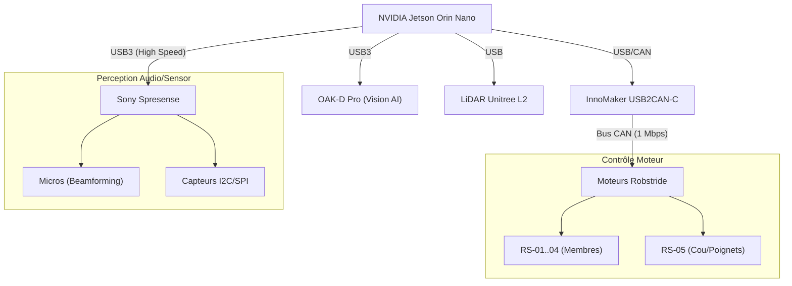

# Synthèse du Projet D-Bot (Évolution)

## 1. Vision et Objectifs
Le projet consiste à construire un robot humanoïde baptisé **D-Bot**.
Il s'agit d'une **évolution majeure** de la plateforme open-source **K-Bot**, améliorée avec des actionneurs modernes et une intelligence embarquée avancée. Ce n'est pas un simple fork, mais une refonte complète de l'architecture électronique et motrice.

### Améliorations Clés (vs K-Bot Original)
Le D-Bot repose sur un système de **22 moteurs RobStride** (20 DOF standard + 2x RS-05 additionnels), une vision IA **Luxonis OAK-D Pro** et un **LiDAR Unitree L2**, le tout piloté par une **NVIDIA Jetson Orin Nano** et une **Sony Spresense**.

## 2. Feuille de Route (Roadmap)
Le projet est découpé en 4 phases distinctes pour valider chaque étape critique.

### Phase 1 : Tête et Torse (En Cours)
*   **Objectif** : Valider l'intelligence perception/audio.
*   **Matériel** : Jetson Orin Nano, OAK-D Pro, Spresense.
*   **Moteurs** : Aucun (0).

### Phase 2 : Premier Bras (Focus Actuel)
*   **Objectif** : Validation mécanique et manipulation.
*   **Matériel** : + 6 Moteurs Robstride (RS-03 épaule, RS-02 coude, RS-00 poignet).
*   **Budget Est.** : ~2 000 €.

### Phase 3 : Deuxième Bras
*   **Objectif** : Coordination bimanuelle.

### Phase 4 : Marche (Jambes)
*   **Objectif** : Locomotion et équilibre dynamique.
*   **Matériel** : + 10-12 Moteurs puissants (RS-04).

## 3. Architecture Matérielle
L'architecture repose sur une séparation claire entre la puissance de calcul (IA) et le contrôle temps réel (Moteurs/Capteurs bas niveau).

## 3. Plateforme de Fabrication (Qidi Plus 4)
La Qidi Plus 4 a été choisie pour sa capacité à imprimer des matériaux techniques à haute température.

- **Matériau Recommandé** : PETG-CF (Facile à imprimer, rigide, esthétique carbone).
- **Paramètres Critiques** :
  - **Chambrages (Counterbore)** : Indispensables pour noyer les têtes de vis.
  - **Tolérances** : Marge de 0.5mm sur les diamètres de perçage vis.
  - **Remplissage** : 100% pour les pièces de force (hanches, épaules), 40% gyroid pour les coques esthétiques.
  - **Connectivité & Réseau** : TP-Link Archer T3U (AC1300 Mbps, USB 3.0, MU-MIMO). Indispensable pour stabiliser la connexion Klipper sur 5GHz.
- **Détails Complets** : Voir le **[Guide Avancé Impression 3D](./09_Guide_Avance_Impression.md)**.

## Stratégie de Développement (Phases)
La construction est divisée en 4 phases pour valider les systèmes progressivement :
1.  **Phase 1 (Tête & Torse)** : Validation de l'intelligence (Jetson/Spresense), de la vision et de l'audio.
2.  **Phase 2 (Premier Bras)** : Validation 6 DOF, Bus CAN et impression structurelle.
3.  **Phase 3 (Deuxième Bras)** : Coordination bimanuelle et transport de charges.
4.  **Phase 4 (Corps & Marche)** : Jambes, équilibre dynamique et autonomie.

## Points de Vigilance Critique (Audit Discussion)
-   **Motorisation** : Le couple de pointe (Peak Torque) des RS-04 (hanches/genoux) atteint 120 Nm. La structure doit être en PA12-CF ou Aluminium 6061.
-   **Sécurité Électrique** : Toujours utiliser le mode **OCP** (Overcurrent Protection) sur l'alimentation Wanptek (limite à 1A pour les premiers tests).
-   **Communication** : Le bus CAN 1 Mbps exige des paires torsadées et une masse commune (GND) entre la Jetson et les moteurs.
-   **Maintenance** : Utiliser des connecteurs **WAGO 221** dans le cou pour faciliter le démontage rapide de la tête.

---
**Note** : Ce projet est une évolution active. Les choix techniques documentés ici reflètent l'état des lieux en Février 2026.
