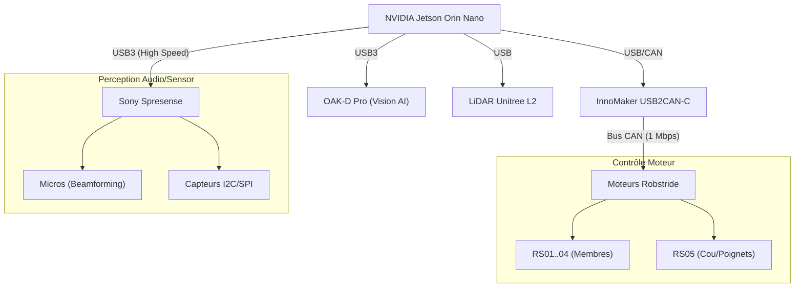

# Synthèse du Projet D-Bot (Évolution)

## 1. Vision et Objectifs
Le projet consiste à construire un robot humanoïde baptisé **D-Bot**.
Il s'agit d'une **évolution majeure** de la plateforme open-source **K-Bot**, améliorée avec des actionneurs modernes et une intelligence embarquée avancée. Ce n'est pas un simple fork, mais une refonte complète de l'architecture électronique et motrice.

### Améliorations Clés (vs K-Bot Original)
- **Motorisation Avancée** : Intégration de moteurs **Robstride RS05** (x2) pour renforcer le cou et les poignets, en plus du kit standard (RS01-RS04).
- **Perception 3D** : Ajout d'un **LiDAR Unitree L2** (sur la tête) et d'une caméra stéréoscopique **OAK-D Pro**.
- **Intelligence Embarquée** : Cerveau principal **NVIDIA Jetson Orin Nano** couplé à une **Sony Spresense** pour la gestion audio/capteurs temps réel.
- **Fabrication** : Impression 3D haute qualité sur une **Qidi Plus 4** avec du filament **PETG-CF** (PETG renforcé fibre de carbone) pour la rigidité structurelle.

## 2. Feuille de Route (Roadmap)
Le projet est découpé en 4 phases distinctes pour valider chaque étape critique.

### Phase 1 : Tête et Torse (En Cours)
*   **Objectif** : Valider l'intelligence perception/audio.
*   **Matériel** : Jetson Orin Nano, OAK-D Pro, Spresense.
*   **Moteurs** : Aucun (0).

### Phase 2 : Premier Bras (Focus Actuel)
*   **Objectif** : Validation mécanique et manipulation.
*   **Matériel** : + 6 Moteurs Robstride (RS03 épaule, RS02 coude, RS00 poignet).
*   **Budget Est.** : ~2 000 €.

### Phase 3 : Deuxième Bras
*   **Objectif** : Coordination bimanuelle.

### Phase 4 : Marche (Jambes)
*   **Objectif** : Locomotion et équilibre dynamique.
*   **Matériel** : + 10-12 Moteurs puissants (RS04).

## 3. Architecture Matérielle
L'architecture repose sur une séparation claire entre la puissance de calcul (IA) et le contrôle temps réel (Moteurs/Capteurs bas niveau).

## 3. Plateforme de Fabrication (Qidi Plus 4)
La Qidi Plus 4 a été choisie pour sa capacité à imprimer des matériaux techniques à haute température.

- **Matériau Recommandé** : PETG-CF (Facile à imprimer, rigide, esthétique carbone).
- **Paramètres Critiques** :
  - **Chambrages (Counterbore)** : Indispensables pour noyer les têtes de vis.
  - **Tolérances** : Marge de 0.5mm sur les diamètres de perçage vis.
  - **Remplissage** : 100% pour les pièces de force (hanches, épaules), 40% gyroid pour les coques esthétiques.

## 4. Points de Vigilance & Risques Techniques (Analyse Fév. 2026)
*   **Distribution Électrique** : Prévoir des régulateurs (BEC) stables pour le 19V (Jetson) et 12V (LiDAR), isolés des pics de courant du 24V Moteurs.
*   **Thermique** : Les coques en PETG/PA12 sont isolantes. Une ventilation active (fan) sera indispensable pour refroidir la Jetson Orin Nano dans le torse.
*   **Bande Passante USB** : Le flux vidéo cumulé (OAK-D + Spresense + L2) peut saturer les contrôleurs. Un **Hub USB 3.0 alimenté** de qualité industrielle sera requis.
*   **Sécurité Physique** : Un bouton d'arrêt d'urgence (Hard E-Stop) coupant physiquement l'alimentation moteurs (relais) est requis pour les phases mobiles.

---
**Note** : Ce projet est une évolution active. Les choix techniques documentés ici reflètent l'état des lieux en Février 2026.
