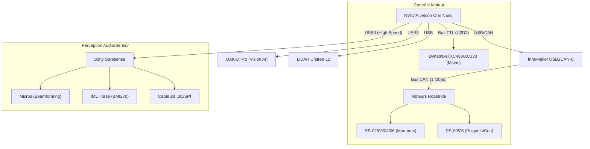

# Synthèse du Projet D-Bot (Évolution)

## 1. Vision et Objectifs
Le projet consiste à construire un robot humanoïde baptisé **D-Bot**.
Il s'agit d'une **évolution majeure** de la plateforme open-source **K-Bot**, améliorée avec des actionneurs modernes et une intelligence embarquée avancée. Ce n'est pas un simple fork, mais une refonte complète de l'architecture électronique et motrice.

### Améliorations Clés (vs K-Bot Original)
Le D-Bot repose sur un système de **24 moteurs RobStride** (membres, cou) et **16 servomoteurs Dynamixel purs** (mains tactiles D-Hand Hybrid à 8 DOF chacune), une vision IA **Luxonis OAK-D Pro** et un **LiDAR Unitree L2**, le tout piloté par une **NVIDIA Jetson Orin Nano** et une **Sony Spresense**.

## 2. Feuille de Route (Roadmap)
Le projet est découpé en 4 phases distinctes pour valider chaque étape critique.

### Phase 1 : Tête et Torse (En Cours)
*   **Objectif** : Valider l'intelligence perception/audio.
*   **Matériel** : Jetson Orin Nano, OAK-D Pro, Spresense.
*   **Moteurs** : Aucun (0).

### Phase 2 : Premier Bras (Focus Actuel)
*   **Objectif** : Validation mécanique et manipulation.
*   **Matériel** : + 6 Moteurs Robstride (RS-03, RS-06, RS-02, RS-00) et **D-Hand Hybrid (4× XC430 + 4× XC330 + eFlesh)**.
*   **Budget Est.** : ~3 000 € (Bras + Main).

### Phase 3 : Deuxième Bras
*   **Objectif** : Coordination bimanuelle.
*   **Matériel** : + 6 Moteurs Robstride et **D-Hand Hybrid**.

### Phase 4 : Marche (Jambes)
*   **Objectif** : Locomotion et équilibre dynamique.
*   **Matériel** : + 12 Moteurs (RS-04 hanches/genoux, RS-02 cheville Pitch avec tirant, RS-00 cheville Roll).
*   **Capteurs** : IMU torse (BMI270 Add-on) pour le contrôle d'équilibre + capteurs FSR plantaires.

## 3. Architecture Matérielle
L'architecture repose sur une séparation claire entre la puissance de calcul (IA) et le contrôle temps réel (Moteurs/Capteurs bas niveau).

```mermaid
graph TD
    A[NVIDIA Jetson Orin Nano] -- "USB3 (High Speed)" --> B[Sony Spresense]
    A -- USB/CAN --> C["InnoMaker USB2CAN-C"]
    C -- "Bus CAN (1 Mbps)" --> D[Moteurs Robstride]
    A -- USB3 --> E["OAK-D Pro (Vision AI)"]
    A -- USB --> F[LiDAR Unitree L2]

    subgraph "Contrôle Moteur"
    D --> D1["RS-02/03/04/06 (Membres)"]
    D --> D2["RS-00/05 (Poignets/Cou)"]
    A -- "Bus TTL (U2D2)" --> D3["Dynamixel XC430/XC330 (Mains)"]
    end

    subgraph "Perception Audio/Sensor"
    B --> B1["Micros (Beamforming)"]
    B --> B2["IMU Torse (BMI270)"]
    B --> B3[Capteurs I2C/SPI]
    end
```

## 4. Plateforme de Fabrication (Stratégie Hybride)

Le D-Bot utilise une approche **Squelette Aluminium CNC + Coque Imprimée 3D** pour combiner la résistance mécanique aux endroits critiques et la facilité de fabrication partout ailleurs.

### Machines Disponibles
- **Qidi X-Plus 4** : Impression 3D haute température (PA12-CF, PETG-CF).
- **NestWorks C500 (Kickstarter)** : CNC 4 axes, usinage aluminium avec tolérances H7 (±0.02mm).

### Répartition des Matériaux par Zone

| Zone | Matériau | Machine | Justification |
| :--- | :--- | :---: | :--- |
| Brackets hanches/genoux (RS-04) | **Alu 6061/7075 CNC** | C500 | 120 N.m de couple, plastics insuffisants |
| Brackets épaules (RS-03) | **Alu 6061 CNC** | C500 | Porte-à-faux du bras |
| Pied / semelle structurelle | **PA12-CF** 100% | Qidi | Résistance aux chocs, rigidité |
| Tibia / avant-bras | **PA12-CF** ou **Alu tubulaire** | Qidi/C500 | Rigidité en flexion |
| Torse (structure interne) | **PA12-CF** 100% | Qidi | Grande surface, CNC trop coûteuse |
| Coques extérieures (torse, bras) | **PETG-CF** 40% gyroid | Qidi | Esthétique carbone, léger |
| Tête (boîtier capteurs) | **PETG-CF** 60% | Qidi | Masse à minimiser |
| Phalanges main | **PA12-CF** → Alu 7075 (V2) | Qidi/C500 | Évolutif avec la C500 |

- **Masse totale estimée** : ~**41.5 kg** (Configuration D finale : RS-04 épaules + RS-06 coudes + Cardan 2×RS-03 chevilles + D-Hand Hybrid ×2).
- **Détails Impression** : Voir le **[Guide Avancé Impression 3D](./09_Guide_Avance_Impression.md)**.
- **Détails CNC** : Voir l'**[Usinage CNC C500](./22_Usinage_CNC_C500.md)**.

## 5. Points de Vigilance Critique (Audit Discussion)
-   **Motorisation** : Le couple de pointe (Peak Torque) des RS-04 (hanches/genoux) atteint 120 Nm. La structure doit être en PA12-CF ou Aluminium 6061.
-   **Sécurité Électrique** : Toujours utiliser le mode **OCP** (Overcurrent Protection) sur l'alimentation Wanptek (limite à 1A pour les premiers tests).
-   **Communication** : Le bus CAN 1 Mbps exige des paires torsadées et une masse commune (GND) entre la Jetson et les moteurs.
-   **Maintenance** : Utiliser des connecteurs **WAGO 221** dans le cou pour faciliter le démontage rapide de la tête.

---
**Note** : Ce projet est une évolution active. Les choix techniques documentés ici reflètent l'état des lieux en Février 2026.
