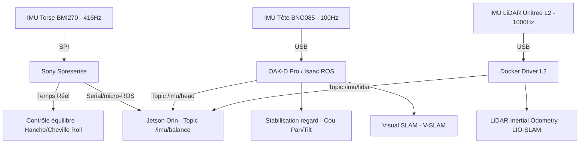

# 18 — Stratégie IMU et Fusion Sensorielle

> [!IMPORTANT]
> **Mise à jour Avril 2026** : Ce document centralise la stratégie de capture du mouvement et de l'équilibre du D-Bot, précédemment dispersée dans les guides audio et vision.

Le D-Bot exploite **3 IMUs** positionnées stratégiquement, chacune avec un rôle clairement défini pour assurer la stabilité de la marche, la précision du SLAM et le confort visuel.

---

## 1. Matrice des Rôles IMU

| IMU | Capteur | Position | Fréquence | Rôle Principal | Rôle Secondaire |
| :--- | :--- | :--- | :---: | :--- | :--- |
| **IMU Torse** | **Bosch BMI270** (Add-on Spresense) | Torse (Centre de Masse) | **416 Hz** | 🔴 **Équilibre bipède** | Détection de chute (Watchdog) |
| **IMU Tête** | BNO085/BMI270 (OAK-D Pro) | Front (Tête) | 100 Hz | **Stabilisation regard** | V-SLAM visuel |
| **IMU LiDAR** | IMU intégrée (Unitree L2) | Haut du Torse | **1000 Hz** | **Odométrie LiDAR** (LIO-SLAM) | Fusion avec V-SLAM | ⚠️ **V2** |

---

## 2. Architecture de Fusion et Flux de Données

---

## 3. Justifications et Règles d'Ingénierie

### 3.1 Indépendance Tête/Corps
L'IMU de l'OAK-D (dans la tête) **ne doit PAS être utilisée pour l'équilibre du corps**. La tête bouge indépendamment du torse via les 2 DOF du cou (Pan RS-05 + Tilt RS-05). Son IMU mesure l'orientation de la **tête**, pas du **corps**.

> [!CAUTION]
> **Règle d'or** : L'IMU la plus proche du centre de masse (CoM) définit le référentiel d'équilibre. C'est impérativement le **BMI270 situé dans le torse** (via Spresense).

### 3.2 Migration depuis SensiEDGE CommonSense
La carte **SensiEDGE CommonSense** (IMU LSM6DSOX + capteurs environnementaux), initialement prévue, a été écartée car sa distribution est réservée aux clients professionnels.
- **Remplacement** : **BMI270 Add-on Board** (Switch Science / Bosch). 
- **Avantages** : Compatible nativement avec la Spresense, 6 axes (accéléromètre + gyroscope), communication I2C/SPI robuste, bibliothèque Arduino standard.

---

## 4. Évolutions et Précision Extrême

### 4.1 Option High-End : Spresense Multi-IMU
Pour des évolutions futures nécessitant une marche dynamique sur terrain complexe (Phase 3+), la carte **Sony Spresense Multi-IMU Add-on** est recommandée. Elle embarque 16 IMUs MEMS fusionnées en une seule donnée, atteignant un niveau de dérive quasi nul, comparable à des gyroscopes à fibre optique (FOG).

### 4.2 Surveillance Interne du Torse
Suite au retrait du SensiEDGE, la surveillance environnementale est simplifiée :
- **Température Moteur** : Thermistances collées sur les RS-04 (Hanche Pitch / Genou) → ADC Spresense.
- **Pression/Humidité** : Non critiques pour la V1 en intérieur.
- **Magnétomètre** : Écarté pour la V1 (pas de besoin de cap magnétique absolu en intérieur SLAM).

---
*Document créé en Avril 2026 — Extraction de la documentation Audio/Perception pour isolation de la stratégie de navigation et d'équilibre.*
