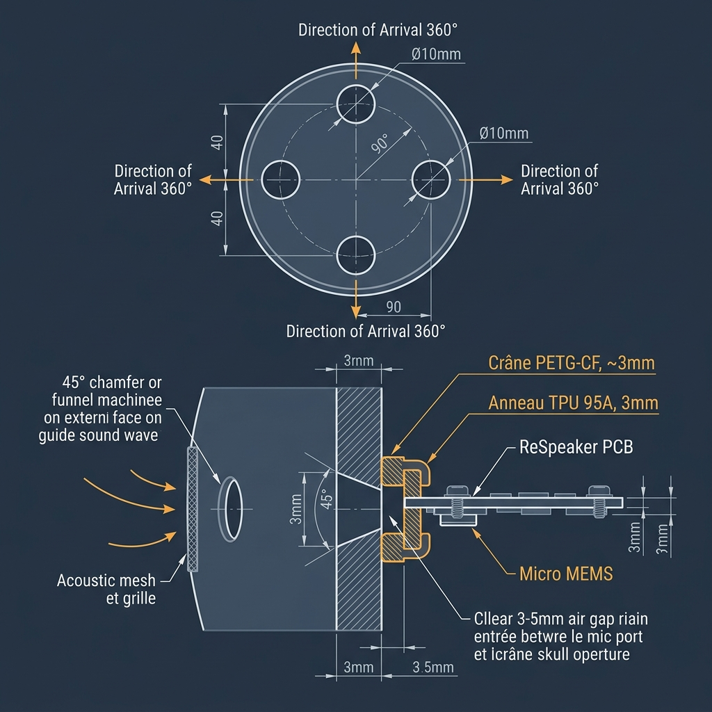

# 08 - Architecture Audio (XVF-3800)

## 1. Cerveau IA (Jetson Orin Nano Super)
Le cœur du traitement audio et cognitif du D-Bot est la **NVIDIA Jetson Orin Nano Super** (67 TOPS). Grâce à ses *Tensor Cores*, le robot fait tourner la suite logicielle **NVIDIA Riva** intégralement en local (sans serveur cloud, latence quasi nulle) :
- **ASR (Speech-to-Text)** : Compréhension de la parole.
- **NLP** : Analyse de l'intention humaine.
- **TTS (Text-to-Speech)** : Voix de synthèse naturelle.

> *Marge Processeur : La marche, la vision OAK-D et l'audio IA consomment environ 52% du processeur au maximum, laissant 48% de marge de sécurité.*

## 2. Architecture Audio Simplifiée (ReSpeaker XVF-3800)

> [!NOTE]
> **Simplification V1 (Mars 2026)** : L'ancienne architecture "Luxe" (8 micros PDM + Spresense DSP + Jabra Speak 510) a été remplacée par un **module unique** ReSpeaker XVF-3800. Cette décision s'aligne sur les pratiques de l'industrie (Unitree G1 : 4 micros, Figure 02 : micros intégrés, 1X NEO : micros + LLM).

### 2.1 Module Unique : Seeed ReSpeaker XVF-3800

| Caractéristique | Détail |
| :--- | :--- |
| **Chip** | XMOS XVF-3800 |
| **Microphones** | 4× MEMS numériques (arrangement circulaire) |
| **DoA (Direction of Arrival)** | ✅ 360° (traitement on-chip) |
| **Beamforming** | ✅ (on-chip, focalisation sur la voix cible) |
| **AEC (Annulation d'Écho)** | ✅ Matériel (élimine la voix TTS du HP) |
| **Suppression de Bruit** | ✅ (on-chip, moteurs + environnement) |
| **Dé-réverbération** | ✅ (on-chip) |
| **VAD** | ✅ Détection d'activité vocale |
| **Haut-parleur intégré** | ❌ Non — Sortie JST amplifiée 5W |
| **Sortie audio** | Jack 3.5mm + **connecteur JST 5W** |
| **Interface** | **USB** (Plug-and-play Jetson, PulseAudio natif) |
| **Dimensions** | Ø70 mm (version ronde avec boîtier) |
| **Masse** | ~30 g |
| **Prix** | ~35 € |

**Achat (France)** :
- [Gotronic.fr](https://www.gotronic.fr) — Distributeur français, stock local
- [Seeed Studio](https://www.seeedstudio.com) — Direct fabricant, livraison internationale
- [AliExpress](https://www.aliexpress.com) — Alternative économique

**Ressources Techniques & CAO (STEP) :**
- [Wiki Officiel ReSpeaker XVF-3800](https://wiki.seeedstudio.com/respeaker_xvf3800_introduction/#resources) (Inclut les fichiers 3D)

### 2.2 Haut-Parleur Externe (TTS)

> [!IMPORTANT]
> **Ouverture du Boîtier Obligatoire** : Pour utiliser le haut-parleur suggéré, il est nécessaire de dévisser le boîtier en plastique du ReSpeaker. Le connecteur JST (1.25mm) est situé directement sur le PCB.
> 
> **Lien AEC (Hardware Echo Cancellation)** : Le HP **doit** être branché sur le port JST interne du ReSpeaker. Si vous branchez un HP séparé sur la Jetson, la fonction d'annulation d'écho matérielle (AEC) ne fonctionnera pas, empêchant ainsi le robot de vous entendre pendant qu'il parle.

| Composant | Spécification | Prix |
| :--- | :--- | :---: |
| HP 5W 8Ω (40mm) | Connecteur JST 1.25, ~20 g | ~5 € |

### 2.3 Placement dans le Robot

```
                    ┌─────────────────────────┐
                    │       CRÂNE (top)        │
                    │                          │
                    │   ┌──────────────────┐   │
                    │   │  ReSpeaker Ø70mm │   │ ← 4 micros DoA 360°
                    │   │  (USB → Jetson)  │   │
                    │   └──────────────────┘   │
                    │                          │
                    │ ~~~~~~~~ MOUSSE ~~~~~~~~ │ ← Isolation acoustique
                    │                          │
                    │   ┌──────────────────┐   │
                    │   │  HP 5W (JST)     │   │ ← Zone buccale (grille)
                    │   └──────────────────┘   │
                    │                          │
                    │       OAK-D Pro (FF)     │ ← Vision (front)
                    └──────────┬───────────────┘
                                │ Cou (USB dans tube)
                              TORSE
```

- **ReSpeaker** : Sommet du crâne (intérieur de la coque). Les 4 micros circulaires captent le son à 360° sans obstruction.
- **HP 5W** : Zone buccale (derrière la grille faciale). Séparé physiquement des micros par une **mousse haute densité** pour éviter la repisse sonore.

#### 2.3.1 Intégration Acoustique dans le Crâne (Guide Complet)



##### A. Les 4 Ouvertures Acoustiques dans le Crâne

Pour que le beamforming et la DoA fonctionnent, les 4 micros doivent "entendre" le son dans des conditions **symétriques**. Si un micro est étouffé par rapport aux autres, l'algorithme calcule mal la direction de la voix.

**Spécifications des ouvertures :**
- **Nombre** : 4 trous individuels (pas une grande ouverture commune)
- **Diamètre** : **Ø10 mm** chacun — trop petit (< 5 mm) coupe les fréquences basses de la voix
- **Forme** : **Évasée vers l'extérieur** (chanfrein 45° sur la face externe, ~1 mm de profondeur). Ce pavillon acoustique miniature guide les ondes vers le micro
- **Position** : alignés à 90° les uns des autres, en face exacte de chaque micro MEMS sur le PCB
- **Protection extérieure** : coller un petit disque de **tissu acoustique** (mousse fine type "ear pad" ou grille de smartphone) sur la face externe de chaque trou. Protège contre la poussière et atténue les plosives ("P", "B") qui saturent les micros

> [!CAUTION]
> **Ne jamais boucher les trous avec du PETG plein** en pensant que "le son passe quand même". Les micros MEMS sont des capteurs de pression — ils exigent un chemin d'air direct vers l'extérieur.

##### B. Support Anti-Vibration TPU (Anneau Amortisseur)

Les moteurs RS-05 du cou transmettent des vibrations mécaniques au crâne. Sans découplage, les micros captent le bruit mécanique du robot au lieu de la voix.

**Architecture recommandée (vue en coupe) :**

```
Extérieur    Crâne PETG-CF    Anneau TPU 95A     ReSpeaker PCB
   │        │░░░░░░░░░│      │████████████│     │══════════│
   │ son →  │ ○ 10mm  │ 3mm  │  espace    │     │  🎤 MEMS │
   │        │ chanfr. │ air  │  souple    │     │          │
   │        │░░░░░░░░░│      │████████████│     │══════════│
```

**Conception de l'anneau TPU :**
- **Matériau** : TPU 95A-HF Qidi (✅ déjà en stock) — assez souple pour absorber les vibrations, assez rigide pour maintenir le PCB
- **Forme** : anneau circulaire épousant le contour du ReSpeaker (Ø~70 mm), avec 4 plots de fixation intégrés aux emplacements des vis du PCB
- **Épaisseur** : **3 mm** — compromis entre isolation et proximité micro↔ouverture
- **Fixation anneau → crâne** : **4× vis nylon M2** à travers l'anneau souple → inserts heat-set dans le crâne
- **Fixation PCB → anneau** : **entretoises TPU imprimées** (pas métalliques) + **vis nylon M2** (les vis nylon transmettent moins de vibrations que les vis métal)

> [!IMPORTANT]
> **Règle d'or : AUCUN contact rigide direct** entre le PCB du ReSpeaker et le crâne en PETG-CF. Tout contact mécanique doit passer par le TPU souple.

##### C. Espace d'Air Micro ↔ Ouverture

- **Distance optimale** : **3 à 5 mm** d'air libre entre le port du micro MEMS et l'ouverture dans le crâne
- **Pas de mousse dans cet espace** (sauf la grille fine côté extérieur) — l'air doit circuler librement
- **Étanchéité inter-micros** : l'anneau TPU doit créer des joints souples autour de chaque zone micro, empêchant le son de fuiter entre les 4 canaux (sinon le beamforming perd sa directivité)
- Si cet espace est trop profond (> 10 mm), il crée un tube qui colore le son ("voix dans un tuyau")

##### D. Réduction du Bruit Interne

- **Tapisser l'intérieur du crâne** avec une fine couche de mousse acoustique adhésive (type mousse de calage smartphone, 2-3 mm) pour absorber les réflexions et résonances internes
- **Ne pas obstruer** les zones en face des 4 ouvertures des micros avec cette mousse !

##### E. Position du Haut-Parleur

> [!WARNING]
> Le HP CQRobot 5W (✅ acheté) **ne doit PAS être directement au-dessus des micros** dans le crâne. Malgré l'AEC (Acoustic Echo Cancellation) logiciel du XVF-3800, les vibrations mécaniques du HP satureraient les micros par couplage structurel.

- **Position recommandée** : partie basse du crâne (zone buccale, derrière une grille faciale) ou dans le torse
- **Séparé des micros** par une zone de mousse haute densité
- L'AEC du XVF-3800 gère très bien l'écho acoustique (via l'air) mais ne peut pas compenser les vibrations mécaniques directes

- **Câblage** : Un seul câble USB descend dans le cou vers le Hub USB Jetson. Le HP est relié au ReSpeaker par un fil JST de ~15 cm.

### 2.4 Intégration Logicielle

- **Routage Audio (PulseAudio)** : JetPack 6 (L4T) reconnaît nativement le ReSpeaker comme source USB. PulseAudio le configure automatiquement en *Source* ASR et *Sink* TTS (via la sortie HP).
- **DoA via ROS2** : Le ReSpeaker publie les données DoA sur **`/audio/doa`** (via un nœud ROS2 léger, basé sur le package `respeaker_ros2`). Le cou Pan/Tilt s'oriente automatiquement vers la source sonore.
- **"Muzzle" ROS2** : Le nœud de contrôle audio baisse algorithmiquement la sensibilité d'écoute lorsque les moteurs forcent, ignorant les bruits mécaniques.

### 2.5 Schéma de Routage Audio

```
                           ┌──────────────────┐
                           │  ReSpeaker USB   │
                           │  (XMOS XVF-3800) │
                           │                  │
[4 Micros MEMS] ─────────┤  DoA 360°        ├──── USB ──→ Jetson (PulseAudio)
                           │  Beamforming     │              │
                           │  AEC + NS        │              ├─→ Riva ASR → ROS2 /audio/command
                           │                  │              ├─→ DoA → ROS2 /audio/doa → Cou Pan/Tilt
                           │  Sortie JST 5W ──┼──→ HP 5W    ├─← Riva TTS (Voix)
                           └──────────────────┘
```

### 2.6 Comparatif Ancien vs Nouveau Système

| Critère | Ancien (8-mic + Jabra) | **Nouveau (ReSpeaker)** |
| :--- | :---: | :---: |
| **Coût** | ~180 € | **~40 €** |
| **Masse** | ~250 g | **~50 g** (ReSpeaker + HP) |
| **Câblage** | 10+ fils blindés | **1 câble USB + 1 JST** |
| **EMI à gérer** | Critique (8 lignes PDM) | **Aucun** (traitement on-chip) |
| **DoA 360°** | ✅ | ✅ |
| **AEC** | ✅ (Jabra) | ✅ (on-chip) |
| **Complexité montage** | Très élevée | **Très faible** |

> [!IMPORTANT]
> **Impact sur la Spresense** : La Spresense **ne gère plus l'audio**. Ses rôles restants sont : Watchdog (heartbeat Jetson), Power Management (surveillance batterie 12S, MOSFET 48V), IMU BMI270 (équilibre bipède 416 Hz), lecture des FSR plantaires (ADC), et thermistances moteurs. Les deux cartes (Main Board + Extension Board) restent nécessaires pour ces fonctions critiques. Voir [Guide Watchdog](./11_Guide_SensiEDGE_Watchdog.md).

---
*Document réorganisé en Avril 2026 — Extraction de la documentation IMU vers le document 18 dédié.*
