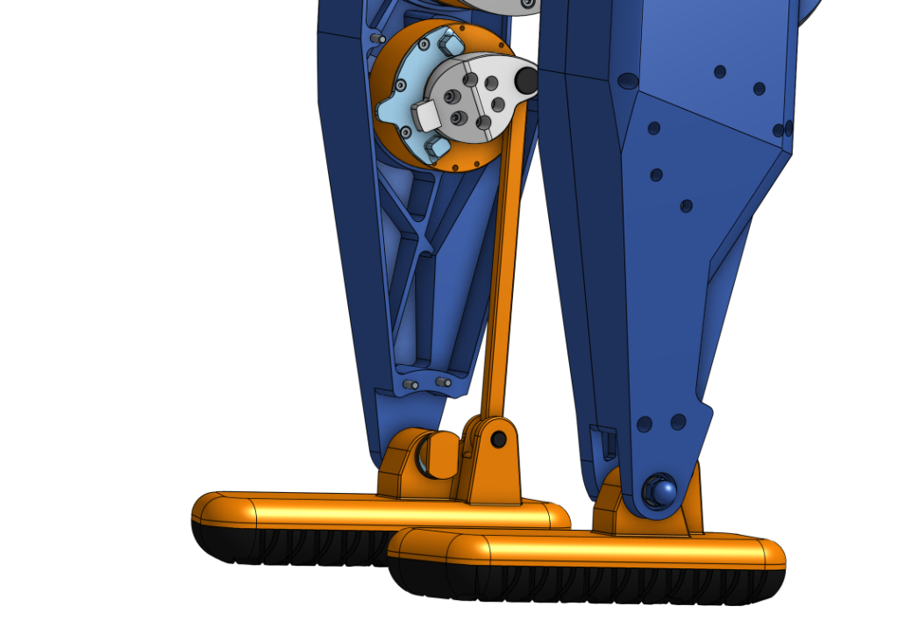
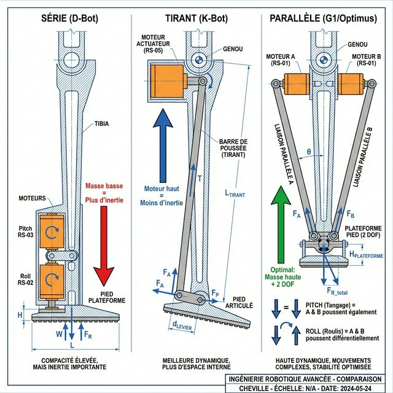

# 14 - Cinématique & Choix Moteurs

Ce document détaille l'architecture cinématique du D-Bot (**Standard 24 DOF**) et les spécifications techniques des actionneurs **RobStride**.

## 1. Configuration K-Bot Standard (20 DOF)

### 📊 Architecture Officielle K-Scale
Le K-Bot standard est un robot humanoïde open-source de taille réelle développé par K-Scale Labs, équipé de **20 moteurs RobStride** pour 20 degrés de liberté. La configuration D-Bot étend cette base avec une tête articulée.

**Source** : [K-Scale Official Documentation](https://docs.kscale.dev/robots/k-bot/motor-id-mapping)

---

### 🦾 BRAS (10 moteurs - 5 par bras)

**Configuration par bras :**

| Articulation | Moteur | IDs<br/>(G/D) | Couple<br/>Pic | Couple<br/>Nom. | Poids | Fonction |
| :--- | :---: | :---: | :---: | :---: | :---: | :--- |
| **Épaule Pitch** | RS-03 | 11 / 21 | 60 N.m | 20 N.m | 880g | Lever le bras |
| **Épaule Roll** | RS-03 | 12 / 22 | 60 N.m | 20 N.m | 880g | Écarter le bras |
| **Épaule Yaw** | RS-02 | 13 / 23 | 17 N.m | 6 N.m | 405g | Rotation interne |
| **Coude Pitch** | RS-02 | 14 / 24 | 17 N.m | 6 N.m | 405g | Flexion |
| **Poignet Roll** | RS-00 | 15 / 25 | 14 N.m | 5 N.m | 310g | Orientation fine |

**Total par bras** : 3 kg environ  
**Total 2 bras** : 10 moteurs (4× RS-03 + 4× RS-02 + 2× RS-00)

---

### 🦵 JAMBES (10 moteurs - 5 par jambe)

**Configuration par jambe :**

| Articulation | Moteur | IDs<br/>(G/D) | Couple<br/>Pic | Couple<br/>Nom. | Poids | Fonction |
| :--- | :---: | :---: | :---: | :---: | :---: | :--- |
| **Hanche Pitch** | RS-04 | 31 / 41 | 120 N.m | 40 N.m | 1420g | Flexion jambe |
| **Hanche Roll** | RS-03 | 32 / 42 | 60 N.m | 20 N.m | 880g | Équilibre latéral |
| **Hanche Yaw** | RS-03 | 33 / 43 | 60 N.m | 20 N.m | 880g | Rotation hanche |
| **Genou Pitch** | RS-04 | 34 / 44 | 120 N.m | 40 N.m | 1420g | Flexion genou |
| **Cheville Pitch** | RS-02 | 35 / 45 | 17 N.m | 6 N.m | 405g | Propulsion (via mécanisme tirant) |

**Total par jambe** : 4.6 kg environ  
**Total 2 jambes** : 10 moteurs (4× RS-04 + 4× RS-03 + 2× RS-02)

---

### 🔢 INVENTAIRE K-BOT STANDARD

| Modèle | Quantité | Poids Unit. | Poids Total | Usage Principal |
| :---: | :---: | :---: | :---: | :--- |
| **RS-04** | 4 | 1420g | 5.68 kg | Hanches Pitch + Genoux |
| **RS-03** | 8 | 880g | 7.04 kg | Épaules + Rotations hanches |
| **RS-02** | 6 | 405g | 2.43 kg | Coudes + Yaw épaules + Chevilles |
| **RS-00** | 2 | 310g | 0.62 kg | Poignets |
| **TOTAL** | **20** | | **15.77 kg** | Total moteurs K-Bot |

---

### 🤖 ÉVOLUTION D-BOT (24 DOF — "D-Bot Performance")

Le **D-Bot** étend le K-Bot de 20 à **24 DOF** avec trois ajouts. Voir [Analyse Biomécanique](./15_Analyse_Biomecanique.md) pour la justification détaillée de chaque upgrade.

| Ajout D-Bot | Moteur | Quantité | Couple Pic | Fonction |
| :--- | :---: | :---: | :---: | :--- |
| **Cou Pan** (Yaw) | RS-05 | 1 | 5.5 N.m | Rotation horizontale tête |
| **Cou Tilt** (Pitch) | RS-05 | 1 | 5.5 N.m | Inclinaison tête |
| **Cheville Pitch** ⬆️ | RS-02 → **RS-03** | 2 (remplacement) | 17 → **60 N.m** | **Propulsion améliorée** (K-Bot trop faible en direct-drive) |
| **Cheville Roll** 🆕 | RS-00 | 2 (ajout) | 14 N.m | **Stabilité latérale** (compact, précis) |

**Total D-Bot** : 20 (Base) + 2 (Tête) + 2 (Chevilles Roll) = **24 moteurs**, avec upgrade Pitch intégré.

> [!NOTE]
> **Mécanisme de cheville K-Bot (Tirant/Linkage)** : Dans le K-Bot original, le RS-02 de cheville n'est **pas en prise directe** sur l'axe de la cheville. Il est monté **haut dans le tibia** et actionne le pied via un **mécanisme de tirant** (connecting rod / pushrod). Ce bras de levier crée un avantage mécanique (~2-3:1) qui multiplie le couple effectif : 17 N.m × 2 ≈ **34 N.m** à la cheville, suffisant pour la marche lente. Pour le D-Bot, l'upgrade en RS-03 élimine le besoin de ce mécanisme et permet un montage **direct-drive** plus simple.



## 2. Spécifications Moteurs RobStride (Gamme Complète)
Voici les données techniques consolidées pour l'ensemble de la gamme RobStride (Février 2025).  
*Prix officiels RobStride ou sources vérifiées (OpenELAB, AiFitLab) - Hors taxes/livraison.*

| Modèle | Pic<br/>(N.m) | Nom.<br/>(N.m) | Vmax<br/>(RPM) | Poids<br/>(g) | Dim.<br/>(mm) | Ratio | Prix<br/>($) | Volt.<br/>(V) | Usage D-Bot |
| :--- | :---: | :---: | :---: | :---: | :---: | :---: | :---: | :---: | :--- |
| **RS-05** | **5.5** | 1.6 | 480 | **191** | 46×46×44 | 7.75:1 | **$120** | 48V (15-60V) | **Cou**, Doigts (futur) |
| **RS-00** | **14.0** | 5.0 | 315 | **310** | 57×57×51 | 10:1 | **$135** | 48V (24-60V) | **Poignet** (Compact, fort couple) |
| **RS-01** | **17.0** | 6.0 | 350 | **380** | 78.5×78.5×40 | 7.75:1 | **$140** | 36V (24-48V) | Alternative RS-02 (36V) |
| **RS-02** | **17.0** | 6.0 | 410 | **405** | 78.5×78.5×45.5 | 7.75:1 | **$160** | 48V (24-60V) | **Coude**, Biceps, Poignet |
| **RS-06** | **36.0** | 11.0 | 480 | **621** | 88×88×49 | 9:1 | **$230** | 48V (15-60V) | Entre-deux (Épaule légère) |
| **RS-03** | **60.0** | 20.0 | 195 | **880** | 106×106×56 | 9:1 | **$250** | 48V (15-60V) | **Épaule** (Force brute) |
| **RS-04** | **120.0** | 40.0 | 200 | **1420** | 120×120×56 | 9:1 | **$280** | 48V (15-60V) | **Hanche**, Genou, Cheville |

### Analyse Comparative

####  RS-05 vs RS-00 (Petits Moteurs)
*   **RS-05** : Ultraléger (191g), idéal pour le cou où chaque gramme compte. Couple modeste (5.5 N.m) mais suffisant pour orientation.
*   **RS-00** : Plus dense (310g, +62%) mais délivre **2,5× plus de couple** (14 N.m). Parfait pour un poignet devant porter des charges sans fléchir.

#### RS-01 vs RS-02 (Moteurs Moyens)
*   **Même couple** (17 N.m pic), mais **RS-01** optimisé pour **36V** (idéal pour batteries LiPo 8S), plus compact en profondeur (40mm vs 45.5mm).
*   **RS-02** : Conçu pour **48V**, marginalement plus lourd (+25g). Standard pour D-Bot aux coudes/biceps.

#### RS-06 (Intermédiaire Nouveau)
*   **Niche** : Entre RS-02 (17 N.m) et RS-03 (60 N.m). Avec **36 N.m** et 621g, c'est un compromis pour des articulations nécessitant plus que du RS-02 sans le poids du RS-03.
*   **Usage potentiel** : Épaule de petits robots, torse rotation, ou remplacer un RS-03 si l'on veut économiser 260g et 20$.

#### RS-03 vs RS-04 (Gros Moteurs)
*   **Saut de performance brutal** : RS-03 → 60 N.m (880g) ; RS-04 → **120 N.m** (1420g, +61% poids).
*   **RS-03** : Minimum vital pour l'épaule D-Bot (couple nécessaire pour contrer le bras-de-levier).
*   **RS-04** : Incontournable pour hanches/jambes. **Attention** : Peut briser des pièces PLA/PETG standard → Utiliser **PETG-CF (100% remplissage)** ou **Alu 6061 CNC**.

### Choix pour le D-Bot — Répartition Complète (24 DOF)
| Zone | Moteur | Quantité | Couple Pic | Justification |
| :--- | :---: | :---: | :---: | :--- |
| Cou (Pan/Tilt) | RS-05 | 2 | 5.5 N.m | Légèreté critique (tête avec OAK-D Pro ~100g, LiDAR L2 sur le torse) |
| Poignet | RS-00 | 2 | 14 N.m | Compact, fort couple pour manipulation fine |
| Épaule Yaw + Coude | RS-02 | 4 | 17 N.m | Standard polyvalent 48V |
| Épaule Pitch/Roll | RS-03 | 4 | 60 N.m | Force pour porte-à-faux bras tendu |
| Hanche Roll/Yaw | RS-03 | 4 | 60 N.m | Équilibre latéral + rotation |
| Hanche Pitch + Genou | RS-04 | 4 | 120 N.m | Portance totale (~36 kg robot) |
| **Cheville Pitch** ⬆️ | **RS-03** | **2** | **60 N.m** | **Propulsion (upgrade vs RS-02 K-Bot)** |
| **Cheville Roll** 🆕 | **RS-00** | **2** | **14 N.m** | **Stabilité latérale (compact, ratio 10:1)** |

**Total moteurs D-Bot** : 2 + 2 + 4 + 4 + 4 + 4 + 2 + 2 = **24 moteurs**.

## 3. Communication & Alimentation
Tous les moteurs partagent le même protocole :
*   **Bus** : CAN 2.0B @ 1 Mbps.
*   **Alimentation** : 48V DC Nominal (Supportent 24V mais avec couple/vitesse réduits). RS-01 optimisé pour 36V.
*   **Câblage** : Daisy-chain (Chaîne) via connecteurs JST-GH 1.25mm (Data) et XT60 (Power).
*   **Encodeurs** : Dual 14-bit magnetic encoders (haute précision + redondance).
*   **Protection** : IP52 standard (IP67 en option sur certains modèles).

> [!WARNING]
> **Attention au RS-04** : Avec 120 N.m de couple, ce moteur peut briser des pièces imprimées en PLA ou PETG standard en cas de collision. Utilisez impérativement du **PETG-CF** (Remplissage 100%) ou des pièces CNC Alu 6061 pour les brackets de hanches.

> [!NOTE]
> **Prix et Disponibilité** : Les prix sont issus des sources officielles RobStride et distributeurs agréés (OpenELAB, AiFitLab) en Février 2025. Vérifiez la disponibilité avant commande - certains modèles peuvent avoir des délais variables.

---

## 4. Benchmark Industrie — D-Bot vs Robots Haut de Gamme

### 4.1 Comparatif Global (Corps Entier)

| Robot | DOF | DOF/Jambe | Cheville | Méca. Cheville | Couple max jambe | Poids | Actionneurs | Prix |
| :--- | :---: | :---: | :---: | :--- | :---: | :---: | :--- | :---: |
| **D-Bot (notre)** | **24** | **6** | **2 (P+R)** | **Série QDD** | **120 N.m** (RS-04) | ~38 kg | QDD RobStride 9:1 | ~$5k |
| K-Bot (base) | 20 | 5 | 1 (P) | Tirant (linkage) | 120 N.m (RS-04) | ~34 kg | QDD RobStride 9:1 | ~$4k |
| **Unitree G1** | 23 | **6** | **2** | **Parallèle RSU** | **120 N.m** | 35-47 kg | QDD propriétaire | ~$16k |
| **Tesla Optimus** | 28+ | 6 | 2 | **Parallèle SPU** | **180 N.m** rotary / 8000N linéaire | ~73 kg | Harmonic + Linéaire | N/A |
| **Figure 02** | 28 | 6 | 2 | **Universel + linéaire** | **150 N.m** | ~60 kg | Custom harmonic | N/A |
| **Fourier GR-2** | 53 | ~8 | 2+ | **Parallèle** (FSA 2.0) | **380 N.m** | 63 kg | FSA 2.0 (7 types) | ~$150k |
| **Agility Digit** | 28 | 5 | 2 | **SEA** (élastique) | N/A | 65 kg | Series-Elastic | ~$300k+ |

> [!NOTE]
> **Positionnement D-Bot** : Avec 24 DOF, 6 DOF/jambe et 2 DOF cheville, le D-Bot est au niveau du Unitree G1 en terme d'architecture cinématique, pour un budget 3× inférieur. Le principal écart est le type de mécanisme de cheville (série vs parallèle).

### 4.2 Mécanismes de Cheville — Les 4 Approches



#### A. Série Direct-Drive (D-Bot Actuel)

Les moteurs Pitch (RS-03) et Roll (RS-00) sont empilés **directement à la cheville**. Le couple au pied = le couple moteur.

| Paramètre | Valeur |
| :--- | :--- |
| **Moteurs** | RS-03 (Pitch) + RS-00 (Roll), tous à la cheville |
| **Masse distale** | **~1190g** (880g + 310g) |
| **Couple Pitch effectif** | 60 N.m (= couple RS-03) |
| **Couple Roll effectif** | 14 N.m (= couple RS-00, suffisant corrections fines) |
| **Complexité** | ⭐ Très faible — assemblage trivial |
| **Coût mécanique** | ~$0 (juste le bracket en L) |

#### B. Tirant / Linkage (K-Bot Original)

Le moteur RS-02 est monté **en haut du tibia** et actionne le pied via un **pushrod** (barre de poussée). Le ratio de levier multiplie le couple.

| Paramètre | Valeur |
| :--- | :--- |
| **Moteurs** | RS-02 (Pitch uniquement), haut dans le tibia |
| **Masse distale** | **~0g** (moteur en haut) |
| **Couple Pitch effectif** | ~34 N.m (17 × ratio ~2:1) |
| **Roll** | ❌ Absent |
| **Complexité** | ⭐⭐ Moyenne — pushrod + pivot |
| **Coût mécanique** | ~$20-50 (barre usinée + pivots) |

#### C. 🆕 Hybride Tirant + Roll Direct (Proposition D-Bot V2)

**Combine le meilleur des deux mondes** : Pitch via tirant (moteur haut, couple multiplié) + Roll en direct-drive à la cheville (correction fine, pas besoin de rapport de levier).

| Paramètre | Valeur |
| :--- | :--- |
| **Moteur Pitch** | RS-03 monté **haut dans le tibia** + pushrod |
| **Moteur Roll** | RS-00 monté **à la cheville** (direct-drive) |
| **Masse distale** | **~310g** (seulement le RS-00 Roll) |
| **Couple Pitch effectif** | **~120 N.m** (60 × ratio ~2:1) ⚡ |
| **Couple Roll effectif** | 14 N.m (suffisant pour correction latérale) |
| **Complexité** | ⭐⭐⭐ Élevée — pushrod + bracket + pivot |
| **Coût mécanique** | ~$50-100 (barre, pivots, usinage) |

```
  ┌─────┐
  │GENOU│
  └──┬──┘
     │
  ╔══╧══╗ RS-03 Pitch ← Moteur HAUT (880g)
  ║PITCH║──────┐
  ╚═════╝      │ Pushrod
     │ Tibia   │ (barre de poussée)
     │         │
     │         │ Ratio levier ~2:1
     │         │ → 60 × 2 = 120 N.m effectifs !
     │         │
     │    ╔════╧═╗
     └────╢ ROLL ╟── RS-02 (405g) ← Seul moteur EN BAS
          ╚══╤═══╝
          ┌──┴──┐
          │PIED │
          └─────┘
```

#### D. Parallèle (Unitree G1, Tesla Optimus, Fourier GR-2)

Deux moteurs montés **en haut du tibia**, chacun relié au pied par une **bielle**. Mouvements coordonnés = Pitch, différentiels = Roll. **Aucun moteur à la cheville.**

| Paramètre | Valeur |
| :--- | :--- |
| **Moteurs** | 2× moteurs rotatifs (ou linéaires) haut dans le tibia |
| **Masse distale** | **~0g** |
| **Couple Pitch effectif** | Variable, typiquement 80-150 N.m |
| **Couple Roll effectif** | Variable, typiquement 40-80 N.m |
| **Complexité** | ⭐⭐⭐⭐ Très élevée — cinématique parallèle |
| **Coût mécanique** | >$200 (bielles, pivots, roulements, usinage CNC) |

### 4.3 Impact sur la Marche et la Course

| Critère | A. Série (D-Bot) | B. Tirant (K-Bot) | C. 🆕 Hybride | D. Parallèle (G1) |
| :--- | :---: | :---: | :---: | :---: |
| **Masse distale (par jambe)** | 1285g | ~0g | **405g** | ~0g |
| **Couple Pitch effectif** | 60 N.m | ~34 N.m | **~120 N.m** ⚡ | 80-150 N.m |
| **Couple Roll** | 17 N.m | ❌ | 17 N.m | 40-80 N.m |
| **Marche lente (<1 km/h)** | ✅ OK | ✅ OK (pas de Roll) | ✅ **Excellent** | ✅ Optimal |
| **Marche rapide (2-3 km/h)** | ⚠️ Limite | ❌ (pas de Roll) | ✅ **Bon** | ✅ Optimal |
| **Course (>5 km/h)** | ❌ Trop d'inertie | ❌ (1 DOF) | ⚠️ **Possible** (~405g ok) | ✅ Optimal |
| **Terrain irrégulier** | ✅ (2 DOF) | ❌ (1 DOF) | ✅ (2 DOF) | ✅ (2 DOF) |
| **Simplicité montage** | ⭐ Trivial | ⭐⭐ Moyen | ⭐⭐⭐ Élevé | ⭐⭐⭐⭐ Très élevé |

#### Analyse Détaillée de l'Impact Inertiel

```
Moment d'inertie de la jambe pendant le balancement (swing phase) :

I = Σ(m × r²) où r = distance au pivot (hanche)

                    Masse distale    r (dist. hanche)    Contribution I
Série (D-Bot) :     1285g            ~0.70 m             630 g.m²  ← Élevé
Hybride :           405g             ~0.70 m             198 g.m²  ← 3× moins !
Parallèle (G1):    ~0g              N/A                  ~0 g.m²  ← Optimal

→ Le Hybride réduit l'inertie de 68% vs Série, pour un surcoût minimal.
```

**Conséquences concrètes de l'inertie :**
- **Marche** : Plus l'inertie est basse, plus la jambe balance vite → pas plus rapides, moins de couple requis aux hanches pour accélérer/freiner la jambe.
- **Course** : À >5 km/h, la fréquence de pas monte à ~3 Hz. Avec 1285g en bout de jambe (série), les RS-04 de hanche doivent fournir ~30% de couple supplémentaire juste pour balancer la jambe. Avec 405g (hybride), c'est ~10% → la course devient **envisageable**.
- **Chutes** : Moins d'inertie = réactions de rattrapage plus rapides. Le robot peut repositionner sa jambe plus vite pour éviter une chute.

### 4.4 Recommandation Évolutive

| Phase | Config Cheville | Pourquoi |
| :--- | :--- | :--- |
| **Phase 4 V1** (1er prototype marche) | **A. Série** (RS-03 + RS-02) | Simple, suffisant pour valider la marche <2 km/h |
| **Phase 4 V2** (optimisation) | **C. Hybride** (RS-03 tirant + RS-02 direct) | Meilleure dynamique, course possible, même moteurs |
| **V3** (si besoin performances extrêmes) | **D. Parallèle** | Uniquement si la course >5 km/h est un objectif |

> [!TIP]
> **Le passage de A → C ne change PAS les moteurs !** Ce sont les mêmes RS-03 + RS-02, juste repositionnés. Il suffit de concevoir un nouveau bracket tibia + pushrod. Le coût additionnel est uniquement en pièces mécaniques (~$50-100 d'usinage).

