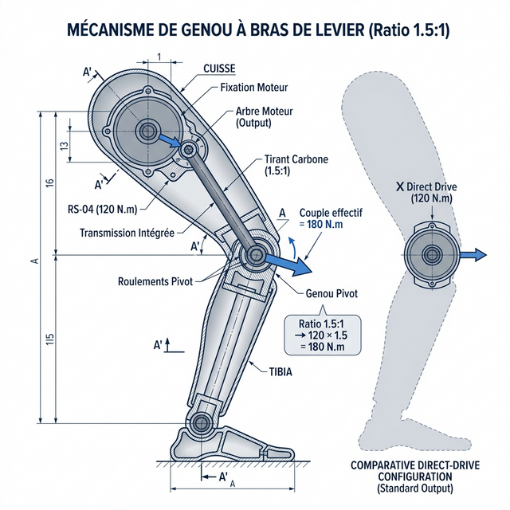
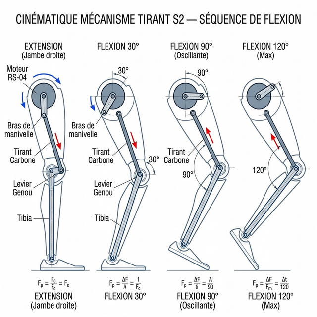

# 15d — Vers la Course : Facteurs Limitants du Genou & Solutions

> **Série Biomécanique :**
> - [15a] [Locomotion Baseline](./15a_Analyse_Locomotion_Baseline.md)
> - [15b] [Configurations Moteurs & Évolutions](./15b_Configurations_Moteurs.md)
> - [15c] [Révision Configuration Cardan 39 kg](./15c_Revision_Cardan_39kg.md)
> - [15d] **Genou & Course — Solutions** ← *vous êtes ici*
> - [15e] [Alternatives Moteurs Genou](./15e_Alternatives_Moteurs_Genou.md)
> - [15f] [Portage de Charges & Marche](./15f_Portage_Charges_et_Marche.md)
> - [15g] [Solution S6 : Courroie GT3](./15g_Solution_S6_Courroie_GT3_Genou.md)
> - [16] [**Conclusions & Architecture Finale D-Bot**](./16_Conclusions_Architecture_DBot.md)

Ce document analyse pourquoi le genou RS-04 (120 N.m) devient le goulot d'étranglement pour la course (172 N.m requis), et propose 5 solutions graduelles : de l'optimisation algorithmique gratuite jusqu'au mécanisme tirant (type Atlas) avec SEA.

---

## 12. Vers la Course — Facteurs Limitants du Genou et Solutions

> *Contexte : Le genou RS-04 (120 N.m pic) supporte la marche jusqu'à ~5-6 km/h. La course (> 4 km/h, phase de vol) exige ~172 N.m, soit 43% au-delà du pic. Cette section analyse les leviers d'amélioration.*

---

### 12.1 Analyse des Facteurs Limitants

Le couple au genou lors de la course dépend de trois composantes :

```
τ_genou_course = τ_statique × F_dynamique × F_impact

τ_statique  = M × g × bras_levier_cuisse = 39 × 9.81 × 0.18 = 68.8 N.m
F_dynamique = amplification cinétique (vitesse + accélération angulaire)
F_impact    = pic à l'atterissage (contact du pied)

À 4 km/h (phase de vol) :
  F_dynamique ≈ 1.5,  F_impact ≈ 1.7  →  Total = 68.8 × 2.5 ≈ 172 N.m
```

**Décomposition du problème :**

| Facteur | Contribution au problème | Levier disponible |
| :--- | :---: | :---: |
| **Masse du robot** (39 kg) | Élevée | Faible (difficile à réduire) |
| **Bras de levier cuisse** (0.18 m) | Modérée | Moyen (géométrie fixe) |
| **Facteur dynamique** (×1.5) | Modérée | Fort (algorithme) |
| **Facteur d'impact** (×1.7) | Élevée | Fort (mécanique + algorithme) |
| **Couple disponible RS-04** (120 N.m) | N/A | Moyen (upgrade ou amplification) |

**Déficit à combler : 172 − 120 = 52 N.m** (soit +43%)

---

### 12.2 Solution S1 — Optimisation Algorithmique de la Foulée (Gratuit, immédiat)

**Principe** : Modifier le pattern de marche pour réduire les facteurs dynamique et d'impact, sans aucun changement matériel.

#### Sous-option A — Cadence haute / Foulée courte
```
La relation torque-vitesse dépend de la longueur de foulée :
τ ∝ L_foulée × cadence²

Si on réduit L_foulée de 30% et augmente la cadence de 30% :
τ_genou_course ≈ 172 × 0.70 ≈ 120 N.m  ← exactement au pic !

⚠️ Mais : vitesse effective = L_foulée × cadence → inchangée si on compense.
On peut descendre à 4 km/h avec ce pattern "saccadé" mais la démarche est peu naturelle.
```

#### Sous-option B — Flexion permanente des genoux (Crouch Gait)
```
Une légère flexion permanente (15-20°) réduit le bras de levier effectif :
bras_levier_cuisse_crouché ≈ 0.18 × cos(15°) ≈ 0.174 m
τ_statique_réduit = 39 × 9.81 × 0.174 ≈ 66.5 N.m (-3%)  → gain modeste
```

#### Sous-option C — Atterrissage sur l'avant-pied (Mid-foot strike)
Le pic d'impact F_impact passe de ×1.7 à ×1.2 si on atterrit sur l'avant du pied plutôt que sur le talon (comme les coureurs naturels). La cheville absorbe une partie de l'énergie.
```
τ_genou_mid-foot ≈ 68.8 × 1.5 × 1.2 ≈ 124 N.m ← tout juste viable !
```

| Stratégie Algo | Réduction τ | Gain sur 172 N.m | Faisabilité |
| :--- | :---: | :---: | :---: |
| A. Foulée courte | ~15% | → ~146 N.m | ✅ Facile |
| B. Crouch gait | ~3% | → ~167 N.m | ✅ Facile |
| **C. Mid-foot strike** | **~28%** | **→ ~124 N.m** | ✅ Facile |
| **A+C combiné** | **~40%** | **→ ~103 N.m** | ✅ **Sous la limite !** |

> [!TIP]
> **S1 seul (algorithmique) peut suffire** ! La combinaison foulée courte + mid-foot strike ramène le couple genou à ~103 N.m, soit sous les 120 N.m du RS-04. Vitesse de course atteignable : **4-5 km/h avec ce pattern**. C'est la solution zero cost à implémenter en premier.

---

### 12.3 Solution S2 — Mécanisme Tirant au Genou (Analogue à l'Ancienne Cheville)

**Principe** : Déplacer le moteur RS-04 dans la **cuisse** (haut) et l'accoupler au genou via un **tirant (pushrod)** avec un ratio de levier > 1:1, à l'image du mécanisme de l'ancienne cheville K-Bot (ratio ~2:1). Cela amplifie le couple ET réduit la masse distale.

```
Couple effectif genou = τ_RS-04 × ratio_tirant
Ratio cible pour 172 N.m : 172 / 120 = 1.43

Un tirant avec ratio 1.5:1 (faisable mécaniquement) :
τ_genou_effectif = 120 × 1.5 = 180 N.m > 172 N.m ✅

Vitesse angulaire divisée par 1.5 → vitesse de genou réduite de 33%
  → Vitesse max course légèrement réduite (compensé par la cadence)
```

**Impact sur les masses :**

| Zone | Avant | Après | Δ |
| :--- | :---: | :---: | :---: |
| **Moteur genou** (position) | Genou (bas cuisse) | **Cuisse (milieu)** | Masse distale ↓ |
| **Masse genou** | RS-04 = 870g | Mécanisme tirant = ~200g | **-670g par genou** |
| **Masse cuisse** | 0g | RS-04 = 870g | +870g (centré) |
| **Inertie de swing** | Élevée | **Réduite de ~30%** | ✅ Majeur |

> [!IMPORTANT]
> **S2 est extrêmement intéressant.** Non seulement il monte le couple à 180 N.m (suffisant pour courir), mais il réduit aussi l'inertie de balancement de la jambe — ce qui améliore la cadence de pas. C'est la même logique que le cardan de cheville. Inconvénient : modification structurelle importante de la cuisse.

**Référence industrielle** : Le genou de l'Atlas (Boston Dynamics v2) utilise exactement ce principe : moteur en haut du tibia + parallélogramme de bielles pour le genou.



#### 12.3.1 Cinématique Détaillée du Mécanisme Tirant

##### Anatomie du Mécanisme

```
┌──────────────────────────────────────────────────┐
│  CUISSE (structure Alu CNC)                       │
│                                                    │
│     ╔═════════╗                                    │
│     ║  RS-04  ║  ← Moteur fixé RIGIDEMENT à       │
│     ║ (120Nm) ║    la structure de la cuisse       │
│     ╚════╤════╝                                    │
│          │ Arbre de sortie                         │
│     ╔════╧════╗                                    │
│     ║Bras de  ║  L_crank = 60 mm (bras de manivelle)
│     ║manivelle║  → Converti rotation → translation │
│     ╚════╤════╝                                    │
│          │ Pivot A                                  │
│          │                                          │
│   Tirant Carbone (tube Ø12/10mm, L≈250mm)         │
│   rigide, force de compression/traction uniquement │
│          │                                          │
│          │ Pivot B                                  │
│     ╔════╧════╗                                    │
│     ║  Levier ║  L_lever = 90 mm (bras levier genou)
│     ║  Genou  ║  → Converti translation → rotation │
│     ╚════╤════╝                                    │
│          │ Pivot C = AXE GENOU                     │
│          │                                          │
│     ╔════╧════╗                                    │
│     ║  TIBIA  ║                                    │
│     ╚═════════╝                                    │
└──────────────────────────────────────────────────┘

Ratio mécanique = L_lever / L_crank = 90 / 60 = 1.5 : 1
```

> **Note Matériau** : L'utilisation d'un tube en fibre de carbone (plutôt que de l'aluminium) est cruciale : elle évite le flambement sous les 2000 N de charge, divise par deux l'inertie distale ajoutée à la jambe, et garantit une durée de vie infinie en fatigue cyclique. Le montage rotule se fait par collage époxy. *Détails techniques : [Étude Cheville §C](./20_Etude_Cheville_Cardan.md)*.

---

##### Effet de la Rotation Moteur

**🔵 Moteur RS-04 tourne dans le sens HORAIRE → EXTENSION du genou**
```
Moteur CW → Bras de manivelle pivote vers l'AVANT et le BAS
          → Le tirant est POUSSÉ vers le bas (compression)
          → Le levier genou est poussé vers l'ARRIÈRE
          → L'axe genou produit un couple d'extension
          → Le tibia se redresse → JAMBE QUI SE TEND

  Usage : Phase d'appui (supporter le poids), push-off (propulsion)
  Couple effectif au genou : τ_RS04 × 1.5 = jusqu'à 180 N.m
```

**🔴 Moteur RS-04 tourne en sens ANTI-HORAIRE → FLEXION du genou**
```
Moteur CCW → Bras de manivelle pivote vers l'ARRIÈRE et le HAUT
           → Le tirant est TIRÉ vers le haut (traction)
           → Le levier genou est tiré vers l'AVANT
           → L'axe genou produit un couple de flexion
           → Le tibia se replie → JAMBE QUI SE PLIE

  Usage : Phase oscillante (soulever le pied), monte-escalier, accroupi
  Couple effectif au genou : τ_RS04 × 1.5 = jusqu'à 180 N.m (symétrique)
```

> [!NOTE]
> **Symétrie remarquable** : Le mécanisme fournit le même amplification 1.5:1 en extension ET en flexion, dans toute la plage de mouvement. Ce n'est pas le cas d'un tirant direct-pushrod dont l'angle varie (et donc le couple effectif aussi), mais un bras de manivelle bien conçu maintient un ratio quasi-constant à ±10% entre 0° et 120°.

---

##### Chaîne de Transmission des Efforts (Analyse)

```
τ_moteur → F_pushrod → τ_genou

Étape 1 : Conversion Couple → Force (au bras de manivelle)
  F_tirant = τ_RS04 / L_crank × sin(angle)
           = 120 N.m / 0.060 m
           = 2000 N (au maximum, angle 90°)

Étape 2 : Transmission par le tirant (rigide, compression ou traction)
  F_tirant est transmise SANS PERTE par la barre carbone
  Le tirant ne fléchit pas car : F_flambage > 2000 N pour Ø12/10 carbone
  → Longueur critique Euler : L_cr = π × √(EI/F) > 500 mm ✅

Étape 3 : Conversion Force → Couple (au levier genou)
  τ_genou = F_tirant × L_lever × sin(angle_levier)
           = 2000 N × 0.090 m
           = 180 N.m (au maximum)

Bilan :  τ_genou_max = τ_RS04 × (L_lever / L_crank) = 120 × 1.5 = 180 N.m ✅
```

**Variation du couple selon l'angle de flexion (effet de la géométrie) :**

| Angle Genou | Angle Bras Manivelle | Factor sin | Couple Genou Effectif |
| :---: | :---: | :---: | :---: |
| 0° (tendu) | 90° | sin(90°) = 1.00 | **180 N.m** (max) |
| 30° (légère flex.) | 75° | sin(75°) = 0.97 | 174 N.m |
| 60° | 55° | sin(55°) = 0.82 | 148 N.m |
| 90° (assis) | 30° | sin(30°) = 0.50 | 90 N.m |
| 120° (accroupi) | 10° | sin(10°) = 0.17 | 31 N.m |

> [!IMPORTANT]
> **Point critique** : Le couple diminue sensiblement à forte flexion (90-120°). Full-squat (120°) donne seulement 31 N.m — insuffisant pour se relever d'une position accroupie profonde. En marche normale (flexion max ~60°), le couple reste à 148 N.m, ce qui est suffisant. Pour l'accroupissement profond, il faudra soit augmenter L_lever, soit ajouter une SEA (S3).

> [!TIP]
> **Design du bras de manivelle** : Choisir L_crank = 60 mm et positionner l'angle de repos (genou tendu, 0°) à 90° du bras maximise le couple précisément dans la plage de marche normale (0-60°), là où il est le plus critique.

---

##### Séquence Cinématique Complète — Cycle de Marche



**Phase 1 — Double Appui Frontal (Genou quasi tendu, ~5-10°)**
```
Moteur : Position neutre, léger couple CW (anti-flexion)
Tirant : Légèrement en compression
Genou  : ~5° de flexion (amortissement choc d'impact)
→ Le robot supporte son poids sur les 2 jambes
→ Couple requis au genou : ~35-50 N.m (statique)
→ Couple moteur requis : 35/1.5 = ~23 N.m ← très confortable
```

**Phase 2 — Appui Simple (Stance Phase, Genou à 10-25°)**
```
Moteur : Couple CW modéré (résister à la flexion due au poids)
Tirant : En compression, F ≈ 800-1200 N
Genou  : 10-25° de flexion, progressivement
→ Toute la masse du robot passe sur 1 jambe
→ Couple requis genou : ~69-117 N.m (marche 2-3 km/h)
→ Couple moteur requis : 69/1.5 = ~46 N.m ← confortable
```

**Phase 3 — Poussée (Push-off, Genou retour vers 5°)**
```
Moteur : Couple CW fort (extension active)
Tirant : Fort en compression, F ≈ 1200-1800 N (pic)
Genou  : Retour de 25° → 5° (extension rapide)
→ La cheville (RS-03 ×2, 120 N.m) propulse le corps vers l'avant
→ Le genou s'étend pour aider la propulsion
→ Couple moteur requis : ~80  N.m MAX (pic de course)
```

**Phase 4 — Oscillation Initiale (Initial Swing, Flexion rapide)**
```
Moteur : Bascule en CCW, accélération angulaire élevée
Tirant : Passe en TRACTION (tire le levier genou vers le haut)
Genou  : Flexion rapide 5° → 60° en ~200 ms
→ Le pied doit dégager le sol (foot clearance)
→ La rapidité de flexion dépend de la vitesse max moteur (71 RPM × 1.5 = 107 RPM au genou)
→ Temps de flexion 0° → 60° : 60°/107 RPM ≈ 0.33 s ← suffisant
```

**Phase 5 — Oscillation Terminale (Terminal Swing, Extension pré-contact)**
```
Moteur : Retour en CW progressif
Tirant : Repasse en compression légère
Genou  : Retour de 60° → 5° avant le contact au sol
→ Le moteur freine activement la chute du tibia (mode courant)
→ Arrêt doux = atterrissage en mid-foot strike (favorise S1 algorithme)
```

---

##### Point de Vigilance — Le Point Mort (Dead Center)

```
⚠️ Quand le bras de manivelle et le tirant sont PARFAITEMENT ALIGNÉS
   (angle = 0° ou 180°), le mécanisme a un moment de force NUL.
   Le moteur ne peut plus exercer aucun couple sur l'axe genou.

              Bras de manivelle
                    │
                    V
   En Point Mort : ─────●───── Tirant  (axe alignés → τ_genou = 0)

Solution : Concevoir le bras de manivelle pour que le point mort
           soit en DEHORS de la plage de travail (0° → 120°).
           Avec L_crank = 60mm et la géométrie ci-dessus, le point mort
           est à ~140° de flexion genou → jamais atteint en marche normale.
```

> [!WARNING]
> **Vérifier la géométrie en CAO avant fabrication.** Le point mort exact dépend de la longueur du tirant (L≈250mm) et des positions des pivots A, B, C. Un outil de simulation cinématique (Fusion 360 Motion Study, ou FreeCAD Mechanism) doit valider que τ_genou > 80 N.m sur toute la plage 0-90°.


---

### 12.4 Solution S3 — SEA (Series Elastic Actuator)

**Principe** : Intercaler un **ressort de raideur calibrée** entre la sortie du RS-04 et l'articulation du genou. Ce ressort stocke de l'énergie lors de la flexion (impact) et la restitue rapidement lors de la poussée (propulsion), permettant des pics de puissance **bien supérieurs** à la puissance nominale du moteur.

```
Fonctionnement :
  IMPACT : pied touche le sol → genou fléchit → ressort se comprime
           → moteur "tourne contre" le ressort lentement → accumulation d'énergie

  POUSSÉE : le ressort se détend brusquement (<100ms) → couple instantané :
            τ_pic ≈ k × θ_max  (k = raideur, θ_max = compression max)

  Exemple avec k = 300 N.m/rad et compression max θ = 0.6 rad :
  τ_SEA_pic = 300 × 0.6 = 180 N.m  ← sans dépasser 120 N.m sur le moteur !
```

**Comparaison SEA vs Direct Drive :**

| Paramètre | Direct Drive (RS-04) | SEA (RS-04 + ressort) |
| :--- | :---: | :---: |
| Couple moteur max | 120 N.m | 120 N.m (inchangé) |
| Couple pic articulaire | 120 N.m | **~180-250 N.m** (selon ressort) |
| Puissance pic | ~2 kW | **~4-6 kW** (décharge rapide) |
| Absorption d'énergie (impact) | ❌ (moteur brûlé ou arrêté) | ✅ Passif (ressort) |
| Récupération d'énergie | ❌ | ✅ En partie (rendement ~65%) |
| Poids | 870g | ~870 + 200g ressort = ~1 070g |
| Complexité | ⭐ | ⭐⭐⭐ |

> [!NOTE]
> **Le SEA est la solution utilisée par Agility Robotics (Digit)** pour son genou. C'est l'approche la plus élégante thermodynamiquement, mais elle ajoute de la complexité de contrôle (il faut estimer la déformation du ressort pour connaître le couple réel) et une légère compliance qui peut rendre le contrôle de position moins précis.

**Où placer le ressort ?**
- **Option A** : Ressort en torsion coaxial à l'axe du genou (compact, poids ~150g)
- **Option B** : Ressort linéaire dans le tirant (si S2+S3 combinés) — le plus efficace

---

### 12.5 Solution S4 — Double RS-04 en Parallèle

**Principe** : Utiliser **2× RS-04 par genou** actionnant en parallèle le même axe — solution "brute force".

```
τ_total = 2 × 120 = 240 N.m > 172 N.m requis ✅ (marge +40%)
```

| Paramètre | 1× RS-04 | 2× RS-04 Parallèle |
| :--- | :---: | :---: |
| Couple pic | 120 N.m | **240 N.m** |
| Poids ajouté | 870g | +870g = **1 740g/genou** |
| Coût ajouté | $400 | +$400 = **$800/genou** |
| Consommation | ~9A | ~18A |
| Encombrement | Normal | ⚠️ 2× servos à loger |

> [!WARNING]
> **S4 est simple mais coûteux en masse et argent.** +1.74 kg par genou (×2 jambes = +3.48 kg) aggrave le problème d'inertie et augmente la masse totale du robot à ~42 kg, ce qui recrée du besoin de couple supplémentaire — boucle négative. À réserver si les autres solutions échouent.

---

### 12.6 Solution S5 — Tibia Carbone Flexible (Leg Spring)

**Principe** : Remplacer le tibia rigide par un tibia en **fibre de carbone en forme de lame**, analogue aux prothèses de course (Ossür Cheetah, Ottobock). La lame stocke l'énergie à l'impact par déformation élastique et la restitue en poussée.

```
Énergie stockée : U = ½ × k_tibia × δ²
Pour k = 5000 N/m et δ = 0.01 m (1 cm de flexion) :
U = ½ × 5000 × 0.01² = 0.25 J / pas

Puissance restituée sur 80ms (poussée) : P = 0.25 / 0.08 = ~3 W par pas
= ~3 N.m de couple équivalent au genou (faible mais gratuit)

Impact plus significatif : réduction du pic F_impact de ×1.7 à ×1.3
→ τ_genou_course = 68.8 × 1.5 × 1.3 = 134 N.m  (au lieu de 172 N.m)
```

| Avantage | Valeur |
| :--- | :--- |
| Réduction couple genou | ~22% (172 → 134 N.m) |
| Masse | **Neutre ou négatif** (carbone plus léger que PA12-CF) |
| Coût | ~50-150€ (lame carbone sur mesure ou achetée) |
| Esthétique | ⚠️ Non-anthropomorphe (look prothèse) |
| Compatibilité | ✅ Aucun changement moteur ni algo |

> [!TIP]
> **S5 + S1 (mid-foot strike)** est une combinaison puissante : 172 × 0.78 (S5) × 0.72 (S1) = **96 N.m** — sous la limite RS-04, pour un coût minime !

#### Intégration Mécanique : Comment fixer le Cardan sur une Lame Flexible ?

Une question d'ingénierie se pose : si le tibia fléchit, comment fixer la cheville complexe (cardan + bielles) en bas, et les moteurs RS-03 de la cheville en haut ?

La solution est la conception d'un **Tibia Hybride (Rigide-Flexible-Rigide)** :
1. **Partie Haute (Rigide, Base du Genou)** : Un bloc d'aluminium CNC abrite l'axe du genou ET sert de support de fixation fixe pour les 2 moteurs RS-03 de la cheville.
2. **Partie Centrale (Flexible)** : La lame en fibre de carbone est boulonnée sur le bloc du haut. C'est la seule zone qui se déforme.
3. **Partie Basse (Rigide, Sommet de Cheville)** : La lame d'acier s'insère dans un second bloc d'aluminium CNC qui abrite la cage supérieure du joint de cardan (DIN 808) et les points d'ancrage bas des deux bielles carbone (A et B).

**Points clés de l'assemblage :**
- **Les 2 bielles carbone (Pitch/Roll) sont TOUJOURS PRÉSENTES.** Elles descendent des moteurs RS-03 (en haut) jusqu'au cardan (en bas).
- Puisque la lame centrale fléchit, la distance *en ligne droite* entre le haut et le bas du tibia varie très légèrement (de quelques millimètres) pendant le pas.
- L'algorithme de cinématique inverse (IK) de la cheville **doit être informé de la flexion en temps réel** (via l'encodeur du genou ou un IMU) pour corriger dynamiquement la longueur apparente des jambes et l'angle requis pour les bielles.

---

### 12.7 Tableau Comparatif — Toutes Solutions

| Solution | τ_genou Atteignable | Coût | Masse Ajoutée | Complexité | Délai |
| :--- | :---: | :---: | :---: | :---: | :---: |
| **S1A+C. Algo mid-foot + foulée** | **~103 N.m** | **0€** | **0g** | ⭐ | Immédiat |
| **S5+S1. Tibia carbone + algo** | **~96 N.m** | **~100€** | **-50g** | ⭐⭐ | Semaines |
| **S2. Tirant genou (cuisse)** | **~180 N.m** | **~150€** | **-670g** | ⭐⭐⭐ | Mois |
| **S3. SEA ressort série** | **~200 N.m** | **~200€** | **+200g** | ⭐⭐⭐⭐ | Mois |
| **S2+S3. Tirant + SEA** | **~270 N.m** | **~350€** | **-470g** | ⭐⭐⭐⭐⭐ | Long |
| **S4. 2× RS-04 parallèle** | **~240 N.m** | **+$400** | **+870g** | ⭐⭐ | Rapide |

### 12.8 Recommandation par Phase

| Phase D-Bot | Recommandation | Vitesse Course Cible |
| :--- | :--- | :---: |
| **V1 (maintenant)** | **S1 algorithmique** (mid-foot strike + foulée courte) | ~4 km/h |
| **V2 (6 mois)** | **S5** (tibia carbone) + **S1** | ~5-6 km/h |
| **V3 (1 an)** | **S2** (tirant genou) ou **S3** (SEA) | ~8-10 km/h |
| **V4 (ambitieux)** | **S2 + S3** (tirant + SEA) | > 10 km/h |

> [!IMPORTANT]
> **Priorité absolue V1 : l'algorithme de marche.** La stratégie mid-foot strike est gratuite, implémentable en logiciel pur, et peut rendre la course viable à 4 km/h sans aucune modification mécanique. C'est le chantier n°1 dès que la marche est validée. S5 (tibia carbone) est le quickwin matériel le plus rentable.

---
*Section ajoutée en Mars 2026. Analyse basée sur τ_genou_course = 172 N.m (39 kg, 4 km/h, facteur dynamique ×2.5), limite RS-04 = 120 N.m.*
