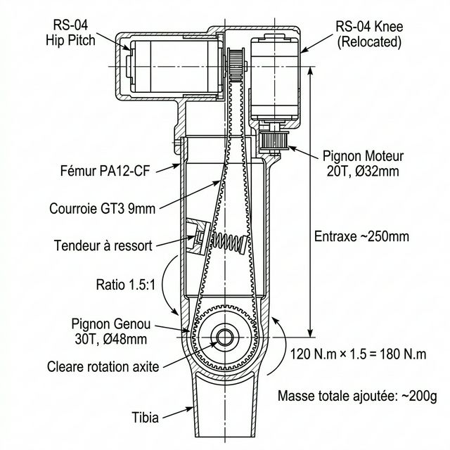

# 15g — Solution S6 : Courroie GT3 — Amplification Couple Genou

> **Série Biomécanique :**
> - [15d] [Genou & Course — Solutions](./15d_Genou_et_Course.md)
> - [15e] [Alternatives Moteurs Genou](./15e_Alternatives_Moteurs_Genou.md)
> - [15f] [Portage de Charges & Marche](./15f_Portage_Charges_et_Marche.md)
> - [15g] **Solution S6 : Courroie GT3** ← *vous êtes ici*
> - [16] [**Conclusions & Architecture Finale D-Bot**](./16_Conclusions_Architecture_DBot.md)

---

## 1. Le Problème Rappelé

Le RS-04 au genou (120 N.m pic) est à **101% de sa charge** en marche normale à 2-3 km/h (40.4 kg). Il ne reste aucune marge pour porter des charges ou courir. Les solutions précédentes (S1 à S5) nécessitent soit des modifications algorithmiques, soit des mécanismes complexes (tirant, SEA, double moteur).

**La Solution S6 (Courroie GT3)** est l'approche la plus simple, la moins chère et la plus rapide à implémenter pour amplifier le couple du genou.

---

## 2. Principe Fondamental

Au lieu de laisser le moteur RS-04 **directement sur l'axe du genou** (configuration actuelle 1:1), on le **déplace en haut de la cuisse** — quasiment au niveau de la hanche — et on relie sa sortie à l'axe du genou par une **courroie crantée synchrone GT3** avec un rapport de réduction.

```
CONFIGURATION ACTUELLE (Direct Drive 1:1) :

  ┌─────────────┐
  │   HANCHE    │  RS-04 Hip Pitch (sur l'axe hanche)
  └──────┬──────┘
         │
     CUISSE (fémur)    ← Le RS-04 genou est EN BAS de la cuisse
         │
  ┌──────┴──────┐
  │   GENOU     │  RS-04 Knee (directement sur l'axe genou)
  └──────┬──────┘       120 N.m → 120 N.m, vitesse 167 RPM
         │
       TIBIA


NOUVELLE CONFIGURATION S6 (GT3 1.5:1) :

  ┌─────────────────────────────┐
  │         HANCHE              │
  │  RS-04 Hip Pitch            │
  │  RS-04 Knee (RELOCALISÉ) ──┼──> Le moteur genou est maintenant ICI !
  └──────┬──────────────────────┘    En haut de la cuisse, près de la hanche
         │
         │  ╔══════════╗  Pignon Moteur (petit) : 20 dents, Ø32mm
         │  ║ RS-04    ║──●
         │  ║ Knee     ║  │
         │  ╚══════════╝  │
         │                │  ← Courroie GT3 9mm (boucle fermée ~600mm)
     CUISSE (fémur)       │     Tendue par un galet tendeur à ressort
         │                │
         │         ◉──────┘  Pignon Genou (grand) : 30 dents, Ø48mm
  ┌──────┴──────┐
  │   GENOU     │  Axe genou = axe du grand pignon
  └──────┬──────┘     120 N.m × 1.5 = 180 N.m, vitesse 111 RPM
         │
       TIBIA
```

---

## 3. Vue en Coupe — Architecture Détaillée



### 3.1 Disposition des Moteurs dans la Hanche

Le RS-04 du genou est monté **en parallèle et légèrement en dessous** du RS-04 de la hanche Pitch, tous les deux fixés rigidement au châssis du bassin / haut de cuisse :

```
VUE FRONTALE — BLOC HANCHE + HAUT DE CUISSE

         ┌──────────────────────────────┐
         │          BASSIN              │
         │                              │
    ═════╪══════════════════════════════╪═════  ← Axe Hanche Pitch
         │                              │
         │   ╔════════════╗             │
         │   ║  RS-04     ║             │  ← Moteur Hanche Pitch
         │   ║  Hip Pitch ║             │     (sur l'axe de rotation)
         │   ╚════════════╝             │
         │                              │
         │   ╔════════════╗             │
         │   ║  RS-04     ║──●          │  ← Moteur Genou RELOCALISÉ
         │   ║  Knee      ║  │ Pignon   │     (fixé au châssis cuisse)
         │   ╚════════════╝  │ 20T      │
         │                   │          │
         └───────────────────┼──────────┘
                             │
                       Courroie GT3
                       (descend dans
                        la cuisse)
                             │
                             │  ~250mm d'entraxe
                             │
                        ●────┘
                    Pignon 30T
              ═══════╪════════════  ← Axe Genou
                     │
                   TIBIA
```

> **Point clé** : Les deux RS-04 (hanche + genou) sont maintenant **concentrés dans la même zone**, en haut de la cuisse. Cela a un avantage majeur : toute la masse motrice est **proche du centre de gravité** du robot, ce qui **réduit drastiquement l'inertie de balancement** de la jambe (Swing Inertia).

---

## 4. Composants et BOM

### 4.1 Pièces Nécessaires

| Composant | Spécification | Quantité | Prix estimé | Source |
| :--- | :--- | :---: | :---: | :--- |
| **Courroie GT3 fermée** | GT3, largeur 9mm, longueur ~600mm | 2 (D+G) | ~15€ | Amazon / AliExpress |
| **Pignon moteur** | GT3, 20 dents, alésage Ø8mm, alu | 2 | ~8€ | AliExpress |
| **Pignon genou** | GT3, 30 dents, alésage Ø12mm, alu | 2 | ~12€ | AliExpress |
| **Galet tendeur** | Roulement 625ZZ Ø16mm + bras ressort | 2 | ~5€ | AliExpress |
| **Ressort de tension** | Ressort traction 2N, ~30mm | 2 | ~2€ | Quincaillerie |
| **Vis + entretoises** | M4 inox + entretoises CNC/imprimées | lot | ~5€ | — |
| **TOTAL (2 jambes)** | | | **~47€** | |

### 4.2 Masse Ajoutée

| Composant | Masse unitaire | ×2 jambes |
| :--- | :---: | :---: |
| Courroie GT3 9mm × 600mm | ~25g | 50g |
| Pignon 20T alu | ~15g | 30g |
| Pignon 30T alu | ~35g | 70g |
| Galet tendeur + ressort | ~20g | 40g |
| Visserie + support | ~15g | 30g |
| **TOTAL** | **~110g/jambe** | **~220g** |

> ✅ **220 grammes** pour les deux jambes. C'est **négligeable** face aux +2 840g d'un double RS-04 (solution S4) ou aux +400g d'un mécanisme tirant (solution S2).

---

## 5. Performances Calculées

### 5.1 Rapport 1.5:1 (20T → 30T)

| Paramètre | Direct Drive (actuel) | GT3 1.5:1 (S6) | Δ |
| :--- | :---: | :---: | :---: |
| **Couple genou** | 120 N.m | **180 N.m** | **+50%** |
| **Vitesse max genou** | 167 RPM | **111 RPM** | -33% |
| **Temps flexion 0→90°** | 0.15 s | **0.22 s** | Acceptable |
| Marche 2-3 km/h (vide) | 101% ⚠️ | **67%** ✅ | Confortable |
| Portage 10 kg marchant | Impossible | **~85%** ✅ | Viable |
| Course 5 km/h | 143% ❌ | **~95%** ⚠️ | Limite mais possible |

### 5.2 Rapport 2:1 (20T → 40T) — Alternative plus agressive

| Paramètre | GT3 2:1 |
| :--- | :---: |
| **Couple genou** | **240 N.m** |
| **Vitesse max genou** | 83 RPM |
| Marche avec 15 kg | **~70%** ✅ |
| Course 5 km/h | **~72%** ✅ |
| Course 8 km/h | ~95% ⚠️ |

> [!TIP]
> Le rapport **2:1** est un excellent compromis universel. Il fournit assez de couple pour porter des charges lourdes ET courir, tout en conservant une vitesse de genou acceptable (83 RPM = flexion 0→90° en 0.27s).

---

## 6. Avantages vs Autres Solutions

| Critère | S2 (Tirant) | S4 (Double RS-04) | **S6 (GT3)** |
| :--- | :---: | :---: | :---: |
| **Couple max** | 180 N.m | 240 N.m | **180-240 N.m** |
| **Masse ajoutée** | ~400g | **+2 840g** | **~220g** ⭐ |
| **Coût** | ~150€ | +800$ | **~47€** ⭐ |
| **Point mort à forte flexion** | ⚠️ Oui (31 N.m @ 120°) | Non | **Non** ⭐ |
| **Backdrivability** | Partielle | ✅ | **✅** |
| **Complexité mécanique** | ⭐⭐⭐ (CAO bielles) | ⭐⭐ | **⭐** ⭐ |
| **Réduction inertie distale** | ✅ (moteur en haut) | ❌ (pire) | **✅** (moteur en haut) ⭐ |
| **Bruit** | Silencieux | Silencieux | ~35 dB (quasi silencieux) |

> [!IMPORTANT]
> **La GT3 surpasse le tirant (S2) sur presque tous les critères** : pas de point mort géométrique, plus léger, moins cher, plus simple à fabriquer. Le seul avantage du tirant est sa rigidité absolue (0° de backlash), mais avec un bon galet tendeur, le backlash de la GT3 descend à ~0.5-1°, ce qui est acceptable pour la marche.

---

## 7. Points de Vigilance

### 7.1 Backlash (Jeu Angulaire)
La courroie GT3 introduit un jeu de **0.5-1.5°** selon la tension. Pour le réduire :
- **Galet tendeur à ressort permanent** : Maintient la tension même si la courroie s'allonge légèrement avec le temps.
- **Largeur 9mm minimum** : Les courroies fines (6mm) ont plus de jeu. 9mm est le sweet spot poids/rigidité.
- **Pignons en aluminium usiné** (pas imprimés 3D) : Le profil de dent doit être précis.

### 7.2 Durée de Vie
Une courroie GT3 de qualité (Gates, Continental) supporte **>10 millions de cycles** à 180 N.m si bien tendue. C'est largement supérieur à la durée de vie du robot. En cas de rupture, le remplacement est instantané (~5 minutes, 15€).

### 7.3 Alignement
Les deux pignons (moteur et genou) doivent être **parfaitement coplanaires**. Un désalignement >1mm provoque une usure prématurée de la courroie. Utiliser des entretoises CNC ou imprimées PA12-CF pour le calage.

---

## 8. Guide de Montage Étape par Étape

### Étape 1 — Démonter le RS-04 du genou
Retirer le RS-04 de son emplacement actuel sur l'axe du genou. Conserver l'axe et les roulements du genou en place.

### Étape 2 — Fixer le RS-04 en haut de la cuisse
Monter le RS-04 sur un bracket en haut de la cuisse, aussi près que possible de l'axe de la hanche. Son arbre de sortie pointe vers le bas (parallèle au fémur).

### Étape 3 — Installer le petit pignon (20T) sur le RS-04
Fixer le pignon 20T GT3 sur l'arbre de sortie du RS-04 avec une vis de serrage ou une clavette.

### Étape 4 — Installer le grand pignon (30T) sur l'axe du genou
Le pignon 30T est fixé directement sur l'axe de rotation du genou, là où le RS-04 était auparavant.

### Étape 5 — Installer la courroie GT3
Enfiler la courroie fermée autour des deux pignons. Ajuster l'entraxe si nécessaire (via des trous oblongs sur le support du RS-04).

### Étape 6 — Monter le galet tendeur
Fixer le galet tendeur à ressort sur le côté non-tendu (brin mou) de la courroie. Le ressort doit appliquer ~5-10N de force pour maintenir la tension.

### Étape 7 — Vérifier l'alignement et tester
Faire tourner le moteur à la main : la courroie doit rester centrée sur les pignons, sans déport latéral. Tester en rotation motorisée lente puis rapide.

---

## 9. Évolutions Futures

### V2 : GT3 2:1 + SEA
Remplacer le pignon 30T par un 40T (ratio 2:1) et ajouter un ressort en série (SEA) entre le grand pignon et l'axe du genou :
```
RS-04 → GT3 2:1 → Ressort torsion → Axe genou
Couple continu : 240 N.m
Couple pic (SEA) : 300-350 N.m
```

### V3 : Double Transmission Switchable
Ajouter un solénoïde + tendeur commandé pour basculer entre :
- **Mode Direct** (courroie relâchée → 120 N.m, vitesse max)
- **Mode GT3** (courroie tendue → 240 N.m, couple max)

---

*Annexe créée en Mars 2026. Basée sur l'analyse des fichiers knee-0 à knee-3 (études préliminaires courroie GT3 vs vérin linéaire) et les données RS-04 (120 N.m pic, 1 420g).*
