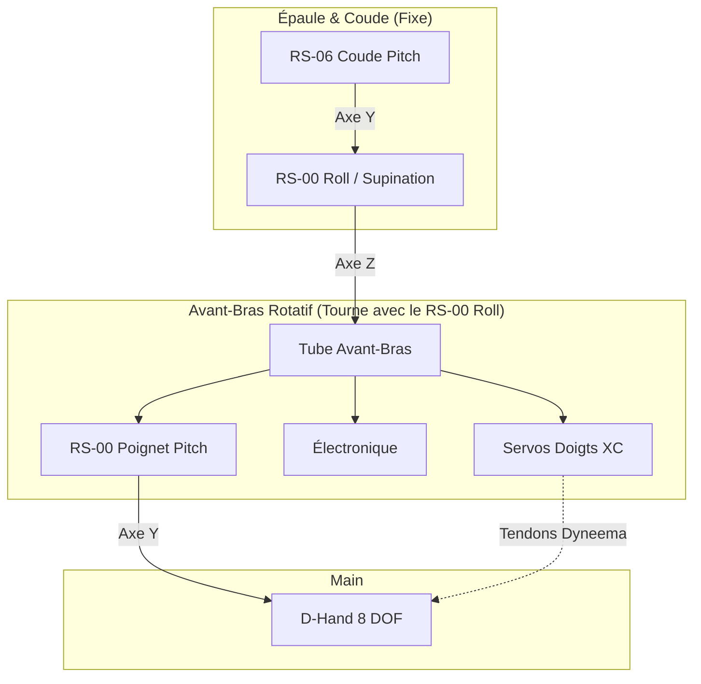
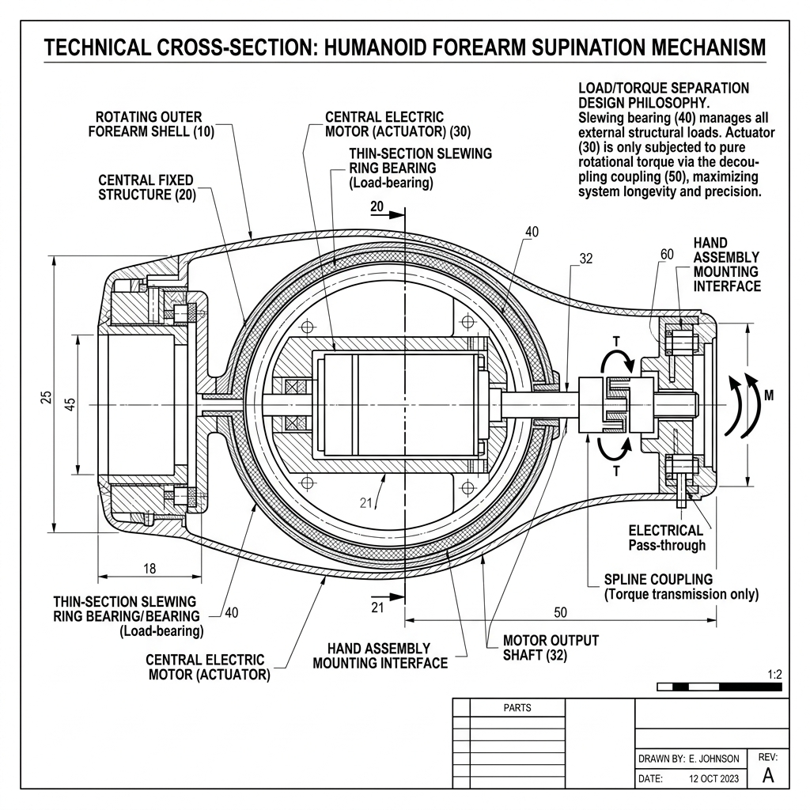

# 22b — Étude : Poignet Tesla Optimus & Architecture Biomimétique

> **Contexte** : Ce document fait suite à l'étude `22_Etude_Poignet_DOF`. Il détaille l'approche d'ingénierie biomimétique utilisée par le Tesla Optimus Gen 3 et évalue une nouvelle proposition d'architecture pour le D-Bot s'en inspirant fortement.

---

## 1. Que signifie "Le Roll est assuré par la Supination au niveau du coude" ?

C'est un point d'ingénierie biomécanique fondamental. Dans le corps humain, le mouvement de rotation de la main (mettre la paume vers le haut ou vers le bas) ne se produit **pas** au niveau de l'articulation du poignet.

Ce mouvement s'appelle la **Supination** (paume vers le haut) et la **Pronation** (paume vers le bas). Il est réalisé par la rotation de l'os *Radius* autour de l'os *Cubit/Ulna*. Cette rotation naît à la base du coude et fait pivoter **l'avant-bras tout entier**.

**Le constat anatomique :** Le poignet humain ne sait faire **que 2 mouvements** :
- Le Pitch (Flexion / Extension) : lever ou baisser la main.
- Le Yaw (Déviation radiale / ulnaire) : dire au revoir de la main (gauche/droite).
Le 3ème axe, le Roll (Torsion), est géré **en amont**, par la rotation de l'avant-bras.

---

## 2. Le choix de Tesla Optimus Gen 3 (vs Robotique Classique)

### L'approche Classique (Robotique Série)
On place le moteur de rotation (Roll) **tout au bout** de l'avant-bras, juste avant la main. Si on veut le Pitch en plus, on ajoute un moteur derrière.
* **Résultat visuel** : Un empilement cylindrique ("Tuyau") inesthétique (Moteur Roll → Moteur Pitch → Main).
* **Résultat mécanique** : Si des tendons traversent ce poignet pour aller aux doigts, la rotation du Roll va **vriller tous les tendons** ensemble comme une corde, modifiant leur tension et créant des mouvements parasites dans les doigts (le "crosstalk").

### L'approche Tesla Optimus Gen 3 (Biomimétique)
Tesla a recréé la biomécanique humaine. Ils ont placé l'actionneur de rotation (Supination) **au niveau du coude**. Ce moteur fait tourner **toute la coque de l'avant-bras**.
À l'intérieur de cet avant-bras qui tourne, se trouvent les 25 petits actionneurs linéaires des doigts. 
Tout au bout, le poignet lui-même n'est qu'un **joint de cardan passif** (un croisillon), orienté par des câbles tirés depuis l'avant-bras.

* **Résultat visuel** : Le poignet n'a AUCUN moteur volumineux. Il est fin et extrêmement humain.
* **Résultat mécanique** : Puisque les moteurs des doigts tournent *avec* l'avant-bras, les tendons à l'intérieur ne se vrillent jamais entre eux lors d'une rotation de la main.

---

## 3. Évaluation de la Nouvelle Approche D-Bot (Architecture "Forearm Supination")

Puisque le bras du D-Bot n'est pas encore construit, vous proposez l'architecture suivante :

```text
PROPOSITION D'ARCHITECTURE :
Coude Pitch (RS-06) 
  ↓
Moteur RS-00 Roll (faisant office de Supination)
  ↓
(Partie rotative de l'avant-bras) :
  Moteurs de la main (4×XC430 + 4×XC330)
  Espace pour l'électronique
  Moteur RS-00 Pitch (Poignet)
  ↓
Main D-Hand
```

### 3.1 Schéma Cinématique



### 3.2 Mon avis global : Une idée brillante ⭐⭐⭐⭐⭐

Cette proposition est **excellente**. C'est exactement l'architecture d'un bras industriel moderne ou d'un humanoïde de pointe (comme Tesla). Elle adapte le concept de la "Supination" à notre matériel (servos rotatifs plutôt que linéaires).

Voici les énormes avantages qu'elle apporte :

**1. Le problème du vrillage des tendons est supprimé (Crosstalk annulé)**
Puisque les servos XC tournent *en même temps* que la main (ils sont tous les deux emportés par la rotation du RS-00 Roll proximal), les tendons Dyneema ne subissent **aucune torsion axiale**. Ils n'ont plus qu'à traverser l'articulation du RS-00 Pitch. C'est une simplification mécanique majeure.

**2. Le poignet redevient compact et esthétique**
Le poignet distal ne contient plus qu'un seul moteur : le RS-00 Pitch (57 mm de long). L'extrémité du bras perd son aspect "tuyau empilé", devenant beaucoup plus proche de la taille d'un vrai poignet humain. 

**3. L'inertie distale est drastiquement réduite**
En déplaçant les 310g du RS-00 Roll de l'extrémité du bras vers le coude, on réduit massivement le bras de levier. Le robot consommera moins d'énergie pour balancer les bras en marchant, et l'épaule (RS-04 Pitch) forcera beaucoup moins lors des mouvements rapides.

**4. Les proportions sont parfaites (260 mm)**
Cette architecture empile : RS-00 Roll (57mm) + Moteurs XC (145mm) + RS-00 Pitch (57mm) = **259 mm**. 
L'avant-bras mesurera donc ~26 cm. C'est **exactement** la longueur moyenne d'un avant-bras humain adulte. Le simulateur (Isaac Gym) et l'esthétique du robot s'en trouveront grandement améliorés.

### 3.3 Les 2 défis d'ingénierie à anticiper

Cette architecture est la meilleure possible, mais elle nécessite de concevoir deux éléments précis :

**Défi A : Le passage des câbles au coude (Slip ring / Service Loop)**
L'avant-bras tout entier va tourner sur lui-même. Il faut donc acheminer l'alimentation (48V et 12V) et le bus CAN depuis l'épaule jusqu'à l'avant-bras à travers une articulation rotative.
* *Solution* : Créer une "boucle de service" (un peu de mou dans le câble) à l'extérieur ou autour de l'axe du RS-00 Roll, permettant une rotation de ±180° sans arracher les fils. (Un *Slip Ring* électrique rotatif est une option plus coûteuse mais parfaite).

**Défi B : L'encaissement du bras de levier (Roulement de support)**
Le RS-00 Roll va devoir supporter le poids entier de l'avant-bras, de la main, et de la charge (soit ~5 kg au bout d'un levier de 26 cm = couple de flexion de >10 N.m). Bien que le RS-00 ait de bons roulements de sortie, il n'est pas conçu pour encaisser de fortes contraintes de flexion axiale (radial load).
* *Solution* : La structure externe du coude doit inclure un large roulement annulaire (ex: Thin Section Bearing ou palier lisse en Téflon/Igus) qui soutient la coque de l'avant-bras. Le RS-00 ne doit fournir que le *couple de rotation*, pas encaisser le poids du bras qui plie.

### 3.4 Ingénierie du palier de coude (Découplage des efforts)

C'est le secret de la réussite de cette architecture. L'avant-bras complet (tube, moteurs XC, main, charge) forme un bras de levier de ~26 cm. Si le robot porte une charge de 5 kg à bout de bras, cela génère un couple de flexion transversal (Bending Moment) d'environ **10 à 13 N.m** à la base de l'avant-bras.

Si ce levier est fixé directement sur l'axe du moteur de Supination, les roulements internes du moteur vont s'écraser sous la contrainte radiale, créant du jeu et une usure prématurée.

**La solution : Le découplage des efforts**
1. **La Structure (Encaisser le poids)** : La coque externe rotative de l'avant-bras est montée sur un **large roulement annulaire** (Slewing Ring ou Thin-Section Bearing) solidaire du bloc coude. Ce grand roulement encaisse 100% des contraintes de flexion et du poids.
2. **Le Moteur (Transmettre la rotation)** : Le moteur est logé au centre. Son axe est relié à la coque rotative uniquement via un accouplement (Spline Coupling ou joint flexible) qui ne transmet *que* le couple de torsion axiale.

Voici le schéma technique de ce principe que j'ai généré pour illustrer l'assemblage :



*L'image montre clairement que le roulement externe (40) prend toutes les contraintes de l'avant-bras (10), laissant le moteur central (30) libre de toute flexion radiale.*

### 3.5 Choix de l'actionneur de Supination : Le RS-00 est-il judicieux ?

Dans notre schéma précédent, nous avons placé le **RS-00 (14 N.m pic, 5 N.m nom, 310g)** pour faire tourner l'avant-bras. Faisons le calcul du "pire scénario" de supination (par exemple : tenir une lourde poêle à frire par le manche, ou manipuler une lourde perceuse) :
- Charge déportée latéralement de 10 cm de l'axe (0.1 m).
- Poids de l'objet = 5 kg.
- Couple de torsion requis = 5 kg × 9.81 × 0.1 m = **4.9 N.m**.

> [!WARNING]
> Avec 4.9 N.m requis pour une charge de 5kg déportée, on sature à **~100% le couple nominal** du RS-00 (5 N.m). S'il doit maintenir cette position, le moteur va chauffer rapidement.

**Choix d'implémentation officiel : Le RobStride RS-02**
Dans l'architecture actuelle du D-Bot, le **RS-02 (17 N.m pic, 6 N.m nom, 405g)** est validé comme moteur de Supination. Ce choix s'aligne sur la standardisation du robot, le RS-02 étant déjà utilisé pour la rotation de l'épaule (Shoulder Yaw). La cinématique de l'avant-bras subit des contraintes très similaires à celles de l'épaule.

| Moteur | Couple Nom. | Couple Pic | Poids | Verdict pour Supination (Coude) |
| :--- | :---: | :---: | :---: | :--- |
| **RS-00** | 5 N.m | 14 N.m | 310g | ❌ Refusé (Limite thermique sur charge déportée) |
| **RS-02** | 6 N.m | **17 N.m** | **405g** | ✅ **CHOIX D'IMPLÉMENTATION ACTUEL** |
| **RS-03** | 20 N.m | 60 N.m | 880g | ❌ Refusé (Inutile et trop lourd) |

> [!IMPORTANT]
> **Décision d'Architecture** : Le **RS-02** est officiellement retenu pour le moteur de Supination situé au coude. L'impact de **+95g** par rapport au RS-00 est largement compensé par le gain critique de 17 N.m de couple de torsion en pic. Cela garantit que la préhension latérale d'outils lourds (perceuse, marteau) sera inébranlable. Le poignet distal (Pitch), quant à lui, est équipé du petit RS-00 (310g) pour maintenir une faible inertie en bout de bras.

---

## 4. Conclusion

L'approche de déplacer le Roll au coude pour faire de la Supination est un **bond en avant architectural** pour le D-Bot. 

Elle résout le défi esthétique, simplifie le guidage des tendons de la main, et rapproche la cinématique du standard des robots de pointe (Tesla, Figure, ALOHA). Puisque le bras n'est pas encore usiné, c'est **le moment idéal** pour adopter cette géométrie. 
Le design du bras devrait maintenant se concentrer sur la création d'une coque rotative (tube carbone ou structure Alu allégée) guidée par un palier au niveau du coude.
