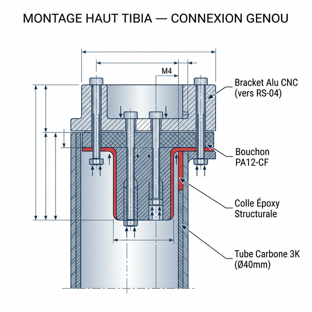
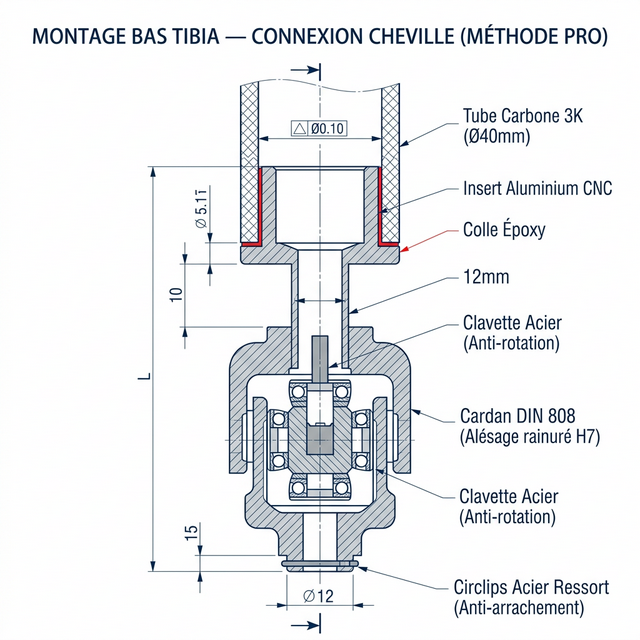

# 23 — Stratégie Ultralight : Matériaux sous le Genou

> **Règle d'or en robotique bipède :** un gramme gagné au bout du pied (inertie distale) vaut dix grammes gagnés à la hanche. L'inertie de balancement de la jambe a un impact exponentiel sur le couple requis aux hanches et genoux lors de la course.

Pour garantir les performances du D-Bot, la zone située **sous le genou** doit suivre une stratégie stricte : **bannir le métal massif** (sauf exception mécanique critique) au profit de solutions hybrides combinant impression 3D (Qidi Plus 4), usinage CNC (C500) et composants aérospatiaux standards.

Voici la stratégie d'ingénierie optimisée composant par composant.

---

## 1. Le Tibia (Corps de la Jambe)

* **❌ À proscrire** : Un tibia usiné en bloc d'aluminium (trop lourd, inertie catastrophique).
* **✅ Option 1 (Full 3D Print)** : Impression sur la Qidi en **PA12-CF** (Nylon chargé carbone). Le nylon offre l'absorption des chocs (évite la rupture nette) et la fibre de carbone apporte la rigidité. *Paramètres : Remplissage gyroid 30%, 5-6 périmètres extérieurs.*
* **🏆 Option 2 (Hybride Pro — Recommandée)** : Utiliser un **tube en fibre de carbone tressé** du commerce (ex: Ø40mm ext / Ø36mm int, épaisseur 2mm). Le rapport poids/rigidité est imbattable.
  
  **Où acheter le tube carbone Ø40mm ?**
  - **Spécifications requises** : Finition sergé (Twill) 3K, procédé **"Roll-wrapped"** (fibres croisées préimprégnées) impératif ! Ne jamais acheter du pultrudé (fibres axiales uniquement) pour un tibia, il fendrait sous l'effort.
  - **Fournisseurs** : Boutiques spécialisées ULM/Drones/RC comme *CarbonTube.net*, *EasyComposites*, ou sur *AliExpress* (boutiques certifiées matériaux composites comme *RJX Hobby*).
  - *Note : Une longueur de 500 mm suffit largement pour y découper les 2 tibias (longueur estimée ~220 mm).*

  **A. Montage complet HAUT (Connexion au Genou RS-04)**
  
  1. **Le Bouchon Haut (Plug PA12-CF)** : Pièce en "T" imprimée en 3D (Qidi). La jupe du bouchon (Ø36mm) s'insère en force dans le tube carbone sur environ 30 mm de profondeur.
  2. **Collage Époxy Structural** : Dépolir l'intérieur du tube carbone avec du papier de verre (grain 120), nettoyer à l'isopropanol. Enduire la jupe du bouchon de résine époxy bicomposant longue durée (ex: Loctite EA 9466 ou DP490) puis emmancher. L'immense surface de contact (~34 cm²) rend cet joint virtuellement indestructible en traction/compression.
  3. **Interface Moteur (Bracket Alu)** : Une pièce CNC en Aluminium (C500) fait la liaison entre le chapeau du Moteur Genou RS-04 et ce bouchon PA12-CF.
  4. **Assemblage Mécanique** : 4 longues vis M4 ou M5 traversent verticalement la pièce aluminium, traversent l'épaulement du bouchon PA12-CF, et viennent se visser dans des écrous ou inserts taraudés noyés profondément dans le PA12-CF. Ainsi, la force est transmise : *RS-04 → Bracket Alu → Vis M4 → Bouchon PA12-CF → Joint Époxy → Tube Carbone*.

  **B. Montage complet BAS (Connexion au Cardan DIN 808 — Méthode Pro)**
  

  Au lieu d'imprimer un bouchon PA12-CF qu'il faudrait percer de part en part (opération hasardeuse sur de l'acier durci), on exploite l'alésage interne du joint de cardan. C'est la fixation d'ingénierie mécanique standardisée, totalement adaptée à la CNC C500.

  1. **Achat du Cardan (À alésage et rainure)** : 
     - L'architecture exige un **Joint de Cardan DIN 808 avec alésage H7 ET rainure de clavette JS9** (Keyway).
     - **Lien d'achat direct** : [Moyeu A5 473 — Joint de cardan simple Michaud Chailly (Modèle 3D)](https://maurin-embedded.partcommunity.com/3d-cad-models/mod%C3%A8le-a5-473-joint-de-cardan-simple-michaud-chailly-direct-transmission?info=michaud_chailly_transmission%2Ftransmission%2Fjoints_cardans%2Fa5_473.prj&cwid=6179)
     - *(Autres fournisseurs : HPC Europe, Norelem)*.

  2. **Usinage de l'Insert (Aluminium CNC 6061-T6)** : 
     - On usine à la C500 une pièce d'adaptation en aluminium.
     - Le *haut* de l'insert possède une jupe (Ø36mm) qui s'emmanche et se colle (Époxy Structurale) dans le tube carbone 40mm.
     - Le *bas* de l'insert est un cylindre mâle (ex: Ø12mm) couplé à une clavette, qui rentre *dans* le joint de cardan.
     - Précision d'usinage (C500) : Usiner une **gorge de circlips** à l'extrémité basse du cylindre de 12mm, calculée pour affleurer exactement à la sortie de la noix du cardan.

  3. **Verrouillage en Lacet (Clavette Anti-rotation)** :
     La clavette en acier s'insère entre l'arbre en aluminium et la rainure de la cage du cardan. Elle bloque 100% de la rotation (effort de lacet/yaw). Aucun usinage "sur le tas" n'est requis.

  4. **Verrouillage Vertical (Circlips Acier Ressort Anti-arrachement)** :
     La clavette stoppe la rotation, mais pas la translation verticale. Une fois l'arbre en alu enfoncé dans le cardan, on vient enclencher un **Circlips en Acier Ressort** (anneau élastique, ex: type E pour arbre de 12mm) dans la petite gorge usinée. 
     - **Résultat** : C'est physiquement impossible pour l'axe de s'arracher en vol. Le circlips fait office de butée mécanique infranchissable, garantissant zéro jeu vertical.

---

## 2. Le Bloc Moteurs Cheville (Sous le genou)

* **Contexte** : Les 2 moteurs RS-03 (120 N.m combinés) génèrent un couple énorme et chauffent. Ils sont logés en haut du tibia, juste sous l'axe du genou.
* **✅ Matériau** : **Aluminium 6061-T6 (usiné CNC C500)**.
* **Justification** : C'est la seule exception métallique. Le métal est ici obligatoire pour encaisser les stress de torsion massifs, et surtout pour servir de **dissipateur thermique (heatsink)** aux moteurs. Puisque cette masse est située très haut (près de la base d'oscillation), son impact sur l'inertie de la foulée reste limité.

---

## 3. Les Bielles de Cheville (Pitch/Roll)

* **✅ Matériau** : **Tubes Fibre de Carbone 3K pultrudé** (Ø ext 10mm / Ø int 8mm).
* **Justification** :
  1. **Flambement** : Sous des pointes à plus de 1 500 N, l'aluminium plierait. Avec le module de Young du carbone (120-150 GPa), le risque de flambement est nul.
  2. **Poids** : ~20 g/mètre (carbone) contre ~40 g/mètre (aluminium).
  3. **Fatigue** : Résistance cyclique virtuellement infinie, contrairement à l'alu qui micro-fissure avec les millions de pas.
* **Embouts** : Utilisation de petites rotules en **polymère hautes performances** (ex: Igus EBRM-05), plus légères que l'acier, enchassées dans les tubes avec de la résine époxy.

---

## 4. Le Cardan de Cheville (Joint Universel)

* **Contexte** : Articulation centrale de la cheville DIN 808.
* **✅ Matériau** : **Aluminium (Duralumin)** si disponible, ou Acier évidé.
* **Justification** : Un cardan standard en acier de 12mm pèse entre 150g et 200g. En trouvant la référence en alliage léger (chez Michaud Chailly ou HPC), le poids chute à ~60-80g. Ce gain de 100g, situé très bas sur la jambe, est capital. Si seule la version C45 acier est retenue (pour la robustesse extrême), un usinage au tour pour évider l'axe central est fortement recommandé.

---

## 5. Le Pied (Structure et Semelle)

Le pied est la pièce la plus éloignée de la hanche. Son inertie est maximale. De plus, un bloc d'aluminium ici transmettrait l'onde de choc (ringing) directement dans les encodeurs des RS-03 via les bielles.

**Architecture idéale (Hybride) :**

1. **Le Cou-de-Pied (Interface Cardan-Pied)** : Pièce courte imprimée en **PA12-CF** (Qidi). Solide tout en amortissant les très hautes fréquences de résonance.
2. **La Plaque Plantaire (Ossature)** : Découpée à la CNC C500 dans une feuille **plate de Fibre de Carbone (3mm)**. Outre sa légèreté extrême (~30-40g), le carbone plat agit comme un ressort à lame (Leaf Spring) et restitue de l'énergie à la poussée de l'orteil.
3. **Les Pads d'Appui (Talon/Avant-pied)** : Imprimés sur la Qidi en **TPU (Shore 95A ou 85A)** puis collés ou vissés sous le carbone. Le TPU offre l'adhérence (grip) et l'absorption primaire de l'impact (damper).

---

## Bilan Massique Souhaité (Sous l'axe genou)

*(Estimations pour la partie mobile, hors bloc moteurs/genou (qui reste "en haut"))*

| Composant | Stratégie Matériau | Poids Estimé (par jambe) |
| :--- | :--- | :---: |
| Tibia | Tube Carbone Ø40mm + Embouts PA12-CF | ~150g |
| Bielles | 2× Tubes Carbone Ø10/8mm + Rotules Igus | ~30g |
| Cardan | DIN 808 Alu (Duralumin) ou Acier light | ~80g - 120g |
| Pied | Plaque Carbone plat 3mm + Cou PA12 + Pads TPU | ~200g |
| **Total** | **Masse mobile distale à balancer** | **~400 à 460 g** |

Un sous-genou à **moins de 500 grammes** est exceptionnel à l'échelle d'un humanoïde de près de 40 kg. C'est ce qui permettra d'atteindre les vitesses de course cibles (~5 à 10 km/h) sans exiger le passage aux monstrueux moteurs RS-06.
