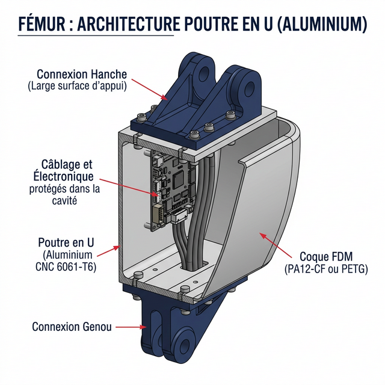
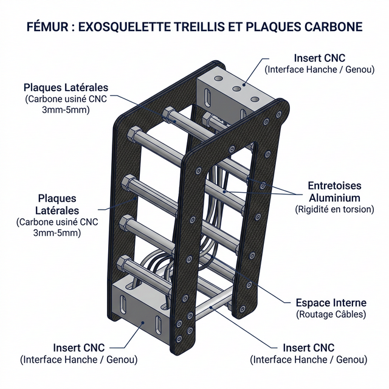
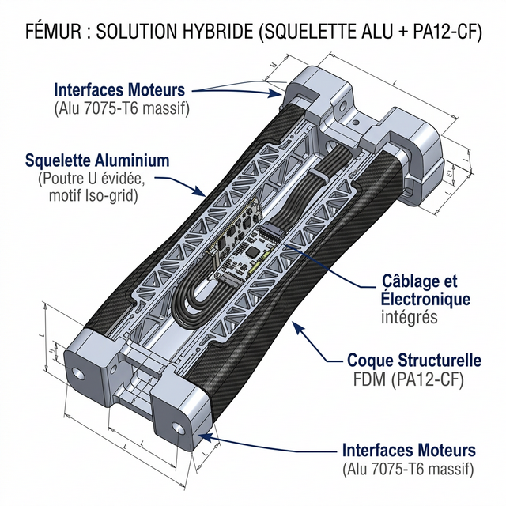
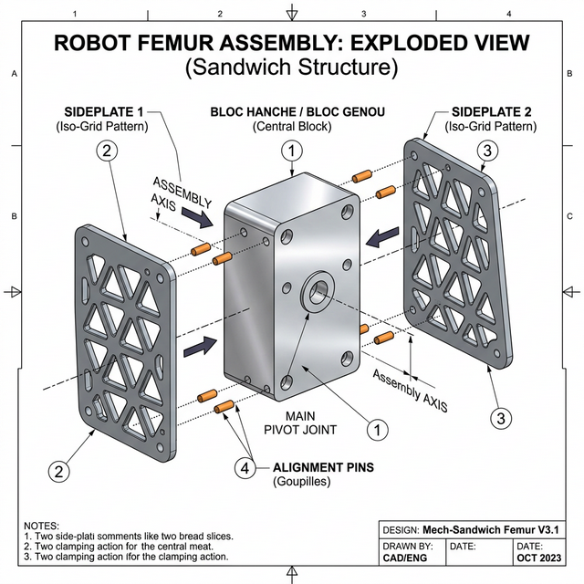

# 24 — Étude : Extension de l'Architecture Carbone (Fémur & Bras)

Suite à la validation de l'architecture "Tube Carbone + Insert + Goupille Mécanindus" pour le tibia (réduisant drastiquement l'inertie distale), il est naturel de se demander si cette solution peut être généralisée aux autres membres du D-Bot : le fémur (cuisse), le bras et l'avant-bras.

Voici l'analyse d'ingénierie mécanique comparative.

---

## 1. Extension aux Bras et Avant-Bras : Un Grand OUI 🏆

**L'application du tube carbone aux membres supérieurs est extrêmement pertinente et fortement recommandée.**

### 🦾 Avant-Bras (Coude → Poignet)
- **Contexte** : Relie le moteur du coude (RS-02) à la main (D-Hand avec moteurs XC330).
- **Inertie** : Le poignet/main est au bout d'un long bras de levier. Réduire le poids de l'avant-bras améliore drastiquement la réactivité du poignet et réduit la charge constante sur le moteur de l'épaule et du coude.
- **Efforts** : Le portage maximal cible étant de ~2 kg (voire 3-4 kg), les efforts transmis (torsion, flexion, arrachement) sont **très faibles** comparés à ceux des jambes du robot.
- **Verdict** : Un **Tube Carbone de Ø25 mm ou Ø30 mm** avec la même méthode (Insert Alu/PA12 + Goupille Mécanindus de Ø2 mm ou Ø2.5 mm) est la solution parfaite.

### 💪 Bras / Humérus (Épaule → Coude)
- **Contexte** : Relie l'épaule (RS-03) au coude (RS-02).
- **Efforts** : Principalement de la flexion (porter la charge) et de la torsion.
- **Verdict** : Un **Tube Carbone de Ø35 mm ou Ø40 mm** est tout à fait applicable. Les inserts CNC en aluminium (avec goupille Mécanindus travaillant en cisaillement) feront parfaitement la liaison avec les faces planes des moteurs RS.

**Bénéfice global pour les bras** : En marche dynamique, le balancement des bras agit comme un pendule d'équilibrage pour contrecarrer le lacet du bassin. Des bras plus légers permettent une oscillation beaucoup plus rapide sans générer de forces perturbatrices massives sur le buste.

---

## 2. Extension au Fémur (Cuisse) : Mitigé / Complexe ⚠️

L'application du tube carbone au fémur semble intuitive pour gagner du poids, mais elle se heurte à plusieurs défis d'architecture de haut niveau.

### 🚫 Problème 1 : L'encombrement et la géométrie des interfaces
- Le fémur doit relier la **Hanche** (gros bloc de 2 moteurs orientés à 90°) au **Genou** (Moteur RS-04, potentiellement doublé d'un mécanisme SEA ou d'une poulie).
- Ces articulations demandent des points de fixation très larges (les "Brackets" de hanche et de genou en forme de "U" ou "H").
- **Conséquence** : Transférer l'effort de ces immenses brackets vers un tube cylindrique étroit (Ø40 ou Ø50 mm) au centre demanderait des inserts massifs en forme d'entonnoir en aluminium usiné CNC. Le poids gagné par le tube carbone risque d'être totalement perdu par le poids des énormes adaptateurs en aluminium haut et bas.

### 🚫 Problème 2 : L'intégration globale (câblage, électronique)
- Le fémur n'est pas qu'un os : dans les robots bipèdes modernes, c'est l'endroit idéal pour loger les contrôleurs moteurs, acheminer les nappes de câbles (hanche → genou → cheville) cachées sous des coques de protection.
- Un simple tube cylindrique rond empêche tout montage propre d'électronique et rend le "cable routing" (routage des câbles) affreux (tout courrait à l'extérieur, exposé aux chocs).

### 📐 Les vraies solutions pour le Fémur : "Poutre en U" ou "Treillis 3D"
Pour résoudre ces problèmes, l'ingénierie biomimétique privilégie deux architectures robustes :

#### Solution 1 : La Poutre en U (Aluminium CNC)

Un profilé large et évidé en Aluminium 6061-T6 usiné à la CNC (C500). 
*   **Rigidité** : Extrêmement rigide en flexion.
*   **Intégration** : Il offre de très larges surfaces planes en haut et en bas pour visser les énormes brackets des moteurs de Hanche et de Genou.
*   **Électronique** : Sa cavité interne est parfaite pour loger les PCB de puissance et faire passer les câbles proprement, protégés des chocs par une coque d'habillage externe en impression 3D (PA12-CF).

#### Solution 2 : L'Exosquelette Treillis (Plaques Carbone + Aluminium)

Plutôt qu'un tube rond, on utilise des matériaux composites plats pour former une "boîte" ou 3D Truss :
*   **Structure** : Deux épaisses plaques parallèles (gauche/droite) en Fibre de Carbone (usiné à la CNC), reliées entre elles par des entretoises horizontales en aluminium.
*   **Interfaces** : Des blocs massifs (inserts) en Aluminium usiné sont pris en sandwich entre les plaques en haut et en bas pour fournir l'ancrage rigide aux moteurs.
*   **Avantage** : Ultra-léger, très rigide en torsion, tout en préservant un espace vide central pour le cheminement des câbles.

#### Solution 3 : Squelette Hybride (Alu Iso-grid + PA12-CF)

Il s'agit de la synthèse absolue entre la résistance de l'aluminium et la légèreté de l'impression 3D (PA12-CF) :
*   **Squelettisation (CNC)** : On part d'une Poutre en U en aluminium 7075-T6 que l'on va évider agressivement (usinage de "poches" triangulaires type Iso-grid) sur la C500. Le bloc de ~800g perd 40% à 50% de sa masse pour atteindre ~350g, tout en conservant des interfaces moteurs (haut/bas) massives.
*   **Hybridation (FDM)** : La perte de rigidité induite par la squelettisation est compensée par l'ajout de **coques structurelles épaisses en PA12-CF** (~150g). Ces coques viennent se visser ou se coller sur le squelette ajouré, fermant la cavité et offrant une rigidité en torsion exceptionnelle.
*   **Avantage** : Un poids hybride record (~500g), une solidité structurelle rassurante aux points d'ancrage moteurs (aluminium), avec une esthétique et un routage de câbles parfaits (fermés et protégés par le Nylon-Carbone).

#### Dimensions Approximatives & Ingénierie d'Assemblage

Pour rendre cet usinage réaliste et efficace sur la C500, voici les dimensions cibles et la méthode d'assemblage recommandée :

**Dimensions (Échelle Humanoïde ~1m40 - 1m50)** :
- **Longueur totale (Axe Hanche → Axe Genou)** : ~350 mm à 400 mm.
- **Largeur interne** : ~90 mm minimum (pour englober sans frotter le moteur RS-04 qui fait ~85mm de diamètre extérieur).
- **Profondeur** : ~60 mm à 80 mm (suffisant pour y loger une carte contrôleur type *Moteus* ou *Odrive* et le passage des gros câbles d'alimentation).

**L'Évolution : "Le Squelette en Plaques Ajustées"**
L'idée de **ne pas usiner un "U" massif dans un seul bloc** est la vraie solution d'ingénierie ("Design for Manufacturing"). Usiner un bloc de 100x100x400 mm pour faire un U évidé serait un immense gaspillage de matière (80% transformé en copeaux) et d'heures de machine. 

La méthode parfaite pour la C500 consiste à scinder le fémur en **plusieurs pièces plates vissées et collées** :
1. **Les Interfaces Moteurs (Haut et Bas)** : Deux gros blocs d'Aluminium usinés pour épouser parfaitement les vis des moteurs RS-04. Ces blocs agiront comme les "bouchons" structurels du fémur.
2. **Les Plaques Latérales (Joues)** : Deux plaques plates d'Aluminium 7075-T6 (épaisseur ~4 mm à 5 mm), découpées et évidées (Iso-grid) en 2.5D sur la CNC. C'est extrêmement rapide à usiner.
3. **L'Assemblage (Goupilles Mécanindus)** : Les plaques latérales s'encastrent précisément (ajustement H7 ou H8) dans des rainures usinées sur les blocs Moteurs. Plutôt que d'utiliser des vis (dont les filetages aluminium s'arracheraient sous les secousses), l'assemblage est verrouillé par des **Goupilles Élastiques (Mécanindus)** traversant l'ensemble de part en part.
    - *Avantage Mécanique* : Une goupille offre une résistance au cisaillement (translation) infiniment supérieure à une vis et ne craindra jamais les vibrations du robot.
    - *Règle de Conception* : Les alésages recevant ces goupilles **doivent impérativement être débouchants**. Ainsi, bien que l'assemblage soit extrêmement ferme, il reste 100% démontable en chassant simplement la goupille avec un pointeau (chasse-goupille).
4. **La Plaque Arrière (Optionnelle)** : Soit une troisième fine plaque d'aluminium usinée, soit directement la coque en PA12-CF qui vient fermer le fond du U pour apporter la rigidité finale en torsion.

Cette philosophie d'une structure en **platines assemblées** est exactement celle utilisée sur les bras et les jambes du robot *Optimus* ou du *Unitree G1*.

#### 4. Zoom sur l'Ingénierie des Interfaces (Hanche et Genou)

L'un des défis majeurs évoqués plus haut est la connexion d'un côté au **cluster de hanche** (impliquant 3 moteurs dont le gros RS-04) et de l'autre au **genou** (RS-04). Comment concevoir ces "Blocs Moteurs" (les extrémités du fémur) de manière simple et robuste ?

La solution s'appelle **l'Architecture en "Sandwich"** :

**A. L'Interface Supérieure (Côté Hanche RS-04)**
- Le stator du moteur RS-04 de la hanche (Pitch) est fixé au bassin. C'est son rotor (la cloche tournante) qui entraîne le fémur.
- Le fémur ne se visse *pas* directement sur le rotor. Il vient "enserrer" une pièce intermédiaire.
- **La Pièce Clé (Le "Bloc Hanche")** : C'est une grosse brique d'aluminium usinée (CNC). Une de ses faces possède l'empreinte circulaire des 8 vis M4 du rotor du RS-04. Ses côtés (flancs) sont parfaitement plats et usinés avec des rainures (encoches).
- **Le Sandwich** : Les deux grandes plaques latérales du fémur (les joues en alu Iso-grid de 5mm) viennent s'emboîter de chaque côté de cette brique. Des goupilles Mécanindus traversent la plaque gauche, la brique d'aluminium, et la plaque droite. L'ensemble est indéformable en torsion.

**B. L'Interface Inférieure (Côté Genou RS-04)**
La situation au genou est inversée. Le fémur doit "porter" le moteur du genou.
- **Le Bloc Genou** : Une autre brique d'aluminium massive usinée. Elle agit comme le "berceau" du moteur RS-04.
- Le stator (partie fixe) du RS-04 vient se visser solidement dans ce berceau (souvent via un collier de serrage CNC ou des vis frontales).
- Comme pour la hanche, les deux grandes plaques du fémur viennent prendre ce berceau "en sandwich" de chaque côté, verrouillées par goupilles Mécanindus.
- *C'est ensuite le tibia (via un autre système) qui viendra se fixer sur le rotor tournant de ce moteur de genou.*

> **Le Bilan Mécanique** : Cette approche découple totalement la complexité. La C500 n'a plus qu'à usiner 2 plaques plates (facile en 2.5D) et 2 petits blocs massifs de fixation (les adaptateurs Hanche et Genou). On n'essaie plus "d'évader" un bloc géant pour tout faire d'un coup.

#### Directives CAO / FAO (C500) pour les Plaques Latérales

Pour concevoir les deux plaques d'aluminium (les joues du fémur) de la Solution 3, voici les **dimensions cibles recommandées** pour un robot de taille ~1m40 pesant ~35-40 kg. Ces cotes sont optimisées pour la CNC NestWorks C500 :

1. **Épaisseur brute de la plaque (Alu 6061 ou 7075-T6)** : **5 mm**. C'est le standard dans l'industrie pour un fémur de cette taille (compromis parfait entre robustesse et flexibilité).
2. **Épaisseur des "Struts" (Les branches du treillis)** : **4 mm à 6 mm de large**. 
    - Ne descendez pas en dessous de 4 mm, sinon le fin bras d'aluminium vibrera lors de l'usinage (chatter) et cassera sous la charge dynamique du genou.
3. **Profondeur de la poche (Pocketing)** : **3.5 mm**. 
    - *Ne transpercez pas la plaque de part en part !* L'erreur classique est de faire des trous complets (0 mm restant). Il faut **laisser une "toile de fond" (*Web*) de 1.5 mm** d'épaisseur. Cette très fine toile unifiant tout le treillis ajoute une rigidité en cisaillement stupéfiante (type aile d'avion) pour quasiment 0 gramme supplémentaire. Les coques PA12-CF viendront se coller contre cette toile.
4. **Angles internes (Congés / Fillets)** : **R > 3.175 mm (soit Ø6.35 mm)**.
    - Dessinez vos poches triangulaires avec des angles très arrondis (minimum rayon 3.2 mm). Cela permet à la CNC C500 d'usiner la poche à pleine vitesse avec sa grosse fraise d'ébauche de 1/4" (6.35 mm) sans jamais s'arrêter aux angles, ce qui divise le temps d'usinage par 3.

#### Comparatif Détaillé : Les 3 Architectures de Fémur

| Critère | Poutre en U (Aluminium Plein) | Exosquelette Treillis (Carbone) | Solution Hybride (Alu *Iso-grid* + PA12-CF) |
| :--- | :--- | :--- | :--- |
| **Poids estimé** | Lourd : ~700g - 800g | **Ultra-Léger : ~300g - 400g** | **Optimisé : ~500g** (350g Alu + 150g PA12) |
| **Solidité (Flexion/Choc)** | Excellente. L'alu encaisse les gros chocs. | Excellente dans l'axe. Fragile aux chocs latéraux. | **Excellente**. L'alu prend la force, le PA12 encaisse l'impact. |
| **Solidité (Torsion / Lacet)** | **Exceptionnelle** (Profilé monobloc). | Bonne (Robe aux vibrations de la visserie). | **Exceptionnelle** (Structure composite fermée). |
| **Complexité Usinage (C500)** | Moyenne. 2 Setups (intérieur/extérieur). | Simple. Découpe 2D de plaques carbone. | **Haute**. Usinage complexe de poches triangulaires profondes. |
| **Complexité Assemblage** | **Très simple** (pièce monobloc). | Complexe (beaucoup d'entretoises/vis). | Facile (vissage des coques PA12). |
| **Intégration Câblage** | Idéale (caché dans la cavité). | Moyenne (câbles visibles entre les piliers). | **Idéale** (cavité étanche). |
| **Aesthétique** | Industriel, robuste (type Tesla Optimus). | "Racing", agressif, filaire. | **Premium, futuriste (type Agility Digit)**. |
| **Prix Estimé des matières**| Le moins cher : ~50€ (Bloc brut Alu).| Le plus cher : ~120€ (Plaques carbone). | Moyen : ~70€ (Alu brut + Fil PA12-CF). |

**Verdict Fémur** : Le tube carbone rond est inadapté à la cuisse. 
- Si l'objectif principal est le **gain de poids absolu**, concevez le fémur avec le **Treillis Carbone (Solution 2)**.
- Si le design exige **la simplicité et le prix le plus bas** : privilégiez la **Poutre en U massive en aluminium (Solution 1)**. 
- 🏆 **La Recommandation Ultime** : La **Solution Hybride (Solution 3)** offre le compromis parfait d'ingénierie robotique moderne (répondant exactement à l'ADN du projet C500 + Qidi Plus 4). Elle marie des **ancrages moteurs indestructibles** (aluminium), une **protection parfaite de l'électronique** et un un **gain de poids drastique (-30% vs U-Beam plein)** grâce à la synergie de l'usinage en dentelle et de l'impression 3D composites.

---

## Conclusion

| Membre | Recommandation | Argument principal |
|---|---|---|
| **Tibia (Sous Genou)** | **Tube Carbone (approuvé)** | Réduction drastique inertie distale, géométrie tubulaire idéale et efforts rectilignes. |
| **Bras / Humérus** | **Tube Carbone (très recommandé)** | Réduction du poids en pendule, efforts modérés, brackets CNC simples avec goupille. |
| **Avant-Bras** | **Tube Carbone (très recommandé)** | Géométrie droite simple (coude → poignet), portage ~2 kg ne stressant pas la goupille. |
| **Fémur (Cuisse)** | **Déconseillé (Profilé U ou treillis préférable)** | Interfaces de genou/hanche trop larges pour un tube. Impossible d'y loger câbles/électronique proprement. |
