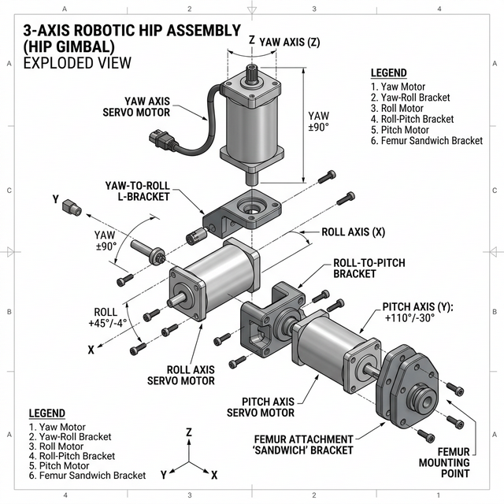

# 26 — Étude : Architecture du Bloc Pelvien (Cardan de Hanche)

Suite à la définition du "Fémur Hybride" (qui se connecte en sandwich au dernier moteur de la jambe), il est indispensable d'étudier ce qui se passe *au-dessus* du fémur : le fameux **"Bloc de Hanche" à 3 degrés de liberté (DOF)**.

L'**Addendum 11 de la page 15b** montrait l'architecture historique du K-Bot. Comment cette architecture se compare-t-elle aux standards actuels de l'industrie (Tesla Optimus, Unitree G1/H1, Agility Digit) et comment devons-nous concevoir celle du D-Bot ?

---

## 1. La Problématique des Moteurs QDD (Quasi-Direct Drive)

Dans le corps humain, la hanche est une articulation sphérique parfaite : les 3 axes de rotation (Yaw, Roll, Pitch) se croisent exactement au même point x,y,z (le centre de la tête du fémur).

En robotique basée sur des actionneurs cylindriques massifs (les moteurs QDD type RS-03/RS-04), **deux moteurs physiques ne peuvent pas occuper le même espace au même moment**. 
Il est donc géométriquement impossible d'avoir une vraie liaison sphérique concourante. L'industrie résout ce problème en séparant les axes et en *empilant* les moteurs les uns à la suite des autres via de solides équerres structurelles. C'est ce qu'on appelle la **Chaîne Cinématique (Kinematic Chain)**.

---

## 2. Benchmark de l'Industrie

### A. L'approche K-Bot Originale
Les images du K-Bot montrent une tentative de compacter les 3 moteurs dans un espace très restreint (sorte de grappe entremêlée).
- *Inconvénient majeur* : Cette conception crée souvent des collisions (auto-intersections) lors de mouvements combinés extrêmes et rend l'usinage des pièces de liaison affreusement complexe en CAO 3D.

### B. L'approche Tesla Optimus / Agility Digit
Dans les robots humanoïdes de nouvelle génération, l'empilement est assumé, clair et rectiligne. Le bassin (Pelvis) abrite le premier moteur, et les suivants s'y attachent comme des maillons de chaîne :
1. **Bassin → Moteur Yaw (Lacet)** : Monté verticalement dans le bassin pour orienter la jambe.
2. **Moteur Yaw → Moteur Roll (Roulis)** : Fixé à l'horizontale pour écarter la jambe de côté.
3. **Moteur Roll → Moteur Pitch (Flexion)** : Fixé de profil pour lever la jambe en avant.
4. **Moteur Pitch → Fémur**.

C'est l'approche la plus saine mécaniquement, car elle est facilement usinable (par notre fameuse C500) à l'aide de "Brackets" (Équerres) en aluminium de type L ou U.

---

## 3. L'Architecture D-Bot : Le Cardan de Hanche Séquentiel

Pour le D-Bot, nous validons officiellement l'approche séquentielle (type Optimus/Unitree).

Concrètement, la liaison entre le Bassin et le Fémur (Cuisse) du robot se décompose ainsi :

### Maillon 1 : L'Axe Yaw (Moteur RS-03)
* **Emplacement** : Fixe, monté *à l'intérieur* ou directement sous le châssis du bassin (Pelvis). Il pointe vers le bas (axe Z).
* **Rôle** : Tourner la pointe du pied vers l'intérieur ou l'extérieur.
* **Connexion sortante** : Son rotor (qui tourne) porte la première équerre (un L-Bracket usiné en alu massif).

### Maillon 2 : L'Axe Roll (Moteur RS-03)
* **Emplacement** : Fixé horizontalement (axe X) à l'extrémité du L-Bracket venant du moteur Yaw. Il regarde devant ou derrière le robot.
* **Rôle** : Permettre au robot de faire le grand écart ou d'écarter la jambe sur le côté.
* **Connexion sortante** : Son rotor porte la deuxième équerre (un U-Bracket ou L-Bracket).

### Maillon 3 : L'Axe Pitch (Gros Moteur RS-04)
* **Emplacement** : Fixé perpendiculairement (axe Y) à l'extrémité de l'équerre du moteur Roll. Il regarde sur les côtés du robot.
* **Rôle** : C'est le boss de la motricité. Il encaisse la charge principale pour lever la cuisse, s'accroupir, ou propulser le robot en avant. C'est pour cela qu'il nécessite un RS-04 (120 Nm) contre des RS-03 pour les deux autres.
* **Connexion sortante** : Son rotor est la ligne d'arrivée du bassin.

### Le Bout de la Chaîne : Le Fémur Hybride
Et c'est ici - *et uniquement ici !* - que vient se greffer notre **"Fémur Hybride en Sandwich"** (décrit dans le document 24).
Les deux épaisses plaques latérales du fémur viennent prendre en sandwich l'interface (cloche/rotor) du dernier moteur, le RS-04 de Pitch. 

Le fémur, en réalité, ne "sait pas" qu'il y a 2 autres moteurs au-dessus de lui. Il n'est attaché qu'au dernier maillon de la chaîne.

---

## 4. Conséquences pour l'Ingénierie (Usinage C500)

L'énorme avantage de rejeter le "cluster" touffu du K-Bot pour cette chaîne séquentielle, c'est l'usinabilité immédiate !

Nous avons réduit la hanche d'une géométrie 3D impénétrable à **seulement 2 pièces mécaniques simples (Brackets)** :
1. **Le "Yaw-Roll Bracket"** : Une simple équerre de profilé aluminium.
2. **Le "Roll-Pitch Bracket"** : Une seconde équerre en aluminium reliant le deuxième et le troisième moteur.

La D-Bot peut ainsi s'appuyer sur des blocs massifs d'aluminium (7075-T6 de haute résistance) taillés par la C500. Ces Brackets mesurent tout au plus 5 à 8 cm de long chacun, offrant une rigidité exceptionnelle sans le moindre risque de flambement, contrairement aux longues pièces en plastique du dos ou des tibias.

> **Verdict / Action Recommandée** : Toute la modélisation CAO du bloc pelvien doit se concentrer sur le design ultra-rigide de ces 2 Brackets de liaison. C'est la seule façon moderne et viable de raccrocher notre "Fémur Hybride Sandwich" aux 3 DOFs exigés par les algorithmes de locomotion (Isaac Gym).
