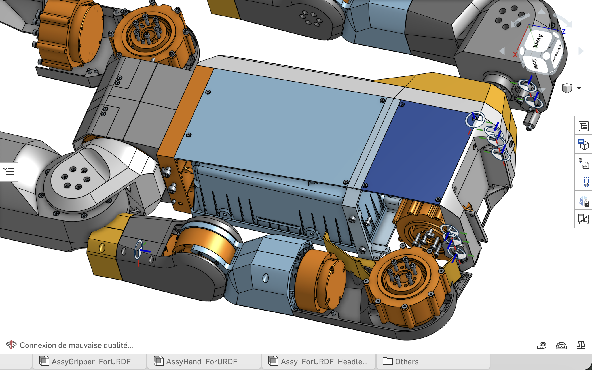

# 27 — Étude Architecture Épaule D-Bot

Ce document étudie le **positionnement mécanique des 3 moteurs** au niveau de l'épaule du D-Bot (RS-03 Pitch, RS-03 Roll, RS-02 Yaw), en s'appuyant sur l'architecture de référence du K-Bot et sur l'analyse des robots concurrents haut de gamme.

---

## 1. Référence de Départ : L'Épaule du K-Bot

L'image ci-dessous montre le positionnement d'origine des moteurs dans l'épaule du K-Bot. C'est notre base de comparaison.



### 1.1 Analyse de l'Architecture K-Bot

Le K-Bot utilise une architecture classique **"Stacked Perpendicular"** (empilement perpendiculaire) pour l'épaule :

```
VUE SCHÉMATIQUE — ÉPAULE K-BOT (coupe frontale)

            ┌─────────────────────────────┐
            │        TORSE (Châssis)       │
            │                              │
            │  ╔════════════════╗          │
            │  ║  RS-03  PITCH  ║ ← Axe Y │ Stator fixé au torse
            │  ║  (106×106mm)   ║          │ Rotor pointe vers le bas
            │  ╚════════╤═══════╝          │
            └───────────┼──────────────────┘
                        │
              ╔═════════╧═════════╗
              ║   RS-03  ROLL     ║ ← Axe X   Stator fixé au rotor du Pitch
              ║   (106×106mm)     ║            Rotor pointe latéralement
              ╚═════════╤═════════╝
                        │
              ╔═════════╧═════════╗
              ║   RS-02  YAW      ║ ← Axe Z   Stator fixé au rotor du Roll
              ║   (78×78mm)       ║            Rotor connecté à l'humérus
              ╚═════════╤═════════╝
                        │
                   ╔════╧════╗
                   ║ HUMÉRUS ║  → vers le coude
                   ╚═════════╝
```

### 1.2 Caractéristiques de cet Empilement

| Critère | Valeur K-Bot |
| :--- | :--- |
| **Type** | Empilement en série (chaque moteur porte le suivant) |
| **Moteurs** | RS-03 (880g) + RS-03 (880g) + RS-02 (405g) |
| **Masse totale épaule** | **~2 165g** (moteurs seuls) |
| **Avantage** | Simple, pas de bielles ni d'engrenages externes |
| **Inconvénient** | Le moteur Pitch porte TOUTE la masse (Roll + Yaw + Bras ≈ 4 kg) |
| **Centres de masse** | Les 3 axes ne sont PAS concourants → le bras de levier augmente |

---

## 2. Analyse des Approches Concurrentes

Comment les leaders de l'industrie résolvent-ils ce même problème ?

### 2.1 Tesla Optimus — Actionneurs Linéaires Rotatifs

| Critère | Tesla Optimus (Gen 3/4) |
| :--- | :--- |
| **Architecture** | Actionneurs custom compacts, pas de moteurs "off-the-shelf" |
| **DOF Épaule** | 3 (Pitch, Roll, Yaw) |
| **Innovation clé** | Moteurs intégrés dans des coques composites légères, axes quasi-concourants |
| **Câblage** | 100% interne, aucun câble visible |
| **Durabilité** | 200 000 cycles de flexion annoncés (Gen 4) |
| **Contrainte** | Nécessite des aimants terres rares, fabrication custom impossible à reproduire |

**Ce qu'on peut en retenir** : L'idée de minimiser le décalage entre axes (les rendre concourants) est fondamentale pour réduire les couples parasites. Tesla y parvient grâce à des actionneurs sur mesure ultra-compacts.

### 2.2 Unitree H1/G1 — Joint Sphérique Équivalent

| Critère | Unitree H1 |
| :--- | :--- |
| **Architecture** | **3 moteurs M107 montés perpendiculairement**, formant un joint sphérique équivalent |
| **DOF** | 3 (Pitch, Roll, Yaw) |
| **Couple moteur** | M107 : jusqu'à **360 N.m** (réducteur harmonique intégré) |
| **Innovation clé** | Axe creux (hollow shaft) pour le routage des câbles |
| **Masse moteur** | ~600g par M107 |
| **Particularité** | Les 3 axes se croisent presque au même point (quasi-concourants) |

**Ce qu'on peut en retenir** : L'architecture "quasi-sphérique" avec 3 moteurs perpendiculaires est la même philosophie que le K-Bot, mais Unitree pousse la compacité grâce à des moteurs custom à axe creux. L'idée d'axes concourants est le standard visé.

### 2.3 Figure 02 — Intégration Épurée

| Critère | Figure 02 |
| :--- | :--- |
| **Architecture** | Moteurs custom intégrés dans les articulations, design "clean" |
| **DOF** | 3 (Pitch, Roll, Yaw) |
| **Innovation clé** | Câblage 100% interne (vs Figure 01 qui avait du câblage externe) |
| **Matériaux** | Composite blend (résine + fibres) pour optimiser poids/rigidité |
| **Particularité** | Chaque moteur est "optimisé pour sa position" (couple/vitesse variables) |

**Ce qu'on peut en retenir** : L'approche de **moteurs de taille variable selon le besoin de couple** est exactement ce que nous faisons avec notre D-Hand Hybrid (XC430 force + XC330 précision). On pourrait imaginer la même logique à l'épaule.

### 2.4 Boston Dynamics Atlas (Électrique) — Benchmark Absolu

| Critère | Atlas Électrique (2024+) |
| :--- | :--- |
| **Architecture** | Actionneurs électriques custom, design hyper-compact |
| **DOF Bras** | 6 DOF total (3 épaule + 1 coude + 2 poignet) |
| **Innovation clé** | Rotation continue possible sur certains axes (>360°) |
| **Particularité** | Capable de mouvements "non humains" (bras qui tourne sur lui-même) |

**Ce qu'on peut en retenir** : Atlas montre qu'avoir les axes concourants et un design compact permet une cinématique exceptionnelle. Mais cela nécessite des actionneurs custom hors de notre portée.

### 2.5 K-Bot / D-Bot — Open Source (Notre Base)

| Critère | K-Bot (Notre base) |
| :--- | :--- |
| **Architecture** | Empilement série (Stacked Perpendicular) |
| **Moteurs** | Off-the-shelf (RobStride RS-03 / RS-02) |
| **Avantage** | Simple à concevoir et assembler, pièces remplaçables |
| **Inconvénient** | Axes décalés (non concourants), bras de levier important |
| **Évolutivité** | Brackets CNC Alu 6061 facilement redessinables |

---

## 3. Tableau Comparatif Synthétique

| Critère | K-Bot (Base) | Tesla Optimus | Unitree H1 | Figure 02 | Atlas É. |
| :--- | :---: | :---: | :---: | :---: | :---: |
| **Axes concourants** | ❌ Décalés | ✅ Quasi | ✅ Quasi | ✅ Quasi | ✅ Oui |
| **Moteurs standards** | ✅ RS-03/02 | ❌ Custom | ❌ M107 | ❌ Custom | ❌ Custom |
| **Câblage interne** | ❌ Externe | ✅ | ✅ (axe creux) | ✅ | ✅ |
| **Masse épaule** | ~2.2 kg | ~1.5 kg (est.) | ~1.8 kg | ~1.2 kg (est.) | ~1.5 kg (est.) |
| **Reproductibilité** | ✅✅✅ | ❌ | ❌ | ❌ | ❌ |
| **Coût épaule** | ~$660 | N/A | N/A | N/A | N/A |

---

## 4. Faut-il Appliquer l'Approche "Hanche" à l'Épaule ?

L'utilisateur propose d'appliquer la même logique que celle adoptée pour la hanche du D-Bot (3 moteurs perpendiculaires empilés : RS-04 Pitch + RS-03 Roll + RS-03 Yaw). Analysons si c'est pertinent.

### 4.1 Rappel : L'Architecture Hanche du D-Bot

```
HANCHE D-BOT (3 DOF)
   RS-04 (Pitch) → Fixé au bassin, axe médio-latéral (Y)
      └── RS-03 (Roll) → Fixé au rotor du Pitch, axe antéro-postérieur (X)
             └── RS-03 (Yaw) → Fixé au rotor du Roll, axe vertical (Z)
                    └── Fémur → vers le genou
```

**Principe** : Empilement en série, le moteur le plus puissant (RS-04, 120 N.m) est en base car il porte tout le poids de la jambe ET résiste au couple gravitationnel maximal.

### 4.2 Transposition à l'Épaule

**Oui, la même logique s'applique parfaitement à l'épaule**, avec des adaptations liées aux contraintes propres :

| Critère | Hanche | Épaule | Différence Clé |
| :--- | :--- | :--- | :--- |
| **Moteur de base** | RS-04 (120 N.m) | RS-03 (60 N.m) | Couple ~2× inférieur à la hanche |
| **Charge portée** | Jambe entière (~8 kg) | Bras entier (~3.5 kg) | Charge ~2× inférieure |
| **Axe critique** | Pitch (lever la jambe) | **Pitch (lever le bras)** | Le pitch est critique dans les deux cas |
| **Inversion du porte-à-faux** | Vers le BAS | Vers le BAS aussi | Le bras pend, la gravité tire pareil |
| **Orientation du premier moteur** | Horizontal (médio-latéral) | **Horizontal (médio-latéral)** | Identique |

### 4.3 Mon Avis : L'Épaule D-Bot Devrait Suivre l'Architecture Hanche (OUI)

**L'approche est parfaitement cohérente**, et voici pourquoi c'est même la solution optimale avec des moteurs off-the-shelf :

#### ✅ Arguments POUR (adopter la même architecture que la hanche)

1. **Même logique physique** : Comme la hanche, l'épaule subit principalement un couple gravitationnel sur l'axe Pitch. Mettre le moteur le plus coupleux (RS-03, 60 N.m) sur cet axe, en base, est la bonne stratégie.

2. **Cohérence de design** : Utiliser la même philosophie d'empilement sur tout le robot simplifie considérablement la conception CAO, l'assemblage, les pièces de rechange et la maintenabilité.

3. **Reproductibilité** : Pas de bielles, pas de cardans, pas de mécanismes de transmission complexes. L'empilement série est direct-drive (ou quasi direct-drive avec le réducteur intégré du Robstride).

4. **Brackets CNC** : Les brackets de liaison entre moteurs seront en Alu 6061 usinés sur la C500, exactement comme à la hanche. Le savoir-faire acquis sur les brackets hanche est directement transférable.

5. **Validé par l'industrie** : L'architecture "Stacked Perpendicular" est exactement celle utilisée par Unitree H1, K-Bot, et la majorité des humanoïdes open-source. C'est un standard éprouvé.

#### ⚠️ Points de Vigilance Spécifiques à l'Épaule

| Point | Risque | Mitigation |
| :--- | :--- | :--- |
| **Masse totale empilée** | 2.165 kg de moteurs empilés à ~15 cm du centre du torse | Brackets en Alu léger (pas en PA12-CF) pour minimiser le poids additionnel |
| **Couple résiduel Pitch** | Le RS-03 Pitch doit en permanence compenser le poids du bras (~3.5 kg × 0.25m × g ≈ 8.6 N.m) même au repos | Mode "holding torque" du RS-03 < 10 N.m → confortable (nominal 20 N.m) |
| **Encombrement latéral** | L'empilement RS-03 + RS-03 + RS-02 fait ~106 + 106 + 78 mm de haut ≈ 290 mm | S'intègre dans l'épaule humanoïde standard (~30 cm d'épaule) |
| **Câblage** | 3 câbles XT60 (power) + 3 câbles JST-GH (data) qui doivent suivre les rotations | Prévoir des passages de câble avec du jeu de ≥ 15 cm et des boucles de service |

#### ❌ Arguments CONTRE l'utilisation de bielles/cardan à l'épaule

Contrairement à la cheville où le cardan + bielles résolvait un problème spécifique (placer les moteurs loin de la cheville pour réduire l'inertie distale), à l'épaule ce problème **n'existe pas** :

1. **Les moteurs sont DÉJÀ dans le torse** : À l'épaule, les moteurs sont proches du centre de masse du robot. Les déporter davantage ne sert à rien.

2. **Un mécanisme de bielles ajouterait de la complexité pour zéro gain** : À la cheville, les bielles permettaient de retirer 310g de masse distale. À l'épaule, les moteurs sont déjà en position proximale.

3. **Le couple requis est confortable** : Le RS-03 (60 N.m pic) a une marge de +600% sur le couple gravitationnel du bras (~8.6 N.m). Pas besoin de mécanisme amplificateur.

4. **Un cardan introduirait des jeux mécaniques** : Sur un bras qui fait de la manipulation fine (D-Hand Hybrid), tout jeu angulaire se traduirait par une imprécision au bout des doigts — inadmissible.

---

## 5. Architecture Recommandée : D-Bot Shoulder V1

### 5.1 Empilement Recommandé

```
VUE SCHÉMATIQUE — ÉPAULE D-BOT V1

                ┌──────── TORSE ────────┐
                │                        │
    Fixé        │  ╔════════════════╗    │
    au        ──┼──║  RS-03  PITCH  ║    │  ← Axe Y (médio-latéral)
    torse       │  ║  (60 N.m)      ║    │     Lever/abaisser le bras
                │  ╚═══════╤════════╝    │
                └──────────┼─────────────┘
                           │  Bracket Alu #1
                 ╔═════════╧═════════╗
                 ║   RS-03  ROLL     ║  ← Axe X (antéro-postérieur)
                 ║   (60 N.m)        ║     Écarter le bras latéralement
                 ╚═════════╤═════════╝
                           │  Bracket Alu #2
                 ╔═════════╧═════════╗
                 ║   RS-02  YAW      ║  ← Axe Z (vertical)
                 ║   (17 N.m)        ║     Rotation interne/externe
                 ╚═════════╤═════════╝
                           │
                     ╔═════╧═════╗
                     ║  HUMÉRUS  ║  → vers le coude (RS-02)
                     ╚═══════════╝
```

### 5.2 Ordre Physique des Moteurs (de la base au bras)

| Position | Moteur | Axe | Couple | Justification |
| :--- | :---: | :---: | :---: | :--- |
| **1 (Base)** | **RS-03** | **Pitch (Y)** | 60 N.m | Porte le plus de charge. Le stator est fixé rigidement au torse. |
| **2 (Inter.)** | **RS-03** | **Roll (X)** | 60 N.m | Contre le porte-à-faux latéral. Fixé au rotor du Pitch. |
| **3 (Distal)** | **RS-02** | **Yaw (Z)** | 17 N.m | Rotation de l'humérus. Le plus léger (405g) car en bout de chaîne. |

### 5.3 Brackets de Liaison (CNC Alu 6061)

Deux brackets sont nécessaires pour relier les 3 moteurs :

| Bracket | Relie | Matériau | Machine | Contraintes |
| :--- | :--- | :--- | :---: | :--- |
| **Bracket #1** (Pitch→Roll) | Rotor RS-03 Pitch → Stator RS-03 Roll | Alu 6061-T6 | C500 | Couple max 60 N.m, doit supporter le poids Roll+Yaw+Bras (~2.8 kg) |
| **Bracket #2** (Roll→Yaw) | Rotor RS-03 Roll → Stator RS-02 Yaw | Alu 6061-T6 | C500 | Couple max 17 N.m, doit supporter le poids Yaw+Bras (~1.4 kg) |

> **Note** : Les brackets doivent être **aussi compacts que possible** pour minimiser le décalage entre les axes de rotation (les rapprocher d'une configuration concourante). Viser un décalage inter-axe de **< 30mm** entre Pitch et Roll, et **< 25mm** entre Roll et Yaw.

### 5.4 Bilan Masse et Coût

| Composant | Masse | Coût |
| :--- | :---: | :---: |
| RS-03 Pitch | 880g | ~$250 |
| RS-03 Roll | 880g | ~$250 |
| RS-02 Yaw | 405g | ~$170 |
| Bracket #1 (Alu CNC) | ~120g (est.) | ~30€ (CNC C500) |
| Bracket #2 (Alu CNC) | ~80g (est.) | ~20€ (CNC C500) |
| Visserie M4 12.9 | ~30g | ~5€ |
| **Total par épaule** | **~2 395g** | **~$720** |
| **Total 2 épaules** | **~4 790g** | **~$1 440** |

---

## 6. Optimisations Futures (V2+)

### 6.1 Réduction du Décalage Inter-Axe

Le principal défaut de l'empilement série est que les axes ne sont pas concourants. Cela crée des couples parasites (le bras de levier entre l'axe Pitch et le centre de masse du bras augmente avec le décalage).

**Piste V2** : Concevoir un bracket monobloc "L-shape" qui minimise le décalage à < 15mm, en intégrant les 2 passages de câble dans la pièce CNC elle-même.

### 6.2 Passage au RS-06 pour le Yaw

Si la manipulation lourde bras plié est nécessaire (> 5 kg), le RS-02 Yaw (17 N.m) pourrait être remplacé par un RS-06 (36 N.m, 621g). Le surpoids serait de +216g, mais le couple de rotation doublerait.

### 6.3 Clavicule (DOF additionnel)

Certains robots avancés (KIT Dual Arm) ajoutent un 4ème DOF "clavicule" (élévation de l'épaule entière). Cela augmente le workspace et la capacité bimanuelle. Un RS-02 monté dans le torse pourrait simuler ce mouvement.

---

## 7. Conclusion

> 🟢 **Recommandation V1 : Adopter l'architecture Stacked Perpendicular identique à la hanche.**
>
> L'empilement RS-03 (Pitch) → RS-03 (Roll) → RS-02 (Yaw) est la solution optimale pour le D-Bot avec des moteurs off-the-shelf. C'est l'architecture du K-Bot, validée par Unitree H1 et l'ensemble des humanoïdes open-source. Aucun mécanisme de bielles ou cardan n'est nécessaire à l'épaule — les moteurs sont déjà en position proximale et les couples sont confortables.
>
> La priorité de conception est de **minimiser le décalage inter-axe** des brackets pour tendre vers une articulation quasi-sphérique.

---

*Étude réalisée en Mars 2026. Réf : K-Bot standard, Hanche D-Bot (§16), [Étude Cheville Cardan](./20_Etude_Cheville_Cardan.md).*
