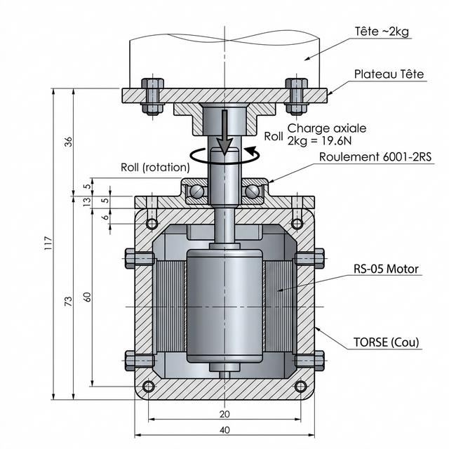

# 29 — Étude : Montage Vertical RS-05 pour le Roll de Tête (Cou)

Cette annexe détaille la conception du montage vertical d'un moteur **RobStride RS-05** destiné à piloter le **Roll** (inclinaison latérale) de la tête du D-Bot, avec un **roulement de support externe** pour délester le rotor des efforts axiaux et radiaux.

---

## 1. Contexte et Problématique

### 1.1 Cahier des Charges

| Paramètre | Valeur |
| :--- | :--- |
| **Moteur** | RobStride RS-05 (191g, 46×46×44mm) |
| **Couple pic** | 5.5 N.m |
| **Couple nominal** | 1.6 N.m |
| **Masse de la tête** | ~2 kg (structure + capteurs OAK-D Pro + électronique) |
| **Mouvement** | Roll (inclinaison latérale gauche/droite) |
| **Orientation moteur** | Vertical, stator fixé au torse, rotor vers le haut |
| **Amplitude souhaitée** | ±30° à ±45° |

### 1.2 Le Problème du Montage Vertical

Lorsqu'un moteur QDD comme le RS-05 est monté **verticalement** avec le rotor pointant vers le haut et portant une charge :

1. **Charge axiale directe** : La masse de la tête (2 kg = **19.6 N**) s'exerce **directement** sur l'axe du rotor, dans la direction de l'arbre. Les roulements internes du RS-05 ne sont pas conçus principalement pour supporter des charges axiales, mais plutôt des charges radiales et le couple de torsion.

2. **Porte-à-faux** : Si la tête n'est pas parfaitement centrée sur l'axe, un **moment de basculement** (charge radiale + moment) s'ajoute, aggravant les contraintes sur les roulements internes.

3. **Usure prématurée** : Sans roulement de support, les roulements internes du moteur s'usent plus vite car ils encaissent simultanément le couple moteur ET la charge gravitationnelle. Cela peut provoquer du jeu, des vibrations et une dégradation des performances.

> ⚠️ **Constat** : Les spécifications RobStride ne publient pas la capacité de charge axiale des roulements internes du RS-05. Il est donc **fortement recommandé** d'ajouter un roulement de support externe.

---

## 2. Solution Recommandée : Roulement de Support Externe

### 2.1 Principe

L'idée est simple et élégante : **ajouter un roulement à billes au-dessus du moteur** qui prend en charge la quasi-totalité des efforts axiaux (poids de la tête) et radiaux (porte-à-faux), ne laissant au rotor du RS-05 que ce pour quoi il est conçu : **le couple de rotation pure (Roll)**.

### 2.2 Schéma de Montage



```
          SCHÉMA DE MONTAGE — COU D-BOT (Roll)
          =====================================

                    ┌─────────────┐
                    │   TÊTE      │  ← ~2 kg (OAK-D Pro, structure, etc.)
                    │   ~2 kg     │
                    └──────┬──────┘
                           │
              ╔════════════╧════════════╗
              ║   PLATEAU TÊTE          ║  ← Plaque Alu 6061 usinée CNC
              ║   (Hub / Flasque)       ║     Boulonné à l'arbre de sortie
              ╚════════════╤════════════╝
                           │
            ┌──────────────┼──────────────┐
            │   ┌──────────┼──────────┐   │
            │   │    ROULEMENT        │   │  ← Roulement 6001-2RS (28×12×8mm)
            │   │    de SUPPORT       │   │     Capacité axiale : ~200 N
            │   │    (Bague ext.      │   │     Capacité radiale : ~530 N
            │   │     dans platine)   │   │     Bague int. fixée sur l'arbre
            │   └──────────┼──────────┘   │
            │              │              │
            │   ╔══════════╧══════════╗   │
            │   ║  PLATINE SUPPORT    ║   │  ← Plaque Alu fixée au torse
            │   ║  (Top Plate)        ║   │     Le roulement est emmanchement
    ████████╧═══╬══════════════════════╬═══╧████████ ← Structure Torse
            │   ║                      ║   │
            │   ║   ╔══════════════╗   ║   │
            │   ║   ║              ║   ║   │
            │   ║   ║   RS-05      ║   ║   │  ← Moteur vertical
            │   ║   ║   STATOR     ║   ║   │     46×46×44mm
            │   ║   ║   (FIXE)     ║   ║   │     Stator boulonné au torse
            │   ║   ║              ║   ║   │
            │   ║   ║   ┌──────┐   ║   ║   │
            │   ║   ║   │ROTOR │   ║   ║   │  ← Rotor libre en rotation
            │   ║   ║   │(axe) │   ║   ║   │     Ne porte QUE le couple
            │   ║   ║   └──────┘   ║   ║   │
            │   ║   ╚══════════════╝   ║   │
            │   ╚══════════════════════╝   │
            └──────────────────────────────┘
```

### 2.3 Description du Flux de Forces

```
FLUX DES EFFORTS — MONTAGE AVEC ROULEMENT DE SUPPORT

    ┌─────────────────────────────────────────┐
    │         TÊTE (~2 kg)                    │
    │                                         │
    │  Charge axiale : 19.6 N (gravité)       │
    │  Charge radiale : ~5-10 N (porte-à-faux)│
    └──────────────┬──────────────────────────┘
                   │
                   ▼
    ┌──────────────────────────────────────┐
    │     PLATEAU TÊTE (Hub)               │
    │     Solidaire de l'arbre de sortie   │
    └──────────────┬───────────────────────┘
                   │
          ┌────────┴────────┐
          │                 │
          ▼                 ▼
    ╔═══════════╗    ╔════════════╗
    ║ ROULEMENT ║    ║  RS-05     ║
    ║ 6001-2RS  ║    ║  ROTOR     ║
    ║           ║    ║            ║
    ║ Absorbe:  ║    ║ Absorbe:   ║
    ║ • Axial   ║    ║ • Couple   ║
    ║   19.6 N  ║    ║   de Roll  ║
    ║ • Radial  ║    ║   UNIQUEM. ║
    ║   5-10 N  ║    ║            ║
    ╚═════╤═════╝    ╚════════════╝
          │
          ▼
    ┌──────────────────────────────────────┐
    │     PLATINE SUPPORT (Structure)      │
    │     → Torse D-Bot                    │
    └──────────────────────────────────────┘
```

**Résultat** : Le rotor du RS-05 ne "voit" que le **couple pur de Roll** (max ~0.5 N.m pour incliner la tête de 2 kg à 25 cm de bras de levier). Les 19.6 N de charge axiale passent intégralement par le roulement externe → **durée de vie du moteur maximisée**.

---

## 3. Choix du Roulement

### 3.1 Roulement Recommandé : 6001-2RS

| Paramètre | Valeur |
| :--- | :--- |
| **Désignation** | 6001-2RS (ou 6001-2Z pour version blindée) |
| **Diamètre intérieur** | 12 mm |
| **Diamètre extérieur** | 28 mm |
| **Largeur** | 8 mm |
| **Capacité de charge dynamique** | ~5.1 kN (radiale) |
| **Capacité de charge statique** | ~2.4 kN (radiale) |
| **Charge axiale admissible** | ~200 N (règle pratique : ~30% de C₀ radiale) |
| **Poids** | ~18 g |
| **Prix** | ~3-5 € (SKF / NSK) |
| **Étanchéité** | Joints caoutchouc 2RS (protection poussière) |

### 3.2 Justification du Dimensionnement

| Critère | Besoin | Capacité 6001-2RS | Marge |
| :--- | :---: | :---: | :---: |
| **Charge axiale** (poids tête) | 19.6 N | ~200 N | **×10** ✅ |
| **Charge radiale** (porte-à-faux) | ~10 N max | ~5100 N | **×500** ✅ |
| **Diamètre intérieur** | Compatible arbre RS-05 | 12 mm | ✅ |
| **Encombrement** | Compact | 28×8 mm | ✅ |

> 💡 **Alternative** : Si l'arbre de sortie du RS-05 nécessite un diamètre intérieur différent de 12 mm, envisager un roulement **608-2RS** (8×22×7mm) ou **6000-2RS** (10×26×8mm) selon le cas. La charge reste largement surdimensionnée dans tous les cas.

### 3.3 Pourquoi pas un Roulement à Contact Oblique ?

Un roulement à contact oblique (type 7001) offrirait une meilleure capacité axiale "pure", mais dans notre cas :
- La charge axiale est **minuscule** (19.6 N) → un simple 6001 standard suffit largement.
- Le roulement à contact oblique nécessite un **pré-charge** et un appairage plus complexe.
- Le coût et la complexité de montage ne se justifient pas pour 2 kg de tête.

**Verdict** : Le **6001-2RS standard** est le choix optimal (simple, peu cher, surdimensionné).

---

## 4. Détails de Mise en Œuvre

### 4.1 Fixation du Stator RS-05

Le stator du RS-05 est fixé **rigidement** au châssis du torse (structure PA12-CF ou Alu) :

- **4 vis M3** (ou M4) dans les trous de fixation du stator du RS-05
- Utiliser des **inserts filetés** (ou taraudages directs dans l'alu) dans la structure du torse
- Le câble de puissance et de données sort par le bas du stator

### 4.2 Platine Support (Top Plate)

Une platine en **Aluminium 6061** usinée CNC (ou en PA12-CF imprimée 3D) se place **au-dessus** du moteur :

- **Emmanchement serré H7/k6** pour la bague extérieure du roulement 6001
- Fixation au torse via 4 entretoises (colonnes) encadrant le moteur
- Épaisseur recommandée : **6-8 mm** pour rigidité suffisante

### 4.3 Hub de Sortie (Plateau Tête)

Le plateau qui porte la tête est solidaire de l'arbre de sortie du RS-05 :

- **Bague intérieure du roulement** : emmanchée serrée sur l'arbre de sortie (ou sur un adaptateur/manchon)
- **Clavette ou vis de pression** pour solidariser le hub à l'arbre
- Le hub est en **Alu 6061** usiné, avec des trous de fixation pour recevoir la structure de la tête

### 4.4 Séquence de Montage

```
SÉQUENCE DE MONTAGE (étape par étape) :

1. Fixer le STATOR du RS-05 au torse (4× M3)
        ↓
2. Placer la PLATINE SUPPORT au-dessus du moteur,
   fixée aux entretoises du torse
        ↓
3. Emmancher le roulement 6001-2RS dans la platine
   (emmanchement serré bague extérieure → logement H7)
        ↓
4. Passer l'arbre de sortie du RS-05 (rotor) à travers
   la bague intérieure du roulement
        ↓
5. Fixer le HUB (plateau tête) sur l'arbre de sortie
   au-dessus du roulement (vis de pression ou clavette)
        ↓
6. Monter la structure de la tête sur le hub
```

---

## 5. Bilan des Avantages

### 5.1 Avec Roulement de Support (✅ Recommandé)

| Avantage | Détail |
| :--- | :--- |
| **Durée de vie moteur** | Les roulements internes du RS-05 ne subissent que le couple → durée de vie maximale |
| **Précision** | Zéro jeu axial, mouvement de Roll pur et fluide |
| **Rigidité** | La tête est soutenue par le roulement, pas par le rotor → aucun "ballottement" |
| **Sécurité** | En cas de coupure moteur, la tête reste en place (le roulement la porte) |
| **Coût** | Un roulement 6001-2RS coûte 3-5 € — investissement négligeable |
| **Masse ajoutée** | 18g (roulement) + ~30g (platine) = **~48g total** |

### 5.2 Sans Roulement de Support (❌ Non recommandé)

| Risque | Détail |
| :--- | :--- |
| **Usure prématurée** | Les roulements internes du RS-05 encaissent axial + couple → jeu en 6-12 mois |
| **Vibrations** | Le jeu croissant provoque des micro-oscillations visibles sur la tête |
| **Bruit** | Les roulements surchargés deviennent bruyants |
| **Perte de couple** | Une partie du couple moteur est "consommée" pour maintenir la tête en position |

---

## 6. Vérification du Couple Nécessaire

### 6.1 Couple Gravitationnel pour le Roll

```
G_roll = m × g × L × sin(θ)

Où :
  m = 2 kg (masse tête)
  g = 9.81 m/s²
  L = 0.05 m (bras de levier = distance centre de gravité tête → axe de rotation)
  θ = 45° (inclinaison maximale)

G_roll = 2 × 9.81 × 0.05 × sin(45°)
G_roll = 2 × 9.81 × 0.05 × 0.707
G_roll ≈ 0.69 N.m
```

### 6.2 Marge du RS-05

| Paramètre | Valeur |
| :--- | :--- |
| **Couple gravitationnel max** | 0.69 N.m (à 45° d'inclinaison) |
| **Couple nominal RS-05** | 1.6 N.m |
| **Couple pic RS-05** | 5.5 N.m |
| **Marge nominale** | ×2.3 ✅ |
| **Marge pic** | ×8 ✅ |

> ✅ **Verdict** : Le RS-05 est parfaitement dimensionné pour le Roll de la tête. Avec le roulement de support qui absorbe les efforts axiaux, le moteur peut consacrer 100% de son couple au mouvement de rotation.

---

## 7. Recommandation de Roulement — Récapitulatif Achat

| Composant | Référence | Qté | Prix Unitaire | Fournisseur |
| :--- | :--- | :---: | :---: | :--- |
| Roulement à billes | **6001-2RS** (12×28×8mm) | 1 | ~3-5 € | SKF, NSK, Amazon, RS Components |
| Platine support | Alu 6061, ép. 8mm (CNC C500) | 1 | Usinage maison | Stock alu |
| Hub tête | Alu 6061, ép. 6mm (CNC C500) | 1 | Usinage maison | Stock alu |
| Entretoises | M3 ou M4, longueur ~50mm | 4 | ~0.50 € | Visserie standard |

**Coût total ajouté** : **< 10 €** pour une solution professionnelle durable.

---

## 8. Conclusion

> **🟢 OUI, le montage avec roulement de support est fortement recommandé.**
>
> C'est même une **bonne pratique d'ingénierie standard** dans tous les cas où un moteur est monté verticalement et porte une charge axiale. Le surcoût est négligeable (~5 €, ~48g) et les bénéfices sont majeurs : durée de vie du moteur multipliée, précision accrue, rigidité garantie.
>
> Le roulement **6001-2RS** est surdimensionné d'un facteur ×10 pour la charge axiale de notre tête de 2 kg, ce qui garantit une longévité quasi-illimitée dans des conditions normales d'utilisation.
