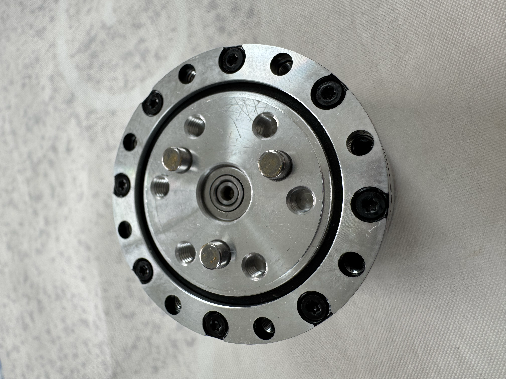
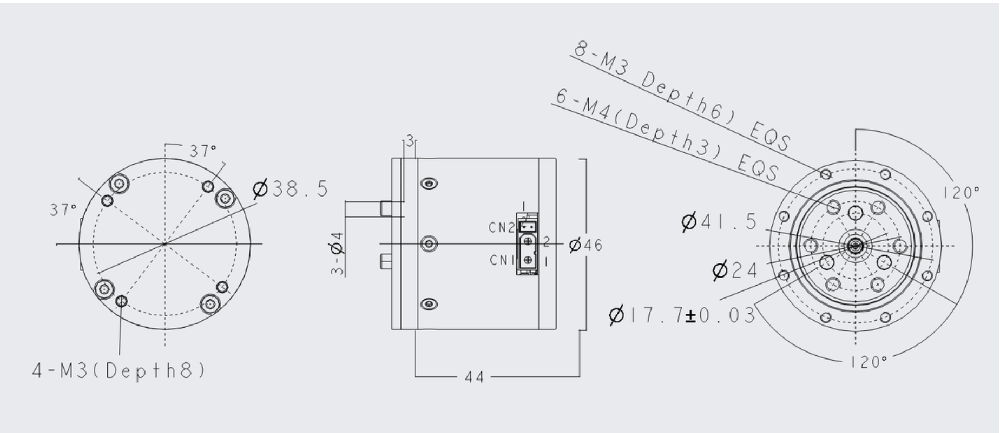
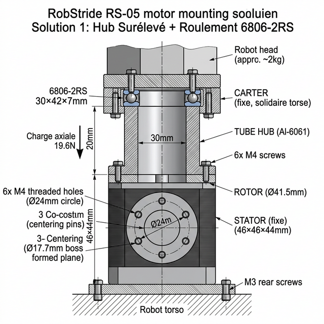
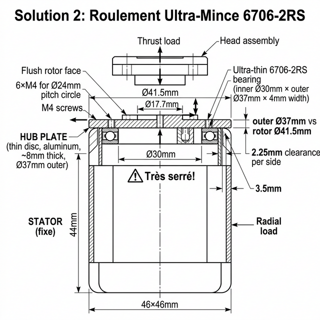
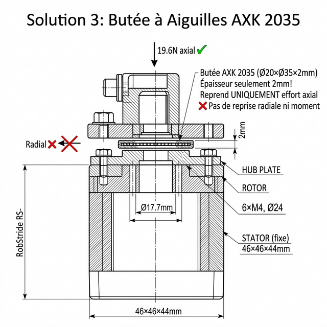
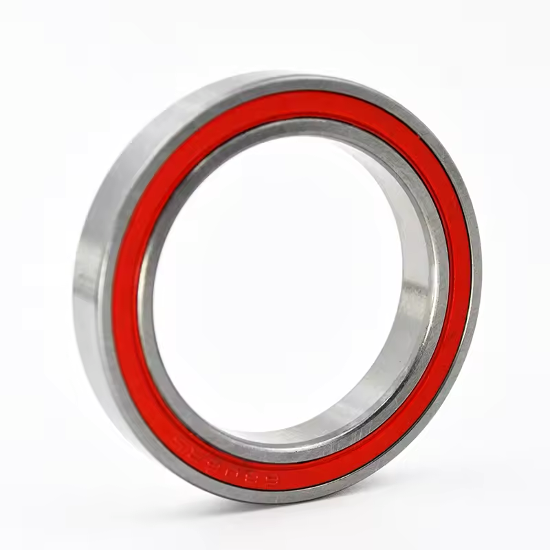
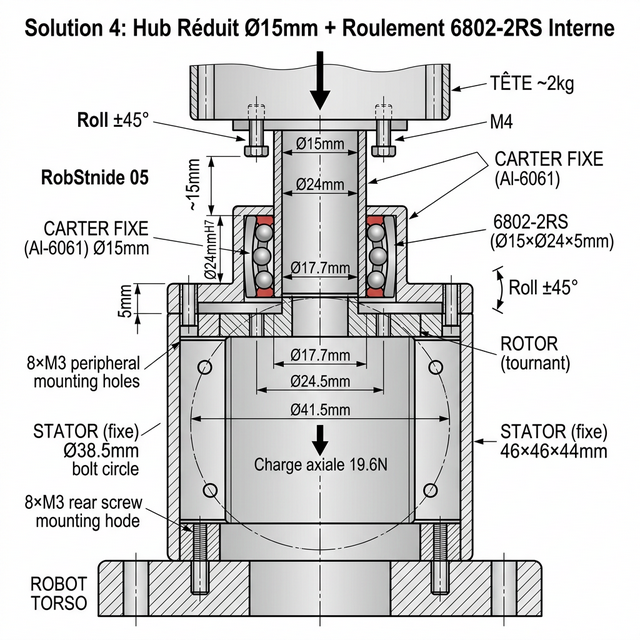

# 29 — Étude : Montage Vertical RS-05 pour le Roll de Tête (Cou)

Cette annexe détaille la conception du montage vertical d'un moteur **RobStride RS-05** destiné à piloter le **Roll** (inclinaison latérale) de la tête du D-Bot, avec un **roulement de support externe** pour délester le rotor des efforts axiaux et radiaux.

---

## 1. Contexte et Problématique

### 1.1 Cahier des Charges

| Paramètre | Valeur |
| :--- | :--- |
| **Moteur** | RobStride RS-05 (191g, 46×46×44mm) |
| **Couple pic** | 5.5 N.m |
| **Couple nominal** | 1.6 N.m |
| **Masse de la tête** | ~2 kg (structure + capteurs OAK-D Pro + électronique) |
| **Mouvement** | Roll (inclinaison latérale gauche/droite) |
| **Orientation moteur** | Vertical, stator fixé au torse, rotor vers le haut |
| **Amplitude souhaitée** | ±30° à ±45° |

### 1.2 Particularité Critique : Interface Rotor RS-05 (Pas de Sortie d'Arbre !)

> ⚠️ **Point fondamental** : À la différence de nombreux actionneurs, le RS-05 ne possède **aucun arbre de sortie saillant**. Le rotor est **affleurant avec le stator**, exposant uniquement une **face plane avec un plot de centrage** et des **trous filetés**.


*Vue photographique de la face supérieure du RS-05 avec ses 3 plots de centrage.*



### Interface du Rotor RS-05 (données plan officiel)

| Élément | Dimension |
| :--- | :--- |
| **Trous visserie STATOR (interface périphérique)** | **8× M3 Profondeur 6 mm** (EQS sur ø38.5mm) |
| **Trous visserie ROTOR (interface tournante)** | **6× M4 Profondeur 3 mm** (EQS sur ø24mm) + 3 plots |
| **Alésage central côté rotor** | ø24 mm |
| **Diamètre rotor** | ø41.5 mm |
| **Diamètre extérieur corps moteur** | ø46 mm |
| **Profondeur totale** | 44 mm |
| **Fixation stator (arrière)** | 4× M3 Profondeur 8 mm |

**Conséquence directe** : Il est **impossible** de monter un roulement directement sur un arbre de rotor (il n'existe pas). La solution doit être une **architecture flasque/moyeu** boulonnée sur la face du rotor, avec un roulement **annulaire** ou **thin-section** positionné autour de ce moyeu.

---

## 2. ⚠️ Conflit Géométrique : Pourquoi un Roulement Coplanaire ne Rentre PAS

### 2.1 Analyse Dimensionnelle du Problème

Le principe initial était de placer un roulement annulaire (type 6806-2RS) **dans le même plan** que la face du rotor, entre la zone de fixation du rotor (Ø24mm) et le bord du stator (Ø41.5mm). **Cette solution est physiquement impossible** en raison de l'espace radial insuffisant.

```
VUE DE DESSUS — CONFLIT GÉOMÉTRIQUE

         Corps stator (46×46 mm carré)
         ┌──────────────────────────────────────┐
         │                                      │
         │   8×M3 stator (Ø38.5mm)             │
         │      ○──○──○──○──○──○──○──○          │
         │                                      │
         │     ┌── Face Rotor Ø41.5mm ──┐       │
         │     │                        │       │
         │     │   Têtes vis M4 ≈ Ø31mm │       │
         │     │      ●  ●  ●           │       │
         │     │      ●  ●  ●           │       │
         │     │   6×M4 sur Ø24mm       │       │
         │     │   + boss Ø17.7mm       │       │
         │     │                        │       │
         │     └────────────────────────┘       │
         └──────────────────────────────────────┘

Espace radial disponible entre têtes vis M4 et bord rotor :
  (Ø41.5 − Ø31) / 2 = 5.25 mm par côté

Section du roulement 6806-2RS :
  (Ø42 − Ø30) / 2 = 6 mm par côté

→ 6 mm > 5.25 mm ⇒ LE ROULEMENT NE RENTRE PAS ! ❌
```

### 2.2 Détail des Cotes Critiques

| Élément | Diamètre | Source |
| :--- | :--- | :--- |
| Boss centrage rotor | Ø17.7 mm | Plan officiel |
| Cercle perçage M4 (rotor) | **Ø24 mm** | Plan officiel |
| Limite extérieure têtes vis M4 (≈Ø7mm) | ≈ **Ø31 mm** | Calcul |
| Cercle perçage M3 (stator) | Ø38.5 mm | Plan officiel |
| Face du rotor | **Ø41.5 mm** | Plan officiel |
| Corps stator (carré) | 46 × 46 mm | Plan officiel |
| **Roulement 6806-2RS — bague int.** | **Ø30 mm** | Catalogue |
| **Roulement 6806-2RS — bague ext.** | **Ø42 mm** | Catalogue |

> 🔴 **Conclusion** : Le roulement 6806-2RS (Ø42 ext.) **dépasse le diamètre du rotor** (Ø41.5 mm). Il n'y a aucune surface fixe (stator) pour accueillir un carter à ce diamètre dans le même plan. **La solution coplanaire est abandonnée.**

---

## 3. Trois Solutions Viables

### 3.1 Solution 1 — Hub Surélevé + Roulement 6806-2RS ⭐ RECOMMANDÉE

Au lieu de coincer le roulement dans l'espace minuscule entre rotor et stator, on **empile** le roulement **au-dessus** du moteur, sur un étage séparé.



**Principe :**

Un **tube-hub cylindrique** (Al-6061) se visse sur le rotor (6×M4, Ø24mm) et **s'élève verticalement** de 15-20 mm au-dessus du plan du stator. À cette hauteur, il n'y a plus de conflit géométrique : le roulement peut avoir n'importe quel diamètre. Le carter fixe (qui tient la bague extérieure) se fixe au torse du robot, indépendamment du stator.

```
   ┌─────────────────────────┐
   │     TÊTE (~2 kg)        │
   └──────────┬──────────────┘
              │ (vis M4)
   ╔══════════╧══════════════╗
   ║   BAGUE EXT. (fixe)    ║ ← Fixée au CARTER (solidaire du torse)
   ║  ┌──────────────────┐  ║
   ║  │   ROULEMENT      │  ║ ← 6806-2RS : Ø30×Ø42×7mm
   ║  └──────────────────┘  ║    (n'importe quel diamètre ici !)
   ║   BAGUE INT. (tourne)  ║ ← Solidaire du TUBE HUB
   ╚══════════╤══════════════╝
              │
   ┌──────────┴──────────────┐
   │   TUBE HUB (Al 6061)   │ ← Cylindre creux, Ø ext ~30mm
   │   Hauteur ~15-20mm     │    Centré sur boss Ø17.7mm
   │   Vissé 6×M4 au rotor  │    S'élève AU-DESSUS du stator
   └──────────┬──────────────┘
              │
   ┌──────────┴──────────────┐
   │   ROTOR (Ø24mm M4)     │ ← Face affleurante du RS-05
   │   STATOR (Ø41.5mm)     │
   │   Corps 46×46×44mm     │
   └──────────┬──────────────┘
              │ (4×M3 arrière → torse)
   ┌──────────┴──────────────┐
   │      TORSE ROBOT        │
   └─────────────────────────┘
```

| Paramètre | Valeur |
| :--- | :--- |
| **Tube Hub** | Al 6061, Ø ext 30mm, hauteur 15-20mm, centrage Ø17.7mm + 3 plots, fixation 6×M4 |
| **Roulement** | 6806-2RS (Ø30×Ø42×7mm) |
| **Carter fixe** | Al 6061 ou PA12-CF, alésage Ø42mm H7, fixé au torse |
| **Surcoût hauteur** | +15-20 mm au-dessus du moteur |
| **Charge axiale** | ✅ 560 N (largement suffisant pour 19.6 N) |
| **Charge radiale** | ✅ 4.6 kN |
| **Reprise de moment** | ✅ Bon |
| **Coût** | ~8 € (roulement + usinage maison) |

> ✅ **Avantage majeur** : Aucune contrainte de diamètre — le roulement standard 6806-2RS reprend **tous les efforts** (axial, radial, moment). Solution robuste et éprouvée.

---

### 3.2 Solution 2 — Roulement Ultra-Mince 6706-2RS (Coplanaire)

Si l'on souhaite absolument **minimiser la hauteur** du montage, il existe des roulements à **section extraordinairement fine** (série 6700) qui peuvent se glisser entre le rotor et le stator.



**Principe :**

Le roulement **6706-2RS** (Ø30 × Ø37 × 4mm) a une section de seulement **3.5 mm**. Avec un Ø extérieur de 37 mm, il reste **à l'intérieur** du rotor (Ø41.5mm), laissant ~2.25 mm par côté pour un carter de précision.

| Référence | Ø int | Ø ext | Section | Largeur |
| :--- | :--- | :--- | :--- | :--- |
| **6706-2RS** | 30 mm | **37 mm** | **3.5 mm** | 4 mm |
| 6806-2RS (référence) | 30 mm | 42 mm | 6 mm | 7 mm |

| Paramètre | Valeur |
| :--- | :--- |
| **Hub** | Al 6061, Ø ext 30mm, épaisseur ~8mm, épaulement Ø30 pour bague int. |
| **Roulement** | 6706-2RS (Ø30×Ø37×4mm) |
| **Carter fixe** | Usinage de précision — épaisseur paroi ≈ 2.25mm seulement ! |
| **Surcoût hauteur** | +4 mm seulement |
| **Charge axiale** | ⚠️ ~200 N (suffisant pour 19.6 N mais faible marge) |
| **Charge radiale** | ⚠️ ~1-2 kN (faible) |
| **Reprise de moment** | ⚠️ Limitée (section très mince) |
| **Coût** | ~5 € |

> ⚠️ **Attention** : Le carter doit être usiné avec une **tolérance très serrée** (paroi de 2.25mm). Cette solution est faisable mais exigeante en précision d'usinage et offre moins de marge mécanique.

---

### 3.3 Solution 3 — Butée à Aiguilles AXK 2035 (Axial Uniquement)

Pour ne reprendre que **la charge axiale** (le poids de la tête = 19.6 N), une **butée à aiguilles plate** est extrêmement mince et se glisse comme une rondelle entre le hub et un support fixe.



**Principe :**

La butée AXK 2035 (Ø20 × Ø35 × **2 mm**) s'insère directement entre le hub rotatif et une rondelle de pression fixe, sans aucun problème d'encombrement radial. Le Ø extérieur de 35 mm reste largement dans l'enveloppe du rotor (Ø41.5mm).

| Référence | Ø int | Ø ext | Épaisseur | Charge axiale stat. |
| :--- | :--- | :--- | :--- | :--- |
| **AXK 2035** | 20 mm | **35 mm** | **2 mm** | ~10 kN |
| AXK 2542 | 25 mm | 42 mm | 2 mm | ~15 kN |

| Paramètre | Valeur |
| :--- | :--- |
| **Hub** | Al 6061, Ø ext 35mm, épaisseur ~6mm |
| **Butée** | AXK 2035 (Ø20×Ø35×2mm) + 2 rondelles AS (AS 2035) |
| **Surcoût hauteur** | +2 mm seulement ! |
| **Charge axiale** | ✅✅ ~10 kN (excellent, ×500 la charge requise) |
| **Charge radiale** | ❌ Zéro — ne reprend pas les efforts latéraux |
| **Reprise de moment** | ❌ Zéro — ne reprend pas le basculement |
| **Coût** | ~3 € |

> ⚠️ **Limitation majeure** : La butée à aiguilles ne reprend **que l'effort axial** (poids vertical de la tête). Les charges radiales et les moments de basculement restent entièrement supportés par les roulements internes du RS-05. Cette solution est viable car la charge est faible (2 kg), mais elle n'offre **aucune protection** contre les chocs latéraux.

---

### 3.4 Solution 4 — Hub Réduit Ø15mm + Roulement 6802-2RS Interne ⭐⭐ NOUVELLE RECOMMANDATION

L'idée clé : **réduire le diamètre du tube-hub** de sorte que le roulement entier (bague intérieure + bague extérieure) **rentre à l'intérieur de l'enveloppe du stator** (Ø41.5mm). La bague extérieure du roulement est emmanchée dans un carter fixe posé sur le stator. Plus aucun conflit de diamètre, et **aucune surélévation excessive** nécessaire.


*Roulement 6802-2RS : noter les bagues intérieure et extérieure verticales (cylindres concentriques), avec joints 2RS (rouge).*



**Principe :**

Un **tube-hub fin** (Al-6061, Ø extérieur ≈ 15mm) se visse sur le rotor (6×M4 sur Ø24mm — via une bride ou une pièce d'adaptation) et s'élève de ~10-15 mm. Sur ce tube-hub, on emmanche la **bague intérieure** du roulement 6802-2RS. La **bague extérieure** (Ø24mm) est quant à elle emmanchée en H7 dans un **carter fixe** (bague-tube en aluminium) posé à l'aplomb du stator et fixé au torse.

Le Ø extérieur du roulement (24 mm) est **bien inférieur** au diamètre du rotor (41.5 mm), laissant ≈ **8.75 mm de marge par côté**. L'encombrement est minimal.

```
VUE EN COUPE — SOLUTION 4 : HUB RÉDUIT + 6802-2RS INTERNE

   ┌─────────────────────────┐
   │     TÊTE (~2 kg)        │
   └──────────┬──────────────┘
              │ (vis M4)
   ┌──────────┴──────────────┐
   │   BRIDE SUPÉRIEURE      │ ← Fixation tête → hub
   └──────────┬──────────────┘
        ┌─────┴─────┐
        │ CARTER    │ ← Al-6061, alésage Ø24mm H7
        │ FIXE      │    fixé au torse/stator
        │ (bague    │
        │  ext.     │ ← Bague ext. Ø24mm (FIXE)
        │  Ø24mm)   │
        │ ┌───────┐ │
        │ │6802-2R│ │ ← Roulement : bagues VERTICALES
        │ │ billes│ │    concentriques (comme sur la photo)
        │ │ Ø15×  │ │    Ø15 int × Ø24 ext × 5mm larg.
        │ │ Ø24×  │ │
        │ │ 5mm   │ │
        │ └───────┘ │
        │  (bague   │ ← Bague int. Ø15mm (TOURNE)
        │   int.    │
        │   Ø15mm)  │
   Circlip► ═ ═ ═ ═ ═ ◄ Circlip de retenue haute (E15)
        └─────┬─────┘
        ┌─────┴─────┐
Épaulement► ┌─┴─┐   │ ← ÉPAULEMENT de retenue basse (butée)
        │   │   │   │    Le diamètre passe de Ø15 à ~Ø17mm
        │ TUBE HUB  │ ← Al-6061, Ø ext principal 15mm
        │ Ø15/17mm  │    Vissé au rotor (6×M4 via bride)
        └─────┬─────┘

> ⚠️ **Détail critique (Retenue Axiale)** : Le tube-hub ne doit pas être un simple cylindre lisse de 15mm. Il **doit** comporter un **épaulement** (passage de Ø15mm à ~Ø17mm à la base) pour servir de butée basse à la bague intérieure du roulement. Sans cet épaulement, la bague glisserait vers le bas sous l'effet du poids de la tête (19.6 N). Une gorge pour un **circlip E15** au-dessus du roulement assure la retenue vers le haut.
   ┌──────────┴──────────────┐
   │   ROTOR (Ø41.5mm)       │ ← 6×M4 sur Ø24mm + 3 plots
   │   ┌─────────────────┐   │
   │   │  boss Ø17.7mm   │   │    ← Centrage
   │   └─────────────────┘   │
   │   STATOR (46×46×44mm)   │ ← 8×M3 périphérique + 4×M3 arrière
   └──────────┬──────────────┘
              │ (4×M3 arrière)
   ┌──────────┴──────────────┐
   │      TORSE ROBOT        │
   └─────────────────────────┘

   Ø24mm (roulement ext.) << Ø41.5mm (rotor)
   → RENTRE LARGEMENT ! ✅✅
```

#### Tailles de Roulements (Série 6800 Thin-Section)

Cette série est idéale en robotique pour son faible encombrement radial. Voici pourquoi le **6802** est le meilleur candidat pour s'insérer dans l'enveloppe du RS-05 (Ø41.5mm) :

| Référence | Ø Intérieur (Hub) | Ø Extérieur (Carter) | Largeur | Capacité Rad. estimée | Compatibilité avec RS-05 (Ø41.5mm) |
| :---: | :---: | :---: | :---: | :--- | :--- |
| **6802-2RS** | **15 mm** | **24 mm** | **5 mm** | ~1.6 kN | ⭐ **Recommandé** (Marge de 8.75mm par côté) |
| **6803-2RS** | **17 mm** | **26 mm** | **5 mm** | ~1.7 kN | ✅ Excellent aussi (Hub Ø17, carter Ø26) |
| **6804-2RS** | **20 mm** | **32 mm** | **7 mm** | ~3.0 kN | ✅ Option robuste (Hub Ø20, carter Ø32) |
| **6805-2RS** | **25 mm** | **37 mm** | **7 mm** | ~3.2 kN | ⚠️ Limite (Carter Ø37 + paroi fine) |
| **6806-2RS** | **30 mm** | **42 mm** | **7 mm** | ~4.6 kN | ❌ Trop grand (Dépasse le moteur de 0.5mm) |

| Paramètre | Valeur |
| :--- | :--- |
| **Tube Hub** | Al 6061, Ø ext 15mm (ou 20mm), hauteur ~10-15mm, centrage Ø17.7mm, fixation 6×M4 via bride |
| **Roulement** | 6802-2RS (Ø15×Ø24×5mm) ou 6804-2RS (Ø20×Ø32×7mm) |
| **Carter fixe** | Al 6061, alésage Ø24mm (ou Ø32mm) en H7, fixé au torse |
| **Surcoût hauteur** | +10-15 mm (moins que la Solution 1) |
| **Charge axiale** | ✅ ~320 N pour 6802 (×16 la charge requise de 19.6 N) |
| **Charge radiale** | ✅ ~1.6 kN pour 6802 (×80 la charge requise) |
| **Reprise de moment** | ✅ Bon (roulement radial standard) |
| **Coût** | ~3-5 € |

> ✅✅ **Avantage majeur** : Le roulement s'insère **à l'intérieur de l'enveloppe du moteur** avec une large marge (Ø24mm << Ø41.5mm). Le carter fixe se pose simplement sur le stator. L'usinage du carter est trivial (un simple alésage Ø24mm H7). C'est la solution la plus **élégante, compacte et simple à réaliser**.

---

## 4. Comparatif des 4 Solutions

| Critère | Sol. 1 : Hub Surélevé 6806 | Sol. 2 : Ultra-Mince 6706 | Sol. 3 : Butée AXK 2035 | Sol. 4 : Hub Réduit 6802 ⭐ |
| :--- | :---: | :---: | :---: | :---: |
| **Faisabilité** | ✅ Bonne | ⚠️ Très serré | ✅ Simple | ✅✅ Excellente |
| **Charge axiale** | ✅ 560 N | ⚠️ ~200 N | ✅✅ ~10 kN | ✅ 320 N |
| **Charge radiale** | ✅ 4.6 kN | ⚠️ ~1 kN | ❌ Zéro | ✅ 1.6 kN |
| **Moment (tilt)** | ✅ Bon | ⚠️ Faible | ❌ Zéro | ✅ Bon |
| **Surcoût hauteur** | ⚠️ +15-20 mm | ✅ +4 mm | ✅✅ +2 mm | ✅ +10-15 mm |
| **Complexité usinage** | 🟡 Tube + carter ext. | 🔴 Carter très précis | 🟢 Très simple | 🟢 Simple (alésage Ø24) |
| **Coût** | ~8 € | ~5 € | ~3 € | ~3-5 € |
| **Encombrement radial** | ⚠️ Dépasse le stator | ⚠️ Limite | ✅ Compact | ✅✅ Très compact |

> **⭐ Recommandation finale : Solution 4 (Hub Réduit Ø15mm + 6802-2RS)** — La plus **élégante et réaliste**. Le roulement rentre largement dans l'enveloppe du moteur. L'usinage est simple (tube Ø15mm + carter avec alésage Ø24mm). Elle reprend **tous les efforts** (axial, radial, moment) avec un roulement standard à ~3€.
>
> La Solution 3 (butée à aiguilles) reste un **excellent complément** à ajouter sous le tube-hub pour une double sécurité axiale.

---

## 5. Séquence de Montage (Solution 4 Recommandée)

```
SÉQUENCE DE MONTAGE — SOLUTION 4 : HUB RÉDUIT Ø15mm + 6802-2RS

1. [PRÉPARATION À LA PRESSE] Emmancher la bague extérieure du 6802-2RS 
   dans le CARTER FIXE (emmanchement serré Ø24mm H7/r6). 
   ⚠️ Appliquer l'effort uniquement sur la bague extérieure.
        ↓
2. Fixer le STATOR RS-05 au torse (4× M3 arrière)
        ↓
3. Assembler la BRIDE D'ADAPTATION + TUBE HUB (Ø15/17mm)
   sur la face du rotor RS-05 :
   - Centrage ø17.7mm boss rotor + alignement 3 plots
   - Serrer 6× vis M4 à couple approprié (~1.5 N.m)
        ↓
4. Installer le sous-ensemble [CARTER + ROULEMENT] par le dessus :
   - La bague intérieure s'emmanche sur le Ø15mm du tube hub jusqu'à 
     l'épaulement butée (emmanchement juste / tournant Ø15mm H7/k6)
   - Fixer le carter solidairement à la structure fixe du robot
        ↓
5. Insérer le CIRCLIP E15 dans sa gorge sur le tube hub (juste au-dessus
   du roulement) pour assurer la retenue axiale complète.
        ↓
6. Fixer la structure de la tête sur le dessus du tube hub (4× M4)
        ↓
✅ VÉRIFICATION : La tête doit tourner librement en Roll
   sans jeu axial perceptible. Le roulement reprend le poids
   de la tête, protégeant ainsi le moteur.
```

---

## 6. Vérification du Couple Nécessaire

### 6.1 Couple Gravitationnel pour le Roll

```
G_roll = m × g × L × sin(θ)

  m = 2 kg (masse tête)
  g = 9.81 m/s²
  L = 0.05 m (bras de levier Centre de gravité → axe)
  θ = 45° (inclinaison maximale)

G_roll = 2 × 9.81 × 0.05 × sin(45°) ≈ 0.69 N.m
```

### 6.2 Marge RS-05

| Paramètre | Valeur |
| :--- | :--- |
| **Couple gravitationnel max** | 0.69 N.m (à 45°) |
| **Couple nominal RS-05** | 1.6 N.m |
| **Couple pic RS-05** | 5.5 N.m |
| **Marge nominale** | ×2.3 ✅ |
| **Marge pic** | ×8 ✅ |

---

## 7. BOM — Récapitulatif Achat (Solution 4 — Recommandée)

| Composant | Référence | Qté | Prix Unit. | Fournisseur |
| :--- | :--- | :---: | :---: | :--- |
| Roulement radial étanche | **6802-2RS** (Ø15×Ø24×5mm) | 1 | ~2-4 € | SKF, NSK, Amazon |
| Tube Hub | Alu 6061 Ø15 × 10-15mm hauteur (CNC) | 1 | Usinage maison | Stock alu |
| Carter fixe (bague) | Alu 6061, alésage Ø24mm H7 (CNC) | 1 | Usinage maison | Stock alu |
| Bride d'adaptation | Alu 6061 (fixation 6×M4 → tube Ø15) | 1 | Usinage maison | Stock alu |
| Visserie | 6× M4×8 CHC (fixation bride→rotor) | 1 | ~0.50 € | Visserie standard |
| Visserie | 4× M4 (fixation tête→hub) | 1 | ~0.50 € | Visserie standard |

**Coût total ajouté** : **< 10 €** pour une solution compacte, robuste et professionnelle.

---

## 8. Assurer la Concentricité des Axes (Rotor vs Stator)

Une contrainte majeure de ce montage hyperstatique est de s'assurer que l'axe de la bague intérieure (liée au rotor) et l'axe de la bague extérieure (liée au carter fixe/stator) sont **parfaitement alignés**. Tout désalignement obligerait le moteur à "forcer" sur le roulement à chaque rotation, entraînant usure, vibrations et surconsommation.

On ne s'en remet jamais au hasard. L'alignement est obtenu en combinant un **usinage strict (côté rotor)** et une stratégie **d'auto-centrage au serrage (côté stator)**.

### 8.1 Côté Rotor : Concentricité par usinage CNC (Bague intérieure)
La concentricité de la bague intérieure est garantie par la **pièce elle-même** (le Tube-Hub).
- **Référence native** : Le RS-05 possède un bossage mécanique usiné de **Ø17.7 mm** spécifiquement conçu par RobStride pour offrir un centrage physique parfait (les vis ne servant qu'à serrer).
- **Usinage en une passe** : Le Tube-Hub doit être usiné à la CNC en **une seule prise (même posage)** : l'alésage de centrage (Ø17.7mm H7) et le diamètre extérieur recevant le roulement (Ø15mm k6) partagent ainsi strictement le même axe de révolution.
- **Résultat** : Une fois le hub posé sur le bossage du RS-05, la bague intérieure du roulement tourne *parfaitement rond* sans faux-rond.

### 8.2 Côté Stator : Auto-centrage au montage (Bague extérieure)
C'est ici qu'intervient l'astuce mécanique : on n'essaie pas d'usiner un carter parfait qui viendrait s'emboîter sur le carré extérieur du stator. On utilise **le roulement lui-même comme gabarit d'alignement** lors du montage.

1. **Jeux de fixation** : Le carter fixe est percé pour être vissé sur le torse du robot (ex: trous de passage pour vis M3). Ces trous ne doivent pas être de Ø3.0mm justes, mais **légèrement surdimensionnés** (ex: Ø3.5 mm) pour offrir un "flottement" de quelques dixièmes de millimètres.
2. **Assemblage à blanc** : Le roulement (préalablement pressé dans le carter) est glissé sur le tube-hub. À cet instant, les vis du carter au torse sont insérées mais **non serrées**.
3. **L'Auto-alignement** : Le roulement 6802-2RS est une pièce de précision. Ses deux bagues sont parfaitement concentriques. C'est le roulement lui-même qui va "pousser" le carter flottant dans la position idéale.
4. On fait faire quelques tours au moteur à la main : le système se "détend" de toute contrainte radiale.
5. **Serrage final** : On bloque enfin les vis du carter au couple. Le carter est immuablement figé dans sa position parfaitement concentrique.

---

## 9. Conclusion

> **⭐ Le montage avec roulement de support est fortement recommandé, avec l'architecture HUB RÉDUIT Ø15mm + roulement 6802-2RS interne (Solution 4).**
>
> L'analyse dimensionnelle a révélé un **conflit géométrique critique** : l'espace radial disponible entre le cercle de vis M4 du rotor (Ø24mm) et le bord du stator (Ø41.5mm) est trop étroit (5.25 mm) pour accueillir un roulement 6806-2RS (section 6 mm) dans le même plan. **Un montage coplanaire avec un 6806-2RS est impossible.**
>
> La solution retenue consiste à **réduire le diamètre du tube-hub** (Ø15mm) de sorte que le roulement 6802-2RS (Ø15×Ø24×5mm) rentre **entièrement dans l'enveloppe du moteur** (Ø24mm << Ø41.5mm). La bague extérieure est emmanchée dans un carter fixe solidaire du torse. L'ensemble reprend **100% des charges statiques** (poids de la tête de 2 kg, moments de basculement) avec un roulement standard à ~3€.
>
> Le RS-05 ne fournit alors que le **couple de Roll pur** (0.69 N.m max vs 1.6 N.m nominal), avec une marge confortable de ×2.3.
>
> Les 8× M3 périphériques du moteur appartiennent au **stator** et servent uniquement à fixer le moteur au torse. Le stator ne peut être fixé que par l'**arrière** (4× M3).

---

## 10. Préparation URDF — Naming et Axes (Fusion 360)

Cette section détaille les conventions de nommage et d'orientation à respecter dans Fusion 360 pour permettre un export URDF propre du sous-assemblage du cou.

### 10.1 Convention d'Axes : Fusion 360 vs URDF

Fusion 360 (en mode **Z-up**, réglable dans *Préférences → Conception → Orientation de modélisation par défaut*) utilise les axes suivants :

```
FUSION 360 (Z-up)              URDF (REP 103)
                                
     Z (haut)                       Z (haut)
     │                              │
     │   Y (arrière)                │   X (avant / regard)
     │  /                           │  /
     │ /                            │ /
     └──── X (droite)               └──── Y (gauche)
```

> 📐 **Règle d'or** : Dans Fusion 360, orientez votre robot pour qu'il **regarde vers X+** (vers la droite quand vous regardez la face "AVANT" du ViewCube). Ainsi, lors de l'export URDF, l'axe X de Fusion correspondra directement à l'axe X de URDF (direction du regard).

| Axe Fusion 360 | Direction physique | Axe URDF | Mouvement du cou |
| :---: | :--- | :---: | :--- |
| **Z+** | Vers le haut (ciel) | **Z+** | Axe du **Yaw** (Pan) : tourner la tête gauche/droite |
| **X+** | Vers la droite → **direction du regard du robot** | **X+** | Axe du **Roll** : pencher la tête oreille→épaule |
| **Y+** | Vers l'arrière | **-Y** | Axe du **Pitch** (Tilt) : hocher la tête oui/non |

### 10.2 Renommage des Pièces Fusion 360 → URDF

En URDF, chaque « pièce rigide » s'appelle un **link**, et chaque articulation un **joint**. Les pièces qui ne bougent pas l'une par rapport à l'autre doivent être **fusionnées en un seul link** (ou reliées par un joint de type `fixed`).

#### Règles de nommage URDF

1. **Tout en `snake_case`** (minuscules + underscores) : `neck_roll_link`, pas `NeckRollLink`
2. **Préfixer par la zone du corps** : `neck_`, `head_`, `torso_`
3. **Suffixer les links par `_link`** et les joints par `_joint`**
4. **Pas de numéros de version** : `neck_roll_motor`, pas `robstride05 v1:2`
5. **Pas de caractères spéciaux** : ni tirets `-`, ni accents, ni espaces, ni points

#### Tableau de correspondance (assemblage actuel "Neck v28")

Voici le mapping entre vos noms actuels dans Fusion 360 et les noms URDF recommandés :

| Nom actuel Fusion 360 | Rôle mécanique | Nom URDF (Link) | Remarque |
| :--- | :--- | :--- | :--- |
| `robstride05 v1:1` | Moteur Pan (Yaw) | `neck_yaw_motor` | Fusionné dans `neck_yaw_link` |
| `U-Pan v15:1` | Bracket en U (Pan→Tilt) | `neck_yaw_bracket` | Fusionné dans `neck_yaw_link` |
| `Tilt v14:1` | Bracket du Tilt (Pitch) | `neck_pitch_bracket` | = `neck_pitch_link` |
| `robstride05 v1:2` | Moteur Roll | `neck_roll_motor` | Fusionné dans `neck_roll_link` |
| `6082Z v1:1` | Carter alu / entretoise | `neck_roll_housing` | Fusionné dans `neck_roll_link` |
| `6804_2rs v1:1` | Roulement 6804-2RS | `neck_roll_bearing` | Joint `fixed` vers `neck_roll_link` |

> 💡 **"Fusionné" signifie** : dans l'URDF, ces pièces font partie du **même link** (même corps rigide). Par exemple, le moteur Pan (`robstride05 v1:1`) et le bracket U-Pan (`U-Pan v15:1`) bougent ensemble → ils forment un seul link appelé `neck_yaw_link`. On ne crée **pas** de joint entre eux.

#### Résumé des Links URDF à créer

| Link URDF | Pièces Fusion fusionnées dedans | Description |
| :--- | :--- | :--- |
| `torso_link` | Structure du torse (existant) | Point d'ancrage fixe |
| `neck_yaw_link` | `robstride05 v1:1` + `U-Pan v15:1` | Ensemble qui tourne en Yaw (gauche/droite) |
| `neck_pitch_link` | `Tilt v14:1` | Bracket articulé en Pitch (oui/non) |
| `neck_roll_link` | `robstride05 v1:2` + `6082Z v1:1` + `6804_2rs v1:1` | Ensemble qui tourne en Roll (oreille→épaule) |
| `head_link` | Crâne, capteurs, boîtier électronique | La tête elle-même |

### 10.3 Chaîne Cinématique URDF du Cou

Voici l'arbre parent-enfant complet à définir dans l'URDF :

```
torso_link
  │
  └── neck_yaw_joint (type: revolute, axe: Z)
        │
        └── neck_yaw_link   ← [robstride05 v1:1 + U-Pan bracket]
              │
              └── neck_pitch_joint (type: revolute, axe: Y)
                    │
                    └── neck_pitch_link   ← [Tilt bracket]
                          │
                          └── neck_roll_joint (type: revolute, axe: X)
                                │
                                └── neck_roll_link   ← [robstride05 v1:2 + carter + roulement]
                                      │
                                      └── head_fixed_joint (type: fixed)
                                            │
                                            └── head_link   ← [tête + capteurs]
```

### 10.4 Définition des Joints (DOF)

Chaque joint `revolute` doit spécifier son **axe de rotation**, ses **limites angulaires**, et son **effort maximal** :

| Joint URDF | Type | Axe | Limites (rad) | Limites (deg) | Effort max (N.m) | Vitesse max (rad/s) |
| :--- | :---: | :---: | :---: | :---: | :---: | :---: |
| `neck_yaw_joint` | revolute | `0 0 1` (Z) | [-1.57, 1.57] | ±90° | 5.5 | 6.28 |
| `neck_pitch_joint` | revolute | `0 1 0` (Y) | [-0.79, 0.79] | ±45° | 5.5 | 6.28 |
| `neck_roll_joint` | revolute | `1 0 0` (X) | [-0.79, 0.79] | ±45° | 5.5 | 6.28 |

> ⚠️ **Les axes `0 0 1`, `0 1 0` et `1 0 0`** sont les directions dans le référentiel du link **parent**. Vérifiez après export que chaque axe correspond bien au mouvement attendu. Si un mouvement est inversé, changez le signe (ex: `0 0 -1`).

### 10.5 Workflow d'Export Fusion 360 → URDF

1. **Renommer les pièces** dans Fusion 360 selon le tableau de la section 10.2 (clic droit → Renommer dans le navigateur)
2. **Vérifier l'orientation** : Vue de dessus (face HAUT du ViewCube) → le robot regarde vers X+
3. **Définir les joints** dans Fusion 360 (Assemblage → Joint) en mode revolute, avec les bons axes de rotation
4. **Installer le plugin** `fusion2urdf` (de Toshinori Kitamura) via le Fusion 360 App Store ou GitHub :
   ```
   https://github.com/syuntoku14/fusion2urdf
   ```
5. **Lancer l'export** : le plugin génère automatiquement :
   - Le fichier `.urdf` avec la chaîne cinématique
   - Les meshes `.stl` pour chaque link (collision + visual)
   - Un fichier `launch` pour RViz (visualisation)
6. **Vérifier dans RViz** : ouvrir le `.urdf` et tester les joints avec les sliders

### 10.6 Checklist Avant Export

- [ ] Toutes les pièces sont renommées en `snake_case` sans version ni caractères spéciaux
- [ ] Le robot regarde vers X+ (vue de dessus)
- [ ] Les pièces fixes entre elles sont marquées comme `Rigid Group` ou `fixed joint`
- [ ] Les 3 joints revolute (yaw, pitch, roll) sont définis avec les bons axes
- [ ] Les masses et matériaux sont assignés à chaque pièce (Fusion les exportera comme propriétés d'inertie)
- [ ] Les origines des joints sont positionnées au centre de rotation réel (axe du moteur RS-05)

### 10.7 Bonnes Pratiques : Conception vs Export (Méthode du "Bac à sable")

La CAO mécanique (paramétrique) et la topologie URDF (arborescence Links/Joints) ont des exigences contradictoires. Essayer de forcer une arborescence URDF parfaite dans le fichier de conception maître (tout en gardant l'historique et les liens externes) conduit souvent à des blocages ou des références circulaires dans Fusion 360.

**La méthode professionnelle consiste à séparer le Design de l'Export :**

#### 1. L'Espace de Conception (Le fichier de travail habituel)
*   **Historique** : Activé.
*   **Liens externes** : Autorisés et recommandés (importez les moteurs 🔗, créez des sous-assemblages).
*   **Structure** : Organisez vos dossiers comme c'est logique pour la conception et l'usinage. Ne vous souciez pas des "links" URDF ici.

#### 2. L'Espace d'Export URDF (Le fichier "Bac à sable")
Quand le design d'un membre (ex: le Cou) est figé, procédez ainsi pour créer un URDF propre sans casser votre CAO :
1.  Créez un **Nouveau Fichier Fusion** vide (ex: `EXPORT_URDF_NECK`).
2.  Insérez-y votre grand assemblage de conception "Neck" (il aura un maillon 🔗).
3.  Faites immédiatement un clic droit sur la racine et **Désactivez l'historique** (*Ne pas capturer l'historique de conception*).
4.  Faites un clic droit sur votre assemblage importé et cliquez sur **Rompre le lien (Break Link)**. Tous les composants deviennent 100% locaux.
5.  Créez vos dossiers URDF (ex: `torso_link`, `neck_yaw_link`, `neck_pitch_link`).
6.  Glissez librement toutes les pièces locales dans les bons dossiers URDF.
7.  Recréez vos **Liaisons (Joints)** propres entre ces dossiers.
8.  Lancez le plugin d'export.

> ✅ **Avantage** : Votre vraie CAO est protégée avec tout son historique. Si le design évolue, il suffit de refaire un fichier d'export "bac à sable" en 5 minutes. C'est la méthode de travail la plus saine et la plus utilisée en robotique.
