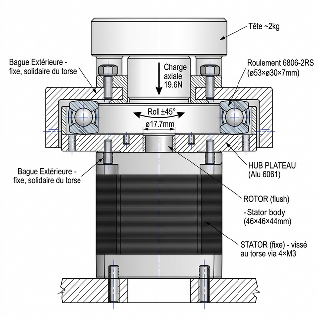

# 29 — Étude : Montage Vertical RS-05 pour le Roll de Tête (Cou)

Cette annexe détaille la conception du montage vertical d'un moteur **RobStride RS-05** destiné à piloter le **Roll** (inclinaison latérale) de la tête du D-Bot, avec un **roulement de support externe** pour délester le rotor des efforts axiaux et radiaux.

---

## 1. Contexte et Problématique

### 1.1 Cahier des Charges

| Paramètre | Valeur |
| :--- | :--- |
| **Moteur** | RobStride RS-05 (191g, 46×46×44mm) |
| **Couple pic** | 5.5 N.m |
| **Couple nominal** | 1.6 N.m |
| **Masse de la tête** | ~2 kg (structure + capteurs OAK-D Pro + électronique) |
| **Mouvement** | Roll (inclinaison latérale gauche/droite) |
| **Orientation moteur** | Vertical, stator fixé au torse, rotor vers le haut |
| **Amplitude souhaitée** | ±30° à ±45° |

### 1.2 Particularité Critique : Interface Rotor RS-05 (Pas de Sortie d'Arbre !)

> ⚠️ **Point fondamental** : À la différence de nombreux actionneurs, le RS-05 ne possède **aucun arbre de sortie saillant**. Le rotor est **affleurant avec le stator**, exposant uniquement une **face plane avec un plot de centrage** et des **trous filetés**.


*Vue photographique de la face supérieure du RS-05 avec ses 3 plots de centrage.*


### Interface du Rotor RS-05 (données plan officiel)

| Élément | Dimension |
| :--- | :--- |
| **Trous visserie STATOR (interface périphérique)** | **8× M3 Profondeur 6 mm** (EQS sur ø38.5mm) |
| **Trous visserie ROTOR (interface tournante)** | **6× M4 Profondeur 3 mm** (EQS sur ø24mm) + 3 plots |
| **Alésage central côté rotor** | ø24 mm |
| **Diamètre rotor** | ø41.5 mm |
| **Diamètre extérieur corps moteur** | ø46 mm |
| **Profondeur totale** | 44 mm |
| **Fixation stator (arrière)** | 4× M3 Profondeur 8 mm |

**Conséquence directe** : Il est **impossible** de monter un roulement directement sur un arbre de rotor (il n'existe pas). La solution doit être une **architecture flasque/moyeu** boulonnée sur la face du rotor, avec un roulement **annulaire** ou **thin-section** positionné autour de ce moyeu.

---

## 2. Solution Retenue : Moyeu Boulonné + Roulement Annulaire

### 2.1 Principe Général

Au lieu de poser un roulement sur un arbre (impossible ici), on crée une **pièce intermédiaire usinée (HUB)** qui :
1. Se **centre** sur le plot ø17.7mm du rotor.
2. S'aligne sur les **3 plots de centrage** et se **visse** sur les **6× M4** du rotor.
3. Dépasse latéralement pour recevoir la **bague intérieure d'un roulement annulaire**.
4. Porte la structure de la tête au-dessus.

Le roulement choisi est un **roulement à billes de petite section** (thin-section bearing) dont :
- La **bague intérieure** tourne avec le HUB (solidaire du rotor).
- La **bague extérieure** est maintenue fixe dans un carter annulaire solidaire du torse.

### 2.2 Schéma de Montage Corrigé



```
          SCHÉMA DE MONTAGE RS-05 — COU D-BOT (Roll)
          Montage vertical sans arbre saillant
          ============================================

                    ┌─────────────────┐
                    │    TÊTE ~2 kg   │  ← Structure, OAK-D Pro, électronique
                    └────────┬────────┘
                             │ (4× vis M4 dans le HUB)
              ╔══════════════╧═══════════════╗
              ║    HUB / FLASQUE ROTATIF      ║  ← Alu 6061 usiné CNC
              ║    (diamètre ext. : ~55 mm)   ║  ← Centrage : ø17.7mm + 3 plots
              ║    Vissé sur ROTOR : 6× M4    ║
              ╚══╤══════════════════════╤═════╝
                 │                      │
           ┌─────┴──────┐        ┌──────┴──────┐
           │  BAGUE INT. │        │  BAGUE INT.  │
           │  (tourne)   │        │  (tourne)    │
           │  ROULEMENT  │        │  ROULEMENT   │  ← 2 roulements (doublet)
           │  6806-2RS   │        │  6806-2RS    │     ou 1 roulement à 2 rangées
           │  BAGUE EXT. │        │  BAGUE EXT.  │
           │  (fixe)     │        │  (fixe)      │
           └─────┬──────┘        └──────┬────────┘
                 │                      │
          ╔══════╧══════════════════════╧══════╗
          ║   CARTER / LOGEMENT (fixe)          ║  ← Alu 6061/PA12-CF
          ║   Solidaire du torse du robot        ║  ← Maintient les bagues ext.
          ╚═════╤══════════════════════════╤════╝
                │      │          │        │
                │   ╔══╧══════════╧══╗     │
                │   ║                ║     │
                │   ║   RS-05        ║     │
                │   ║   ┌──────────┐ ║     │   ← Rotor AFFLEURANT
                │   ║   │ ROTOR    │ ║     │      (pas d'arbre saillant)
                │   ║   │ face     │ ║     │
                │   ║   │ 3 plots  │ ║     │
                │   ║   │ 6×M4     │ ║     │
                │   ║   └──────────┘ ║     │
                │   ║   STATOR       ║     │
                │   ║   (moteur)     ║     │
                │   ╚════════════════╝     │
                │          │               │
                └──────────┼───────────────┘
                  (4× M3 ou passage vis dans stator → torse)
```

### 2.3 Flux des Efforts — Montage Corrigé

```
    TÊTE (~2kg)
       │
       │ Charge axiale : 19.6 N (gravité)
       │ Couple de Roll : ≤ 0.7 N.m
       │
    ┌──┴──────────────────────────────────┐
    │         HUB FLASQUE                 │
    │         (Alu 6061 rotatif)          │
    └────────────┬──────────┬─────────────┘
                 │          │
    (Couple Roll)│          │(Charge Axiale + Radiale)
                 │          │
          ╔══════╧══╗ ╔═════╧══════════╗
          ║ ROTOR   ║ ║  ROULEMENT     ║
          ║ RS-05   ║ ║  6806-2RS      ║
          ║ (génère ║ ║                ║
          ║  couple)║ ║ Absorbe:       ║
          ╚═════════╝ ║ • Axial 19.6N  ║
                      ║ • Radial ~10N  ║
                      ║ • Moment flex  ║
                      ╚═══════╤════════╝
                               │
                    ╔══════════╧════════════╗
                    ║    CARTER FIXE        ║
                    ║    (Torse D-Bot)      ║
                    ╚═══════════════════════╝
```

---

## 3. Définition des Pièces Mécaniques

### 3.1 Pièce 1 : Le HUB (Moyeu Flasque)

C'est la pièce **centrale** du montage. Elle est à usiner en **Aluminium 6061** sur la CNC C500.

| Paramètre | Valeur |
| :--- | :--- |
| **Matériau** | Aluminium 6061-T6 |
| **Diamètre extérieur** | ~52 mm (diamètre intérieur roulement choisi) |
| **Épaisseur totale** | ~12 mm |
| **Alésage de centrage** | ø17.7 mm (H7) + 3 trous pour les plots de centrage |
| **Trous de fixation rotor** | 6× M4 traversants (couronne ø24mm) |
| **Trous de fixation tête** | 4× M4 en couronne supérieure |
| **Épaulement pour bague int.** | Ø52 × 2mm de profondeur pour caler la bague intérieure |

```
VUE DU HUB (dessus et coupe)

          ╔═══════════════════════╗
          ║   ●  ●  ●  ●  ●  ●    ║  ← 6× M4 pour fixer au rotor (ø24mm) + 3 trous plots
          ║                       ║
          ║    ┌──────────┐       ║
          ║    │ Alésage  │       ║  ← ø17.7mm H7 (centrage sur boss rotor)
          ║    │  ø17.7   │       ║
          ║    └──────────┘       ║
          ║                       ║
          ╚═══════════════════════╝
              │←——  ø52mm  ——→│
              │                │
           Épaulement ø52mm pour
           recevoir la bague int.
           du roulement 6806-2RS
```

### 3.2 Pièce 2 : Le Roulement — 6806-2RS

| Paramètre | Valeur |
| :--- | :--- |
| **Désignation** | **6806-2RS** (ou 61806-2RS selon fabricant) |
| **Diamètre intérieur** | **30 mm** |
| **Diamètre extérieur** | **42 mm** |
| **Largeur** | **7 mm** |
| **Capacité de charge dynamique (C)** | ~4.6 kN (radiale) |
| **Capacité de charge statique (C₀)** | ~2.8 kN (radiale) |
| **Charge axiale admissible** | ~560 N (20% de C₀) |
| **Poids** | ~25 g |
| **Prix** | ~3-6€ (SKF, NSK, ZEN) |
| **Étanchéité** | -2RS (joints caoutchouc, graissé à vie) |

> 💡 **Pourquoi ce roulement ?** Son **diamètre intérieur de 30mm** s'adapte parfaitement au HUB ayant un épaulement ø30mm à la base, centré sur le boss ø17.7mm. Son profil "thin-section" minimise l'encombrement total.

### 3.3 Pièce 3 : Le Carter / Logement (Fixe)

| Paramètre | Valeur |
| :--- | :--- |
| **Matériau** | Aluminium 6061 (CNC C500) ou PA12-CF (impression 3D) |
| **Alésage logement roulement** | ø42 mm (H7) — pour la bague extérieure |
| **Fixation au torse** | 4× M3 ou M4 traversants |
| **Fixation sur le stator** | S'appuie sur le périmètre du stator RS-05 |

---

## 4. Choix du Type de Roulement — Comparatif

| Type | Exemple | Axial | Radial | Moment | Complexité | Coût |
| :--- | :--- | :---: | :---: | :---: | :---: | :---: |
| **Billes thin-section 6806** | SKF 61806 | ✅ bon | ✅ bon | ⚠️ moyen | 🟢 Facile | ~5€ |
| **Contact oblique 7906** | SKF 7906 | ✅✅ excellent | ✅ bon | ✅ bon | 🟡 Moyen | ~20€ |
| **Croisé à rouleaux** | INA CSCB030 | ✅✅ excellent | ✅✅ excellent | ✅✅ excellent | 🟡 Moyen | ~60€ |
| **Butée à billes** | 51106 | ✅✅ axial seul | ❌ zéro | ❌ zéro | 🟢 Facile | ~4€ |

> **Recommandation finale : 6806-2RS** (solution standard) ou doublet de **7906** en contact oblique O (solution premium). Pour une tête de 2 kg, le 6806 est largement suffisant.

---

## 5. Séquence de Montage

```
SÉQUENCE DE MONTAGE (étape par étape) :

1. Fixer le STATOR RS-05 au torse (4× M3 arrière, ou via le carter)
        ↓
2. Monter le CARTER dans le torse (logement du roulement)
        ↓
3. Emmancher la bague extérieure du 6806-2RS dans le carter
   (emmanchement serré H7/r6 ou k6 selon fits)
        ↓
4. Poser le HUB (flasque) sur la face du rotor RS-05 :
   - Centrage ø17.7mm boss rotor + alignement sur les 3 plots
   - Serrer 6× vis M4 à couple approprié (~1.5 N.m)
        ↓
5. La bague intérieure du 6806 s'emboîte sur l'épaulement ø30mm du HUB
   (emmanchement tournant : H7/k6 ou légèrement serré)
        ↓
6. Fixer la structure de la tête sur le dessus du HUB (4× M4)
        ↓
✅ VÉRIFICATION : La tête doit tourner librement en Roll
   sans jeu axial perceptible
```

---

## 6. Vérification du Couple Nécessaire

### 6.1 Couple Gravitationnel pour le Roll

```
G_roll = m × g × L × sin(θ)

  m = 2 kg (masse tête)
  g = 9.81 m/s²
  L = 0.05 m (bras de levier Centre de gravité → axe)
  θ = 45° (inclinaison maximale)

G_roll = 2 × 9.81 × 0.05 × sin(45°) ≈ 0.69 N.m
```

### 6.2 Marge RS-05

| Paramètre | Valeur |
| :--- | :--- |
| **Couple gravitationnel max** | 0.69 N.m (à 45°) |
| **Couple nominal RS-05** | 1.6 N.m |
| **Couple pic RS-05** | 5.5 N.m |
| **Marge nominale** | ×2.3 ✅ |
| **Marge pic** | ×8 ✅ |

---

## 7. BOM — Récapitulatif Achat

| Composant | Référence | Qté | Prix Unit. | Fournisseur |
| :--- | :--- | :---: | :---: | :--- |
| Roulement thin-section | **6806-2RS** (30×42×7mm) | 1-2 | ~4-6 € | SKF, NSK, Amazon |
| HUB Flasque | Alu 6061 ø55 épaisseur 12mm (CNC) | 1 | Usinage maison | Stock alu |
| Carter logement | Alu 6061 (CNC) ou PA12-CF | 1 | Usinage/impression | Stock |
| Visserie | 6× M4×8 CHC (fixation hub→rotor) | 1 | ~0.50 € | Visserie standard |
| Visserie | 4× M4 (fixation tête→hub) | 1 | ~0.50 € | Visserie standard |

**Coût total ajouté** : **< 15 €** pour une solution professionnelle et durable.

---

## 8. Conclusion

> **🟢 Le montage avec roulement de support est fortement recommandé, avec l'architecture HUB + roulement annulaire 6806-2RS.**
>
> La particularité du RS-05 (rotor affleurant, sans arbre saillant) impose de concevoir un **HUB flasque usiné CNC** centré sur le boss ø17.7mm et les 3 plots de centrage, puis boulonné via les 6× M4 du rotor. Ce hub porte la bague intérieure d'un roulement annulaire 6806-2RS, dont la bague extérieure est noyée dans un carter fixe solidaire du torse. (Les 8× M3 périphériques du moteur appartiennent au stator et ne doivent pas être rattachés au rotor).
>
> Cette architecture transfère **100% des charges statiques** (poids de la tête, moments de basculement) vers le torse via le roulement, laissant au RS-05 sa seule mission : **générer un couple de Roll pur**. C'est une solution standard dans l'industrie des supports de caméra gyrostabilisés et des plateaux tournants.
