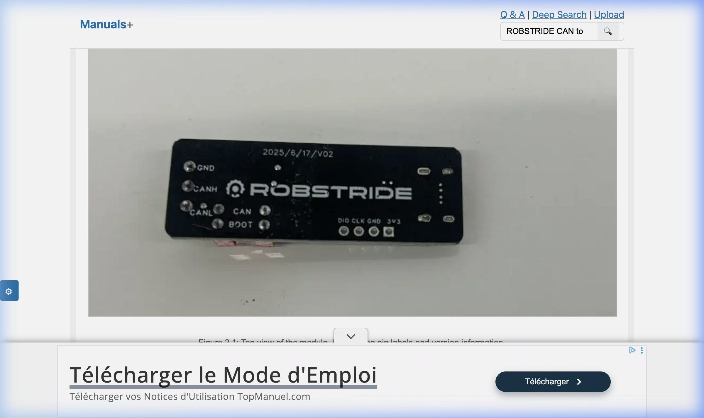
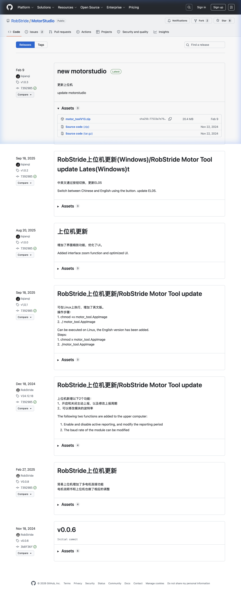

# 31 — Guide : Debug RS-05 avec le Module EL05 et MotorStudio

> *Document créé Mars 2026 — Sources : Manuel officiel EL05-EN (RobStride / Lingfoot Times Technology), GitHub RobStride/MotorStudio, Doc 13 Sécurité Électrique, Doc 04 Câblage CAN.*

Ce guide décrit comment connecter un moteur **RobStride 05 (RS-05)** au **module de debug CAN-to-USB (EL05)**, alimenter l'ensemble avec la **Wanptek DPS605U**, et piloter le moteur depuis le logiciel **MotorStudio** sur PC.

---

## 1. Matériel Requis

| Composant | Modèle | Role |
| :--- | :--- | :--- |
| **Moteur** | RobStride RS-05 | Actionneur CAN FOC |
| **Module debug** | RobStride EL05 (CAN-to-USB) | Interface PC ↔ Bus CAN |
| **Alimentation labo** | Wanptek DPS605U (60V/5A) | Puissance 24V moteur |
| **PC Windows** | — | Héberger MotorStudio |
| **Câble USB-C** | — | Relier l'EL05 au PC |
| **Câble JST-GH 4 pins** | Holybro Ø1.25mm | Relier le moteur au module |
| **Câble puissance** | XT30 mâle/femelle | Relier le moteur à la Wanptek |

> [!NOTE]
> Le module EL05 fonctionne **uniquement sur Windows** avec le logiciel MotorStudio officiel. Pour une intégration Linux/ROS2 (production), utiliser l'InnoMaker USB2CAN-C avec SocketCAN (voir Doc 05).

---

## 2. Le Module de Debug EL05 — Description Physique



Le module EL05 est une petite carte noire (version 2025/6/17/V02) composée de :

### Côté Gauche — Interface Moteur (bornes à vis)

```
┌─────────────────────────────────────────────────────┐
│  ● GND   ← Masse commune (CRITIQUE)                 │
│  ● CANH  ← Signal CAN High vers moteur              │
│  ● CANL  ← Signal CAN Low vers moteur               │
│                                                      │
│  [○ CAN ]  ← DIP Switch 2 : Résistance 120Ω        │
│  [○ BOOT]  ← DIP Switch 1 : Mode bootloader         │
│                                                      │
│  [DIO][CLK][GND][3V3] ← SWD (usage usine, NE PAS   │
│                           connecter au moteur)       │
└─────────────────────────────────────────────────────┘
                                    [USB-C] → PC
```

### Côté Droit — Port USB-C vers PC

Connexion standard USB-C vers votre ordinateur.

---

## 3. Les 2 DIP Switches — Rôle et Configuration

Le manuel officiel (EL05-EN, page 4) précise explicitement :

> *"When DIP switch 1 is in the ON position, the module enters Boot mode and cannot establish a connection with the host computer. When DIP switch 2 is in the ON position, a 120Ω terminal resistor is connected to the module port, allowing normal communication with the host computer."*

| Switch | Label PCB | **Position ON** | **Position OFF** | **Votre réglage** |
| :---: | :---: | :--- | :--- | :---: |
| **1** | **BOOT** | Mode Bootloader (mise à jour firmware du module) — **le module ne répond plus à MotorStudio** | Mode normal de communication CAN | ⬛ **OFF** |
| **2** | **CAN** | Active la résistance de terminaison **120Ω** intégrée (obligatoire si le module est en bout de bus) | Pas de résistance (si une autre terminaison existe déjà sur le bus) | ⬜ **ON** |

> [!IMPORTANT]
> **Piège classique n°1** : Si Switch 1 (BOOT) est sur ON, MotorStudio ne trouvera jamais le moteur. Vérifiez ce switch en tout premier lieu si la connexion échoue.
>
> **Règle** : Pour un test avec un seul moteur sur table (votre cas), réglez **SW1=OFF** et **SW2=ON**. C'est la configuration "banc de test" standard.

---

## 4. Pinout du Connecteur JST-GH du RS-05

Le moteur RS-05 dispose de deux ports :

### Port Puissance (XT30PB)
```
XT30 Mâle côté moteur :
  Rouge (+) → Borne (+) Wanptek (24V)
  Noir  (-) → Borne (-) Wanptek (GND)
```

### Port Communication (JST-GH 4 pins)
```
Pin 1  : CANH  → Borne CANH du module EL05
Pin 2  : CANL  → Borne CANL du module EL05  
Pin 3  : GND   → Borne GND du module EL05 (**ET** borne (-) Wanptek)
Pin 4  : BOOT  → Non connecté (réservé flash d'urgence moteur)
```

> [!WARNING]
> **La masse commune est critique.** Le GND du module EL05 (côté PC/USB) DOIT être relié au GND de l'alimentation Wanptek (côté moteur/puissance). Si ce pont de masse est absent, le signal CAN "flotte" par rapport à la référence USB → erreurs **"Bus Off"** immédiates + risque de destruction du module par différence de potentiel.

---

## 5. Schéma de Câblage Complet

```
                    ┌─────────────────────────────────────────┐
      WANPTEK        │            RS-05 MOTEUR                 │
      DPS605U        │                                         │
                    │  ┌──────────┐    ┌──────────────────┐   │
   (+) 24V ─────────┼──┤ XT30     │    │ JST-GH 4-pin     │   │
   (-) GND ─────────┼──┤ Puissance│    │ Pin1: CANH ──────┼───┼──→ CANH [EL05]
       │    │       │  └──────────┘    │ Pin2: CANL ──────┼───┼──→ CANL [EL05]
       │    │       │                  │ Pin3: GND  ───────┼───┼──→ GND  [EL05]
       │    │       └─────────────────│ Pin4: BOOT ─ N.C. │   │
       │    │                         └──────────────────┘   │
       │    └─────────────────────────────────────────────────┘
       │                        Masse commune
       └────────────────────────────────────────→ GND [EL05]

                                         [EL05]
                                  SW1(BOOT)=OFF ●○
                                  SW2(CAN) =ON  ○●
                                         │
                                      [USB-C]
                                         │
                                      [PC Windows]
                                      MotorStudio
```

---

## 6. Séquence d'Allumage (à respecter impérativement)

Référence : Doc 13 — Sécurité Électrique.

**Étape 1 — Préparer la Wanptek (hors tension)**
1. Allumez la Wanptek sans rien brancher.
2. Réglez : **Tension = 24.00V** | **Limite courant = 1.0A** (mode OCP activé).
3. Désactivez la sortie (ou éteignez temporairement).

**Étape 2 — Câbler (tout hors tension)**
1. Brancher le JST-GH du moteur sur les bornes GND/CANH/CANL du module EL05.
2. Brancher le **GND du module** au **GND (-)** de la Wanptek (masse commune).
3. Brancher le XT30 puissance du moteur sur la Wanptek.
4. Vérifier les DIP switches : SW1=OFF, SW2=ON.

**Étape 3 — Mettre sous tension**
1. ✅ Allumer la Wanptek / activer la sortie → 24V → le moteur est alimenté.
2. ✅ Brancher le câble USB-C du module EL05 sur le PC.
3. ✅ Lancer MotorStudio.

> [!CAUTION]
> Ne jamais modifier la tension de la Wanptek alors que le moteur est branché et activé. Les fluctuations peuvent détruire les MOSFETs internes du driver.

---

## 7. Installation de MotorStudio

### Téléchargement

Le logiciel est distribué sur GitHub :

**→ [https://github.com/RobStride/MotorStudio/releases](https://github.com/RobStride/MotorStudio/releases)**

Télécharger la dernière version : **`motor_toolV13.zip`** (v1.0.3 — Latest — 20.4 MB, Fév 2026).



> **Note Linux** : La version v1.0.1 précédente avait une version Linux (AppImage). La v1.0.3 est Windows uniquement. Pour Linux, utilisez directement l'InnoMaker USB2CAN + SocketCAN (voir Doc 05).

### Prérequis — Driver CH340

Le module EL05 utilise la puce série **GD32F303** (la même puce que dans le driver CH340 de nombreuses cartes Arduino). Si le module n'est pas reconnu par Windows :

1. Ouvrir le Gestionnaire de Périphériques.
2. Si vous voyez un point d'exclamation sur un port COM → installer le driver CH340.
3. Télécharger : [https://www.wch.cn/download/CH341SER_EXE.html](https://www.wch.cn/download/CH341SER_EXE.html)
4. Après installation, débrancher/rebrancher l'USB-C du module.

---

## 8. Connexion dans MotorStudio — Procédure Pas-à-Pas

### Interface de connexion

```
┌─────────────────────────────────────────────┐
│  MotorStudio v1.0.3                         │
│                                             │
│  Connect Motor                              │
│  ┌─────────────────┐  ┌──────────────────┐ │
│  │  COM7  ▼        │  │  Refresh COM     │ │
│  └─────────────────┘  └──────────────────┘ │
│  ┌──────────────────────────────────────┐  │
│  │  Open COM                            │  │
│  └──────────────────────────────────────┘  │
│                                             │
│  [Detection Devices]  [Enable]  [Stop]     │
└─────────────────────────────────────────────┘
```

### Étapes de connexion

1. **Lancer MotorStudio** (après avoir mis le moteur sous tension).
2. Cliquer sur **"Refresh COM"** → la liste des ports COM se met à jour.
3. **Sélectionner le port COM** correspondant au module EL05 (généralement COM3 à COM10 selon le PC). Si vous ne savez pas lequel, vérifiez dans le Gestionnaire de Périphériques Windows → "Ports (COM et LPT)".
4. Cliquer **"Open COM"** → le port s'ouvre.
5. Cliquer **"Detection Devices"** → MotorStudio scanne le bus CAN et trouve l'ID du moteur (par défaut ID=1 sur un RS-05 neuf).
6. Le moteur apparaît dans la liste → cliquer dessus pour accéder à ses paramètres.
7. Cliquer **"Enable"** pour activer le moteur (il sort de l'état idle).

### Paramètres importants à vérifier lors du premier allumage

| Paramètre | Valeur attendue | Note |
| :--- | :---: | :--- |
| **Motor ID** | 1 (par défaut) | À changer si plusieurs moteurs sur le même bus |
| **Baud Rate CAN** | 1 Mbps | Standard RobStride |
| **Mode** | MIT (position/vitesse/couple) | Mode le plus complet pour les tests |
| **Zero Position** | 0.0 | À recalibrer si le moteur a tourné pendant le stockage |

---

## 9. Dépannage

| Symptôme | Cause probable | Solution |
| :--- | :--- | :--- |
| Module non reconnu par Windows | Driver CH340 absent | Installer le driver CH340 |
| "Detection Devices" ne trouve rien | SW1 (BOOT) sur ON | Mettre SW1 sur **OFF** |
| Erreur "Bus Off" dans les logs | GND non partagé | Relier GND du module EL05 au GND (-) Wanptek |
| Connexion instable / perte de trames | CANH/CANL inversés | Inverser les deux fils CAN |
| OCP déclenche dès "Enable" | Limite courant trop basse (1A) | Augmenter à 2A sur la Wanptek |
| Moteur chaud mais ne bouge pas | Pas d'ordre de mouvement | Vérifier que le mode est correct (MIT vs Position) |
| Position parasite au démarrage | Offset d'encodeur | Recalibrer le zero dans MotorStudio |

---

## 10. Liens et Ressources

| Ressource | URL | Notes |
| :--- | :--- | :--- |
| **MotorStudio** (GitHub) | https://github.com/RobStride/MotorStudio/releases | Télécharger `motor_toolV13.zip` |
| **Manuel EL05-EN** (officiel) | https://lsleg.feishu.cn/wiki/Hkp4wjuXmiYxpRkFc2HciqOpnNh | Manuel complet 40 pages (Feishu, nécessite compte) |
| **Driver CH340** | https://www.wch.cn/download/CH341SER_EXE.html | Si module non reconnu par Windows |
| **Seeed Studio Wiki** | https://wiki.seeedstudio.com/robstride_actuator_modules/ | Tutoriel complémentaire |
| **Doc 04** | [04_Electronique_Cablage.md](./04_Electronique_Cablage.md) | Architecture CAN D-Bot complète |
| **Doc 13** | [13_Securite_Electrique.md](./13_Securite_Electrique.md) | Procédure sécurité Wanptek |

---

## 11. Spécifications RS-05 (Rappel)

Source : Manuel EL05-EN, page 4 — Driver Product Specifications.

| Paramètre | Valeur |
| :--- | :--- |
| Tension nominale | **48V DC** |
| Tension max. admissible | **60V DC** |
| Courant de phase nominal | 2.6A peak |
| Courant de phase max. | 11.0A peak |
| Courant en veille | ≤18 mA |
| Débit bus CAN | **1 Mbps** |
| Diamètre | Ø41mm |
| Température fonctionnement | -20°C à +50°C |
| Résolution encodeur | **14 bits** (tour absolu) |
| Rapport de réduction | 9:1 |
| Mode de contrôle | FOC |

> Pour les premiers tests (banc), utiliser **24V** au lieu de 48V nominal. Couple et vitesse seront réduits de ~50%, mais le risque en cas d'erreur est divisé par 2.
