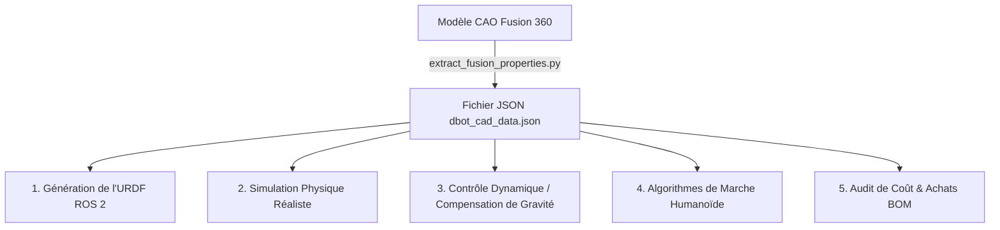

# 🛠️ Guide Pratique : Extraction CAO (Fusion 360) vers URDF & Simulation (D‑Bot)

Ce guide détaille l'utilisation et le rôle du script d'extraction géométrique et physique **`extract_fusion_properties.py`** dans le cycle de développement du robot humanoïde D-Bot. Cet outil fait le pont entre la conception mécanique 3D (Fusion 360) et les systèmes logiciels de simulation et de contrôle (ROS 2, Gazebo, Isaac Sim, MoveIt).

---

## 1. Localisation et Objectif de l'Outil

Le script est centralisé dans le répertoire de code du robot :
👉 **[extract_fusion_properties.py](../../../Code/scripts/fusion360/extract_fusion_properties.py)**

### 🎯 Pourquoi cet outil est-il crucial ?
En robotique, un modèle virtuel de robot (URDF ou SDF) nécessite une précision extrême. Renseigner manuellement les coordonnées spatiales relatives de chaque articulation et calculer les matrices d'inertie complexes à partir de la CAO est une tâche longue et source d'erreurs importantes.

Ce script automatise entièrement ce processus en parcourant récursivement l'assemblage 3D pour en extraire :
1.  **La cinématique exacte** (emplacement exact des joints au dixième de millimètre, axes de rotation réels, limites angulaires).
2.  **La physique de simulation** (masse de chaque lien, centre de gravité exact, tenseurs d'inertie).
3.  **La nomenclature mécanique (BOM)** (relevé et comptage automatique de toutes les pièces importées pour audit de cohérence).

---

## 2. Guide d'Exécution pas à pas dans Fusion 360

Le script a été conçu pour être exécuté sans aucune installation complexe :

1.  **Ouvrez le modèle 3D** du membre que vous souhaitez analyser dans Fusion 360 (Tête, Bras, Jambe, Torse, etc.).
2.  Sélectionnez l'onglet **Utilitaires** dans le ruban supérieur de Fusion 360.
3.  Cliquez sur **Scripts et compléments** (Raccourcis : `Alt + Shift + F` sur Windows ou `Option + Cmd + S` sur Mac).
4.  Dans l'onglet **Scripts**, cliquez sur le bouton **Créer** :
    *   Sélectionnez **Python**.
    *   Nommez le script : `URDF_Extractor`.
5.  Fusion 360 ouvre un fichier template dans votre éditeur de code. **Remplacez tout le code généré** par le contenu du script centralisé **[extract_fusion_properties.py](../../../Code/scripts/fusion360/extract_fusion_properties.py)**. Enregistrez et fermez l'éditeur.
6.  De retour dans Fusion 360, sélectionnez `URDF_Extractor` dans la liste et cliquez sur **Exécuter**.

### 📂 Résultats générés
Une fois l'exécution terminée, le script enregistre automatiquement deux fichiers à la racine de votre dossier partagé macOS :
*   📄 **`/Users/Shared/dbot_cad_data.json`** : Le fichier unifié contenant toutes les données extraites.
*   📝 **`/Users/Shared/dbot_cad_extractor_log.txt`** : Le journal pas à pas listant les composants traités et les éventuels avertissements géométriques.

---

## 3. Comprendre les Données du Fichier JSON Extrait

Le fichier `dbot_cad_data.json` est structuré en trois sections clés :

### A. Les `links` (Les corps rigides)
Chaque bloc rigide de l'URDF (par exemple, le cou `neck_yaw_link` ou l'avant-bras) possède ses attributs de simulation :
*   `mass_kg` : La masse théorique cumulée de tous les composants de ce link.
*   `volume_m3` : Le volume géométrique de matière.
*   `center_of_mass_m` : Coordonnées $[X, Y, Z]$ du centre de gravité du link par rapport à l'origine du monde.
*   `inertia_tensor_kg_m2` : La matrice d'inertie de rotation ($I_{xx}, I_{yy}, I_{zz}, I_{xy}, I_{yz}, I_{xz}$). C'est ce qui définit le comportement de la pièce lorsqu'elle accélère ou tourne sur elle-même.

### B. Les `joints` (Les articulations)
Définit comment les links sont connectés entre eux :
*   `type` : Revolute (liaison pivot) ou Fixed (encastrement).
*   `parent_link` & `child_link` : La relation de parenté cinématique.
*   `origin_xyz_m` : La position tridimensionnelle exacte de l'axe d'articulation dans l'espace.
*   `axis` : Le vecteur unitaire définissant l'axe physique de rotation (ex: `[0, 0, 1]` pour une rotation autour de l'axe vertical Z).
*   `limits` : Les limites angulaires minimale et maximale programmées en degrés et en radians.

### C. Le `component_breakdown` (La nomenclature récursive)
Un inventaire complet et récursif de toutes les pièces uniques présentes sous le composant parent. C'est l'outil d'audit qui a permis de détecter, par exemple, la présence de **3 roulements physiques** dans la CAO du cou là où la liste d'achat écrite n'en mentionnait que 2.

---

## 4. À quoi ces données serviront-elles plus tard ? (Applications Futures)

L'extraction de ces données CAO ne sert pas seulement à documenter le robot, elle sera exploitée dans les phases suivantes du projet D-Bot :

### 1. Génération Automatisée de l'URDF (ROS 2 & MoveIt)
L'URDF est le fichier XML universel qui décrit le robot à la pile logicielle ROS 2. En automatisant l'extraction des distances d'axes ($xyz$), nous éliminons toute erreur d'entraxe. Le planificateur de trajectoires **MoveIt** sait ainsi au millimètre près où s'arrête la tête et où commence l'environnement pour le calcul d'évitement de collision.

### 2. Simulation Physique Réaliste (Gazebo / Isaac Sim)
Dans les simulateurs physiques, si les tenseurs d'inertie (`<inertia>`) et les masses d'un robot sont faux ou laissés à zéro, le robot simulé va "s'envoler", vibrer violemment ou avoir un comportement totalement instable. L'injection des tenseurs réels calculés par notre script garantit que le robot simulé se comportera **exactement comme le robot physique réel**.

### 3. Contrôle Dynamique et Compensation de Couple (Feedforward)
Les moteurs RobStride RS-05 du D-Bot possèdent un mode de contrôle en couple (courant).
Grâce aux masses réelles et aux positions de centres de gravité extraits :
*   Le logiciel de contrôle peut calculer en temps réel le couple exercé par la gravité sur chaque articulation ($T_{grav} = m \cdot g \cdot d \cdot \sin(\theta)$).
*   Le contrôleur peut appliquer un **couple de compensation** (Feedforward) égal et opposé.
*   **Résultat concret :** La tête ou le bras du robot peut rester immobile dans n'importe quelle position inclinée sans que les moteurs n'aient à forcer activement de manière déséquilibrée, réduisant la consommation électrique et évitant la surchauffe.

### 4. Algorithmes de Marche et Stabilité (Phase 4)
Pour un robot humanoïde biped comme D-Bot, la stabilité lors de la marche repose sur le calcul en temps réel du **Centre de Masse (CoM - Center of Mass)** global du robot. En ayant la position exacte du CoM de chaque membre (tête, buste, bras, cuisses, mollets) via notre JSON, le planificateur de marche peut calculer à chaque instant si la projection du CoM global tombe bien à l'intérieur du polygone de sustentation formé par les pieds au sol.

### 5. Audit de Nomenclature (BOM) et Gestion de Projet
En analysant de manière récursive la CAO à chaque jalon de conception, on génère instantanément la liste exacte des moteurs, roulements, cartes électroniques et capteurs à commander. Cela évite les oublis de visserie ou de pièces d'usure et permet un suivi budgétaire en temps réel.
