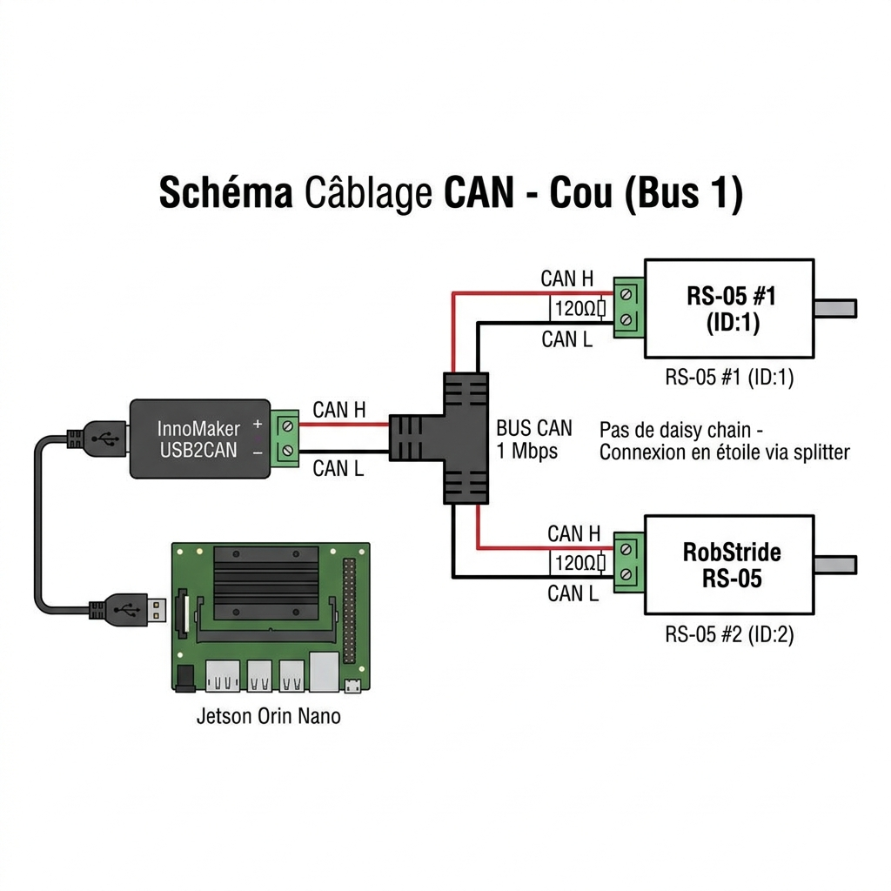

# 42 — Configuration Bus CAN : InnoMaker USB2CAN (Bus 1 — Cou)

Ce guide décrit la mise en place du **Bus CAN 1** dédié aux 2 moteurs RobStride RS-05 du cou du D-Bot, en utilisant l'adaptateur **InnoMaker USB2CAN-C** branché sur la Jetson Orin Nano.

> [!NOTE]
> Les RS-05 sont les **seuls moteurs du D-Bot sans second port CAN**. Ils ne supportent donc pas le câblage en "daisy chain" (chaîne) classique. La connexion se fait obligatoirement en **étoile via un splitter CAN** (connecteur en T ou mini-hub à 3 bornes).

---

## 1. Schéma de câblage



### Points clés du câblage
- **CAN H** (rouge) et **CAN L** (noir) partent de l'InnoMaker vers un **splitter CAN** central.
- Le splitter distribue les 2 fils vers chaque RS-05 **en parallèle**.
- Chaque RS-05 doit avoir sa **résistance de terminaison 120 Ω** active entre CAN H et CAN L (vérifiez le DIP switch ou jumper intégré à chaque moteur).
- **L'InnoMaker côté Jetson** doit également avoir sa propre résistance de terminaison 120 Ω (intégrée à l'adaptateur, vérifiez le jumper sur la carte).
- La **masse (GND)** doit être commune entre la Jetson, l'InnoMaker et les RS-05 (fil noir en parallèle sur le splitter).

---

## 2. Prérequis logiciels

Avant de commencer, installez les outils CAN sur la Jetson :
```bash
sudo apt-get update && sudo apt-get install -y can-utils
```

---

## 3. Vérification de la détection de l'InnoMaker

Branchez le câble USB de l'InnoMaker sur la Jetson, puis vérifiez :

```bash
lsusb
```

Vous devez voir une ligne contenant :
```
ID 1d50:606f OpenMoko, Inc. Geschwister Schneider CAN adapter
```

Si l'adaptateur n'apparaît pas, rechargez le module driver :
```bash
sudo modprobe gs_usb
lsusb
```

---

## 4. Vérification de l'interface réseau CAN

```bash
ip link show
```

Cherchez une ligne `can0:` dans la liste. Si absente, le module n'est pas encore chargé (voir étape précédente).

---

## 5. Activation de l'interface CAN à 1 Mbps

```bash
sudo ip link set can0 up type can bitrate 1000000
```

Vérifiez que l'interface est bien `UP` :
```bash
ip link show can0
```
Vous devez voir `<NOARP,UP,LOWER_UP>` dans la réponse.

---

## 6. Test de communication (diagnostic)

Lancez la surveillance du bus en temps réel :
```bash
candump can0
```

Si les RS-05 sont sous tension et correctement câblés, vous verrez des trames défiler, par exemple :
```
can0  141   [8]  01 00 00 00 00 00 00 00
```
> Si rien n'apparaît après 5 secondes : vérifiez le câblage physique, les résistances de terminaison, et l'alimentation des moteurs.

---

## 7. Persistance au démarrage (udev rules)

Pour donner un nom fixe à l'InnoMaker au lieu de `can0` aléatoire :

```bash
sudo nano /etc/udev/rules.d/80-can.rules
```

Ajoutez la ligne :
```text
SUBSYSTEM=="net", ACTION=="add", ATTRS{idVendor}=="1d50", ATTRS{idProduct}=="606f", NAME="can_cou"
```

Rechargez les règles :
```bash
sudo udevadm control --reload-rules && sudo udevadm trigger
```

Désormais, l'InnoMaker sera toujours reconnu sous le nom `can_cou` (au lieu de `can0` ou `can1` selon le port USB utilisé).

---

## 8. Dépannage

| Symptôme | Cause probable | Solution |
|---|---|---|
| Interface `can0` absente | Driver non chargé | `sudo modprobe gs_usb` |
| `Bus-off` | Problème physique | Vérifier torsade des fils, terminaison 120Ω, GND commun |
| `candump` vide | Moteurs non alimentés ou câblage incorrect | Vérifier l'alimentation 24-48V des RS-05 |
| Mauvais CAN ID reçu | IDs dupliqués entre les 2 RS-05 | Reconfigurer les IDs moteurs via MotorStudio |
