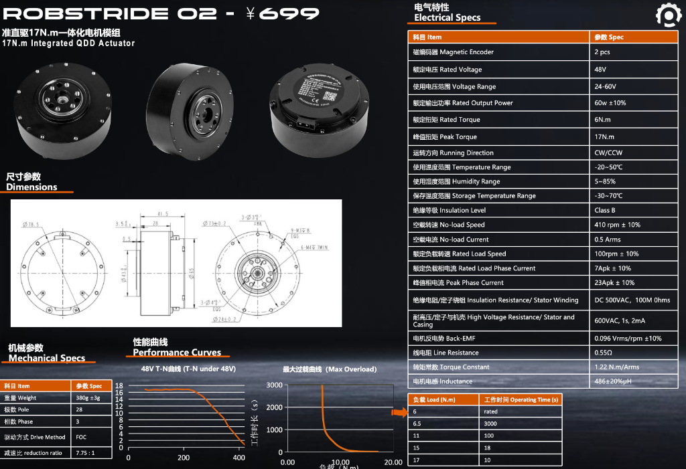
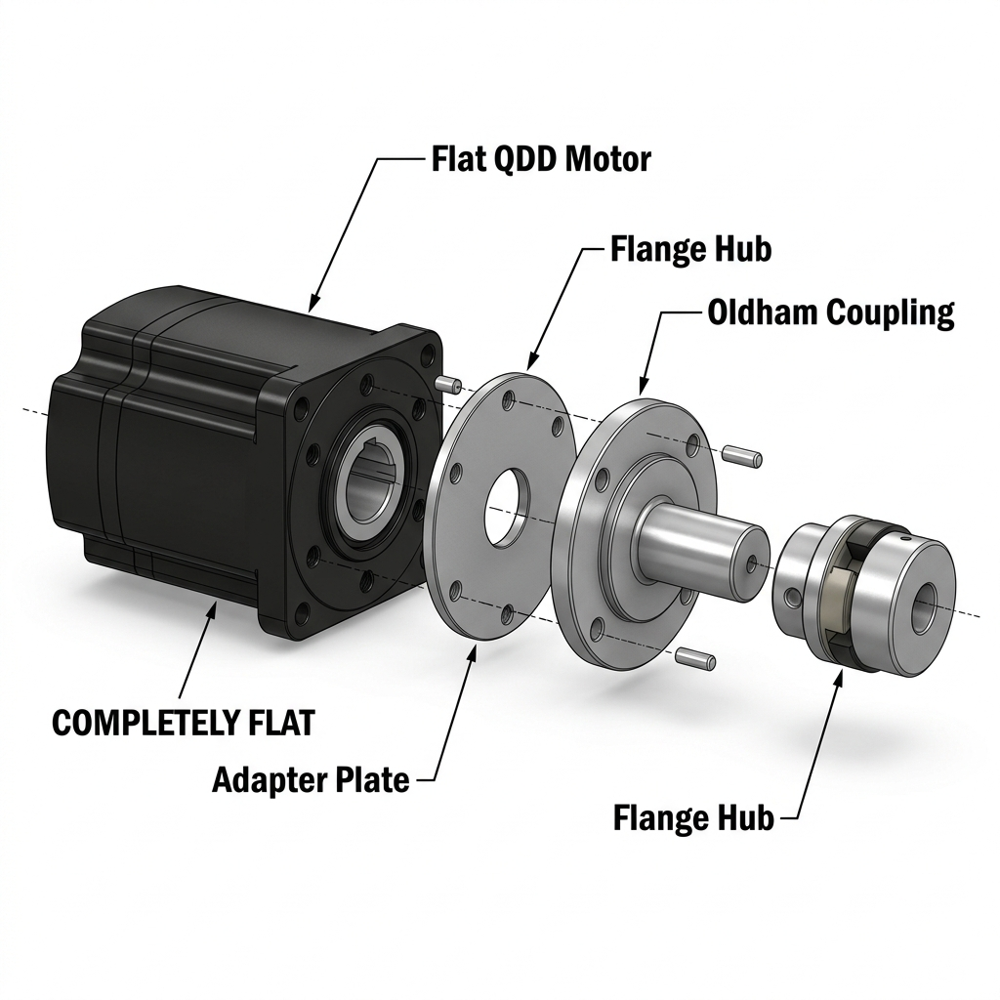
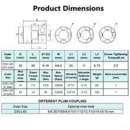

# 23 — Étude Mécanique : Découplage des Articulations et Transmission de Puissance

Cette étude fait suite à l'analyse de l'architecture biomimétique (Doc 22b) nécessitant le découplage des efforts (poids, flexion) par rapport au couple de rotation pur fourni par le moteur.

---

## 0. Spécifications Techniques : Robstride RS-02

Voici les caractéristiques officielles de l'actionneur utilisé pour le coude (Supination) :

---

## 1. La Solution du Roulement Annulaire (Slewing Ring / Thin Section)

Le principe fondamental du "découplage" en robotique est de ne jamais laisser l'arbre d'un servomoteur supporter le poids ou le bras de levier d'un membre (moment de flexion). 

La structure externe du bras doit reposer sur un **grand roulement annulaire** (ou palier). L'axe du moteur passe au centre de ce roulement et ne fait qu'entraîner la rotation.

### Types de roulements recommandés :
1. **Thin Section Bearings (Roulements à section mince)** : Très prisés en robotique car ils offrent un grand diamètre intérieur (pour passer les câbles) tout en étant ultra-légers.
2. **Cross Roller Bearings (Roulements à rouleaux croisés)** : La "Rolls-Royce" de la robotique. Les rouleaux sont disposés en X, ce qui permet à un seul roulement d'encaisser des charges radiales, axiales et des moments de renversement massifs.

### Exemples de Références Industrielles :
*   **Kaydon (Groupe SKF)** : La série *Reali-Slim®* est le standard mondial absolu pour les bras robotiques et l'aérospatial.
*   **IKO International / THK** : Leurs *Cross Roller Rings* (séries CRB, RU) sont utilisés dans 90% des articulations de cobots industriels (UR, KUKA).
*   **Silverthin** : Excellente alternative américaine, souvent plus abordable pour les prototypes.

---

## 2. Focus : Spline Coupling vs Joint Flexible

Une fois la structure portée par le roulement annulaire, il faut relier l'axe du moteur à la coque rotative. C'est ici qu'intervient l'accouplement.

### A. Spline Coupling (Accouplement Cannelé)
C'est un arbre rainuré qui s'insère dans un moyeu correspondant.
*   **Avantages** : Transmission de couple **massive**. Zéro backlash (jeu) si bien usiné. Permet un léger glissement *axial* (pratique pour l'assemblage ou la dilatation thermique). Très utilisé pour les modules "Quick-Disconnect" (démontage rapide d'un bras).
*   **Inconvénients** : **Zéro tolérance au désalignement**. Si votre moteur n'est pas parfaitement centré au dixième de millimètre avec votre grand roulement annulaire, le spline va forcer, créer des vibrations et détruire les roulements du moteur.

### B. Joint Flexible (Accouplement Élastique)
C'est un accouplement qui intègre une partie déformable (soufflet métallique, flector en élastomère, ou joint d'Oldham).
*   **Avantages** : **Tolère le désalignement** (angulaire, radial et axial). C'est le véritable "sauveur" en prototypage et en impression 3D/usinage amateur, car il absorbe les imperfections géométriques. Il amortit également les chocs dynamiques, protégeant le réducteur du moteur.
*   **Inconvénients** : Plus volumineux, et certains modèles bon marché peuvent introduire un léger backlash (jeu élastique).

> **Recommandation D-Bot** : Si vous usinez vous-même les pièces (Aluminium CNC ou Impression 3D Carbone), optez pour un **Accouplement Flexible type Oldham ou à Soufflet (Bellows)**. Il protégera vos moteurs RS-02 des inévitables micro-désalignements avec la structure.

---

## 3. Les Systèmes "Prêts à l'Emploi" (COTS - Modules Tout-en-un)

Plutôt que d'acheter un moteur d'un côté, un roulement de l'autre, et d'usiner les pièces de liaison, l'industrie a créé des modules qui intègrent tout : le moteur, l'encodeur, l'accouplement, et un énorme roulement à rouleaux croisés. 

Ces systèmes s'appellent des **Hollow Rotary Actuators** (Actionneurs Rotatifs Creux) ou **Slewing Drives**.

### Avantage majeur :
Ils possèdent un grand trou central (Hollow Bore) pour passer les câbles du poignet et des doigts directement à travers l'axe, empêchant le vrillage des câbles !

### Références commerciales (En métal, prêts à monter) :

1.  **Oriental Motor (Série DGII / DH)**
    *   *Concept* : Table tournante creuse intégrant un moteur pas-à-pas en boucle fermée et un énorme roulement à rouleaux croisés. 
    *   *Matériau* : Acier/Aluminium. Très robuste, on visse directement la charge dessus.
2.  **Harmonic Drive (Série FHA / CSF)**
    *   *Concept* : La référence absolue en robotique humanoïde. Réducteur à onde de déformation ultra-compact avec arbre creux massif. Zéro backlash absolu.
    *   *Note* : C'est ce qui équipe les bras des robots Spot (Boston Dynamics) et Optimus.
3.  **Sango Automation / Tallman Robotics**
    *   *Concept* : Fabricants asiatiques proposant des plateformes rotatives creuses (Hollow Rotary Platforms) très similaires à Oriental Motor, mais souvent vendues nues (pour y fixer votre propre moteur RS-02 via une courroie ou un joint flexible interne). 

### Conclusion pour la Conception du D-Bot
Si vous avez le budget et l'espace, l'achat d'une **Hollow Rotary Platform** nue (sans moteur) dans laquelle vous insérez votre RS-02 est la voie la plus professionnelle. La plateforme encaissera 100% des contraintes du bras de levier, et vous offrira un passage de câble parfait pour les tendons et les fils de la main.

---

## 4. Cas Spécifique : Moteurs QDD (Type Robstride RS-02)

Les moteurs quasi-directs (QDD) comme le Robstride RS-02 ou les moteurs Unitree possèdent déjà un réducteur planétaire et un roulement de sortie haute capacité intégrés. De plus, ils n'ont **pas d'arbre de transmission cylindrique**, mais une **bride plate taraudée** (ex: 6x M4).

L'utilisation d'une *Hollow Rotary Platform* externe devient alors redondante et inadaptée (double réduction). 

Pour reproduire le schéma de découplage absolu (ex: Tesla Optimus) où un grand roulement externe (Slewing Ring) encaisse le bras de levier et le moteur ne transmet que le couple via un accouplement cannelé (Spline Coupling), il faut adapter la face plate du QDD.

### Solutions COTS pour Moteurs QDD (Accouplements à Bride)

Puisque le RS-02 présente une face plate, on doit utiliser des accouplements dits **"Flange-Mounted" (Montage sur Bride)** :

1. **L'Accouplement à Denture avec Bride (Curved-Tooth Gear Coupling)**
   *   *Exemple COTS* : **KTR BoWex® FLE-PA**.
   *   *Principe* : Une bride en nylon renforcé se visse sur la face plate du RS-02. Elle possède des cannelures internes. Le bras robotique est équipé du moyeu en acier avec des dents externes bombées.
   *   *Avantage* : Transmet un couple extrême, tolère un léger désalignement grâce aux dents bombées, et autorise un glissement axial libre. C'est la solution industrielle parfaite pour imiter le "Spline Coupling" de la photo de référence.

2. **Le Moyeu Cannelé à Bride (Flanged Spline Nut)**
   *   *Exemple COTS* : Catalogue **MISUMI** ou **THK** (Série d'écrous cannelés à embase).
   *   *Principe* : Une douille métallique avec une base plate à visser se fixe sur le RS-02. Elle s'emboîte dans un arbre cannelé standard (Involute Spline Shaft).
   *   *Avantage* : Connexion métallique très rigide, idéale pour les démontages rapides (Quick-Disconnect).

3. **Accouplement Oldham à Demi-Moyeu Plat (Flange Hub Oldham)**
   *   *Exemple COTS* : **R+W Couplings** ou **KTR**.
   *   *Principe* : Remplacement du moyeu de serrage habituel par un disque plat percé, à visser sur le RS-02.
   *   *Avantage* : Excellente tolérance aux désalignements radiaux, très utile si la concentricité entre le RS-02 et le roulement externe n'est pas parfaite à 100%.

> **Note d'assemblage** : Le cercle de perçage (Bolt Circle) du RS-02 n'étant pas un standard universel pour les fabricants d'accouplements, il est souvent nécessaire de concevoir une fine **plaque d'adaptation (Adapter Plate)** usinée en aluminium de 3 à 5 mm d'épaisseur pour relier les trous du RS-02 à ceux de l'accouplement COTS choisi.

### Visualisation de l'Assemblage (Oldham à Bride)

---

### 5. Dimensionnement Critique de l'Accouplement (Cas du "Plum / Jaw Coupling")

Si vous optez pour la méthode d'assemblage "Moyeu à Bride + Accouplement" à l'aide de pièces génériques achetées sur internet (ex: AliExpress ou Amazon), **le dimensionnement physique de la pièce est critique**.

Le moteur **Robstride RS-02** produit :
*   Couple Nominal : **6 N.m**
*   Couple de Pic (Max Torque) : **17 N.m**

Beaucoup de concepteurs font l'erreur d'acheter des accouplements à mâchoires de taille **D30 L40** (Diamètre extérieur 30mm, Longueur 40mm). Voici pourquoi c'est un risque de rupture :

*(Source : [Fiche produit de référence AliExpress](https://fr.aliexpress.com/item/1005010485423495.html))*

**Analyse de la Tolérance :**
*   **Modèle D30 L40** : Autorise **14.8 N.m** en couple maximal absolu. En cas de choc mécanique ou de rattrapage d'erreur PID à pleine puissance, le moteur enverra 17 N.m. Le croisillon en élastomère se déchirera ou le moyeu glissera.
*   **Modèle D40 L50** : Autorise **20 N.m** en couple maximal absolu. C'est la taille requise. Il offre une marge de sécurité de 3 N.m au-dessus du pic absolu du RS-02, garantissant l'intégrité de l'articulation sous lourde charge dynamique.
