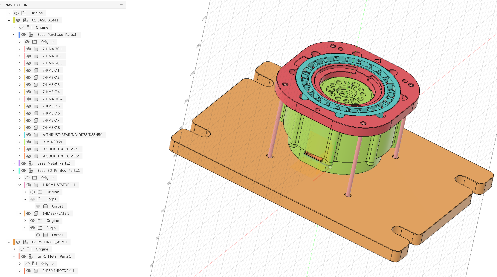
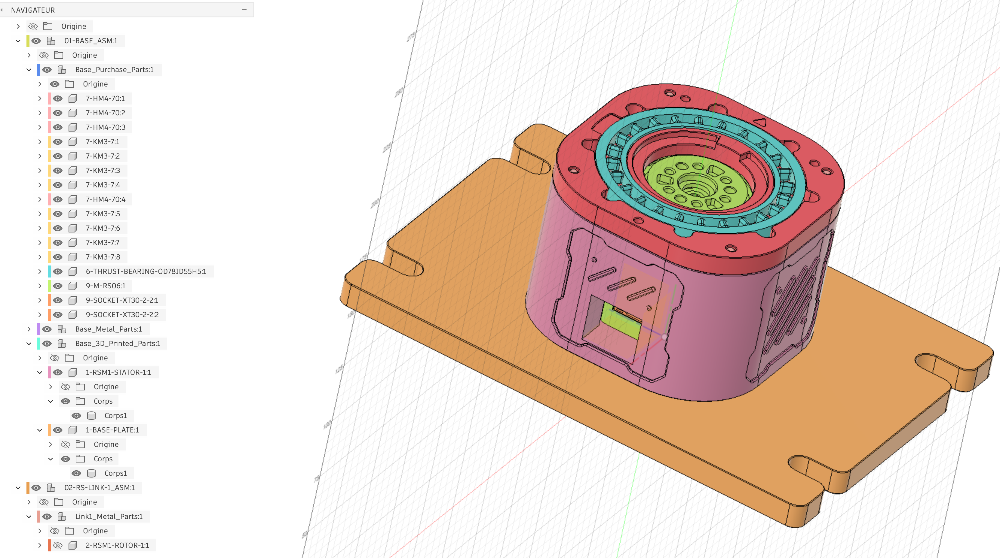
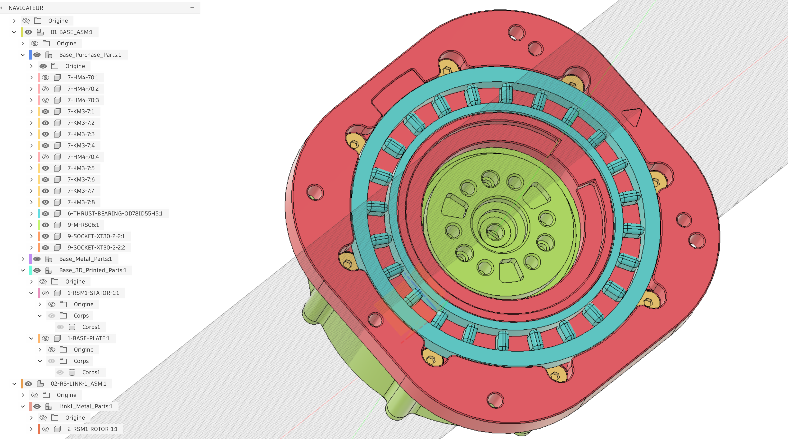
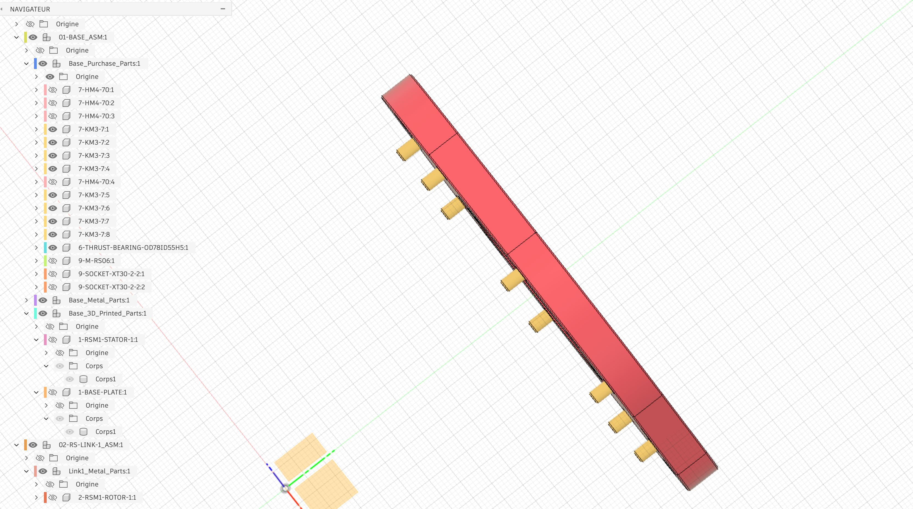
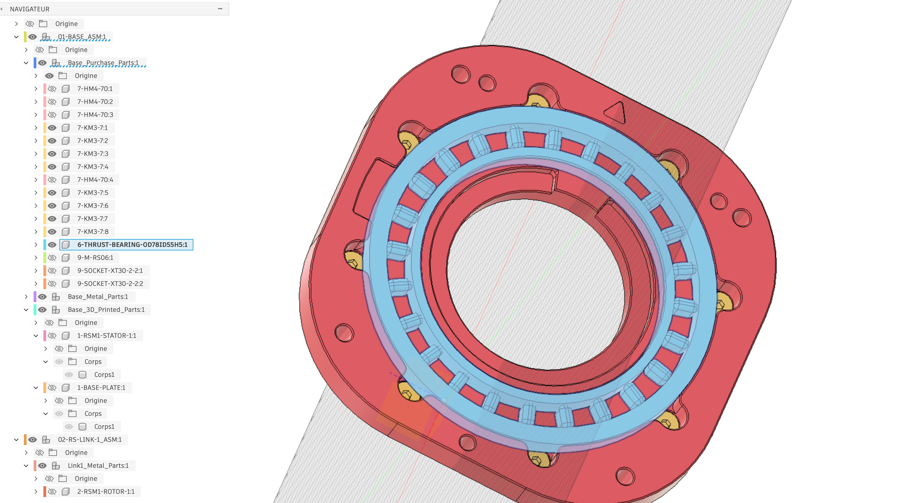
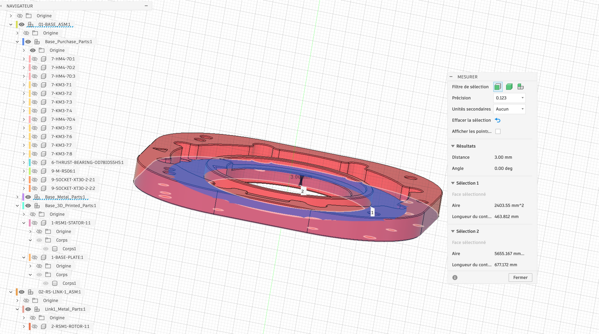
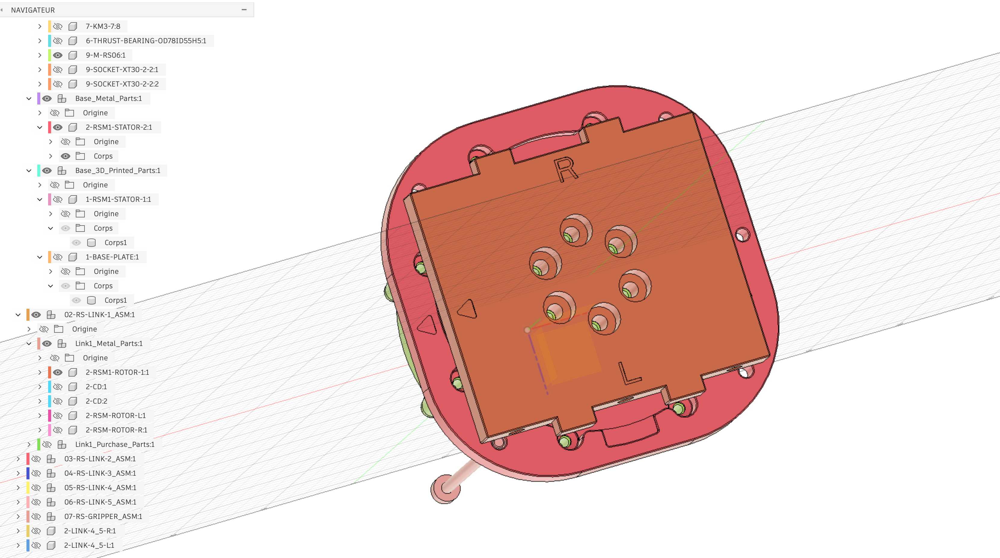
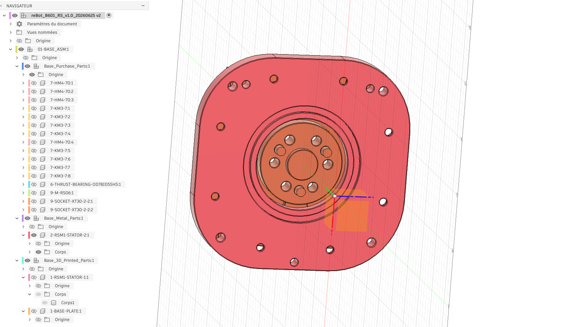
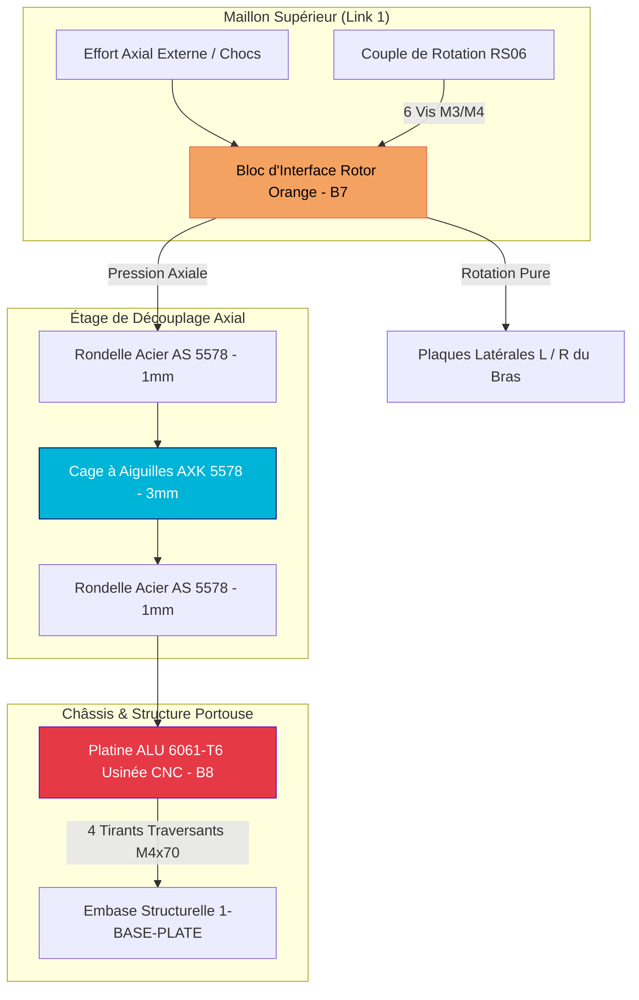

# 24 — Étude Mécanique : Bracket RS06 & Reprise d'Effort Axial par Butée à Aiguilles (reBOT B601)

Cette documentation analyse en détail le montage de support (bracket) du moteur **RobStride RS06 (RSM1)** issu du projet open-source / hybride **reBOT B601** (`reBOT_B601_RS_v1.0`).

Ce design constitue un exemple d'école pour le **découplage mécanique des charges axiales** sur des actionneurs quasi-direct-drive (QDD), une problématique centrale pour les articulations de hanches, épaules et genoux en robotique humanoïde.

---

## 1. Synthèse de l'Architecture & Problématique Mécanique

### 🔴 Le Risque sur les Actionneurs QDD
Les moteurs réductés compacts comme le **RobStride RS06** intègrent un réducteur planétaire et des roulements internes légers. S'ils excellent dans la transmission de couple pur en rotation, leurs roulements internes subissent des dégradations rapides lorsqu'ils sont soumis à des **chocs axiaux directs** (ex: impact de la jambe au sol, chutes) ou à des **moments de renversement** élevés (bras de levier).

### 🟢 La Solution de la Butée Axiale Découplée
Le montage reBOT B601 contourne ce problème en intercalant une **butée à aiguilles (`AXK 5578`)** sous le flasque de liaison du rotor :
1. **L'effort axial de compression** venant du maillon (Link 1) traverse la butée à aiguilles et est transféré directement dans la platine en aluminium usiné CNC (`2-RSM1-STATOR-2`), puis redirigé vers l'embase via **4 tirants M4×70 mm**.
2. **Le rotor du moteur** ne transmet ainsi que le **couple pur en rotation**, libéré de toute contrainte de poussée axiale.

---

## 2. Spécifications & Identification du Roulement

| Paramètre | Valeur / Référence ISO | Description / Rôle |
| :--- | :--- | :--- |
| **Composant principal** | **`AXK 5578`** | Cage axiale à aiguilles (Bore 55 mm, OD 78 mm, Épaisseur cage 3 mm) |
| **Rondelles associées** | **`AS 5578`** (×2) | Rondelles fines d'appui en acier trempé 60 HRC (Épaisseur 1 mm chacune) |
| **Épaisseur totale** | **5.00 mm** | Assemblage sandwich : Rondelle (1mm) + Cage (3mm) + Rondelle (1mm) |
| **Diamètre Intérieur (ID)** | **55 mm** | Permet d'enserrer l'épaulement central du hub rotor |
| **Diamètre Extérieur (OD)** | **78 mm** | Logé dans le lamage de la platine aluminium supérieure |
| **Fabricants ISO** | SKF, INA, Koyo, NTN, NKE | Standard universel facilement approvisionnable |

---

## 3. Analyse Détaillée de la Structure (Vue par Vue)

### Vue 1 : Assemblage Éclaté & Tirants de Reprise (`B1`)

Dans cette vue globale [rs06_bracket_b1.png](./assets/rs06_bracket_b1.png), l'arbre de construction CAD montre la structure multicouche :
* **`9-M-RS06:1`** : Le moteur RobStride RS06 (vert) positionné au centre.
* **`7-HM4-70:1..4`** : 4 vis à tête CHC M4×70 mm (rose) faisant office de **tirants de tension traversants**. Elles serrent en sandwich le flasque supérieur, le carter moteur et l'embase `1-BASE-PLATE`.
* **`2-RSM1-ROTOR-1:1`** : Le moyeu rotorique central assurant la jonction avec l'étage Link 1.

---

### Vue 2 : Carter Stator & Intégration du Moteur (`B2`)

L'image [rs06_bracket_b2.png](./assets/rs06_bracket_b2.png) montre l'assemblage opaque :
* **`1-RSM1-STATOR-1:1`** : Le carter principal (violet/rose) enveloppant le corps du moteur.
* **Connectique** : Deux fenêtres en partie basse permettent le passage des connecteurs d'alimentation et de bus CAN (**XT30**).
* **Thermal Slots** : Des ouïes d'aération latérales sont découpées pour favoriser la convection de l'air autour du moteur.

---

### Vue 3 : Cage à Aiguilles & Couronne de Fixation (`B3`)

En vue plongeante [rs06_bracket_b3.png](./assets/rs06_bracket_b3.png), la butée à aiguilles cyan (`6-THRUST-BEARING-OD78ID55H5:1`) est clairement visible :
* Les aiguilles cylindriques sont réparties radialement dans leur couronne en plastique/acier.
* **8 vis M3 fraisées** (`7-KM3-7:1..8`, en jaune) sont réparties sur le pourtour pour brider la rondelle de retenue sur la platine.
* Le centre rotorique vert présente son plan de perçage multi-trous pour le raccordement du maillon supérieur.

---

### Vue 4 : Profil de la Platine et Portée de Vis (`B4`)

La vue latérale [rs06_bracket_b4.png](./assets/rs06_bracket_b4.png) montre la géométrie du flasque métallique rouge (`2-RSM1-STATOR-2:1`) et le débordant des 8 vis d'assemblage M3.

---

### Vue 5 : Zoom sur le Composant Roulement `AXK 5578` (`B5`)

L'image [rs06_bracket_b5.png](./assets/rs06_bracket_b5.png) met en évidence l'élément d'achat `6-THRUST-BEARING-OD78ID55H5:1` dans le navigateur CAD Fusion 360, confirmant les dimensions géométriques exactes (OD 78 mm, ID 55 mm, H 5 mm).

---

### Vue 6 : Cotation du Logement Usiné (`B6`)

L'outil de mesure Fusion 360 dans [rs06_bracket_b6.png](./assets/rs06_bracket_b6.png) indique une profondeur de logement de **3.00 mm**, correspondant exactement à l'encastrement de la cage axiale `AXK 5578`.

---

### Vue 7 : Interface Rotor & Marquages L/R (`B7`)

L'image [rs06_bracket_b7.png](./assets/rs06_bracket_b7.png) dévoile la pièce d'interface supérieure (orange) du maillon `02-RS-LINK-1_ASM` :
* **Fixation Rotor** : Vissée au centre par 6 vis à tête fraisée directement sur le moyeu du RS06.
* **Indexation L / R** : Les gravures **Right / Left** détrompent le sens de montage des plaques latérales (structure en chape) du bras.
* **Surface d'appui** : La face inférieure de ce bloc orange vient appuyer contre la rondelle supérieure `AS 5578` de la butée.

---

### Vue 8 : Platine Métallique CNC (`2-RSM1-STATOR-2`) (`B8`)

L'image [rs06_bracket_b8.png](./assets/rs06_bracket_b8.png) confirme un détail mécanique fondamental dans l'arbre de création :
* La platine rouge fait partie du sous-dossier **`Base_Metal_Parts:1`**. Il s'agit d'une **pièce en aluminium 6061-T6 usinée CNC**.
* L'alésage central présente la gorge/épaulement rectifié accueillant la butée axiale, garantissant une rigidité parfaite et zéro déformation sous forte charge.

---

## 4. Diagramme du Transfert des Charges

---

## 5. Guide de Conception pour nos Futurs Designs D-Bot

> [!IMPORTANT]
> **Leçons à retenir pour l'intégration des moteurs RobStride (RS06, RS04, RS02) sur D-Bot :**

### 1. Choix du Matériau pour les Portées de Butée (Alu CNC vs Impression 3D)
* 🛑 **Ne JAMAIS faire porter une butée à aiguilles sur du plastique imprimé 3D**. Sous l'effet de la charge, les aiguilles ou la rondelle d'appui encastreront le plastique, provoquant un désalignement et de la friction.
* ✅ **Toujours utiliser une pièce en aluminium usiné CNC** (comme la platine rouge `2-RSM1-STATOR-2`) pour garantir la planéité et le maintien rigide de la rondelle trempée `AS 5578`.

### 2. Gestion du Fluage des Vis de Tirant (Tie-Rod Creep)
* Les vis M4×70 mm traversant le carter imprimé `1-RSM1-STATOR-1` subissent une tension permanente. Le plastique sous tension finit par fluer avec le temps et la chaleur.
* 💡 **Recommandation D-Bot** : Insérer des **entretoises métalliques (tubes alu ou entretoises laiton)** autour des vis M4 à l'intérieur des alésages du carter plastique pour assurer un contact métal-sur-métal rigide.

### 3. Limitation des Butées Simples Axiales (`AXK`)
* ⚠️ Une butée `AXK` ne reprend que la **compression**. Si l'articulation est sujette à la **traction** (bras tiré) ou à des **moments de flexion alternés**, la butée se décollera.
* 💡 **Recommandation D-Bot** : Pour les articulations 3D omnidirectionnelles (ex: Hanches ou Épaules), privilégier les **roulements à rouleaux croisés (Cross Roller Bearings type CRB / RU)** ou des roulements à contact oblique montés en opposition.

### 4. Lubrification et Étanchéité
* Les cages `AXK 5578` sont des roulements ouverts. Appliquer une **graisse forte pression au lithium (NLGI 2)** lors du montage et prévoir une lèvre cache-poussière si l'environnement est exposé aux particules.
